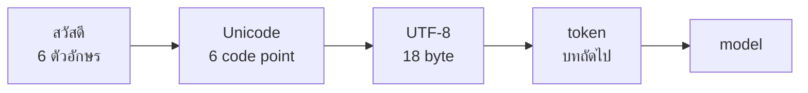

# บทพื้นฐานที่ 1 ข้อความคือตัวเลข

คุณพิมพ์ สวัสดี ลงในช่องแชท กดส่ง แล้วอีกฝั่งตอบกลับมาราวกับอ่านออก มันไม่ได้อ่าน
ออก มันไม่เคยเห็นตัว ส ตัว ว หรือไม้หันอากาศเลย สิ่งที่ไปถึงอีกฝั่งคือตัวเลขสิบแปดตัว
เรียงกัน และทุกอย่างที่เกิดขึ้นหลังจากนั้น ตั้งแต่การเข้าใจ การตอบ ไปจนถึงใบแจ้ง
หนี้ตอนสิ้นเดือน ล้วนทำกับตัวเลขสิบแปดตัวนั้น

หนังสือทั้งเล่มตั้งอยู่บนข้อเท็จจริงนี้ และภาคพื้นฐานมีไว้เพื่อให้คุณเห็นมันด้วยตา
ก่อนจะเชื่อ บทนี้เดินจากตัวอักษรไปถึงตัวเลขทีละขั้น ด้วยโค้ดที่รันได้บนเครื่องคุณ
โดยไม่ต้องมี model ไม่ต้องมี API key และไม่ต้องติดตั้งอะไรนอกจาก Python

ถ้าคุณเคยเขียนโปรแกรมและรู้จัก Unicode กับ UTF-8 อยู่แล้ว หัวข้อที่ 2 กับ 3 ข้ามได้
แต่หัวข้อที่ 4 อ่านเถอะ เพราะมันคือจุดที่ภาษาไทยต่างจากภาษาอังกฤษ และเป็นจุดที่คน
เขียนโปรแกรมภาษาไทยพลาดกันมาก

## 1. NLP คือการทำให้คอมพิวเตอร์ทำอะไรบางอย่างกับภาษา

NLP (natural language processing) เป็นชื่อรวมของ
ทุกความพยายามที่จะให้คอมพิวเตอร์ทำงานกับภาษาที่คนใช้จริง ไม่ใช่ภาษาที่ออกแบบ
มาให้เครื่องอ่าน แปลประโยค สรุปบทความ ตอบคำถาม จับว่ารีวิวนี้ชมหรือด่า ทั้งหมด
คือ NLP

มันมีอายุราวเจ็ดสิบปี และเปลี่ยนวิธีคิดใหญ่ๆ มาสามครั้ง ยุคแรกคือกฎ คนเขียนกฎ
ไวยากรณ์ลงไปในโปรแกรมทีละข้อ ประธานตามด้วยกริยา กริยาตามด้วยกรรม มันทำงานได้
กับประโยคที่คนเขียนกฎนึกถึง และพังกับประโยคที่เหลือทั้งหมด ซึ่งคือประโยคส่วนใหญ่
ที่คนพูดจริง

สมมติเขียนกฎว่าทุกประโยคต้องมีประธาน แล้วป้อนประโยคว่า ไปไหนมา ให้มัน โปรแกรมตอบ
ว่าผิดไวยากรณ์ ทั้งที่คนไทยพูดแบบนี้ทุกวัน แล้วกรณีถัดไปก็ต้องมีกฎของมันอีก

ยุคที่สองคือสถิติ แทนที่จะเขียนกฎ ให้นับ ถ้าคำว่า กิน ตามด้วยคำว่า ข้าว บ่อยกว่า
ตามด้วยคำว่า โต๊ะ โปรแกรมก็เรียนรู้เองว่า กินข้าว น่าจะถูก การนับไม่ต้องมีใคร
เข้าใจไวยากรณ์ มันต้องการแค่ข้อความจำนวนมากกับตัวนับ วิธีนี้ชนะวิธีแรกขาด และ
บทพื้นฐานที่ 3 จะให้คุณสร้างมันเองในห้าสิบบรรทัด

ยุคที่สามคือ neural network (โครงข่ายประสาทเทียม คือฟังก์ชันก้อนใหญ่ที่มีตัวเลขนับล้านตัว
ข้างใน) ในสาระสำคัญมันยังคงเป็นการนับ แต่นับด้วยวิธีที่จับรูปแบบไกลกว่าคำที่อยู่ติดกัน
model ทุกตัวที่คุณจะเรียกในหนังสือเล่มนี้อยู่ในยุคนี้

ถ้าอยากมีปีไว้ยึด ยุคที่สามมีจุดเปลี่ยนสองจุด ปี 2013 Word2Vec แสดงว่าคำกลายเป็น vector
ที่มีความหมายได้ นั่นคือเรื่องของบทพื้นฐานที่ 5 ปี 2017 บทความชื่อ Attention Is All You
Need เสนอ transformer นั่นคือเรื่องของบทที่ 6 ปีถัดมา BERT กับ GPT สร้างบนโครงนั้น
และ model ทุกตัวที่คุณจะเรียกคือลูกหลานของสองตัวนี้

งานที่ NLP ทำมีหลายอย่าง และการรู้ชื่อมันช่วยเวลาอ่านเอกสารต่อ

| งาน | ตัวอย่าง |
| --- | --- |
| classification | จัดหมวดข่าว จับสแปม วิเคราะห์ว่ารีวิวชมหรือด่า |
| named entity recognition | ดึงชื่อคน องค์กร สถานที่ ออกจากข้อความ |
| machine translation | แปลภาษา |
| summarization | ย่อเอกสารยาวให้สั้น |
| question answering | ตอบคำถามจากเอกสาร ซึ่งคือสิ่งที่ chatbot และ RAG ทำ |
| information extraction | ดึงความสัมพันธ์ระหว่างสิ่งต่างๆ ออกมาเป็นโครงสร้าง |
| language modeling | ทายคำถัดไป ซึ่งคือทุกงานข้างบนในยุคปัจจุบัน |

แถวสุดท้ายคือประเด็น ยุคก่อนหน้าแต่ละงานมี model ของตัวเอง ยุคนี้ทุกงานถูกทำด้วย
model ตัวเดียวที่ทายคำถัดไป โดยเขียนงานเป็นข้อความให้มันเขียนต่อ บทพื้นฐานที่ 3 สร้าง
ตัวทายคำถัดไป และบทที่ 7 แสดงว่าทำไมการทายคำถัดไปถึงกลายเป็นการตอบคำถามได้

ทั้งสามยุคมีสิ่งเดียวที่เหมือนกัน คอมพิวเตอร์ทำงานกับตัวเลขเท่านั้น ก่อนที่กฎ สถิติ
หรือ neural network จะแตะอะไรได้ ตัวอักษรต้องกลายเป็นตัวเลขก่อน และเส้นทางนั้น
มีสองขั้นครับ

## 2. ขั้นแรก ทุกตัวอักษรมีเลขประจำตัว

ก่อนจะเก็บหรือส่งอะไร ตัวอักษรทุกตัวบนโลกมีเลขจำนวนเต็มประจำตัวหนึ่งตัว และเป็น
เลขเดียวกันบนทุกเครื่อง ข้อตกลงนั้นชื่อ Unicode (ยูนิโค้ด คือตารางกลางที่จับคู่
ตัวอักษรทุกภาษากับตัวเลข) และมันคือเหตุผลเดียวที่ข้อความไทยที่พิมพ์บนโทรศัพท์
ในกรุงเทพ ไปโผล่บนหน้าจอในโตเกียวเป็นตัวอักษรเดิม

ก่อนมีข้อตกลงนี้ แต่ละประเทศมีตารางของตัวเอง ไฟล์ไทยที่เปิดบนเครื่องที่ตั้งตาราง
ของอีกภาษาไว้ ออกมาเป็นตัวอักษรมั่วทั้งไฟล์ เพราะเลข 161 คนละตารางคือคนละตัวอักษร

```python
def code_points(text):
    """The number Unicode gives each character."""
    return [ord(character) for character in text]
```

`ord` คือฟังก์ชันของ Python ที่ถามตาราง Unicode ว่าตัวอักษรนี้เลขอะไร ตัว ก อยู่ที่
3585 ซึ่งเขียนแบบที่คนทำงานกับ Unicode เขียนกันว่า U+0E01 ตัว a อยู่ที่ 97 ตัวเลข
พวกนี้ไม่มีความหมายในตัวเอง มันเป็นแค่ที่นั่งในตาราง แต่ที่นั่งนั้นตายตัวและทุก
คนเห็นตรงกัน

ตรงนี้ยังไม่มีอะไรแพงหรือถูก ทุกตัวอักษรได้เลขหนึ่งตัวเท่ากันหมด ความไม่เท่ากัน
เริ่มที่ขั้นถัดไป

## 3. ขั้นที่สอง เลขประจำตัวกลายเป็น byte

เครื่องไม่ได้เก็บเลข 3585 ตรงๆ มันเก็บเป็น byte (ไบต์ คือแปดบิตที่เก็บเลขได้ 0 ถึง 255)
และ 3585 ใหญ่กว่า 255 จึงต้องใช้หลาย byte ต่อกันวิธีที่ตกลงกันว่าจะแบ่งเลขใหญ่ลงหลาย
byte ยังไง ชื่อ UTF-8

```python
def utf8_bytes(text):
    """The bytes that actually travel over the wire or sit on disk."""
    return list(text.encode("utf-8"))
```

UTF-8 ถูกออกแบบให้ตัวอักษรในตาราง ASCII เดิม ซึ่งคือตัวอักษรละตินกับเครื่องหมาย
ที่คอมพิวเตอร์ยุคแรกใช้ กินหนึ่ง byte พอดี ทุกอย่างนอกตารางนั้นกินมากกว่า ตัว
อักษรไทยทุกตัวกินสาม

```python
def cost(text):
    """Characters, bytes, and how many bytes each character cost on average."""
    characters = len(text)
    byte_count = len(text.encode("utf-8"))
    return {
        "characters": characters,
        "bytes": byte_count,
        "bytes_per_character": byte_count / characters if characters else 0.0,
    }
```

รันกับสองคำนี้แล้วดูตัวเลข

```text
'hello'   5 characters   5 bytes   1.0 per character
'สวัสดี'  6 characters  18 bytes   3.0 per character
```

คำทักทายหนึ่งคำ ความหมายเท่ากัน ที่เก็บต่างกันสามเท่า ไม่มีอะไรในนี้ตัดสินว่าภา
ษาไหนดีกว่า มันคือลำดับที่ตารางถูกเติม ตัวอักษรละตินมาก่อนจึงได้ที่นั่งถูกๆ ตัว
อักษรไทยมาทีหลังจึงได้ที่นั่งไกลออกไป และที่นั่งไกลต้องใช้เลขใหญ่ เลขใหญ่ต้อง
ใช้ byte มาก

สามเท่านี้ไปโผล่ในที่ที่ไม่มีใครคิดถึง คอลัมน์ในฐานข้อมูลที่ตั้งไว้ว่ารับ 255
ตัวอักษร ถ้ามันนับเป็น byte ข้อความไทยจะเต็มตั้งแต่ราว 85 ตัวอักษร และคนกรอกฟอร์ม
จะเห็นแค่ว่าที่อยู่ของเขาหายไปครึ่งหนึ่ง โดยไม่มีอะไรแจ้ง

จำอัตราส่วนสามต่อหนึ่งนี้ไว้ เพราะบทพื้นฐานที่ 2 จะเจอมันอีกครั้งในหน่วยที่ต่าง
ออกไป และครั้งนั้นมันจะมีราคาเป็นเงินครับ

## 4. สิ่งที่เห็นไม่ใช่สิ่งที่เก็บ

มองคำว่า สวัสดี บนหน้าจอ คุณเห็นห้าช่อง ส ว ส ด ี โดยมีไม้หันอากาศลอยอยู่บนตัว ว แต่
`cost` บอกว่ามีหกตัวอักษร ตัวที่หกคือไม้หันอากาศ เพราะในสายตาของ Unicode ไม้หันอากาศไม่ใช่
ส่วนหนึ่งของตัว ว มันคือตัวอักษรของตัวเอง ที่มีคุณสมบัติพิเศษว่าให้วาดซ้อนบน
ตัวก่อนหน้า

```python
def combining_marks(text):
    """The characters that are not letters but marks stacked on a letter."""
    return [c for c in text if unicodedata.category(c).startswith("M")]
```

Unicode จัดหมวดตัวอักษรทุกตัว และหมวดที่ขึ้นต้นด้วย M คือ mark (ตัวอักษรที่ไม่ยืนเองแต่เก
าะตัวอื่น) สระบนล่างของไทยและวรรณยุกต์ทั้งหมดอยู่ในหมวดนี้ใน สวัสดี มีสองตัว คือไม้หันอาก
าศและสระอี

เรื่องนี้ดูเป็นรายละเอียด จนกว่าคุณจะเขียนโปรแกรมที่นับตัวอักษรเพื่อตัดข้อความ
หรือจำกัดความยาว คนเห็นห้าช่อง โปรแกรมนับหก ถ้าจำกัดไว้ที่ห้าตัวอักษร สระอี
จะถูกตัดทิ้ง และคำที่เหลือคือ สวัสด ซึ่งไม่ใช่คำ นี่ไม่ใช่ปัญหาของ model มันเป็น
ปัญหาของทุกโปรแกรมที่แตะภาษาไทย และ model ก็เป็นโปรแกรมแบบนั้นตัวหนึ่ง

## 5. แล้ว model เห็นอะไร

ตอนนี้คุณมีข้อความเป็นแถวของ byte แล้ว และอาจคิดว่า model รับแถวนี้ไปตรงๆ มันไม่รับ

byte ละเอียดเกินไป คำว่า สวัสดี เป็นสิบแปดหน่วย และ model ที่ต้องเรียนรู้ความหมาย
จากหน่วยละหนึ่งในสิบแปดของคำ จะเรียนช้าและแพงกว่าที่ควร ในทางกลับกัน คำทั้งคำ
ก็หยาบเกินไป เพราะภาษามีคำไม่รู้จบ และคำใหม่ที่ไม่เคยเห็นจะไม่มีเลขให้

สมมติหน่วยคือคำ แล้วผู้ใช้พิมพ์ชื่อยาที่เพิ่งขึ้นทะเบียนปีนี้ คำนั้นไม่มีเลขใน
ตาราง model จึงไม่มีอะไรจะรับเข้าไปเลย ทั้งที่มันรู้จักทุกคำที่อยู่รอบข้าง



คำตอบอยู่ตรงกลาง มันชื่อ token และเป็นเรื่องของบทถัดไป สิ่งที่บทนี้ต้องการให้คุณ
ถือออกไปมีแค่สองอย่าง ข้อความคือตัวเลขตั้งแต่ก่อน model จะเกิด และภาษาไทยเริ่ม
จ่ายแพงกว่าตั้งแต่ชั้นนี้ ก่อนจะถึงชั้นที่คิดเงินจริงครับ

## 6. สรุป

- คอมพิวเตอร์ทำงานกับตัวเลขเท่านั้น NLP ทุกยุคเริ่มจากการแปลงตัวอักษรเป็นตัวเลข

- ขั้นแรกคือ Unicode ทุกตัวอักษรได้เลขประจำตัวหนึ่งตัว เท่ากันหมดทุกภาษา

- ขั้นที่สองคือ UTF-8 เลขประจำตัวกลายเป็น byte ละตินหนึ่ง ไทยสาม

- สระบนล่างและวรรณยุกต์เป็นตัวอักษรของตัวเอง สิ่งที่เห็นบนจอนับไม่เท่ากับสิ่ง
  ที่เก็บ

- model ไม่รับ byte ตรงๆ หน่วยที่มันรับอยู่ระหว่าง byte กับคำ และเป็นหน่วยที่คิดเงิน

## โค้ดที่ลงมือทำเรื่องนี้

ทุกฟังก์ชันในบทนี้อยู่ใน
[foundations/01-text-is-numbers/text.py](../foundations/01-text-is-numbers/text.py) รัน `python text.py` เพื่อดูทุกตัวอักษรของ hello และ สวัสดี พร้อมเลขและ byte ของมันแล้วรัน `python check.py` เพื่อยืนยันว่าตัวเลขในบทนี้คือตัวเลขบนเครื่องคุณ

## อ่านต่อ

- Jurafsky และ Martin หนังสือ Speech and Language Processing ฉบับร่างออนไลน์ อ่านฟรี บทที่ 2 ว่าด้วยข้อความ regular expression และการนับคำ คือยุคที่หนึ่งกับสองของบทนี้ในแบบเต็ม

- มาตรฐาน Unicode บทที่ 2 General Structure อธิบายว่าทำไม code point กับ byte เป็นคนละชั้น และ UTF-8 ถูกออกแบบให้ ASCII ไม่เปลี่ยน
