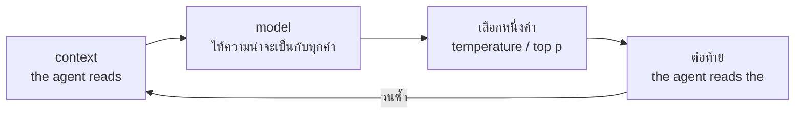

# บทพื้นฐานที่ 3 model ทำอย่างเดียว คือทายคำถัดไป

ตั้งค่า temperature เป็นศูนย์ ยื่นคำว่า the ให้ แล้วดูว่ามันเขียนอะไร

```text
the agent reads the agent reads the agent reads the agent reads the
```

มันติดอยู่ใน loop หลัง the คำที่น่าจะเป็นที่สุดคือ agent หลัง agent คือ reads หลัง
reads คือ the แล้ววนกลับ model ตัวนี้ยาวห้าสิบบรรทัดและสร้างด้วยการนับ แต่รูปร่าง
ของความผิดพลาดนี้คือรูปร่างเดียวกับที่บทที่ 2 ของหนังสือเรียกว่า doom loop และ
เกิดกับ model ที่ใหญ่กว่านี้พันล้านเท่า ด้วยเหตุผลเดียวกันเป๊ะ

บทนี้สร้าง model ตัวนั้น มันไม่ใช่ของเล่นที่ทำเลียนแบบของจริง มันคือของจริงในยุคที่
สองของ NLP ตามบทพื้นฐานที่ 1 และทุกสิ่งที่ model ยุคปัจจุบันทำ มันทำในรูปที่คุณ
อ่านออกทั้งหมดในครั้งเดียว

## 1. language model คือฟังก์ชันที่ให้ความน่าจะเป็นกับคำถัดไป

นี่คือประโยคเดียวที่ต้องจำ language model (แบบจำลองภาษา คือฟังก์ชันที่รับข้อความ
ที่มาก่อน แล้วให้ความน่าจะเป็นกับทุกคำที่อาจตามมา) ไม่ได้เข้าใจ ไม่ได้คิด ไม่ได้
จำ มันรับสิ่งที่มาก่อน แล้วตอบว่าคำถัดไปน่าจะเป็นอะไรบ้าง มากน้อยเท่าไหร่

การแชท ความจำที่ดูเหมือนมี บุคลิก ทั้งหมดถูกสร้างซ้อนบนฟังก์ชันนี้ และบทพื้นฐาน
ที่ 7 จะให้เห็นว่าซ้อนยังไง แต่ก่อนจะไปถึงตรงนั้น ต้องเห็นตัวฟังก์ชันเปล่าๆ ก่อน
เพราะทุกคุณสมบัติที่ดูเหมือนเวทมนตร์ของ model ล้วนอธิบายได้จากข้อจำกัดของ
ฟังก์ชันนี้

ไฟล์นี้ทำงานกับคำแทน token ของบทก่อน เพราะคำอ่านง่ายกว่าบนหน้ากระดาษ สลับเป็น
token id แล้วไม่มีบรรทัดไหนของ model เปลี่ยน

## 2. การฝึกคือการนับ

```python
def train(text, n=2):
    """Count what follows each run of n minus one words."""
    following = defaultdict(Counter)
    tokens = words(text)
    for i in range(len(tokens) - n + 1):
        context = tuple(tokens[i : i + n - 1])
        following[context][tokens[i + n - 1]] += 1
    return following
```

เดินผ่านข้อความทีละคำ ทุกครั้งที่เจอคำหนึ่งตามหลังอีกคำหนึ่ง บวกหนึ่งในช่องนั้น
จบ นั่นคือการฝึกทั้งหมด ไม่มีความฉลาดซ่อนอยู่ มีแต่ตารางว่าอะไรเคยตามหลังอะไร
กี่ครั้ง

รันกับข้อความในไฟล์แล้วดูว่าหลังคำว่า the มีอะไรบ้าง

```text
after 'the' the model has seen {'agent': 8, 'file': 2, 'tool': 2, 'result': 2, 'model': 3, ...}
```

agent แปดครั้ง model สามครั้ง ที่เหลือหนึ่งถึงสอง หารด้วยยี่สิบสองซึ่งคือจำนวน
ครั้งที่ the ปรากฏ ได้ความน่าจะเป็น agent สามสิบหกเปอร์เซ็นต์ model สิบสาม และ
นั่นคือสิ่งที่ model ตัวนี้รู้เกี่ยวกับคำว่า the ทั้งหมด

model จริงไม่ได้เก็บเป็นตาราง เพราะตารางจะใหญ่เกินจักรวาลถ้า context ยาวกว่าสอง
สามคำ มันเก็บเป็นตัวเลขนับพันล้านตัวที่ถูกปรับให้ให้คำตอบใกล้เคียงกับตารางนี้
โดยไม่ต้องมีตาราง แต่คำถามที่มันตอบคือคำถามเดียวกัน อะไรตามหลังสิ่งนี้ กี่ครั้ง
จากทั้งหมดกี่ครั้ง

## 3. จากจำนวนนับเป็นการเลือก และปุ่มที่ชื่อ temperature top k top p

การมีความน่าจะเป็นยังไม่ใช่การเขียน ต้องเลือกคำจริงๆ หนึ่งคำ

```python
def next_word(model, context, temperature=1.0, rng=random):
    """Choose the next word given the context, or None if it is unknown."""
    counts = model.get(tuple(context))
    if not counts:
        return None
    if temperature == 0:
        return max(counts, key=counts.get)
    weights = [count ** (1 / temperature) for count in counts.values()]
    return rng.choices(list(counts), weights=weights, k=1)[0]
```

วิธีเลือกมีสองแบบ เอาคำที่นับได้มากที่สุดเสมอ หรือสุ่มโดยให้คำที่นับได้มากมี
โอกาสมาก แบบแรกคือ temperature (อุณหภูมิ คือตัวเลขที่ปรับว่าการสุ่มจะ
เชื่อความน่าจะเป็นมากแค่ไหน) ที่ค่าศูนย์ และมันคือสาเหตุของ loop ตอนเปิดบท เพราะ
เมื่อทุกการเลือกคือคำที่น่าจะเป็นที่สุด เส้นทางที่เดินจะเป็นเส้นทางเดียวเสมอ
และเส้นทางเดียวที่วนกลับมาที่เดิมจะวนไปตลอดกาล

temperature ทำงานด้วยการยกกำลังจำนวนนับด้วยหนึ่งหารด้วยมัน ที่ค่าหนึ่ง จำนวนนับถูกใช้ตาม
เดิม ที่ค่าต่ำกว่าหนึ่ง คำที่นับได้มากจะยิ่งได้เปรียบ ที่ค่าสูงกว่าหนึ่ง ช่องว่าง
ระหว่างคำที่น่าจะเป็นกับไม่น่าจะเป็นหดลง และ model กล้าเสี่ยงมากขึ้น

```text
temperature 0
   the agent reads the agent reads the agent reads the agent reads the
temperature 1.0
   the agent reads the agent decides again . the agent reads the agent
temperature 2.0
   the tool and the agent decides again . the agent decides what to
```

นี่คือปุ่มเดียวกับที่ API ทุกเจ้าเรียกว่า temperature และบทที่ 12 ของหนังสือ
พูดถึงตอนตั้งค่า provider พอเห็นมันเป็นเลขยกกำลังบนจำนวนนับ มันจะเลิกเป็นปุ่ม
ลึกลับ ค่าศูนย์ไม่ได้แปลว่าฉลาดขึ้น มันแปลว่าเดินทางเดิมทุกครั้ง ค่าสูงไม่ได้
แปลว่าสร้างสรรค์ มันแปลว่าเชื่อจำนวนนับน้อยลง

temperature ไม่ใช่ปุ่มเดียว API ยังมี top k และ top p ซึ่งทำงานอีกแบบ temperature เปลี่ยนรูป
ทั้งการแจกแจง สองตัวหลังตัดมัน

```python
def next_word_top_k(model, context, k=2, rng=random):
    """Draw only from the k most likely words. This is the knob called top k."""
    counts = model.get(tuple(context))
    if not counts:
        return None
    kept = sorted(counts.items(), key=lambda pair: -pair[1])[:k]
    return rng.choices([word for word, _ in kept], weights=[n for _, n in kept], k=1)[0]
```

top k เก็บแค่ k คำที่น่าจะเป็นที่สุดแล้วสุ่มในนั้น หางยาวของคำที่ไม่น่าจะเป็นถูกตัดทิ้ง
ไม่ว่าลูกเต๋าจะออกยังไงก็ไม่มีวันได้คำนอกรายการ

top p ใช้แนวคิดเดียวกันแต่ตัดคนละที่ คือเก็บคำที่น่าจะเป็นที่สุดไปเรื่อยๆ จนความน่าจะ
เป็นรวมกันถึง p แล้วสุ่มในกลุ่มนั้น กลุ่มนั้นมีชื่อว่า nucleus (นิวเคลียส คือกลุ่มคำที่
น่าจะเป็นที่สุดซึ่งรวมกันได้ส่วนแบ่งความน่าจะเป็นตามที่กำหนด)

```python
def nucleus(counts, p=0.9):
    """The most likely words, taken in order until their probabilities reach p."""
    ranked = sorted(probabilities(counts).items(), key=lambda pair: -pair[1])
    kept, total = [], 0.0
    for word, probability in ranked:
        kept.append((word, probability))
        total += probability
        if total >= p:
            break
    return kept
```

ความต่างจาก top k เห็นได้จากการลองสองบริบทด้วยค่าเดียวกัน

```text
top p of 0.8 after 'the' keeps 6 words ['agent', 'model', 'file', 'tool', 'result', 'loop']
top p of 0.8 after 'the agent' keeps 2 words ['reads', 'decides']
```

หลัง the ความน่าจะเป็นกระจายอยู่บนหลายคำ ต้องใช้หกคำถึงจะคลุมแปดสิบเปอร์เซ็นต์ หลัง
the agent model ที่เห็น context สองคำมั่นใจกว่า สองคำก็คลุมแล้ว ไม่มีใครหมุนปุ่ม จุดตัด
ขยับเองตามความมั่นใจของ model และนั่นคือเหตุผลที่ API ส่วนใหญ่ให้ปุ่ม top p มาคู่กับ
temperature และแนะนำให้หมุนทีละปุ่ม ค่าเริ่มต้นมักเป็นหนึ่ง คือยังไม่ตัดอะไร ส่วน top k จะ
เก็บจำนวนเท่าเดิมทั้งสองที่ ไม่ว่า model จะมั่นใจหรือไม่

ทั้งสามปุ่มคือคำถามเดียวกัน จะเชื่อการแจกแจงมากแค่ไหน และการเลือกคำที่นับได้มากที่สุด
เสมอ ที่หัวข้อนี้เรียกว่า temperature ศูนย์ มีชื่อทางการว่า greedy decoding (การถอดรหัส
แบบละโมบ คือการเลือกคำที่น่าจะเป็นที่สุดทุกก้าวโดยไม่มองข้างหน้า)

จุดที่ควรเห็นคือความสุ่มทั้งหมดของ model อยู่ตรงนี้ ที่ขั้นเลือกคำ ไม่ใช่ที่ตัว model
ตัวเลขข้างในตายตัว ให้ context เดิมจะได้การแจกแจงเดิมทุกครั้ง สิ่งที่ทำให้คำตอบต่างกัน
ในแต่ละครั้งคือลูกเต๋าที่ทอยหลังจากนั้น และ `check.py` ยืนยันว่าถ้าตรึงเมล็ดของลูกเต๋า
ข้อความจะเหมือนเดิมทุกตัวอักษรครับ

## 4. loop ที่เขียนข้อความ คือบรรพบุรุษของ agent loop

```python
def generate(model, start, n=2, length=12, temperature=1.0, rng=random):
    """Predict, append, repeat. This loop is the ancestor of the agent loop."""
    out = list(start)
    for _ in range(length):
        word = next_word(model, out[-(n - 1) :], temperature, rng)
        if word is None:
            break
        out.append(word)
    return " ".join(out)
```

ทาย ต่อท้าย แล้วทายอีกจากสิ่งที่เพิ่งต่อ model ไม่ได้เขียนประโยค มันเขียนคำเดียว
แล้วถูกเรียกอีกครั้งพร้อมประโยคที่ยาวขึ้นหนึ่งคำ ประโยคเกิดจาก loop ข้างนอก ไม่ใช่
จากตัว model



รูปนี้คือรูปเดียวกับ agent loop ในบทที่ 2 ของหนังสือ ต่างกันตรงที่กล่องเลือกคำจะกลายเป็น
กล่องเรียก tool และสิ่งที่ต่อท้ายคือผลลัพธ์ของ tool โครงเดียวกัน ทาย ต่อท้าย ทำซ้ำ

### 4.1 มองไกลกว่าหนึ่งก้าว

loop นี้เลือกทีละคำแล้วไม่ย้อนกลับ คำที่เลือกตอนก้าวที่สามอาจพาไปเจอทางตันในก้าวที่
สิบ และไม่มีใครรู้จนกว่าจะถึงตรงนั้น มีวิธีที่มองไกลกว่านั้น ชื่อ beam search (การค้น
แบบลำแสง คือการเก็บลำดับที่น่าจะเป็นที่สุดไว้หลายลำดับพร้อมกันแล้วต่อทุกลำดับทีละก้าว)

```python
def beam_search(model, start, n=2, length=12, beams=3):
    """Keep the few most probable sequences alive at every step, not one word."""
    candidates = [list(start)]
    for _ in range(length):
        grown = []
        for words_so_far in candidates:
            counts = model.get(tuple(words_so_far[-(n - 1) :]))
            if not counts:
                grown.append(words_so_far)
                continue
            grown.extend(words_so_far + [word] for word in counts)
        candidates = sorted(grown, key=lambda s: -log_probability(model, s, n))[:beams]
    return " ".join(candidates[0])
```

แทนที่จะถือประโยคเดียว มันถือสามประโยค ต่อทุกประโยคด้วยทุกคำที่เป็นไปได้ ให้คะแนน
ทั้งประโยคด้วยผลคูณของความน่าจะเป็นทุกก้าว แล้วเก็บสามอันดับแรกไว้ทำต่อ ผลคือมันเจอ
ประโยคที่น่าจะเป็นสูงกว่าที่ greedy เจอ

```text
greedy    -6.819  the agent reads the agent reads the agent reads the agent reads the
beam      -6.182  the agent decides what to do . the agent decides what to do
```

ตัวเลขคือ log ของความน่าจะเป็นทั้งประโยค ยิ่งใกล้ศูนย์ยิ่งน่าจะเป็น beam ชนะ และดูว่า
มันชนะด้วยอะไร ประโยคที่มันเลือกพูดหกคำเดิมสองรอบ นี่ไม่ใช่ความบังเอิญ ข้อความที่ model
ให้ความน่าจะเป็นสูงที่สุดมักเป็นข้อความที่ซ้ำ เพราะการพูดสิ่งที่เพิ่งพูดไปคือการเดินทางที่
model มั่นใจที่สุด beam search จึงยังอยู่ในงานที่คำตอบดีมีไม่กี่แบบและสั้น เช่นแปลภาษา
และถอดเสียง และหายไปจาก chatbot ซึ่งสุ่มแทน ยอมถูกน้อยลงเพื่อให้น่าอ่านมากขึ้นครับ

## 5. context คือความจำทั้งหมด และไม่มีอย่างอื่น

model ตัวนี้ตอนสร้างด้วย n เท่ากับสอง มองเห็นคำเดียวข้างหลัง ตอนสร้างด้วย n เท่ากับ
สาม มองเห็นสองคำ

```text
with one word of context, after 'the' it has seen ten different words
with two words of context, after 'the agent' it has seen {'reads': 4, 'decides': 3, 'runs': 1}
```

สองคำของ context ตัดตัวเลือกจากสิบเหลือสาม ข้อความที่ได้อ่านเป็นภาษามากขึ้น
เพราะ model มีข้อมูลมากขึ้นตอนตัดสินใจแต่ละครั้ง

แต่สังเกตว่าอะไรถูกจำ ไม่ใช่ประโยคที่ผ่านมา ไม่ใช่สิ่งที่ model เพิ่งเขียน แค่ n ลบ
หนึ่งคำสุดท้ายที่อยู่ในมือตอนถูกเรียก ระหว่างการเรียกสองครั้ง model ไม่ถือ
อะไรไว้เลย ถ้าคุณอยากให้มันรู้ว่าเมื่อสิบคำก่อนเกิดอะไรขึ้น คุณต้องยื่นสิบคำนั้น
ให้มันอีกครั้ง

นี่คือข้อเท็จจริงที่บทที่ 1 ของหนังสือตั้งอยู่บนนั้น และ context window ในบทที่
4 คือขนาดของ n ลบหนึ่งใน model จริง ซึ่งอยู่ที่หลักแสนถึงล้าน token แทนที่จะเป็น
หนึ่งหรือสอง ตัวเลขใหญ่ขึ้น หลักการเหมือนเดิม ความจำคือสิ่งที่คุณส่งไป

## 6. ทำไมการนับไปต่อไม่ได้

ลองถาม model ว่าอะไรตามหลังคำว่า banana

```python
if next_word(bigram, ["banana"]) is not None:
    fail("a word the model never saw should have no prediction")
```

มันตอบ None ไม่ใช่เพราะมันไม่แน่ใจ แต่เพราะมันไม่มีช่องนั้นในตาราง คำที่ไม่เคย
ถูกนับคือคำที่ไม่มีอยู่ นี่คือขีดจำกัดของยุคที่สอง

ยิ่ง context ยาว ปัญหายิ่งหนัก ด้วย context สองคำ ตารางต้องมีช่องสำหรับทุกคู่คำ
ที่เป็นไปได้ ด้วยสิบคำ ทุกลำดับสิบคำ และข้อความจริงส่วนใหญ่คือลำดับที่ไม่เคยเกิด
ขึ้นมาก่อนเป๊ะๆ model ที่นับจะเจอ None แทบทุกครั้งที่ออกจากข้อความที่มันฝึกมา

model ยุคที่สามแก้เรื่องนี้ด้วยการเลิกเก็บตาราง แล้วเก็บตัวเลขชุดหนึ่งที่ถูกปรับให้
ตอบใกล้เคียงกับตารางที่ไม่มีวันเก็บได้ การปรับตัวเลขนั้นชื่อว่าการเรียนรู้ และ
เป็นเรื่องของบทถัดไปครับ

## 7. สรุป

- language model รับสิ่งที่มาก่อน แล้วให้ความน่าจะเป็นกับคำถัดไป แค่นั้น

- การฝึกในยุคนับคือการนับว่าอะไรตามหลังอะไร ไม่มีความเข้าใจอยู่ในนั้น

- temperature คือเลขยกกำลังบนจำนวนนับ ศูนย์แปลว่าทางเดิมเสมอ สูงแปลว่าเชื่อ
  จำนวนนับน้อยลง top k ตัดที่จำนวนคำ top p ตัดที่ส่วนแบ่งความน่าจะเป็น จึงขยับตาม
  ความมั่นใจของ model

- ข้อความที่ model ให้ความน่าจะเป็นสูงที่สุดมักซ้ำ beam search หามันเจอ และ chatbot จึง
  สุ่มแทน

- ข้อความเกิดจาก loop ข้างนอกที่ทาย ต่อท้าย แล้วทำซ้ำ agent loop คือ loop เดียวกัน

- ความจำของ model คือ context ที่ยื่นให้ ไม่มีอะไรถูกจำระหว่างการเรียก

- ตารางนับพังเมื่อเจอสิ่งที่ไม่เคยเห็น ซึ่งคือสิ่งที่การเรียนรู้แก้

## โค้ดที่ลงมือทำเรื่องนี้

ทั้ง model อยู่ใน [foundations/03-next-token/ngram.py](../foundations/03-next-token/ngram.py)
รัน `python ngram.py` เพื่อดูตาราง การสุ่มที่สาม temperature และผลของ context สอง
ขนาด แล้วรัน `python check.py` เพื่อยืนยันทุกข้ออ้างในบทนี้ ลองแทน `CORPUS`
ด้วยข้อความของคุณเองสักหน้าหนึ่ง แล้วดูว่ามันเขียนอะไรออกมา

## อ่านต่อ

- Shannon ปี 1951 บทความ Prediction and Entropy of Printed English คือการทายตัวอักษรถัดไปด้วยการนับ เจ็ดสิบปีก่อน model ที่คุณเรียก

- Holtzman และคณะ ปี 2020 บทความ The Curious Case of Neural Text Degeneration คือที่มาของ top p และคำอธิบายว่าทำไม beam search ให้ข้อความซ้ำ

- Jurafsky และ Martin บทที่ 3 ว่าด้วย n-gram model คือ model ของบทนี้พร้อมวิธีจัดการคำที่ไม่เคยเห็นแบบยุคที่สอง
