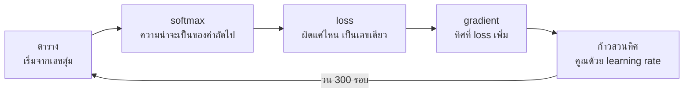

# บทพื้นฐานที่ 4 การเรียนรู้คือการขยับตัวเลขให้ผิดน้อยลง

ตอนเริ่ม model ตัวนี้ผิดอยู่ที่ 3.526
หลังจากขยับตัวเลขข้างในสามร้อยครั้ง มันผิดอยู่ที่ 0.787 และพอถามว่าอะไรตามหลัง
the มันตอบว่า agent สามสิบหกเปอร์เซ็นต์ ซึ่งคือคำตอบเดียวกับที่บทก่อนได้จากการนั
บ แต่ไม่มีบรรทัดไหนในไฟล์นี้นับ ไม่มีใครบอกคำตอบมัน สิ่งเดียวที่มันได้รับคือตัว
เลขหนึ่งตัวที่บอกว่าผิดแค่ไหน สามร้อยครั้ง

นี่คือคำว่า train และคำว่า learn ทั้งคำ ไม่มีอะไรมากกว่านี้ซ่อนอยู่ใน model ที่ใหญ่
กว่านี้พันล้านเท่า มีแต่ตัวเลขมากกว่า ข้อความมากกว่า และเครื่องที่ทำเลขคณิตเร็วกว่า
บทนี้แสดงทั้งกระบวนการในแปดสิบบรรทัด และมันเป็นบทเดียวในคอร์สที่ใช้ numpy เพราะ
กระบวนการคือเลขคณิตบนตารางตัวเลข และตารางตัวเลขคือสิ่งที่ numpy มีไว้ทำ

หัวข้อที่ 4 เรื่อง gradient คือหัวข้อที่หนักที่สุด ถ้าอ่านรอบแรกแล้วไม่เข้าใจว่าทำไม
สูตรถึงเป็นแบบนั้น ให้เชื่อไปก่อนว่ามันบอกทิศ แล้วอ่านหัวข้อที่ 5 ต่อ ทุกอย่างหลัง
จากนั้นใช้แค่ข้อเท็จจริงว่ามันบอกทิศ ไม่ได้ใช้ว่าบอกยังไง

## 1. ตารางที่ไม่มีวันเก็บได้ ถูกแทนด้วยตัวเลขชุดหนึ่ง

บทก่อนจบตรงที่ตารางนับพัง ยิ่ง context ยาว ตารางยิ่งต้องมีช่องสำหรับทุกลำดับคำที่
เป็นไปได้ และช่องส่วนใหญ่ว่างเพราะไม่เคยเห็น

ทางออกคือเลิกเก็บตาราง แล้วเก็บตัวเลขชุดหนึ่งที่ตอบคำถามเดียวกันได้ โดยไม่ต้องมี
ช่องสำหรับทุกกรณี ในไฟล์นี้ตัวเลขชุดนั้นคือตารางสี่เหลี่ยมขนาดสามสิบสี่คูณสามสิบ
สี่ เพราะข้อความมีคำต่างกันสามสิบสี่คำ แถวหนึ่งต่อหนึ่งคำ context
คอลัมน์หนึ่งต่อหนึ่งคำที่อาจตามมา ตัวเลขในช่องบอกว่า model
เอนเอียงไปทางคู่นั้นมากแค่ไหน

ตัวเลขพวกนี้ชื่อว่า parameter (พารามิเตอร์ คือตัวเลขข้างใน model ที่การฝึกจะไปปรับ) ตอนคน
พูดว่า model ขนาดเจ็ดหมื่นล้าน เขาหมายถึงจำนวนช่องในตารางแบบนี้ ที่นี่มีหนึ่งพันหนึ่งร้อย
ห้าสิบหกช่อง หลักการเหมือนกันทุกประการ

ตัวเลขนั้นแปลเป็นของจริงได้ เจ็ดหมื่นล้านช่อง ช่องละสอง byte คือราวหนึ่งร้อยสี่สิบ
กิกะไบต์ ที่ต้องอยู่ในหน่วยความจำพร้อมกันตอนเรียกใช้ นั่นคือเหตุผลที่ model ขนาดนั้น
รันบนโน้ตบุ๊กไม่ได้ และเป็นตัวเลขที่บทที่ 19 ของหนังสือทั้งบทพยายามกดลงมา

ตอนเริ่มทุกช่องเป็นเลขสุ่มใกล้ศูนย์ model จึงไม่รู้อะไรเลย และคำถามของทั้งบทคือ
จะเปลี่ยนเลขสุ่มพันกว่าตัวให้เป็นเลขที่ถูก ได้ยังไง โดยไม่รู้ว่าเลขที่ถูกคืออะไร

ก่อนไปต่อ มีคำหนึ่งที่ควรเห็นตั้งแต่ตรงนี้ คำ context เข้าตารางยังไง ในไฟล์นี้เขียนว่า
`weights[xs]` คือหยิบแถวตามเลขประจำตัวของคำ อีกวิธีที่ให้ผลเท่ากันทุกประการคือสร้าง
vector ที่เป็นศูนย์ทั้งหมดยกเว้นตำแหน่งของคำนั้นเป็นหนึ่ง แล้วคูณกับตาราง

```python
def one_hot(index, size):
    """A row of zeros with a single one, which is how a token id enters a grid."""
    row = np.zeros(size)
    row[index] = 1.0
    return row
```

vector แบบนี้ชื่อ one-hot (vector ที่มีหนึ่งอยู่ตำแหน่งเดียวและศูนย์ที่
เหลือ) และการคูณมันกับตารางคือการหยิบแถวนั้นออกมา `check.py` ยืนยันว่าสองวิธีให้แถว
เดียวกัน model จริงหยิบแถวตรงๆ เพราะการคูณ vector ที่เป็นศูนย์เกือบทั้งหมดคือการเสียแรง
เปล่า แต่ความหมายเหมือนกัน

แถวที่หยิบออกมามีชื่อ มันคือ embedding (vector ตัวเลขที่ model ใช้แทนข้อความหนึ่งชิ้น) ขอ
งคำนั้น ในไฟล์นี้แถวยาวเท่าจำนวนคำเพราะตารางไปตรงถึงคำถัดไปเลย model จริงมีตาราง
embedding แยกต่างหาก แถวยาวไม่กี่พันตัวเลขแทนที่จะเป็นหนึ่งต่อคำ แล้วส่งแถวนั้นผ่านชั้นอื่
นอีกหลายสิบชั้นก่อนจะถึงคะแนนของคำถัดไป บทพื้นฐานที่ 5 จะให้เห็นว่าแถวพวกนี้มีความหมายใน
ตัวเอง และบทพื้นฐานที่ 6 จะให้เห็นชั้นที่สำคัญที่สุดในระหว่างทาง

## 2. แถวตัวเลขกลายเป็นความน่าจะเป็น

แถวหนึ่งของตารางคือตัวเลขสามสิบสี่ตัว บวกบ้างลบบ้าง ยังไม่ใช่ความน่าจะเป็น
ฟังก์ชันที่แปลงมันชื่อ softmax

```python
def softmax(logits):
    """Turn any row of numbers into probabilities that sum to one."""
    shifted = logits - logits.max(axis=-1, keepdims=True)
    exp = np.exp(shifted)
    return exp / exp.sum(axis=-1, keepdims=True)
```

ยกกำลัง e ทุกตัวเพื่อให้ทุกตัวเป็นบวก แล้วหารด้วยผลรวมเพื่อให้รวมกันได้หนึ่ง ตัวที่
ใหญ่กว่ายังใหญ่กว่า แต่ตอนนี้มันคือส่วนแบ่งของหนึ่ง การลบค่าสูงสุดออกก่อนไม่เปลี่ยน
ผลลัพธ์ในทางคณิตศาสตร์ มันมีไว้กันเลขล้น เพราะ e ยกกำลังเจ็ดร้อยใหญ่เกินที่เครื่อง
จะเก็บ

ตัวเลขก่อนเข้า softmax เรียกว่า logit และคุณจะเจอคำนี้อีกตอนที่ API บางเจ้าให้ปรับ
มัน ตอนนี้รู้แค่ว่ามันคือแถวดิบก่อนจะกลายเป็นความน่าจะเป็นก็พอครับ

## 3. ความผิดถูกวัดเป็นตัวเลขเดียว

การเรียนรู้ต้องการสิ่งที่วัดได้ ตัววัดชื่อ loss (ตัวเลขตัวเดียวที่บอกว่า model ผิดแค่ไห
น ยิ่งต่ำยิ่งดี)

```python
def loss(weights, xs, ys):
    """How wrong the grid is, as one number. Lower is better."""
    probabilities = softmax(weights[xs])
    return -np.log(probabilities[np.arange(len(ys)), ys]).mean()
```

สำหรับทุกคู่คำในข้อความ ดูว่า model ให้ความน่าจะเป็นเท่าไหร่กับคำที่ตามมาจริง ถ้า
ให้หนึ่ง คือมั่นใจถูกเต็มที่ log ของหนึ่งคือศูนย์ ผิดศูนย์ ถ้าให้น้อย log เป็นลบมาก
ติดลบข้างหน้าให้เป็นบวกมาก ผิดมาก เฉลี่ยทุกคู่ได้เลขเดียว

ค่าเริ่มต้น 3.526 ไม่ใช่เลขสุ่ม มันคือ log ฐาน e ของสามสิบสี่ ซึ่งคือความผิดของ model ที่ให้
ทุกคำเท่ากันหมด เพราะตารางสุ่มใกล้ศูนย์คือตารางที่ไม่เอนเอียงไปทางไหน การฝึกเริ่ม
จากการเดาสุ่ม และ 0.787 ตอนจบคือระยะทางที่มันเดินมาได้

ตัวเลขนี้มีชื่อทางการว่า cross entropy (ค่าเฉลี่ยของลบ log ของความ
น่าจะเป็นที่ model ให้กับคำตอบจริง) และมันมีรูปที่คนอ่านออกง่ายกว่า คือ e ยกกำลัง loss

```python
def perplexity(weights, xs, ys):
    """The loss as a number a person can read. How many words is the model choosing between."""
    return float(np.exp(loss(weights, xs, ys)))
```

```text
perplexity 34.0 at the start, which is the 34 words in the vocabulary, and 2.2 after training
```

perplexity (e ยกกำลัง loss อ่านได้ว่า model กำลังเลือกระหว่างกี่คำ) ตอนเริ่มคือสามสิบ
สี่ เท่ากับจำนวนคำใน vocabulary พอดี เพราะ model ที่ไม่รู้อะไรเลือกระหว่างทุกคำเท่ากัน ห
ลังฝึกมันเหลือ 2.2 คือเลือกระหว่างราวสองคำ นี่คือตัวเลขที่ paper เรื่องการฝึกใช้เทียบ
model ระหว่างทาง แต่เทียบได้เฉพาะ model ที่ใช้ tokenizer เดียวกันเพราะมันคือความผิดต่อห
นึ่ง token และ token ของบทที่ 2 ไม่เท่ากันในแต่ละตัว มันไม่ใช่ตัววัดใหม่ มันคือ loss ตัว
เดิมที่ถอด log ออก และบทที่ 7 ของหนังสือจะให้เห็นว่าทำไมตัวเลขนี้วัด agent ไม่ได้ เพราะ
agent ที่ทายคำถัดไปเก่งอาจแก้ bug ไม่ได้เลย

## 4. gradient บอกว่าต้องขยับทางไหน

นี่คือบรรทัดที่ทำให้การเรียนรู้เป็นไปได้ และเป็นบรรทัดที่ยากที่สุดในภาคพื้นฐาน

```python
def gradient(weights, xs, ys):
    """Which direction to nudge every number in the grid, and how hard."""
    probabilities = softmax(weights[xs])
    probabilities[np.arange(len(ys)), ys] -= 1
    change = np.zeros_like(weights)
    np.add.at(change, xs, probabilities / len(ys))
    return change
```

gradient (ทิศที่ loss เพิ่มเร็วที่สุด) ของตารางนี้มีรูปที่เรียบง่ายจนน่าแปลกใจ เอาความน่า
จะเป็นที่ model ให้ ลบหนึ่งตรงตำแหน่งของคำตอบที่ถูก จบ

ลองอ่านมันเป็นภาษาคน ช่องไหนที่ model ให้ความน่าจะเป็นสูงกับคำที่ผิด ตัวเลขตรงนั้น
เป็นบวก และจะถูกดันลง ช่องของคำที่ถูก ความน่าจะเป็นลบหนึ่งได้ค่าลบ และจะถูกดันขึ้น
ยิ่ง model มั่นใจผิดมาก แรงดันยิ่งมาก ยิ่งใกล้ถูก แรงดันยิ่งเบา จนเป็นศูนย์เมื่อถูก
พอดี

ใส่ตัวเลขจริงลงไปแล้วเห็นชัดขึ้น สมมติคำที่ตามมาจริงคือ agent และตอนนี้ model ให้
มันแค่ 0.02 ช่องของ agent ได้ 0.02 ลบหนึ่ง คือลบ 0.98 แรงดันเกือบเต็มที่ พอฝึกไป
จนมันให้ 0.9 ช่องเดียวกันได้ลบ 0.1 การฝึกจึงช้าลงเองเมื่อเข้าใกล้คำตอบ

ทำไมสูตรถึงออกมาเป็นแบบนี้ เป็นผลจากแคลคูลัสของ softmax ต่อกับ log ซึ่งบทนี้ไม่พิสูจน์
สิ่งที่ต้องถือไว้คือมีวิธีคำนวณทิศ และทิศนั้นถูก `check.py` ยืนยันข้อนี้ด้วยการก้าว
ทวนทิศหนึ่งก้าวแล้วดูว่า loss ลดจริง

model จริงมีชั้นซ้อนกันหลายสิบชั้น และ gradient ต้องไหลย้อนผ่านทุกชั้น กระบวนการนั้น
ชื่อ backpropagation แต่แต่ละชั้นทำสิ่งเดียวกับบรรทัดข้างบน คือถามว่าถ้าขยับตัวเลขนี้
loss จะเปลี่ยนไปทางไหนครับ

## 5. การฝึกคือการก้าวลงเขาซ้ำๆ

```python
def train(text, steps=300, learning_rate=10.0, seed=0):
    """Start random, and step downhill on the loss until the steps run out."""
    words, index = vocabulary(text)
    xs, ys = pairs(text, index)
    rng = np.random.default_rng(seed)
    weights = rng.normal(0, 0.01, size=(len(words), len(words)))
    history = []
    for _ in range(steps):
        history.append(loss(weights, xs, ys))
        weights -= learning_rate * gradient(weights, xs, ys)
    return weights, index, history
```

เริ่มสุ่ม วัดว่าผิดแค่ไหน ถามว่าทิศไหนผิดมากขึ้น แล้วก้าวไปทางตรงข้าม ทำสามร้อยรอบ
บรรทัดที่ทำงานจริงคือบรรทัดเดียว ตัวเลขทั้งตาราง ลบด้วย ทิศ คูณด้วย ขนาดก้าว

ขนาดก้าวชื่อ learning rate (อัตราการเรียนรู้ คือตัวเลขที่บอกว่าแต่ละก้าวจะขยับไกลแค่ไหน)
ก้าวเล็กไปเรียนช้า ก้าวใหญ่ไปกระโดดข้ามจุดต่ำสุดแล้วแกว่ง สิบเป็นค่าที่ใหญ่มากสำหรับ
model จริง แต่ตารางเล็กขนาดนี้รับได้ และ `check.py` ยืนยันว่าไม่มีก้าวไหนเดินขึ้นเขา

ลองเปลี่ยน `learning_rate` เป็นร้อยแล้วรันดู loss
จะลงสองสามก้าวแรกแล้วเด้งกลับขึ้นสูงกว่าจุดเริ่มต้น เพราะแต่ละก้าวไกลเกินจนข้าม
ก้นหุบเขาไปโผล่อีกฝั่งที่สูงกว่าเดิม แล้วก้าวถัดไปข้ามกลับมาอีกฝั่งที่สูงขึ้นไป
อีก

ชื่อของทั้งกระบวนการคือ gradient descent (ขยับตัวเลขสวนทาง gradient ทีละก้าว) และมันคือ
อัลกอริทึมเดียวที่ฝึก model ทุกตัวที่คุณจะเรียกในหนังสือเล่มนี้ ที่ต่างกันคือขนาด
ก้าวถูกปรับอย่างฉลาดขึ้น ข้อมูลถูกป้อนทีละก้อนแทนที่จะทั้งหมด และมีเครื่องหลายพัน
เครื่องทำเลขคณิตนี้พร้อมกัน ตัว loop เหมือนเดิม



## 6. สิ่งที่ตารางไม่มี แต่ model มี

หลังฝึก ถามว่าอะไรตามหลัง the

```text
after 'the', most likely first
  agent          0.363
  model          0.135
  file           0.090
  ...and 'and', which never followed 'the' in the text, gets 0.0004
```

agent 0.363 บทก่อนนับได้ 0.364 model เรียนรู้สิ่งที่ตารางรู้ โดยไม่มีตาราง

แต่บรรทัดสุดท้ายคือสิ่งที่ตารางทำไม่ได้ คำว่า and ไม่เคยตามหลัง the ในข้อความ ตาราง
นับให้มันศูนย์ หรือให้ None ถ้าถามด้วยคำที่ไม่มีแถว model ให้มันสี่ในหมื่น น้อยมาก แต่
ไม่ใช่ศูนย์ softmax ไม่มีวันให้ศูนย์แท้ๆ กับอะไรเลย

ความต่างนี้ดูเล็ก และมันคือทั้งเหตุผลที่ยุคที่สามชนะยุคที่สอง model มีความเห็นต่อทุก
อย่าง ต่อคำที่ไม่เคยเห็นในตำแหน่งนั้น ต่อลำดับที่ไม่เคยเกิดขึ้น มั่นใจมากบ้างน้อยบ้าง
แต่ไม่เคยว่างเปล่า ตารางรู้แค่สิ่งที่มันเห็นเป๊ะๆ และข้อความจริงเกือบทั้งหมดคือสิ่งที่
ไม่มีใครเคยเห็นเป๊ะๆ

ลองถามเรื่องที่ model ไม่มีทางรู้ เช่น เลขห้องประชุมของทีมคุณ มันไม่มีช่องสำหรับ
คำว่าไม่รู้ มันมีแต่การแจกแจงบนทุกลำดับคำ และลำดับที่หน้าตาเหมือนเลขห้องประชุมได้
คะแนนสูงสุด มันจึงตอบเลขห้องมาหนึ่งเลข ด้วยน้ำเสียงเดียวกับตอนตอบเรื่องที่รู้จริง

ราคาของความสามารถนี้คือ model จะมีความเห็นแม้ตอนที่ไม่ควรมี มันจะให้ความน่าจะเป็น
กับเรื่องที่ไม่จริง ด้วยความมั่นใจเดียวกับเรื่องที่จริง เพราะกลไกเดียวกันที่ให้ and
สี่ในหมื่น ให้ทุกอย่างมากกว่าศูนย์ บทที่ 5 และบทที่ 7 ของหนังสือว่าด้วยการอยู่กับเรื่อง
นั้นครับ

## 7. สรุป

- model คือตัวเลขชุดหนึ่งที่เรียกว่า parameter เริ่มจากค่าสุ่ม

- softmax แปลงแถวตัวเลขเป็นความน่าจะเป็น loss วัดความผิดเป็นเลขเดียว perplexity
  คือ loss ตัวเดิมในรูปที่อ่านได้ว่ากำลังเลือกระหว่างกี่คำ

- gradient บอกทิศที่ loss เพิ่ม การฝึกคือก้าวไปทางตรงข้ามซ้ำๆ

- ผลลัพธ์ตรงกับการนับ โดยไม่ต้องนับ และไม่ต้องมีช่องสำหรับทุกกรณี

- model ไม่เคยให้ศูนย์ นั่นคือทั้งพลังและอันตรายของมัน

## โค้ดที่ลงมือทำเรื่องนี้

ทั้งกระบวนการอยู่ใน [foundations/04-learning/learn.py](../foundations/04-learning/learn.py)
รัน `python learn.py` เพื่อดู loss ตอนเริ่มและตอนจบ กับความเชื่อของ model หลังฝึก
แล้วรัน `python check.py` เพื่อยืนยันว่าทุกก้าวเดินลงเขาจริง ลองเปลี่ยน `steps` เป็น
สิบแล้วดูว่ามันรู้น้อยแค่ไหน แล้วเปลี่ยน `learning_rate` เป็นร้อยแล้วดูว่ามันแกว่งยังไง

## อ่านต่อ

- Rumelhart Hinton และ Williams ปี 1986 บทความ Learning representations by back-propagating errors คือ backpropagation ที่หัวข้อที่ 4 ไม่ได้พิสูจน์

- Karpathy ชุดวิดีโอ Neural Networks Zero to Hero โดยเฉพาะ micrograd และ makemore สร้างสิ่งเดียวกับบทนี้ทีละบรรทัดพร้อมแคลคูลัส

- AI Engineering ของ Chip Huyen บทที่ 3 ว่าด้วย entropy cross entropy และ perplexity ในฐานะตัววัด
