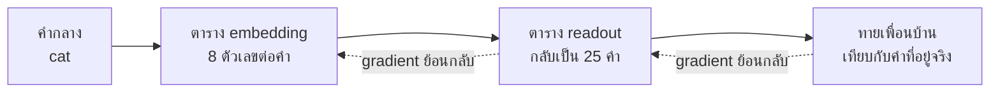

# บทพื้นฐานที่ 5 ความหมายคือเพื่อนที่คำคบ เขียนเป็นทิศทาง

ไม่มีบรรทัดไหนในไฟล์ของบทนี้บอกว่า cat คืออะไร ไม่มีพจนานุกรม ไม่มีคำแปล มีแต่
ข้อความสิบกว่าประโยคที่แมวกับหมานั่งบนเสื่อ กินปลา กินกระดูก แล้วนอนทั้งวัน ถามว่าคำ
ไหนใกล้ cat ที่สุด มันตอบ dog ด้วยคะแนน 0.979

มันรู้ได้ยังไง มันไม่รู้ มันนับว่า cat มีคำอะไรอยู่ข้างๆ บ้าง แล้วพบว่า dog มีคำข้างๆ ชุด
เดียวกัน แค่นั้น และแค่นั้นคือรากของ embedding (vector ตัวเลขที่ model ใช้แทนข้อความหนึ่ง
ชิ้น) ทุกตัว vector database ทุกตัว และบทเรียนที่ 16 ที่ว่าด้วย retrieval สิ่งที่บทนี้
ประกอบขึ้นมาคือรูปแบบเก่าแก่ที่สุดของแนวคิดนั้น เพราะมันคือรูปแบบเดียวที่มองเห็นทุกตัวเลข

## 1. คำกลายเป็นแถวของจำนวนนับ

```python
def cooccurrence(text, window=2):
    """A grid of counts. Row for a word, column for a neighbour it appeared near."""
    words, index = vocabulary(text)
    tokens = text.split()
    grid = np.zeros((len(words), len(words)))
    for position, word in enumerate(tokens):
        for offset in range(-window, window + 1):
            neighbour = position + offset
            if offset == 0 or neighbour < 0 or neighbour >= len(tokens):
                continue
            grid[index[word], index[tokens[neighbour]]] += 1
    return grid, index
```

เดินผ่านข้อความทีละคำ มองซ้ายสองคำ ขวาสองคำ ทุกคำที่เห็นในหน้าต่างนั้น บวกหนึ่งใน
ช่องของคู่นั้น จบแล้วแต่ละแถวของตารางคือคำหนึ่งคำ และตัวเลขในแถวบอกว่าคำนั้นเคยอยู่
ใกล้คำไหนกี่ครั้ง

แถวนั้นคือ vector (เวกเตอร์ คือแถวตัวเลขที่มองเป็นลูกศรในพื้นที่หลายมิติได้)
ของคำ ที่นี่มันยาวยี่สิบห้าตัวเลข เพราะข้อความมีคำต่างกันยี่สิบห้าคำ embedding
จริงยาวหลายร้อยถึงหลายพัน และไม่ได้มาจากการนับตรงๆ แต่มาจากการเรียนรู้แบบบทพื้นฐานที่ 4
ที่ถูกตั้งโจทย์ให้ทายคำข้างเคียง ผลลัพธ์ที่ได้คือแถวตัวเลขเหมือนกัน และความหมายของ
แถวคืออย่างเดียวกัน คำนี้คบใคร

คุณทำแบบเดียวกันอยู่แล้วโดยไม่รู้ตัว อ่านประโยคว่า เขาสั่งทาโบมาสองแก้วแล้วดื่มจน
หมด คุณไม่เคยเห็นคำว่าทาโบมาก่อน แต่ตอนนี้คุณรู้แล้วว่ามันเป็นเครื่องดื่ม จากคำว่า
แก้วกับดื่มที่อยู่ข้างมัน ตารางข้างบนทำอย่างเดียวกัน ต่างกันแค่มันนับแทนที่จะเดา

ตรงนี้คือสมมติฐานที่ทั้งสาขาตั้งอยู่บนนั้น ตั้งชื่อไว้ตั้งแต่ปี 1957 ว่าคุณจะรู้จักคำ
จากเพื่อนของมัน มันไม่ใช่ความจริงทางปรัชญา มันคือสมมติฐานที่ใช้งานได้ดีจนไม่มีใคร
เลิกใช้ครับ

## 2. ใกล้กันวัดด้วยมุม ไม่ใช่ระยะทาง

มีสอง vector แล้ว จะบอกว่าใกล้กันแค่ไหนได้ยังไง วิธีที่คนคิดถึงก่อนคือระยะทางเส้นตรง
วิธีที่ทุกคนใช้จริงคือมุม

```python
def cosine(a, b):
    """How much two vectors point the same way, ignoring how long they are."""
    return float(a @ b / (np.linalg.norm(a) * np.linalg.norm(b)))
```

cosine similarity (ค่าที่บอกว่าสองลูกศรชี้ทางเดียวกันแค่ไหน) คำนวณจากผลคูณของสอง vector ห
ารด้วยความยาวของทั้งคู่ การหารด้วยความยาวคือหัวใจ มันทิ้งความยาวไป เหลือแต่ทิศ

ทำไมต้องทิ้ง ดูตัวเลขนี้

```text
cat appears 5 times, dog 3
cosine(cat, dog) 0.979   euclidean(cat, dog) 5.74
cosine(cat, file) 0.854   euclidean(cat, file) 7.28
```

cat ปรากฏห้าครั้ง dog สามครั้ง vector ของ cat จึงยาวกว่าเกือบสองเท่า ระยะทางเส้นตรง
เห็นความต่างนั้นและบอกว่าสองคำนี้ห่างกัน 5.74 แต่ความยาวบอกแค่ว่าคำนั้นพบบ่อยแค่
ไหน ไม่ได้บอกว่ามันหมายถึงอะไร cosine หารความยาวทิ้งแล้วเห็นว่าทั้งคู่ชี้ทางเดียว
กัน 0.979

`check.py` ยืนยันเรื่องนี้ด้วยการคูณ vector ของ cat ด้วยสาม cosine กับ dog ไม่ขยับ
euclidean กระโดด ถ้าคุณจะเทียบคำที่พบบ่อยกับคำที่พบน้อย หรือเอกสารยาวกับเอกสารสั้น
ซึ่งคือทุกกรณีจริง คุณต้องการตัววัดที่ไม่สนความยาว

## 3. สองกลุ่มในข้อความกลายเป็นสองกลุ่มในพื้นที่

```text
nearest to 'cat'
  dog      0.979
  bone     0.928
  fish     0.928
nearest to 'agent'
  model    0.998
  file     0.952
  result   0.952
```

cat ใกล้ dog agent ใกล้ model ไม่มีใครบอก และมันไม่ได้แค่จับคู่ถูก มันจัดกลุ่มถูก
สิ่งที่ตามมาหลัง cat คือของที่แมวกิน สิ่งที่ตามมาหลัง agent คือของที่ agent อ่านและ
เขียน สองโลกในข้อความกลายเป็นสองย่านในพื้นที่ยี่สิบห้ามิติ

นี่คือสิ่งที่ vector database ทำตอนคุณถามคำถาม มันแปลงคำถามเป็นทิศทาง แล้วหาว่า
เอกสารไหนชี้ทางใกล้ที่สุด ไม่ได้หาคำที่ตรงกัน หาทิศที่ใกล้กัน ซึ่งเป็นเหตุผลที่มันเจอ
เอกสารเรื่องหมาตอนคุณถามเรื่องแมว และเป็นเหตุผลเดียวกันที่บางครั้งมันเจอเรื่องที่
ไม่เกี่ยวเลย แค่คบเพื่อนกลุ่มเดียวกัน

ที่มันชนะการค้นด้วยคำเห็นได้จากคู่นี้ ผู้ใช้พิมพ์ว่า ลืมรหัสผ่าน ส่วนหัวข้อในคู่มือ
เขียนว่า เข้าระบบไม่ได้ ไม่มีคำไหนตรงกันสักคำ การค้นด้วยคำจึงคืนศูนย์ผลลัพธ์ แต่สอง
ประโยคนี้ชี้ทางใกล้กัน เพราะมันอยู่ข้างคำชุดเดียวกันมาตลอดในข้อความที่ใช้ฝึก

ที่มันแพ้ก็ด้วยเหตุผลเดียวกัน ถามว่า วิธีคืนเงินลูกค้า แล้วได้เอกสารเรื่องวิธีเรียก
เก็บเงินลูกค้ากลับมาเป็นอันดับหนึ่ง สองเรื่องนี้ใช้คำเดียวกันเกือบทั้งย่อหน้า ต่างกัน
ที่คำเดียว และคำเดียวนั้นไม่ได้มีน้ำหนักพิเศษอะไรตอนวัดทิศ

## 4. ปัญหาของคำที่อยู่ข้างทุกอย่าง

มีเลขหนึ่งตัวข้างบนที่ควรทำให้สะดุด cat กับ file ได้ 0.854 นั่นสูงมากสำหรับสองคำที่
ไม่มีอะไรร่วมกันเลย

สาเหตุคือ the ทุกคำในข้อความอยู่ข้าง the และ the อยู่ข้างทุกคำ ช่องของ the ในทุก
vector จึงใหญ่ และช่องที่ใหญ่เหมือนกันในทุก vector ดึงทุก vector ให้ชี้ไปทางเดียวกัน
คำที่อยู่ข้างทุกอย่างไม่ได้บอกอะไรเกี่ยวกับใครเลย แต่มันครองน้ำหนัก

ภาษาไทยมีตัวที่ทำแบบเดียวกัน คำว่า ที่ กับ ของ กับ การ อยู่ข้างเกือบทุกคำในเอกสาร
ราชการ สองย่อหน้าที่พูดคนละเรื่องจึงได้คะแนนใกล้กันสูงมาก เพราะเต็มไปด้วยสามคำนี้

embedding จริงแก้เรื่องนี้ด้วยการถ่วงน้ำหนัก คำที่ปรากฏทุกที่ถูกลดค่าลง คำที่ปรากฏ
เฉพาะที่ถูกเพิ่มค่าขึ้น วิธีหนึ่งชื่อ TF-IDF ซึ่งหัวข้อที่ 6 จะสร้าง และบทเรียนที่
16 ใช้แนวคิดเดียวกัน
ในชื่อ rarity ตอนให้คะแนนว่าย่อหน้าไหนตอบคำถาม คำที่หายากในเอกสารทั้งชุดคือคำที่
บอกอะไรได้ คำที่อยู่ทุกย่อหน้าไม่บอกอะไร

ไฟล์ของบทนี้ไม่ทำแบบนั้น เพราะการทำจะบังตัวเลขดิบที่บทนี้อยากให้เห็น แต่ตอนคุณ
เห็น 0.854 แล้วสงสัย นั่นคือความสงสัยที่ถูก และมันคือปัญหาแรกที่ทุกระบบ retrieval
ต้องแก้ครับ

## 5. vector ที่เรียนรู้ แทนที่จะนับ

ตารางนับมีปัญหาอีกข้อที่ใหญ่กว่า the แต่ละแถวยาวเท่าจำนวนคำ vocabulary หนึ่งแสนคำ
แปลว่า vector ยาวหนึ่งแสนตัวเลข และแทบทั้งหมดเป็นศูนย์ embedding จริงยาวไม่กี่ร้อย
ไม่ว่า vocabulary จะใหญ่แค่ไหน และไม่มีศูนย์เลย มันได้มาจากการเรียนรู้ ไม่ใช่การนับ

โจทย์ที่ใช้ฝึกคือโจทย์เดียวกับที่การนับตอบ แต่กลับด้าน แทนที่จะจดว่าคำนี้มีใครอ
ยู่ข้างๆ ให้ model ทายว่าใครอยู่ข้างๆ จาก vector ของคำ ทายผิด ปรับ vector
ทำซ้ำ นี่คือบทพื้นฐานที่ 4 ทั้งบท โดยสิ่งที่ถูกปรับคือ embedding
เอง วิธีนี้ชื่อ word2vec (วิธีฝึก vector ของคำด้วยการทายคำข้างๆ ออกมาปี 2013)
และมันคือจุดที่ยุคที่สามของ NLP เริ่มต้น แบบที่ใช้ที่นี่ชื่อ skip-gram
(ทายเพื่อนบ้านจากคำกลาง) อีกแบบชื่อ CBOW ทายกลับด้าน

```python
def train(text, size=8, steps=400, learning_rate=0.5, seed=0):
    """Learn a vector per word by guessing neighbours. Chapter 4 again, with two grids."""
    words, index = vocabulary(text)
    centres, contexts = training_pairs(text, index)
    rng = np.random.default_rng(seed)
    embedding = rng.normal(0, 0.1, size=(len(words), size))
    readout = rng.normal(0, 0.1, size=(size, len(words)))
    history = []
    for _ in range(steps):
        hidden = embedding[centres]
        guess = softmax(hidden @ readout)
        history.append(-np.log(guess[np.arange(len(contexts)), contexts]).mean())
        guess[np.arange(len(contexts)), contexts] -= 1
        guess /= len(contexts)
        readout_change = hidden.T @ guess
        hidden_change = guess @ readout.T
        readout -= learning_rate * readout_change
        np.add.at(embedding, centres, -learning_rate * hidden_change)
    return embedding, index, history
```

มีตารางสองตาราง ตารางแรกคือ embedding
แถวละแปดตัวเลขต่อคำ ตารางที่สองแปลงแถวนั้นกลับเป็นการทายทั่วทั้ง vocabulary
loss กับ gradient คือของบทพื้นฐานที่ 4 ทุกบรรทัด สิ่งเดียวที่ใหม่คือ gradient
ไหลผ่านตารางที่สองย้อนเข้าไปถึงตารางแรก ซึ่งคือ backpropagation (ไล่ gradient
จากชั้นหลังย้อนมาชั้นหน้า) ในรูปที่เล็กที่สุดเท่าที่จะเป็นได้ ของจริงไม่ทำ
softmax ทั่วทั้ง vocabulary
แบบตารางที่สองนี้ เพราะแสนคำต่อหนึ่งคู่แพงเกินไป มันเทียบกับคำสุ่มไม่กี่คำแทน

เหตุผลอยู่ที่ขนาด หนึ่งคู่ต้องคูณแถวแปดตัวเลขกับตารางที่มีแสนคอลัมน์ และข้อมูลฝึก
จริงมีคู่แบบนั้นหลายพันล้านคู่ คำสุ่มที่ว่าคือห้าถึงยี่สิบคำต่อหนึ่งคู่ แทนที่จะเป็น
ทั้งแสน ผลใกล้เคียงกันแต่ถูกกว่าหลายพันเท่า



เส้นประคือทางที่ความผิดเดินย้อนกลับ มันปรับตาราง readout ก่อน แล้วเดินต่อเข้าไปปรับ
ตาราง embedding ที่อยู่หน้ามัน แถวแปดตัวเลขของ cat จึงขยับทุกรอบ

```text
25 words, each a vector of 8 numbers, not 25
loss at the start 3.217, after training 2.173

nearest to 'cat' by the learned vectors
  dog      0.945
  sofa     0.825
  bone     0.789

cosine(cat, dog) 0.945   cosine(cat, file) 0.545
```

cat ยังใกล้ dog ที่สุด โดยไม่มีบรรทัดไหนนับเพื่อนบ้าน และดูตัวเลขสุดท้าย cat กับ file
ตกจาก 0.854 เหลือ 0.545 ปัญหา the ในหัวข้อที่แล้วเบาลงเอง เพราะ the อยู่ข้างทุกคำ การ
ทาย the จึงไม่ช่วยแยกคำไหนออกจากคำไหน vector ที่มีที่แค่แปดตัวเลข จึงเอาที่ไปใช้กับเพื่อน
บ้านที่แยกมันจากคำอื่นได้แทน ในไฟล์นี้ไม่มีใครเขียนกฎ มันเบาลงจากโจทย์เอง word2vec ตัวจริง
ยังเพิ่มกฎอีกข้อ คือสุ่มทิ้งคำที่พบบ่อยมากออกจากข้อมูลฝึก เพราะโจทย์อย่างเดียวเบาปัญหานี้
ได้ไม่พอ

embedding model ที่บทเรียนที่
16 พูดถึงสืบเชื้อสายจากแนวคิดนี้ ฝึกบนข้อความขนาดเว็บ และรับทั้งประโยคแทนที่จะรับ
คำ ผลลัพธ์คือ vector
ไม่กี่ร้อยตัวเลขที่ประโยคความหมายใกล้กันชี้ทางเดียวกัน แม้ไม่มีคำร่วมกันเลย ซึ่ง
คือสิ่งที่การนับคำทำไม่ได้ครับ

## 6. เอกสารทั้งฉบับก็เป็น vector ได้ และนี่คือวิธีที่ search engine ทำ

ทุกอย่างข้างบนให้ vector กับคำ แต่สิ่งที่คุณค้นหาจริงคือเอกสาร วิธีที่เก่าแก่ที่สุด
และยังอยู่ใต้ search engine ส่วนใหญ่ คือให้เอกสารเป็น vector จากคำที่อยู่ในนั้น

```python
def bag_of_words(text):
    """A document as counts, with the order thrown away."""
    return Counter(text.split())
```

ชื่อมันซื่อสัตย์ bag of words (นับว่าแต่ละคำโผล่กี่ครั้ง แล้วทิ้งลำดับไป) เทคำลงถุงแล้วเข
ย่า แมวกินปลา กับ ปลากินแมว คือถุงเดียวกัน นี่คือขีดจำกัดของแนวคิด และเป็นเหตุผลที่บทถัด
ไปต้องมี attention

คำที่ต่างกันทั้งหมดในเอกสารทุกฉบับรวมกันเรียกว่า feature vocabulary และแต่ละคำเป็น
หนึ่งช่องของ vector ทุกเอกสารมี vector ยาวเท่ากันไม่ว่าจะใช้คำกี่คำ คำที่ปรากฏเรียกว่า
token คำที่ต่างกันเรียกว่า type สามเอกสารในไฟล์ของบทนี้มี type แปดคำ vector ของแต่ละ
เอกสารจึงยาวแปดช่อง

```text
feature vocabulary ['กบ', 'กระโดด', 'นอน', 'วิ่ง', 'สุนัข', 'หลับ', 'เล่น', 'แมว']
  one    [0, 0, 0, 1, 1, 0, 1, 1]  sparsity 0.50
  two    [0, 0, 1, 0, 0, 1, 0, 1]  sparsity 0.62
  three  [1, 1, 0, 1, 1, 0, 1, 0]  sparsity 0.38
```

ครึ่งหนึ่งของแต่ละแถวเป็นศูนย์ และนี่คือ vocabulary แปดคำ vocabulary จริงมีคำหลายหมื่น
และเอกสารหนึ่งใช้ไม่กี่ร้อย แถวจึงเป็นศูนย์เกือบทั้งหมด นั่นคือความหมายของคำว่า
sparse (vector ที่ตำแหน่งส่วนใหญ่เป็นศูนย์) และการเก็บเฉพาะตำแหน่งที่ไม่ใช่
ศูนย์ คือสิ่งที่ทำให้ค้นเอกสารล้านฉบับด้วยคำมีราคาที่จ่ายไหว vector ของคำในหัวข้อ 1
ถึง 3 และ embedding ของ model จริงเป็นอีกแบบ คือ dense (vector สั้นกว่า
มากและแทบไม่มีศูนย์) สองแบบนี้คือสองตระกูลของการค้นหา และบทเรียนที่ 16 เลือก
ระหว่างมัน

ทีนี้ปัญหาของคำว่า the จากหัวข้อ 4 กลับมาในรูปเอกสาร ถ้าค้นด้วยการนับเฉยๆ เอกสารที่ยาวที่
สุดชนะเสมอ และคำที่อยู่ในทุกเอกสารช่วยตัดสินไม่ได้เลย วิธีแก้มีชื่อว่า TF-IDF (term
frequency inverse document frequency คือคะแนนที่สูงเมื่อคำนั้นโผล่บ่อยในเอกสารนี้ แต่หายา
กในเอกสารอื่น)

```python
def inverse_document_frequency(term, documents):
    """How rare the word is across all the documents, as a log."""
    containing = sum(1 for text in documents.values() if term in text.split())
    return math.log(len(documents) / containing) if containing else 0.0
```

```python
def tfidf(term, text, documents):
    """Frequent in this document, rare across the rest, is what scores high."""
    return term_frequency(term, text) * inverse_document_frequency(term, documents)
```

ลองค้นคำว่า แมว ในสามเอกสาร

```text
searching for แมว
  two    tf 0.3333  score 0.1352
  one    tf 0.2500  score 0.1014
  three  tf 0.0000  score 0.0000
idf of แมว 0.4055, in two documents of three
idf of กบ 1.0986, in one document of three
```

เอกสารสองชนะ ทั้งที่เอกสารหนึ่งก็มีคำว่าแมว เพราะแมวเป็นหนึ่งในสามคำของเอกสารสอง
แต่เป็นหนึ่งในสี่ของเอกสารหนึ่ง ส่วน idf บอกว่าแมวอยู่ในสองเอกสารจากสาม จึงได้
log ของสามส่วนสอง ถ้าคำหนึ่งอยู่ในทุกเอกสาร log
ของหนึ่งคือศูนย์ และมันหลุดออกจากทุกคะแนน คำว่า the
จึงเลิกดึงทุกอย่างเข้าหากัน ไม่ใช่เพราะมีใครเขียนรายการคำต้องห้าม แต่เพราะคำที่
ชี้ไปทุกที่มีค่าเป็นศูนย์โดยเลขคณิต

บทเรียนที่ 16 ใช้ความคิดนี้ในชื่อ rarity ตอน `search_notes` ให้คะแนนย่อหน้า และ
ระบบค้นหาที่ชื่อ BM25 ซึ่งอยู่ใต้ search engine จำนวนมาก คือ TF-IDF ที่ปรับสูตรให้
เอกสารยาวไม่ได้เปรียบเกินไป โครงเดียวกันครับ

## 7. สรุป

- คำกลายเป็น vector จากการนับว่ามันอยู่ใกล้คำไหน ความหมายคือเพื่อนที่คบ

- cosine วัดทิศ ไม่วัดความยาว ความยาวบอกความถี่ ทิศบอกความหมาย

- คำที่ใช้เหมือนกันจัดกลุ่มกันเอง โดยไม่มีใครนิยามสักคำ

- คำที่อยู่ข้างทุกอย่างดึงทุก vector เข้าหากัน และต้องถูกถ่วงน้ำหนักลง

- embedding จริงถูกเรียนรู้ด้วยการทายเพื่อนบ้าน ไม่ใช่นับ จึงสั้น ไม่มีศูนย์ และเบาปัญหา
  the ไปเอง

- เอกสารเป็น vector ได้จาก bag of words มันทิ้งลำดับ และมันเป็น sparse

- TF-IDF ให้คะแนนสูงกับคำที่เป็นสัดส่วนมากของเอกสารนี้และหายากที่อื่น คำที่อยู่ทุกที่
  ได้ศูนย์

## โค้ดที่ลงมือทำเรื่องนี้

การนับอยู่ใน [foundations/05-meaning-as-direction/vectors.py](../foundations/05-meaning-as-direction/vectors.py) และการเรียนรู้อยู่ใน `skipgram.py` ข้างกัน รัน `python vectors.py` เพื่อดูเพื่อนบ้านของ cat และ agent กับการเทียบ cosine กับ euclidean รัน `python skipgram.py` เพื่อดูกลุ่มเดียวกันโผล่มาจากการเรียนรู้แทนการนับแล้วรัน `python check.py` เพื่อยืนยันทุกข้ออ้าง ลองเพิ่มประโยคที่ให้ dog ทำสิ่งที่ agent ทำ แล้วดูว่าสองกลุ่มเริ่มละลายเข้าหากันตอนไหน

## อ่านต่อ

- Mikolov และคณะ ปี 2013 บทความ Efficient Estimation of Word Representations in Vector Space คือ word2vec ที่หัวข้อที่ 5 สร้างในรูปเล็ก

- Firth ปี 1957 ประโยคที่ว่าคุณจะรู้จักคำจากเพื่อนของมัน และ Harris ปี 1954 สมมติฐานการกระจาย คือรากของทั้งบท

- Reimers และ Gurevych ปี 2019 บทความ Sentence-BERT คือก้าวจาก vector ของคำเป็น vector ของประโยค ซึ่งคือสิ่งที่บทเรียนที่ 16 เรียกใช้
