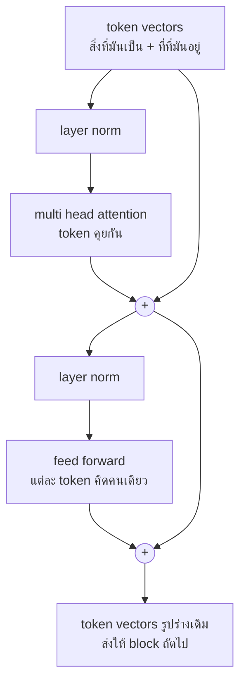

# บทพื้นฐานที่ 6 attention คือการที่ทุก token มองทุก token

สี่คำ the cat sat down ถามว่าตอนที่ model กำลังคิดถึงคำว่า sat มันมองไปที่คำไหน

```text
             the     cat     sat    down
     sat    0.05    0.91    0.05    0.00
```

เก้าสิบเอ็ดเปอร์เซ็นต์ที่ cat กริยามองประธานของมัน ในไฟล์ของบทนี้ตัวเลขนี้ถูกตั้ง
ด้วยมือเพื่อให้เห็นว่ามันหน้าตายังไง ใน model จริงไม่มีใครตั้ง มันถูกเรียนรู้ด้วยวิธี
ของบทที่ 4 และสิ่งที่มันเรียนคือ token ไหนควรมองที่ token ไหนเพื่อให้ทายคำถัดไปได้
แม่นขึ้น

กลไกนี้ชื่อ attention และปี 2017 มีบทความชื่อ Attention Is All You Need ที่บอกว่า
ทิ้งทุกอย่างอื่นไปได้เลย เหลือแค่นี้ก็พอ ปรากฏว่าจริง model ทุกตัวที่คุณจะเรียกใน
หนังสือเล่มนี้คือกลไกนี้ซ้อนกันหลายสิบชั้น บทนี้แสดงหนึ่งหัวบนสี่ token โดยเห็นทุก
ตัวเลข แล้วประกอบหัวนั้นเป็น block ที่ model จริงซ้อนกัน

หัวข้อที่ 2 คือกลไกจริง อ่านช้าๆ หัวข้อที่ 3 กับ 4 ตามมาจากมันตรงๆ และหัวข้อที่ 4 คือ
เหตุผลของราคาที่คุณจ่ายทุกครั้งที่ context ยาวขึ้น หัวข้อที่ 5 ถึง 8 คือส่วนที่เหลือของ
transformer ข้ามได้ในรอบแรก ยกเว้นหัวข้อที่ 7 ถ้าคุณอยากรู้ว่าทำไม token ขาออกแพงกว่า

## 1. ปัญหาที่ attention แก้

model ในบทที่ 3 มองย้อนหลังได้หนึ่งหรือสองคำ ตายตัว คำที่สามข้างหลังไม่มีอยู่สำหรับ
มัน แต่ภาษาไม่ได้ทำงานแบบนั้น ในประโยค แมวที่นอนอยู่บนเสื่อตัวนั้นหิว คำว่าหิวต้อง
รู้ว่าใครหิว และคำตอบอยู่ห่างออกไปเจ็ดคำ ระยะนั้นไม่แน่นอน บางประโยคหนึ่งคำ บาง
ประโยคสามสิบ

สิ่งที่ต้องการคือกลไกที่ให้แต่ละคำเลือกเองว่าจะมองคำไหน ไม่ว่าอยู่ห่างแค่ไหน และ
มองมากน้อยต่างกันได้ นั่นคือ attention (การให้ความสนใจ คือกลไกที่แต่ละ token คำนวณ
น้ำหนักว่าจะดึงข้อมูลจาก token อื่นแต่ละตัวมากแค่ไหน)

## 2. ถาม เสนอ และส่งมอบ

ทุก token มีสามบทบาทพร้อมกัน มันถามคำถาม มันเสนอตัวให้ถูกเลือก และมันมีของที่จะ
ส่งมอบถ้าถูกเลือก สามอย่างนี้มีชื่อว่า query key และ value และทั้งสามคำนวณจาก
vector ของ token ด้วยตารางตัวเลขสามตาราง

```python
def attention(x, w_query, w_key, w_value, mask=None):
    """One head of attention over a sequence of token vectors."""
    queries = x @ w_query
    keys = x @ w_key
    values = x @ w_value
    scores = queries @ keys.T / np.sqrt(keys.shape[1])
    if mask is not None:
        scores = scores + mask
    weights = softmax(scores)
    return weights @ values, weights
```

อ่านทีละบรรทัด สามบรรทัดแรกแปลงทุก token เป็นสามรูป บรรทัดที่สี่เอาคำถามของทุก
token ไปเทียบกับข้อเสนอของทุก token ได้ตารางคะแนน แถวคือคนถาม คอลัมน์คือคนถูก
ถาม การหารด้วยรากที่สองของขนาดมีไว้กันคะแนนโตเกินจน softmax กลายเป็นการเลือก
ตัวเดียว บรรทัด softmax แปลงแต่ละแถวเป็นน้ำหนักที่รวมกันได้หนึ่ง คือฟังก์ชันเดียว
กับบทที่ 4 บรรทัดสุดท้ายเอาน้ำหนักไปผสม value ของทุก token ได้ token ใหม่ที่เป็น
ส่วนผสมของสิ่งที่มันเลือกมอง

ตัวเลข 0.91 ตอนเปิดบทคือช่องหนึ่งในตาราง weights และ output ของ sat คือ value
ของ cat เก้าสิบเอ็ดเปอร์เซ็นต์ ผสมกับอย่างอื่นอีกเก้า

ตารางสามตาราง w_query w_key w_value คือ parameter ในความหมายของบทที่ 4 ไฟล์นี้
ตั้งค่ามันด้วยมือใน `hand_built_grids` ให้คำถามของ sat ชี้ไปที่ข้อเสนอของ cat ใน
model จริงตารางพวกนี้เริ่มสุ่มแล้วถูก gradient descent ปรับ และสิ่งที่มันเรียนรู้
คือรูปแบบว่าคำแบบไหนควรมองคำแบบไหน กริยามองประธาน สรรพนามมองชื่อที่มันแทน
วงเล็บปิดมองวงเล็บเปิด ไม่มีใครเขียนกฎพวกนี้ มันโผล่มาเพราะการมองแบบนั้นทำให้
ทายคำถัดไปได้ดีขึ้นครับ

## 3. ห้ามมองอนาคต

```python
def causal_mask(length):
    """Hide the future. Position i may look at positions up to i and no further."""
    return np.triu(np.full((length, length), -np.inf), k=1)
```

model ที่ทายคำถัดไปต้องไม่เห็นคำถัดไป ไม่งั้นมันจะแค่ลอก ตอนฝึกทั้งประโยคอยู่ตรง
หน้า จึงต้องปิดตาครึ่งหนึ่ง mask (หน้ากาก คือตารางที่บวกเข้ากับคะแนนเพื่อปิดบางช่อง)
ใส่ลบอนันต์ในทุกช่องที่มองไปข้างหน้า และลบอนันต์ผ่าน softmax ออกมาเป็นศูนย์พอดี ไม่
ใช่น้อย ศูนย์

```text
             the     cat     sat    down
     the    1.00    0.00    0.00    0.00
     cat    0.38    0.62    0.00    0.00
     sat    0.05    0.91    0.05    0.00
    down    0.22    0.22    0.22    0.35
```

มุมขวาบนศูนย์ทั้งหมด token แรกมองได้แค่ตัวเอง จึงได้หนึ่งเต็ม token สุดท้ายมองได้
ทุกตัว นี่คือรูปร่างของ model ทุกตัวที่คุณจะเรียก มันอ่านจากซ้ายไปขวา และแต่ละ
ตำแหน่งรู้แค่สิ่งที่มาก่อน

## 4. ทุก token คูณทุก token คือราคาที่คุณจ่าย

```python
def score_count(length):
    """How many query against key comparisons a sequence of this length needs."""
    return length * length
```

บรรทัดที่สี่ของ `attention` เทียบทุกคำถามกับทุกข้อเสนอ สี่ token คือสิบหกคะแนน
พัน token คือล้าน แสน token คือหมื่นล้าน ต่อหนึ่งชั้น ต่อหนึ่งหัว และ model จริงมี
หลายสิบชั้น แต่ละชั้นมีหลายสิบหัว

```text
        4 tokens                16
    1,000 tokens         1,000,000
  100,000 tokens    10,000,000,000
```

นี่คือที่มาของประโยคในบทที่ 1 ของหนังสือที่ว่าต้นทุนของบทสนทนาโตแบบกำลังสอง มัน
ไม่ใช่นโยบายราคาของผู้ให้บริการ มันคือเลขคณิต context ยาวขึ้นสองเท่า งานเพิ่มสี่
เท่า และเป็นเหตุผลที่บทที่ 4 ทั้งบทว่าด้วยการตัดสินใจว่าอะไรควรอยู่ใน context และ
อะไรควรออก

มีงานวิจัยจำนวนมากที่พยายามทำให้เร็วกว่ากำลังสอง และบางส่วนใช้งานจริงแล้ว แต่ model
ที่คุณจะเรียกส่วนใหญ่ยังจ่ายราคานี้อยู่ และผู้ให้บริการส่งราคานั้นต่อมาให้คุณเป็น
ราคาต่อ token ที่แพงขึ้นเมื่อ context ยาวครับ

## 5. attention ไม่รู้ลำดับ จนกว่าจะบอกมัน

กลับลำดับสี่ token เป็น down sat cat the แล้วรัน attention อีกครั้งโดยไม่เปลี่ยนอะไรอื่น
ผลที่ได้คือแถวเดิมทุกแถว กลับลำดับตาม ไม่มีตัวเลขไหนเปลี่ยน

```text
without positions, reversing the tokens reverses the output rows and nothing else
  same rows in the other order: True
```

มันต้องเป็นแบบนั้น เพราะบรรทัดที่สี่ของ `attention` เทียบทุก query กับทุก key และการ
เทียบไม่มีอะไรที่รู้ว่า key ตัวไหนมาก่อน กลไกนี้มองประโยคเป็นถุงของ token แบบเดียวกับ
bag of words ในบทที่ 5 the cat sat down กับ down sat cat the คือประโยคเดียวกันสำหรับ
มัน และภาษาไม่ได้เป็นแบบนั้น

ทางแก้คือใส่ตำแหน่งเข้าไปใน vector ของ token เอง

```python
def position_vectors(length, size):
    """One vector per position, so a token carries where it is as well as what it is."""
    positions = np.arange(length)[:, None]
    dims = np.arange(size)[None, :]
    angles = positions / (10_000 ** (2 * (dims // 2) / size))
    return np.where(dims % 2 == 0, np.sin(angles), np.cos(angles))
```

positional encoding (การเข้ารหัสตำแหน่ง คือ vector ที่บวกเข้ากับ embedding ของ token
เพื่อบอกว่ามันอยู่ตำแหน่งไหน) ตัวนี้คือรูปที่บทความปี 2017 ใช้ ตารางของ sine กับ cosine
ที่ความถี่ต่างกัน ตำแหน่งแต่ละตำแหน่งได้ลายมือของตัวเอง และตำแหน่งที่ใกล้กันได้ลายมือ
ที่คล้ายกัน vector ของ token กลายเป็น สิ่งที่มันเป็น บวก ที่ที่มันอยู่ แล้ว attention ที่
เดิมแยกลำดับไม่ออก ก็แยกออก

```text
with positions added, the same tokens in the other order give a different output
  same rows in the other order: False
```

model รุ่นหลังไม่ใช้ตารางนี้แล้ว บางตัวเรียนรู้ vector ตำแหน่งเหมือน parameter อื่น ตัว
ที่ใช้กันมากที่สุดตอนนี้หมุน query กับ key ด้วยมุมที่โตตามตำแหน่ง ชื่อ RoPE (rotary
position embedding คือการใส่ตำแหน่งด้วยการหมุน vector แทนการบวก) ซึ่งทำให้คะแนน
ระหว่างสอง token ขึ้นกับระยะห่างของมัน ไม่ใช่ตำแหน่งสัมบูรณ์ ทุกรูปแบบตอบคำถาม
เดียวกัน attention ไม่ถือลำดับ input จึงต้องถือแทน และนี่คือหนึ่งในเหตุผลที่ model มี
ความยาว context สูงสุด เพราะตำแหน่งที่ไม่เคยเห็นตอนฝึกคือตำแหน่งที่ model ไม่รู้ว่า
จะอ่านยังไงครับ

## 6. จากหนึ่งหัวเป็น block และจาก block เป็น transformer

สิ่งที่หัวข้อที่ 2 มีคือ attention หนึ่งหัว transformer (ทรานส์ฟอร์เมอร์ คือสถาปัตยกรรม
model ที่สร้างจาก attention ซ้อนกันหลายชั้น) คือหัวแบบนั้นหลายหัวในหนึ่งชั้น หลายชั้น
ซ้อนกัน และระหว่างหัวกับชั้นถัดไปมีอีกสี่ชิ้นที่แต่ละชิ้นเล็กพอจะเขียนได้ในบรรทัดเดียว

ชิ้นแรกอยู่ท้ายทุกหัว

```python
def finish_head(x, mixed, w_out):
    """What happens to a head's output before the next layer sees it."""
    return x + mixed @ w_out
```

ผลของหัวคือ value ที่ผสมแล้ว และมันอยู่ในพื้นที่ของ value ตาราง `w_out` ซึ่งเป็น
parameter อีกตัว แปลงมันกลับมาอยู่ในพื้นที่เดียวกับ token ตั้งต้น แล้วบวก token ตั้งต้น
กลับเข้าไป การบวกนั้นชื่อ residual connection (ทางลัดข้ามชั้น คือการเอา input ของชั้น
มาบวกกับ output ของชั้น) และมันคือเหตุผลที่ซ้อนหลายสิบชั้นแล้วยังฝึกได้ แต่ละชั้นปรับ
token แทนที่จะแทนที่มัน ชั้นที่ตารางยังใกล้ศูนย์ส่ง input ผ่านไปเกือบไม่เปลี่ยน แทนที่จะ
ทำลายมัน และ gradient จากบทที่ 4 มีทางเดินตรงย้อนกลับผ่านการบวกนั้นไปถึงชั้นล่างๆ ได้
`check.py` ยืนยันทั้งสองอย่าง ตารางศูนย์ให้ token เดิมกลับมาทุกตัวเลข และตารางที่ไม่ใช่
ศูนย์ให้ token ที่ถูกปรับ ไม่ใช่ถูกแทนที่

ชิ้นที่สองคือหลายหัว หนึ่งหัวมีตารางสามตาราง จึงเรียนรู้รูปแบบการมองได้แบบเดียว กริยา
มองประธานคือหนึ่งแบบ วงเล็บปิดมองวงเล็บเปิดคืออีกแบบ สรรพนามมองชื่อที่มันแทนคือแบบ
ที่สาม multi-head attention (การให้ความสนใจหลายหัว คือการรัน attention หลายชุดบน
token เดียวกันพร้อมกัน แต่ละชุดมีตารางของตัวเอง) รันหลายหัวบน token ชุดเดียวกัน ต่อ
output ของทุกหัวเรียงกัน แล้วให้ตารางเดียวผสมกลับมาเป็นขนาดของ token หนึ่งชั้นจึงถือ
หลายรูปแบบพร้อมกันได้ แค่นั้น

ชิ้นที่สามคือครึ่งของชั้นที่ไม่ใช่ attention เลย

```python
def feed_forward(x, w_in, w_out):
    """The half of a block where each token thinks alone."""
    return np.maximum(0, x @ w_in) @ w_out
```

attention คือส่วนที่ token คุยกัน feed-forward (การส่งไปข้างหน้า คือชั้นที่แปลง vector
ของแต่ละ token แยกกัน โดยไม่มอง token อื่น) คือส่วนที่แต่ละ token คิดคนเดียวกับสิ่งที่
มันเพิ่งรวบรวมมา ดันผ่านตารางที่กว้างกว่า ตัดค่าลบทิ้งเป็นศูนย์ แล้วดึงกลับมาขนาดเดิม
ไม่มี token ไหนเห็น token อื่นตรงนี้ `check.py` ยืนยันด้วยการเปลี่ยน token ตัวเดียวแล้ว
ดูว่า output เปลี่ยนแค่แถวเดียว ประมาณสองในสามของ parameter ทั้งหมดของ model จริง
อยู่ในตารางสองตารางนี้ และงานวิจัยที่ตามหาว่าข้อเท็จจริงถูกเก็บไว้ตรงไหนใน model ชี้มา
ที่นี่

ชิ้นที่สี่คือ layer norm ที่อยู่หน้าแต่ละครึ่ง แล้วทั้งหมดประกอบเป็น block เดียว

```python
def block(x, heads, w_out, w_in, w_ff):
    """One transformer block. A real model is this, dozens of times, in a stack."""
    x = x + multi_head(layer_norm(x), heads, w_out)
    x = x + feed_forward(layer_norm(x), w_in, w_ff)
    return x
```

คุยกัน แล้วคิด แต่ละครึ่งบวกเข้ากับ token แทนที่จะแทนที่ และแต่ละครึ่งมี layer norm (การ
ปรับมาตรฐานรายชั้น คือการปรับ vector ของแต่ละ token ให้ค่าเฉลี่ยเป็นศูนย์และการกระจาย
เป็นหนึ่ง) อยู่หน้ามัน ของจริงมีตัวคูณที่เรียนรู้ต่อท้าย และ model รุ่นหลังใช้รูปที่ตัดค่าเฉลี่ย
ทิ้งชื่อ RMSNorm ไฟล์นี้ข้ามตัวคูณนั้นเพื่อให้สั้น ถ้าไม่มี layer norm เลย หลายสิบชั้นที่บวก
เข้าไปเรื่อยๆ จะปล่อยให้ตัวเลขโตเท่าไหร่ก็ได้ และ softmax บนคะแนนที่ใหญ่มากกลายเป็นการเลือก token เดียวแข็งๆ



เส้นที่อ้อมกล่องไปหาเครื่องหมายบวกคือ residual connection ทั้งสองเส้น output ของ block
มีรูปร่างเดียวกับ input และนั่นคือสิ่งที่ทำให้ซ้อนได้ block ถัดไปเริ่มจาก token ที่ถือสิ่งที่
block นี้รวบรวมมาแล้ว และ model ที่คุณเรียกคือ block นี้ซ้อนกันหลาย
สิบชั้น ตัวเลขที่คนพูดถึง เช่นเจ็ดหมื่นล้าน parameter คือขนาดรวมของตารางทุกตารางใน
ทุก block บวกตาราง embedding ที่ทางเข้า และตารางที่แปลง token สุดท้ายเป็นคะแนนของ
คำถัดไปที่ทางออก ซึ่งคือ softmax ของบทที่ 4 นั่นเองครับ

## 7. KV cache และเหตุผลที่ token ขาออกแพงกว่าขาเข้า

model สร้างข้อความทีละ token ตามบทที่ 3 ทุกก้าวคือการรัน block ทั้งหมดบนลำดับที่ยาว
ขึ้นหนึ่ง token ถ้าทำแบบตรงไปตรงมา ก้าวที่ร้อยคำนวณ key กับ value ของ token ทั้งร้อย
ใหม่ ทั้งที่เก้าสิบเก้าตัวแรกไม่ได้เปลี่ยน key กับ value ของ token เก่าไม่เปลี่ยนเมื่อมี token
ใหม่ต่อท้าย เพราะ mask ในหัวข้อที่ 3 ห้ามมันมองไปข้างหน้า สิ่งที่มาทีหลังจึงแตะมันไม่ได้

```python
def attend_with_cache(token_row, w_query, w_key, w_value, cache):
    """One new token attends over everything before it, reusing what was computed."""
    cache["keys"].append(token_row @ w_key)
    cache["values"].append(token_row @ w_value)
    keys = np.array(cache["keys"])
    values = np.array(cache["values"])
    scores = (token_row @ w_query) @ keys.T / np.sqrt(keys.shape[1])
    weights = softmax(scores)
    return weights @ values, weights
```

token ใหม่คำนวณ query key value ของตัวเอง เก็บ key กับ value ต่อท้ายรายการ แล้วเทียบ
query ของตัวเองกับ key ทุกตัวในรายการ นี่คือ KV cache (แคชของ key กับ value คือการเก็บ
key กับ value ของ token ก่อนหน้าไว้ในหน่วยความจำ แทนที่จะคำนวณใหม่ทุกก้าว) `check.py`
ยืนยันว่าป้อน token ผ่านมันทีละตัว ได้แถวเดียวกันทุกตัวเลขกับ masked attention ในหัวข้อ
ที่ 3 ที่ทำทั้งหมดในครั้งเดียว

```text
key and value rows computed to generate, one token at a time
        4 tokens                10 without the cache          4 with it
    1,000 tokens           500,500 without the cache      1,000 with it
  100,000 tokens     5,000,050,000 without the cache    100,000 with it
```

cache นี้อธิบายสามอย่างในบิลของคุณ หน่วยความจำของ model ที่ให้บริการโตตามความยาวของ
บทสนทนา เพราะ cache คือสิ่งที่ถูกเก็บ token ขาออกแพงกว่าขาเข้า เพราะขาเข้าทั้งก้อน
คำนวณพร้อมกันในรอบเดียว ส่วนขาออกต้องทีละตัวและแต่ละตัวรอตัวก่อนหน้า และ prompt
caching ที่บทเรียนที่ 15 พูดถึง คือผู้ให้บริการเก็บ cache นี้ของ system prompt ของคุณไว้
ข้ามคำขอ แล้วคิดเงินส่วนนั้นถูกลงครับ

## 8. encoder decoder และเหตุผลที่ chatbot ทุกตัวเป็นอย่างหลัง

บทความปี 2017 มี transformer สองครึ่ง encoder (ตัวเข้ารหัส คือกอง block ที่อ่านทั้ง
ประโยคโดยทุก token มองได้ทุก token) อ่าน input ทั้งหมดโดยไม่มี mask ทุก token เห็นทั้ง
ซ้ายและขวา decoder (ตัวถอดรหัส คือกอง block ที่เขียนทีละ token โดยมองได้แค่สิ่งที่มา
ก่อน) คือหัวข้อที่ 3 ของบทนี้ มี mask ปิดอนาคต และเขียนทีละ token งานต้นฉบับคือแปล
ภาษา encoder อ่านประโยคต้นทาง decoder เขียนประโยคปลายทาง

หลังจากนั้นสองครึ่งแยกทางกัน ตระกูล BERT เอาแค่ encoder ได้ model ที่อ่านเก่งแต่เขียน
ไม่ได้ ใช้จัดหมวดข้อความ หาชื่อคนในประโยค และสร้าง embedding ของทั้งประโยค ซึ่งคือ
embedding model ที่บทที่ 16 ของหนังสือเรียกใช้ ตระกูล GPT เอาแค่ decoder ได้ model ที่
เขียนต่อได้ทุกอย่าง และพอเขียนต่อได้ทุกอย่าง มันก็ตอบคำถามได้ด้วยกลเม็ดของบทถัดไป

chatbot ทุกตัวที่คุณจะเรียกในหนังสือเล่มนี้เป็น decoder ล้วน ไม่ใช่เพราะ encoder ฝึกยาก
กว่า ทั้งสองครึ่งฝึกจากข้อความดิบได้โดยไม่ต้องติดป้ายเหมือนกัน แต่ decoder ฝึกด้วยโจทย์
เดียวกับที่มันใช้ตอนทำงาน คือเขียนคำถัดไป model ที่เขียนได้จึงอ่านได้ด้วยการเขียนคำตอบ
ออกมา ส่วน model ที่อ่านได้อย่างเดียวเขียนไม่ได้ เมื่อต้องเลือกครึ่งเดียว ครึ่งที่ทำได้ทั้ง
สองอย่างชนะ บางตระกูลอย่าง T5 ยังเก็บทั้งสองครึ่งไว้ แต่ chatbot ที่คุณจะเรียกไม่ใช่

## 9. สรุป

- attention ให้แต่ละ token เลือกเองว่าจะดึงข้อมูลจาก token ไหน มากแค่ไหน ไม่ว่า
  อยู่ห่างเท่าไหร่

- query key value คือสามบทบาทของ token เดียวกัน คำนวณจากตาราง parameter สาม
  ตาราง

- mask ทำให้มองได้เฉพาะสิ่งที่มาก่อน model จึงทายอนาคตแทนที่จะลอก

- ทุก token เทียบกับทุก token งานจึงโตเป็นกำลังสอง และนั่นคือราคาของ context ยาว

- attention ไม่รู้ลำดับ ตำแหน่งต้องถูกใส่เข้าไปใน input ด้วยการบวกหรือการหมุน

- block คือคุยกันแล้วคิด หลายหัว residual layer norm และ feed-forward ที่แต่ละ token
  คิดคนเดียว transformer คือ block ซ้อนกัน parameter คือขนาดของตารางทั้งหมดรวมกัน

- KV cache เก็บ key กับ value ของ token เก่าไว้ จึงไม่ต้องคำนวณซ้ำ งานลดจากกำลังสอง
  ของความยาวเหลือเส้นตรง token ขาออกแพงกว่าขาเข้าเพราะต้องผลิตทีละตัว ส่วนขาเข้าคำนวณพร้อมกัน
  ได้ในรอบเดียว

- encoder อ่าน decoder เขียน chatbot เป็น decoder เพราะสิ่งที่เขียนได้อ่านได้ด้วย

## โค้ดที่ลงมือทำเรื่องนี้

ทั้งหมดอยู่ใน [foundations/06-attention/attention.py](../foundations/06-attention/attention.py)
รัน `python attention.py` เพื่อดูตารางว่าใครมองใคร จำนวนคะแนนที่ context สามขนาด
ต้องการ การทดลองกลับลำดับ token ก่อนและหลังใส่ตำแหน่ง และจำนวนแถวที่ cache ประหยัด
ได้ แล้วรัน `python check.py` เพื่อยืนยันทุกข้ออ้าง ลองแก้ `hand_built_grids` ให้ down
มองที่ sat แล้วดูว่าตารางเปลี่ยนไปยังไง แล้วลองเปลี่ยน `size` ใน `position_vectors`
ให้เล็กกว่าจำนวน token แล้วดูว่าตำแหน่งไหนเริ่มแยกกันไม่ออก

## อ่านต่อ

- Vaswani และคณะ ปี 2017 บทความ Attention Is All You Need อ่านหัวข้อ 3 กับรูปที่ 1 หลังจบบทนี้ ทุกกล่องในรูปนั้นคือฟังก์ชันในไฟล์ของบท

- Alammar บทความออนไลน์ The Illustrated Transformer คือรูปประกอบที่บทนี้ไม่มี

- Su และคณะ ปี 2021 บทความ RoFormer คือ RoPE ที่หัวข้อที่ 5 พูดถึง และ Ba Kiros และ Hinton ปี 2016 คือ layer norm

- Devlin และคณะ ปี 2018 บทความ BERT กับ Radford และคณะ ปี 2018 บทความ GPT คือสองครึ่งที่แยกทางกันในหัวข้อที่ 8
