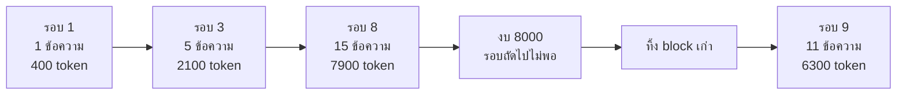

# บทที่ 4 context window คืองบประมาณ ไม่ใช่ความจำ

บั๊กที่หาที่มายากที่สุดในหลักสูตรนี้ประกาศตัวด้วย HTTP 400 ในคำขอที่ไม่มีอะไรผิดสัก
บรรทัด โค้ดที่ประกอบคำขอถูก header ถูก ชื่อ model ถูก ต้นเหตุคือฟังก์ชันตัด context
ที่ทำงานจบไปแล้วเมื่อหลายวินาทีก่อน ในเส้นทางโค้ดคนละที่ และมันตัดกลางคู่ข้อความที่ห้าม
แยกออกจากกันพอดี บทนี้มีไว้เพื่อให้มันเกิดไม่ได้ตั้งแต่โครงสร้าง

คำว่า context window (ข้อความมากสุดที่ model อ่านได้ในหนึ่งครั้ง) ทำให้คนเข้าใจผิดตั้งแต่
ชื่อ เพราะคำว่าหน้าต่างชวนให้นึกถึงพื้นที่เก็บของเหมือน RAM ที่ของอยู่ในนั้นจนกว่าจะถูก
เขียนทับ มันไม่ใช่แบบนั้นเลย context window คือขนาดสูงสุดของคำขอหนึ่งครั้ง มันคืองบประมาณ
ที่คุณจ่ายใหม่ทุกครั้งที่กดส่ง ไม่ใช่บัญชีที่ยอดสะสมอยู่ บทพื้นฐานที่ 6 บอกว่าทำไมงบนั้น
ถึงมีเพดาน ทุก token คูณทุก token

จากบทที่ 1 เรารู้แล้วว่า model ไม่มีความจำ และเราส่งบทสนทนาทั้งก้อนไปใหม่ทุกรอบ บทนี้
คือผลที่ตามมาโดยตรง เมื่อบทสนทนายาวเกินงบ มีบางอย่างต้องถูกทิ้ง และวิธีทิ้งผิดวิธีคือ
บั๊กตอนเปิดบท

การตัดกลางคู่โผล่มาสองรอบ ตอนตัด context ในหัวข้อที่ 1 และตอนมีคนกดหยุดในหัวข้อที่ 4
บทนี้แบ่งมันเป็นสามขั้น ให้เห็นอาการก่อน แล้วดูวิธีจัดกลุ่มข้อความที่ทำให้อาการนั้น
เกิดไม่ได้ แล้วค่อยดูจุดที่สองที่กฎเดียวกันโผล่มาอีกครั้ง หัวข้อที่ 5 เรื่อง prompt
caching กับหัวข้อที่ 6 เรื่องตัวนับ token ข้ามไปก่อนได้ทั้งคู่ สองหัวข้อนั้นว่าด้วยราคา
และความแม่นของตัวเลข ไม่ใช่ความถูกต้องของสิ่งที่ส่งออกไป และหัวข้อที่ 7 อ่านได้ครบโดย
ไม่ต้องพึ่งมัน

## 1. กับดักที่สำคัญที่สุดทั้งบท คือการตัดกลางคู่

งบเท่าเดิมทุกรอบ ส่วนของที่ต้องยัดลงไปโตขึ้นทุกรอบ วันหนึ่งสองเส้นนี้ก็ตัดกัน



วิธีที่ทุกคนคิดออกเป็นวิธีแรกคือ ไล่ตัดข้อความเก่าออกจากหัว list จนกว่าจำนวน token
จะพอดีงบ วิธีนี้เขียนได้ในห้าบรรทัด ใช้งานได้ในการทดลอง และมันคือหายนะ

เหตุผลคือคู่ที่ห้ามแยก จากบทที่ 2 หัวข้อ 2 เรารู้ว่าเมื่อ model ขอเรียก tool มันจะสร้าง
ข้อความของ assistant ที่มี `tool_calls` และเราตอบด้วยข้อความ role `tool` ที่มี
`tool_call_id` ตรงกัน สองข้อความนี้เป็นคู่กันเสมอ

ถ้าคุณตัดโดยนับ token ทีละข้อความ วันหนึ่งเส้นตัดจะพาดกลางคู่นั้นพอดี ผลคือ list ที่
ส่งไปมี tool result ที่ไม่มี tool call นำหน้า API ไม่ได้เมินข้อความที่กำพร้านั้น มัน
ปฏิเสธทั้งคำขอด้วย HTTP 400 (คำตอบที่บอกว่าคำขอผิดรูป) ทันที

หน้าตาของมันเป็นแบบนี้ บทสนทนามีสิบสี่ข้อความ ข้อความที่ห้าคือ assistant ที่ขอเรียก
`grep_files` และข้อความที่หกคือผลลัพธ์ของการค้นหานั้น เส้นตัดที่งบกำหนดพาดลงระหว่างห้า
กับหกพอดี สิ่งที่ออกไปบนสายจึงเริ่มด้วยผลการค้นหาของคำขอที่ไม่มีอยู่แล้ว

มันหาที่มายากเพราะ error ไม่ได้มาตอนที่คุณตัด มันมาตอนที่คุณส่งคำขอครั้งถัดไป ซึ่ง
อาจเป็นอีกหลายวินาทีให้หลัง ในเส้นทางโค้ดคนละที่กัน ไม่มีอะไรชี้ไปที่ฟังก์ชันตัด
context ที่ทำงานผ่านไปแล้ว

และ API เข้มขนาดนี้ด้วยเหตุผลที่ถูก tool result ที่ไม่มีคำขอคู่กันไม่มีความหมาย ถ้า
API ยอมรับมันเงียบๆ model จะเห็นตัวเลขลอยๆ ในบทสนทนาแล้วตีความมั่ว การปฏิเสธตรงๆ
คือพฤติกรรมที่ถูกต้อง ปัญหาอยู่ที่ฝั่งเราที่ตัดผิด

## 2. ทางแก้คือเลิกมองทีละข้อความ

วิธีของหลักสูตรนี้คือไม่ตัดสินใจในระดับข้อความเลย แต่จัดกลุ่มข้อความเป็น block (บล็อก
คือกลุ่มข้อความที่เริ่มด้วยคำถามของผู้ใช้หนึ่งข้อ) แล้วตัดสินใจทีละ block

```python
def split_into_blocks(messages: list[Message]) -> list[list[Message]]:
    """Group messages into exchanges that each begin with a user message.

    Everything the assistant said and every tool it ran belongs to the
    question that prompted it, so the question and its consequences travel
    together or not at all.
    """
    blocks: list[list[Message]] = []
    for message in messages:
        if message.role == "user" or not blocks:
            blocks.append([message])
        else:
            blocks[-1].append(message)
    return blocks
```

หั่น list ตรงตำแหน่งที่ผู้ใช้พูด แล้วถือว่าทุกอย่างหลังจากนั้นจนถึงคำพูดถัดไปของ
ผู้ใช้ เป็นของก้อนเดียวกัน แค่นั้น

block ที่นิยามแบบนี้ไม่มีทางแยกคู่ tool call กับ tool result ออกจากกันได้เลย ทั้งคู่
เกิดขึ้นหลังคำถามของผู้ใช้และก่อนคำถามถัดไปเสมอ ถ้าทิ้ง ทั้งคู่หายไปพร้อมกัน ถ้าเก็บ
อยู่ครบทั้งคู่ ความถูกต้องมาจากรูปร่างของข้อมูล ไม่ได้มาจากการเขียนเงื่อนไขเพิ่ม

มีอีกวิธีที่ดูตรงไปตรงมากว่า คือตัดตามใจแล้วค่อยวนหา tool result ที่กำพร้าเพื่อลบทิ้ง
วิธีนี้ทำได้และได้ผลถูกในกรณีที่คิดถึง แต่มันเป็นการซ่อมความผิดพลาดหลังจากทำผิดไป
แล้ว คุณต้องคิดถึงทุกกรณีให้ครบ เช่นข้อความ assistant ที่ขอ tool สามตัวแต่เหลือผลลัพธ์
สองตัว หรือลำดับที่สลับกัน รายการกรณีแบบนั้นไม่มีวันครบ และความไม่ครบของมันคือข้อ
เสียที่แท้จริง การใช้ block ทำให้กรณีเหล่านั้นไม่มีทางเกิดขึ้นตั้งแต่แรก กฎที่บังคับใช้
ตัวเองด้วยโครงสร้าง ดีกว่ากฎที่ต้องมีคนคอยตรวจครับ

## 3. อะไรที่ห้ามทิ้ง และอะไรที่ต้องเก็บแม้จะเกินงบ

```python
def fit_to_budget(messages: list[Message], budget: int) -> list[Message]:
    """Return the newest messages that fit, dropping whole exchanges.

    System messages are always kept because they are the instructions, and an
    agent that forgets its instructions half way through a task is worse than
    one that forgets the beginning of the conversation.

    The newest block is kept even when it alone is over budget. Sending
    something too large and getting a clear error back is better than sending
    a conversation with nothing in it, which fails in a way that looks like
    the model has gone mad.
    """
    system = [m for m in messages if m.role == "system"]
    rest = [m for m in messages if m.role != "system"]
    blocks = split_into_blocks(rest)

    kept: list[list[Message]] = []
    used = estimate_tokens(system)
    for block in reversed(blocks):
        cost = estimate_tokens(block)
        if kept and used + cost > budget:
            break
        kept.insert(0, block)
        used += cost
    return system + [message for block in kept for message in block]
```

มีสองการตัดสินใจในนี้ที่ควรอธิบาย

system message ถูกกันไว้เสมอ เพราะมันคือคำสั่ง agent ที่ลืมจุดเริ่มต้นของบทสนทนายัง
ทำงานต่อได้ ส่วน agent ที่ลืมว่าตัวเองคือใครและทำงานอยู่ที่ไหนจะเริ่มเดา และการเดา
ของมันจะผิดในแบบที่กินหลายรอบกว่าจะรู้ตัว

block ล่าสุดถูกเก็บแม้จะเกินงบตัวเดียว สังเกตเงื่อนไข `if kept and ...` รอบแรกของ
loop `kept` ยังว่าง เงื่อนไขจึงเป็นเท็จเสมอ block ใหม่สุดจึงเข้าไปไม่ว่าจะใหญ่แค่ไหน
กรณีที่มันเกิดจริงคือผู้ใช้วาง log ยาวสามหมื่น token ลงไปแล้วถามว่าอะไรพัง block เดียว
นั้นใหญ่กว่างบทั้งก้อน ทางเลือกอีกทางคือส่ง list ที่มีแต่ system message ซึ่ง model
จะตอบกลับมาแบบไร้ทิศทาง
โดยไม่มี error ให้ใครเห็น การส่งของที่ใหญ่เกินแล้วได้ 400 ที่ชัดเจนกลับมา ดีกว่าการส่ง
ของที่ว่างเปล่าแล้วได้คำตอบที่ดูเหมือน model เสียสติ

ฟังก์ชันคืน list ใหม่แทนที่จะแก้ list เดิม เพราะสิ่งที่ agent จำ กับสิ่งที่ agent ส่ง เป็น
คนละอย่างกัน

```python
    def _to_send(self) -> list[Message]:
        if self.budget is None:
            return self.messages
        return fit_to_budget(self.messages, self.budget)
```

```python
    def _remember(self, message: Message) -> None:
        """Add to history and tell whoever is listening.

        The loop keeps the whole history even when only part of it is sent,
        because the full record is what a session file and a debugging
        session need. What shrinks is what travels, not what is remembered.
        """
```

ประโยคสุดท้ายคือกฎ สิ่งที่หดคือสิ่งที่เดินทาง ไม่ใช่สิ่งที่ถูกจำ ไฟล์ session ต้องมีทุก
อย่าง เพราะมันคือเครื่องมือ debug อันดับหนึ่งเวลาคุณสงสัยว่าทำไม agent ทำแบบนั้น ถ้า
การตัด context ไปลบของในบันทึกด้วย คุณจะสูญเสียหลักฐานที่จำเป็นที่สุดในจังหวะที่
ต้องการมันที่สุดครับ

## 4. กฎคู่เดียวกันนี้โผล่อีกครั้งตอนถูกขัดจังหวะ

กฎว่า tool call ทุกอันต้องมีผลลัพธ์คู่กัน ไม่ได้บังคับใช้แค่ตอนตัด context มันบังคับใช้
ตลอดเวลา และจุดที่คนพลาดจุดที่สองคือตอนที่มีคนกดหยุดกลางคัน

ถ้า model ขอเรียก tool สามตัว แล้วผู้ใช้กดหยุดหลังตัวที่หนึ่งเสร็จ คุณจะได้ข้อความ
assistant ที่มีสามคำขอ ตามด้วยผลลัพธ์เพียงอันเดียว คำขอครั้งถัดไปจะโดนปฏิเสธทันที
และเพราะทุกข้อความถูกเขียนลงไฟล์ session ทันทีที่เกิด ไฟล์ session นั้นก็เสียถาวรด้วย
resume ไม่ได้อีกเลย

```python
            answered = 0
            try:
                for call in assistant.tool_calls:
                    if self.cancellation.cancelled:
                        break
                    ...
                    answered += 1
                    ...
            finally:
                for call in assistant.tool_calls[answered:]:
                    self._remember(
                        Message(
                            role="tool",
                            content="Not run. The run was stopped before this call.",
                            tool_call_id=call.id,
                        )
                    )
```

การเติมอยู่ใน `finally` ไม่ใช่หลัง loop เพราะการขัดจังหวะที่มาถึงตอน tool กำลังทำงาน
อยู่ จะโยน exception ทะลุขึ้นไปเลย โค้ดที่เขียนไว้หลัง loop ธรรมดาจะไม่ได้ทำงาน และ
คำขอที่เหลือจะไม่มีผลลัพธ์เลยสักอัน `finally` คือสิ่งเดียวที่ทำงานทั้งตอนจบปกติและ
ตอนถูกโยน

และมันใส่ข้อความว่าไม่ได้รัน แทนที่จะใส่ค่าว่าง เพราะ model
ต้องรู้ว่าเกิดอะไรขึ้น ผลลัพธ์ว่างเปล่าถูกตีความว่าคำสั่งสำเร็จแต่ไม่พิมพ์อะ
ไร ซึ่งเป็นความเข้าใจผิดคนละเรื่องกับความจริง ประโยคที่บอกตรงๆ ว่าการรันถูกหยุด
ก่อน ทำให้ model กลับมาทำงานต่อได้ถูกเมื่อมี resume

## 5. prompt caching และกฎข้อเดียวที่ตามมาจากมัน

prompt caching (ผู้ให้บริการเก็บผลของส่วนหน้าคำขอไว้ใช้ซ้ำ) คือส่วนลดที่ใหญ่ที่สุดที่มี
ให้ agent ผู้ให้บริการจดจำผลการประมวลผลของ prefix (ช่วงต้นของ request นับจากตัวอักษรแรก)
ของคำขอไว้ ถ้าคำขอถัดไปมี prefix ตรงกันทุกตัวอักษร ส่วนนั้นจะถูกคิดราคาถูกลงมาก และประมวล
ผลเร็วขึ้นด้วย

agent คือกรณีที่เหมาะที่สุด เพราะจากบทที่ 1 ทุกรอบส่งบทสนทนาทั้งก้อนไปใหม่ รอบที่สิบ
มี prefix ที่เหมือนรอบที่เก้าเกือบทั้งหมด นี่คือรูปแบบการใช้งานที่ cache ถูกสร้างมา
เพื่อมันโดยตรง

**ของนิ่งต้องอยู่หน้า ของเปลี่ยนต้องอยู่ท้าย**

เพราะ cache จับคู่จาก prefix
ตัวอักษรเดียวที่ต่างกันที่ตำแหน่งต้นๆ ทำให้ทุกอย่างหลังจากนั้นใช้ cache
ไม่ได้เลย ถ้าคุณใส่เวลาปัจจุบัน ชื่อผู้ใช้ หรือ session id ไว้ต้น system prompt
cache จะพังทุกคำขอ ตลอดไป บรรทัดเวลาบรรทัดเดียวที่ต้นคำขอ แลกส่วนลดของ prefix
สามพัน token ทิ้งไปทั้งบทสนทนาสี่สิบรอบ เพื่อข้อมูลที่ย้ายไปต่อท้ายก็ได้ การสลับ
ลำดับ tool definition ให้ผลเดียวกันถ้า tool ของคุณเก็บใน set หรือคุณ generate
schema ใหม่ทุกรอบด้วยลำดับที่ต่างกัน prefix จะไม่ตรงและ cache จะไม่เคยทำงาน

สิ่งที่ทำให้เรื่องนี้อันตรายคือไม่มีอะไร error ทั้งสิ้น โปรแกรมทำงานถูกต้องทุกอย่าง
คำตอบก็ดี ไม่มี log ผิดปกติ สิ่งเดียวที่เกิดขึ้นคือบิลแพงกว่าที่ควรหลายเท่า และคุณจะ
ไม่มีวันรู้ถ้าไม่ไปดูตัวเลข cache ที่ผู้ให้บริการรายงานกลับมา `Usage` เก็บ `per_call` ไว้
ทั้งก้อนแทนที่จะเก็บแค่ยอดรวมก็เพื่อเรื่องนี้ แต่รู้ไว้ว่าตอนนี้มันเห็นได้เฉพาะฝั่ง OpenAI
compatible ที่ cache เกิดเองและรายงานมาในก้อน usage ส่วน Anthropic ต้องประกาศจุด
cache ในคำขอ และ `normalise_usage` ของ provider ตัวนั้นยังทิ้งตัวเลขนี้อยู่ครับ

## 6. ตัวนับ token ของแต่ละเจ้าไม่เท่ากัน

หัวข้อนี้ต่อจากบทที่ 1
แต่ผลของมันตกอยู่ที่บทนี้โดยตรง การตัดสินใจว่าจะตัดหรือไม่ตัด ต้องอาศัยตัวเลขว่า
ตอนนี้ใช้ไปเท่าไหร่แล้ว ถ้าตัวเลขนั้นมาจาก tokenizer
ของผู้ให้บริการคนละรายกับที่คุณกำลังคุยอยู่ การตัดสินใจทั้งหมดตั้งอยู่บนตัวเลข
ที่ผิด บทพื้นฐานที่ 2 แสดงว่าทำไม tokenizer
สองตัวถึงนับข้อความเดียวกันได้ต่างกัน ตั้งแต่สิบกว่าเปอร์เซ็นต์ระหว่างผู้ให้บริ
การ ไปจนถึงสามเท่าเมื่อ tokenizer ไม่เคยเห็นภาษานั้น

```python
CHARACTERS_PER_TOKEN = 4
PER_MESSAGE_OVERHEAD = 4
```

หลักสูตรนี้จึงใช้การประมาณแบบหยาบที่สุด คือนับตัวอักษรแล้วหารสี่ บวกค่าคงที่ต่อข้อความ
อีกเล็กน้อย ยอมใช้ของที่ไม่แม่นเพราะความแม่นที่เพิ่มขึ้นไม่ได้เปลี่ยนการตัดสินใจ หน้าที่
ของตัวเลขนี้คือบอกว่าใกล้เต็มหรือยัง ไม่ใช่บอกว่าเต็มเท่าไหร่ และการรู้ว่ามันหยาบ ทำให้
คุณตั้งงบไว้ที่ระดับที่ปลอดภัย แทนที่จะตัดถึงเก้าสิบเปอร์เซ็นต์ของหน้าต่างแล้วยังโดน
ปฏิเสธอยู่ดี

ไม่ลง dependency ที่แม่นกว่า เพราะมันแม่นกับผู้ให้บริการรายเดียว harness ที่คุยกับสอง
เจ้าแล้วใช้ตัวนับตัวเดียวสำหรับทั้งคู่ ก็ยังตัดสินใจบนตัวเลขที่ผิดอยู่ดี แค่ผิดอย่างมั่นใจ
กว่าเดิม

ตัวเลขที่แม่นจริงมีอยู่ที่เดียว คือตัวเลขที่ผู้ให้บริการรายงานกลับมาหลังส่ง และมันมาช้า
เกินกว่าจะใช้ตัดสินใจก่อนส่ง สองอย่างนี้จึงต้องแยกหน้าที่กัน ตามที่อธิบายในบทที่ 1

## 7. ลำดับสิ่งที่ควรทำเมื่อ context เริ่มเต็ม

การตัดบทสนทนาเป็นทางเลือกสุดท้าย ไม่ใช่ทางแรก เรียงตามผลกระทบจริง

1. ตัด output ของ tool ก่อนส่งกลับ ผลลัพธ์ยาวหนึ่งครั้งถูกจ่ายซ้ำทุกรอบที่เหลือของ
   บทสนทนา `grep_files` ที่คืนสี่พันบรรทัดในรอบที่สอง ยังถูกส่งไปครบสี่พันบรรทัดใน
   รอบที่สิบสอง `truncate` ใน `files.py` มีอยู่เพราะเหตุนี้

2. อ่านไฟล์เฉพาะช่วงแทนทั้งไฟล์ ถ้า agent ต้องการฟังก์ชันเดียว การใส่ไฟล์สองพัน
   บรรทัดเข้าไป คือการจ่ายค่าอีกหนึ่งพันเก้าร้อยบรรทัดทุกรอบ

3. ไม่ส่ง schema ของ tool ที่ไม่ได้ใช้ ตามที่อธิบายในบทที่ 3

4. จัดของนิ่งไว้หน้า เพื่อไม่ให้ cache พัง ซึ่งไม่ได้ลดจำนวน token แต่ลดราคาของมัน

5. ตัดบทสนทนาเก่าทิ้งเป็น block ซึ่งคือหัวข้อที่ 2 ของบทนี้

สี่ข้อแรกไม่ทำให้ agent ลืมอะไรเลย มีแต่ข้อสุดท้ายที่ทำ มันจึงอยู่ท้ายสุดครับ

## บทเรียนที่ลงมือทำเรื่องนี้

| บทเรียน | สิ่งที่ได้ลงมือทำ |
| --- | --- |
| 13 sessions | เขียน JSONL ทีละบรรทัดขณะเกิดเหตุ และเห็นว่าทำไมบันทึกต้องครบแม้สิ่งที่ส่งจะไม่ครบ |
| 14 context management | สร้าง 400 ขึ้นมาดูด้วยตาเอง แล้วแก้ด้วยการตัดเป็น block |
| 15 token economy | วัดการโตของ prompt tokens จัดของนิ่งไว้หน้าเพื่อรักษา cache และตัด output ของ tool |
| 17 errors and retries | เติมผลลัพธ์ให้คำขอที่ค้างใน finally เพื่อไม่ให้การกดหยุดทำลายไฟล์ session |
