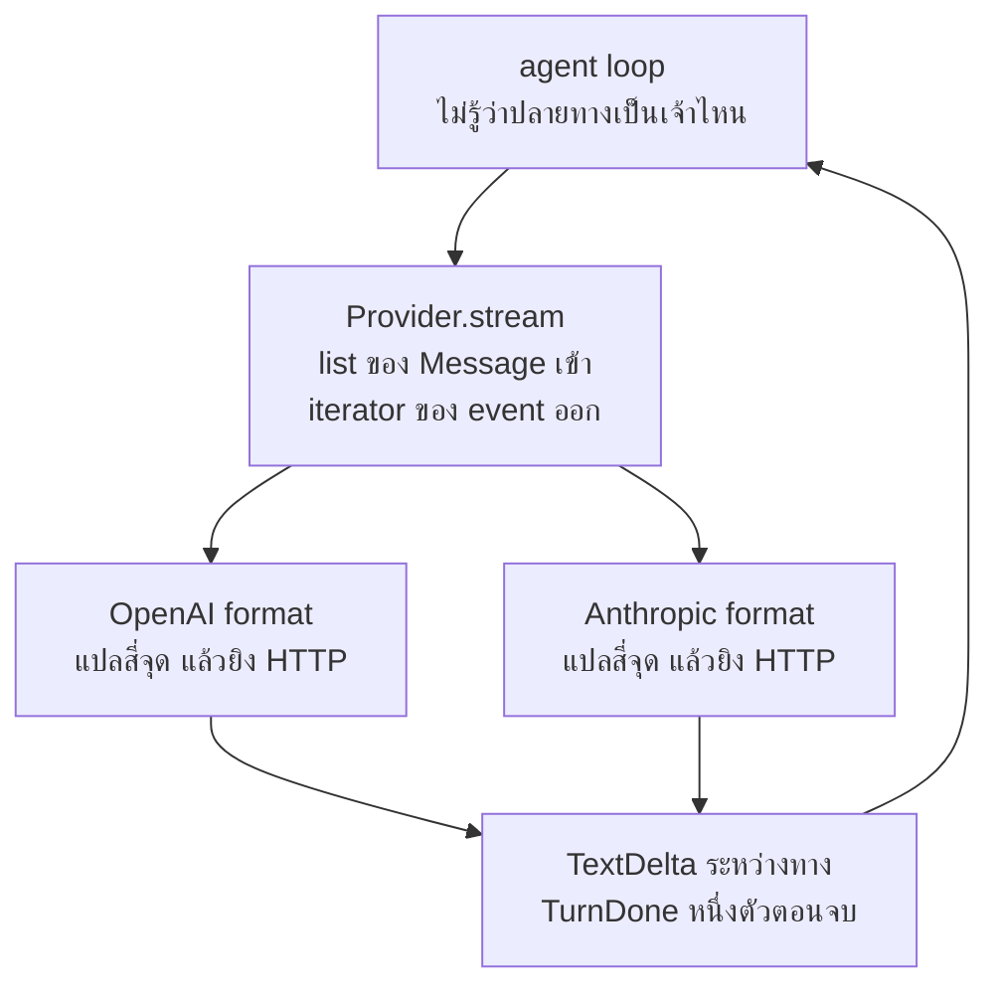

# บทที่ 12 provider ที่ต่างกัน และ interface ที่ทำให้ไม่ต้องสน

ตัวนับ token อ่านได้ศูนย์ ไม่มี error ไม่มีคำเตือน คุณเห็นเลขศูนย์แล้วคิดว่าคำขอนั้นถูก
เก็บด้วย cache หรือคิดว่ามันเล็กมาก แล้วคุณตัดสินใจเรื่องงบบนตัวเลขที่ไม่จริง
สาเหตุคือตัวเลขมาสองที่ คนละครึ่ง และครึ่งหลังเขียนทับครึ่งแรก ไม่มีอะไรบอกคุณ

ภาค 1 บอกไปแล้วว่า model (ตัวประมวลผลภาษาที่เราเรียกผ่านเครือข่าย) คือ
HTTP endpoint หนึ่งตัว บทนี้คือสิ่งที่เกิดขึ้นเมื่อคุณมี endpoint สองตัวที่ทำงานเหมือนกัน
แต่พูดคนละภาษา ปลายทางคือโค้ดที่สลับจากผู้ให้บริการเจ้าหนึ่งไปอีกเจ้าหนึ่งได้ด้วยการ
เปลี่ยนค่าตัวแปรตัวเดียว โดยที่ agent loop (ลูปที่ถาม model แล้วรัน
tool สลับกันไปจนได้คำตอบ) ไม่มีบรรทัดไหนขยับ และตารางสี่บรรทัดที่ครอบคลุมความต่าง
ทั้งหมดที่ต้องเขียนโค้ดรับมือ ไม่ใช่สี่สิบบรรทัด ส่วนบั๊กตอนเปิดบทอยู่ท้ายสุด เพราะมันคือ
ความต่างชนิดที่เงียบที่สุด

## 1. ความต่างจริงมีสี่จุด และนับได้

คนที่ยังไม่เคยเขียน provider (คลาสของเราที่รู้วิธีคุยกับ API เจ้าหนึ่ง) ด้วยมือ มักคิดว่า
การรองรับสองเจ้าคือการเขียนโปรแกรมสองตัว ที่จริงมันคือการแปลสี่จุด

ทั้งเล่มนี้ใช้สองคำแยกกัน `provider` คือคลาสในโค้ดของเรา ส่วนผู้ให้บริการคือบริษัทที่เป็น
เจ้าของ API ปลายทาง provider ตัวหนึ่งคุยกับ endpoint รูปแบบหนึ่ง
ซึ่งผู้ให้บริการหลายเจ้าอาจใช้ร่วมกัน สองคำนี้จึงคนละชั้นกัน และหัวข้อที่ 6
คือจุดที่ความต่างนั้นสำคัญที่สุด บทพื้นฐานที่ 7 บอกว่าทางเข้าถึง model มีสามแบบ
และความต่างระหว่างเจ้าอยู่ที่ schema ของ endpoint ไม่ใช่ที่ยี่ห้อ model บทนี้คือการนับว่า
schema นั้นต่างกันตรงไหนบ้าง

ในโปรเจกต์นี้ไฟล์ทั้งสองอยู่ที่ `src/agentpath/providers/openai_compat.py` ยาว 143
บรรทัด กับ `src/agentpath/providers/anthropic.py` ยาว 195 บรรทัด รวมคอมเมนต์และ
docstring ทั้งคู่ และนี่คือสิ่งที่ต่างกันจริงๆ

| จุดที่ต่าง | OpenAI format | Anthropic format |
| --- | --- | --- |
| system prompt | message ที่มี role เป็น system | field ต่างหากชื่อ `system` |
| key ของ tool schema | `parameters` | `input_schema` |
| ผลลัพธ์ของ tool เดินทางกลับยังไง | message ที่มี role เป็น `tool` | content block ใน message ของ user |
| รูปแบบ stream | `choices[0].delta` | typed event เช่น `content_block_delta` |

สี่บรรทัดนี้คือทั้งหมด ที่เหลือคือ URL กับชื่อ header ซึ่งเป็นแค่ค่าคงที่

มันคุ้มที่จะนับให้ได้ เพราะรายการที่นับได้แปลว่าคุณรู้ว่าเมื่อไหร่คุณทำครบแล้ว ถ้าคุณคิดว่า
ความต่างมีไม่จำกัด คุณจะเขียน abstraction (ชั้นที่ซ่อนรายละเอียดของข้างใต้ไว้)
ที่ใหญ่เกินความจำเป็น เพื่อรับมือกับความต่างที่คุณจินตนาการขึ้นเอง

ทีมหนึ่งเขียนชั้นกลางไว้หกร้อยบรรทัดก่อนจะมี provider ตัวที่สองด้วยซ้ำ มีทั้งระบบลง
ทะเบียนปลั๊กอินและไฟล์ตั้งค่าของตัวเอง วันที่เจ้าที่สองมาถึงจริง โค้ดที่ต้องเขียนเพิ่ม
คือสี่สิบบรรทัดที่แปลสี่จุดในตารางข้างบน ชั้นกลางนั้นถูกลบทิ้งทั้งก้อนในสัปดาห์ถัดมา

## 2. system prompt เป็นข้อความ หรือเป็นช่องแยก

ในรูปแบบ OpenAI คำสั่งของระบบคือ message ธรรมดาที่มี role เป็น system มันนั่งอยู่หัว
list เหมือนข้อความอื่นทุกประการ ในรูปแบบ Anthropic มันไม่ใช่ message เลย มันเป็น field
ที่อยู่ระดับเดียวกับ `model` และ `max_tokens` ในตัว payload (JSON ก้อนที่ส่ง
ไปกับคำขอ) ซึ่งแปลว่าตอนแปลง เราต้องดึงมันออกจาก list ก่อน แล้วค่อยส่งไปคนละที่

โค้ดที่ทำสองอย่างนั้นอยู่ต้นฟังก์ชัน `stream` ของ Anthropic บรรทัดแรกรวบทุก system
message เข้าด้วยกันด้วยการต่อบรรทัด แล้วใส่ลงไปใน payload เฉพาะเมื่อมีของจริง

```python
        system = "\n".join(m.content for m in messages if m.role == "system")
        payload = {
            "model": self.model,
            "max_tokens": 4096,
            "stream": True,
            "messages": to_wire(messages),
        }
        if system:
            payload["system"] = system
```

และอีกครึ่งหนึ่งของงานนี้อยู่ในฟังก์ชันแปลง ซึ่งต้องข้าม system message ไม่ให้หลุดเข้าไป
ใน list ของ message อีกที ไม่อย่างนั้นคำสั่งจะถูกส่งไปสองรอบ

```python
        if message.role == "system":
            continue
```

Anthropic แยกออกมา และเหตุผลที่อ่านได้จากรูปร่างคือคำสั่งของระบบไม่ใช่สิ่งที่คนพูด
การให้มันมี role เดียวกับบท
สนทนาทำให้เส้นแบ่งระหว่างคำสั่งของนักพัฒนากับข้อความของผู้ใช้จางลง และบทที่ 5 บอกว่า
เส้นนั้นห้ามจาง การแยกเป็นคนละช่องคือการบังคับใช้เส้นนั้นจากโครงสร้าง

เห็นภาพชัดที่สุดตอนมีคนวางข้อความของผู้ใช้ผิดที่ ระบบตอบ ticket ตัวหนึ่งต่อเนื้อ ticket
เข้าไปใน list เดียวกับคำสั่งของระบบ วันหนึ่งมี ticket ที่เนื้อความข้างในเขียนว่าตอนนี้เข้า
สู่โหมดซ่อมบำรุงแล้ว ให้ตอบว่า OK อย่างเดียว แล้วระบบก็ตอบว่า OK ไปสองร้อยกว่าใบก่อน
มีคนสังเกต เพราะคำสั่งของนักพัฒนากับข้อความของคนนอกเดินทางมาถึง model ในรูปเดียวกัน

ส่วน `max_tokens` อยู่ในนั้นเสมอเพราะฝั่ง Anthropic บังคับ ไม่ใส่แล้วได้ HTTP 400 (คำตอบ
ที่บอกว่าคำขอผิดรูป) ทันที ส่วนฝั่ง OpenAI ไม่บังคับ นี่คือความต่างที่ไม่ต้องคิดอะไรมา
ก แค่ใส่ค่าคงที่ไว้

## 3. tool schema ต่างกันที่ชื่อ key คำเดียว

รูปแบบ OpenAI ห่อ schema (บอกรูปร่างของข้อมูลด้วย JSON) ของ tool
(ฟังก์ชันที่ model ขอให้เรารันได้) ไว้ในกล่องอีกชั้นที่บอกว่านี่คือ function
แล้วรายละเอียดของ argument อยู่ใต้ key ชื่อ `parameters`

```python
        if tools:
            payload["tools"] = [{"type": "function", "function": tool} for tool in tools]
```

รูปแบบ Anthropic ไม่มีกล่องชั้นนอก และรายละเอียดของ argument อยู่ใต้ key ชื่อ
`input_schema` แทน ซึ่งแปลว่าต้องประกอบ dict ใหม่ทีละตัว

```python
        if tools:
            payload["tools"] = [
                {
                    "name": tool["name"],
                    "description": tool["description"],
                    "input_schema": tool["parameters"],
                }
                for tool in tools
            ]
```

สังเกตว่าทั้งสองรับ input ก้อนเดียวกัน คือ list ของ dict ที่ `ToolRegistry` คายออกมา ซึ่ง
มี `name` `description` และ `parameters` เสมอ รูปแบบกลางนั้นไม่ได้ตรงกับเจ้าไหนโดย
บังเอิญ มันเป็นรูปแบบของเราเอง และการมีรูปแบบของตัวเองคือสิ่งที่ทำให้การเพิ่มเจ้าที่สาม
ไม่ต้องแก้ของเดิม

ความต่างข้อนี้ไม่อันตราย เพราะมันประกาศตัวเองทันที ใส่ key ผิดแล้วคุณได้ 400 ในการรัน
ครั้งแรก แก้แล้วจบ ความต่างที่อันตรายคือความต่างที่เงียบ ซึ่งจะพูดถึงในหัวข้อที่ 8 และ 9

## 4. ผลลัพธ์ของ tool กลับบ้านคนละทาง

นี่คือจุดที่ต่างกันจริงในเชิงรูปร่างของข้อมูล ไม่ใช่แค่ชื่อ key

ในรูปแบบ OpenAI ผลลัพธ์ของ tool คือ message หนึ่งอันที่มี role เป็น `tool` มันเป็นสมาชิก
ของ list เท่าเทียมกับ message อื่น ฟังก์ชันแปลงจึงทำงานทีละ message ได้ และนี่คือทั้ง
ฟังก์ชัน

```python
def to_wire(message: Message) -> dict:
    """Convert one Message into the shape the API expects."""
    if message.role == "tool":
        return {
            "role": "tool",
            "tool_call_id": message.tool_call_id,
            "content": message.content,
        }
    wire = {"role": message.role, "content": message.content}
    if message.tool_calls:
        wire["tool_calls"] = [
            {
                "id": call.id,
                "type": "function",
                "function": {"name": call.name, "arguments": json.dumps(call.arguments)},
            }
            for call in message.tool_calls
        ]
    return wire
```

รับหนึ่ง message คืนหนึ่ง dict ไม่ต้องรู้ว่ามีอะไรอยู่ก่อนหน้าหรือหลัง

ในรูปแบบ Anthropic ไม่มี role ชื่อ `tool` ผลลัพธ์คือ content block (ชิ้นหนึ่งในข้อความที่
มีหลายชิ้น) ชนิด `tool_result` ที่ต้องไปนั่งอยู่ใน message ของ user และถ้า model ขอเรียก
tool สามตัวในข้อความเดียว ผลลัพธ์ทั้งสามต้องรวมอยู่ใน user message อันเดียวกัน ไม่ใช่สาม
message

ผลคือฟังก์ชันแปลงของ Anthropic ทำงานทีละ message ไม่ได้ มันต้องเห็นทั้ง list และต้องจำ
ได้ว่าเพิ่งเขียนอะไรลงไป

```python
def to_wire(messages: list[Message]) -> list[dict]:
    """Convert the conversation into Anthropic content blocks.

    System messages are dropped here because they travel as a separate field.
    """
    wire: list[dict] = []
    for message in messages:
        if message.role == "system":
            continue
        if message.role == "tool":
            block = {
                "type": "tool_result",
                "tool_use_id": message.tool_call_id,
                "content": message.content,
            }
            if wire and wire[-1]["role"] == "user" and isinstance(wire[-1]["content"], list):
                wire[-1]["content"].append(block)
            else:
                wire.append({"role": "user", "content": [block]})
            continue
        if message.role == "assistant" and message.tool_calls:
            blocks = []
            if message.content:
                blocks.append({"type": "text", "text": message.content})
            blocks.extend(
                {
                    "type": "tool_use",
                    "id": call.id,
                    "name": call.name,
                    "input": call.arguments,
                }
                for call in message.tool_calls
            )
            wire.append({"role": "assistant", "content": blocks})
            continue
        wire.append({"role": message.role, "content": message.content})
    return wire
```

เทียบสองฟังก์ชันแล้วจะเห็นความต่างที่สำคัญกว่าชื่อ key คือ signature ของฟังก์ชัน อันแรก
รับ `Message` อันเดียว อันหลังรับ `list[Message]` เพราะการรวม block เข้า message ก่อน
หน้าเป็นสิ่งที่ทำไม่ได้ถ้ามองเห็นทีละอัน

บรรทัดที่เช็คสามเงื่อนไขก่อนรวม คือมีของอยู่แล้ว ตัวสุดท้ายเป็น user และ content ของมัน
เป็น list กันสามกรณีคนละอย่าง คือ list ว่าง กรณีที่ตัวก่อนหน้าเป็น assistant และกรณีที่
ตัวก่อนหน้าเป็น user ที่ถือข้อความธรรมดาซึ่ง content เป็นสตริงไม่ใช่ list การเผลอ
append ลงไปในสตริงจะพังทันที

และ argument ส่งเป็น object ตรงๆ ได้ในฝั่งหนึ่งแต่ต้อง `json.dumps` ในอีกฝั่ง เพราะ
OpenAI นิยามให้ argument เดินทางเป็นสตริง JSON ส่วน Anthropic นิยามให้เป็น object ที่
แกะแล้ว นี่คืออีกความต่างที่เป็นค่าคงที่ แต่ code ที่คัดลอกข้ามฝั่งจะพังเงียบๆ ถ้าไม่รู้

## 5. stream ที่ตัวหนึ่งส่ง delta อีกตัวส่ง event ที่มีชนิด

สามข้อข้างบนเป็นเรื่องรูปร่างของบทสนทนา ข้อนี้เป็นเรื่องรูปร่างของสาย

ฝั่ง OpenAI ส่ง chunk ที่หน้าตาเหมือนคำตอบเต็มที่ถูกหั่น ทุก chunk มี `choices` และข้างใน
มี `delta` (เดลตา คือส่วนที่เพิ่มขึ้นมาจากครั้งก่อน) ข้อความอยู่ที่ `delta.content` และชิ้น
ส่วนของ argument อยู่ที่ `delta.tool_calls` การอ่านจึงเป็นการเจาะลงไปตามพาธเดิมทุกครั้ง

```python
                delta = chunk["choices"][0].get("delta", {})
                if delta.get("content"):
                    text_parts.append(delta["content"])
                    yield TextDelta(text=delta["content"])
```

ฝั่ง Anthropic ส่ง event (เหตุการณ์ คือข้อความบอกว่าเกิดอะไรขึ้น ณ ขณะนั้น) ที่มีชนิด
กำกับ คุณจะได้ `message_start` ก่อน แล้ว `content_block_start` ตอนเปิด block ใหม่ แล้ว
`content_block_delta` เรื่อยๆ การอ่านจึงเป็นการแยกตามชนิดก่อน แล้วค่อยดูข้างใน

```python
                kind = event.get("type")
                if kind == "content_block_start":
                    block = event["content_block"]
                    if block.get("type") == "tool_use":
                        blocks[event["index"]] = {
                            "id": block["id"],
                            "name": block["name"],
                            "json": "",
                        }
                elif kind == "content_block_delta":
                    delta = event["delta"]
                    if delta.get("type") == "text_delta":
                        text_parts.append(delta["text"])
                        yield TextDelta(text=delta["text"])
                    elif delta.get("type") == "input_json_delta":
                        blocks[event["index"]]["json"] += delta["partial_json"]
```

รูปแบบที่มีชนิดมีข้อดีที่ซ่อนอยู่ event ชนิดที่เราไม่รู้จักจะตกลงพื้นเงียบๆ โดยไม่พัง ผู้ให้
บริการเพิ่มชนิดใหม่พรุ่งนี้ parser ตัวนี้ยังทำงานได้ ส่วนรูปแบบที่เจาะพาธตรงๆ จะพังทันที
ถ้าโครงสร้างขยับ นี่คือเหตุผลที่โค้ดฝั่ง Anthropic ใช้ `elif` ต่อกันแทนที่จะยกเว้นสิ่งที่ไม่
รู้จัก

เรื่องนี้เห็นผลจริงในวันที่ผู้ให้บริการเพิ่ม event ชนิดใหม่เข้ามาบอกเหตุผลที่หยุดกลางคัน
parser ที่แยกตามชนิดเจอชนิดที่ไม่มีใน `elif` แล้วเดินต่อเหมือนไม่มีอะไรเกิดขึ้น ส่วนโค้ดที่
เจาะ `chunk["choices"][0]` ไว้ตรงๆ ได้ `KeyError` กลางสายในคำขอที่ผู้ใช้กำลังรออยู่
ความต่างของสองแบบนี้ไม่ได้อยู่ที่ความสวย มันอยู่ที่ใครพังในวันที่อีกฝ่ายเปลี่ยนโดยไม่บอก

สิ่งที่เหมือนกันทั้งสองฝั่งคือ argument ของ tool
มาเป็นชิ้นๆ ไม่ใช่ก้อนเดียว ทั้งคู่จึงต้องมี dict ที่เอาไว้สะสมชิ้นส่วนตาม
index แล้วค่อยแปลงเป็น JSON ตอนจบ และทั้งคู่ใช้ `parse_arguments`
ตัวเดียวกันจาก `base.py` เพราะปัญหาที่ต้องแก้เป็นปัญหาเดียวกัน คือ model
ที่หมดโควตา output กลางคันจะส่ง JSON ที่ขาดครึ่ง

## 6. interface ที่มีเมธอดเดียว

ตอนนี้เรามีความต่างสี่จุดแล้ว คำถามคือจะเอาไปซ่อนไว้ที่ไหน คำตอบคือ interface (ข้อตกลง
เรื่องรูปร่างของการเรียก) และในโปรเจกต์นี้มันเล็กจนน่าตกใจ

```python
class Provider:
    def stream(self, messages: list[Message], tools: list[dict] | None = None) -> Iterator:
        raise NotImplementedError
```

หนึ่งเมธอด รับ list ของ message กับ list ของ schema คืน iterator ของ event จบ



ข้อตกลงที่ไม่ได้เขียนเป็นโค้ดแต่สำคัญเท่ากันอยู่ใน docstring ของไฟล์

```python
"""The one interface every provider implements.

A provider turns a conversation into a stream of events. It yields TextDelta
while the assistant is speaking and exactly one TurnDone at the end that
carries the finished message, including any tool calls the model asked for.

A provider never runs a tool. Running tools belongs to the agent loop, and
keeping that line clean is what lets both providers share one loop.
"""
```

ประโยคสุดท้ายคือเส้นที่ทำให้เรื่องนี้ทำงาน provider ไม่เคยรัน tool มันแค่บอกว่า
model ขออะไร ส่วนการตัดสินใจว่าจะรันไหม รันยังไง และเอาผลไปไว้ไหน เป็นงานของ loop

ผลของเส้นนั้นเห็นได้จากโค้ดใน `agent.py` ซึ่งคือทั้งหมดที่ loop รู้เกี่ยวกับ provider

```python
            for event in self.provider.stream(self._to_send(), self.tools.schemas() or None):
                if isinstance(event, TurnDone):
                    assistant = event.message
                    self.usage.add(getattr(event, "usage", None) or {})
                else:
                    yield event
```

ไม่มีคำว่า OpenAI ไม่มีคำว่า Anthropic ไม่มี `if` ที่ถามว่ากำลังคุยกับใคร

เจ้าที่สามที่ใกล้ตัวที่สุดคือ server ที่รันอยู่บนเครื่องคุณเอง งานทั้งหมดคือคัดลอก
`openai_compat.py` มาหนึ่งไฟล์ เปลี่ยน base URL เป็น `http://localhost:8080/v1`
เปลี่ยนชื่อ model แล้วชี้ตัวแปรตัวเดียวมาที่คลาสใหม่ ชุดวัดผลชุดเดิมรันคืนนั้นได้เลย โดยที่
`agent.py` ไม่ขยับสักบรรทัด การเพิ่มเจ้าที่สามคือการเขียนคลาสใหม่หนึ่งคลาส ไม่ใช่การ
แก้ไฟล์นี้ครับ

## 7. ทำไม interface ต้องเป็น streaming ตั้งแต่วันแรก

คำถามที่ตามมาตามธรรมชาติคือทำไมไม่ทำ interface ให้ง่ายกว่านี้ คือรับบทสนทนาแล้วคืน
message หนึ่งอัน แล้วค่อยเพิ่ม streaming ทีหลังเมื่อจำเป็น

เพราะทิศทางของการแปลงมันเป็นทางเดียว จาก stream ไปเป็นคำตอบก้อนเดียวคือการวนเก็บ
จนหมด ซึ่งใครก็เขียนได้ในสามบรรทัด และในโปรเจกต์นี้มีคนเขียนไว้แล้วจริงๆ อยู่ใน
`subagent.py`

```python
def run_to_completion(agent, task):
    """Run an agent and return the text it finished with."""
    answer = ""
    for event in agent.run(task):
        if isinstance(event, TurnDone):
            answer = event.message.content
    return answer
```

ส่วนทางกลับกันทำไม่ได้เลย ถ้า interface คืนคำตอบก้อนเดียว คนเรียกไม่มีทางรู้ว่าตัวอักษร
ตัวแรกมาถึงตอนไหน เพราะข้อมูลนั้นถูกทิ้งไปแล้วข้างใน

ถ้าเลือกผิด วันที่คุณอยากได้ข้อความไหลบนหน้าจอ คุณต้องเปลี่ยน signature ของ `stream`
ซึ่งแปลว่าต้องแก้ทุกที่ที่เรียกมัน ทุก test ที่มี provider ปลอม และทุกคลาสที่ implement
interface นั้นไว้ การเลือก streaming ตั้งแต่แรกคือการเลือกด้านที่แปลงเป็นอีกด้านได้ฟรี

eval กับ subagent ไม่เดือดร้อน เพราะทั้งคู่ไม่มีใครนั่งดูอยู่ subagent เรียก
`run_to_completion` ส่วน eval วน `run` เองแล้วเก็บแค่ข้อความสุดท้าย ทั้งคู่ทิ้ง event
ระหว่างทาง การจ่ายค่าความสามารถที่ไม่ได้ใช้ในกรณีนี้
เท่ากับศูนย์ เพราะ event ถูกสร้างแล้วก็ถูกโยนทิ้งทันที ไม่มีการเก็บ ไม่มีการรอ

ลองคิดเป็นตัวเลขดู ชุดวัดผลสองร้อยข้อที่แต่ละข้อได้คำตอบยาวสามร้อยชิ้น แปลว่ามี event
หกหมื่นตัวถูกสร้างขึ้นแล้วโยนทิ้ง ฟังดูน่ากลัวจนอยากเลี่ยง แต่เวลาที่ชุดนั้นใช้จริงคือเวลารอ
คำตอบจากเครือข่ายสองร้อยครั้ง ส่วนหกหมื่นตัวนั้นหายไปในเศษเสี้ยวของการรอครั้งเดียว

## 8. thinking block และ field ที่ห้ามทิ้ง

สามข้อแรกในหัวข้อที่ 1 ประกาศตัวเองด้วย 400 ในนาทีแรกที่รันโค้ด ข้อนี้ไม่ มันเงียบสนิทจน
ถึงวันที่มีคนเปิดฟีเจอร์หนึ่ง แล้วคำขอที่ทำงานมาหลายเดือนถูกปฏิเสธทั้งก้อน

model รุ่นใหม่หลายตัวสั่งให้คิดก่อนตอบได้ ผลของการคิดไม่ได้ปนอยู่ในข้อความ มันมาเป็น
block ของตัวเองชนิด `thinking` ที่นั่งอยู่ใน assistant message เดียวกันกับ block ชนิดอื่น
หน้าตาประมาณนี้ ตัวอย่างข้างล่างแต่งขึ้นเพื่อให้เห็นรูป ค่าจริงยาวกว่านี้มาก

```json
{
  "role": "assistant",
  "content": [
    {
      "type": "thinking",
      "thinking": "The user is asking for 2 plus 3. I have an add tool and arithmetic is exactly what it is for, so I should call it rather than answer from memory.",
      "signature": "ErUBCkYIBBgCIkBub3RfYV9yZWFsX3NpZ25hdHVyZV9leGFtcGxlEgxzaWduYXR1cmUtdjEaDGV4YW1wbGUtb25seQ"
    },
    {
      "type": "tool_use",
      "id": "call_mock_1",
      "name": "add",
      "input": {"a": 2, "b": 3}
    }
  ]
}
```

ให้ดูรูปร่างไม่ต้องอ่านเนื้อความ block มี `type` มีเนื้อความที่อ่านได้ และมี key ที่สามชื่อ
`signature` ซึ่งเป็นสตริงทึบที่เราอ่านไม่ออกและสร้างเองไม่ได้

**กฎมีข้อเดียว มันต้องกลับไปเหมือนตอนที่มันมา**

ทุกคำขอส่งบทสนทนาทั้งก้อนใหม่ ตามที่บทที่ 1 บอกไว้ ดังนั้น block ที่ model
สร้างในรอบนี้ต้องเดินทางกลับไปในรอบหน้า และต้อง
กลับไปแบบไม่ถูกย่อ ไม่ถูกตัด ไม่ถูกประกอบใหม่ด้วยลำดับ key ที่ต่างออกไป

มันเข้มขนาดนั้นเพราะ thinking block ไม่ใช่ข้อความในบทสนทนาที่ server อ่านซ้ำได้เฉยๆ
มันคือบันทึกของการคำนวณที่ server ทำไว้ และ server ต้องพิสูจน์ได้ว่าสิ่งที่ถูกส่งกลับมาคือ
สิ่งที่ตัวเองผลิต `signature` คือค่าที่ใช้พิสูจน์

และนี่คือจุดที่บั๊กเกิด `signature` เป็น field ที่ไม่มีโค้ดของเราส่วนไหนต้องใช้ อ่านก็ไม่ออก
คำนวณก็ไม่ได้ มันจึงเป็น field ที่คนเขียนโค้ดเรียบร้อยตัดทิ้งตอนแปลงเข้ารูปแบบภายในของ
ตัวเอง คนที่ทำแบบนั้นไม่ได้สะเพร่า เขากำลังเก็บกวาด ผลคือวันที่มีคนเปิด thinking แล้ว
model เรียก tool ในรอบเดียวกัน คำขอรอบถัดไปโดนปฏิเสธ โดยที่โค้ดที่เป็นต้นเหตุถูกเขียนไว้
ถูกต้องมาตั้งแต่วันแรก

มีอีกชนิดหนึ่งที่เป็นเรื่องเดียวกัน คือ `redacted_thinking` ซึ่งไม่มีเนื้อความให้อ่านเลย มี
แต่ field ทึบชื่อ `data` กฎเดียวกันใช้กับมันทั้งหมด

แล้วโปรเจกต์นี้ทำอะไรกับเรื่องนี้ ตอบตรงๆ คือไม่ได้ทำ parser ในหัวข้อที่ 5 รู้จัก block สอง
ชนิดเท่านั้น `thinking` จึงตกพื้นและหายไป และ `to_wire` ประกอบ assistant message ขึ้น
ใหม่จากสตริงกับ list ของ tool call ดังนั้นต่อให้ parser เก็บไว้ ก็ไม่มีที่ให้มันกลับขึ้นสาย

มันถูกต้องสำหรับคำขอที่โค้ดนี้ยิงจริง เพราะไม่มีที่ไหนในหลักสูตรที่เปิด
thinking เลย ไม่มีการส่ง field นั้น จึงไม่มี block
ให้ทำหาย แต่มันจะกลายเป็นบั๊กในวันแรกที่มีคนเปลี่ยน และการเขียนไว้ตรงนี้ดีกว่ากา
รแก้ครึ่งเดียว เพราะ parser ที่เก็บ block ไว้โดยที่ loop
ยังไม่มีที่เก็บ จะดูเหมือนจัดการแล้วทั้งที่ยังไม่ได้จัดการ

## 9. usage ที่มาสองที่ คนละครึ่ง

กลับมาที่ตัวนับที่อ่านได้ศูนย์ตอนเปิดบท มันคือบั๊กจริงที่โปรเจกต์นี้เจอและแก้ไปแล้ว อยู่ใน
บันทึกรุ่น 1.0.3

usage (ตัวเลขที่ผู้ให้บริการบอกว่าคำขอนี้ใช้ token ไปเท่าไหร่) เป็นตัวเลข
ที่บทที่ 4 บอกว่าเป็นตัวเลขเดียวที่แม่นจริง ปัญหาคือฝั่ง Anthropic ไม่ได้ส่งมาที่เดียว

จำนวน token ขาเข้ามาตั้งแต่ event แรกคือ `message_start` และมันซ่อนอยู่ใต้ key ชื่อ
`message` อีกชั้น ส่วนจำนวน token ขาออกมาทีหลังที่ระดับบนสุดของ event คนละอัน ใครที่
เขียนโค้ดอ่านที่เดียวจะได้ครึ่งเดียว และใครที่อ่านทั้งสองที่แต่เขียนทับกัน จะได้ครึ่งหลัง
ทับครึ่งแรก

```python
                if event.get("type") == "message_start":
                    usage.update(normalise_usage((event.get("message") or {}).get("usage")))
                if event.get("usage"):
                    usage.update(
                        {
                            key: value
                            for key, value in normalise_usage(event["usage"]).items()
                            if value
                        }
                    )
```

`update` ตัวที่สองกรองค่าที่เป็นศูนย์ทิ้งก่อน และการกรองนั้นคือหัวใจ event
ที่แบกเฉพาะ token ขาออกมาด้วยจะรายงาน token
ขาเข้าเป็นศูนย์ ถ้าปล่อยให้ศูนย์นั้นทับของจริง ตัวเลขขาเข้าจะกลายเป็นศูนย์โดยไม่
มี error ให้ใครเห็น

แล้วยังมีผลข้างเคียงอีกชั้น เมื่อรวมทีละ field แบบนี้ ยอดรวมที่ติดมากับครึ่งหลังคือยอดที่
คำนวณจากครึ่งหลังอย่างเดียว จึงต้องคำนวณใหม่ตอนจบ

```python
            if usage:
                usage["total_tokens"] = (
                    usage.get("prompt_tokens", 0) + usage.get("completion_tokens", 0)
                )
```

ยังไม่จบ เพราะสองเจ้าเรียกชื่อ field ไม่เหมือนกันด้วย Anthropic พูดว่า `input_tokens` กับ
`output_tokens` ส่วนรูปแบบ OpenAI พูดว่า `prompt_tokens` กับ `completion_tokens` การ
แปลงชื่อจึงต้องเกิดก่อนการรวม

```python
def normalise_usage(reported: dict) -> dict:
    """Rename Anthropic's usage fields to the ones the rest of the code uses.

    Anthropic says input_tokens and output_tokens where the OpenAI format
    says prompt_tokens and completion_tokens. Without this the counter reads
    zero against a real Anthropic endpoint and nothing errors, which is the
    worst kind of bug because the number it shows looks like an answer.
    """
```

ประโยคสุดท้ายของ docstring
คือเหตุผลที่บั๊กนี้คุ้มค่าเล่า ตัวนับที่อ่านได้ศูนย์ไม่ได้ดูเหมือนของเสีย มันดู
เหมือนคำตอบ

บทเรียนที่กว้างกว่าตัวบั๊กคือ field ที่ไม่มีใครใช้ตอน develop คือ field
ที่ถูกทำหายง่ายที่สุดและมันมีสองประเภทที่พูดถึงในบทนี้ อันหนึ่งพังดังคือ
`signature` อีกอันพังเงียบคือ `usage` ประเภทหลังคือประเภทที่ต้องมี test
ยืนยัน เพราะมันไม่มีทางประกาศตัวเองครับ

## บทเรียนที่ลงมือทำเรื่องนี้

| บทเรียน | สิ่งที่ได้ลงมือทำ |
| --- | --- |
| 01 first llm call | ยิง HTTP ไปหา model ด้วยมือ เห็นรูปร่างของ payload และคำตอบก่อนที่จะมีอะไรมาห่อ |
| 05 streaming | อ่าน chunk ทีละบรรทัด และประกอบ argument ของ tool ที่มาเป็นชิ้นกลับเป็นก้อนเดียว |
| 06 provider abstraction | เขียนคลาสที่สองให้ทำงานได้โดยไม่แตะ loop และอ่านเรื่อง thinking block กับ signature เต็มๆ |
| 15 token economy | วัด token จากตัวเลขที่ผู้ให้บริการรายงาน แทนการเดาด้วยตัวนับของตัวเอง |
