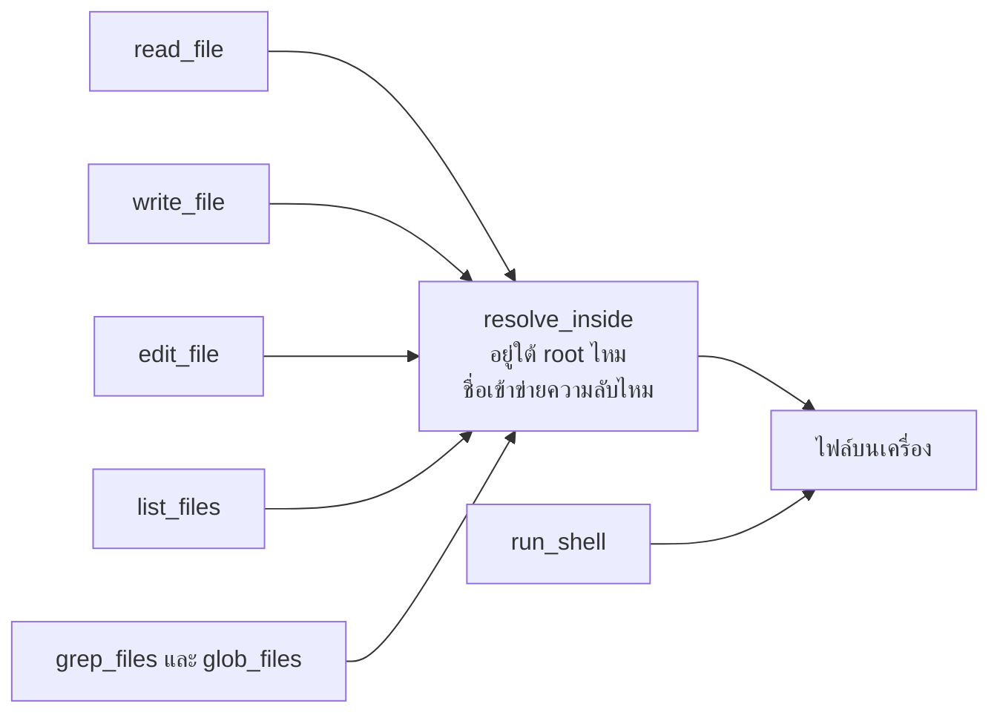

# บทที่ 13 tool ที่แตะโลกจริง

`read_file` ปฏิเสธ `.env` อย่างถูกต้อง แล้ว `grep_files` อ่านมันให้ในบรรทัดถัดไป สอง
tool (ฟังก์ชันที่ model ขอให้เรารันได้) นั่งอยู่ในไฟล์เดียวกัน เขียนโดยคนเดียว
กัน และมีกฎเดียวกันในหัว แต่มีตัวเดียวที่บังคับใช้ บั๊กนี้อยู่ในโปรเจกต์นี้จนถึงรุ่น 1.0.1
และมันคือเหตุผลที่บทนี้มีอยู่

บทที่ 3 บอกว่า tool คือสัญญา บทนี้คือสิ่งที่เกิดขึ้นเมื่อปลายอีกด้านของสัญญาไปแตะไฟล์
จริง shell จริง และเครื่องของคนอื่นจริง ของที่จะได้คือ tool เจ็ดตัวที่อ่านไฟล์ เขียนไฟล์
แก้ไฟล์ รันคำสั่ง และค้นหาได้ กับกฎสี่ข้อที่ทำให้มันไม่ทำลายเครื่องของผู้ใช้ กฎทั้งสี่ข้อมา
จากเหตุการณ์ที่เกิดขึ้นจริงในโปรเจกต์นี้ ไม่ได้มาจากการคิดล่วงหน้า

## 1. ประตูเดียว ไม่ใช่ยามสี่คน

กฎว่า agent (โปรแกรมที่ให้ model ตัดสินใจแล้วรัน tool ให้) แตะได้เฉพาะใน
โฟลเดอร์ที่กำหนด ฟังดูเหมือนกฎที่เขียนได้ในแต่ละ tool คนละบรรทัด `read_file` เช็คเอง
`write_file` เช็คเอง และอื่นๆ

วิธีนั้นผิด และมันผิดเพราะคุณตรวจสอบมันไม่ได้ ไม่ใช่เพราะโค้ดซ้ำ
กฎที่กระจายอยู่ในสี่ที่คือกฎที่มีที่หนึ่งจะลืม และคนที่มาอ่านโค้ดทีหลังต้องอ่านครบทั้งสี่ที่
ถึงจะรู้ว่ากฎคืออะไร

วิธีของโปรเจกต์นี้คือประตูเดียวชื่อ `resolve_inside` ทุก tool ที่รับพาธเป็น argument ต้อง
เดินผ่านมัน คือ `read_file` `write_file` `edit_file` `list_files` และตัวค้นหา มีข้อยกเว้น
อยู่หนึ่งตัวคือ `run_shell` ซึ่งหัวข้อย่อยข้างล่างจะบอกว่าทำไม ตัวประตูเองทำสองอย่างที่ไม่
เกี่ยวกันเลย

```python
def resolve_inside(root, path) -> Path:
    """Turn a path from the model into a real path inside root, or refuse.

    Two separate refusals happen here. The first stops the agent reaching
    outside its workspace at all, which covers both parent directory escapes
    and absolute paths. The second stops it opening credential files that
    happen to live inside the workspace, to read or to write. Anything a
    tool reads is sent to the model provider on every later request and
    stays in the conversation from then on, and a credential a tool writes
    over is simply gone.
    """
    root = Path(root).resolve()
    candidate = (root / Path(path)).resolve()
    if candidate != root and not candidate.is_relative_to(root):
        raise WorkspaceError(f"{path} is outside the workspace")
    if looks_like_a_secret(candidate.name):
        raise WorkspaceError(
            f"this tool refuses to touch {candidate.name} because credential files "
            "must not enter the conversation or be changed by an agent"
        )
    return candidate
```

การปฏิเสธข้อแรกเป็นเรื่องขอบเขต `resolve` แปลงพาธให้เป็นพาธจริงก่อน ซึ่งจัดการทั้งจุด
จุดที่ถอยขึ้นไปข้างบน และพาธเต็มที่เริ่มจากรากของไดรฟ์ พอทุกอย่างถูกแปลงเป็นรูปเดียวกัน
แล้ว การเช็คเหลือคำถามเดียวคือมันอยู่ใต้ `root` ไหม

การปฏิเสธข้อที่สองเป็นเรื่องความลับ และมันไม่ใช่เรื่องเดียวกันเลย ไฟล์ `.env` อยู่ใน
โฟลเดอร์งานอย่างถูกต้องทุกประการ มันผ่านการเช็คข้อแรกสบายๆ เหตุผลที่ต้องปฏิเสธคือทุก
อย่างที่ tool อ่านจะถูกส่งไปหาผู้ให้บริการ และมันจะอยู่ในบทสนทนาต่อไปทุกรอบหลังจากนั้น
การอ่าน key หนึ่งครั้งคือการส่ง key นั้นออกไปสิบครั้ง

ลองนับดูจะเห็นชัดขึ้น สมมติ agent อ่าน `.env` ในรอบที่สามของงานที่ยาวสิบห้ารอบ คำขออีก
สิบสองรอบที่เหลือแบก key ตัวนั้นขึ้นสายไปด้วยทุกครั้ง แล้วมันยังนอนอยู่ในไฟล์ session บน
ดิสก์และใน log ฝั่งผู้ให้บริการอีกสองที่ การถอน key ทีหลังจึงไม่ใช่การลบข้อความบรรทัดเดียว

รายการที่ถือว่าเป็นความลับเขียนไว้ตรงๆ ไม่มีอะไรฉลาด

```python
SECRET_NAMES = {".env", "id_rsa", "id_ed25519", ".npmrc", ".netrc", "credentials"}
SECRET_SUFFIXES = {".pem", ".key", ".p12", ".pfx"}
SECRET_PREFIXES = (".env.",)
```

ประตูใช้ `raise` แทนการ `return` ข้อความ error เพราะ `ToolRegistry.run` จับ exception
ทุกตัวแล้วแปลงเป็นข้อความให้ model อ่านอยู่แล้ว การ raise จึงได้ทั้งสองอย่าง คือ tool ที่
ลืมเช็คจะพังดังแทนที่จะทำงานต่อ และ model ยังคงได้ข้อความที่อ่านรู้เรื่องกลับไป

### 1.1 ข้อยกเว้นที่ต้องพูดตรงๆ คือ run_shell ไม่ได้เดินผ่านประตูนี้

ประโยคว่าประตูเดียวเป็นจริงกับ tool ที่รับพาธ และไม่เป็นจริงกับ shell `run_shell` ไม่เคย
เรียก `resolve_inside` เลย มันส่งบรรทัดคำสั่งให้ระบบปฏิบัติการรัน โดยตั้ง `cwd` ไว้ที่
`root` เท่านั้น

```python
        process = subprocess.Popen(
            as_utf8_console(command),
            shell=True,
            cwd=root,
            ...
        )
```

`cwd` คือจุดตั้งต้น ไม่ใช่รั้ว คำสั่งที่รันจากตรงนั้นเดินขึ้นไปข้างบนได้ตามปกติ
`type ..\outside\.env` บน Windows หรือ `cat ../outside/.env` บน Unix อ่านไฟล์ที่ประตู
บานนั้นตั้งใจจะห้ามได้ทั้งคู่ และรายการชื่อไฟล์ความลับก็ไม่ได้ถูกดูเลย เพราะไม่มีพาธไหน
ถูกส่งเข้า `resolve_inside`



ชั้นเดียวที่ยังกันอยู่คือ permission ซึ่งเป็นชั้นที่ปิดได้ `run_shell` มีค่า `safe` เป็นเท็จ
คำสั่งทุกคำสั่งจึงต้องผ่านการอนุมัติ แต่ `--yes` หรือ `AGENTPATH_AUTO_APPROVE` เท่ากับ
หนึ่ง ทำให้การอนุมัตินั้นผ่านทันทีโดยไม่ถามใคร ในโหมดนั้น shell ไม่มีการกักพาธเหลืออยู่
เลย

shell กักด้วยวิธีเดียวกันไม่ได้ เพราะมันไม่ได้รับพาธเป็น argument มันรับคำสั่งทั้งบรรทัด
สิ่งที่เข้ามาไม่ใช่ `../outside/.env` แต่เป็นข้อความที่ระบบปฏิบัติการจะตีความเอง ซึ่งมีทั้ง
ตัวแปรสภาพแวดล้อม การต่อคำสั่ง การ redirect เครื่องหมายคำพูด และ subshell ตัวกรองที่
พยายามอ่านพาธออกจากข้อความนั้นให้ครบทุกทาง คือตัวกรองที่จะพลาดสักทางเสมอ และตัวกรอง
ที่พลาดคือสิ่งที่แย่กว่าไม่มีตัวกรอง เพราะมันทำให้คนเชื่อว่าปลอดภัย

การกักคำสั่งทั้งบรรทัดจึงต้องทำที่ชั้นล่างกว่านั้น คือให้ระบบปฏิบัติการเป็นคนบังคับ ด้วย
container ที่ mount เฉพาะโฟลเดอร์งาน ด้วย sandbox ของระบบ หรือด้วยผู้ใช้ที่ไม่มีสิทธิ์
อ่านที่อื่น

หน้าตาของสิ่งนั้นไม่ได้ซับซ้อน รัน process ทั้งตัวใน container ที่ mount โฟลเดอร์งานเข้าไป
ที่เดียว วันที่ model สั่ง `cat ../../etc/passwd` สิ่งที่มันได้กลับมาคือคำว่าไม่พบไฟล์ เพราะ
พาธนั้นไม่มีอยู่จริงในกล่องใบนั้น ไม่ใช่เพราะมีตัวกรองไหนอ่านคำสั่งแล้วตัดสินใจห้าม

โปรเจกต์นี้ยังไม่ได้ทำสิ่งนั้น เขียนไว้ตรงนี้เพราะมันคือขอบเขตที่คุณต้องรู้ก่อน
เอาโค้ดนี้ไปใช้ ไม่ใช่ข้อบกพร่องที่ควรเงียบไว้ ถ้าคุณจะรัน agent
ตัวนี้บนเครื่องที่มีของที่เสียไม่ได้ ให้ปิด shell tool ทิ้ง หรือรันทั้ง process
ในกล่องที่ระบบปฏิบัติการกักไว้ให้แล้ว **การรัน `--yes`
บนเครื่องส่วนตัวคือการยอมให้ model รันคำสั่งอะไรก็ได้ในสิทธิ์ของคุณ**
และนั่นเป็นข้อความที่ควรอ่านแล้วรู้สึกไม่สบายใจครับ

## 2. เหตุการณ์จริง วันที่ search เดินเองแล้วเดินออกนอกบ้าน

หัวข้อที่แล้วบอกว่ากฎต้องอยู่ที่เดียว หัวข้อนี้คือเหตุผล และมันคือบั๊กที่เปิดบท

tool ค้นหาต้องเดินไฟล์ทั้งโฟลเดอร์ ซึ่ง `resolve_inside` ไม่ได้ออกแบบมาให้ทำ มันแปลงพาธ
ทีละอัน โค้ดเดินไฟล์จึงถูกเขียนขึ้นใหม่ต่างหาก แล้วกรองโฟลเดอร์ที่ไม่อยากได้ออกด้วยการ
เทียบชื่อ ตรงตรรกะ อ่านเข้าใจง่าย และผิด

มันผิดสองชั้น ชั้นแรกคือ `.env` ที่อยู่ในโฟลเดอร์งานถูกอ่านได้ผ่าน `grep_files` ทั้งที่
`read_file` ปฏิเสธมันถูกต้อง ชั้นที่สองแย่กว่า คือ `rglob` เดินตาม symlink (ไฟล์ที่ชี้ไป
ยังไฟล์อื่น) และ junction ของ Windows ด้วย ลิงก์ที่ถูกวางไว้ในโฟลเดอร์งาน จึงเปิดทางให้อ่า
นไฟล์ที่ไหนก็ได้บนเครื่อง

การกรองด้วยชื่อไม่มีทางเห็นเรื่องนี้เลย ชื่อของลิงก์คือชื่อที่คนวางลิงก์ตั้ง มัน
จะชื่อ `notes.txt` ก็ได้ สิ่งเดียวที่รู้ความจริงคือการ resolve
พาธนั้น ซึ่งเป็นสิ่งที่ประตูทำอยู่แล้ว

ทางแก้ไม่ใช่การเพิ่มการเช็ค symlink ในโค้ดเดินไฟล์ แต่คือการส่งทุกไฟล์ผ่านประตูเดิม

```python
def _walk(root: Path):
    """Yield every file under root that a search is allowed to look at.

    Two exclusions happen here. Directories such as .venv are skipped because
    searching them buries the real answer in thousands of irrelevant hits.
    Credential files are skipped because otherwise search would be a way
    around the refusal in read_file, and a rule that one tool honours while
    another ignores it is not a rule at all.

    The skip list is checked against the path inside the workspace rather
    than the whole path, because a project that happens to live in a folder
    called node_modules should still be searchable.

    Every candidate goes through resolve_inside rather than being filtered
    here. That matters because rglob follows symlinks and Windows junctions,
    so a link planted inside the workspace would otherwise let search read
    files the workspace was drawn to exclude. Filtering on the name of the
    link never sees the name of the target.
    """
    for path in root.rglob("*"):
        if not path.is_file():
            continue
        relative = path.relative_to(root)
        if any(part in SKIP_DIRECTORIES for part in relative.parts):
            continue
        try:
            resolve_inside(root, relative)
        except WorkspaceError:
            continue
        yield path
```

โค้ดที่เพิ่มเข้ามาคือสี่บรรทัด `try` ที่เรียกประตูแล้วข้ามไปถ้าโดนปฏิเสธ ไม่มีการเขียนกฎ
ใหม่เลยสักข้อ การแก้บั๊กประเภทนี้ควรมีรูปร่างแบบนี้ ถ้าคุณพบว่าตัวเองกำลังเขียน
กฎเดิมเป็นครั้งที่สอง แปลว่าคุณกำลังแก้อาการ

บทเรียนที่กว้างกว่านั้นคือกฎความปลอดภัยที่ tool หนึ่งเคารพแต่อีกตัวไม่เคารพ ไม่ใช่กฎ มัน
คืออุปสรรคเล็กน้อยสำหรับคนที่ไม่ได้ตั้งใจ และไม่เป็นอะไรเลยสำหรับคนที่ตั้งใจ

## 3. edit_file ที่ยอมปฏิเสธดีกว่าเดาถูกครึ่งเดียว

การแก้ไฟล์คือ tool ที่อันตรายที่สุดในชุดนี้ อันตรายกว่าการเขียนทับทั้งไฟล์เสียอีก เพราะ
การเขียนทับทั้งไฟล์นั้นเห็นได้ชัดว่าเกิดอะไรขึ้น ส่วนการแทนที่ข้อความคือการเปลี่ยนบางส่วน
ของไฟล์ที่คนไม่ได้อ่าน

กติกาของ `edit_file` ในโปรเจกต์นี้มีข้อเดียว คือข้อความที่จะแทนที่ต้องปรากฏในไฟล์พอดี
หนึ่งครั้ง ไม่ใช่ศูนย์ ไม่ใช่สอง

```python
    def edit_file(path, old, new):
        target = resolve_inside(root, path)
        if not target.is_file():
            return f"Error: {path} does not exist"
        text = target.read_text(encoding="utf-8")
        found = text.count(old)
        if found == 0:
            return (
                f"Error: the text to replace was not found in {path}. "
                "Read the file again and copy the exact text including whitespace."
            )
        if found > 1:
            return (
                f"Error: the text to replace appears {found} times in {path}. "
                "Include more surrounding lines so the match is unique."
            )
        target.write_text(text.replace(old, new), encoding="utf-8")
        return f"Edited {path}"
```

ลองนึกภาพว่าเจอสองที่แล้วแทนที่ให้ model อยากเปลี่ยนค่าเริ่มต้นของ timeout
ในฟังก์ชันหนึ่ง แล้วส่ง `old` มาเป็น `timeout=30` ถ้าไฟล์นั้นมีคำว่า
`timeout=30` อยู่สี่ที่การแทนที่ทุกจุดจะสำเร็จ ไม่มี error ไม่มีคำเตือน tool
คืนคำว่าแก้แล้ว และ model
รายงานกับผู้ใช้ว่าทำเสร็จแล้ว ความเสียหายอยู่ในอีกสามที่ที่ไม่มีใครขอให้แตะ

มันแย่เป็นพิเศษเพราะมันดูเหมือนสำเร็จจากทุกมุม จาก log ก็สำเร็จ จากคำตอบของ agent ก็
สำเร็จ จากไฟล์ session ก็สำเร็จ สิ่งเดียวที่รู้คือไฟล์ ซึ่งไม่มีใครเปิดดูจนกว่าจะมีอะไรพัง
ในอีกสามวัน

ราคาของสองทางเลือกนี้ไม่เท่ากันเลย ราคาของการปฏิเสธคือหนึ่งรอบเพิ่ม model อ่านข้อความ
error แล้วส่ง `old` ที่ยาวขึ้นมาใหม่พร้อมบรรทัดรอบข้าง จบ ราคาของการเดาผิดคือไฟล์ที่เสีย
โดยไม่มีใครรู้

ข้อความ error สองอันบอกวิธีแก้ที่ต่างกัน อันแรกบอกให้อ่านไฟล์ใหม่แล้วคัดลอกให้ตรงรวม
ช่องว่าง อันที่สองบอกให้ใส่บรรทัดรอบข้างเพิ่มเพื่อให้ไม่ซ้ำ นี่คือกฎจากบทที่ 3 ที่ว่าข้อความ
error ของ tool คือ prompt (ข้อความที่เราส่งไปให้ model อ่าน) ไม่ใช่ log ผู้อ่าน
ของมันคือ model และสิ่งที่มันควรมีคือคำสั่งว่าต้องทำอะไรต่อ

และคำอธิบายของ tool ก็บอกกติกาไว้ตั้งแต่ก่อนเรียก ไม่ได้รอให้ผิดก่อน

```python
            description=(
                "Replace one exact piece of text in a file. The old text must appear "
                "exactly once, so include enough surrounding lines to make it unique."
            ),
```

## 4. shell ที่ต้องฆ่าทั้งครอบครัว ไม่ใช่แค่พ่อ

`run_shell` มี timeout เพราะคำสั่งที่ไม่ยอมจบคือสิ่งที่จะเกิดขึ้นแน่นอน ปัญหาคือ timeout
ที่เขียนแบบตรงไปตรงมาไม่ได้ทำงานอย่างที่คิด

ต้นเหตุอยู่ที่ `shell=True` ตอนเราสั่งให้รันคำสั่ง สิ่งที่ Python สตาร์ทไม่ใช่คำสั่งนั้น มัน
คือ shell แล้ว shell เป็นคนสตาร์ทคำสั่งอีกที คำสั่งช้าจึงเป็นลูกของ shell ไม่ใช่ตัว process
ที่เราถืออยู่

ผลคือการเรียก `process.kill()` ฆ่า shell ตัวเดียว ส่วนลูกยังวิ่งต่อ และลูกยังถือปลายท่อ
stdout กับ stderr อยู่ การอ่านผลจึงยังบล็อกต่อไปจนกว่าคำสั่งจริงจะจบ แปลว่า timeout
รายงานว่า timeout แล้วยังรอครบเวลาเดิมอยู่ดี

การจะฆ่าทั้งกลุ่มได้ ต้องเตรียมตั้งแต่ตอนสตาร์ท

```python
def _new_process_group():
    """Start the command in its own group so the whole tree can be killed.

    Without this there is nothing to aim at. On Unix the shell and its
    children share our group, so signalling the group would signal us too.
    On Windows a new process group is what lets taskkill find the
    descendants of the shell rather than only the shell.
    """
    if os.name == "posix":
        return {"start_new_session": True}
    return {"creationflags": subprocess.CREATE_NEW_PROCESS_GROUP}
```

แล้วตอนหมดเวลาถึงจะมีเป้าให้เล็ง

```python
def _kill_tree(process):
    """Kill the command and everything it started."""
    try:
        if os.name == "posix":
            os.killpg(os.getpgid(process.pid), signal.SIGKILL)
        else:
            killed = subprocess.run(
                ["taskkill", "/F", "/T", "/PID", str(process.pid)],
                capture_output=True,
                timeout=10,
            )
            # subprocess.run does not raise on a non zero exit, so without
            # this the fallback below could never run for the case it was
            # written for, which is taskkill failing.
            if killed.returncode != 0:
                raise OSError(f"taskkill exited {killed.returncode}")
    except Exception:
        # Last resort. Killing only the shell beats killing nothing.
        try:
            process.kill()
        except Exception:
            pass
```

คอมเมนต์กลางฟังก์ชันคือบั๊กซ้อนบั๊ก `subprocess.run` ไม่โยน exception เมื่อคำสั่งจบด้วย
รหัสที่ไม่ใช่ศูนย์ ดังนั้นถ้า `taskkill` ล้มเหลว โค้ดจะเดินผ่านไปเงียบๆ และ fallback ที่
เขียนไว้เพื่อกรณีนี้โดยเฉพาะจะไม่มีวันได้ทำงาน การ raise เองคือสิ่งที่ทำให้ `except`
ข้างล่างมีความหมาย

fallback ที่ฆ่าแค่ shell ยังอยู่ เพราะการฆ่าแค่ shell ดีกว่าการไม่ฆ่าอะไรเลย นี่คือรูปแบบที่
กลับมาเรื่อยๆ ในโค้ดที่แตะระบบปฏิบัติการ คือมีทางที่ถูกต้อง แล้วมีทางที่แย่กว่าแต่ยังดีกว่า
ไม่ทำ การเขียนทั้งสองทางไว้คือความซื่อสัตย์ ไม่ใช่ความไม่มั่นใจ

หลังฆ่าแล้วยังต้องเก็บของ เพราะผลลัพธ์บางส่วนที่คำสั่งพิมพ์ไปแล้ว มักเป็นสิ่งที่บอกว่ามันไป
ติดตรงไหน

```python
        except subprocess.TimeoutExpired:
            # shell=True means the thing we started is a shell, and the slow
            # command is its child. Killing only the shell leaves the child
            # running and still holding the pipes, so a call that was meant
            # to give up after the timeout waits for the whole run anyway.
            # The tree has to go, not just the root of it.
            _kill_tree(process)
            try:
                raw_out, raw_err = process.communicate(timeout=5)
                stdout, stderr = decode_output(raw_out), decode_output(raw_err)
            except subprocess.TimeoutExpired:
                stdout, stderr = "", ""
            partial = truncate((stdout or "") + (stderr or ""), 500)
            note = f"Error: the command timed out after {timeout} seconds and was killed"
            return f"{note}\n{partial}" if partial.strip() else note
```

## 5. encoding ที่ต้องลองหลายแบบ เพราะเครื่องเดียวมีสองแบบ

เรื่องนี้เป็นเนื้อหาของรุ่น 1.0.4 ทั้งรุ่น และมันเป็นเรื่องที่คนเขียน tool รัน shell ทุกคนจะ
เจอถ้าผู้ใช้อยู่บน Windows

การอ่านผลของคำสั่งด้วยการสมมติว่าเป็น utf-8 นั้นผิด เครื่อง Windows เครื่องเดียวมีโปรแกรม
สองพวก พวกใหม่เขียน utf-8 พวกที่ติดมากับระบบเขียน codepage (ตารางรหัสอักขระแบบเก่าของคอน
โซล) เดิม การถอดรหัสพวกหลังด้วย utf-8 จะเปลี่ยนตัวอักษรที่ไม่ใช่ ASCII ทุกตัวเป็นเครื่องห
มายแทนที่ และถ้าคุณใส่ `errors="replace"` ไว้ มันจะเกิดขึ้นเงียบสนิท

ทางแก้คือลองเรียงกัน และลำดับมีเหตุผล

```python
def _output_encodings():
    """The encodings to try on command output, in order.

    Assuming utf-8 is wrong on Windows. A command that writes utf-8, which
    most modern tools do, and a command that writes the old console
    codepage, which most of the ones that ship with the system do, both
    turn up on the same machine. Decoding the second as the first turns
    every accented or non Latin character into a replacement mark, and
    errors equals replace means it happens silently.

    utf-8 goes first because it fails loudly on the wrong input. A single
    byte encoding never fails, so trying one first would decode utf-8 text
    into nonsense without complaining.
    """
    encodings = ["utf-8"]
    if os.name == "nt":
        import ctypes

        for codepage in (
            ctypes.windll.kernel32.GetOEMCP(),
            ctypes.windll.kernel32.GetACP(),
        ):
            name = f"cp{codepage}"
            if name not in encodings:
                encodings.append(name)
    return encodings
```

utf-8 ต้องมาก่อนเพราะมันเป็นตัวเดียวในรายการที่ล้มเหลวได้ encoding แบบหนึ่งไบต์ต่อหนึ่ง
ตัวอักษรจะถอดรหัสอะไรก็ได้สำเร็จเสมอ ผลลัพธ์แค่เป็นขยะ ถ้าเอามันขึ้นก่อน คุณจะไม่มีวัน
ได้ลองตัวที่ถูก

แล้วยังมีปัญหาที่สองซึ่งไม่ใช่ปัญหาการถอดรหัสเลย ถ้า console ตั้งเป็น codepage เก่าอยู่
shell จะเขียนชื่อไฟล์ภาษาไทยออกมาเป็นเครื่องหมายคำถามตั้งแต่ต้นทาง เพราะ codepage นั้น
ไม่มีอักขระเหล่านั้นให้เขียน การถอดรหัสกู้สิ่งที่ไม่เคยถูกเข้ารหัสไม่ได้ ทางแก้จึงต้องเกิด
ก่อน shell จะถูกสตาร์ท

วิธีที่ดูเหมือนจะแก้ได้แต่แก้ไม่ได้ ก็คุ้มที่จะรู้ คือการเติม `chcp`
ไว้หน้าคำสั่ง คำสั่งในตัว shell อย่าง `dir` อ่านค่า codepage ตอน shell
เริ่มทำงาน ซึ่งเกิดก่อน `chcp` ในบรรทัดเดียวกันจะได้ทำงาน ผลคือคำสั่งแรกของ
session ยังเสียชื่อไฟล์อยู่ ส่วนคำสั่งที่สองเป็นต้นไปปกติหมด ซึ่งเป็นอาการที่ตาม
หาต้นตอยากมากครับ

## 6. ค้นหาด้วย grep กับ glob ไม่ใช่ vector database

นี่คือหัวข้อที่คนแปลกใจที่สุดในบทนี้ agent ที่ทำงานกับโค้ดไม่ต้องใช้ vector database
(ฐานข้อมูลเวกเตอร์ คือที่เก็บข้อความเป็นตัวเลข เพื่อค้นด้วยความหมาย) มันต้องการ tool สองตัว
เดียวกับที่คนใช้ คือหาไฟล์จากชื่อ และหาข้อความในไฟล์

เหตุผลอยู่ในลักษณะของคำถาม คนที่ถามว่าฟังก์ชัน `resolve_inside` ถูกเรียกจากที่ไหนบ้าง
ไม่ได้ถามหาสิ่งที่ความหมายใกล้เคียง เขาถามหาสตริงนั้นตรงตัว และคำตอบที่ถูกคือรายการที่
ครบ ไม่ใช่รายการที่ใกล้เคียงที่สุดสิบอันดับแรก

ข้อได้เปรียบที่ตามมามีสามข้อ ไม่มีดัชนีให้ล้าสมัย ไฟล์ที่เพิ่งถูกแก้เมื่อวินาที
ที่แล้วก็ค้นเจอทันที ผลลัพธ์ตรวจสอบได้ด้วยตา เพราะมันคือเลขบรรทัดกับข้อความ ไม่
ใช่คะแนนความใกล้เคียงและมันไม่มีอะไรให้ติดตั้งเพิ่ม

ข้อแรกหนักกว่าที่ฟัง ทีมที่ทำดัชนีเวกเตอร์ไว้ให้ agent อ่านโค้ดเจอเรื่องนี้ตอน
agent ยืนยันอยู่สามรอบว่ามีฟังก์ชันชื่อ `check_path`
อยู่ในไฟล์ ทั้งที่มันถูกเปลี่ยนชื่อไปเมื่อสี่สิบนาทีก่อน ดัชนีนั้นสร้างใหม่คืนละ
ครั้ง ส่วน `grep` เห็นไฟล์ที่เพิ่งเซฟไปเมื่อวินาทีที่แล้วเสมอ

จุดที่มันเลิกพอ คือเมื่อคำถามเป็นภาษาคนจริงๆ เช่นเอกสารประกอบสินค้าที่ผู้ใช้ถามด้วยคำที่
ไม่มีอยู่ในเอกสาร กรณีนั้นเป็นคนละปัญหา และหลักสูตรนี้แยกมันไว้ที่บทเรียนที่ 16

สิ่งที่ต้องระวังในทางปฏิบัติกลับไม่ใช่เรื่องความหมาย แต่เป็นเรื่องที่ `fnmatch` เข้มกว่าที่
คนคาด pattern ที่ model เขียนบ่อยที่สุดคือ `**/*.py` ซึ่งถ้าเทียบตรงๆ จะไม่แมตช์ไฟล์ที่อยู่
ชั้นบนสุดเลย

```python
def path_matches(relative: str, name: str, pattern: str) -> bool:
    """Decide whether one file matches a glob the way a person would expect.

    Three attempts are made because fnmatch is stricter than people are. The
    pattern is tried against the path inside the workspace, then against the
    bare file name so that main.py works from anywhere, and then with a
    leading star star slash removed so that a pattern like **/*.py also
    finds files sitting at the top level. Without that third attempt the
    most common pattern a model writes silently misses every file that is
    not inside a subdirectory.
    """
    if fnmatch.fnmatch(relative, pattern) or fnmatch.fnmatch(name, pattern):
        return True
    return pattern.startswith("**/") and fnmatch.fnmatch(relative, pattern[3:])
```

โค้ดยอมผ่อนกฎให้ model แทนที่จะสอนมัน เพราะการสอนอยู่ในคำอธิบายของ tool ซึ่งถูกส่งทุก
รอบและใช้ token ส่วนการรับ pattern ที่คนเขียนจริงคือการแก้ปัญหาที่ต้นทาง tool ที่ตอบว่า
ไม่พบไฟล์ทั้งที่ไฟล์อยู่ตรงนั้น คือ tool ที่พาการทำงานทั้งรอบไปผิดทาง

## 7. regex ที่ต้องรันคนละ process เพราะหยุดมันไม่ได้

การให้ model เขียน regular expression (รูปแบบสำหรับค้นหาข้อความ หรือ
regex) แล้วเรารันให้ คือการรับ input ที่ไม่น่าเชื่อถือมาสั่งเครื่องยนต์ที่ทำงานนานเท่าไหร่
ก็ได้

pattern บางรูปทำให้เวลาการทำงานโตแบบชี้กำลังตามความยาวของข้อความ รูปที่คลาสสิกที่สุด
คือตัวทำซ้ำซ้อนตัวทำซ้ำ

`(a+)+$` ที่เจอบรรทัดซึ่งมีตัว a
ยี่สิบห้าตัวแล้วปิดท้ายด้วยตัวอื่น ใช้เวลาไม่กี่วินาที เพิ่ม a
เป็นสามสิบตัวใช้เวลาเป็นนาที เพิ่มเป็นสี่สิบตัวแล้วคุณจะไม่ได้เห็นมันจบในวันนั้
น ทุกตัวที่เพิ่มเข้าไปคูณเวลาเป็นสองเท่า และคนที่ส่ง pattern
แบบนี้มาไม่ต้องรู้ตัวเลยว่าทำอะไรอยู่

การเช็ครูปที่รู้จักไว้ก่อนจึงเป็นของถูก

```python
NESTED_QUANTIFIER = re.compile(r"\([^()]*[+*][^()]*\)\s*[+*{]")
```

แต่การเช็คแบบนี้ไม่มีทางครบ มันจับรูปที่รู้จัก และ regex ที่ช้ามีมากกว่ารูปที่ใครจะเขียน
รายการไว้ได้ ของที่ทำงานได้จริงกับทุกกรณีคือการจำกัดสิ่งที่ควบคุมได้ ซึ่งคือความยาวของ
บรรทัดที่เอาไปแมตช์

```python
MAX_LINE = 2000
```

ถึงอย่างนั้นก็ยังต้องมีเส้นตาย และนี่คือส่วนที่น่าสนใจที่สุดของหัวข้อนี้ เพราะวิ
ธีที่คนคิดออกสองวิธีแรกไม่ทำงาน

วิธีแรกคือเช็คนาฬิกาทุกครั้งที่ขึ้นบรรทัดใหม่ มันไม่ทำงานเพราะบรรทัดเดียวก็พอที่จะทำให้
ระเบิด และไม่มีอะไรขัดจังหวะ regex ที่กำลังทำงานอยู่ได้ โค้ดที่เช็คนาฬิกาไม่เคยได้คิว

วิธีที่สองคือย้ายไปรันใน thread (เธรด คือสายการทำงานคู่ขนานในโปรแกรมเดียว) แล้วให้อีก
thread จับเวลา มันก็ไม่ทำงาน เพราะการแมตช์ไม่ปล่อย GIL (Global Interpreter Lock คือกลไก
ที่ยอมให้ Python รัน bytecode ได้ทีละ thread เท่านั้น) thread ที่รอเส้นตายจึงไม่ได้รันจนก
ว่าสิ่งที่มันรออยู่จะจบไปแล้ว

สิ่งที่ทำงานคือ process แยก เพราะ process ฆ่าได้

```python
        # The search runs in a separate process. Two earlier attempts at
        # this did not work and both are worth knowing about. Checking a
        # deadline between lines never gets a turn, because one line is
        # enough to go exponential and nothing interrupts a regular
        # expression that is already running. Moving it to a thread does
        # not help either, because matching does not release the global
        # interpreter lock, so the thread waiting on the deadline cannot
        # run until the matching it is waiting on has finished.
        #
        # A separate process can simply be killed, which is the only thing
        # that actually works. The cost is about a tenth of a second of
        # start up on every search.
        request = json.dumps({"root": str(root), "pattern": pattern, "glob": glob})
        try:
            # Isolated on purpose, and this is the important part rather
            # than a detail. Running a module with -m puts the current
            # directory first on the import path, and the current
            # directory is the workspace. A file the agent wrote there
            # called json.py or types.py would then be imported and run by
            # this child before the search starts, with no permission
            # check anywhere, because searching is a safe tool. -I removes
            # that directory from the path and ignores the environment
            # variables that could put it back.
            completed = subprocess.run(
                [sys.executable, "-I", "-m", "agentpath.tools.search"],
                input=request,
                capture_output=True,
                text=True,
                encoding="utf-8",
                timeout=SEARCH_SECONDS,
                cwd=str(Path(__file__).resolve().parent),
            )
        except OSError as error:
            # The child could not be started at all, which is a different
            # thing from the search failing. Saying so, and naming the tool,
            # is what lets the model try something else instead of repeating
            # a search that can never run.
            return f"Error: the search could not be started. {error}"
        except subprocess.TimeoutExpired:
            return (
                f"Error: searching for {pattern} took longer than {SEARCH_SECONDS} "
                "seconds and was given up on. Try a simpler pattern, or narrow the "
                "search with the glob argument."
            )
```

ราคาที่จ่ายถูกเขียนไว้ตรงๆ คือประมาณหนึ่งในสิบวินาทีต่อการค้นหาหนึ่งครั้ง นั่นคื
อของจริงและมันไม่ฟรี ส่วน `-I` กับ `cwd` มาทีหลัง จากการค้นพบว่า `-m`
เอาโฟลเดอร์งานขึ้นต้น import path ไฟล์ชื่อ `json.py` ที่ agent
เพิ่งเขียนจะถูกรันโดย process ลูกก่อนการค้นจะเริ่ม โดยไม่ผ่านการขอ permission
เลย เพราะการค้นเป็น tool
ที่ปลอดภัย การเขียนราคาไว้ในคอมเมนต์ทำให้คนที่มาอ่านทีหลังตัดสินใจได้เอง แทนที่
จะต้องเดาว่าทำไมถึงเลือกทางที่ดูซับซ้อนกว่า

cancellation token ช่วยไม่ได้เลยในกรณีนี้ ระบบยกเลิกที่บทที่ 6 พูดถึงทำงานด้วยการให้โค้ด
คอยเช็คธงระหว่างทาง แต่โค้ดที่ไม่คืนการควบคุมกลับมาเลยจะไม่มีวันเช็คธงนั้น นี่คือขอบเขต
ของกลไกยกเลิกแบบร่วมมือ และการรู้ขอบเขตของเครื่องมือ คือสิ่งที่ทำให้คุณรู้ว่าเมื่อไหร่ต้อง
ใช้อย่างอื่น

## 8. กฎสี่ข้อที่ได้จากบทนี้

ทั้งเจ็ดหัวข้อข้างบนยุบลงเหลือสี่ข้อ และทั้งสี่ข้อมาจากเหตุการณ์จริง ไม่ได้มาจากการคิด
ล่วงหน้า

1. **กฎอยู่ที่เดียว** tool ใหม่ที่แตะทรัพยากรที่มีกฎอยู่แล้ว ต้องเรียก
   ฟังก์ชันประตูเดิม ไม่ใช่เขียนตัวกรองของตัวเอง และเมื่อกักด้วยวิธีนั้น
   ไม่ได้ อย่างกรณี shell ในหัวข้อ 1.1 ให้เขียนข้อยกเว้นไว้ตรงๆ

2. **กำกวมแล้วปฏิเสธ ดีกว่าเดาถูกครึ่งเดียว** `edit_file` ที่เจอข้อความ
   ตรงกันสองที่ ต้องบอกว่าเจอสองที่ ไม่ใช่เลือกอันแรกให้

3. **สิ่งที่เราเริ่ม เราต้องหยุดได้ทั้งต้น** timeout ที่ฆ่าแค่ shell
   ไม่ได้ฆ่าอะไรเลย และงานที่ไม่คืนการควบคุมต้องอยู่คนละ process
   ไม่ใช่คนละ thread

4. **ห้ามแปลงข้อมูลอย่างเงียบ**
   การถอดรหัสที่แทนที่อักขระที่อ่านไม่ออก เปลี่ยนการสูญเสียที่ดังให้เป็นการสูญเสีย
   ที่เงียบ ให้ลองวิธีที่ล้มเหลวดังก่อนเสมอ

ข้อที่หนึ่ง ข้อที่สาม และข้อที่สี่คือสามข้อที่โปรเจกต์นี้จ่ายค่าเรียนไปแล้วครับ

## บทเรียนที่ลงมือทำเรื่องนี้

| บทเรียน | สิ่งที่ได้ลงมือทำ |
| --- | --- |
| 07 file tools | เขียนประตูเดียวแล้วเดิน tool ทั้งสี่ตัวผ่านมัน และทำ edit_file ที่ปฏิเสธการแมตช์ที่กำกวม |
| 08 shell tool | รันคำสั่งจริง เจอ timeout ที่ฆ่าไม่ตาย แล้วแก้ด้วยการฆ่าทั้ง process tree |
| 09 search tools | เขียน glob กับ grep และเห็นว่าทำไมมันพอสำหรับโค้ด |
| 16 retrieval | เขียนการค้นด้วยคำที่ซ้อนกันถ่วงด้วยความหายากด้วยมือ แล้วเทียบกับ grep เพื่อดูว่าเมื่อไหร่ควรใช้อันไหน |
| 12 permissions | เอาการถามผู้ใช้ออกจาก shell tool มาไว้ที่ระบบเดียวที่ตัดสินใจให้ทุก tool |
