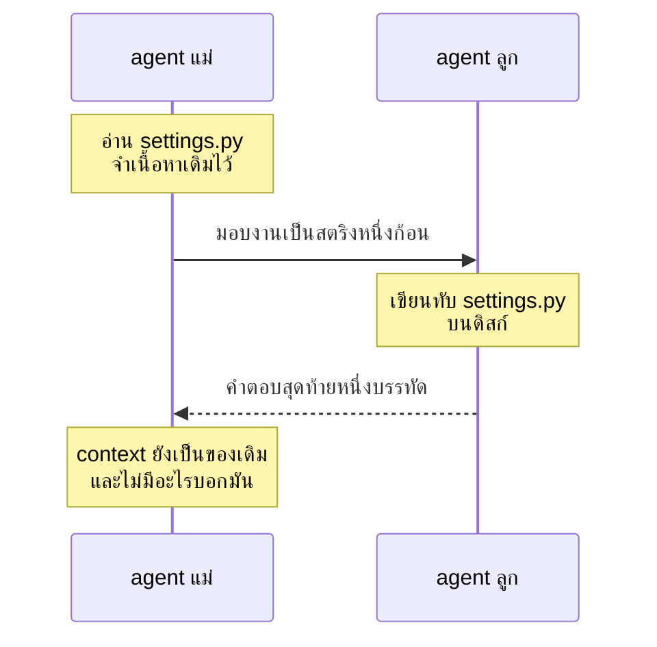

# บทที่ 15 subagent และงานที่ทำพร้อมกัน

worker สองตัวรายงานว่าแก้ไฟล์เสร็จแล้ว ทั้งคู่พูดความจริง `edit_file` คืนค่าปกติทั้งสอง
ครั้ง ไฟล์ session บันทึกความสำเร็จไว้สองรายการ แล้วคุณเปิด `settings.py` ดู การแก้ของ
ตัวหนึ่งไม่อยู่ตรงนั้น ไม่มี conflict ไม่มีการปฏิเสธ มันแค่หายไป

บทนี้คือสองอย่างที่เพิ่มเข้ามาได้โดยไม่แตะ agent loop (ลูปที่ถาม model แล้วรัน tool สลับ
กันไปจนได้คำตอบ) เลย คือ agent (โปรแกรมที่ให้ model ตัดสินใจแล้วรัน tool ให้) ที่มอบงาน
ให้ agent อีกตัวได้ และกลไกที่รัน agent หลายตัวพร้อมกันแล้วรวมผลกลับมาอ่านรู้เรื่อง ทั้งส
องอย่างมีกับดักของตัวเอง และกับดักทั้งสองเงียบแบบเดียวกับไฟล์ตอนเปิดบท

## 1. subagent ไม่ใช่กลไกใหม่ มันคือ tool ที่ข้างในมี agent

ชื่อของมันชวนให้คิดว่าเป็นความสามารถพิเศษของ framework ความจริงคือมันคือ tool (ฟังก์ชัน
ที่ model ขอให้เรารันได้) ธรรมดาตัวหนึ่ง ที่บังเอิญข้างในไปรัน agent อีกตัว

```python
"""Turning a whole agent into a single tool the parent can call.

There is no new machinery here. A subagent is a tool whose implementation
happens to run another agent. The parent sees a tool with a name and a
description, exactly like read_file, and the loop does not change at all.
That is the point worth noticing rather than the code.
"""
```

นี่คือผลโดยตรงของเส้นแบ่ง leaf กับ subsystem ในบทที่ 2 subagent ไม่ต้องเห็น state ที่
แกนเป็นเจ้าของ มันแค่รับสตริงแล้วคืนสตริง มันจึงเป็น leaf และ leaf เข้ามาได้โดยไม่ต้อง
ต่อรองอะไรกับแกน

ตัว tool ทั้งตัวเป็นแบบนี้

```python
def subagent_tool(build_agent, name="run_subagent", description=None, safe=False) -> Tool:
    """Build the tool.

    build_agent is a function returning a fresh Agent rather than an Agent
    itself. That is deliberate. A subagent that kept its history between
    calls would slowly accumulate the same clutter it exists to prevent, and
    the second call would start from wherever the first one happened to end.
    """

    def run_subagent(task):
        child = build_agent()
        try:
            answer = run_to_completion(child, task)
        except Exception as error:
            # A child that fails must not take the parent with it. The parent
            # can read this, decide the approach did not work, and try
            # something else, which is exactly what a person would do.
            return f"Error: the subagent failed, {type(error).__name__}: {error}"
        return answer or "The subagent finished without saying anything."
```

เหตุผลที่อยากได้มันคือเรื่อง context การสืบสวนหนึ่งเรื่องอาจกินการอ่านไฟล์ยี่สิบครั้งกับ
การค้นหาอีกสิบครั้ง ผลลัพธ์ทั้งสามสิบอันนั้นค้างอยู่ในบทสนทนาของแม่ตลอดไป และถูกจ่ายซ้ำ
ทุกรอบที่เหลือ ตามที่บทที่ 4 อธิบาย การส่งงานให้ลูกทำแปลว่าแม่ได้คำตอบมาบรรทัดเดียว
ส่วนการค้นหาทั้งหมดตายไปพร้อมลูก

คิดเป็นตัวอักษรจะเห็นราคา ผลลัพธ์สามสิบชิ้นที่ชิ้นละสองพันตัวอักษรคือหกหมื่นตัวอักษรที่
นอนอยู่ในบทสนทนาของแม่ ราวหนึ่งหมื่นห้าพัน token ที่ถูกส่งใหม่ทุกรอบจนจบงาน ส่วนคำตอบ
ที่ลูกคืนมาคือสองบรรทัดที่บอกว่าเจอที่ไหนและแก้ยังไง

ข้อผิดพลาดของลูกถูกแปลงเป็นข้อความ ไม่ใช่โยนขึ้นไป เพราะลูกที่ล้มเหลวไม่ควรพาแม่ตาย
ตาม แม่อ่านข้อความนั้นแล้วตัดสินใจว่าวิธีนี้ไม่เวิร์ก แล้วลองทางอื่นได้ ซึ่งเป็นสิ่งที่คนจะ
ทำ นี่คือกฎเดียวกับ `ToolRegistry.run` ที่แปลง exception ของ tool เป็นข้อความให้ model
อ่าน

## 2. ทำไม build_agent ต้องเป็นฟังก์ชัน ไม่ใช่ agent ที่สร้างเสร็จแล้ว

argument ตัวแรกของ `subagent_tool` คือ `build_agent` ซึ่งเป็นฟังก์ชันที่คืน agent ตัว
ใหม่ ไม่ใช่ตัว agent

ความต่างนี้ดูเหมือนรายละเอียดจนกว่าจะคิดถึงการเรียกครั้งที่สอง

ถ้าเราส่ง agent สำเร็จรูปเข้าไป การเรียกครั้งที่สองจะได้ agent ตัวเดิมที่ยังถือบทสนทนาของ
ครั้งแรกไว้ครบ มันพังสองทาง ทางแรกคือมันค่อยๆ สะสมความรกแบบเดียวกับที่ subagent มีไว้
เพื่อกำจัด ทางที่สองแย่กว่า คืองานที่สองจะเริ่มจากตรงไหนก็ตามที่งานแรกไปจบ
ซึ่งอาจเป็นสถานะที่ผิดสำหรับงานใหม่

หน้าตาของมันเป็นแบบนี้ งานแรกคือหาว่าค่า retry ตั้งไว้ที่ไหน ลูกจบงานโดยถือโค้ดของ retry
ไว้เต็มบทสนทนา งานที่สองคือรายการ test ของ parser แต่ลูกตัวเดิมอ่านคำขอใหม่โดยมีเรื่อง
retry ค้างอยู่ข้างหน้า แล้วคำตอบที่ได้กลับมาพูดถึง test ของ retry ทั้งที่ไม่มีใครถาม

การส่งฟังก์ชันเข้าไปทำให้ทุกการเรียกได้บทสนทนาที่ว่างเปล่าใหม่ทุกครั้ง และคนที่ประกอบ
ระบบยังคงควบคุมได้ว่าลูกจะได้ tool ชุดไหน system prompt อะไร และงบเท่าไหร่
เพราะสามอย่างนั้นอยู่ในฟังก์ชันที่เขาเขียนเอง

นี่คือรูปแบบเดียวกับ permission ในบทที่ 2 แทนที่จะให้โค้ดตัวกลางรู้จักสิ่งที่ต้องสร้าง เรา
ส่งวิธีสร้างเข้าไปให้มันแทน โค้ดตัวกลางจึงไม่ต้องรู้อะไรเลยเกี่ยวกับ provider ไฟล์ หรือ
เทอร์มินัล

คำอธิบายของ tool ต้องบอกความจริงข้อหนึ่งกับ model คือลูกมองไม่เห็นบทสนทนาของแม่

```python
DEFAULT_DESCRIPTION = (
    "Hand a self contained job to a separate agent and get back only its final "
    "answer. Use this for work that needs many steps of searching or reading, "
    "when you want the conclusion and not the whole investigation. Describe the "
    "job completely, because the other agent cannot see this conversation."
)
```

ประโยคสุดท้ายมีอยู่เพราะถ้าไม่มี model จะเขียนงานสั้นๆ แบบที่อ้างถึงสิ่งที่คุยกันไปก่อน
หน้า เช่นคำว่าไฟล์นั้น หรือ bug ที่ว่า แล้วลูกจะไม่มีทางรู้ว่าหมายถึงอะไรครับ

## 3. กับดัก สิ่งที่เป็นข้อดีหลัก คือสิ่งเดียวกับที่ทำให้ผิด

หัวข้อนี้คือใบเสร็จของสองหัวข้อที่แล้ว และมันเป็นหัวข้อที่ควรอ่านสองรอบ

docstring ของ module พูดไว้ในสามประโยค

```text
The same isolation is also the trap. The child and the parent hold separate
views of the world, so a file the child changed is still the old file as far
as the parent is concerned. Nothing tells the parent it is now wrong.
```

การแยก context คือเหตุผลที่เราอยากได้ subagent และมันคือเหตุผลเดียวกับที่แม่กับลูก
เห็นโลกคนละเวอร์ชัน

ลำดับเหตุการณ์เป็นแบบนี้ แม่อ่านไฟล์หนึ่งไฟล์ เนื้อหาของไฟล์นั้นเข้าไปอยู่ในบทสนทนาของ
แม่ในฐานะข้อเท็จจริง จากนั้นแม่มอบงานให้ลูก ลูกแก้ไฟล์นั้น แล้วคืนคำตอบมา ตอนนี้บนดิสก์
คือเนื้อหาใหม่ ส่วนในหัวของแม่ยังเป็นเนื้อหาเก่า

และไม่มีอะไรบอกแม่เลย ไม่มี error ไม่มีคำเตือน ผลลัพธ์ของ tool ที่แม่ได้รับบอกว่างาน
สำเร็จ ซึ่งเป็นความจริง



บทเรียนที่ 20 ไม่ได้อธิบายเรื่องนี้เฉยๆ มันสาธิตให้ดู และการสาธิตนั้นรันทุกครั้ง
ที่มีการ push

```python
    shared = workspace / "shared.txt"
    shared.write_text("original", encoding="utf-8")
    parent_saw = tools.run("read_file", {"path": "shared.txt"})
    tools.run(
        "run_subagent",
        {"task": 'Rewrite. [[tool:write_file:{"path": "shared.txt", "content": "changed"}]]'},
    )
    now = shared.read_text(encoding="utf-8")
    if parent_saw == now:
        fail("this demonstration is broken, the file should have changed")
```

```text
OK the trap is real, the parent still believes 'original' while the file now says 'changed'
```

มันอันตรายกว่าที่ฟังดู เพราะสิ่งที่แม่ทำต่อคือทำงานบนความเชื่อนั้น ถ้ามันเรียก `edit_file`
โชคดี เพราะ `edit_file` จากบทที่ 13 ปฏิเสธเมื่อหาข้อความไม่เจอ มันจะพังดังแล้วแม่จะรู้ตัว
แต่ถ้ามันเรียก `write_file` ประกอบไฟล์ขึ้นใหม่จากสิ่งที่จำได้ งานของลูกจะหายไปทั้งหมดโดย
ไม่มีใครรู้

ทางแก้ที่ถูกที่สุดคือให้ลูกบอกในคำตอบสุดท้ายว่ามันแก้อะไรไปบ้าง ช่องทางนี้มีอยู่แล้ว คำตอบ
ของลูกจะเข้าไปอยู่ใน context ของแม่อยู่ดี การใส่รายการไฟล์ที่เปลี่ยนลงไปด้วยจึงมีราคา
เท่ากับหนึ่งบรรทัด ไม่ใช่ระบบใหม่ทั้งระบบ และมันเขียนไว้ใน system prompt ของลูกได้ถาวร

ทางแก้ที่สองคืออ่านซ้ำเฉพาะสิ่งที่กำลังจะแก้ ทันทีก่อนแก้ หลังจากที่มีการมอบงานที่อาจแตะ
ของชิ้นนั้น ไม่ใช่อ่านซ้ำทุกอย่างตามตาราง การอ่านเพิ่มหนึ่งครั้งก่อนแก้หนึ่งครั้งคือราคาที่
วัดได้และมันน้อย

รูปทั่วไปของกฎข้อนี้ควรจำไปใช้ต่อ **ระบบที่มี agent มากกว่าหนึ่งตัว มีมุมมองต่อโลกมาก
กว่าหนึ่งเวอร์ชัน และเวอร์ชันเหล่านั้นเก่าลงเงียบๆ** ดิสก์คือของที่ใช้ร่วมกัน ส่วน context
ไม่ใช่

## 4. fanout ทำไมโปรเจกต์นี้ใช้ thread ไม่ใช้ async

จากหนึ่งตัวเป็นหลายตัวพร้อมกัน คำถามแรกคือใช้กลไกไหน

ดูก่อนว่า agent ใช้เวลาไปกับอะไร มันประกอบคำขอ ส่งออกไป แล้วรอ รอไบต์แรก รอ chunk
ถัดไป ระหว่างรอบมันรัน tool ซึ่งมักคือการอ่านไฟล์หรือรอ subprocess แล้วก็รออีก เกือบทั้ง
ชีวิตของการรันหนึ่งครั้งคือการนอนรออยู่บน socket

กรณีแบบนี้ thread (เธรด คือสายการทำงานคู่ขนานในโปรแกรมเดียว) จัดการได้ดี thread ที่บล็อกอ
ยู่กินแค่ stack กับที่หนึ่งช่องในตารางของ scheduler ส่วน GIL (Global Interpreter Lock คือ
กลไกที่ยอมให้ Python รัน bytecode ได้ทีละ thread เท่านั้น) ซึ่งเป็นสิ่งที่คนเตือนกันถูกต้
องแล้ว จะถูกปล่อยระหว่างรอ I/O ดังนั้นสี่ thread ที่รอสี่ socket รอพร้อมกันได้จริง

multiprocessing ไม่ใช่คำตอบ เพราะ process มีไว้เลี่ยง GIL สำหรับงานที่ใช้ CPU จริงๆ การ
จ่ายค่า interpreter สี่ตัว import สี่ชุด และการ pickle ข้อความข้ามท่อ เพื่อเร่งสี่อย่างที่
นอนหลับอยู่บน socket คือการซื้อของแพงมาแก้ปัญหาที่ไม่มี

async ก็ไม่ใช่คำตอบ ทั้งที่ async
เกิดมาเพื่อเรื่องนี้ เหตุผลไม่ได้อยู่ที่เครื่อง มันอยู่ที่ผู้อ่านทุก module
ในโปรเจกต์นี้เป็นแบบ synchronous `providers` เรียก httpx แล้วบล็อก `tools`
เรียก subprocess แล้วบล็อก `agent` คือ for loop ธรรมดา การใส่ asyncio
ไม่ใช่การเติมคำสำคัญหนึ่งคำ มันเปลี่ยนสีของทุกฟังก์ชันที่มันแตะ แล้วสีนั้นลามออก
ไปเรื่อยๆ จนถึง `provider.stream` จนถึง client HTTP จนถึงทุก for ที่วนบน
generator และ tool ที่ยังบล็อกอยู่ก็ยังต้องมี thread pool อยู่ดี

ลองไล่ดูว่าสีนั้นลามไปไหนบ้าง เริ่มที่ `stream` ของ provider สองตัว ลามขึ้นไปที่ `agent`
ที่วนบนมัน แล้วต่อไปที่ `cli` ที่วนบน `agent` แล้วต่อไปที่ตัวรัน eval ที่ `subagent` และที่
client ของ MCP ที่ยังอ่านท่อแบบบล็อก หกไฟล์เปลี่ยนเพื่อเร่งสิ่งที่ thread เร่งให้ได้อยู่แล้ว

โปรเจกต์นี้เลือกให้ผู้อ่านเรียนเรื่อง agent ไม่ใช่เรียนกฎเรื่องสีของฟังก์ชัน

## 5. queue กับ sentinel และการนับให้ครบ

กลไกทั้งหมดของการรันพร้อมกันอยู่ในไฟล์เดียวยาวไม่ถึงเก้าสิบบรรทัด แกนของมันคือ queue
สองอัน อันหนึ่งเก็บงานที่ยังไม่มีใครหยิบ อีกอันเก็บผลที่ทยอยออกมา

```python
    results = queue.Queue()
    pending = queue.Queue()
    for job in jobs:
        pending.put(job)
```

ปัญหาที่ตามมาทันทีคือคนอ่านผลจะรู้ได้ยังไงว่าเมื่อไหร่หมด queue ที่ว่างไม่ได้แปลว่าจบ มัน
อาจแปลว่างานกำลังคิดอยู่ คำตอบคือ sentinel (ค่าพิเศษที่ใช้เป็นสัญญาณจบ) ซึ่ง
ในไฟล์นี้คือ object เปล่าๆ หนึ่งตัว

```python
DONE = object()
```

ทุกงานที่จบต้องหย่อน `DONE` ลง queue หนึ่งครั้งเสมอ และคนอ่านนับจำนวน `DONE` ที่ได้รับ
เมื่อครบจำนวนงาน แปลว่าจบจริง

```python
    finished = 0
    while finished < len(jobs):
        label, event = results.get()
        if event is DONE:
            finished += 1
            continue
        yield label, event
```

คำว่าเสมอในย่อหน้าที่แล้วคือหัวใจของความถูกต้อง ถ้ามีเส้นทางไหนที่งานจบโดยไม่ได้หย่อน
sentinel คนอ่านจะรอตัวที่ไม่มีวันมา แล้วโปรแกรมค้างถาวร มันจึงอยู่ใน `finally`
และแม้แต่งานที่มีรูปร่างผิดตั้งแต่แรกก็ยังต้องหย่อน

อาการเวลาพลาดข้อนี้หลอกคนได้ดีมาก สั่งงานสี่งาน งานที่สามมีรูปร่างผิดตั้งแต่ต้น
worker ตัวนั้นจบไปเงียบๆ ก่อนหย่อน sentinel
ผลของอีกสามงานพิมพ์ออกจอครบทุกตัว แล้วโปรแกรมก็นั่งอยู่ตรงนั้น กด Ctrl-C
แล้วได้ traceback ที่ชี้ไปที่บรรทัด `results.get()`
ซึ่งไม่ได้บอกอะไรเลยว่าใครไม่ยอมพูด

```python
    def work():
        while True:
            label = None
            try:
                label, produce = pending.get_nowait()
            except queue.Empty:
                return
            except Exception as error:
                # A malformed job must not kill the worker before it posts
                # its sentinel, because the main loop counts sentinels and
                # would wait for one that never arrives.
                results.put((label, FanoutError(label, error)))
                results.put((label, DONE))
                continue
            try:
                for event in produce():
                    results.put((label, event))
            except Exception as error:
                results.put((label, FanoutError(label, error)))
            finally:
                results.put((label, DONE))
```

งานที่พังกลายเป็น event แทนที่จะโยนขึ้นไป เพราะงานหนึ่งที่ล้มเหลวไม่ควรฆ่าอีกสามงานที่
กำลังทำงานอยู่ และเพราะชุดงานที่มีของหายไปเงียบๆ แย่กว่าชุดงานที่รายงานว่ามีปัญหา
`FanoutError` จึงเป็นคลาสธรรมดาที่เดินทางในสายเดียวกับ event อื่นและถึงมือคนอ่านตาม
ลำดับ

## 6. streaming ชนกับ concurrency

นี่คือปัญหาที่คนไม่คิดถึงก่อนจะเจอ agent สองตัวที่พูดพร้อมกัน ให้ output ที่พันกันจนอ่านไม่
ได้

บทเรียนที่ 21 มีตัวอย่างที่รันจริง สองงาน แต่ละงานพ่นทีละตัวอักษร เขียนลงจอตรงๆ โดยไม่ติด
ป้าย

```text
tTHhEe  PauAtRSh EmRo dDRulOPeS l Ao oTkOsK EfNine
```

ทั้งสองประโยคอยู่ในนั้นครบ และอ่านไม่ออกทั้งคู่ ที่แย่กว่านั้นคือให้ดูว่าสิ่งที่หายไปคืออะไร
งานหนึ่งในสองงานนั้นกำลังรายงานว่ามี bug ใน parser และตอนนี้มันกลายเป็นตัวพิมพ์ใหญ่ที่
แทรกอยู่กลางประโยคที่บอกว่าทุกอย่างเรียบร้อยดี

สองตัวก็อ่านไม่ออกแล้ว สี่ตัวไม่ได้แค่อ่านยากขึ้น มันเลิกเป็นข้อความ

ทางแก้คือทุก event ต้องเดินทางพร้อมป้ายชื่อของงานที่ผลิตมัน และป้ายต้องถูกติดในจังหวะที่
ผลิต ไม่ใช่ทีหลัง เพราะเมื่อสายสี่สายถูกรวมเป็นสายเดียวแล้ว ไม่มีความฉลาดใดแยกมันกลับได้

```python
                for event in produce():
                    results.put((label, event))
```

`label` มาจากงานที่ worker หยิบมาจาก `pending` มันจึงไม่มีทางหลุดคู่กับ event ของมันเอง

ผลที่ตามมาต่อการออกแบบคือคนเรียกเป็นคนตัดสินใจว่าจะแสดงยังไง จะพิมพ์ทีละบรรทัดพร้อม
ชื่อ จะเก็บแยกกันแล้วพิมพ์ตอนจบ หรือจะทิ้งไปเลยก็ได้ นี่คือกฎจากบทที่ 2 ที่ว่า loop คายแต่
event ไม่พิมพ์เอง ขยายขึ้นมาอีกชั้นหนึ่ง

## 7. อันตรายที่ไม่มีใครเตือน คือการเขียนทับที่สำเร็จทั้งสองฝ่าย

สามหัวข้อที่แล้วเป็นเรื่องการรวม output หัวข้อนี้เป็นเรื่อง state ที่ใช้ร่วมกัน และมันคือ
เหตุผลที่ agent หลายตัวยากกว่าคำขอ HTTP หลายอัน กลับไปที่ไฟล์ตอนเปิดบท

agent สองตัวรันพร้อมกัน ทั้งคู่มี `edit_file` ทั้งคู่ตัดสินใจจะแก้ `settings.py`

1. ตัวที่หนึ่งอ่านไฟล์ ตอนนี้มันถือข้อความไว้ใน context
2. ตัวที่สองอ่านไฟล์ มันถือข้อความชุดเดียวกัน
3. ตัวที่หนึ่งคิดเสร็จแล้วเขียนไฟล์ การแก้ของมันอยู่บนดิสก์แล้ว
4. ตัวที่สองคิดเสร็จแล้วเขียนไฟล์ แต่สิ่งที่มันเขียนคือเวอร์ชันที่มันอ่านมา
   ในขั้นที่ 2 ซึ่งไม่มีการแก้ของตัวที่หนึ่งอยู่ บวกกับการแก้ของตัวเองทับลงไป

การแก้ของตัวที่หนึ่งหายไป ไม่ใช่ conflict ไม่ใช่การถูกปฏิเสธ หายไปเฉยๆ ถูกทับด้วยการ
เขียนที่สำเร็จ

นี่คือ lost update (เขียนสองครั้งทับกัน แก้ของคนแรกหายไป) ปัญหาเก่าแก่
หลายสิบปีของฐานข้อมูล บทเรียนที่ 21 ให้ดูของจริงในกรณีที่ทุกคนคิดว่าปลอดภัย สองงานแก้
คนละบรรทัด

```text
 worker-2 | worker-2 read the file
 worker-1 | worker-1 read the file
 worker-1 | worker-1 wrote the file
 worker-2 | worker-2 wrote the file
---- settings.py afterwards ----
DEBUG = False
TIMEOUT = 60
```

`TIMEOUT` เปลี่ยนแล้ว `DEBUG` ไม่เปลี่ยน ทั้งที่ worker หนึ่งรายงานว่าสำเร็จ และ
`edit_file` คืนค่าปกติ

ให้อยู่กับความจริงว่าการวินิจฉัยเรื่องนี้แย่แค่ไหน ไม่มี exception ไม่มีคำเตือน
agent ทั้งสองตัวจะบอกคุณอย่างซื่อสัตย์ว่ามันแก้เสร็จแล้ว เพราะจากข้างในของแต่ละ
ตัวนั่นคือสิ่งที่เกิดขึ้นจริง ไฟล์ session
บันทึกการแก้ที่สำเร็จไว้สองครั้ง ทางเดียวที่จะรู้คือเปิดไฟล์ดูทีหลังแล้วสังเกต
ว่ามีอะไรหายไป และถ้าสิ่งที่หายคือบรรทัดที่คุณเพิ่ม ไม่ใช่บรรทัดที่คุณลบ คุณอาจ
ไม่รู้ตัวไปอีกเป็นสัปดาห์

การแก้คนละบรรทัดไม่ช่วย เพราะ `edit_file` ไม่ได้แก้ทีละบรรทัด มันอ่านไฟล์ทั้งไฟล์ แทนที่
สตริง แล้วเขียนไฟล์ทั้งไฟล์กลับไป หน่วยของการเขียนคือไฟล์ การเขียนสองครั้งลงไฟล์เดียว
กันจึงชนกันเสมอ ไม่ว่าจุดที่แก้จะห่างกันแค่ไหน

และมันไม่ได้เกิดยาก เงื่อนไขมีสองข้อ คือ agent สองตัวรันพร้อมกัน และมีไฟล์ที่ทั้งคู่แตะ
ซ้อนกันบ้าง กระจายงานไปสี่ module ในแพ็กเกจเดียวกัน แล้วทั้งสี่จะอยากแตะไฟล์ตั้งค่าเดียว
กัน ไฟล์ import เดียวกัน และตัวช่วยของ test ตัวเดียวกัน ยิ่งการกระจายงานมีประโยชน์เท่า
ไหร่ งานยิ่งเกี่ยวข้องกันมากเท่านั้น และยิ่งเกี่ยวข้องกันมาก ยิ่งซ้อนกันมาก

harness จริงแก้ด้วยสองตระกูล ตระกูลแรกคือทำให้การเขียนเรียงคิว การอ่านยังขนานได้เพราะ
การอ่านพร้อมกันไม่ชนกัน ส่วนทุก tool ที่เปลี่ยนโลกต้องผ่านกุญแจหรือผ่าน thread เขียนตัว
เดียว

ข้อควรรู้คือแค่นี้ยังไม่แก้ปัญหา มันทำให้การเขียนเป็นหน่วยเดียวจบ ซึ่งลำดับข้างบนก็
เป็นแบบนั้นอยู่แล้ว และของก็ยังหาย การจะถูกต้องจริงต้องให้คนเขียนตรวจก่อนว่าไฟล์เปลี่ยน
ไปหรือยังนับจากตอนที่อ่าน แล้วปฏิเสธถ้าเปลี่ยน จากนั้นต้องตอบให้ได้ว่า agent ที่ถูกปฏิเสธ
จะทำอะไรต่อ คำตอบคืออ่านใหม่แล้วทำงานนั้นใหม่

ตระกูลที่สองคือให้ worker
แต่ละตัวมีสำเนาโฟลเดอร์งานของตัวเอง แล้วเอามารวมตอนจบเป็น merge
ซึ่งเป็นปัญหาที่มีเครื่องมือรองรับมาสี่สิบปี นี่คือสิ่งที่ harness
ที่จริงจังทำ และเป็นเหตุผลที่เครื่องมือ agent สมัยใหม่มีเรื่อง worktree
เข้ามาเกี่ยวข้อง ราคาของมันคือการคัดลอกโฟลเดอร์ไม่ฟรี

ถ้าคุณยังไม่ได้ทำอย่างใดอย่างหนึ่งในสองอย่างนั้น ให้กระจายงานเฉพาะงานที่อ่านอย่างเดียว
การค้นหา การสรุป การตรวจสอบ ปลอดภัยที่จะรันพร้อมกันหลายตัว ส่วนการแก้ไฟล์ให้ทำทีละตัว
จนกว่าคุณจะมีคำตอบว่าจะจัดการการเขียนที่ชนกันยังไงครับ

## บทเรียนที่ลงมือทำเรื่องนี้

| บทเรียน | สิ่งที่ได้ลงมือทำ |
| --- | --- |
| 20 subagents | ห่อ agent ทั้งตัวเป็น tool หนึ่งตัว แล้วรันการสาธิตที่พิสูจน์ว่าแม่ถือข้อมูลเก่าอยู่จริง |
| 21 multi agent | เขียน fanout ด้วย thread กับ queue เห็น output ที่พันกันเมื่อไม่มีป้าย และเห็น lost update เกิดขึ้นจริง |
| 22 evals | ใช้การรันพร้อมกันกับงานที่อ่านอย่างเดียว ซึ่งเป็นกรณีที่ปลอดภัยที่สุดของบทนี้ |
| 02 the loop | เส้นแบ่ง leaf กับ subsystem ที่ทำให้ทั้งสองเรื่องนี้เพิ่มเข้ามาได้โดยไม่แตะแกน |
