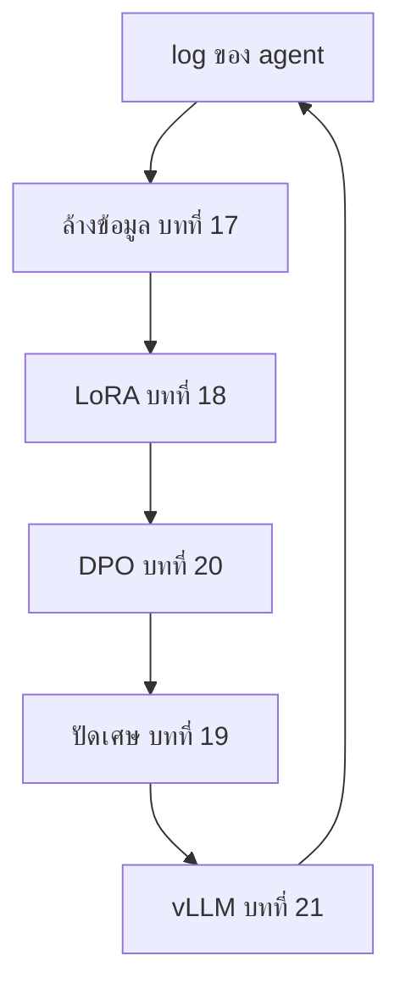

# บทที่ 17 ข้อมูลคือตัว fine-tune

model ที่ fine-tune เสร็จได้คะแนนบนชุดวัดผลสูงกว่าเดิมสิบจุด ทีมฉลอง สองสัปดาห์ต่อมา
ผู้ใช้จริงบอกว่ามันแย่ลง เปิดดูข้อมูลฝึกแล้วพบว่าคำถามในชุดวัดผลสามสิบข้อจากร้อยอยู่ใน
นั้นด้วย เพราะทั้งสองชุดถูกดึงมาจากแหล่งเดียวกันโดยคนละคน model ไม่ได้เก่งขึ้น มันท่อง
ข้อสอบ และคะแนนที่ทีมใช้ตัดสินใจคือเรื่องโกหกที่ไม่มีใครตั้งใจโกหก

การ fine-tune (การปรับจูน คือเอา model ที่ฝึกมาแล้วมาฝึกต่อบนข้อมูลของงานเรา) หนึ่งรอบ
คือโค้ดฝึกไม่กี่บรรทัดกับการตัดสินใจเรื่องข้อมูลยาวเป็นหน้า บทนี้จึงเริ่มจากส่วนที่ไม่ต้อง
ใช้ GPU เลย เพราะมันคือส่วนที่ตัดสินว่า GPU จะเสียเปล่าหรือไม่ และเรื่องเปิดบทคือการตัดสิน
ใจข้อเดียวที่ทีมนั้นไม่ได้ทำ

ภาค 4 ของหนังสือคือสิ่งที่บทพื้นฐานที่ 7 บอกให้ทำเป็นอย่างสุดท้าย หลัง prompt หลังตัวอย่าง
ใน prompt และหลัง retrieval ถ้าคุณมาถึงตรงนี้ คุณวัดแล้วว่าสามอย่างนั้นไม่พอ

## 1. ตัวอย่างหนึ่งตัวอย่างหน้าตาเป็นยังไง

ข้อมูลของการฝึกรอบที่สอง instruction tuning (ฝึกต่อบนคู่คำถามคำตอบที่คนเขียนให้) จากบทพื้
นฐานที่
7 คือคู่ของคำขอกับคำตอบที่ดี ไฟล์ของบทนี้มีเจ็ดคู่ที่จงใจ
ให้มีปัญหาแบบที่ dataset จริงมี

```text
Rename the variable x to total in math.py
  Edited math.py, x is now total in both places it appeared.
Rename the variable x to total in math.py
  Edited math.py, x is now total in both places it appeared.
Please rename the variable x to total in math.py
  Done, x is now total in both places it appeared in math.py.
Add a test for the add function
  ok
Why does the retry helper not wrap tool calls?
  Because a tool call can have a side effect ...
```

สองคู่แรกเหมือนกันทุกตัวอักษร คู่ที่สามเหมือนกันเกือบทั้งหมด คู่ที่สี่มีคำตอบคำเดียว และคู่
ที่ห้าคือคำถามในชุดวัดผลของบทเรียนที่ 22 ตรงตัว ทั้งสี่ปัญหานี้อยู่ใน dataset จริงทุกชุดที่
ดึงมาจากเว็บ จาก log ของระบบ หรือจากคนหลายคนที่เขียนตัวอย่างโดยไม่เห็นของกันและกัน

## 2. สำเนาสอนซ้ำ และสำเนาที่มองไม่เห็น

model ที่เห็นตัวอย่างเดียวกันสองครั้งเรียนรู้ว่าตัวอย่างนั้นสำคัญเป็นสองเท่า ไม่ใช่เรื่อง
ใหญ่สำหรับสองครั้ง แต่ dataset ที่ดึงจากเว็บมีข้อความบางชิ้นซ้ำเป็นพันครั้ง และ model ที่
ฝึกบนมันจะท่องชิ้นนั้นได้ทั้งดุ้น ขั้นแรกจึงคือตัดสำเนา และก่อนตัดต้องทำให้ความต่างเชิงผิว
หายไปก่อน

หัวไฟล์สัญญาอนุญาตคือตัวอย่างที่ชัดที่สุด ข้อความก้อนเดิมโผล่ในไฟล์สี่หมื่นไฟล์ที่ดึงมาจาก
ที่เดียวกัน แล้ว model ที่ฝึกบนกองนั้นจะพิมพ์หัวไฟล์ให้คุณก่อน ทั้งที่คุณขอแค่ฟังก์ชันบวกเลข

```python
def normalise(text):
    """Lower case, one space between words, no trailing punctuation."""
    return " ".join(text.lower().split()).rstrip(".!?")
```

ตัวพิมพ์เล็กทั้งหมด ช่องว่างเดียวระหว่างคำ ไม่มีเครื่องหมายท้ายประโยค สองตัวอย่างที่ต่าง
กันแค่จุดหนึ่งจุดคือตัวอย่างเดียวกัน และการเทียบหลังทำแบบนี้คือสิ่งที่ทำให้ `exact_dedupe`
มองทะลุมันได้ มันเก็บ hash ของคำขอกับคำตอบที่ normalise แล้ว และเก็บตัวแรกของทุกกลุ่มที่
hash ตรงกัน

สำเนาที่มองไม่เห็นคือปัญหาที่ใหญ่กว่า Please rename the variable x กับ Rename the
variable x ไม่ใช่ string เดียวกัน การเทียบตรงตัวเก็บไว้ทั้งคู่ และ dataset ที่ดึงจากแหล่ง
เดียวกันเต็มไปด้วยคู่แบบนี้ ฟังก์ชันที่จับมันได้เทียบชุดคำ ไม่ใช่ทั้ง string

```python
def near_dedupe(examples, threshold=0.8):
    """Drop an example whose prompt shares most of its word runs with one already kept."""
    kept = []
    for example in examples:
        mine = shingles(example["prompt"])
        if all(jaccard(mine, shingles(other["prompt"])) < threshold for other in kept):
            kept.append(example)
    return kept
```

shingle (กลุ่มคำที่เรียงติดกันตามจำนวนที่ตั้งไว้) ของประโยคคือทุกชุดสามคำที่
เรียงติดกัน สองประโยคข้างบนมีชุดสามคำร่วมกันหกจากเจ็ดชุด Jaccard (ขนาด
ของส่วนที่ซ้อนกันหารด้วยขนาดของส่วนรวม) จึงได้ 0.86 และเกินเส้น 0.8 ตัวที่มาทีหลังถูกตัด

โค้ดนี้เทียบทุกคู่ ซึ่งใช้ได้กับร้อยตัวอย่างและใช้ไม่ได้กับล้าน สายจริงใช้ MinHash (ย่อชุ
ด shingle เป็นลายเซ็นสั้นๆ ชุดที่คล้ายกันจะได้ลายเซ็นคล้ายกัน) เพื่อให้ตัวอย่างที่เกือบเห
มือนตกลงถังเดียวกันโดยไม่ต้องเทียบทุกคู่ แนวคิดเหมือนกันทุกประการ เทียบชุดคำ ไม่ใช่ทั้ง
string และเส้น 0.8 คือปุ่มที่ต้องปรับตามข้อมูล ตั้งต่ำไปแล้วตัวอย่างที่ต่างกันจริงหายตั้ง
สูงไปแล้วสำเนากลับมาครับ

## 3. ข้อสอบต้องไม่อยู่ในหนังสือเรียน

กลับมาที่เรื่องเปิดบท คำถามในชุดวัดผลที่หลุดเข้าไปในข้อมูลฝึกมีชื่อว่า contamination (ข้อ
มูลทดสอบหลุดไปอยู่ในข้อมูลฝึก) และมันคือบั๊กที่ทำให้ตัวเลขทุกตัวในบทที่ 7 ของหนังสือกลาย
เป็นเท็จ ฟังก์ชันที่กันมันสั้นเพราะงานสั้น

```python
def decontaminate(examples, eval_prompts):
    """Drop every example whose prompt is an evaluation question."""
    banned = {normalise(prompt) for prompt in eval_prompts}
    return [example for example in examples if normalise(example["prompt"]) not in banned]
```

ส่วนที่ยากไม่ใช่โค้ด มันคือการมีชุดวัดผลอยู่ก่อนที่จะสร้างข้อมูลฝึก ทีมในเรื่องเปิดบทไม่มี
พวกเขาเขียนข้อสอบทีหลังจากแหล่งเดียวกัน และไม่มีฟังก์ชันไหนช่วยได้ถ้าชุดวัดผลยังไม่มีตอน
ที่ข้อมูลฝึกถูกล้าง ลำดับที่ถูกคือ เขียนชุดวัดผลก่อน ล้างข้อมูลฝึกให้พ้นจากมัน แล้วค่อยฝึก
ซึ่งคือลำดับเดียวกับที่บทเรียนที่ 22 บอกให้เขียนชุดวัดผลก่อนเชื่อความรู้สึก

การเทียบตรงตัวหลัง normalise จับได้แค่กรณีที่คำถามเหมือนกันทุกคำ สายจริงใช้ shingle จาก
หัวข้อที่แล้วกับข้อสอบด้วย เพราะข้อสอบที่ถูกเรียบเรียงใหม่ก็ยังคือข้อสอบ

## 4. ตัวกรองคุณภาพ และรายงานที่สำคัญกว่าตัวกรอง

คำตอบว่า ok สอน model ว่าคำขอให้เขียน test ควรตอบว่า ok ตัวกรองข้อสุดท้ายจึงตัดคำตอบที่
สั้นเกินกว่าจะสอนอะไรได้

```python
def quality_filter(examples, minimum_answer_words=4):
    """Drop answers too short to have taught anything."""
    return [
        example for example in examples if len(example["answer"].split()) >= minimum_answer_words
    ]
```

ตัวกรองของจริงยาวกว่านี้มาก คำตอบผิดภาษา คำตอบที่เป็นแค่ลิงก์ คำตอบที่ตัวจำแนกให้คะแนน
ต่ำ คำตอบที่ยาวผิดปกติ รูปร่างของทุกตัวเหมือนกัน ฟังก์ชันที่ตอบจริงหรือเท็จต่อตัวอย่าง

เส้นสี่คำมีกับดักที่คนเขียนภาษาไทยต้องรู้ `split` นับคำจากช่องว่าง และคำตอบไทยยาวสามบรรทัด
มักไม่มีช่องว่างเลยสักตัว ตัวกรองจึงตัดคำตอบไทยทิ้งเกือบหมด สามหมื่นตัวอย่างเหลือหมื่นสอง
และไม่มีใครรู้จนกว่า model จะเริ่มตอบเป็นอังกฤษให้คำถามที่ถามเป็นไทย

สิ่งที่สำคัญกว่าตัวกรองคือสิ่งที่ `clean` พิมพ์ออกมา

```text
started with 7 examples
  dropped 1 for exact duplicates
  dropped 1 for near duplicates
  dropped 1 for evaluation questions
  dropped 1 for answers too short
kept 3
```

เจ็ดเข้า สามออก และสี่ตัวที่หายไปทุกตัวถูกบอกชื่อ ตัวกรองที่ตัดข้อมูลครึ่งหนึ่งทิ้งเงียบๆ
คือตัวกรองที่ไม่มีใครสังเกตจนกว่า model จะแย่ลง แล้วคนจะไปหาสาเหตุที่ learning rate ที่
จำนวนรอบ ที่ทุกอย่างยกเว้นตัวกรองที่กินข้อมูลไปครึ่งหนึ่งเมื่อสามสัปดาห์ก่อน รายงานต่อขั้น
คือกฎเดียวกับบทที่ 6 ของหนังสือ ทุกอย่างที่หายไปต้องมีบรรทัดบอกว่าหายไปไหน

## 5. รูปที่ trainer อ่าน คือรูปที่คอร์สส่งมาตลอด

สิ่งที่รอดจากตัวกรองต้องถูกเขียนลงดิสก์ในรูปที่ trainer อ่าน และรูปนั้นไม่ใช่ของใหม่

```python
def to_chat_jsonl(examples, system="You are a careful software assistant."):
    """One JSON object per line in the messages shape the trainers read."""
    lines = []
    for example in examples:
        messages = [
            {"role": "system", "content": system},
            {"role": "user", "content": example["prompt"]},
            {"role": "assistant", "content": example["answer"]},
        ]
        lines.append(json.dumps({"messages": messages}, ensure_ascii=False))
    return "\n".join(lines) + "\n"
```

```text
{"messages": [{"role": "system", "content": "You are a careful software assistant."}, {"role": "user", "content": "Rename the variable x to total in math.py"}, {"role": "assistant", "content": "Edited math.py, x is now total in both places it appeared."}]}
```

นี่คือรายการ messages จากบทเรียนที่ 01 บรรทัดละหนึ่งตัวอย่าง trainer ในบทถัดไปรับไฟล์นี้
แล้วใส่ chat template (วิธีต่อรายการข้อความให้เป็น string เดียวที่ model เห็น) ของ model
ให้แต่ละบรรทัด ซึ่งคือ `render` จากบทพื้นฐานที่ 7 ในขนาดจริง ผลคือข้อความที่ model เรียนจ
ากเป็น string เดียวกันทุกตัวอักษรกับที่มันจะเห็นตอนคอร์สเรียกมันผ่าน HTTP trainer ทุกตัว
จึงรับรูปนี้ ไม่ใช่ข้อความดิบ ถ้าคุณฝึกบน string ที่ประกอบเอง แล้วเรียกใช้ผ่าน API ที่ประ
กอบอีกแบบ model จะเห็นรูปที่ไม่เคยเห็นตอนฝึก และคุณจะสงสัยว่าทำไมมันแย่ลงกว่าตอนวัด

อาการเป็นแบบนี้ ทีมหนึ่งฝึกบน string ที่ต่อเองด้วยบรรทัดว่างคั่น ส่วน API ตอนเรียกใช้ใส่
token พิเศษคั่นทุกข้อความ คะแนนในลูปของ trainer อยู่ที่แปดสิบสอง พอวัดผ่าน HTTP จริงเหลือ
หกสิบเอ็ด โดยไม่มีบรรทัดไหนในโค้ดผิดเลยสักบรรทัด



## 6. ข้อมูลจากไหน และข้อมูลสังเคราะห์

เจ็ดตัวอย่างพอสำหรับดูสาย ไม่พอสำหรับฝึก งาน instruction tuning ที่ได้ผลจริงเริ่มที่หลาย
ร้อยตัวอย่างที่คนตรวจแล้ว และดีขึ้นจนถึงหลักหมื่น แหล่งมีสามแหล่ง และแต่ละแหล่งมีกับดัก
ของตัวเอง

แหล่งแรกคือ log ของระบบที่คุณมี ทุกบทสนทนาที่ agent จากภาค 3
ทำแล้วผู้ใช้พอใจคือตัวอย่างหนึ่ง กับดักคือมันมีทั้งบทสนทนาที่ดีและแย่ปนกัน และกา
รแยกต้องมีคนหรือมีเกณฑ์จากบทที่ 7
ของหนังสือ ส่วนข้อมูลส่วนตัวของผู้ใช้ที่อยู่ในนั้นต้องออกก่อน ด้วยเหตุผลเดียวกับ
บทที่ 5

คำว่าพอใจคือจุดที่กับดักซ่อนอยู่ บทสนทนาสี่พันบทที่ไม่มีใครกดบ่นไม่ได้แปลว่าดีสี่พันบท
เก้าร้อยบทในนั้นคือบทที่ผู้ใช้ถามซ้ำสามรอบแล้วเลิกไป และทั้งเก้าร้อยจะกลายเป็นตัวอย่าง
ที่สอน model ว่าคำตอบแบบนั้นใช้ได้

แหล่งที่สองคือคนเขียน แพงที่สุด ดีที่สุด และเป็นวิธีที่ model ที่คุณเรียกอยู่ทุกวันถูกสร้าง
ในรอบที่สอง

แหล่งที่สามคือให้ model ที่เก่งกว่าเขียนให้ ชื่อ synthetic data (ข้อมูลสังเคราะห์ คือตัวอ
ย่างฝึกที่ model อีกตัวสร้างขึ้น) เอาคำขอจริงจาก log ให้ model ใหญ่ตอบ แล้วเอาคู่นั้นไปฝึ
ก model เล็ก วิธีนี้ชื่อ distillation (ฝึก model เล็กให้เลียนแบบ output ของ model ใหญ่)
และมันคือวิธีที่ model เล็กส่วนใหญ่ที่ใช้งานได้จริงถูกสร้าง กับดักมีสองข้อสัญญาการใช้งานข
องผู้ให้บริการบางเจ้าห้ามเอา output ไปฝึก model คู่แข่ง ต้องอ่านก่อน และ model เล็กจะเรีย
นความผิดของ model ใหญ่มาด้วยทั้งหมด รวมถึง hallucination จากบทพื้นฐานที่ 7 ตัวกรองในหัวข้
อที่ 4 จึงต้องใช้กับข้อมูลสังเคราะห์หนักกว่าข้อมูลที่คนเขียน ไม่ใช่เบากว่าครับ

## 7. สรุป

- fine-tune คือโค้ดไม่กี่บรรทัดกับการตัดสินใจเรื่องข้อมูลยาวเป็นหน้า และข้อมูลคือที่ที่พัง

- สำเนาสอนซ้ำ ตัดหลัง normalise และตัดสำเนาที่เกือบเหมือนด้วยชุดคำ ไม่ใช่ทั้ง string

- ข้อสอบต้องไม่อยู่ในข้อมูลฝึก และนั่นแปลว่าต้องมีข้อสอบก่อน

- ทุกขั้นของตัวกรองต้องรายงานว่าตัดไปเท่าไหร่ ตัวกรองที่เงียบคือบั๊กที่หาไม่เจอ

- รูปที่ฝึกต้องเป็นรูปที่เรียกใช้ คือรายการ messages ผ่าน chat template ของ model

- ข้อมูลสังเคราะห์ใช้ได้ กรองหนักกว่าเดิม และอ่านสัญญาก่อน

## โค้ดที่ลงมือทำเรื่องนี้

ทั้งสายอยู่ใน [training/01-dataset/dataset.py](../training/01-dataset/dataset.py) รัน
`python dataset.py` เพื่อดูเจ็ดตัวอย่างกลายเป็นสามพร้อมรายงาน แล้วรัน `python check.py`
เพื่อยืนยันทุกข้ออ้าง `build_dataset.py` ในโฟลเดอร์เดียวกันคือสายเดียวกันบนไฟล์ JSONL
จริง ลองเอา log ของ agent จากภาค 3 มาแปลงเป็นคู่คำขอกับคำตอบ แล้วดูว่าแต่ละขั้นตัดไป
เท่าไหร่ ตัวเลขนั้นบอกคุณภาพของ log ได้ก่อนที่จะฝึกอะไรเลย

## อ่านต่อ

- Lee และคณะ ปี 2022 บทความ Deduplicating Training Data Makes Language Models Better คือหลักฐานว่าหัวข้อที่ 2 คุ้มแค่ไหน

- Broder ปี 1997 บทความ On the resemblance and containment of documents คือ MinHash

- Zhou และคณะ ปี 2023 บทความ LIMA แสดงว่าตัวอย่างพันตัวที่คัดดีชนะตัวอย่างหมื่นตัวที่ไม่คัด

- Wang และคณะ ปี 2023 บทความ Self-Instruct คือวิธีสร้างข้อมูลสังเคราะห์ในหัวข้อที่ 6 ที่ใช้กันแพร่หลาย
