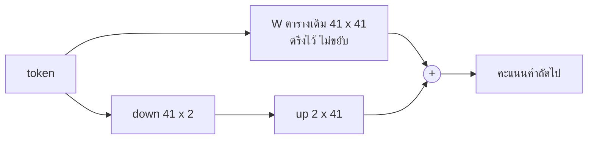

# บทที่ 18 LoRA บนตารางที่นับได้

ตารางขนาดสี่สิบเอ็ดคูณสี่สิบเอ็ด หนึ่งพันหกร้อยแปดสิบเอ็ดตัวเลข ถูกฝึกให้เรียนข้อความใหม่
สองวิธี วิธีแรกขยับตัวเลขทั้งพันหกร้อย ได้ loss 0.725 วิธีที่สองขยับตัวเลขร้อยหกสิบสี่ตัว
ได้ 0.942 ตัวเลขน้อยกว่าสิบเท่า ผลใกล้กันในระดับที่ใช้งานได้ อัตราส่วนนั้นคือ LoRA และบน
model จริงมันคือความต่างระหว่างการ์ดที่เช่าได้กับการ์ดที่ไม่มีใครมี

## 1. fine-tune แบบเต็มคือบทที่ 4 ทำต่อ และราคาของมัน

model ที่ฝึกแล้วคือตารางตัวเลข การ fine-tune (การปรับจูน คือการฝึกต่อบนข้อมูลใหม่จากจุดที่
model ฝึกมาแล้ว) แบบเต็มคือเอาตารางนั้นมาก้าวลงเขาต่อบนข้อความใหม่ ไม่มีอะไรใหม่ในโค้ด

```python
def full_finetune(weights, xs, ys, steps=100, learning_rate=10.0):
    """Nudge every number in the grid on the new text. Every parameter moves."""
    tuned = weights.copy()
    for _ in range(steps):
        tuned -= learning_rate * gradient(tuned, xs, ys)
    return tuned
```

ราคาอยู่ที่บรรทัดแรกในฟังก์ชัน `weights.copy()` บน model จริงการก้าวหนึ่งก้าวต้องถือสาม
อย่างในหน่วยความจำ parameter ทั้งหมดของ model gradient ของทุกตัว และสถานะของ
optimizer (ตัวปรับค่า คืออัลกอริทึมที่ตัดสินขนาดก้าวของแต่ละตัวเลขจากประวัติของมัน) ซึ่ง
ตัวที่ใช้กันเก็บอีกสองค่าต่อตัวเลข รวมแล้วราวสิบหกไบต์ต่อ parameter model เจ็ดพันล้าน
parameter ต้องการราวร้อยยี่สิบกิกะไบต์แค่จะก้าวได้หนึ่งก้าว การ์ดแปดสิบกิกะไบต์ที่เช่าได้
ทั่วไปไม่พอ

บทนี้ทำมันบนตารางของบทพื้นฐานที่ 4 เพื่อให้เห็นทุกตัวเลข แล้วชี้ไปที่ script ที่ทำสิ่ง
เดียวกันบน model แบบเปิดด้วย library ที่ทุกคนใช้ และตารางเดียวกันจะให้เห็นสิ่งที่ LoRA
ไม่ได้แก้ ซึ่งคือสิ่งที่คนพลาดบ่อยกว่า

## 2. การเปลี่ยนแปลงมักเรียบง่าย และ LoRA เข้าทางช่องนั้น

สังเกตว่าสิ่งที่ fine-tune ผลิตคือตารางใหม่ ซึ่งเท่ากับตารางเก่าบวกการเปลี่ยนแปลง การ
เปลี่ยนแปลงนั้นเป็นตารางขนาดเท่ากัน แต่มีคนวัดในปี 2021 แล้วพบว่ามันมีโครงสร้างง่ายกว่า
ที่ขนาดบอก ตารางที่มีทิศทางอิสระไม่กี่ทิศอธิบายมันได้เกือบหมด

LoRA (low-rank adaptation คือการเรียนรู้การเปลี่ยนแปลงในรูปผลคูณของสองตารางบางๆ แทน
ที่จะเรียนรู้ทั้งตาราง) ใช้ข้อสังเกตนั้นตรงๆ ตรึงตารางเดิม เรียนรู้ตารางบางสองตาราง ตารางลง
ขนาดสี่สิบเอ็ดคูณสอง และตารางขึ้นขนาดสองคูณสี่สิบเอ็ด ผลคูณของมันคือตารางเต็มที่มีทิศทาง
อิสระแค่สอง

```python
def lora_finetune(weights, xs, ys, rank=2, steps=300, learning_rate=2.0, seed=0):
    """Keep the grid frozen. Learn a thin pair whose product is the change."""
    rng = np.random.default_rng(seed)
    size = weights.shape[0]
    down = rng.normal(0, 0.01, size=(size, rank))
    up = np.zeros((rank, size))
    for _ in range(steps):
        full_change = gradient(weights + down @ up, xs, ys)
        down_change = full_change @ up.T
        up_change = down.T @ full_change
        down -= learning_rate * down_change
        up -= learning_rate * up_change
    return down, up
```



อ่านใน loop gradient ที่คำนวณคือ gradient ของบทที่ 4 เทียบกับตารางเต็ม ซึ่งคือตารางที่
ตรึงไว้บวกผลคูณ จากนั้น chain rule แปลงมันเป็น gradient ของสองตารางบาง และสองตาราง
นั้นคือสิ่งเดียวที่ขยับ ตารางเดิมไม่ถูกแตะเลยตลอดการฝึก

สองบรรทัดก่อน loop คือธรรมเนียมที่ทุก implementation ทำตาม ตารางขึ้นเริ่มที่ศูนย์ ผลคูณ
จึงเป็นศูนย์ และก้าวที่ศูนย์คือ model ที่ตรึงไว้โดยไม่มีอะไรต่าง adapter (ตัวปรับ คือคู่ตาราง
บางที่ LoRA เรียนรู้ แยกเก็บจาก model เดิม) มองไม่เห็นจนกว่าจะเริ่มฝึก `check.py` พิสูจน์
ด้วยการฝึกศูนย์ก้าวแล้วเทียบ ถ้าเริ่มทั้งสองตารางแบบสุ่ม ก้าวแรกจะเริ่มจาก model ที่ถูก
รบกวนแล้ว และความรู้เดิมบางส่วนหายไปก่อนที่จะได้เรียนอะไร

## 3. ตัวเลขทั้งตาราง

```text
41 words, a grid of 1681 numbers

                    loss on old text   on new text   numbers trained
frozen model                   0.787         3.505                 0
full finetune                  1.924         0.725              1681
lora rank 2                    2.466         0.942               164
lora, old text too             0.922         1.363               164
```

อ่านคอลัมน์ข้อความใหม่ก่อน model ที่ตรึงไว้ผิด 3.505 บนข้อความที่ไม่เคยเห็น fine-tune
เต็มลงมาที่ 0.725 LoRA rank 2 ลงมาที่ 0.942 ด้วยตัวเลขร้อยหกสิบสี่ตัวจากพันหกร้อยแปดสิบเอ็ด
ห่างกันสองในสิบ ใช้ตัวเลขน้อยกว่าสิบเท่า บน model จริงอัตราส่วนนี้สุดขั้วกว่านี้มาก adapter
ที่ rank สิบหกบน model เจ็ดพันล้าน parameter คือราวสี่สิบล้านตัวเลข ครึ่งเปอร์เซ็นต์ และ
สามอย่างในหัวข้อที่ 1 ที่ต้องถือในหน่วยความจำก็เหลือแค่สำหรับสี่สิบล้านนั้น การ์ดยี่สิบสี่
กิกะไบต์ฝึกได้

rank (อันดับ คือจำนวนทิศทางอิสระในตาราง และคือความกว้างของตารางบางใน LoRA) คือปุ่ม
เดียวที่สำคัญ สูงขึ้นแปลว่าการเปลี่ยนแปลงซับซ้อนขึ้นได้ และ parameter มากขึ้นเป็นเส้นตรง
ค่าที่ใช้กันคือแปดถึงหกสิบสี่ และคำตอบว่าเท่าไหร่พอต้องมาจากบทที่ 7 ของหนังสือ ไม่ใช่จาก
ค่าที่คนอื่นใช้

## 4. สิ่งที่ LoRA ไม่ได้แก้

ทีนี้อ่านคอลัมน์ข้อความเก่า model ที่ตรึงไว้ผิด 0.787 บนสิ่งที่มันฝึกมา หลัง fine-tune เต็ม
บนข้อความใหม่ มันผิด 1.924 บนของเก่า หลัง LoRA ผิด 2.466 ทั้งสองวิธีลืม

อาการนี้ชื่อ catastrophic forgetting (การลืมแบบหายนะ คือการที่ model ที่ฝึกต่อบนข้อมูล
ใหม่เสียความสามารถบนข้อมูลเดิม) และมันคือสิ่งที่คนคาดว่า LoRA จะป้องกันเพราะตารางเดิม
ถูกตรึงไว้ ตารางเดิมถูกตรึงจริง แต่ผลคูณที่บวกเข้าไปเปลี่ยนคำตอบของทุกแถวที่มันแตะ และ
มันแตะทุกแถว การตรึง parameter ไม่ใช่การตรึงพฤติกรรม

บนตารางนี้ LoRA ลืมมากกว่า fine-tune เต็ม เพราะมันเดินสามร้อยก้าวเทียบกับร้อย บน model
จริงผลที่วัดกันคือ LoRA มักลืมน้อยกว่า fine-tune เต็ม แต่ยังลืม และตัวเลขที่ต่างกันไม่ใช่
ประเด็น ประเด็นคือทั้งสองคอลัมน์ขยับพร้อมกัน ไม่มีวิธีไหนเรียนของใหม่โดยไม่แตะของเก่า

แถวสุดท้ายคือทางแก้ ฝึก LoRA บนข้อความใหม่บวกข้อความเก่า ได้ 0.922 บนของเก่า ห่างจาก
model เดิมแค่หนึ่งในสิบ ขณะที่ยังลง 1.363 บนของใหม่ วิธีนี้ชื่อ rehearsal (การทบทวน คือ
การผสมข้อมูลเดิมกลับเข้าไปในข้อมูลฝึกใหม่) และมันคือคำตอบมาตรฐาน ยาแก้การลืมคือข้อมูล
ไม่ใช่วิธี ทุกสายฝึกจริงผสมข้อมูลทั่วไปสัดส่วนหนึ่งกลับเข้าไปในข้อมูลเฉพาะทางเสมอ และสัดส่วน
นั้นคือการตัดสินใจเรื่องข้อมูลอีกข้อ แบบเดียวกับที่บทที่ 17 ว่าไว้ว่าข้อมูลคือตัว fine-tune

## 5. merge แล้ว adapter หายไป

หลังฝึกเสร็จ ผลคูณของสองตารางบางบวกเข้าตารางเดิมได้ในบรรทัดเดียว

```python
def merge(weights, down, up):
    """Add the product on. After this there is no adapter, only a grid, at no extra cost."""
    return weights + down @ up
```

มีสองทางเลือก เก็บ adapter แยกไว้ แล้วตอนใช้งานคำนวณผลคูณเพิ่มทุกครั้ง หรือบวกผลคูณเข้า
ตารางเดิมครั้งเดียว ได้ตารางธรรมดาที่ไม่มีอะไรบอกว่าเคยมี adapter และการให้บริการไม่ต้อง
จ่ายอะไรเพิ่ม

ทางแรกมีประโยชน์เมื่อ model ฐานตัวเดียวต้องรับ adapter หลายตัว ผู้ให้บริการที่ให้คุณ
fine-tune บน API ทำแบบนี้ เก็บฐานตัวเดียวในหน่วยความจำ และสลับ adapter ไม่กี่สิบเมกะไบต์
ต่อลูกค้า ทางที่สองคือทางปกติเมื่อคุณให้บริการ model ของตัวเอง และ `--merge` ใน script
จริงทำมันให้

## 6. script จริง

`train_lora.py` ในโฟลเดอร์เดียวกันคือฟังก์ชันข้างบนบน model แบบเปิดครึ่งพันล้าน
parameter บนไฟล์ที่บทที่ 17 เขียน สาม library แบ่งงานกัน transformers ถือ model peft
(parameter-efficient fine-tuning คือ library ที่เพิ่ม adapter แบบ LoRA เข้าไปใน model ที่
มีอยู่) เพิ่มคู่ตารางบางข้างทุกตาราง attention และ feed-forward และ trl รัน loop การฝึกโดย
ใส่ chat template ให้แต่ละบรรทัด และคิด loss เฉพาะบน turn ของ assistant ไม่ใช่บนคำถาม
ที่มันได้รับ

สี่ค่าใน script ที่ควรเข้าใจ ไม่ใช่ลอก rank สิบหกคือค่าเริ่มต้นที่คนส่วนใหญ่ใช้ alpha หาร
ด้วย rank คือตัวคูณของผลคูณ ตั้ง alpha สองเท่าของ rank จึงคูณสอง ซึ่งเป็นธรรมเนียมมากกว่า
หลักการ learning rate สองในหมื่นคือราวสิบเท่าของที่ fine-tune เต็มใช้ เพราะมีแค่ adapter
ที่ขยับและมันเริ่มจากศูนย์ และรายการตารางที่ได้ adapter รวม feed-forward ด้วย เพราะบท
พื้นฐานที่ 6 บอกว่าสองในสามของ parameter อยู่ตรงนั้น และงานวิจัยหลังบทความต้นฉบับพบว่า
การใส่ adapter ตรงนั้นช่วยมากกว่าที่ใส่แค่ attention

มันต้องใช้ GPU ราวแปดกิกะไบต์ จบในไม่กี่นาทีบนการ์ดที่เช่ารายชั่วโมง และไม่ได้รันใน CI
ของโปรเจกต์นี้ เพราะ CI ไม่มีการ์ด สิ่งที่ CI รันคือตารางในหัวข้อที่ 3 ซึ่งพิสูจน์ว่าทุกข้ออ้าง
ในบทนี้เป็นจริงบนของที่นับได้ครับ

## 7. สรุป

- fine-tune เต็มคือบทที่ 4 ทำต่อ และต้องถือสิบหกไบต์ต่อ parameter

- การเปลี่ยนแปลงมักมีทิศทางอิสระไม่กี่ทิศ LoRA เรียนรู้แค่ทิศพวกนั้นในคู่ตารางบาง

- ตารางขึ้นเริ่มที่ศูนย์ ก้าวที่ศูนย์จึงคือ model เดิมโดยไม่มีอะไรต่าง

- LoRA ไม่ได้แก้การลืม ข้อมูลเก่าที่ผสมกลับเข้าไปแก้

- merge แล้วได้ตารางธรรมดา ไม่มีราคาตอนให้บริการ

## โค้ดที่ลงมือทำเรื่องนี้

ทั้งหมดอยู่ใน [training/02-lora/lora.py](../training/02-lora/lora.py) รัน `python lora.py`
เพื่อดูตารางสี่แถว แล้วรัน `python check.py` เพื่อยืนยันทุกข้ออ้าง ลองเปลี่ยน `rank` เป็น
หนึ่งแล้วเป็นแปด และดูว่าคอลัมน์ข้อความใหม่ขยับเท่าไหร่ต่อ parameter ที่เพิ่ม script จริง
คือ `train_lora.py` ในโฟลเดอร์เดียวกัน สำหรับวันที่มีการ์ด

## อ่านต่อ

- Hu และคณะ ปี 2021 บทความ LoRA Low-Rank Adaptation of Large Language Models คือฟังก์ชัน lora_finetune ในขนาดจริง

- Biderman และคณะ ปี 2024 บทความ LoRA Learns Less and Forgets Less วัดสิ่งที่หัวข้อที่ 4 เห็นบนตารางเล็ก บน model จริง

- Kirkpatrick และคณะ ปี 2017 บทความ Overcoming catastrophic forgetting คือชื่อทางการของปัญหาในหัวข้อที่ 4 และทางแก้อีกตระกูลหนึ่ง
