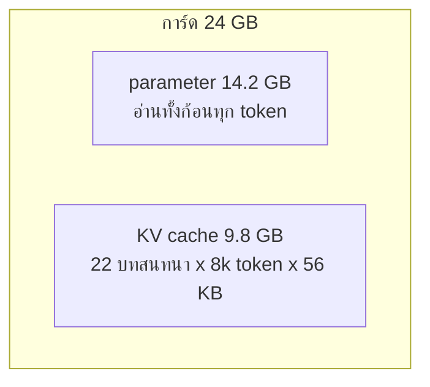

# บทที่ 21 การให้บริการคือเลขคณิต

หกสิบหก token ต่อวินาที ตัวเลขนี้ไม่ได้มาจากการวัด มันมาจากการเอา bandwidth (แบนด์วิดท์
คือจำนวนไบต์ต่อวินาทีที่อ่านจากหน่วยความจำได้) ของการ์ดหารด้วยขนาดของ parameter และไม่มี
อย่างอื่น แล้วมันใกล้กับสิ่งที่การ์ดทำได้จริงจนน่าตกใจ เพราะการสร้างหนึ่ง token คือการอ่าน
parameter ทุกตัวหนึ่งรอบ และเลขคณิตของชิปยังห่างจากขีดจำกัดมาก

บทสุดท้ายของภาค 4 ไม่ได้วัดอะไรเลย มันคูณ และประเด็นคือการคูณพาไปได้ไกลแค่ไหน ก่อนเช่า
การ์ดคุณควรตอบได้ว่า model จะพอดีไหม รับกี่คนพร้อมกัน และเร็วแค่ไหน สามคำถามนี้ตอบได้
จากรูปร่างของ model กับสองตัวเลขของการ์ด และคำตอบอธิบายเหตุผลที่ผู้ให้บริการทุกเจ้าคิด
เงินแบบที่คิด

## 1. parameter ใช้ที่เท่าไหร่

```text
weights alone, in gigabytes
model    fp16    int8    int4
0.5B      0.9     0.5     0.2
7B       14.2     7.1     3.5
72B     135.4    67.7    33.9
```

จำนวน parameter คูณไบต์ต่อตัวเลข จบ สิบหกบิตคือสิ่งที่การฝึกทิ้งไว้ แปดกับสี่คือบทที่ 19
model เจ็ดสิบสองพันล้าน parameter ที่สิบหกบิตไม่พอดีการ์ดแปดสิบกิกะไบต์ที่เช่าได้ทั่วไป
ที่สี่บิตพอดีใบเดียว บทที่ 19 มีอยู่เพื่อสิ่งนี้ ไม่ใช่เพื่อประหยัด แต่เพื่อให้เป็นไปได้

## 2. cache จากบทพื้นฐานที่ 6 คือสิ่งที่โตตามคน

บทพื้นฐานที่ 6 สร้าง KV cache ด้วยมือและบอกว่ามันคือเหตุผลที่หน่วยความจำโตตามบทสนทนา
นี่คือตัวเลขจริงของมัน

```python
def kv_bytes_per_token(model, width="fp16"):
    """The cache from foundations chapter 6, per token, for every layer."""
    shape = MODELS[model]
    numbers = 2 * shape["layers"] * shape["kv_heads"] * shape["head_size"]
    return numbers * BYTES_PER_PARAMETER[width]
```

key หนึ่งกับ value หนึ่งต่อชั้น แต่ละอันคือจำนวนหัวคูณขนาดหัว สำหรับ model เจ็ดพันล้านคือ
ห้าสิบหกกิโลไบต์ต่อ token ต่อบทสนทนา

สังเกตว่า kv_heads ในรูปร่างของ model เล็กกว่าจำนวนหัว attention มาก สี่ต่อยี่สิบแปด นั่นไม่
ใช่ความบังเอิญ model รุ่นใหม่ทุกตัวให้หลายหัว query แชร์ key กับ value ชุดเดียวกัน เพื่อ
หด cache นี้โดยเฉพาะ เพราะ cache คือสิ่งที่ตัดสินหัวข้อถัดไป

## 3. รับกี่คนพร้อมกัน

```text
the 7B model at fp16 on each card
card        fits   8k conversations at once   tokens per second, one request
RTX 4090    True                         22                             66
A100 80GB   True                        150                            134
H100 80GB   True                        150                            220
```

หน่วยความจำของการ์ดลบ parameter คือที่ว่าง หารด้วย cache ต่อบทสนทนาที่ความยาวหนึ่ง คือ
จำนวนบทสนทนาที่รับได้พร้อมกัน การ์ดยี่สิบสี่กิกะไบต์รับ model เจ็ดพันล้านที่สิบหกบิตได้ยี่สิบ
สองบทสนทนายาวแปดพัน token ที่สามหมื่นสอง token เหลือห้า และถ้า parameter ไม่พอดี คำ
ตอบคือศูนย์



นี่คือเหตุผลที่ผู้ให้บริการคิดเงิน context ยาวแพงกว่า ไม่ใช่แค่เพราะบทพื้นฐานที่ 6 บอกว่า
งานโตกำลังสอง แต่เพราะบทสนทนายาวหนึ่งบทกินที่ของบทสนทนาสั้นหลายบท และที่บนการ์ดคือ
สิ่งที่เขาขาย

## 4. เร็วแค่ไหน และทำไมไม่ใช่เรื่องของชิป

```python
def decode_tokens_per_second(model, width, card):
    """The ceiling on generation speed for one request, from bandwidth alone."""
    return CARDS[card]["bandwidth"] / weight_bytes(model, width)
```

การสร้าง token หนึ่งตัวต้องคูณ vector ของ token กับทุกตารางใน model ซึ่งแปลว่าต้องอ่าน
parameter ทุกตัวจากหน่วยความจำหนึ่งรอบ การอ่านสิบห้ากิกะไบต์บนการ์ดที่อ่านได้หนึ่งเทราไบต์
ต่อวินาทีใช้เวลาสิบห้ามิลลิวินาที หกสิบหก token ต่อวินาที ชิปคูณเสร็จเร็วกว่านั้นหลายสิบเท่า
และนั่งรอหน่วยความจำ

decode (การถอดรหัส คือขั้นสร้าง token ทีละตัวหลังจากอ่าน prompt แล้ว) จึงถูกจำกัดด้วย
bandwidth ไม่ใช่ด้วยการคำนวณ และข้อเท็จจริงข้อเดียวนี้อธิบายสามอย่างที่คุณจ่ายเงิน

```text
the same model on the same card, narrower
  fp16    22 conversations      66 tokens per second
  int8    38 conversations     133 tokens per second
  int4    46 conversations     265 tokens per second
```

อย่างแรก quantize เป็นสี่บิตยกเพดานของหนึ่งคำขอขึ้นสี่เท่า เพราะอ่านน้อยลงสี่เท่า อย่างที่
สอง การรับหลายคำขอพร้อมกันเกือบฟรี parameter ถูกอ่านหนึ่งรอบต่อก้าวอยู่แล้ว จะคูณกับ
vector ของหนึ่ง token หรือสี่สิบหก token ก็อ่านเท่ากัน ผู้ให้บริการจึงรวมคำขอเป็นชุด ที่เรียก
ว่า batching (การรวมชุด คือการประมวลผลหลายคำขอในการอ่าน parameter รอบเดียว) และมันคือ
เหตุผลที่ราคาต่อ token ของเขาต่ำกว่าที่คุณเช่าการ์ดเองได้ เกือบฟรีจนกว่า cache ของทุกบท
สนทนารวมกันจะใหญ่กว่า parameter ซึ่งที่สี่สิบหกบทสนทนายาวแปดพันมันใหญ่กว่าแล้ว ตอนนั้น
การอ่าน cache คือสิ่งที่จำกัดแทน อย่างที่สาม token ขาออกแพงกว่าขาเข้า เพราะ prompt ทั้ง
ก้อนถูกอ่านในรอบเดียวที่ชิปทำงานเต็ม ส่วนคำตอบคือ loop นี้ ทีละ token รออ่านหน่วยความจำ
ทุกตัว

## 5. คำสั่งเดียว แล้วทั้งคอร์สรันบน model ของคุณ

`launch.py` ในโฟลเดอร์เดียวกันเอาเลขคณิตข้างบนไปใช้กับ model กับการ์ดที่คุณระบุ แล้วพิมพ์
คำสั่ง

```text
7B at int4 is 3.5 GB of weights
beside the weights, about 46 conversations of 8192 tokens fit
one request decodes at most 265 tokens per second, bandwidth bound

vllm serve Qwen/Qwen2.5-7B-Instruct-AWQ --max-model-len 8192 --port 8000 --quantization awq

then, on the machine running the course
  export AGENTPATH_BASE_URL=http://localhost:8000/v1
  export AGENTPATH_MODEL=Qwen/Qwen2.5-7B-Instruct-AWQ
```

vLLM (server ให้บริการ model แบบเปิดที่ทำ batching และจัดการ cache ให้) เปิด endpoint รูป
เดียวกับ OpenAI ซึ่งคือรูปเดียวกับที่บทเรียนที่ 01 เรียก และ mock server ของโปรเจกต์นี้
เลียนแบบ บทที่ 12 ของหนังสือบอกว่าทั้งคอร์สถูกเขียนกับรูปร่างของ endpoint ไม่ใช่ผู้ให้
บริการ และตรงนี้คือที่ที่มันคุ้ม เปลี่ยนตัวแปรสภาพแวดล้อมตัวเดียว แล้วทุกบทเรียนตั้งแต่ 01
ถึง 23 รันกับ model ที่คุณล้างข้อมูล ฝึก ปัดเศษ และปรับตามความชอบเองในสี่บทที่ผ่านมา

script รันได้ทุกที่และไม่เริ่มอะไร มันพิมพ์ คัดลอกคำสั่งไปเครื่องที่มีการ์ด และก่อนคัดลอก
มันบอกก่อนว่าพอดีไหม ซึ่งเป็นคำถามที่ควรตอบก่อนจ่ายค่าเช่าครับ

## 6. สรุป

- ที่ที่ใช้คือจำนวน parameter คูณไบต์ต่อตัวเลข และสี่บิตคือสิ่งที่ทำให้ model ใหญ่พอดีการ์ด
  ใบเดียว

- cache ต่อ token มาจากรูปร่างของ model และมันคือสิ่งที่ตัดสินว่ารับกี่คนพร้อมกัน

- decode ถูกจำกัดด้วย bandwidth ไม่ใช่การคำนวณ จึงเป็นเหตุผลของ quantization batching
  และราคาขาออกที่แพงกว่าขาเข้า

- endpoint รูปเดียวกันคือสิ่งที่ทำให้ทั้งคอร์สรันบน model ของคุณด้วยตัวแปรตัวเดียว

## โค้ดที่ลงมือทำเรื่องนี้

ทั้งหมดอยู่ใน [training/05-serving/serving.py](../training/05-serving/serving.py) รัน
`python serving.py` เพื่อดูสามตาราง แล้วรัน `python check.py` เพื่อยืนยันทุกข้ออ้าง จากนั้น
รัน `python launch.py` กับ model และการ์ดที่คุณคิดจะเช่า ก่อนเช่า ลองเพิ่มการ์ดที่คุณมีจริง
ลงใน `CARDS` ด้วย bandwidth จากแผ่นสเปก แล้วเทียบตัวเลขที่ได้กับสิ่งที่มันทำจริงเมื่อคุณ
วัด ระยะห่างระหว่างสองตัวเลขนั้นคือทุกอย่างที่บทนี้ไม่ได้พูดถึง

## อ่านต่อ

- Pope และคณะ ปี 2022 บทความ Efficiently Scaling Transformer Inference คือเลขคณิตของบทนี้ในรูปเต็ม รวม batching และ parallelism

- Kwon และคณะ ปี 2023 บทความ Efficient Memory Management for Large Language Model Serving with PagedAttention คือ vLLM และวิธีที่มันจัดการ cache ในหัวข้อที่ 2

- Ainslie และคณะ ปี 2023 บทความ GQA คือเหตุผลที่ kv_heads น้อยกว่าจำนวนหัว attention

- Williams Waterman และ Patterson ปี 2009 บทความ Roofline คือกรอบคิดที่หัวข้อที่ 4 ใช้โดยไม่เรียกชื่อ ว่างานถูกจำกัดด้วยหน่วยความจำหรือการคำนวณ
