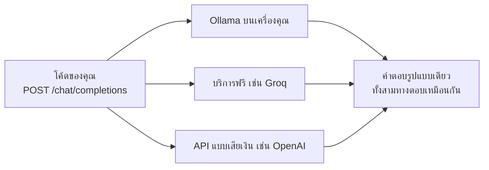

[Read in English](README.md)

# บทที่ 00. การติดตั้ง

นี่คือบทที่คนส่วนใหญ่เลิกกลางคัน ไม่ใช่เพราะมันยาก แต่เพราะการติดตั้งคือช่วงที่
ยังไม่มีอะไรทำงาน และไม่มีรางวัลตอบแทนให้ฝ่าฟันไปข้างหน้า บทนี้จึงยาวโดยตั้งใจ
มันอธิบายทุกคำสั่งแทนที่จะโยนใส่คุณเฉย ๆ มันบอกว่าแต่ละอย่างมีไว้ทำอะไร และหัวข้อ 8
รวบรวมทุก error ที่เราเคยเห็นผู้เรียนเจอ พร้อมข้อความจริงที่ error เหล่านั้นพิมพ์ออกมา

ไม่มีอะไรในบทนี้ที่ต้องการให้คุณรู้เรื่อง AI มาก่อน ถ้าคุณเปิด terminal เป็น
และเคยเขียนโค้ดมาบ้างไม่ว่าภาษาใด คุณคือผู้อ่านที่เราตั้งใจเขียนถึง ค่อย ๆ ทำไป
เมื่อจบบทนี้ คุณจะมีเครื่องที่คุยกับ language model ได้ และอีก 23 บทที่เหลือจะทำงานได้ทันที

---

## 1. สิ่งที่คุณจะได้เมื่อจบบทนี้

พูดให้ชัดคือห้าอย่าง

- **Python เวอร์ชันใหม่** เวอร์ชัน 3.10 ขึ้นไป ติดตั้งในแบบที่ไม่ไปตีกับ Python
  ตัวอื่นที่มีอยู่แล้วในเครื่องคุณ
- **virtual environment สำหรับคอร์สนี้** โฟลเดอร์ส่วนตัวที่เก็บ package
  ของโปรเจกต์นี้โดยเฉพาะ แปลว่าการติดตั้งอะไรลงตรงนี้จะไม่มีทางทำให้โปรเจกต์อื่น
  ในเครื่องคุณพัง
- **package ที่ต้องติดตั้งแค่ตัวเดียวคือ `httpx`** นั่นคือ dependency ทั้งหมด
  ของบทเรียนช่วงต้น `httpx` ใช้ส่ง HTTP request เมื่อมองจากมุมของโค้ดคุณ
  language model ก็คือ HTTP endpoint ตัวหนึ่ง HTTP client จึงเป็นทุกอย่าง
  ที่คุณต้องการจริง ๆ
- **model ที่คุณเข้าถึงได้** จะรันบนเครื่องคุณเองหรือให้คนอื่น host ให้ก็ได้
  คุณจะเลือกหนึ่งในสามทางเลือกในหัวข้อ 4 และคอร์สนี้ใช้ได้กับทั้งสามทาง
- **environment variable สามตัวที่ตั้งค่าไว้แล้ว** ชื่อ `AGENTPATH_BASE_URL`
  `AGENTPATH_API_KEY` และ `AGENTPATH_MODEL` พร้อมกับการรัน `check.py` ที่ผ่านสีเขียว
  ซึ่งพิสูจน์ว่าทุกอย่างข้างต้นเป็นจริง

ข้อสุดท้ายคือผลลัพธ์ที่แท้จริง `check.py` เป็น script ในโฟลเดอร์นี้ที่มีหน้าที่เดียว
คือตอบคำถามว่า "เครื่องนี้พร้อมหรือยัง" เมื่อมันพิมพ์
`You are ready for lesson 01.` แปลว่าคุณเสร็จแล้ว และคุณไม่ต้องกลับมาคิดเรื่องการติดตั้งอีก

สิ่งที่คุณจะ**ยัง**ไม่มีคือ agent หรือโค้ด agent สักบรรทัด เรื่องนั้นเริ่มในบทที่ 01
บทนี้เป็นงานวางท่อ

---

## 2. AI agent คืออะไรกันแน่

large language model คือโปรแกรมที่รับข้อความเข้าไปแล้วทำนายว่าข้อความถัดไปควรเป็นอะไร
นั่นคือกลไกทั้งหมด เมื่อคุณส่งบทสนทนาเข้าไป ซึ่งก็คือ list ของ message ที่แต่ละ message
มี role เช่น user หรือ assistant มันจะส่ง message กลับมาอีกหนึ่งอัน มันจำบทสนทนาที่แล้วไม่ได้
มันไม่ได้รันอะไร และมันค้นหาอะไรไม่ได้ มันอ่านข้อความแล้วเขียนข้อความ หนึ่งครั้ง แล้วก็จบ
ทุกอย่างที่คุณเคยได้ยินเกี่ยวกับระบบพวกนี้ถูกสร้างขึ้นบนความสามารถเดียวนั้น

agent คือสิ่งที่คุณได้เมื่อเอา loop ไปครอบมันไว้ คุณให้ model ดู list ของ function
ที่มันขอเรียกใช้ได้ เช่น "อ่านไฟล์นี้" หรือ "บวกเลขสองตัวนี้" อธิบายด้วยภาษาคนธรรมดา
บวกกับรูปร่างของ argument เมื่อคำตอบของ model เป็นข้อความปกติ คุณก็พิมพ์ออกมาแล้วหยุด
แต่เมื่อคำตอบบอกว่า "ช่วยรัน `add` โดยให้ a เท่ากับ 2 และ b เท่ากับ 3"
โค้ดของคุณเองจะรัน function นั้น เอาคำตอบมา ต่อท้ายบทสนทนาเป็นอีก message หนึ่ง
แล้วส่งทั้งก้อนกลับไปให้ model จากนั้นก็วนอีกรอบ แค่นั้นเอง agent คือ while loop
กับ list ของ message และ switch statement ที่เรียก function ของคุณ
ไม่มีความฉลาดซ่อนอยู่ใน loop เอง model เป็นคนเลือก โค้ดคุณเป็นคนลงมือ
และผลของการลงมือก็กลายเป็นสิ่งถัดไปที่ model อ่าน พอถึงบทที่ 04 คุณจะเขียน loop นั้น
ด้วยตัวเองในราวหกสิบบรรทัด แล้วมันจะเลิกรู้สึกลึกลับไปเอง

---

## 3. ติดตั้ง Python ด้วย uv

### uv คืออะไร

`uv` คือ executable ไฟล์เดียวที่ทำงานสี่อย่างซึ่งเมื่อก่อนต้องใช้เครื่องมือสี่ตัว
มันดาวน์โหลดและติดตั้ง Python เวอร์ชันต่าง ๆ ให้คุณ มันสร้าง virtual environment
มันติดตั้ง package และมันรัน script ภายใน environment ที่ถูกต้อง มันเป็นไฟล์เดียว
ไม่ต้องมี Python ของตัวเองเพื่อ bootstrap และคำสั่งชุดเดียวกันทำงานเหมือนกันหมด
บน Windows macOS และ Linux

### ทำไมต้อง uv แทนที่จะเป็น pip

`pip` ทำงานติดตั้ง package ได้ดีและไม่ทำอย่างอื่นเลย มันติดตั้ง Python เองไม่ได้
ซึ่งแปลว่าปัญหาแรกสุดของคุณเป็นปัญหาที่ `pip` ช่วยไม่ได้ ที่แย่กว่านั้นคือ `pip`
ทำงานกับ Python ตัวใดก็ตามที่บังเอิญอยู่ต้น `PATH` และโดยเฉพาะบน Windows
เป็นเรื่องปกติมากที่คุณจะลงเอยด้วยคำสั่ง `python` กับคำสั่ง `pip`
ที่ชี้ไปยังการติดตั้งคนละชุด จากนั้นคุณติดตั้ง package เห็นว่าสำเร็จ รัน script ของคุณ
แล้วได้ `ModuleNotFoundError` ของสิ่งที่คุณเพิ่งติดตั้งไป ความล้มเหลวแบบนั้น
ทำให้โปรเจกต์ของมือใหม่จบชีวิตไปมากกว่าแนวคิดใด ๆ ในคอร์สนี้ `uv` หลบปัญหานี้ได้
เพราะ `uv pip install` จะเล็งไปที่ environment ที่ `uv` สร้างขึ้นเองเสมอ และ
`uv run` ก็ใช้ environment เดียวกันนั้นเสมอ

มีคนเรียนบน Windows เจอเรื่องนี้ในเย็นวันแรก เธอรัน `pip install httpx`
เห็นมันพิมพ์ว่า `Successfully installed httpx-0.28.1` แล้วรัน `python check.py`
ได้ `ModuleNotFoundError` ของ package ที่เธอเพิ่งติดตั้งไปเมื่อครู่ `pip`
ตัวแรกใน `PATH` ของเธอเป็นของ 3.11 จาก python.org ส่วน `python` ตัวแรกใน `PATH`
เป็น 3.13 จาก Microsoft Store ติดตั้งถูกทั้งสองชุด script ก็ถูก
และข้อความ error ไม่ได้ชี้ไปที่อันไหนเลย

### ทำไมต้อง uv แทนที่จะเป็น conda

`conda` ติดตั้ง Python เวอร์ชันต่าง ๆ ได้ จึงแก้ปัญหา bootstrap ได้ แต่มันเป็น
การติดตั้งที่หนัก การแก้ dependency ของมันช้า มันสร้างจักรวาล package อีกชุดหนึ่ง
ขนานไปกับจักรวาล Python ปกติ และ channel เริ่มต้นของมันมีเงื่อนไข licensing
ที่บางที่ทำงานให้ความสำคัญ conda คุ้มค่ากับน้ำหนักของมันเมื่อคุณต้องการ
compiled scientific library คอร์สนี้ติดตั้ง pure Python package แค่ตัวเดียว
การจ่ายภาษี conda เพื่อสิ่งนั้นเป็นดีลที่ไม่คุ้ม

พูดตรง ๆ ถึงข้อเสียตามจริง `uv` อายุน้อยกว่าทั้งสองตัว ถ้าคุณมี `pip` หรือ `conda`
ที่ตั้งค่าไว้แล้วและคุณรู้ว่ามันทำงานได้ คุณจะใช้ต่อไปก็ได้ ไม่มีอะไรในคอร์สนี้
ที่ขึ้นกับ `uv` เกินหัวข้อนี้ บทที่เหลือต้องการแค่ Python 3.10 ขึ้นไป
ที่มี `httpx` อยู่ในนั้น

### ติดตั้ง uv บน Windows

เปิด PowerShell แล้วรันคำสั่งนี้

```powershell
powershell -ExecutionPolicy ByPass -c "irm https://astral.sh/uv/install.ps1 | iex"
```

`irm` ดาวน์โหลด install script และ `iex` สั่งให้มันทำงาน ส่วน
`-ExecutionPolicy ByPass` มีอยู่เพราะ Windows ปฏิเสธการรัน script ที่ดาวน์โหลดมา
โดยค่าเริ่มต้น และมันมีผลกับคำสั่งนั้นคำสั่งเดียว ไม่ได้เปลี่ยนเครื่องคุณอย่างถาวร

ถ้าคุณไม่อยากไปป์ script เข้า shell ของคุณ ซึ่งเป็นความชอบที่สมเหตุสมผล
ให้ใช้ package manager ของ Windows แทน

```powershell
winget install --id=astral-sh.uv -e
```

ปิดแล้วเปิด terminal ใหม่หลังติดตั้ง เพื่อให้ `PATH` ใหม่ถูกอ่านเข้าไป

### ติดตั้ง uv บน macOS

```bash
curl -LsSf https://astral.sh/uv/install.sh | sh
```

หรือใช้ Homebrew ถ้าคุณใช้อยู่แล้ว

```bash
brew install uv
```

### ติดตั้ง uv บน Linux

```bash
curl -LsSf https://astral.sh/uv/install.sh | sh
```

script จะติดตั้งลงใน home directory ของคุณและไม่ต้องใช้ `sudo` มันจะบอกคุณเอง
ถ้าคุณต้องรีสตาร์ท shell

### ยืนยันว่าติดตั้งสำเร็จ

```bash
uv --version
```

ผลลัพธ์จริงจากเครื่องที่ใช้เขียนบทนี้

```text
uv 0.11.7 (9d177269e 2026-04-15 x86_64-pc-windows-msvc)
```

หมายเลขเวอร์ชันและ platform string ของคุณจะต่างออกไป ไม่เป็นไร ผลลัพธ์ที่มีหน้าตาแบบนั้น
แปลว่า `uv` ติดตั้งแล้วและอยู่ใน `PATH` ของคุณ ถ้าคุณเห็น "command not found"
หรือ "is not recognized as the name of a cmdlet" ให้ปิด terminal เปิดใหม่ แล้วลองอีกครั้ง
ตัวติดตั้งเปลี่ยน `PATH` และหน้าต่าง terminal จะอ่าน `PATH` แค่ตอนที่มันเริ่มทำงานเท่านั้น

### ได้ Python และ virtual environment มา

จาก root ของโฟลเดอร์ `agentpath` ที่คุณ clone มา ให้รันสองคำสั่งนี้

```bash
uv python install 3.12
uv venv --python 3.12
```

คำสั่งแรกดาวน์โหลด Python 3.12 ที่เป็นของ `uv` และไม่ไปรบกวน Python ที่คุณมีอยู่แล้ว
คำสั่งที่สองสร้างโฟลเดอร์ชื่อ `.venv` ในโปรเจกต์ ซึ่งก็คือ virtual environment
virtual environment เป็นแค่ directory ที่เก็บ Python ของตัวเองและ `site-packages`
ของตัวเอง เพื่อให้ package ที่ติดตั้งสำหรับคอร์สนี้ไม่ชนกับ package ที่ติดตั้งไว้เพื่ออย่างอื่น

ทำไมต้อง 3.12 โดยเฉพาะ โปรเจกต์นี้ประกาศ `requires-python = ">=3.10"` ใน
`pyproject.toml` และ `check.py` ปฏิเสธที่จะไปต่อถ้าต่ำกว่า 3.10 เพราะคอร์สนี้ใช้
type annotation syntax แบบใหม่ ที่ค่า optional เขียนเป็น `list[dict] | None`
แทนที่จะใช้ `typing.Optional` การเขียนแบบนั้นเป็น syntax error บน 3.9 และเก่ากว่า
ตั้งแต่ 3.10 ขึ้นไปใช้ได้หมด 3.12 เป็นตัวเลือกกลาง ๆ ที่ดีและหาได้ทั่วไป

ตอนนี้ activate environment การ activate จะแก้ shell ปัจจุบันของคุณ ให้ `python`
หมายถึง Python ของโปรเจกต์

PowerShell บน Windows

```powershell
.venv\Scripts\Activate.ps1
```

Command Prompt บน Windows

```cmd
.venv\Scripts\activate.bat
```

bash หรือ zsh บน macOS และ Linux

```bash
source .venv/bin/activate
```

คุณจะรู้ว่ามันได้ผลเพราะ prompt ของคุณจะมี `(agentpath)` หรือ `(.venv)` นำหน้า

ถ้าการ activate ทำให้คุณรำคาญ คุณข้ามมันไปได้ทั้งคอร์สโดยใส่ `uv run` นำหน้าคำสั่ง
ซึ่งมันจะหา `.venv` เจอเอง ทั้งสองแบบแสดงไว้ด้านล่าง

### ติดตั้ง package ตัวเดียวที่คุณต้องใช้

```bash
uv pip install httpx
```

`httpx` เป็น HTTP client สมัยใหม่สำหรับ Python คอร์สนี้ใช้มันแทน `urllib`
ของ standard library เพราะมันมี API ที่เป็นมิตรกว่า และเพราะมันรองรับ
streaming response ซึ่งบทที่ 05 ต้องใช้

ถ้าคุณอยากรัน test ของโปรเจกต์เองและ offline mock server ที่อธิบายไว้ในหัวข้อ 4 ด้วย
ให้ติดตั้งทั้งโปรเจกต์ในโหมด editable แทน

```bash
uv pip install -e ".[dev]"
```

โหมด editable หมายความว่า directory ของ package ถูก link ไว้แทนที่จะถูก copy
แปลว่าการแก้ไข source ของคุณจะมีผลทันทีโดยไม่ต้องติดตั้งใหม่

---

## 4. เลือกว่า model ของคุณจะรันที่ไหน

### สิ่งที่คุณกำลังเลือกจริง ๆ

ทุกบทในคอร์สนี้ส่ง HTTP POST ไปยังที่อยู่ที่ลงท้ายด้วย `/chat/completions`
พร้อม JSON body ที่มีชื่อ model และ list ของ message รูปแบบ request นั้น
ถูกนำเสนอโดย OpenAI และหลังจากนั้นก็ถูกนำไปใช้โดยแทบทุกเจ้า ซึ่งเป็นโชคดีของเรา
เพราะมันแปลว่าโค้ดชุดเดียวคุยกับ provider หลายเจ้าได้ สิ่งที่คุณกำลังเลือกอยู่ตอนนี้
คือเครื่องไหนจะเป็นคนตอบ request นั้น คอมพิวเตอร์ของคุณเอง บริการฟรีของใครสักคน
หรือบริการเสียเงินของใครสักคน



มีสามทางเลือกที่ตรงไปตรงมา คอร์สนี้ใช้ได้กับทั้งสามทาง และคุณเปลี่ยนทีหลังได้
โดยแก้แค่ environment variable ไม่ต้องแก้อย่างอื่นเลย ความยืดหยุ่นในการย้ายนี้
คือเหตุผลทั้งหมดที่คอร์สนี้ถูกสร้างแบบนี้

### ทางเลือก A. Ollama บนเครื่องคุณเอง

Ollama เป็นโปรแกรมที่ดาวน์โหลด open weight model แล้วให้บริการมันจากคอมพิวเตอร์ของคุณเอง
ผ่าน HTTP ติดตั้งจากเว็บไซต์ Ollama แล้ว pull model และเริ่ม server

```bash
ollama pull qwen3:8b
ollama serve
```

Ollama เปิด endpoint ที่เข้ากันได้กับ OpenAI แปลว่า base url ที่คุณจะใช้คือ
ที่อยู่ local ที่แสดงไว้ในหัวข้อ 6

มันฟรีตลอดไป ไม่ต้องสมัคร ไม่ต้องใช้บัตร และไม่มี rate limit
prompt ของคุณไม่เคยออกจากเครื่อง ซึ่งสำคัญถ้าคุณคิดจะเอา file tool ของบทที่ 07
ไปใช้กับงานจริง มันทำงาน offline ได้ คุณจึงเรียนทั้งคอร์สบนเครื่องบินได้

แต่มันช้ากว่า และบ่อยครั้งช้ากว่ามาก บนแล็ปท็อปที่ไม่มี GPU แยก
model ขนาด 8b อาจผลิตได้ไม่กี่คำต่อวินาที ซึ่งทำให้ agent loop หลายขั้นตอน
ของบทที่ 04 เป็นต้นไปน่าเบื่อเวลานั่งดู มันกินพื้นที่ดิสก์และหน่วยความจำเยอะ
ราว 5 GB บนดิสก์สำหรับ model ขนาดแปดพันล้านพารามิเตอร์ที่ quantization ทั่วไป
และใช้ RAM หรือ VRAM พอ ๆ กันตอนรัน และ model ที่คุณรันที่บ้านได้จริง
ก็อ่อนกว่าอย่างมีนัยสำคัญในการทำตามคำสั่งเมื่อเทียบกับ model ขนาดใหญ่ที่ถูก host ไว้
ซึ่งเป็นปัญหาที่หัวข้อ 5 พูดถึงพอดี

### ทางเลือก B. บริการ cloud ที่มี free tier เช่น Groq หรือ OpenRouter

ทั้ง Groq และ OpenRouter host open weight model และทั้งคู่มี free tier
คุณสมัคร สร้าง API key แล้วชี้คอร์สนี้ไปที่ที่อยู่ของเขา

มันเร็ว บ่อยครั้งเร็วกว่าฮาร์ดแวร์ในเครื่องอย่างมโหฬาร และไม่เสียเงิน
คุณเข้าถึง model ที่ใหญ่กว่าที่แล็ปท็อปของคุณเก็บไหว ซึ่งแปลว่า tool calling
ในบทที่ 03 มีโอกาสทำงานได้ตั้งแต่ครั้งแรกสูงกว่ามาก การตั้งค่าใช้เวลาสองนาที

คุณต้องมีบัญชี ซึ่งมักหมายถึงการให้อีเมล และบางครั้งก็เบอร์โทรศัพท์
free tier มี rate limit ทั้งต่อนาทีและต่อวัน แปลว่า agent loop ที่หลุดควบคุม
ในบทที่ 04 อาจเผาโควตารายวันของคุณหมดในไม่กี่นาที และทำให้คุณใช้ไม่ได้จนถึงพรุ่งนี้
model ตัวไหนที่ฟรีก็เปลี่ยนไปตามเวลา แปลว่า model id ที่คุณใช้อาจต้องอัปเดต
และ prompt ของคุณเดินทางไปยัง server ของคนอื่น ซึ่งคุณควรชั่งน้ำหนักก่อนจะเอา
file reading tool ของบทหลัง ๆ ไปชี้ที่อะไรที่เป็นความลับ

### ทางเลือก C. API แบบเสียเงิน เช่น OpenAI หรือ Anthropic

พวกนี้คือบริการเชิงพาณิชย์ คุณเพิ่มวิธีชำระเงินและจ่ายตาม token
โดยที่ token หนึ่งตัวประมาณสามในสี่ของคำภาษาอังกฤษหนึ่งคำ นับทั้งส่วนที่คุณส่งไป
และส่วนที่ตอบกลับมา

พวกนี้คือ model ที่แข็งแรงที่สุดที่หาได้ และเชื่อถือได้ที่สุด
ในเรื่อง tool calling อย่างทิ้งห่าง ซึ่งแปลว่าบทเรียนจะทำงานตามที่ตัวหนังสือบอกไว้
ไม่มีเซอร์ไพรส์จาก free tier latency ต่ำ และ uptime เป็นหน้าที่ของคนอื่น

มันเสียเงิน สำหรับคอร์สนี้จำนวนเงินไม่มาก เพราะบทเรียนส่ง prompt สั้น ๆ
แต่มันไม่ใช่ศูนย์ และมันเป็นเงินของคุณ ก่อนเริ่ม ให้เข้าไปที่ตั้งค่า billing ของ provider
แล้วตั้งเพดานค่าใช้จ่ายรายเดือนแบบตายตัว บทที่ 04 แนะนำ loop ที่เรียก model ซ้ำ ๆ
และบั๊กในโค้ด loop ของคุณเองคือวิธีคลาสสิกที่มือใหม่ได้รู้จักกับ billing

ของจริงหน้าตาแบบนี้ มีคนเรียนคนหนึ่งเขียน loop ของบทที่ 04 โดยใส่เงื่อนไขหยุดกลับด้าน
มันจึงไม่เคยออกจาก loop และมันยิงไป 214 ครั้งในเวลาราวสี่นาทีก่อนเขาจะปิด terminal
โดยแต่ละครั้งส่งบทสนทนาที่โตขึ้นเป็นราวเก้าพัน token กลับไปใหม่ทั้งก้อน
บิลออกมา 1.80 ดอลลาร์ ซึ่งรอดมาได้เพราะเขาบังเอิญใช้ model ราคาถูก
ตั้งเพดานก่อนไม่เสียอะไรเลย และใช้เวลานาทีเดียว

มีจุดหนึ่งที่ควรรู้ตั้งแต่เนิ่น ๆ บทที่ 00 ถึง 05 พูดด้วยรูปแบบ request
ที่เข้ากันได้กับ OpenAI ตามที่อธิบายข้างต้น OpenAI ให้บริการรูปแบบนั้นโดยตรง
ส่วน API ของ Anthropic เองใช้รูปแบบ message ที่ต่างออกไป ซึ่งคอร์สนี้จะเพิ่มเข้ามา
อย่างถูกต้องในบทที่ 06 ตอนที่เราสร้าง provider abstraction Anthropic มีเลเยอร์
ที่เข้ากันได้กับ OpenAI ให้ใช้ แปลว่า key ของ Anthropic ใช้ได้ในบทที่ 00
แต่ให้ยืนยัน base url ปัจจุบันในเอกสารของเขาก่อนที่คุณจะพึ่งพามัน
ถ้าคุณอยากให้รอบแรกราบรื่นที่สุด ให้เลือกทางที่เข้ากันได้กับ OpenAI โดยกำเนิด
แล้วค่อยกลับมาดู Anthropic ตอนบทที่ 06

### ควรเลือกอันไหน

ถ้าคุณไม่แน่ใจ ให้เลือกทางเลือก B มันพาคุณไปถึงบทที่ 03 ที่ทำงานได้เร็วที่สุด
และไม่เสียเงิน ย้ายไปทางเลือก A ทีหลังถ้าความเป็นส่วนตัวหรือการใช้งาน offline
สำคัญกับคุณ และย้ายไปทางเลือก C ถ้าคุณอยากได้ประสบการณ์ที่ราบรื่นที่สุด

### ตัวสำรอง offline สำหรับทดสอบระบบท่อเท่านั้น

repository นี้แถม model server ปลอมที่ใช้ใน test ของโปรเจกต์เอง
มันตอบ request รูปแบบเดียวกันด้วยคำตอบสำเร็จรูป ไม่ต้องใช้ key และไม่ต้องใช้เครือข่าย

```bash
python -m agentpath.testing.mock_server --port 8765
```

มันมีประโยชน์จริงในการพิสูจน์ว่า Python ของคุณ environment variable ของคุณ
และโค้ดของคุณถูกต้อง เมื่อคุณสงสัยว่าปัญหาไม่ได้อยู่ที่ model มันไม่ใช่ตัวแทนของ
model จริง เพราะมันไม่ได้คิด มันแค่แกล้งทำได้แนบเนียนพอที่จะผ่าน test
ใช้มันเพื่อ debug ไม่ใช่เพื่อเรียนรู้

---

## 5. model ที่เรียก tool ได้จริง

### tool calling คืออะไร

tool calling หรือที่เรียกอีกอย่างว่า function calling คือกลไกจากหัวข้อ 2
ในรูปแบบที่เป็นรูปธรรม คุณส่ง list ของคำอธิบาย function ไปให้ model พร้อมกับ message ของคุณ
แทนที่จะตอบเป็นข้อความ model อาจตอบกลับด้วย object แบบมีโครงสร้าง
ที่ระบุชื่อ function หนึ่งในนั้นและให้ JSON argument สำหรับมัน โค้ดของคุณเห็น object นั้น
รัน function จริง แล้วส่งผลลัพธ์กลับไป บทที่ 03 คือที่ที่คุณสร้างสิ่งนี้
และบทที่ 04 เอามันไปห่อไว้ใน loop

ส่วนที่สำคัญคือ นี่เป็นพฤติกรรมที่ถูกฝึกมา ไม่ใช่พฤติกรรมสากล model
ต้องเคยถูกสอนให้ปล่อย object แบบมีโครงสร้างนั้นออกมาอย่างเชื่อถือได้
ในรูปแบบที่ API คาดหวังเป๊ะ ๆ มี model จำนวนมากที่ไม่เคยถูกสอน

### ทำไม model เล็ก ๆ ถึงทำให้บทที่ 03 พัง

model เล็ก ซึ่งหมายถึงอะไรก็ตามที่ต่ำกว่าเจ็ดหรือแปดพันล้านพารามิเตอร์
มักล้มเหลวเรื่องนี้ในแบบที่เฉพาะเจาะจงและชวนสับสน เมื่อถูกขอให้เรียก function
มันมักจะเขียนประโยคบรรยายว่ากำลังเรียก function หรือพิมพ์อะไรที่ดูเหมือน JSON
แทรกอยู่กลางย่อหน้าข้อความ หรือเรียก function ที่ไม่มีอยู่จริง
หรือกุชื่อ argument ขึ้นมาเอง โค้ดของคุณก็เลยได้ข้อความธรรมดา
ในที่ที่มันคาดหวัง structured call และการตรวจของบทที่ 03 ก็ล้มเหลว

อ่านประโยคถัดไปให้ดี เพราะมันคือเหตุผลอันดับหนึ่งที่คนเลิกเรียนคอร์สแบบนี้
**ถ้ามันเกิดขึ้นกับคุณ มันไม่ใช่ความผิดของคุณ และโค้ดคุณน่าจะถูกต้องแล้ว**
คุณชนข้อจำกัดของ model ไม่ใช่บั๊กในงานของคุณ ทางแก้คือเปลี่ยน model
ไม่ใช่นั่งเขียนโค้ดใหม่สามชั่วโมง

มีคนใช้เวลาทั้งเย็นพิสูจน์เรื่องนี้ บทที่ 03 ของเขาล้มเหลวไม่หยุด เขาเลยเขียนส่วนแกะ
argument ใหม่สามรอบ พอรอบที่สี่เขาเปลี่ยนไปพิมพ์คำตอบดิบออกมาดูแทน
แล้วพบว่า model ตอบมาว่า `I will now call add with a=2 and b=3.`
เป็นข้อความธรรมดา ไม่มี structured call อยู่ในคำตอบเลย model ตัวนั้นขนาดสามพันล้าน
พารามิเตอร์ พอชี้ `AGENTPATH_MODEL` ไปที่ 8b แล้วรันโค้ดเวอร์ชันแรกสุดของเขา
มันผ่านตั้งแต่ครั้งแรก

### ควรใช้อะไรแทน

สำหรับการตั้งค่าแบบ local ด้วย Ollama ให้ใช้ model ขนาดแปดพันล้านพารามิเตอร์ขึ้นไป
จากตระกูลที่ถูกฝึกมาเพื่อใช้ tool `qwen3` และ `llama3.1` ที่ tag `8b`
หรือใหญ่กว่าเป็นจุดเริ่มต้นที่ดีทั้งคู่

```bash
ollama pull qwen3:8b
```

Ollama บันทึกไว้ว่าแต่ละ model ประกาศความสามารถอะไรบ้าง และคุณอ่านมันได้โดยตรง

```bash
ollama show qwen3:8b
```

มองหา `tools` ในรายการความสามารถที่มันแสดง model ที่ไม่ได้ระบุ `tools`
จะใช้กับบทที่ 03 ไม่ได้ ไม่ว่าคุณจะ prompt มันอย่างไรก็ตาม

สำหรับการตั้งค่าแบบ hosted รายการ model บน dashboard ของ provider
มักจะระบุว่า model ตัวไหนรองรับ tool หรือ function calling เลือกตัวที่รองรับ

เมื่อไม่แน่ใจ ให้ใช้ hosted model สำหรับการเรียนรอบแรก ทำให้ทุกบทเรียนทำงานได้สักครั้ง
กับอะไรที่แข็งแรง เพื่อให้คุณรู้ว่าสิ่งที่ถูกต้องหน้าตาเป็นอย่างไร จากนั้นถ้าคุณอยาก
ก็เปลี่ยน `AGENTPATH_MODEL` ไปเป็น local model แล้วดูว่ามันติดขัดตรงไหน
การ debug โค้ดของตัวเองไปพร้อมกับ debug model ที่อ่อนแอเป็นประสบการณ์ที่ทรมาน
และเลี่ยงได้ทั้งหมดด้วยการทำทีละอย่างตามลำดับนั้น

---

## 6. environment variable สามตัว

### environment variable คืออะไร

environment variable คือข้อความที่มีชื่อกำกับ ซึ่งระบบปฏิบัติการของคุณส่งให้กับ
ทุกโปรแกรมที่คุณเริ่มรัน โปรแกรมอ่านมันเพื่อรู้ว่าตัวเองควรทำตัวอย่างไร Python
อ่านมันผ่าน `os.environ` ซึ่งทำตัวเหมือน dictionary ของ string

คอร์สนี้ใช้สามตัวเพื่อเรียกถึง model และมีอีกสามตัวที่โผล่มาทีหลัง แต่ละตัวจะถูกแนะนำในบท
ที่ต้องใช้มัน `AGENTPATH_AUTO_APPROVE` ในบทที่ 08 สำหรับการรันที่ไม่มีคนอยู่หน้าจอ
`AGENTPATH_WORKSPACE` ในบทที่ 08 สำหรับโฟลเดอร์ที่ agent แตะต้องได้ และ `AGENTPATH_HOME`
ในบทที่ 13 สำหรับที่เก็บ session

- `AGENTPATH_BASE_URL` คือที่อยู่ของ model service ของคุณ ไปจนถึงแต่ไม่รวม
  `/chat/completions` ในทางปฏิบัติมันมักลงท้ายด้วย `/v1`
- `AGENTPATH_API_KEY` คือ key ลับของคุณสำหรับบริการนั้น ปล่อยว่างไว้ถ้าใช้ Ollama
  แบบ local ซึ่งไม่ตรวจ key `check.py` จะเพิ่ม header `Authorization`
  ก็ต่อเมื่อตัวแปรนี้ไม่ว่างเท่านั้น
- `AGENTPATH_MODEL` คือ model id แบบเป๊ะ ๆ ที่บริการนั้นคาดหวัง เช่น `qwen3:8b`
  สำหรับแบบ local หรือ id ที่คุณคัดลอกมาจากรายการ model ของ provider ของคุณ

### ทำไมโปรเจกต์นี้ถึงไม่ยอมให้คุณ hardcode url หรือ key

มีสองเหตุผล และมันเป็นอิสระต่อกัน ทั้งคู่สำคัญ

เหตุผลเชิงปฏิบัติคือโค้ดบทเรียนชุดเดียวกันต้องรันกับ server ได้มากกว่าหนึ่งตัว
continuous integration ของ repository นี้รัน `ci/run_lessons.py` ซึ่งเริ่ม
server ปลอมจากหัวข้อ 4 ตั้ง `AGENTPATH_BASE_URL` เป็นที่อยู่ของ server ปลอมนั้น
ตั้ง `AGENTPATH_MODEL` เป็น `mock` เปิด `AGENTPATH_AUTO_APPROVE` เพื่อไม่ให้ tool ตัวไหน
รอคน แล้วรัน `check.py` ทุกตัวใน repository โดยไม่แก้อะไรเลย รวมสองภาคเสริมด้วย
นั่นคือวิธีที่คอร์สนี้พิสูจน์ในทุก commit ว่าทั้ง 24 บทยังทำงานได้
ทั้งบน Windows และ Linux โดยไม่เสียเงินสักบาทและไม่ต้องถือ credential สักอัน
ถ้า url ถูกอบไว้ใน source นั่นจะเป็นไปไม่ได้ และคอร์สนี้ก็จะค่อย ๆ เน่าไปเงียบ ๆ
การตั้งค่าผ่าน environment คือสิ่งที่ทำให้โค้ดชุดเดียวชี้ไปที่ model จริงตอนคุณรันมัน
และชี้ไปที่ model ปลอมตอนเครื่องรันมัน

เหตุผลด้านความปลอดภัยคือความลับที่ถูกเขียนลงในไฟล์ source มักหลุดออกไป
มันถูก commit และเมื่อ key อยู่ใน git history แล้ว การลบบรรทัดนั้นทิ้งก็ไม่ได้เอามันออก
repository สาธารณะถูกกวาดหาอะไรแบบนี้ตลอดเวลา และ key ที่รั่วบนบัญชีแบบเสียเงิน
ก็คือบิลของคนอื่นที่มาเรียกเก็บกับคุณ การเก็บ key ไว้ใน environment ของคุณ
หมายความว่ามันอยู่ใน shell session หรือ profile ของคุณ ไม่ได้อยู่ในไฟล์ที่
`git add .` จะกวาดไปได้ นี่ไม่ใช่กฎที่คิดขึ้นเพื่อการสอน มันคือแนวปฏิบัติปกติของมืออาชีพ

ช่วงเวลาที่มีให้แก้สั้นกว่าที่คนคิดมาก มีนักพัฒนาคนหนึ่งวาง key ลงไปในไฟล์ตรง ๆ
เพื่อทดสอบการเรียกครั้งเดียว push branch ขึ้นไป เห็นความผิดพลาดภายในนาทีนั้น
แล้ว force push history ที่สะอาดตามไปในอีกเก้านาที ตอนนั้นอีเมลแจ้ง key รั่ว
จาก provider อยู่ในกล่องจดหมายของเขาแล้ว แปลว่ามีบางอย่างอ่าน commit นั้น
และลอง key ไปแล้วตั้งแต่ตอนที่เขายังพิมพ์แก้อยู่

### ตั้งค่าตัวแปรใน PowerShell บน Windows

สำหรับหน้าต่างปัจจุบันเท่านั้น

```powershell
$env:AGENTPATH_BASE_URL = "http://127.0.0.1:11434/v1"
$env:AGENTPATH_MODEL = "qwen3:8b"
```

ถ้าอยากให้อยู่รอดหลังรีบูต ให้เพิ่มบรรทัดเดียวกันลงใน PowerShell profile ของคุณ

```powershell
notepad $PROFILE
```

ถ้าไฟล์ยังไม่มี PowerShell จะเสนอสร้างให้

### ตั้งค่าตัวแปรใน Command Prompt บน Windows

สำหรับหน้าต่างปัจจุบันเท่านั้น

```cmd
set AGENTPATH_BASE_URL=http://127.0.0.1:11434/v1
set AGENTPATH_MODEL=qwen3:8b
```

ถ้าอยากให้คงอยู่สำหรับหน้าต่างในอนาคต ให้ใช้ `setx` โปรดสังเกตว่า `setx`
มีผลกับหน้าต่างใหม่เท่านั้น แปลว่าหน้าต่างที่คุณพิมพ์คำสั่งลงไปจะยังไม่เห็นค่านั้น

```cmd
setx AGENTPATH_BASE_URL "http://127.0.0.1:11434/v1"
setx AGENTPATH_MODEL "qwen3:8b"
```

อย่าใส่เครื่องหมายคำพูดไว้ในค่าเมื่อใช้ `set` Command Prompt จะถือว่ามันเป็น
ส่วนหนึ่งของข้อความ และ base url ของคุณจะลงเอยด้วยตัวอักษรคำพูดจริง ๆ อยู่ในนั้น
ทำให้เกิด connection error ที่ชวนงง

### ตั้งค่าตัวแปรใน bash หรือ zsh บน macOS และ Linux

สำหรับ shell ปัจจุบันเท่านั้น

```bash
export AGENTPATH_BASE_URL="http://127.0.0.1:11434/v1"
export AGENTPATH_MODEL="qwen3:8b"
```

ถ้าอยากให้คงอยู่ ให้ต่อบรรทัด `export` เดียวกันลงท้าย `~/.bashrc` สำหรับ bash
หรือ `~/.zshrc` สำหรับ zsh แล้วรีสตาร์ท terminal หรือโหลดไฟล์นั้นใหม่

```bash
source ~/.zshrc
```

คุณตั้งค่าตัวแปรเฉพาะคำสั่งเดียวก็ได้ ซึ่งสะดวกเวลาอยากลอง model ตัวอื่น
โดยไม่ไปรบกวนการตั้งค่าของคุณ

```bash
AGENTPATH_MODEL=llama3.1:8b python check.py
```

### ตัวอย่างค่าสำหรับแต่ละทางเลือกการ host

Ollama บนเครื่องคุณเอง ไม่ต้องใช้ key ปล่อย `AGENTPATH_API_KEY` ไว้ว่าง

```bash
export AGENTPATH_BASE_URL="http://127.0.0.1:11434/v1"
export AGENTPATH_MODEL="qwen3:8b"
```

Groq แบบ free tier สร้าง key ใน Groq console แล้วคัดลอก model id ที่เป๊ะ
จากรายการ model ของเขา เพราะ id ถูกปลดระวางและแทนที่ไปตามเวลา

```bash
export AGENTPATH_BASE_URL="https://api.groq.com/openai/v1"
export AGENTPATH_API_KEY="the key you created in the Groq console"
export AGENTPATH_MODEL="llama-3.1-8b-instant"
```

OpenRouter แบบ free tier model id ของ OpenRouter มีชื่อผู้ผลิตเป็นคำนำหน้า
มันจึงหน้าตาเหมือนตัวอย่างด้านล่าง คัดลอกของคุณเองจากรายการ model ของเขา

```bash
export AGENTPATH_BASE_URL="https://openrouter.ai/api/v1"
export AGENTPATH_API_KEY="the key you created in the OpenRouter dashboard"
export AGENTPATH_MODEL="meta-llama/llama-3.1-8b-instruct"
```

OpenAI แบบ API เสียเงิน เอา model id มาจากรายการ model ในบัญชีของคุณ
เพราะ id ที่ใช้ได้เปลี่ยนไปตามเวลาและต่างกันไปตามบัญชี

```bash
export AGENTPATH_BASE_URL="https://api.openai.com/v1"
export AGENTPATH_API_KEY="the key you created in the OpenAI dashboard"
export AGENTPATH_MODEL="the chat model id your account lists"
```

server ปลอมของ repository นี้ สำหรับตรวจระบบท่อของคุณแบบ offline
เริ่มมันใน terminal หนึ่ง แล้วตั้งค่าเหล่านี้ในอีก terminal หนึ่ง

```bash
export AGENTPATH_BASE_URL="http://127.0.0.1:8765/v1"
export AGENTPATH_API_KEY="mock-key"
export AGENTPATH_MODEL="mock"
```

กฎสองข้อที่จะช่วยประหยัดเวลาคุณ ข้อแรก base url จบตรงที่ `/chat/completions`
เริ่มต้น แปลว่าตัวมันเองไม่ควรมี `/chat/completions` อยู่ ข้อสอง วาง key ของคุณ
โดยไม่มีเครื่องหมายคำพูด ช่องว่าง หรือขึ้นบรรทัดใหม่ล้อมรอบ ช่องว่างท้าย key
ทำให้เกิด 401 และช่องว่างท้ายบรรทัดนั้นมองไม่เห็น

---

## 7. รัน check.py และอ่านสิ่งที่มันบอกคุณ

### check.py ทำอะไร

`check.py` ในโฟลเดอร์นี้ยาวราวหกสิบบรรทัดและทำห้าอย่างตามลำดับ มันตรวจว่า Python
ของคุณเป็น 3.10 ขึ้นไป มัน import `httpx` เพื่อยืนยันว่า dependency ตัวเดียวติดตั้งแล้ว
มันอ่าน `AGENTPATH_BASE_URL` และ `AGENTPATH_MODEL` แล้วล้มเหลวถ้าขาดตัวใดตัวหนึ่ง
จากนั้นมันสร้าง request โดยเพิ่ม header `Authorization: Bearer` เฉพาะเมื่อ
`AGENTPATH_API_KEY` ไม่ว่าง แล้ว POST message เดียวที่เขียนว่า `Say ready.` ไปยัง
`{base_url}/chat/completions` ด้วย timeout หกสิบวินาที สุดท้ายมันตรวจว่า
HTTP status code เป็น 200

สังเกตสิ่งที่มันไม่ได้ทำ มันไม่ได้อ่านคำตอบของ model และมันไม่ได้ตัดสินคำตอบนั้น
นั่นเป็นความตั้งใจ หน้าที่ของ script นี้คือทดสอบสายไฟ ไม่ใช่ทดสอบ model
การตัดสินคำตอบจะทำให้ความล้มเหลวสองแบบปนกัน และเมื่อทุกอย่างยังใหม่
คุณอยากให้ความล้มเหลวแยกจากกัน บทที่ 01 คือที่ที่คุณจะได้ดูว่า model
พูดอะไรออกมาจริง ๆ เป็นครั้งแรก

### การรันมัน

```bash
cd lessons/00-setup
python check.py
```

ถ้าคุณข้ามการ activate virtual environment ให้ใช้คำสั่งนี้แทน จาก root ของโปรเจกต์

```bash
uv run python lessons/00-setup/check.py
```

### ผลลัพธ์ที่คุณหวังจะเห็น

นี่คือการรันจริงกับ server ปลอมของ repository คัดลอกมาแบบคำต่อคำ

```text
OK Python 3.11
OK httpx is installed
OK AGENTPATH_BASE_URL is http://127.0.0.1:8765/v1
OK AGENTPATH_MODEL is mock
OK the endpoint answered

You are ready for lesson 01.
```

เมื่อรันกับ provider จริง สองบรรทัดตรงกลางจะแสดง url และ model ของคุณเองแทน
นอกนั้นหน้าตาเหมือนกัน

อ่านทีละบรรทัด

- `OK Python 3.11` แปลว่า interpreter ของคุณใหม่พอ ตัวเลขคือเวอร์ชันของคุณ
  `3.12` หรือ `3.13` ตรงนี้ก็ดีเท่ากัน
- `OK httpx is installed` แปลว่า import สำเร็จ ซึ่งยังพิสูจน์ด้วยว่าคุณกำลังรัน
  Python ตัวที่มี package ของคุณอยู่ในนั้น บรรทัดนี้จับปัญหาคลาสสิกเรื่อง
  `python` กับ `pip` ไม่ตรงกันที่อธิบายไว้ในหัวข้อ 3
- `OK AGENTPATH_BASE_URL is ...` สะท้อน url กลับมาให้คุณดู อ่านมันด้วย
  ความล้มเหลวของการติดตั้งส่วนใหญ่มองเห็นได้ตรงนี้เลย เป็นการพิมพ์ผิด
  เครื่องหมายคำพูดหลงมา หรือ `/v1` ที่หายไป
- `OK AGENTPATH_MODEL is ...` สะท้อน model id กลับมา คำแนะนำเดียวกัน
  อ่านมันจริง ๆ อย่ากวาดตาผ่าน
- `OK the endpoint answered` แปลว่า HTTP 200 จริงกลับมาจาก server จริง
  เส้นทางเครือข่าย key และ model id ของคุณถูกต้องหมด

ความล้มเหลวทุกแบบจะพิมพ์บรรทัดเดียวที่ขึ้นต้นด้วย `FAIL` แล้วออกด้วย status 1
script จะหยุดที่ปัญหาแรก แก้ทีละอย่างจากบนลงล่าง

### ลองกับ server ปลอมก่อน

ถ้าคุณอยากแยกระหว่าง "การติดตั้ง Python ของฉันพัง" กับ "การตั้งค่า model ของฉันพัง"
ให้รันกับ server ปลอมก่อนที่จะรันกับ provider จริง ใน terminal หนึ่ง
จาก root ของโปรเจกต์ ให้เริ่ม server

```bash
python -m agentpath.testing.mock_server --port 8765
```

ใน terminal ที่สอง ให้รัน check กับมัน

```bash
cd lessons/00-setup
AGENTPATH_BASE_URL=http://127.0.0.1:8765/v1 AGENTPATH_MODEL=mock python check.py
```

นั่นคือการรันแบบเดียวกับที่แสดงผลลัพธ์ไว้ข้างบนเป๊ะ ๆ ถ้ามันผ่าน แปลว่า Python ของคุณ
environment ของคุณ และโค้ดบทเรียนไม่มีปัญหา และปัญหาที่เหลือทั้งหมด
อยู่ระหว่างคุณกับ model provider ของคุณ

---

## 8. การแก้ปัญหา

ผลลัพธ์ทุกอันด้านล่างมาจากการรันจริง ไม่ใช่ตัวอย่างสมมติ

### เมื่อการเชื่อมต่อถูกปฏิเสธ

```text
OK Python 3.11
OK httpx is installed
OK AGENTPATH_BASE_URL is http://127.0.0.1:9999/v1
OK AGENTPATH_MODEL is mock
FAIL could not reach http://127.0.0.1:9999/v1. [WinError 10061] No connection could be made because the target machine actively refused it
```

บน macOS และ Linux ข้อความจะเป็น `Connection refused` แทนหมายเลข error ของ Windows
แต่ความหมายเหมือนกัน ไม่มีอะไรฟังอยู่ที่ที่อยู่และพอร์ตนั้น request
ไม่เคยไปถึง server เลย แปลว่านี่ไม่ใช่ปัญหาเรื่อง key และไม่ใช่ปัญหาเรื่อง model แน่นอน

ไล่ตรวจตามลำดับนี้

1. ถ้าคุณใช้ Ollama มันรันอยู่จริงหรือเปล่า เริ่มมันด้วย `ollama serve`
   แล้วเปิด terminal นั้นทิ้งไว้ หรือตรวจว่าแอป Ollama กำลังทำงานอยู่ใน system tray
2. พอร์ตถูกหรือเปล่า Ollama ฟังที่ 11434 โดยค่าเริ่มต้น server ปลอมของคอร์สนี้
   ฟังที่พอร์ตที่คุณส่งให้ `--port`
3. host ถูกหรือเปล่า ใช้ `127.0.0.1` แทน `localhost` ถ้าคุณเจอความล้มเหลวเป็นครั้งคราว
   เพราะ `localhost` อาจถูกแปลงเป็นที่อยู่ IPv6 ที่ server ไม่ได้ฟังอยู่
4. สำหรับ provider แบบ hosted error นี้มักหมายถึงปัญหาเครือข่าย proxy ขององค์กร
   หรือ VPN ยืนยันว่าคุณเข้าเว็บไซต์ของ provider ได้จากเบราว์เซอร์บนเครื่องเดียวกัน

### เมื่อคุณได้คำตอบ 401 unauthorized

```text
OK Python 3.11
OK httpx is installed
OK AGENTPATH_BASE_URL is https://api.groq.com/openai/v1
OK AGENTPATH_MODEL is llama-3.1-8b-instant
FAIL https://api.groq.com/openai/v1 answered 401. {"error":{"message":"Invalid API Key","type":"invalid_request_error","code":"invalid_api_key"}}
```

server ถูกเข้าถึงแล้ว ซึ่งเป็นข่าวดี และมันปฏิเสธ credential ของคุณ
ข้อความใน body ต่างกันไปตาม provider แต่ตัวเลข 401 หมายถึงสิ่งเดียวกันเสมอ

1. `AGENTPATH_API_KEY` ถูกตั้งค่าไว้จริงหรือเปล่าในหน้าต่างที่คุณรันอยู่ พิมพ์มันออกมาดู
   ด้วย `echo $env:AGENTPATH_API_KEY` ใน PowerShell หรือ
   `echo $AGENTPATH_API_KEY` ใน bash ถ้าคุณใช้ `setx` อย่าลืมว่ามันมีผลกับ
   หน้าต่างที่เปิดขึ้นหลังจากนั้นเท่านั้น
2. ตรวจหาช่องว่างหรือการขึ้นบรรทัดใหม่ที่ติดมาจากการ copy และ paste
   ถ้าไม่แน่ใจ ให้พิมพ์ตัวอักษรตัวสุดท้ายของ key ด้วยมือใหม่
3. ตรวจให้แน่ใจว่า key เป็นของ provider เดียวกันกับ base url key ของ Groq
   ที่ถูกส่งไป OpenRouter ทำให้เกิด error นี้เป๊ะ ๆ
4. ยืนยันว่า key ยังมีอยู่และไม่ได้ถูกเพิกถอนหรือหมดอายุใน dashboard ของ provider

### เมื่อคุณได้คำตอบ 404 not found

```text
OK Python 3.11
OK httpx is installed
OK AGENTPATH_BASE_URL is http://127.0.0.1:11434
OK AGENTPATH_MODEL is mock
FAIL http://127.0.0.1:11434 answered 404. 404 page not found
```

มี server ตอบกลับมา แต่ไม่มีอะไรอยู่ที่ path ที่เราขอ ในทางปฏิบัติ
นี่แทบจะหมายถึง base url ผิดเสมอ ในสองแบบที่ตรงกันข้ามกัน

สาเหตุที่พบบ่อยคือ `/v1` หายไป script จะต่อ `/chat/completions` ต่อท้าย
อะไรก็ตามที่คุณให้มา ด้วย url ข้างบนมันจึงขอ
`http://127.0.0.1:11434/chat/completions` ซึ่งไม่มีอยู่จริง endpoint
ที่เข้ากันได้ของ Ollama อยู่ใต้ `/v1` แปลว่า url ควรลงท้ายด้วย `/v1`

สาเหตุตรงกันข้ามคือมี path segment เกินมา ถ้าคุณวาง endpoint เต็ม ๆ
จากเอกสารของ provider base url ของคุณอาจมี `/chat/completions` อยู่แล้ว
แล้ว script ก็จะไปขอ `.../chat/completions/chat/completions`
ตัดมันกลับมาให้จบที่ `/v1`

ตั้งค่าให้ถูกแล้วการรันเดิมก็จะสำเร็จ

```text
OK AGENTPATH_BASE_URL is http://127.0.0.1:8765/v1
OK AGENTPATH_MODEL is mock
OK the endpoint answered
```

ความเป็นไปได้ที่สาม ซึ่งพบน้อยกว่า คือ provider ของคุณไม่ได้ใช้ `/v1` เลย
คัดลอก base url จากเอกสารของเขามาแบบเป๊ะ ๆ แล้วลบ `/chat/completions`
ออกจากท้ายถ้ามันมีอยู่

### เมื่อหา model ไม่เจอ

```text
OK Python 3.11
OK httpx is installed
OK AGENTPATH_BASE_URL is http://127.0.0.1:11434/v1
OK AGENTPATH_MODEL is qwen3:8b
FAIL http://127.0.0.1:11434/v1 answered 404. {"error":{"message":"model 'qwen3:8b' not found","type":"not_found_error","param":null,"code":null}}
```

อันนี้ก็เป็น 404 เหมือนกัน ซึ่งเป็นเหตุผลที่ควรเอามาแสดงคู่กับกรณีก่อนหน้า
อ่าน body ไม่ใช่แค่ตัวเลข ตรงนี้ server ถูกเข้าถึงแล้ว path ก็ถูก
และสิ่งที่มันหาไม่เจอคือ model

สำหรับ Ollama แบบ local แปลว่าคุณยังไม่ได้ pull model นั้น หรือสะกด tag ต่างออกไป
ดูรายการที่คุณมีอยู่จริง

```bash
ollama list
```

จากนั้น pull ตัวที่คุณต้องการและใช้ชื่อที่เป๊ะ รวมถึง tag ที่อยู่หลังเครื่องหมาย colon

```bash
ollama pull qwen3:8b
```

สำหรับ provider แบบ hosted แปลว่า model id ผิด ถูกปลดระวาง
หรือไม่ได้เปิดใช้งานสำหรับบัญชีของคุณ คัดลอก id จากรายการ model ของ provider
แทนที่จะเอามาจากบล็อกโพสต์หรือจาก README นี้ เพราะ model id แบบ hosted
เปลี่ยนไปตามเวลา provider บางเจ้าคืนค่า 403 หรือ 400 แทน 404 สำหรับ model
ที่บัญชีของคุณใช้ไม่ได้ ให้ถือว่า error ใดก็ตามที่ระบุชื่อ model ของคุณ
เป็นปัญหาเดียวกันนี้

### เมื่อ httpx ยังไม่ถูกติดตั้ง

```text
OK Python 3.11
FAIL httpx is not installed. Run uv pip install httpx
```

ทำตามที่มันบอก แต่ทำใน environment ที่คุณกำลังรันอยู่ ถ้าการติดตั้งรายงานว่าสำเร็จ
แต่ error นี้ยังอยู่ แปลว่าคุณกำลังรัน Python คนละตัวกับตัวที่คุณติดตั้งลงไป พิสูจน์มัน

```bash
python -c "import sys; print(sys.executable)"
```

ถ้า path นั้นไม่ได้ชี้เข้าไปใน `.venv` ของโปรเจกต์คุณ ให้ activate environment
ตามที่แสดงในหัวข้อ 3 หรือรันทุกอย่างผ่าน `uv run` แทน

### เมื่อ environment variable ยังไม่ถูกตั้งค่า

```text
OK Python 3.11
OK httpx is installed
FAIL AGENTPATH_BASE_URL is not set
```

ตัวแปรหายไปจากหน้าต่าง terminal นี้โดยเฉพาะ environment variable ที่ตั้งด้วย
`$env:` ใน PowerShell `set` ใน Command Prompt หรือ `export` ใน bash และ zsh
มีชีวิตอยู่แค่ในหน้าต่างนั้นและหายไปเมื่อปิด editor ที่มี terminal ในตัว
มักเริ่ม terminal ก่อนที่คุณจะตั้งค่าอะไร เปิด terminal ใหม่จึงเป็นสิ่งแรกที่ควรลอง
ถ้าอยากให้ค่าอยู่ถาวร ให้ใช้วิธีทำให้คงอยู่ในหัวข้อ 6

### เมื่อ request ค้างแล้ว timeout

`check.py` รอหกสิบวินาที model แบบ local ที่ตอบ request แรกมักต้องโหลด weight
หลายกิกะไบต์จากดิสก์เข้าหน่วยความจำ ซึ่งบนไดรฟ์ที่ช้าอาจกินเวลาเกือบหมดงบนั้น
ลองรัน check อีกครั้ง ถ้าครั้งที่สองเร็ว แปลว่าไม่มีอะไรผิด ถ้ามัน timeout ซ้ำ ๆ
เครื่องของคุณอาจเล็กเกินไปสำหรับ model นั้น ให้ลองตัวที่เล็กลงไปก่อน
แล้วกลับไปอ่านหัวข้อ 5 อีกครั้งว่าการทำแบบนั้นแลกมาด้วยอะไรในบทที่ 03

### เมื่อไม่มีอะไรข้างบนตรงกับปัญหาของคุณ

ลดขนาดปัญหาลง ชี้ไปที่ server ปลอมจากหัวข้อ 7 ถ้า check ผ่านตรงนั้น
แปลว่า Python และโค้ดของคุณไม่มีปัญหา และปัญหาอยู่ที่ provider ของคุณ
หรือ credential ของคุณ ถ้ามันล้มเหลวตรงนั้นด้วย แปลว่าปัญหาอยู่ที่เครื่องคุณ
ที่ Python ของคุณ หรือที่ environment variable ของคุณ และบรรทัด `FAIL`
ที่ระบุออกมาจะบอกคุณเองว่าอันไหน

---

เมื่อ `check.py` พิมพ์ `You are ready for lesson 01.` ให้ไปต่อที่
`lessons/01-first-llm-call` ซึ่งคุณจะได้เขียน function เล็ก ๆ ตัวหนึ่ง
ที่ส่ง message แรกของคุณไปหา model และอ่านคำตอบของมัน
