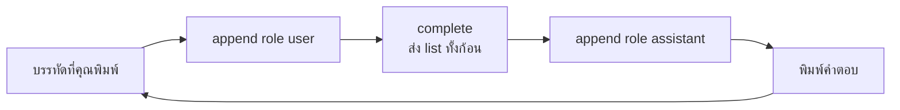

[Read in English](README.md)

# บทที่ 02 conversation loop

ในบทที่ 01 คุณเขียนฟังก์ชันที่ส่ง prompt หนึ่งอันไปให้ model แล้วพิมพ์คำตอบหนึ่งอันออกมา นั่นเป็นโปรแกรมที่ทำงานได้จริง และมันก็เป็นทางตันด้วย ในบทนี้คุณจะเปลี่ยนฟังก์ชันยิงครั้งเดียวจบให้กลายเป็นสิ่งที่สนทนาต่อเนื่องได้ และคุณจะได้เรียนรู้ข้อเท็จจริงหนึ่งข้อที่อธิบายพฤติกรรมแปลก ๆ เกือบทั้งหมดของ AI agent นั่นคือ model ไม่มีความจำ

เมื่อจบบทนี้ คุณจะมีโปรแกรมแชทบน terminal ที่คุยด้วยได้จริง และคุณจะเข้าใจอย่างชัดเจนว่ามีอะไรถูกส่งผ่าน network ทุกครั้งที่คุณกด Enter

---

## 1. ปัญหาที่ค้างมาจากบทที่ 01

นี่คือบทที่ 01 ในรูปแบบที่ง่ายที่สุด หนึ่งฟังก์ชัน หนึ่ง prompt หนึ่งคำตอบ

```python
# lesson 01, roughly
from llm import ask

reply = ask("My cat is called Miso.")
print(reply)
```

รันดูแล้ว model จะพูดอะไรน่ารัก ๆ เกี่ยวกับ Miso ดูเหมือนมันเข้าใจ ทีนี้ลองถามคำถามต่อเนื่องด้วยการเรียกฟังก์ชันเดิมอีกครั้ง

```python
reply = ask("My cat is called Miso.")
print(reply)

reply = ask("What is my cat called?")
print(reply)
```

นี่คือสิ่งที่เกิดขึ้นจริงใน terminal

```text
$ python lesson01_demo.py
Miso is a lovely name for a cat. Is Miso a kitten or a full grown cat?

I do not have any information about your cat. If you tell me your cat's
name, I would be happy to use it.
```

คำตอบที่สองไม่ใช่ bug ในโค้ดของคุณ และไม่ใช่ model ไม่ยอมช่วย ในมุมมองของ model คำถามที่สองโผล่มาจากที่ไหนก็ไม่รู้ มาจากคนแปลกหน้า ไม่มีประวัติอะไรแนบมาเลย มันไม่เคยได้ยินชื่อ Miso มันไม่เคยรู้จักคุณ

ถ้าคุณเคยใช้ ChatGPT หรือ Claude บน browser คุณจะรู้สึกว่ามันผิด เพราะผลิตภัณฑ์พวกนั้นจำสิ่งที่คุณพูดเมื่อสามสิบวินาทีก่อนได้ชัดเจน มันจำได้เพราะตัวผลิตภัณฑ์ทำงานเพิ่มให้คุณอยู่เบื้องหลัง งานเพิ่มนั้นคือเนื้อหาของบทนี้ และมันไม่ได้วิเศษอย่างที่เห็นเลย

---

## 2. ทำไม model ถึงไม่มีความจำเลยแม้แต่นิดเดียว

### เกิดอะไรขึ้น

การเรียก LLM API เป็น pure function ข้อความเข้าไป ข้อความออกมา ไม่มีอะไรถูกเก็บไว้บน server ระหว่างการเรียกแต่ละครั้ง ไม่มี session ไม่มี user record ไม่มีกระดาษทดที่รอดจาก request หนึ่งไปยัง request ถัดไป การเรียกสองครั้งที่ห่างกันหนึ่งวินาที ไม่ต่างอะไรจากการเรียกสองครั้งที่ห่างกันหนึ่งปีจากคนสองคน

ตอนที่คุณเรียก `ask("What is my cat called?")` จักรวาลทั้งหมดที่ model มีคือหกคำนั้น มันตอบได้ดีเท่าที่ใครก็ตามจะตอบได้

### ทำไมเราถึงสนใจ

เพราะมันแปลว่าทางแก้อยู่ฝั่งเราทั้งหมด ถ้าเราอยากให้ model รู้เรื่อง Miso ตอนที่เราถามคำถามต่อเนื่อง เราต้องใส่ส่วนที่พูดถึง Miso เข้าไปใน request ที่สองด้วยตัวเอง แค่นั้น นั่นคือทั้งหมดของเคล็ดลับนี้

```python
# The second call, done properly
reply = complete([
    {"role": "user", "content": "My cat is called Miso."},
    {"role": "assistant", "content": "Miso is a lovely name for a cat."},
    {"role": "user", "content": "What is my cat called?"},
])
print(reply)
```

```text
$ python lesson02_demo.py
Your cat is called Miso.
```

สังเกตสิ่งที่เราทำ เราบอก model ว่ามันเคยพูดอะไรไว้ก่อนหน้านี้ model ไม่ได้นึกออกเอง เราเตือนมันผ่าน request แล้วมันก็อ่านคำเตือนนั้นเหมือนข้อความ input อื่น ๆ ภาพลวงตาของความจำเกิดขึ้นจากการส่งบทสนทนาทั้งหมดซ้ำในทุกการเรียกล้วน ๆ ไม่มีอะไรมากกว่านั้น เมื่อคุณเห็น chatbot จำชื่อคุณได้ แปลว่ามีโปรแกรมบางตัวกำลังวางชื่อคุณกลับเข้าไปใน request อีกครั้ง

### ทำไมต้องเป็นแบบนี้ ไม่ใช่แบบอื่น

คุณอาจถามอย่างสมเหตุสมผลว่าทำไม API ถึงไม่เก็บบทสนทนาให้เราแล้วส่ง conversation id กลับมา ผลิตภัณฑ์บางตัวมีบริการแบบนั้นให้เพิ่ม แต่ building block ดิบทำงานแบบนี้ด้วยเหตุผลที่ดี และการเข้าใจ building block ดิบคือหัวใจของคอร์สนี้

- server ไม่เก็บ state ทำให้ scale ได้ถูก และ route request ของคุณไปเครื่องไหนก็ได้ใน data centre
- คุณควบคุมประวัติสนทนาได้เต็มที่ คุณจะแก้ ตัด เล่นซ้ำ บันทึกลง disk หรือปลอมบางส่วนขึ้นมาก็ได้ ในบทที่ 03 คุณจะได้ปลอมบางส่วนของมันแน่นอน และทำได้ก็เพราะประวัติอยู่ใน process ของคุณ ไม่ใช่ของเขา
- การ debug ตรงไปตรงมา อะไรที่คุณเห็นใน list ของคุณ คือสิ่งที่ model เห็นเป๊ะ ๆ ไม่มี state ซ่อนอยู่ให้โทษ

ข้อสุดท้ายฟังดูเล็กจนกว่าคุณจะเสียมันไป มีทีมหนึ่งใช้ API ที่เก็บ thread ไว้ฝั่ง server และเสียเวลาทั้งวันกับ assistant ที่ยกข้อความจากเอกสารที่ผู้ใช้ลบไปแล้วสองสัปดาห์ โค้ดของทีมไม่มีสำเนาของ thread นั้นเลย ทางเดียวที่จะรู้ว่า model กำลังอ่านอะไรอยู่คือถาม model และมันตอบมั่นใจเท่ากันทั้งสองแบบ ถ้าประวัติอยู่ใน process ของคุณ คุณพิมพ์มันออกมาแล้วเรื่องก็จบใน 10 วินาที

### คุณต้องจ่ายอะไร

การไม่เก็บ state ไม่ได้ฟรี และนี่คือส่วนที่มือใหม่มักได้เรียนรู้แบบเจ็บตัว

request โตขึ้นทุกรอบ รอบแรกส่งหนึ่ง message รอบที่สองส่งสาม message รอบที่สิบส่งสิบเก้า message คุณกำลัง upload บทสนทนาทั้งหมดตั้งแต่ต้นใหม่ทุกครั้งที่คุณพูดอะไรสักอย่าง

ผลตามมามีสองอย่าง และทั้งคู่แย่ลงเรื่อย ๆ ยิ่งคุยนาน

- **ค่าใช้จ่าย** provider คิดเงินต่อ token และ input token ถูกนับทุกครั้งที่เรียก บทสนทนายี่สิบรอบไม่ได้มีค่าใช้จ่ายเท่ากับยี่สิบหน่วย พูดคร่าว ๆ คือมันเท่ากับผลรวมของอนุกรมที่โตขึ้น เพราะรอบที่ยี่สิบต้องจ่ายค่ารอบที่หนึ่งถึงสิบเก้าซ้ำอีกที การแชทยาว ๆ อาจแพงกว่าการแชทสั้น ๆ ยี่สิบครั้งแยกกันที่มีจำนวนคำเท่ากันมาก
- **ความเร็ว** model ต้องอ่าน input ทั้งหมดก่อนจะเขียนคำแรกของ output input ยิ่งเยอะ ยิ่งรอนานกว่าจะมีอะไรขึ้นจอ คุณจะรู้สึกได้ว่าแชทของคุณอืดลงเมื่อประวัติสนทนายาวขึ้น

เราจะสร้างเวอร์ชันไร้เดียงสานี้อยู่ดี เพราะคุณแก้ปัญหาที่ยังไม่เคยรู้สึกไม่ได้ หัวข้อ 6 จะพูดถึงเรื่องนี้เพิ่มเติม

---

## 3. message list และ role ทั้งสี่แบบ

การเรียกแบบไม่มี state ต้องการรูปแบบสำหรับบอกว่า นี่คือบทสนทนาทั้งหมดจนถึงตอนนี้ รูปแบบนั้นคือ list ของ message object แต่ละ message เป็น dictionary เล็ก ๆ ที่มี `role` และ `content`

```json
[
  {"role": "system",    "content": "You are a terse assistant."},
  {"role": "user",      "content": "My cat is called Miso."},
  {"role": "assistant", "content": "Noted."},
  {"role": "user",      "content": "What is my cat called?"}
]
```

ลำดับสำคัญ list ถูกอ่านจากบนลงล่างเหมือนบันทึกการสนทนา หน้าที่ของ model ทุกครั้งคือดูบันทึกนั้นแล้วสร้าง assistant message อันถัดไป

ในคอร์สนี้คุณจะเจอ role อยู่สี่แบบ

### system role

คำสั่งประจำที่มีผลกับทั้งบทสนทนา น้ำเสียง บุคลิก กฎ รูปแบบ output และสิ่งที่ assistant ปฏิเสธได้ ปกติมันจะอยู่อันแรกใน list และอยู่ตรงนั้นตลอดอายุของบทสนทนา

ใช้มันกับสิ่งที่เป็นจริงในทุกรอบ อย่าใช้กับคำถามปัจจุบัน วิธีทดสอบคร่าว ๆ คือดูว่าประโยคนั้นยังสมเหตุสมผลอยู่ไหมในรอบที่ห้าสิบ ประโยคว่า "You are a helpful Python tutor" ยังใช้ได้ ส่วน "Explain decorators" ใช้ไม่ได้ และควรอยู่ใน user message

มีคนอ่านเอาคำถามเปิดของตัวเองใส่ไว้ใน system message เพราะรู้สึกว่ามันคือการตั้งค่า อีกเก้ารอบต่อมาเขาถามเรื่อง list comprehension แล้วได้ย่อหน้าเรื่อง decorator ห่อคำตอบมาด้วย คำสั่งนั้นไม่เคยหายไปไหน เพราะ system message ถูกส่งซ้ำไปทั้งก้อนทุกครั้งที่เรียก และ model ก็ทำตามที่สั่งครบทั้งเก้าครั้ง

`chat.py` ของเรายังไม่ใส่ system message ซึ่งเป็นความตั้งใจ เพื่อให้คุณเห็นกลไกเปล่า ๆ ก่อน การเพิ่มมันเข้าไปคือแบบฝึกหัดข้อแรกท้ายบทนี้

### user role

อะไรก็ตามที่มาจากมนุษย์ ในโปรแกรมของเรานี่คือสิ่งที่ถูกพิมพ์ที่ prompt

ต่อไปในคอร์สนี้มันจะบรรจุสิ่งที่มาจากภายนอก model ด้วย เช่นเนื้อหาของไฟล์ที่คุณวางเข้ามา หลักคิดคร่าว ๆ คือ user role หมายถึง input ที่มาจากโลกภายนอก ไม่ได้แปลตรงตัวว่าการกดแป้นพิมพ์ของคน

### assistant role

สิ่งที่ model พูด เมื่อ API คืนคำตอบมา คำตอบนั้นคือ assistant message และคุณต้องใส่มันกลับเข้าไปใน list เพื่อให้การเรียกครั้งถัดไปมองเห็นมัน

ตรงนี้ควรจ้องดูสักครู่ เพราะเป็นส่วนที่มือใหม่มักข้าม list ไม่ใช่บันทึกสิ่งที่มนุษย์พิมพ์ แต่เป็นบันทึกของทั้งสองฝ่าย ถ้าคุณ append เฉพาะ user message model จะเห็นบทพูดคนเดียวแปลก ๆ ที่มีแต่คำถามไม่มีคำตอบ และมันจะทำตัวแย่ มักจะพูดคำตอบเดิมซ้ำ หรือหลงลืมสิ่งที่ตัวเองรับปากไว้

### tool role

tool message บรรจุผลลัพธ์ของ tool ที่ model ขอให้รัน model บอกว่าให้เรียก `read_file` ด้วย path นี้ โค้ดของคุณรันมัน แล้วคุณส่ง output กลับไปเป็น message ที่มี role เป็น `tool`

คุณจะยังไม่ได้ใช้มันจนกว่าจะถึงบทที่ 04 และ `chat.py` ก็ไม่เคยสร้างมันขึ้นมาเลย แต่ควรรู้ไว้ตอนนี้ด้วยเหตุผลสองข้อ ข้อแรก มันบอกคุณว่าคอร์สนี้กำลังมุ่งไปทางไหน ในเชิงกลไกแล้ว agent ก็คือ chat loop ที่มี tool message อยู่ข้างใน ข้อสอง `check.py` ในโฟลเดอร์นี้ใช้มันอยู่แล้วเพื่อพิสูจน์ประเด็นหนึ่ง และคุณควรอ่านไฟล์นั้นได้ หน้าตาของมันเป็นแบบนี้

```json
{"role": "tool", "tool_call_id": "call_mock_1", "content": "42"}
```

field เพิ่มเติมชื่อ `tool_call_id` ผูกผลลัพธ์กลับไปยัง request เฉพาะอันที่ model ขอมา เพราะ model สามารถขอใช้ tool หลายตัวพร้อมกันได้ `check.py` ปลอม message แบบนั้นขึ้นมาโดยมี content เป็น `42` และไม่มี tool จริงอยู่เบื้องหลัง จากนั้นตรวจว่าคำตอบถัดไปของ model พูดถึง `42` หรือไม่ ถ้าพูดถึง แปลว่าประวัติสนทนาเดินทางข้าม network ไปจริง ถ้าไม่ แปลว่าประวัติของคุณไม่ได้ถูกส่งไป และเนื้อหาที่เหลือของบทนี้จะใช้ไม่ได้

---

## 4. เขียน complete และ chat ทีละบรรทัด

มีสองไฟล์ `llm.py` คุยกับ network ส่วน `chat.py` รัน loop การแยกทั้งสองออกจากกันเป็นเรื่องสำคัญ เพราะทุกบทถัดไปจะใช้ `complete` ซ้ำโดยไม่แก้ และมีแต่ loop เท่านั้นที่โตขึ้น

### llm.py คือบทที่ 01 ที่ถูกทำให้ทั่วไปขึ้น

```python
"""The same call as lesson 01, but taking a whole conversation.

A model has no memory. The only reason it appears to remember anything is
that we send the entire conversation again on every single call.
"""
import os

import httpx


def complete(messages):
    """Send a list of messages and return the assistant reply as a string."""
    base_url = os.environ["AGENTPATH_BASE_URL"].rstrip("/")
    api_key = os.environ.get("AGENTPATH_API_KEY", "")
    model = os.environ["AGENTPATH_MODEL"]

    headers = {"Content-Type": "application/json"}
    if api_key:
        headers["Authorization"] = f"Bearer {api_key}"

    response = httpx.post(
        f"{base_url}/chat/completions",
        json={"model": model, "messages": messages},
        headers=headers,
        timeout=120,
    )
    response.raise_for_status()
    return response.json()["choices"][0]["message"]["content"]
```

นี่คือฟังก์ชันของบทที่ 01 ที่เปลี่ยนแนวคิดไปเพียงข้อเดียว ในบทที่ 01 ฟังก์ชันชื่อ `ask` พารามิเตอร์ของมันคือ prompt ที่เป็น string และมันห่อ string นั้นเป็น list หนึ่งสมาชิกภายในด้วย `"messages": [{"role": "user", "content": prompt}]` ส่วนที่นี่พารามิเตอร์คือ list เอง และผู้เรียกเป็นเจ้าของ list นั้น ชื่อจึงเปลี่ยนเป็น `complete` เพื่อสะท้อนงานใหม่ การเปลี่ยนแค่จุดเดียวนี้แหละที่ทำให้บทสนทนาหลายรอบเป็นไปได้ ส่วนที่เหลือในไฟล์คือท่อเดิมที่คุณเคยเห็นแล้ว

ไล่ดูอย่างช้า ๆ

- **environment variable ทั้งสามตัว** (ตัวแปรสภาพแวดล้อม คือค่าที่ตั้งไว้ใน shell) `AGENTPATH_BASE_URL` คือที่อยู่ของ API ที่คุณคุยด้วย `AGENTPATH_MODEL` คือ model ที่จะใช้ และ `AGENTPATH_API_KEY` คือ credential ของคุณ ทั้งหมดถูกอ่านจาก environment แทนที่จะเขียนไว้ในไฟล์ เพื่อให้คุณชี้คอร์สนี้ไปที่ provider แบบเสียเงิน แบบฟรี หรือ model ที่รันบนเครื่องของคุณเองได้โดยไม่ต้องแก้โค้ด อีกอย่าง key ที่อยู่ในไฟล์ source มักจบลงใน git history ซึ่งเป็นวันที่แย่ของใครสักคน
- **`os.environ["..."]` เทียบกับ `os.environ.get("...", "")`** แบบวงเล็บเหลี่ยมจะโยน `KeyError` ทันทีถ้าตัวแปรหายไป ซึ่งเป็นสิ่งที่คุณต้องการสำหรับ URL และ model เพราะไม่มีค่า default ที่สมเหตุสมผล และการ crash แบบชัดเจนดีกว่า 404 ที่ชวนงง ส่วนแบบ `.get` จะคืน string ว่างแทน เพราะ model server แบบ local มักไม่ต้องใช้ key เลย
- **`.rstrip("/")`** ถ้าคุณตั้ง base URL โดยมี slash ต่อท้าย คุณจะได้ที่อยู่ที่มี slash สองอัน server บางตัวยอมรับได้ บางตัวคืน 404 การตัดมันออกช่วยกำจัดปัญหาการ debug ที่ไร้สาระไปทั้งกลุ่ม
- **header `Authorization` ที่ใส่เฉพาะเมื่อมี key** การส่ง header `Bearer` เปล่า ๆ ทำให้ server บางตัวสับสนยิ่งกว่าการไม่ส่ง header เลย
- **`json={"model": model, "messages": messages}`** นี่คือ request body จริง ๆ `httpx` แปลง dictionary เป็น JSON และตั้งค่า content type บทสนทนาทั้งหมดอยู่ในนั้นทุกครั้ง
- **`timeout=120`** ค่า default ของ `httpx` คือยอมแพ้หลังห้าวินาที model ที่กำลังคิดเกี่ยวกับบทสนทนายาว ๆ ใช้เวลานานกว่านั้นได้ง่าย ๆ และความล้มเหลวจะดูเหมือน network error แทนที่จะเป็นสิ่งที่มันเป็นจริง สองนาทีเผื่อไว้มากพอที่จะเลี่ยงความสับสนนี้
- **`response.raise_for_status()`** เปลี่ยน HTTP error ให้เป็น exception ของ Python ถ้าไม่มีมัน 401 จาก key ผิดจะไหลไปบรรทัดถัดไป แล้วคุณจะได้ `KeyError` เรื่อง `choices` ที่ชวนงง แทนที่จะถูกบอกว่า key ของคุณผิด
- **`response.json()["choices"][0]["message"]["content"]`** เป็นการขุดข้อความออกมาจากซองของ response `choices` เป็น list เพราะ API ถูกขอให้สร้างคำตอบทางเลือกหลายอันได้ และเราต้องการอันแรกเสมอ response เต็ม ๆ หน้าตาแบบนี้

```json
{
  "id": "chatcmpl-8xQk2",
  "object": "chat.completion",
  "created": 1730900000,
  "model": "your-model-name",
  "choices": [
    {
      "index": 0,
      "message": {"role": "assistant", "content": "Your cat is called Miso."},
      "finish_reason": "stop"
    }
  ],
  "usage": {"prompt_tokens": 38, "completion_tokens": 7, "total_tokens": 45}
}
```

มีสอง field ในนั้นที่ควรจดจำไว้ ถึงแม้เรายังไม่ได้ใช้ `finish_reason` บอกว่าทำไม model ถึงหยุด และในบทที่ 03 ค่า `tool_calls` จะกลายเป็นสัญญาณว่า model ต้องการใช้ tool ส่วน `usage` คือจุดที่ค่าใช้จ่ายที่โตขึ้นจากหัวข้อ 2 มองเห็นได้ เพราะ `prompt_tokens` คือสิ่งที่คุณจ่ายให้กับประวัติสนทนา และมันไต่ขึ้นทุกรอบ

### chat.py คือ loop

```python
"""A terminal chat that keeps the conversation in a plain list."""
from llm import complete


def main():
    messages = []
    print("Type a message. Press Ctrl+C to leave.")
    while True:
        try:
            user_input = input("\nyou> ")
        except (EOFError, KeyboardInterrupt):
            print()
            return
        if not user_input.strip():
            continue
        messages.append({"role": "user", "content": user_input})
        reply = complete(messages)
        messages.append({"role": "assistant", "content": reply})
        print(f"\nbot> {reply}")


if __name__ == "__main__":
    main()
```

ไล่ทีละบรรทัด

- `messages = []` คือความจำทั้งหมดของโปรแกรมคุณ ไม่ใช่ database ไม่ใช่ class ไม่ใช่ framework เป็น list ของ Python หนึ่งอันที่มีอายุเท่ากับ process เมื่อคุณปิดโปรแกรม บทสนทนาก็หายไป นั่นคือสภาพความจริง และการแกล้งทำเป็นอย่างอื่นจะบังกลไกเอาไว้
- `while True` คือ loop อ่าน ส่ง พิมพ์ วนซ้ำ
- `input("\nyou> ")` จะหยุดรอจนคุณกด Enter ขึ้นบรรทัดใหม่ข้างหน้ามีไว้เพื่อให้บันทึกการสนทนาอ่านง่ายเท่านั้น
- บล็อก `try` ดักจับ `EOFError` และ `KeyboardInterrupt` โดย `KeyboardInterrupt` คือ Ctrl+C ส่วน `EOFError` คือ Ctrl+D บน macOS หรือ Linux และ Ctrl+Z ตามด้วย Enter บน Windows และมันยังทำงานเมื่อ input ถูก pipe มาจากไฟล์แล้วไฟล์จบลง ถ้าไม่มีส่วนนี้ การออกจากโปรแกรมจะพิมพ์ traceback น่าเกลียดสำหรับสิ่งที่เป็นการกระทำปกติมาก
- `if not user_input.strip(): continue` ข้ามบรรทัดว่าง การเผลอกด Enter ไม่ควรทำให้คุณเสียค่าเรียก API
- `messages.append({"role": "user", "content": user_input})` ใส่บรรทัดของคุณลงในบันทึกก่อนจะเรียก เพื่อให้ request รวมมันไปด้วย
- `reply = complete(messages)` ส่ง list ทั้งก้อน ทุกอย่างตั้งแต่ต้น session ไม่ใช่แค่บรรทัดล่าสุด
- `messages.append({"role": "assistant", "content": reply})` คือบรรทัดที่ต้องเข้าใจ



### ทำไมคำตอบของ assistant ต้องถูก append กลับเข้าไป

API คืนคำตอบให้คุณเป็น string แล้วลืมมันทิ้งไปโดยสิ้นเชิง ถ้าคุณพิมพ์มันออกมาโดยไม่เก็บไว้ มันจะหายไปตลอดกาลในมุมมองของ model เพราะ request ครั้งถัดไปถูกสร้างจาก list ของคุณ และ list ของคุณไม่มีมันอยู่

นี่คือความล้มเหลวแบบเป็นรูปธรรม ลบบรรทัด append นั้นทิ้ง แล้วลองสนทนาแบบนี้

```text
you> My cat is called Miso.
bot> Miso is a lovely name. Is Miso a kitten or a full grown cat?

you> A kitten.
bot> That is nice. What would you like to know?
```

request ที่สองมีแค่ user message สองอันและไม่มี assistant message เลย บันทึกการสนทนาที่ model ได้รับจึงอ่านออกมาเป็นสองประโยคที่ไม่เกี่ยวกัน โดยไม่มีคำถามคั่นกลาง คำว่า "A kitten" คือคำตอบของคำถามที่ model มองไม่เห็นว่าตัวเองเคยถาม เมื่อใส่บรรทัด append กลับเข้าไป model จะเห็นคำถามของตัวเองวางอยู่เหนือคำตอบของคุณพอดี แล้วมันก็สนทนาต่อได้ตามปกติ

กฎก็คือทั้งสองฝั่งของบทสนทนาต้องอยู่ใน list บันทึกที่คุณส่งไปต้องเป็นบันทึกที่ซื่อตรงต่อสิ่งที่เกิดขึ้นจริง เพราะมันคือบันทึกเพียงอย่างเดียวที่มีอยู่

---

## 5. รันแชทและดู list โตขึ้น

เริ่มด้วยการตั้ง environment variable ทั้งสามตัว บน macOS หรือ Linux ด้วย bash

```bash
export AGENTPATH_BASE_URL="https://api.example-provider.com/v1"
export AGENTPATH_API_KEY="sk-your-key-here"
export AGENTPATH_MODEL="your-model-name"
```

บน Windows ด้วย PowerShell

```powershell
$env:AGENTPATH_BASE_URL = "https://api.example-provider.com/v1"
$env:AGENTPATH_API_KEY  = "sk-your-key-here"
$env:AGENTPATH_MODEL    = "your-model-name"
```

ทีนี้รันสคริปต์ตรวจสอบ ซึ่งยืนยันทั้งว่า credential ของคุณใช้ได้ และประวัติสนทนาเดินทางไปจริง

```text
$ python check.py
OK the whole conversation travels on every call
```

ถ้าคุณเห็นอย่างใดอย่างหนึ่งข้างล่างนี้แทน ให้หยุดและแก้ก่อนไปต่อ

```text
$ python check.py
FAIL the first reply was empty
```

```text
$ python check.py
FAIL history was not sent back. Reply was 'I do not have that information.'
```

อันแรกแปลว่า model คืน string ว่างกลับมา ซึ่ง gateway บางตัวทำแบบนั้นกับ model ที่โหลดแล้วแต่ไม่ตอบ ส่วนชื่อ model ที่ไม่มีอยู่จริงจะได้ 400 จาก `raise_for_status` แทน อันที่สองแปลว่า model ไม่ได้เห็น tool message ปลอมที่บรรจุ `42` ซึ่งชี้ไปที่ proxy หรือ gateway ระหว่างคุณกับ model ที่กำลังทิ้งหรือเขียนประวัติสนทนาใหม่

ทีนี้มาที่ตัวแชทเอง

```text
$ python chat.py
Type a message. Press Ctrl+C to leave.

you> My cat is called Miso.

bot> Miso is a great name. Is Miso a kitten or a full grown cat?

you> A kitten, about four months old.

bot> Four months is a fun age. Miso is probably very fast and sleeping
about sixteen hours a day. Is this your first cat?

you> Yes. What was her name again?

bot> Her name is Miso.

you>
$
```

การโต้ตอบครั้งสุดท้ายนั้นคือทั้งบทเรียนนี้ที่ทำงานได้จริง model ตอบคำถามเกี่ยวกับสิ่งที่พูดไว้เมื่อสามรอบก่อน และมันทำได้โดยไม่มีความจำใด ๆ เลย ล้วน ๆ เพราะ list ของคุณพาข้อมูลนั้นกลับไปให้มัน

### หน้าตาจริงของ list

หลังจากสามรอบนั้น `messages` เก็บ dictionary อยู่หกอัน ถ้าคุณเพิ่ม `print(messages)` ท้าย loop หรือดีกว่านั้นคือ `import json` แล้ว `print(json.dumps(messages, indent=2))` คุณจะเห็นแบบนี้

```json
[
  {
    "role": "user",
    "content": "My cat is called Miso."
  },
  {
    "role": "assistant",
    "content": "Miso is a great name. Is Miso a kitten or a full grown cat?"
  },
  {
    "role": "user",
    "content": "A kitten, about four months old."
  },
  {
    "role": "assistant",
    "content": "Four months is a fun age. Miso is probably very fast and sleeping about sixteen hours a day. Is this your first cat?"
  },
  {
    "role": "user",
    "content": "Yes. What was her name again?"
  },
  {
    "role": "assistant",
    "content": "Her name is Miso."
  }
]
```

มานับกันว่าอะไรถูกส่งผ่านสายไปบ้าง

| รอบ | message ที่ส่งไป | message ที่ได้รับ | รวมใน list หลังจากนั้น |
|------|---------------|-------------------|---------------------|
| 1    | 1             | 1                 | 2                   |
| 2    | 3             | 1                 | 4                   |
| 3    | 5             | 1                 | 6                   |

user message อันแรกถูก upload ไปสามครั้ง พอถึงรอบที่สิบมันจะถูก upload ไปแล้วสิบครั้ง ไม่มีอะไรผิดในโค้ดเลย นี่เป็นเพียงความหมายของ API แบบไม่มี state ในทางปฏิบัติ และเป็นเหตุผลที่หัวข้อ 6 มีอยู่

---

## 6. ทำไมสุดท้ายมันจะพัง

โปรแกรมที่คุณเพิ่งเขียนมี list ที่ไม่มีขอบเขตอยู่ข้างใน และคำว่าไม่มีขอบเขตควรทำให้คุณกังวล

มีกำแพงสองอันรออยู่

กำแพงแรกคือ context window (ข้อความมากสุดที่ model อ่านได้ในหนึ่งครั้ง) ทุก model อ่านข้อความได้จำนวนจำกัดในหนึ่ง request วัดเป็น token หนึ่ง token ประมาณสามในสี่ของหนึ่งคำในภาษาอังกฤษ ขึ้นอยู่กับ model ขีดจำกัดอาจเป็นแปดพัน token หรือสองแสน token แต่ยังไงก็มีขีดจำกัดเสมอ ข้ามเส้นไปแล้วมันไม่ค่อย ๆ แย่ลงให้ คุณได้ error เลย

```text
you> and what about the other thing we discussed?
Traceback (most recent call last):
  ...
httpx.HTTPStatusError: Client error '400 Bad Request' for url '.../chat/completions'
```

```json
{
  "error": {
    "message": "This model's maximum context length is 8192 tokens. However, your messages resulted in 9134 tokens. Please reduce the length of the messages.",
    "type": "invalid_request_error",
    "code": "context_length_exceeded"
  }
}
```

แชทของคุณทำงานได้ดี ทำงานได้ดี ทำงานได้ดี แล้วจู่ ๆ ในรอบที่คาดเดาไม่ได้รอบหนึ่งมันก็หยุดทำงานตลอดกาล เพราะ request ทุกอันหลังจากนั้นก็ยาวเกินไปเช่นกัน เมื่อคุณข้ามเส้นไปแล้ว คุณกระทั่งขอโทษผู้ใช้ผ่าน model ก็ยังไม่ได้

กำแพงที่สองคือค่าใช้จ่าย นานก่อนที่คุณจะไปถึงกำแพงแรก คุณกำลังจ่ายค่า message ยุคแรก ๆ เดิม ๆ ซ้ำแล้วซ้ำอีก บทสนทนาร้อยรอบส่งรอบที่หนึ่งซ้ำร้อยครั้ง ในซองของ response ข้างบน ลองดู `prompt_tokens` ไต่ขึ้นในขณะที่ `completion_tokens` แทบจะคงที่ ช่องว่างนั้นคือเงินของคุณ

ลองใส่ตัวเลขดู บทสนทนาสี่สิบรอบที่แต่ละฝ่ายเขียนราว 150 token จะจบลงด้วย request ขนาดราว 12000 token และรวมทั้งสี่สิบครั้งเป็น input ราว 240000 token เพื่อแลกกับ output จริง 6000 token ถ้าถามสี่สิบคำถามเดิมใน session ใหม่สี่สิบครั้ง input รวมจะอยู่ราว 6000 token input มากกว่าเดิมสี่สิบเท่าคือราคาที่จ่ายเพื่อให้ model จำอะไรได้

เรายังไม่แก้เรื่องนี้ และนั่นเป็นความตั้งใจ ส่วนที่ 3 ของคอร์สนี้จะจัดการมันอย่างเหมาะสม ในบทว่าด้วย context management และ token economy ซึ่งคุณจะได้สร้างกลยุทธ์การตัด การสรุป และการตัดแต่ง และเรียนรู้ว่าเมื่อไหร่ควรใช้อันไหน ทุกกลยุทธ์เหล่านั้นเกี่ยวข้องกับการตัดสินใจว่าจะทิ้งอะไร และคุณตัดสินใจแบบนั้นได้ดีไม่ได้ จนกว่าคุณจะมี agent จริง ๆ ที่คุณเข้าใจบันทึกการสนทนาของมัน การเอากฎการตัดข้อความมาแปะไว้กับบทที่ 02 จะสอนโค้ดให้คุณหนึ่งบรรทัดแล้วบังปัญหาจริงเอาไว้

กฎที่นึกออกง่ายที่สุดคือกฎที่เจ็บที่สุด มีทีมหนึ่งส่ง `messages[-10:]` ขึ้น production แล้วมันทำงานดีอยู่หนึ่งสัปดาห์ จนวันหนึ่ง agent ที่ถูกตั้ง path ของ workspace ไว้ตั้งแต่รอบที่สอง เริ่มเขียนไฟล์ลงผิด directory ในรอบที่สามสิบ การเก็บสิบ message ล่าสุดไม่ใช่นโยบายความจำ มันคือคำสัญญาว่าไม่มีอะไรที่พูดไว้ตอนต้นสำคัญอีกแล้ว และบทสนทนาจริงเกือบทุกอันผิดคำสัญญานั้นสักจุดหนึ่ง

สำหรับตอนนี้ ถ้าบทสนทนายาวเกินไป ให้เริ่มโปรแกรมใหม่ ลองรู้สึกถึงความรำคาญนั้น มันคือแรงจูงใจของส่วนที่ 3

---

## 7. สิ่งที่คุณยังทำไม่ได้

ลองสนทนาแบบนี้กับโปรแกรมที่คุณเพิ่งสร้าง

```text
you> What is in the file notes.txt in this folder?

bot> I am not able to read files from your computer. If you paste the
contents of notes.txt here, I would be happy to help with it.

you> How much disk space is free on this machine?

bot> I cannot check your system. You can find out by running df -h on
macOS or Linux, or by opening This PC on Windows.

you> What is the top story on the news right now?

bot> I do not have access to live information, so I cannot tell you
today's news. My knowledge comes from training data with a cutoff date.
```

ไม่มีอะไรพัง model กำลังบอกความจริงเกี่ยวกับตัวมันเอง

LLM ผลิตข้อความ นั่นคือความสามารถทั้งหมดของมัน มันอ่านไฟล์ไม่ได้ รันคำสั่งไม่ได้ เรียก API ไม่ได้ query database ไม่ได้ ดูหน้าเว็บไม่ได้ และดูเวลาก็ไม่ได้ ทุกข้อเท็จจริงที่มันดูเหมือนจะรู้ มาจาก training data ซึ่งถูกแช่แข็งไว้ ณ วันใดวันหนึ่งในอดีต หรือมาจาก message ที่คุณใส่ลงใน list ด้วยตัวเอง

ย้อนกลับไปดู `chat.py` แล้วคุณจะเห็นว่าไม่มีที่ให้ความสามารถแบบนั้นไปอยู่เลย loop อ่าน string ส่ง list พิมพ์ string ไม่มีจุดไหนในนั้นที่คอมพิวเตอร์ของคุณทำอะไรแทน model

ช่องว่างนั้นแหละคือความต่างระหว่าง chatbot กับ agent และเป็นสิ่งที่บทที่ 03 และ 04 จะปิดมันลง คุณจะอธิบายฟังก์ชันบางตัวให้ model ฟัง ปล่อยให้มันบอกว่าให้รันอันนี้ด้วย argument เหล่านี้ แล้วรันมันจริง ๆ ใน Python process ของคุณเอง และส่งผลลัพธ์กลับไปเป็น message ที่มี role เป็น `tool` อันเดียวกับที่อยู่ในหัวข้อ 3 ที่คุณเห็นเวอร์ชันปลอมของมันใน `check.py` มาแล้ว message list ที่คุณสร้างที่นี่คือพาหนะของทั้งหมดนั้น โดยไม่ต้องแก้อะไรเลย

---

## แบบฝึกหัด

1. **เพิ่ม system message** เริ่ม `messages` ด้วยรายการ system เช่น `{"role": "system", "content": "You are a terse assistant. Answer in one sentence."}` แล้วดูว่าทั้งบทสนทนาเปลี่ยนไปอย่างไร จากนั้นย้ายมันไปไว้ท้าย list แทนที่จะเป็นต้น list แล้วดูว่า model ยังทำตามอยู่หรือไม่
2. **พิมพ์สิ่งที่ส่งผ่านสาย** เพิ่ม `print(json.dumps(messages, indent=2))` ไว้ก่อนการเรียก `complete` แล้วสนทนาห้ารอบ ดู request โตขึ้น
3. **ทำให้พังโดยตั้งใจ** comment บรรทัดที่ append คำตอบของ assistant ออก แล้วถามคำถามต่อเนื่อง ยืนยันความล้มเหลวจากหัวข้อ 4 ด้วยตาตัวเอง แล้วใส่บรรทัดนั้นกลับไป
4. **นับค่าใช้จ่าย** แก้ `complete` ให้คืน response ที่ parse แล้วทั้งก้อนแทนที่จะคืนแค่ content แล้วพิมพ์ `usage` หลังจบแต่ละรอบ วาดกราฟหรือเพียงจดค่า `prompt_tokens` ตลอดสิบรอบ แล้วอธิบายรูปร่างของเส้นโค้ง
5. **บันทึกและกลับมาต่อ** เขียน `messages` ลงไฟล์ JSON ตอนโปรแกรมปิด แล้วโหลดกลับมาตอนเริ่มถ้าไฟล์นั้นมีอยู่ ตอนนี้คุณมีความจำถาวรแล้ว และคุณทำได้โดยที่ model ไม่ได้เปลี่ยนแปลงอะไรเลย ซึ่งนั่นคือประเด็น
