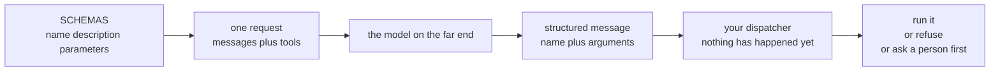

[อ่านภาษาไทย](README.th.md)

# Lesson 03. Tool calling

This is the most important chapter in part one. Everything before it was
plumbing for a chat program. Everything after it builds on the one idea in
this lesson.

By the end you will have sent a function description to a model, watched the
model ask for that function by name with arguments it chose, and run the
function yourself in Python. That last sentence contains the whole lesson,
and the word "yourself" is the part almost everyone gets wrong on the first
try.

Files in this folder.

```text
lessons/03-tool-calling/
  tools.py    two toy tools and the schemas that describe them
  llm.py      the API call, now sending tools and reading tool calls back
  check.py    a script that proves the whole thing works
  README.md   this file
```

## 1. The problem left over from lesson 02

In lesson 02 you built a chat loop. You kept a Python list of messages, you
appended the user turn, you sent the whole list to the model, and you appended
the reply. It felt like the model remembered the conversation. It did not.
The illusion came from you resending the full history on every call.

That program has a hard ceiling, and the ceiling is easy to hit. Ask it this.

```text
you> What is 48213 times 9917?
bot> 478,127,... (a confident number that is often wrong)
```

Or ask it something it cannot possibly know.

```text
you> How many .py files are in this folder?
bot> I do not have access to your file system, so I cannot tell you.
```

Both answers reveal the same limit. A language model produces text. That is
the entire output. It cannot read a file, it cannot open a socket, it cannot
run a multiplication with a calculator, and it cannot check today's date. When
it appears to do arithmetic it is predicting the characters that usually follow
a multiplication sign, which works for small numbers and quietly fails for
large ones.

So the model is a very good text producer trapped in a box with no hands. A
chat program is fine with that. An agent is not. An agent is a program that
takes actions in the world, and actions need hands.

The obvious idea is to give the model access to your computer. That idea is
both impossible and undesirable. Impossible because the model runs on somebody
else's hardware behind an HTTP endpoint and has no route to your disk.
Undesirable because you would be handing arbitrary execution rights to a
system that guesses. What we do instead is the subject of the next section.

## 2. What tool calling really is

Here is the single most common misunderstanding about agents, stated plainly
so you never fall for it.

> The model does not run your code. It never has. It never will. The model
> emits a piece of structured text that names a function and supplies
> arguments. Your Python program reads that text and decides what to do with
> it.

Read it twice. People who have used agent frameworks for months still believe
that "the model called the tool," because the frameworks hide the middle step
so smoothly that it looks like magic. There is no magic. There is a JSON blob
and an `if` statement that you wrote.

### The mechanism, step by step

1. You write an ordinary Python function. Nothing about it is special.
2. You write a description of that function in a format called JSON Schema.
   The description says what the function is named, what it does, and what
   arguments it takes.
3. You send that description along with the conversation in the same HTTP
   request. It rides in a `tools` field next to `messages`.
4. The model reads the conversation and the descriptions. If it decides the
   user's request would be served by one of those functions, it does not
   answer in words. Instead it produces a structured message that says, in
   effect, "I would like `add` to be run with `a` equal to 2 and `b` equal to
   3."
5. That structured message comes back to you over HTTP. It is data. It is
   inert. Nothing has happened yet.
6. Your program looks at the name, looks it up in a dictionary of functions
   you control, and calls it. Or refuses to. Or asks the user first. Or logs
   it and does nothing.

Step 6 is yours. It is the only step that touches the real world, and it lives
entirely in code you wrote and can read.



### Why this design and not another one

You could imagine other designs. A model that returns Python source for you to
`exec`. A model that opens its own network connections. A model with a shell.
All of those exist as experiments, and all of them are worse for the same
reason.

Compare the two shapes.

```text
Shape A, the one nobody should build
  model  ->  "import os; os.system('rm -rf /')"  ->  exec()
  Your program cannot inspect intent before it runs. Parsing arbitrary code
  to decide if it is safe is an unsolved problem.

Shape B, tool calling, the one everybody actually builds
  model  ->  {"name": "add", "arguments": {"a": 2, "b": 3}}  ->  your dispatcher
  Your program sees a name from a list you defined and arguments you can
  validate before anything executes.
```

Shape B gives you a fixed vocabulary. The model can only ask for functions you
chose to advertise. If it invents a name you never registered, your dispatcher
returns an error string and the world is unchanged. You will see exactly that
guard in `tools.py` below.

### This is why an agent can be made safe

Because you own step 6, you own every consequence. The gap between "the model
asked" and "the code ran" is where all safety in agent design lives. In that
gap you can do any of the following.

- Print the request and wait for the user to type yes.
- Check that a file path stays inside the project folder.
- Refuse any shell command that contains a delete.
- Rate limit how many times a tool runs in one turn.
- Log every call so a human can audit what happened afterwards.

None of that is possible if the model executes things directly. All of it is
trivial once execution is a function call in your own program. Part 2 of this
course adds a real file reader and a real shell runner, and it adds a
confirmation prompt in exactly this gap. The safety story is not a feature
bolted on later. It is a consequence of the shape you are learning right now.

A demo built the other way makes the point faster than any argument. Someone
wired a model straight to `exec` and asked it to tidy up a build folder. It
wrote four correct lines and one that resolved `..` one level higher than the
author meant, and eleven minutes of uncommitted work went with it. Nothing in
that program was in a position to look at the string first, because by the time
the string existed it was already running.

One more thing to notice before we look at code. The model choosing to emit a
tool call is still just prediction. It is not a decision in the sense a person
makes decisions. It is the model producing the output that best fits the
conversation plus the tool descriptions it was shown. That is why the wording
of those descriptions turns out to matter enormously, which is section 5.

## 3. Reading a JSON Schema field by field

JSON Schema is a standard way to describe the shape of a JSON value. The
providers borrowed it so that one format could describe function arguments for
every language. You do not need to learn all of JSON Schema. You need about
five keywords, and this lesson uses four of them.

Here is the `add` schema exactly as it appears in `tools.py`.

```python
{
    "type": "function",
    "function": {
        "name": "add",
        "description": "Add two numbers together and return the sum.",
        "parameters": {
            "type": "object",
            "properties": {
                "a": {"type": "number", "description": "The first number"},
                "b": {"type": "number", "description": "The second number"},
            },
            "required": ["a", "b"],
        },
    },
}
```

Now the same thing field by field.

The outer `type` field holds the literal string `function`. Today
that is the only value the OpenAI compatible API accepts here. It exists
because the field is a discriminator, a tag that tells a future parser which
shape follows. Providers add new kinds of tools over time, so the format left
room. Treat it as boilerplate you always write.

`function.name` is the identifier the model will send back when it wants
this tool. It must match the key you use to look up the real Python function.
Stick to letters, digits, and underscores. This string is also read by the
model as a hint, so `add` beats `f1` and `read_file` beats `rf`.

`function.description` is one or two sentences of plain English explaining
what the tool does. Section 5 is entirely about this field, because it does
more work than any other part of the schema.

`function.parameters` is a JSON Schema object describing the arguments. It
is a schema in its own right, which is why it has its own `type` inside it.

`parameters.type` is always the string `object` for a tool. Arguments arrive
as a JSON object with named keys, because Python keyword arguments and JSON
object keys line up neatly. There is no positional argument form.

`parameters.properties` is a dictionary where each key is an argument name
and each value is a small schema for that argument. The names here become the
keyword arguments passed to your Python function, so `a` and `b` in the schema
must match `def add(a, b)` in the code. If they drift apart you get a
`TypeError` at call time, which `tools.run` catches and turns into an error
string.

The `type` inside each property is where you say what kind of value
is allowed. The useful ones are below.

| JSON Schema type | Python value you receive | Use it for |
| --- | --- | --- |
| `"number"` | `float` or `int` | any numeric value including decimals |
| `"integer"` | `int` | counts, indexes, sides on a dice |
| `"string"` | `str` | text, paths, identifiers |
| `"boolean"` | `bool` | flags |
| `"array"` | `list` | a list of values, needs an `items` schema |
| `"object"` | `dict` | nested structures, needs its own `properties` |

Notice that `add` uses `number` while `roll_dice` uses `integer`. That is not
decoration. A dice with 6.5 sides is meaningless, and `random.randint` would
raise on a float. Choosing `integer` makes the constraint part of the contract
the model reads, which means the model is far less likely to send a decimal in
the first place.

The `description` inside each property explains that one argument. The model
reads it when deciding what value to put there. "The first number" is thin but
adequate for a toy. For a real tool you would write something like "Absolute
path to the file to read, relative paths are rejected."

`parameters.required` is a list of argument names that must be present. Any
property not listed here is optional, and the model may leave it out. Your
Python function then needs a default value for it, otherwise you get a
`TypeError`. A good habit is to keep `required` and your function signature in
agreement by reading them side by side whenever you edit either one.

### The exact JSON that goes over the wire

When `check.py` runs, `llm.py` builds this HTTP request body and posts it to
the `/chat/completions` path of your endpoint. This is the real thing, with
both tools included and nothing elided.

```json
{
  "model": "mock",
  "messages": [
    {
      "role": "user",
      "content": "What is 2 plus 3? [[tool:add:{\"a\": 2, \"b\": 3}]]"
    }
  ],
  "tools": [
    {
      "type": "function",
      "function": {
        "name": "add",
        "description": "Add two numbers together and return the sum.",
        "parameters": {
          "type": "object",
          "properties": {
            "a": {"type": "number", "description": "The first number"},
            "b": {"type": "number", "description": "The second number"}
          },
          "required": ["a", "b"]
        }
      }
    },
    {
      "type": "function",
      "function": {
        "name": "roll_dice",
        "description": "Roll a dice with the given number of sides.",
        "parameters": {
          "type": "object",
          "properties": {
            "sides": {
              "type": "integer",
              "description": "How many sides the dice has"
            }
          },
          "required": ["sides"]
        }
      }
    }
  ]
}
```

Two things are worth staring at. First, `tools` sits next to `messages` at the
top level, not inside a message. Second, the schemas are sent again on every
single request. There is no registration step, no session, no server side
memory of your tools. Just like the conversation history in lesson 02, the
tool list travels in full every time. If you stop sending it, the model stops
knowing the tools exist.

## 4. The same mechanism gives you structured output

There is a second feature you will meet soon, in a different tutorial, under a
different name. Providers call it structured output, or JSON mode, or a
response format. It gets its own documentation page, its own helper in every
framework, and its own chapter in most courses, sitting a long way from the
chapter about tools. So people learn it as a separate thing. Two features, two
names, two mental models. That impression is wrong, and it is expensive,
because it makes you learn the same idea twice and carry two sets of code for
it.

Structured output and tool calling are the same mechanism. You have already
built it. What follows is the machinery from section 2 and the schema from
section 3 with exactly one step deleted.

### What structured output means

A model answers in prose by default, and prose is close to useless to the rest
of your program. Ask a model to triage a support ticket and it says something
like "This customer sounds quite frustrated about a late delivery." You cannot
store that in a database column, you cannot branch on it in an `if` statement,
and you cannot count how many tickets were negative this week. Parsing it with
regular expressions works until the model phrases it differently, which it
will.

What you want instead is an answer shaped like data. A JSON object with the
fields you decided on, in the types you decided on, every single time. That is
the whole of what structured output means. You are not asking the model to be
smarter. You are asking it to fill in a form instead of writing an essay.

### A tool call already is structured output

Read the tool call from section 2 again with fresh eyes.

```json
{"name": "add", "arguments": {"a": 2, "b": 3}}
```

The model produced a name and an arguments object that conforms to a JSON
Schema you wrote. Producing that object was the entire contribution of the
model. Running the matching Python function afterwards was a separate decision,
taken in step 6, by code you own.

So take a different decision in step 6. Do not run anything. Read
`call["arguments"]` and treat that dictionary as the answer. There is your
structured output, with no new API, no new field in the request body, and no
new library. The tool was never really a tool. It was a form, and the model
filled it in.

### A worked example, sentiment as a form

Say you want a sentiment reading for a piece of text, as data, so you can store
it and count it later. Define a tool you never intend to run.

```python
RECORD_SENTIMENT = {
    "type": "function",
    "function": {
        "name": "record_sentiment",
        "description": (
            "Record the sentiment of the message you were shown. "
            "Call this exactly once for every message, and never answer in words."
        ),
        "parameters": {
            "type": "object",
            "properties": {
                "label": {
                    "type": "string",
                    "enum": ["positive", "negative", "neutral"],
                    "description": "The overall sentiment of the message",
                },
                "confidence": {
                    "type": "number",
                    "description": "How certain you are, from 0.0 for a guess to 1.0 for certain",
                },
                "reason": {
                    "type": "string",
                    "description": "One sentence explaining the label, at most fifteen words",
                },
            },
            "required": ["label", "confidence", "reason"],
        },
    },
}
```

Three things in that schema deserve a note.

`enum` is the fifth JSON Schema keyword that section 3 promised, and this is
where it earns its place. It lists the only values the field is allowed to
take. Without it, a plain `string` label invites `Positive`, `very negative`,
`NEGATIVE` and `mixed`, and you spend the rest of your life normalising
strings. With it, the contract the model reads says that three values exist and
nothing else does. Why put the constraint in the schema rather than in a
sentence of the prompt? Because the schema is the part the provider validates
and the part a constrained decoder can enforce, while a sentence in the prompt
is only a polite request.

`confidence` is a `number` and not a `string`, so what arrives is a float you
can compare against a threshold rather than text you have to convert. And
`reason` states its length limit in its own description, because the word
"short" on its own means nothing to a model or to a colleague.

The tool description tells the model to call this every time and never to
answer in words. That is bossier than section 5 would normally recommend, and
it is deliberate. In ordinary tool calling you want the model to choose between
prose and a call. In structured output you do not want a choice at all. You
want the form, always.

Now call the model with that one tool and take the arguments out.

```python
from llm import complete

MESSAGE = "The parcel arrived two weeks late and nobody replied to my emails."

text, calls = complete([{"role": "user", "content": MESSAGE}], [RECORD_SENTIMENT])
sentiment = calls[0]["arguments"]
print(sentiment)
```

What comes back is a plain Python dictionary, already parsed by the `json.loads`
line in `llm.py`.

```python
{"label": "negative", "confidence": 0.95, "reason": "Parcel was very late and support emails went unanswered."}
```

Notice what is absent. There is no `record_sentiment` function anywhere in your
code. `tools.FUNCTIONS` has no entry for that name, and `tools.run` is never
called. Nothing executes. The only thing you ever wanted was the argument
dictionary, and you are holding it.

One practical detail. `calls` can come back empty, because a weaker model may
answer in words anyway. Check the list before indexing it, exactly as
`check.py` does, and treat an empty list as an extraction to retry rather than
as a crash.

### Why this is worth knowing

This is not a party trick. It removes a whole category of work.

Extraction, classification and form filling are most of what models are
actually used for in production. Pull the invoice number, the date and the
total out of this email. Decide whether this ticket is billing, bug or spam.
Turn a rambling paragraph from a user into the six fields of a booking form.
Every one of those is a schema, one call, and reading the arguments. You do not
need a second mechanism, a second library or a second mental model for any of
them, and you do not need to learn a new failure mode when one of them
misbehaves.

It also means that everything section 5 is about to say carries over here
unchanged. The description is still the only thing the model sees. A vague
field description produces a vague extraction in exactly the way a vague tool
description produces a tool that never gets called. If your classifier keeps
choosing `neutral`, rewrite the enum description before you touch anything
else, for the same reason and with the same odds of success.

And the plumbing knowledge transfers too. The output still arrives as a JSON
string inside an `arguments` field, so it still needs `json.loads`, and a weak
model can still produce malformed JSON there for the token by token reason
section 7 explains.

### The dedicated mode, and when it is better

Being fair about the alternative matters here, because a never run tool is not
always the right route.

Every major provider does offer a purpose built mode for this. The names vary,
`response_format` carrying a JSON Schema, JSON mode, structured outputs, but
the idea is one idea. You put the schema in its own field of the request
instead of inside the `tools` list, and the answer comes back as JSON in
`content` rather than in `tool_calls`.

The reason to prefer it, where you can, is not tidiness. It is that the good
implementations constrain the model during generation. At every token the
decoder may only pick from the tokens that keep the output valid against your
schema, so a key you never defined cannot be emitted and a `label` outside your
enum cannot be produced. Tool calling asks nicely and checks afterwards. A
constrained decoder makes the invalid answer unreachable. In production that
difference shows up as fewer retries.

The gap is small until the volume is large. A team classifying 5,000 support
tickets through a never run tool got 41 answers back with a label outside the
enum, mostly `mixed` and `Negative` with a capital letter, plus 6 where the
JSON did not parse at all. Every one of those was a second call and a second
bill. The same 5,000 through the provider's constrained mode needed none.

The reason to know the tool calling route anyway is coverage. It works on every
endpoint that supports tools at all, including small local models and older
gateways where the dedicated mode is missing, ignored, or accepted and then
quietly not enforced. It needs nothing beyond what you have already written in
this lesson. And it is the only one of the two that still lets the model choose
between answering in prose and returning data, which is what you want the
moment a single call has to serve both a conversation and an extraction.

A reasonable default. Use the dedicated mode when your provider supports it
properly and you always want data back. Reach for a tool you never run when you
do not have it, when you are moving between providers, or when the same request
has to serve both purposes.

## 5. Why the description matters more than the code

Your Python function could be a thousand lines of careful work. The model
never sees a single character of it. The model sees the name, the description,
the argument names, the argument types, and the argument descriptions. That is
the whole interface.

This inverts the usual instinct. In normal programming the implementation is
the truth and the docstring is a courtesy. In tool calling the description is
the truth, because it is the only input to the decision of whether to call
your function at all.

A weak description produces one of two failures. Either the model never calls
the tool, because it cannot tell that the tool is relevant, or it calls the
tool wrongly, because it guessed at what the arguments mean. Both look like
the model being stupid. Both are usually the schema being vague.

### A bad example

```json
{
  "type": "function",
  "function": {
    "name": "get_data",
    "description": "Gets data.",
    "parameters": {
      "type": "object",
      "properties": {
        "q": {"type": "string"},
        "n": {"type": "integer"}
      },
      "required": ["q"]
    }
  }
}
```

Everything here is technically valid and practically useless. What data? From
where? What is `q`, a query, a quantity, a quarter? What is `n`, and what
happens when it is left out? A model shown this schema has no basis for
choosing it over answering in words, and if it does choose it, the arguments
are a coin flip. You would then spend an afternoon blaming the model.

### A good example

```json
{
  "type": "function",
  "function": {
    "name": "search_orders",
    "description": "Search this shop's order database by customer email address. Returns the matching orders as JSON, newest first, including order id, status and total. Use this whenever the user asks about the status or history of an order. Returns an empty list when the email is not found.",
    "parameters": {
      "type": "object",
      "properties": {
        "email": {
          "type": "string",
          "description": "The customer's full email address, for example ada@example.com. Partial addresses are not matched."
        },
        "limit": {
          "type": "integer",
          "description": "Maximum number of orders to return. Defaults to 10 when omitted. Maximum accepted value is 100."
        }
      },
      "required": ["email"]
    }
  }
}
```

Compare what the second one tells the model that the first one does not.

- What it searches, so the model knows when the tool is relevant.
- What comes back and in what order, so the model knows what to do next.
- When to reach for it, stated as an instruction, which is allowed and works.
- What happens in the empty case, so the model does not treat an empty result
  as a failure and retry forever.
- The exact format of the argument, with an example.
- The default and the upper bound of the optional argument.

A useful rule while you are learning. Write the description as if for a
competent new colleague who can see nothing but that paragraph, has no access
to the codebase, and will be blamed if they use the function wrongly. If your
paragraph would leave that colleague guessing, it will leave the model
guessing.

A second rule. When a model behaves badly with tools, edit the description
before you touch anything else. It is the cheapest experiment you have, and it
fixes the problem more often than any other change.

Worth seeing the size of the effect. A support agent with a `search_orders`
tool answered from memory instead of calling it on 18 of 20 test questions, and
the author was halfway through swapping models when he tried the cheap thing
first. He added one sentence, "use this whenever the user asks about the status
or history of an order", and the same model on the same 20 questions called the
tool 19 times. The edit took a minute.

## 6. Why the tools here are toys

The two tools in this lesson are a calculator and a dice roll. That is
deliberate, and the reason is written in the docstring at the top of
`tools.py`.

```python
def add(a, b):
    return a + b


def roll_dice(sides):
    return random.randint(1, sides)
```

Two plus three is five. It is five on your machine, on a continuous
integration runner, on Windows, on Linux, today and next year. A six sided
dice returns something from one to six, always. There is no network, no file
system, no permissions, no rate limit, no API key, no cost, and no way for the
tool itself to be the bug.

That matters more than it sounds. You are about to wire together an HTTP
request, a JSON Schema, a response parser, a string that has to be parsed into
a dictionary, and a dispatcher. That is five places for a mistake. If the tool
were `fetch_weather` you would also be dealing with a network call, an API key,
a rate limit, and a response format you have never seen. When the check failed
you would not know which of the nine things broke.

With `add`, if the result is not `5`, the problem is in the plumbing. That is a
much smaller search. Learning to isolate a variable like this is a general
skill, and it is worth practising deliberately here where the stakes are zero.

Also, honestly, the boring tools keep the interesting part visible. The
interesting part is not addition. It is that a language model looked at a
sentence and produced a structured request naming a function it had never
seen before this HTTP call.

Real tools arrive in part 2. There you will build a file reader, a file
writer, and a shell runner, and you will add the confirmation gate that turns
a dangerous capability into a supervised one. The plumbing you are building
today does not change when the tools get real. Only the tools do.

## 7. Writing tools.py and llm.py line by line

### tools.py

Open the file and read it top to bottom. It has three parts, and the ordering
is intentional. The schemas come first because they are the interface, the
functions come second because they are the implementation, and the dispatcher
comes last because it joins the two. The docstring at the top is shortened
here, the file itself carries the full nine lines.

```python
"""Toy tools with hand written schemas."""
import random

SCHEMAS = [
    {
        "type": "function",
        "function": {
            "name": "add",
            "description": "Add two numbers together and return the sum.",
            "parameters": {
                "type": "object",
                "properties": {
                    "a": {"type": "number", "description": "The first number"},
                    "b": {"type": "number", "description": "The second number"},
                },
                "required": ["a", "b"],
            },
        },
    },
    {
        "type": "function",
        "function": {
            "name": "roll_dice",
            "description": "Roll a dice with the given number of sides.",
            "parameters": {
                "type": "object",
                "properties": {
                    "sides": {"type": "integer", "description": "How many sides the dice has"}
                },
                "required": ["sides"],
            },
        },
    },
]
```

`SCHEMAS` is a plain Python list of plain Python dictionaries. There is no
library, no decorator, and no registry class. It is written by hand on purpose,
because the point of this course is that you can see every byte that goes over
the wire. Frameworks generate this list from type hints, which is convenient
once you already know what is being generated.

```python
def add(a, b):
    return a + b


def roll_dice(sides):
    return random.randint(1, sides)


FUNCTIONS = {"add": add, "roll_dice": roll_dice}
```

Two ordinary functions and a dictionary mapping the schema names to them. This
dictionary is the allow list. It is the reason the model cannot ask for
anything you did not choose to expose. A name that is not a key here simply
does not resolve.

```python
def run(name, arguments):
    """Run one tool by name and return its result as a string."""
    function = FUNCTIONS.get(name)
    if function is None:
        return f"Error: unknown tool {name}"
    try:
        return str(function(**arguments))
    except Exception as error:
        return f"Error: {type(error).__name__}: {error}"
```

This tiny function is the execution step, the whole of step 6 from section 2.
Three details deserve attention.

The `FUNCTIONS.get(name)` lookup with an explicit `None` check is the guard
against a hallucinated tool name. Models do occasionally invent a plausible
sounding function. When that happens you return a string, not an exception,
and the program keeps going.

The `**arguments` unpacking turns the dictionary `{"a": 2, "b": 3}` into the
call `add(a=2, b=3)`. This is exactly why the schema property names must match
the Python parameter names.

The broad `except Exception` is unusual in production Python and correct here.
A tool is going to fail sometimes. A file will not exist, a number will be out
of range, a network will be down. If those failures raise, your agent dies
mid-turn. If they come back as strings, the loop you build in lesson 04 can
hand the error text back to the model, which can then try something else. An
agent that reads its own error messages is far more capable than one that
crashes, and this one line is what makes that possible.

You can watch the difference in one turn. An agent asked to summarise
`notes/todo.md` called `read_file` on `todo.md`, got back the string
`Error: FileNotFoundError: todo.md`, called `list_files` on its own initiative,
saw the `notes` folder, and read the right path on the third turn. With a raised
exception instead of a returned string, that run ends at turn one with a
traceback and a user who has to work out the path themselves.

Notice also that everything is converted with `str()`. Tool results travel
back to the model as text, because messages are text. Returning an `int` here
would only mean converting it later.

### llm.py

This is lesson 02's `complete` with two changes. Read the whole file first.

```python
"""Send tools along with the conversation and read what the model asks for."""
import json
import os

import httpx


def complete(messages, tools=None):
    """Return (text, tool_calls).

    tool_calls is a list of dicts with the keys id, name and arguments.
    When the model answers in words the list is empty.
    """
    base_url = os.environ["AGENTPATH_BASE_URL"].rstrip("/")
    api_key = os.environ.get("AGENTPATH_API_KEY", "")
    model = os.environ["AGENTPATH_MODEL"]

    headers = {"Content-Type": "application/json"}
    if api_key:
        headers["Authorization"] = f"Bearer {api_key}"

    payload = {"model": model, "messages": messages}
    if tools:
        payload["tools"] = tools

    response = httpx.post(
        f"{base_url}/chat/completions", json=payload, headers=headers, timeout=120
    )
    response.raise_for_status()
    message = response.json()["choices"][0]["message"]

    calls = []
    for raw in message.get("tool_calls") or []:
        calls.append(
            {
                "id": raw["id"],
                "name": raw["function"]["name"],
                "arguments": json.loads(raw["function"]["arguments"] or "{}"),
            }
        )
    return message.get("content") or "", calls
```

The first change is to the signature and the return value. In lesson 02,
`complete` returned a string. Now it returns a tuple of text and a list of tool
calls, because there are now two kinds of answer and the caller has to be able
to tell them apart. When the model answers in words the list is empty. When the
model asks for a tool, the text is usually empty and the list has one or more
entries. Both being non empty is legal and does happen with some models, which
is why we return both rather than one or the other.

The second change is to the payload. The `tools` key is added only when tools were
passed. Sending `"tools": []` or `"tools": null` upsets some providers, so the
`if tools` guard keeps the request clean and keeps this function usable for
plain chat.

The environment variables, the bearer header, and the `raise_for_status` call
are unchanged from lesson 02. If `raise_for_status` is new to you, it turns any
4xx or 5xx response into an exception instead of letting a JSON parse error
confuse you three lines later.

### The JSON string that surprises everyone

This is the part of the lesson that trips up nearly every reader on their first
attempt, so it gets its own heading.

Look closely at the response the model sends back.

```json
{
  "id": "call_mock_1",
  "type": "function",
  "function": {
    "name": "add",
    "arguments": "{\"a\": 2, \"b\": 3}"
  }
}
```

The value of `arguments` is not an object. It is a **string that contains
JSON**. Those backslashes are real. If you write this,

```python
arguments = raw["function"]["arguments"]
result = tools.run(raw["function"]["name"], arguments)
```

you will pass a string where a dictionary is expected, and `**arguments` will
raise something like `TypeError: argument after ** must be a mapping, not str`.
People stare at this for a long time, because a JSON response arriving as a
parsed dictionary in every other field makes this one field look impossible.

The fix is one call.

```python
"arguments": json.loads(raw["function"]["arguments"] or "{}"),
```

`json.loads` parses the string into a real Python dictionary. The `or "{}"`
handles the case where a tool takes no arguments at all and the provider sends
an empty string, which `json.loads` would otherwise reject.

Why is the field a string in the first place? Because the arguments are
generated by the model token by token, the same way its prose is. The provider
streams those characters out as they are produced and does not want to promise
they will parse. Handing you the raw text and letting you decide is more honest
than silently repairing broken JSON. The consequence is that `json.loads` can
throw when a weaker model produces malformed arguments. In this lesson we let
that exception surface so you can see it. In a real agent you would catch it
and feed the parse error back to the model as a tool result, which usually
prompts a corrected second attempt.

One last field worth naming. Every tool call carries an `id`, here
`call_mock_1`. We keep it even though nothing uses it yet. In lesson 04 you
send the result back, and the result message must carry the matching
`tool_call_id` so the model can pair the answer with the question it asked.
Keeping the id now saves rewriting the parser later.

## 8. Running check.py and reading the tool call

`check.py` is short. It sends one prompt with the schemas attached, insists on
getting a tool call back, verifies the tool name and arguments, runs the tool,
and verifies the result.

```python
"""Check that lesson 03 works."""
import sys

import tools
from llm import complete

PROMPT = 'What is 2 plus 3? [[tool:add:{"a": 2, "b": 3}]]'


def main():
    text, calls = complete([{"role": "user", "content": PROMPT}], tools.SCHEMAS)
    if not calls:
        print(f"FAIL the model answered in words instead of calling a tool. Text was {text!r}")
        print("If you are using a local model, see the troubleshooting section of the README.")
        sys.exit(1)
    call = calls[0]
    if call["name"] != "add" or call["arguments"] != {"a": 2, "b": 3}:
        print(f"FAIL unexpected call {call}")
        sys.exit(1)
    result = tools.run(call["name"], call["arguments"])
    if result != "5":
        print(f"FAIL running the tool gave {result!r}")
        sys.exit(1)
    print("OK the model asked for add(2, 3) and the tool returned 5")


if __name__ == "__main__":
    main()
```

Set your environment and run it from inside the lesson folder.

```bash
cd lessons/03-tool-calling
export AGENTPATH_BASE_URL=http://localhost:11434/v1
export AGENTPATH_MODEL=qwen2.5:7b
export AGENTPATH_API_KEY=
python check.py
```

On Windows PowerShell the same thing looks like this.

```powershell
cd lessons\03-tool-calling
$env:AGENTPATH_BASE_URL = "http://localhost:11434/v1"
$env:AGENTPATH_MODEL = "qwen2.5:7b"
python check.py
```

A passing run prints one line.

```text
OK the model asked for add(2, 3) and the tool returned 5
```

That is deliberately undramatic, so here is what actually travelled. The
response body from the endpoint looked like this.

```json
{
  "id": "mock-1",
  "object": "chat.completion",
  "model": "mock",
  "choices": [
    {
      "index": 0,
      "message": {
        "role": "assistant",
        "content": null,
        "tool_calls": [
          {
            "id": "call_mock_1",
            "type": "function",
            "function": {
              "name": "add",
              "arguments": "{\"a\": 2, \"b\": 3}"
            }
          }
        ]
      },
      "finish_reason": "tool_calls"
    }
  ]
}
```

Three things to read here.

`content` is `null`. The model did not answer in words. Our parser turns that
into an empty string with `message.get("content") or ""`, which is why
`complete` can return a text value even on a pure tool call turn.

`finish_reason` is `tool_calls` rather than the usual `stop`. This is the
provider telling you why generation ended. Some clients branch on this field
instead of checking whether the list is empty. Checking the list is more
robust, because not every provider sets the reason the same way.

`tool_calls` is a list. A model may ask for several tools in one turn, and
lesson 04 loops over all of them. Here `check.py` takes `calls[0]` because the
prompt is designed to produce exactly one.

After parsing, `complete` returned this pair to `check.py`.

```python
(
    "",
    [
        {
            "id": "call_mock_1",
            "name": "add",
            "arguments": {"a": 2, "b": 3},
        }
    ],
)
```

Now `arguments` is a real dictionary, and `tools.run("add", {"a": 2, "b": 3})`
unpacks it into `add(a=2, b=3)`, which returns `5`, which `str()` turns into
`"5"`.

If you want to watch the whole course run against the deterministic test
server instead of a real model, run this from the repository root.

```bash
python ci/run_lessons.py
```

That starts a local fake endpoint, points the environment variables at it, and
runs every lesson check in order. It is the same script continuous integration
uses, which brings us to the strange looking text in the prompt.

## 9. About the directive in the prompt

You have certainly noticed the odd suffix in `check.py`.

```python
PROMPT = 'What is 2 plus 3? [[tool:add:{"a": 2, "b": 3}]]'
```

That bracketed marker is a directive for this project's fake test server. Its
grammar is simple. A tool name, then the exact arguments as JSON, wrapped in
double square brackets.

```text
[[tool:NAME:{"argument": value}]]
```

The fake server lives in the repository and speaks the same HTTP dialect as a
real provider. When it sees a directive in the last user message, it replies
with a tool call for that name and those arguments. When there is no directive,
it replies with plain text. When the last message is a tool result, it replies
with text repeating that result.

The reason this exists is money and reliability. A course whose tests require
a paid API key cannot be run by a stranger who just cloned the repository, and
cannot run on every push in continuous integration without somebody's card
being charged. Worse, real models are non deterministic, so a test suite built
on them fails at random and teaches people to ignore red builds. The fake
server gives the project a test run that costs nothing, needs no key, works
offline, and produces the same answer every time.

The important part is that the directive does not change the lesson. Point the
same `check.py` at a real model and the marker is just some odd punctuation at
the end of a sentence. The model reads the plain English question sitting in
front of it, sees an `add` tool in the schema list, and asks for `add` with
`a` equal to 2 and `b` equal to 3. Both paths arrive at the same tool call, so
the same check verifies both.

```text
real model    "What is 2 plus 3?"  ->  reasons about it  ->  add(2, 3)
fake server   "[[tool:add:{...}]]" ->  matches directive ->  add(2, 3)
```

This trick is worth stealing for your own projects. When you build something
on top of a language model, the model is the least testable part of your
system, and it is also the part everybody blames when a test fails. Put a small
deterministic fake behind the same HTTP interface, steer it with an explicit
directive, and point your test suite at it. You then test your own code, which
is the part you can actually fix, and your suite runs in milliseconds for free.
Keep a separate and much smaller set of tests that hit a real model, and run
those on demand rather than on every commit.

The arithmetic is what convinces people. A team with 40 tests against a real
model watched three of them fail on a good day for no reason anybody could
reproduce, so the build went red about once every two days and everyone learned
to rerun it without reading it. Moving 37 of the 40 behind a fake took the suite
from 90 seconds and a bill to 1.2 seconds and nothing, and the red builds that
remained meant something again.

## 10. Troubleshooting when the model refuses to call a tool

Sooner or later `check.py` will print this.

```text
FAIL the model answered in words instead of calling a tool. Text was 'The answer is 5.'
If you are using a local model, see the troubleshooting section of the README.
```

Take a breath. This is normal, especially with small models running locally,
and it is not a mistake in your code. Tool calling is a learned behaviour. A
model has to have been trained to emit these structured calls and has to be
strong enough to recognise when one is appropriate. Plenty of models in the 3
billion parameter range will happily answer "5" in words while ignoring the
tool sitting right there in the request. Some will emit a tool call as literal
text inside `content` instead of in the `tool_calls` field, which is the same
failure wearing a different hat.

First, confirm the failure is what you think it is. If the printed text
contains something that looks like JSON, the model tried and put it in the
wrong place. If the printed text is a normal sentence, the model did not try
at all. Either way, here are three fixes in the order worth trying.

The first fix is to use a bigger model. It is the most reliable change and
often the only one needed. Tool calling ability scales sharply with model size
and with how recently the model was trained. If you are running a 1 billion or
3 billion parameter model locally, move to something in the 7 billion to 14
billion range with tool support advertised in its model card. Look for phrases
like function calling or tool use in the description before you download
several gigabytes. Change one environment variable and rerun.

```bash
export AGENTPATH_MODEL=qwen2.5:14b
python check.py
```

The second fix is to make the description clearer and more specific. Section 5
said the description is the only thing the model sees, and this is where that
stops being theory. A borderline model needs a stronger nudge. Edit `tools.py`
and try a description that states outright when the tool should be used.

```python
"description": (
    "Add two numbers and return their exact sum. "
    "Always use this tool for any addition instead of computing the answer yourself, "
    "because it is exact and your mental arithmetic is not."
),
```

That is more forceful than good style would normally allow, and it works.
Rerun the check after the edit. If it now passes, you have learned something
durable about how much of agent behaviour is prompt engineering hiding inside
a schema.

The third fix is to move to a hosted model on a free tier. Several providers offer
an OpenAI compatible endpoint with a free tier that is more than enough for
this course, since every lesson sends a handful of tiny requests. Because
`llm.py` reads its endpoint from an environment variable, switching costs you
two lines and no code changes at all.

```bash
export AGENTPATH_BASE_URL=https://your-provider.example/v1
export AGENTPATH_API_KEY=your-key-here
export AGENTPATH_MODEL=the-model-name
python check.py
```

Never commit that key. Keep it in your shell profile or a local file that is
listed in `.gitignore`.

If all three fail, fall back to the deterministic server with
`python ci/run_lessons.py` from the repository root. That proves your plumbing
is correct and isolates the problem to model capability, which is exactly the
kind of isolation section 6 was arguing for.

Two smaller problems worth knowing.

If you see `TypeError: argument after ** must be a mapping, not str`, you
dropped the `json.loads` call. Go back to section 7.

If you see `KeyError: 'AGENTPATH_BASE_URL'`, the environment variable is not
set in this shell. Setting it in one terminal does not set it in another.

## 11. What you cannot do yet

Run `check.py` once more and read the output with a critical eye.

```text
OK the model asked for add(2, 3) and the tool returned 5
```

The tool returned 5. To whom? To `check.py`. The number `5` is sitting in a
Python variable in a script that is about to exit. The model has no idea what
the answer was. It asked a question and never heard back.

You can see the gap in the code. `check.py` calls `tools.run` and then prints.
There is no second call to `complete`. The conversation stopped in the middle
of an exchange.

That means all of this is still impossible.

- Answering the user in a sentence, since only the model writes sentences and
  it does not know the result.
- Chaining tools, since deciding what to do next requires knowing what
  happened last.
- Recovering from a tool error, since the model never sees the error string
  that `tools.run` so carefully produced.

Everything missing is the same missing thing. The result never goes back into
the conversation.

Fixing it turns out to require two pieces. A new message role called `tool`
that carries a result and the `tool_call_id` it answers, and a loop that keeps
calling the model until it stops asking for tools and answers in words
instead.

Those two pieces are an agent. That is lesson 04.
