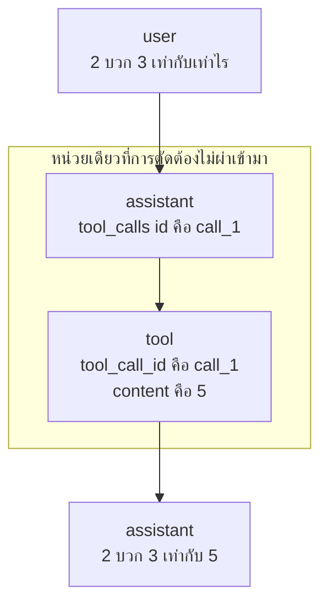

[Read in English](README.md)

# บทที่ 04 agent loop

นี่คือบทที่คุณจะสร้าง agent ขึ้นมาจริง ๆ

ไม่ใช่โปรแกรมแชทที่บังเอิญรู้จักฟังก์ชัน แต่เป็น agent จริง โปรแกรมที่รับคำขอ
เป็นภาษาอังกฤษ ตัดสินใจเองว่าต้องรันอะไรบางอย่าง รันมัน อ่านผลลัพธ์ แล้วเดินหน้า
ต่อจนกว่าจะได้คำตอบ ทุกอย่างในสามบทก่อนหน้าคือชิ้นส่วนที่ถูกกลึงขึ้นมาทีละชิ้น
บทนี้คือบทที่ชิ้นส่วนทั้งหมดถูกขันน็อตเข้าด้วยกันและเครื่องเริ่มหมุน

สิ่งที่น่าทึ่งคือมันเล็กมาก ไอเดียทั้งหมดอยู่ในโค้ด Python ราวสามสิบบรรทัด และเมื่อ
คุณอ่านมันจบแล้ว คุณจะไม่ตื่นเต้นกับไดอะแกรมสถาปัตยกรรม agent อีกเลย มันมี `for`
loop หนึ่งอัน list ของ dictionary หนึ่งอัน และคำสั่ง `if` หนึ่งอัน นั่นแหละคือเครื่องจักร

ไฟล์ในโฟลเดอร์นี้

```text
lessons/04-agent-loop/
  tools.py    unchanged from lesson 03, two toy tools and their schemas
  llm.py      unchanged from lesson 03, sends tools and parses tool calls
  agent.py    new, the loop itself
  check.py    a script that proves the whole loop works end to end
  README.md   this file
```

สังเกตว่ามีไฟล์ใหม่แค่ไฟล์เดียว `tools.py` และ `llm.py` เหมือนเดิมทุกไบต์กับที่คุณมี
อยู่แล้ว ความสามารถใหม่ทั้งหมดในบทนี้มาจาก `agent.py` และ `agent.py` ก็แทบจะเป็น
แค่ `for` loop จำข้อนี้ไว้ทุกครั้งที่มีคนบอกคุณว่า agent เป็นเรื่องซับซ้อน

## 1. ปัญหาที่ค้างมาจากบทที่ 03

บทที่ 03 จบลงแบบค้างคาโดยตั้งใจ นี่คือสิ่งสุดท้ายที่มันพิมพ์ออกมา

```text
OK the model asked for add(2, 3) and the tool returned 5
```

tool คืนค่า `5` ออกมา คืนให้ใคร

คืนให้ `check.py` ตัวเลขนั้นไปอยู่ในตัวแปร Python ของสคริปต์ที่จบการทำงานไปแล้ว
ลองดูรูปร่างของโค้ดที่สร้างบรรทัดนั้นขึ้นมา

```python
text, calls = complete([{"role": "user", "content": PROMPT}], tools.SCHEMAS)
call = calls[0]
result = tools.run(call["name"], call["arguments"])
print("OK the model asked for add(2, 3) and the tool returned 5")
```

ลองนับ request ของ HTTP ดู มีแค่หนึ่งเดียว เราส่งคำถามไป model ขอเรียก `add`
เรารัน `add` แล้วโปรแกรมก็หยุด model ถามคำถามเรา แต่เราไม่เคยตอบมันเลย ในมุมมอง
ของ model บทสนทนาจบลงกลางประโยค

มีสองเรื่องที่พังอยู่ตรงนี้ และควรเรียกชื่อมันแยกกัน เพราะมันต้องการวิธีแก้ที่ต่างกัน

ผลลัพธ์ไม่เคยเดินทางกลับไป ไม่มีการเรียก `complete` ครั้งที่สอง สตริง `"5"`
มีอยู่แค่ในโปรเซสของเราเท่านั้น model ที่ขอให้บวกเลขไม่มีความทรงจำเกี่ยวกับคำขอนั้น
และไม่รู้คำตอบ เพราะ API เป็นแบบ stateless ทุกอย่างที่ model รู้มาจาก list ของ
`messages` ใน request ที่เราส่ง และเราก็ไม่เคยส่ง request อีกเลย

เรา hardcode จำนวนขั้นตอนไว้ `check.py` สมมติว่ามี tool call แค่ครั้งเดียว
หยิบ `calls[0]` มารัน แล้วหยุด มันทำงานได้เพราะ prompt ถูกจัดฉากไว้ให้เกิด call
เดียว แต่มันพังทันทีที่คำถามจริงต้องการสองขั้น

เพราะความล้มเหลวสองข้อนี้ ทุกอย่างต่อไปนี้จึงเป็นไปไม่ได้ด้วยโค้ดของบทที่ 03

- agent ตอบเป็นประโยคไม่ได้ มีแต่ model เท่านั้นที่เขียนประโยค และ model ไม่รู้
  ผลลัพธ์
- agent ทำงานต่อเนื่องเป็นลูกโซ่ไม่ได้ การตัดสินใจว่าจะทำอะไรเป็นอย่างที่สอง ต้องรู้
  ก่อนว่าอย่างแรกเกิดอะไรขึ้น
- agent กู้คืนจาก error ไม่ได้ `tools.run` อุตส่าห์แปลงทุก exception ให้เป็นสตริง
  error ที่อ่านได้ แล้วสตริงนั้นก็ไม่ได้ไปไหนเลย

ทุกข้อคือชิ้นส่วนที่ขาดหายไปชิ้นเดียวกัน แค่สวมหมวกคนละใบ ผลลัพธ์ต้องกลับเข้าไปใน
บทสนทนา แล้วเราต้องถามอีกครั้ง

การถามอีกครั้งนั่นแหละคือทั้งบทนี้

## 2. ทำไมมันต้องเป็น loop ไม่ใช่แค่เรียกฟังก์ชันเพิ่มอีกครั้ง

วิธีแก้ที่ดูชัดเจนคือเขียนการเรียกเพิ่มอีกครั้งแล้วจบ

```python
text, calls = complete(messages, tools.SCHEMAS)
result = tools.run(calls[0]["name"], calls[0]["arguments"])
messages.append(...)                       # put the result in
final, _ = complete(messages, tools.SCHEMAS)   # ask one more time
print(final)
```

นั่นเป็นการปรับปรุงที่ดีขึ้นจริง และมันก็พังทันทีที่มีคนถามคำถามที่สอง

### model ไม่มีทางรู้คำตอบจนกว่าเราจะรัน tool

เริ่มจากข้อจำกัดที่ทำให้ทุกอย่างที่เหลือตามมา language model สร้างข้อความจากข้อความ
ที่มันได้รับ มันรันฟังก์ชัน `add` ของคุณไม่ได้ มันมองไม่เห็น file system ของคุณ มันไม่รู้
ว่าลูกเต๋าออกหน้า 4 เพราะลูกเต๋ายังไม่ได้ถูกทอย และมันจะยังไม่ถูกทอยจนกว่า Python
ของเราจะเรียก `random.randint`

เมื่อ model ต้องการข้อเท็จจริงที่มันไม่มี ทางเดียวที่ทำได้คือหยุดสร้างข้อความแล้วถาม
คำขอนั้นกลับมาหาเราในรูปของข้อมูล เรารัน tool ตอนนี้เรารู้บางอย่างที่ model ไม่รู้ และ
ทางเดียวที่จะบอกมันได้คือส่ง HTTP request อีกครั้งที่บรรจุข้อเท็จจริงใหม่นั้นไป

การแลกเปลี่ยนครั้งนั้นคือหนึ่ง round trip คำถามเข้าไป คำขอ tool ออกมา ผลลัพธ์ tool
เข้าไป คำตอบออกมา การเรียก `complete` สองครั้งข้างบนรองรับได้แค่หนึ่ง round trip พอดี

### จำนวน round trip รู้ล่วงหน้าไม่ได้

ทีนี้ดูว่าหนึ่ง round trip หมดความพอเพียงเร็วแค่ไหน

```text
"What is 2 plus 3?"
  round trip 1   add(2, 3) -> 5
  round trip 2   the model answers in words
  total: 2 calls to the model
```

```text
"Roll a six sided dice and add 10 to whatever it shows."
  round trip 1   roll_dice(6) -> 4
  round trip 2   add(4, 10) -> 14        the model could not have written
                                          this call before seeing the 4
  round trip 3   the model answers in words
  total: 3 calls to the model
```

```text
"Roll a dice, then add that many again, and tell me if it beats 20."
  round trip 1   roll_dice(6) -> 2
  round trip 2   add(2, 2) -> 4
  round trip 3   the model answers in words, no it does not beat 20
  total: 3 calls, but a different 3 every time you run it
```

ตัวอย่างที่สองคือตัวอย่างสำคัญ model ไม่มีทางสร้าง `add(4, 10)` ขึ้นมาได้ในเทิร์นแรก
เพราะเลข 4 ยังไม่มีอยู่ที่ไหนเลยในจักรวาลตอนนั้น มันต้องเห็นผลลูกเต๋าก่อนจึงจะเขียน
call ถัดไปได้ ขั้นตอนเหล่านี้ไม่ได้แค่มีหลายขั้น แต่มันขึ้นต่อกัน และแต่ละขั้นปลดล็อกขั้นถัดไป

ส่วนตัวอย่างที่สาม ลองรันสองครั้งแล้วคุณอาจได้จำนวนขั้นตอนต่างกัน ทอยได้ 6 model
อาจตัดสินใจไปตรวจอย่างอื่นต่อ ทอยได้ 1 มันอาจตอบทันที จำนวนขึ้นอยู่กับค่าที่ยังไม่มีอยู่
จนกว่าจะถึง runtime

### จำนวนที่ไม่รู้ล่วงหน้านั่นแหละคือนิยามของ loop

นี่คือเหตุผลเชิงการเขียนโปรแกรมล้วน ๆ ที่ไม่มี AI อยู่เลย

ถ้าคุณรู้ว่าต้องทำซ้ำกี่ครั้ง คุณเขียนออกมาตรง ๆ ได้ สองครั้งก็สองบรรทัด ห้าครั้งก็ห้าบรรทัด
หรือใช้ `for` บน `range(5)` น่าเกลียดแต่ทำได้

ถ้าคุณไม่รู้ว่ากี่ครั้ง คุณเขียนออกมาตรง ๆ ไม่ได้ คุณต้องใช้โครงสร้างที่ทำซ้ำจนกว่าเงื่อนไข
จะเป็นจริง นั่นคือหน้าที่ของ loop และเป็นเหตุผลเดียวที่ loop มีอยู่ในทุกภาษา

เราไม่รู้ว่าคำถามหนึ่งต้องใช้กี่ round trip เราไม่มีทางรู้ เพราะคำตอบขึ้นอยู่กับสิ่งที่ tool
คืนกลับมา และ tool ก็ยังไม่ได้รัน แปลว่านี่ต้องเป็น loop ไม่ใช่เพราะความชอบเชิงสไตล์
แต่เพราะความจำเป็น

### ทำไมไม่ใช้ recursion หรือ state machine หรือ graph

นั่นคือทางเลือกที่คนมักนึกถึง และควรพูดว่าทำไม loop ธรรมดาถึงชนะในกรณีนี้

Recursion ใช้ได้ ฟังก์ชันที่เรียกตัวเองด้วย list ของ message ที่ยาวขึ้นนั้นเทียบเท่ากัน
ทุกประการ มันแย่กว่าสำหรับผู้เริ่มต้นเพราะ state ที่โตขึ้นถูกซ่อนอยู่ใน call stack แทนที่
จะอยู่ในตัวแปรที่คุณ print ดูได้ และเพราะขีดจำกัด recursion ของ Python กลายเป็นโหมด
ความล้มเหลวอย่างที่สองที่คุณต้องคิดถึงเพิ่มจากอันที่มีอยู่แล้ว

มีคนอ่านเขียนมันแบบ recursion จริง ๆ และมันรันได้ดีจนกระทั่ง tool ตัวหนึ่งเริ่มพัง
เขาอยากดูบันทึกการสนทนา ณ จุดที่เรื่องเริ่มผิดพลาด แล้วพบว่าไม่มีบันทึกให้ print เลย
เพราะที่ความลึกแปดชั้น มันคือ list ที่สร้างไปได้ครึ่งทางแปดก้อนใน stack frame แปดอัน
เขาต้องต่อ debugger เพื่อตอบคำถามที่ `print(messages)` ตอบได้ในบรรทัดเดียว

State machine หรือ graph คือสิ่งที่ framework ยอดนิยมหลายตัวให้คุณ มี node
มี edge มี conditional transition สิ่งเหล่านี้มีประโยชน์จริงเมื่อคุณมี workflow ที่แตกกิ่ง
มีขั้นตอนขออนุมัติจากมนุษย์ และมี sub agent ที่ทำงานขนาน ซึ่งเป็นเนื้อหาของ ภาคสี่
ในคอร์สนี้ การหยิบมันมาใช้ตอนนี้จะฝังไอเดียห้าบรรทัดไว้ใต้ framework ร้อยบรรทัด และ
คุณจะได้เรียน framework แทนที่จะได้เรียนไอเดีย

`for` loop ธรรมดา เก็บ state ทุกชิ้นไว้ใน list เดียวที่มองเห็นได้ ทำให้ control flow
อ่านจากบนลงล่างได้ และให้ turn limit มาฟรี ๆ เพราะ `range` นับให้อยู่แล้ว เริ่มจากตรงนี้
รูปแบบที่หรูกว่าล้วนเป็นการขัดเกลารูปแบบนี้ และมันเข้าใจง่ายขึ้นมากเมื่อคุณรู้ว่ามันกำลัง
ขัดเกลาอะไรอยู่

## 3. สี่ขั้นตอนในภาษาคนธรรมดา

ก่อนจะดูโค้ด ให้จำ loop นี้เป็นสี่ประโยค ถ้าคุณจำอะไรจากบทนี้ไม่ได้เลย ให้จำสี่ข้อนี้
agent ทุกตัวที่เคยถูกสร้างขึ้นมา รวมถึงตัวที่รันอยู่บน production ของบริษัทใหญ่ ๆ ก็คือ
สิ่งนี้บวกกับการจัดการ error ที่มากขึ้น

1. **ถาม model** ส่งบทสนทนาทั้งหมดที่ผ่านมา พร้อมกับ list ของ tool ที่มันได้รับ
   อนุญาตให้ขอใช้
2. **ถ้ามันขอ tool ก็รัน tool** ค้นหาชื่อที่ถูกขอมาแต่ละชื่อใน dictionary ของฟังก์ชัน
   ที่คุณถือไว้ แล้วเรียกมัน นี่เป็นขั้นตอนเดียวที่แตะโลกจริง
3. **ใส่ผลลัพธ์กลับเข้าไปในบทสนทนา** append ทั้งสิ่งที่ model ขอ และสิ่งที่ tool
   แต่ละตัวคืนกลับมา เพื่อให้ request ครั้งถัดไปพาไปทั้งสองอย่าง
4. **ถามอีกครั้ง** ย้อนกลับไปขั้นตอนที่หนึ่งด้วยบทสนทนาที่ยาวขึ้น

และเงื่อนไขการออก ซึ่งเป็นอีกหนึ่งประโยค

> หยุดเมื่อ model ตอบเป็นถ้อยคำแทนที่จะขอ tool

นั่นคือทั้งหมด อ่านสี่ขั้นตอนอีกครั้งแล้วสังเกตว่ามีอะไรที่ไม่อยู่ในนั้น ไม่มีเฟสวางแผน
ไม่มีระบบความจำ ไม่มี reasoning engine ไม่มี scheduler agent คือบทสนทนาที่คุณ
ป้อนต่อไปเรื่อย ๆ จนกว่าอีกฝ่ายจะหยุดถามคำถาม

นี่คือ loop เดียวกันในรูปภาพ สำหรับหนึ่ง round trip

```text
  user: "What is 2 plus 3?"
        |
        v
  [1] ask the model  ------------------> model
                                          |
        <---------------------------------+  "run add with a=2 b=3"
        |
        v
  [2] run the tool           add(2, 3) -> 5
        |
        v
  [3] append to the conversation
        assistant: (I want add(2,3))
        tool:      5
        |
        v
  [4] ask again  ---------------------> model
                                          |
        <---------------------------------+  "2 plus 3 is 5."
        |
        v
  no tool calls, so return the text and stop
```

ตัว loop body รันไปหนึ่งรอบ สำหรับตัวอย่างลูกเต๋ามันจะรันสองรอบ ส่วนคำถามที่ model
ตอบได้จากความรู้เดิม ขั้นตอน tool รันศูนย์รอบ เพราะขั้นตอนที่หนึ่งกลับมาพร้อมถ้อยคำตั้งแต่ครั้งแรก
และเราคืนค่าทันที

## 4. ทำไม assistant message ที่มี tool_calls ต้องกลับเข้าไปใน history

นี่คือส่วนที่ละเอียดอ่อนของบทนี้ และเป็นจุดที่เกือบทุกคนที่เขียน agent ตัวแรกติดอยู่
อ่านหัวข้อนี้ช้า ๆ

เมื่อ model ขอ tool จะต้อง append message สองอันเข้าไปในบทสนทนา ไม่ใช่อันเดียว

```python
# the model's request, in the model's voice
{"role": "assistant", "content": "", "tool_calls": [ ... ]}

# our answer to that request
{"role": "tool", "tool_call_id": "call_mock_1", "content": "5"}
```

สัญชาตญาณบอกให้ append แค่อันที่สอง คุณมีผลลัพธ์แล้ว ผลลัพธ์คือข้อมูลใหม่ ก็เลย
push ผลลัพธ์แล้วเดินหน้าต่อ สัญชาตญาณนั้นผิด และมันผิดด้วยเหตุผลที่ควรทำความเข้าใจ
มากกว่าจะท่องจำ

### ผลลัพธ์ของ tool ไม่มีความหมายเมื่ออยู่ลำพัง

ลองนึกภาพว่าอ่านแค่ message อันที่สอง นี่คือบทสนทนาทั้งหมดเท่าที่ model จะได้รับ
ถ้าคุณข้ามอันแรกไป

```json
[
  {"role": "user", "content": "What is 2 plus 3?"},
  {"role": "tool", "tool_call_id": "call_mock_1", "content": "5"}
]
```

ทีนี้ลองสวมบทเป็น model คุณเห็นคำถามหนึ่งข้อ แล้วคุณเห็นเลข `5` โดด ๆ ที่ถูกติดป้าย
ว่าเป็นผลลัพธ์ของอะไรบางอย่าง อ้างถึง call id ที่คุณไม่เคยเจอมาก่อน ห้าอะไร ผลลัพธ์
ของฟังก์ชันไหน ด้วยargumentอะไร มีใครบวก หรือคูณ หรือทอยลูกเต๋าห้าหน้า

message บอกว่ามันเป็น response แต่ไม่มี request อยู่ที่ไหนเลยใน transcript ให้มัน
เป็น response ของ `tool_call_id` ชี้ไปที่ความว่างเปล่า มันคือการตอบอีเมลที่ไม่เคยถูกส่ง

assistant message ที่พา `tool_calls` มาด้วยนั้นคือตัว request มันเป็นบันทึกเดียวใน
บทสนทนาที่บอกว่ามีการขออะไร ฟังก์ชันไหน ด้วยargumentอะไร ลบมันทิ้งแล้วผลลัพธ์
จะสูญเสียความหมายทั้งหมด เพราะความหมายไม่เคยอยู่ในตัวเลข มันอยู่ในการจับคู่

### API ไม่ได้แค่ไม่ชอบ แต่มันปฏิเสธเลย

นี่ไม่ใช่ปัญหาเรื่องคุณภาพที่ model จะตอบคลุมเครือขึ้น request ล้มเหลวทันที กฎข้อนี้
เป็นส่วนหนึ่งของรูปแบบ message และ provider จะตรวจสอบมันก่อนที่จะมีการ generate ใด ๆ

ถ้าคุณข้าม assistant message ไป `complete` จะ post body แบบข้างบน แล้ว endpoint
(URL ที่เรายิง request ไปหา) จะตอบกลับด้วย HTTP 400 และ body หน้าตาแบบนี้

```json
{
  "error": {
    "message": "Invalid parameter: messages with role 'tool' must be a response to a preceeding message with 'tool_calls'.",
    "type": "invalid_request_error",
    "param": "messages.[1].role",
    "code": null
  }
}
```

เพราะ `llm.py` เรียก `response.raise_for_status()` สิ่งนั้นจะมาถึง terminal ของคุณ
ในรูปของ exception แทนที่จะเป็น JSON

```text
Traceback (most recent call last):
  File "agent.py", line 54, in <module>
    print(run("What is 2 plus 3?"))
  File "agent.py", line 21, in run
    text, calls = complete(messages, tools.SCHEMAS)
  File "llm.py", line 29, in complete
    response.raise_for_status()
httpx.HTTPStatusError: Client error '400 Bad Request' for url 'http://localhost:11434/v1/chat/completions'
For more information check: https://developer.mozilla.org/en-US/docs/Web/HTTP/Status/400
```

มีสองเรื่องเกี่ยวกับ traceback นั้นที่ควรสังเกต เพราะมันจะช่วยประหยัดเวลาคุณในภายหลัง

error โผล่ขึ้นมาข้างใน `llm.py` บนบรรทัดที่ตรวจ status code แต่บั๊กของคุณอยู่ใน
`agent.py` ในการ append ที่คุณไม่ได้เขียน traceback ชี้ไปที่คนส่งสาร นี่เป็นเรื่องปกติ
ของ HTTP API และเป็นเหตุผลว่าทำไมการอ่าน response body จึงสำคัญกว่าการอ่าน stack

ถ้อยคำที่แน่นอนต่างกันไปตาม provider บางเจ้าบอกว่า tool message ต้องตามหลัง
assistant message ที่มี tool call บางเจ้าระบุ index ที่มีปัญหา อย่างอันนี้ที่บอกว่า
`messages.[1].role` บางเจ้าบ่นว่าหา `tool_call_id` ไม่เจอ ทั้งหมดคือกฎข้อเดียวกัน
ถ้าคุณเห็นคำว่า `tool` และ `tool_calls` ใน response 400 แปลว่าคุณมี message ที่ไม่จับคู่

### ภาพสะท้อนของกฎข้อเดียวกัน

กฎนี้ตัดได้ทั้งสองทาง และอีกทางหนึ่งก็กัดเจ็บเหมือนกัน ถ้าคุณ append assistant
message ที่มี `tool_calls` แล้วไม่ append `tool` message สำหรับทุก id ในนั้น
request ครั้งถัดไปก็ไม่ถูกต้องเช่นกัน ขอ tool call สองอัน ตอบกลับอันเดียว แล้วคุณจะได้
400 ที่ระบุ id ที่คุณทิ้งค้างไว้

ระบุกฎนี้ครั้งเดียว ในรูปแบบที่คุณควรจดจำไว้

> ทุก tool call ต้องการผลลัพธ์ของมัน และทุกผลลัพธ์ของ tool ต้องการ call ของมัน
> ทั้งสองเดินทางไปด้วยกัน ไม่งั้น request จะถูกปฏิเสธ

ดู `agent.py` โดยคิดถึงเรื่องนี้ แล้วคุณจะเห็น invariant ที่ถูกรักษาไว้ assistant
message ถูก append ครั้งเดียว ก่อนที่ tool loop จะเริ่ม จากนั้น `for` loop จะ append
`tool` message หนึ่งอันต่อหนึ่ง call พอดี โดยใช้ `call["id"]` เป็น `tool_call_id`
พอ loop body จบลง ทุก id ใน assistant message ก็มีคำตอบที่จับคู่กัน และ history
ก็ถูกต้องพร้อมสำหรับ request ครั้งถัดไป

### ทำไมเรื่องนี้จะย้อนกลับมากัดคนใน ภาคสาม

ตอนนี้บทสนทนายังเล็กมาก สอง message กลายเป็นสี่ สี่กลายเป็นหก และไม่มีอะไรถูก
เอาออกเลย นั่นใช้ได้จนกว่ามันจะใช้ไม่ได้ เพราะทุก model มี context window ซึ่งเป็น
เพดานตายตัวว่าหนึ่ง request จะบรรจุข้อความได้มากแค่ไหน agent ที่รันยาว ๆ จะชนมันแน่

วิธีแก้ที่ดูชัดเจนคือทิ้ง message เก่า ๆ เก็บ user message อันแรกไว้ เก็บอันท้าย ๆ ไว้
สักหยิบมือ แล้วโยนตรงกลางทิ้ง มันเป็นสิ่งแรกที่ทุกคนลอง และมันทำให้ agent พังในแบบ
ที่ debug แล้วงงจริง ๆ

จากตรงนี้คุณเห็นเหตุผลได้แล้ว ตัดบทสนทนาที่จุดใดจุดหนึ่งแบบสุ่ม แล้วมีโอกาสสูงมากที่
รอยตัดจะตกลงระหว่าง assistant message กับผลลัพธ์ tool ของมัน assistant message
หลุดออกจากด้านหน้าของ window ส่วน `tool` message ยังอยู่ ตอนนี้คุณมี orphan
แบบเดียวกับตอนต้นหัวข้อนี้เป๊ะ ต่างกันแค่คุณไม่ได้ตั้งใจเขียนมันขึ้นมา และ agent ที่ทำงาน
ได้สมบูรณ์แบบมายี่สิบเทิร์นก็เริ่มโยน error 400 ในเทิร์นที่ยี่สิบเอ็ด



วิธีที่ถูกต้องคือมองว่า tool call กับผลลัพธ์ของมันเป็นหน่วยเดียวที่แบ่งแยกไม่ได้เวลาตัดทิ้ง
และให้สรุปย่อส่วนเก่า ๆ แทนที่จะเฉือนมันทิ้ง นั่นเป็นเนื้อหาของบทหนึ่งต่างหาก มันคือ
บทเรื่อง context management ใน ภาคสาม และเมื่อคุณไปถึงตรงนั้น กฎการจับคู่ที่คุณ
เพิ่งเรียนไปคือเหตุผลที่บทนั้นมีอยู่

## 5. ทำไม max_turns ไม่ใช่ของที่จะมีก็ได้ไม่มีก็ได้

ดูหัว loop ใน `agent.py`

```python
for _ in range(max_turns):
```

และดูบรรทัดหลัง loop

```python
raise RuntimeError(f"agent stopped after max turns ({max_turns})")
```

ผู้เริ่มต้นจะมองว่า `while True` คือรูปแบบธรรมชาติของงานนี้ เพราะเราอยากรันจนกว่า
model จะตอบเป็นถ้อยคำ อย่าเขียนแบบนั้น นี่คือสิ่งที่เกิดขึ้นถ้าคุณเขียน

### loop ที่วิ่งหนีไม่หยุด

model ติดหล่มได้ ไม่ใช่นาน ๆ ครั้ง แต่เป็นประจำ และเป็นแบบเฉพาะตัว model ขอ tool
tool ล้มเหลวหรือคืนค่าที่ model ไม่ได้คาดไว้ model ลองอีกครั้ง มันล้มเหลวอีก model
ลองครั้งที่สามโดยสะกดargumentต่างออกไปนิดหน่อย แล้วก็วนแบบนี้ไปตลอดกาล

```text
[calling roll_dice with {'sides': 'six'}]
[roll_dice returned Error: TypeError: randint() argument must be int, not str]
[calling roll_dice with {'sides': 'six'}]
[roll_dice returned Error: TypeError: randint() argument must be int, not str]
[calling roll_dice with {'sides': '6'}]
[roll_dice returned Error: TypeError: randint() argument must be int, not str]
[calling roll_dice with {'sides': 'six'}]
...
```

ไม่มีอะไรใน trace นั้นที่เป็นการ crash ทุกบรรทัดคือ HTTP request ที่สำเร็จ และการ
dispatch tool ที่สำเร็จ โปรแกรมทำงานตรงตามที่เขียนไว้เป๊ะ มันจะทำงานตรงตามที่เขียนไว้
ต่อไปเรื่อย ๆ จนกว่าคุณจะสังเกตเห็นแล้วกด Ctrl-C และถ้าคุณสั่งรันแล้วออกไปกินข้าวเที่ยง
นั่นคือ request สองชั่วโมง

### เรื่องนี้เสียเงินจริง

infinite loop ในโค้ดธรรมดาทำให้คุณเสีย CPU ที่ร้อนขึ้น infinite loop ใน agent ทำให้
คุณเสียเงิน เพราะทุกรอบคือการเรียก API ที่ต้องจ่ายเงิน

แย่กว่านั้น ต้นทุนของแต่ละรอบยังโตขึ้นเรื่อย ๆ บทสนทนายาวขึ้นทุกเทิร์น คุณส่ง history
ทั้งหมดใหม่ทุกครั้ง และ provider คิดเงินตาม token รอบแรกส่ง list ของ message สั้น ๆ
รอบที่ห้าสิบส่ง tool call และสตริง error ที่สะสมมาห้าสิบรอบ แปลว่าค่าใช้จ่ายต่อเทิร์น
ไต่ขึ้นในขณะที่ loop ไม่คืบหน้าเลยแม้แต่น้อย รูปแบบนี้เคยสร้างใบแจ้งหนี้ที่น่าจดจำมาแล้ว
มากมาย และคนที่ได้รับมันส่วนใหญ่ก็รันโค้ดที่ดูเหมือนถูกต้อง

ลองคิดเลขกับ trace ลูกเต๋าข้างบน รอบแรกส่งราว 800 token ส่วนใหญ่เป็น schema
ทุกรอบที่ติดอยู่จะเพิ่ม call เดิมกับสตริง error เข้าไป พอถึงรอบที่ห้าสิบ request
โตเป็นราว 41000 token และห้าสิบรอบรวมกันส่ง input ไปราวหนึ่งล้าน token
เพื่อแลกกับความว่างเปล่า นั่นคือคำถามเดียว ถามครั้งเดียว จากโปรแกรมที่ไม่มีบั๊ก
ที่คนตรวจโค้ดจะจับได้

การใช้ `for` บน `range(max_turns)` ทำให้กรณีเลวร้ายที่สุดมีขอบเขตและรู้ได้ก่อนที่คุณ
จะกด enter สิบเทิร์นคือการเรียก model สิบครั้ง คุณใส่ตัวเลขให้ความเสียหายได้ และ
ตัวเลขนั้นก็เล็ก

สังเกตด้วยว่าเรา raise ไม่ใช่ return การชนเพดานไม่ใช่คำตอบ การคืนข้อความอะไรก็ตาม
ที่บังเอิญวางอยู่แถวนั้นจะทำให้ความล้มเหลวดูเหมือนความสำเร็จในสายตาของโค้ดที่เรียก
`run` และคำตอบที่ผิดแบบเงียบ ๆ นั้นแย่กว่าการหยุดแบบดัง ๆ มาก

### ทีนี้มาถึงส่วนที่ต้องพูดตามตรง turn cap เป็นเครื่องมือที่หยาบ

turn cap ป้องกันความเสียหายแบบไม่จำกัด แต่มันไม่ได้ป้องกันความเสียหาย

ดู trace ลูกเต๋านั้นอีกครั้ง ด้วย `max_turns=10` โปรแกรมจะหยุดหลังจากสิบรอบแทนที่จะ
ไม่หยุดเลย แต่มันก็ยังเรียก model ไปสิบครั้งอย่างไร้ประโยชน์ ยังจ่ายเงินให้ request ที่โต
ขึ้นสิบครั้ง ยังใช้เวลาจริงไปสิบ round trip และยังจบลงด้วย `RuntimeError` โดยไม่มี
คำตอบให้ผู้ใช้ เพดานเปลี่ยนความล้มเหลวที่ไร้ขอบเขตให้เป็นความล้มเหลวที่มีขอบเขต
มันไม่ได้เปลี่ยนความล้มเหลวให้เป็นความสำเร็จ และมันไม่ได้สังเกตเห็นว่ามีอะไรผิดปกติเลย

นั่นคือจุดอ่อน turn cap นับได้ แต่มันคิดไม่ได้ มันแยกไม่ออกระหว่าง agent ที่ทำงานจริง
สิบชิ้น กับ agent ที่เรียก call พัง ๆ อันเดิมซ้ำสิบครั้ง เพราะในมุมมองของ `range` สอง
อย่างนี้เหมือนกันทุกประการ model เผาผลาญงบทั้งหมดไปกับการสร้าง call ที่ล้มเหลว
อันเดียวในเวอร์ชันที่ต่างกันนิดหน่อยได้ และเพดานก็จะปล่อยให้มันทำ ไปจนถึงรอบสุดท้าย

สิ่งที่ harness ระดับ production ทำแทนคือเฝ้าดูสิ่งที่เพดานมองไม่เห็น นั่นคือการไม่มี
ความคืบหน้า

- **การตรวจจับ call ที่ซ้ำ** ทำ hash ของชื่อ tool รวมกับargumentของมัน ถ้า call
  ที่เหมือนกันเป๊ะปรากฏสองครั้งพร้อมผลลัพธ์ที่เหมือนกันเป๊ะ ให้หยุด หรือป้อน message
  ที่บอก model ตรง ๆ ว่ามันลองอันนี้ไปแล้วและได้ผลแบบนั้น ซึ่งมักช่วยปลดล็อกมันได้
- **การนับ error ที่ติดต่อกัน** จำกัดจำนวนความล้มเหลวติดต่อกันของ tool ตัวหนึ่ง
  แยกออกจากจำนวนเทิร์นทั้งหมด พลาดสามครั้งบน `read_file` คือ path ที่พัง ไม่ใช่ดวงไม่ดี
- **ใช้งบประมาณแทนการนับเทิร์น** ติดตาม token ที่ใช้ หรือเงินที่จ่าย หรือวินาทีที่ผ่านไป
  เพราะนั่นคือทรัพยากรที่คุณสนใจจริง ๆ เทิร์นเป็นตัวแทนที่แย่สำหรับทุกอย่างที่ว่ามา
- **ส่งต่อให้มนุษย์** เมื่อความคืบหน้าหยุดชะงัก ให้หยุดแล้วถาม ถูกกว่าการรันอีกสิบเทิร์น
  และมักจะเร็วกว่าด้วย

ทั้งหมดนั้นเป็นเรื่องของ ภาคสาม ในบทว่าด้วยความน่าเชื่อถือและการควบคุม มันไม่ควรอยู่ใน
`agent.py` วันนี้ เพราะสามสิบบรรทัดที่คุณจำไว้ในหัวได้มีค่ามากกว่า loop ที่ทนทานแต่คุณ
จำไม่ไหวในตอนนี้ เก็บเพดานไว้ เข้าใจว่ามันคือฟิวส์ ไม่ใช่การวินิจฉัย และรู้ไว้ว่าเครื่องมือ
ที่ดีกว่ากำลังจะมา

## 6. เขียน agent.py ทีละบรรทัด

นี่คือไฟล์ทั้งหมด โดยย่อ docstring ไว้ อ่านมันหนึ่งรอบจากต้นจนจบ แล้วค่อยอ่านคำอธิบาย

```python
"""The agent loop."""
import json

import tools
from llm import complete


def run(user_input, max_turns=10):
    """Run the agent until it produces a final answer. Returns the answer."""
    messages = [{"role": "user", "content": user_input}]

    for _ in range(max_turns):
        text, calls = complete(messages, tools.SCHEMAS)

        if not calls:
            return text

        messages.append(
            {
                "role": "assistant",
                "content": text,
                "tool_calls": [
                    {
                        "id": call["id"],
                        "type": "function",
                        "function": {
                            "name": call["name"],
                            "arguments": json.dumps(call["arguments"]),
                        },
                    }
                    for call in calls
                ],
            }
        )

        for call in calls:
            print(f"[calling {call['name']} with {call['arguments']}]")
            result = tools.run(call["name"], call["arguments"])
            print(f"[{call['name']} returned {result}]")
            messages.append({"role": "tool", "tool_call_id": call["id"], "content": result})

    raise RuntimeError(f"agent stopped after max turns ({max_turns})")


if __name__ == "__main__":
    print(run("What is 2 plus 3?"))
```

ตัวเนื้อสามสิบบรรทัด ทีนี้มาดูทีละชิ้น

### ส่วน import

```python
import json

import tools
from llm import complete
```

`json` อยู่ตรงนี้ด้วยเหตุผลเดียว คือ `json.dumps` ที่อยู่ถัดลงไป การเรียกนั้นได้หัวข้อ
ย่อยเป็นของตัวเองเพราะมันสมควรได้

`tools` และ `complete` คือสองไฟล์จากบทที่ 03 ที่ไม่ถูกแก้ไข นี่เป็นจังหวะดีที่จะชื่นชม
การแบ่งชั้น `llm.py` รู้เรื่อง HTTP และไม่รู้อะไรเลยเกี่ยวกับการรัน tool `tools.py`
รู้เรื่องการรันฟังก์ชันและไม่รู้อะไรเลยเกี่ยวกับ HTTP `agent.py` ไม่รู้ทั้งสองอย่างและ
ทำหน้าที่แค่ประสานงาน แต่ละไฟล์อ่านได้ด้วยตัวเอง และแต่ละไฟล์เปลี่ยนไปใช้ implementation
อื่นได้โดยไม่ต้องแตะอีกสองไฟล์

### signature และสถานะเริ่มต้น

```python
def run(user_input, max_turns=10):
    """Run the agent until it produces a final answer. Returns the answer."""
    messages = [{"role": "user", "content": user_input}]
```

`run` รับสตริงและคืนสตริง นั่นคืออินเทอร์เฟซสาธารณะทั้งหมดของ agent ของคุณ
ที่เหลือเป็นเรื่องภายในทั้งสิ้น

`max_turns=10` มีค่า default เพื่อให้ผู้เรียกไม่ต้องคิดถึงมัน และเป็นพารามิเตอร์แทนที่จะ
เป็นค่าคงที่ เพื่อให้ผู้เรียกที่รู้ว่างานยาวสามารถเพิ่มมันได้ หัวข้อ 5 คือเหตุผลว่าทำไมมันถึงมีอยู่

`messages` เริ่มต้นเป็น list ที่มีสมาชิกหนึ่งตัวบรรจุคำถามของผู้ใช้ มันเป็น list ของ
Python ธรรมดา มันอยู่บน stack ของฟังก์ชันนี้ และมันคือความทรงจำทั้งหมดของ agent
เมื่อ `run` คืนค่า ความทรงจำนั้นก็ถูกทิ้ง การเก็บมันไว้ข้ามการเรียกเป็นเนื้อหาของบทหลัง

ตรงนี้ไม่มี system message บทที่ 10 จะเพิ่มมันเข้ามา และมันเปลี่ยนพฤติกรรมของ agent
อย่างมาก ตอนนี้ model ได้รับแค่คำถามกับ schema ของ tool เท่านั้น ไม่มีอย่างอื่น

### หัวของ loop

```python
    for _ in range(max_turns):
```

ขีดล่างคือชื่อตัวแปร loop ตามธรรมเนียมของ Python สำหรับตัวแปรที่คุณไม่ได้ใช้ เราต้องการ
แค่การนับ ไม่ได้ต้องการตัวเลขที่นับได้

การใช้ `for` แทน `while` ทำให้ขีดจำกัดเป็นเรื่องเชิงโครงสร้าง ไม่มีทางเผลอข้ามการตรวจสอบ
ไม่มีตัวนับที่ลืมเพิ่มค่า และไม่มีเงื่อนไข `break` ที่จะเขียนผิด loop รันเกิน `max_turns`
รอบไม่ได้ และคุณเห็นข้อนั้นได้จากการดูบรรทัดเดียว

### ขั้นตอนที่หนึ่ง ถาม model

```python
        text, calls = complete(messages, tools.SCHEMAS)
```

หนึ่งบรรทัดสำหรับการแลกเปลี่ยน HTTP ทั้งหมด นี่คือผลตอบแทนจากการที่เราเขียน `llm.py`
ไว้ก่อน มันสร้าง request body เพิ่ม bearer header ทำการ post ตรวจ status แปลง
response และส่งคืน tuple ของข้อความกับ list ของ dictionary ที่เป็น tool call โดย
argumentถูกแปลงเป็น dict ของ Python จริง ๆ แล้วด้วย `json.loads`

สังเกตว่า `tools.SCHEMAS` ถูกส่งไปทุกรอบของ loop ไม่มีขั้นตอนลงทะเบียนและไม่มี
ความทรงจำฝั่งเซิร์ฟเวอร์ ถ้าคุณส่ง schema ไปใน request แรกแล้วไม่ส่งใน request ที่สอง
model จะเลิกรู้ทันทีว่ามี tool อยู่ และมันจะตอบด้วยการเดา list ของ tool ฉบับเต็มเดินทาง
ไปกับทุก request เหมือนกับที่ history ของ message ฉบับเต็มเดินทางไปด้วย

### เงื่อนไขการออก

```python
        if not calls:
            return text
```

นี่คือกฎการหยุดจากหัวข้อ 3 ในรูปของโค้ด list ของ tool call ที่ว่างเปล่าหมายความว่า
model ตอบเป็นถ้อยคำแล้ว แปลว่าถ้อยคำนั้นคือคำตอบ และเราส่งมันกลับไป

การตรวจ `if not calls` ถูกเลือกอย่างตั้งใจแทนการตรวจ `finish_reason == "stop"`
provider แต่ละเจ้าตั้งค่า `finish_reason` ต่างกัน และเซิร์ฟเวอร์ local บางตัวก็ตั้งมัน
ไม่สม่ำเสมอ การมีหรือไม่มี tool call คือสิ่งที่เราสนใจจริง ๆ เราจึงทดสอบสิ่งนั้นโดยตรง

มีผลข้างเคียงหนึ่งอย่างที่ควรสังเกต ถ้า model ตอบเป็นถ้อยคำตั้งแต่รอบแรก loop body
จะรันหนึ่งรอบ `calls` ว่างเปล่า และ `run` คืนค่าโดยไม่เคยเรียก tool เลย agent ที่ถูก
ถามคำถามที่มันตอบได้จากความรู้เดิมจะทำตัวเหมือนโปรแกรมแชททุกประการ ซึ่งถูกต้องแล้ว

### ขั้นตอนที่สาม ส่วนที่หนึ่ง ใส่คำขอของ model กลับเข้าไป

```python
        messages.append(
            {
                "role": "assistant",
                "content": text,
                "tool_calls": [ ... ],
            }
        )
```

หัวข้อ 4 คือเหตุผลฉบับเต็มของบล็อกนี้ กล่าวสั้น ๆ เรากำลังเขียนคำขอของ model เอง
ลงใน transcript เพื่อให้ผลลัพธ์ที่เรากำลังจะ append มีอะไรให้อ้างอิงถึง

มีสองรายละเอียดใน message นี้

`"role": "assistant"` เพราะ message นี้คือ model เป็นคนพูด เราไม่ได้แต่งอะไรขึ้นมา
เรากำลังถอดความสิ่งที่กลับมาทาง HTTP ลงใน history เพื่อให้ request ครั้งถัดไปบรรจุมันไว้

`"content": text` แทนที่จะเป็นสตริงว่าง ในเทิร์นที่เป็น tool call ล้วน ๆ `text` มักจะ
ว่างเปล่า และ `llm.py` ก็แปลง content ที่เป็น `null` ให้เป็น `""` ไปแล้ว แต่ model
บางตัวเขียนประโยคและขอ tool ในเทิร์นเดียวกัน อะไรทำนอง "Let me calculate that
for you" ควบคู่ไปกับ call ของ `add` การส่ง `text` ผ่านไปด้วยจะรักษาประโยคนั้นไว้
การโยนมันทิ้งจะทำให้ส่วนหนึ่งของการให้เหตุผลของ model หายไปจาก transcript แบบเงียบ ๆ

สังเกตว่าการ append นี้เกิดขึ้น **ก่อน** ที่ tool ใด ๆ จะรัน ลำดับนั้นเป็นความตั้งใจ
คำขอถูกบันทึกก่อน แล้วคำตอบจึงตามมา ซึ่งเป็นทั้งลำดับที่ API ต้องการ และลำดับที่
บทสนทนาเกิดขึ้นจริง

### json.dumps และทำไมมันคือภาพสะท้อนของบทที่ 03

```python
                "tool_calls": [
                    {
                        "id": call["id"],
                        "type": "function",
                        "function": {
                            "name": call["name"],
                            "arguments": json.dumps(call["arguments"]),
                        },
                    }
                    for call in calls
                ],
```

บทที่ 03 มีหัวข้อชื่อ "JSON string ที่ทำให้ทุกคนประหลาดใจ" นี่คือความประหลาดใจ
เดิมที่ย้อนกลับมาในทิศทางตรงข้าม และมันทำให้คนประหลาดใจเป็นครั้งที่สอง

ทบทวนรูปร่างของมัน บนสายส่ง `arguments` ไม่ใช่ JSON object แต่มันคือ
**สตริงที่บรรจุ JSON**

```json
{
  "id": "call_mock_1",
  "type": "function",
  "function": {
    "name": "add",
    "arguments": "{\"a\": 2, \"b\": 3}"
  }
}
```

ในบทที่ 03 เราเรียก `json.loads` บนสตริงนั้นเพื่อให้ได้ dictionary ของ Python
ที่ใช้งานได้ เพราะ `**arguments` ต้องการ mapping

```python
"arguments": json.loads(raw["function"]["arguments"] or "{}")
```

เมื่อ `agent.py` เห็น call `call["arguments"]` จึงเป็น dict จริงอย่าง
`{"a": 2, "b": 3}` สะดวกสำหรับเรา แต่ผิดสำหรับสายส่ง การจะใส่ call นั้นกลับเข้าไป
ใน message history ในรูปแบบที่ API กำหนดไว้ มันต้องกลายเป็นสตริงอีกครั้ง

```python
"arguments": json.dumps(call["arguments"])
```

`json.loads` ตอนขาเข้า `json.dumps` ตอนขาออก สตริงเป็น dict แล้ว dict กลับเป็น
สตริง สองฟังก์ชันที่ชื่อต่างกันแค่ตัวอักษรเดียว ทำงานตรงข้ามกันเป๊ะ ห่างกันห้าบรรทัด
ใน codebase เดียวกัน

ทำไมต้องแปลงไปกลับแทนที่จะเก็บสตริงต้นฉบับไว้แล้วเอามาใช้ซ้ำ เพราะ dictionary
ที่แปลงแล้วคือสิ่งที่ส่วนที่เหลือของโปรแกรมต้องการ และการเก็บสำเนาที่สองของข้อความดิบ
ไว้เพียงเพื่อเล่นซ้ำ หมายถึงการแบกตัวแทนของค่าเดียวกันสองรูปแบบและต้องคอยทำให้มัน
ตรงกัน การเข้ารหัสใหม่เป็นการเรียกฟังก์ชันราคาถูกครั้งเดียว และมีแหล่งความจริงเพียง
แหล่งเดียวเสมอ มันยังเปิดประตูให้สิ่งที่คุณจะอยากได้ในภายหลัง นั่นคือการตรวจสอบหรือ
แก้ไขargumentก่อนที่มันจะถูกบันทึก การลบความลับออกจาก tool call ที่ถูก log ไว้
เป็นเรื่องง่ายเมื่อคุณถือ dict อยู่ และเป็นเรื่องยุ่งยากเมื่อคุณถือสตริง

ถ้าลืม `json.dumps` ความล้มเหลวจะไม่แนบเนียน ซึ่งถือว่าโชคดี request body จะบรรจุ
object ในที่ที่รูปแบบสัญญาว่าจะเป็นสตริง และ provider ก็ปฏิเสธมัน

```text
httpx.HTTPStatusError: Client error '400 Bad Request' for url '.../chat/completions'
```

พร้อมกับ body ทำนองนี้

```json
{
  "error": {
    "message": "Invalid type for 'messages[1].tool_calls[0].function.arguments': expected a string, but got an object instead.",
    "type": "invalid_request_error",
    "param": "messages[1].tool_calls[0].function.arguments",
    "code": "invalid_type"
  }
}
```

อีกสองฟิลด์ที่เหลือนั้นง่าย `"type": "function"` คือ discriminator ซ้ำซากอันเดียวกับ
ที่คุณเขียนไว้ใน schema ส่วน `call["id"]` คือ id ที่บทที่ 03 บอกให้คุณเก็บไว้ทั้งที่ยังไม่มี
อะไรใช้มันเลย ตรงนี้คือจุดที่มันเริ่มถูกใช้ และบล็อกถัดไปคือจุดที่มันพิสูจน์คุณค่าของตัวเอง

### ขั้นตอนที่สองและขั้นตอนที่สาม ส่วนที่สอง รัน tool และบันทึกผลลัพธ์

```python
        for call in calls:
            print(f"[calling {call['name']} with {call['arguments']}]")
            result = tools.run(call["name"], call["arguments"])
            print(f"[{call['name']} returned {result}]")
            messages.append({"role": "tool", "tool_call_id": call["id"], "content": result})
```

loop ชั้นใน สี่บรรทัด และเป็นจุดที่โปรแกรมแตะโลกจริง

`print` สองบรรทัดนั้นไม่ใช่ของประดับ มันคือ trace ของ agent และเป็นหน้าต่างเดียวที่
คุณมีไว้มองว่ามันกำลังทำอะไร เมื่อ agent ทำตัวแปลก ๆ output นี้คือสิ่งแรกที่คุณอ่าน
เพราะมันแสดงargumentที่ model เลือกเป๊ะ ๆ และสตริงที่มันได้กลับมาเป๊ะ ๆ จง print
ให้เยอะเข้าไว้ใน agent ความล้มเหลวที่น่าสนใจทั้งหมดอยู่ในช่องว่างระหว่างสิ่งที่คุณคิดว่า
model ขอ กับสิ่งที่มันขอจริง ๆ

นี่คือช่องว่างแบบนั้นหนึ่งอัน agent ตัวหนึ่งรายงานอยู่เรื่อยว่าไฟล์ config ไม่มีอยู่
บนเครื่องที่ไฟล์นั้นมีอยู่ชัด ๆ และสองคนไปนั่งอ่าน tool อ่านไฟล์เพื่อหาบั๊ก
trace ปิดเรื่องนี้ได้ในบรรทัดเดียว model คัดพาธมาจากข้อความของผู้ใช้พร้อมกับ
newline ที่ปิดท้ายบรรทัดนั้นมาด้วย มันจึงขอ `config.yaml
` และ tool อ่านไฟล์
ก็ตอบคำถามนั้นถูกต้องแล้ว

`tools.run` ไม่ได้ถูกแก้จากบทที่ 03 มันค้นหาชื่อใน `FUNCTIONS` คืนสตริง error สำหรับ
ชื่อที่มันไม่รู้จัก เรียกฟังก์ชันด้วย `**arguments` ห่อทุกอย่างไว้ใน `try` และแปลงผลลัพธ์
ด้วย `str` การใช้ `except Exception` แบบกว้าง ๆ นั้นกำลังทำงานสำคัญอย่างเงียบ ๆ อยู่
ตรงนี้ tool ที่ raise ข้างใน loop นี้จะฆ่า agent กลางเทิร์น ส่วน tool ที่คืน
`"Error: TypeError: ..."` จะกลายเป็น `tool` message เหมือน message อื่น ๆ
เดินทางกลับไปหา model และให้โอกาส model แก้ไขความผิดพลาดของตัวเอง บทที่ 03
สัญญาไว้ว่าเรื่องนี้จะสำคัญในบทที่ 04 นี่คือบรรทัดที่มันสำคัญ

การ append คือครึ่งหลังของกฎการจับคู่ `"role": "tool"` เป็น message role ที่คุณ
ยังไม่เคยใช้มาก่อน และมันมีอยู่เพื่อพาผลลัพธ์ของ tool ล้วน ๆ `tool_call_id` ถูกคัดลอก
มาจาก `call["id"]` ซึ่งเป็นวิธีที่ model รู้ว่านี่คือคำตอบของคำขออันไหนของมัน `content`
คือผลลัพธ์ในรูปสตริง เพราะ message พาข้อความ ซึ่งเป็นเหตุผลที่ `tools.run` เรียก
`str()` กับทุกอย่างที่มันคืนกลับมา

เพราะ loop ชั้นในนี้รันหนึ่งรอบต่อหนึ่ง call ทุก id ใน assistant message จึงได้ `tool`
message หนึ่งอันพอดี history กลับมาถูกต้องอีกครั้งเมื่อ loop body จบลง

### ทางออกที่ไม่ใช่คำตอบ

```python
    raise RuntimeError(f"agent stopped after max turns ({max_turns})")
```

ไปถึงตรงนี้ได้ก็ต่อเมื่อ `for` ทำงานจนจบโดยไม่มีการ return ซึ่งแปลว่า model ขอ tool
ในทุกรอบและไม่เคยผลิตคำตอบสุดท้ายออกมา หัวข้อ 5 คือเหตุผลว่าทำไมต้อง raise แทนที่จะ
คืนอะไรบางอย่างที่ดูสมเหตุสมผล

### จุดเริ่มการทำงาน

```python
if __name__ == "__main__":
    print(run("What is 2 plus 3?"))
```

เพื่อให้คุณรันไฟล์นี้ตรง ๆ แล้วดูมันทำงานได้

## 7. รันมันและอ่าน trace

ตั้งค่า environment แล้วรันจากในโฟลเดอร์ของบทเรียน

```bash
cd lessons/04-agent-loop
export AGENTPATH_BASE_URL=http://localhost:11434/v1
export AGENTPATH_MODEL=qwen2.5:7b
export AGENTPATH_API_KEY=
python agent.py
```

บน Windows PowerShell

```powershell
cd lessons\04-agent-loop
$env:AGENTPATH_BASE_URL = "http://localhost:11434/v1"
$env:AGENTPATH_MODEL = "qwen2.5:7b"
python agent.py
```

นี่คือ output

```text
[calling add with {'a': 2, 'b': 3}]
[add returned 5]
2 plus 3 is 5.
```

สามบรรทัด จ้องมันไว้ เพราะมีเรื่องเกิดขึ้นมากมาย

บรรทัดที่หนึ่ง คือ model เป็นคนเลือก ไม่มีที่ไหนใน `agent.py` ที่มีสตริง `"add"`
ปรากฏอยู่ และไม่มีที่ไหนที่มีเลข 2 หรือ 3 model อ่านประโยคภาษาอังกฤษ อ่าน JSON
Schema ที่มันไม่เคยเห็นมาก่อน HTTP call นี้ ตัดสินใจว่าสองสิ่งนั้นเกี่ยวข้องกัน และผลิต
คำขอที่มีโครงสร้างซึ่งระบุชื่อฟังก์ชันและเติมargumentทั้งสองตัว จากนั้น Python ของเรา
ก็พิมพ์สิ่งที่มันขอออกมา

บรรทัดที่สอง คือโปรแกรมของเราลงมือทำ `tools.run` ค้นหา `add` ใน dictionary
ที่เราควบคุมและเรียกมันด้วย keyword argument เลข 5 ถูกคำนวณโดย CPython บนเครื่อง
ของคุณ ไม่ใช่โดย model บน GPU ของใครสักคน

บรรทัดที่สาม คือผลตอบแทน และเป็นสิ่งที่บทที่ 03 ทำไม่ได้ model เขียนประโยคที่
บรรจุข้อเท็จจริงที่มันไม่รู้เมื่อวินาทีก่อนหน้า ตัวเลขนั้นมาจากโปรเซสของเรา ออกไปทาง
HTTP ใน `tool` message และกลับมาฝังอยู่ในร้อยแก้ว

### สอง request ฉบับเต็ม

trace ซ่อน HTTP ไว้ นี่คือมัน

request body อันแรกคือสิ่งที่บทที่ 03 ส่งไปแล้ว user message หนึ่งอันบวก schema
มันยาวเพราะ schema เราจึงแสดงมันโดยย่อ list ของ tool ไว้

```json
{
  "model": "mock",
  "messages": [
    {"role": "user", "content": "What is 2 plus 3?"}
  ],
  "tools": [ "... the add and roll_dice schemas, unchanged ..." ]
}
```

response ขอใช้ tool

```json
{
  "choices": [
    {
      "index": 0,
      "message": {
        "role": "assistant",
        "content": null,
        "tool_calls": [
          {
            "id": "call_mock_1",
            "type": "function",
            "function": {
              "name": "add",
              "arguments": "{\"a\": 2, \"b\": 3}"
            }
          }
        ]
      },
      "finish_reason": "tool_calls"
    }
  ]
}
```

ทีนี้ถึง request ที่สอง ซึ่งเป็นของใหม่ที่บทนี้สร้างขึ้น นี่คือ list ของ `messages` หลังจาก
append ทั้งสองครั้ง และควรอ่านอย่างละเอียด เพราะมันคือโครงสร้างที่หัวข้อ 4 พูดถึงเป๊ะ ๆ

```json
{
  "model": "mock",
  "messages": [
    {"role": "user", "content": "What is 2 plus 3?"},
    {
      "role": "assistant",
      "content": "",
      "tool_calls": [
        {
          "id": "call_mock_1",
          "type": "function",
          "function": {
            "name": "add",
            "arguments": "{\"a\": 2, \"b\": 3}"
          }
        }
      ]
    },
    {
      "role": "tool",
      "tool_call_id": "call_mock_1",
      "content": "5"
    }
  ],
  "tools": [ "... the same schemas, sent again ..." ]
}
```

มีสี่เรื่องที่ต้องอ่านใน body นั้น

บทสนทนาโตจากหนึ่ง message เป็นสาม เทิร์นของ user ยังอยู่ตรงนั้นเหมือนเดิม เพราะเรา
ส่งทุกอย่างใหม่ทุกครั้ง

assistant message กับ tool message เป็นคู่ที่จับกัน `call_mock_1` ปรากฏสองครั้ง
ครั้งหนึ่งเป็น `id` และอีกครั้งเป็น `tool_call_id` นั่นคือกฎการจับคู่ที่ยังคงอยู่

ฟิลด์ `arguments` กลับมาเป็นสตริงอีกครั้ง พร้อมเครื่องหมายคำพูดที่ถูก escape นั่นคือ
`json.dumps` ทำงานของมัน

schema ถูกส่งไปเป็นครั้งที่สอง model ต้องการมันในรอบนี้ด้วย เพราะมันอาจอยากใช้
tool อีกตัว

และ response ของ request ที่สองนั้นไม่มี tool call อยู่เลย

```json
{
  "choices": [
    {
      "index": 0,
      "message": {
        "role": "assistant",
        "content": "2 plus 3 is 5."
      },
      "finish_reason": "stop"
    }
  ]
}
```

`complete` แปลงสิ่งนั้นเป็น `("2 plus 3 is 5.", [])` การตรวจ `if not calls` ทำงาน
และ `run` คืนสตริงกลับไป loop body รันไปหนึ่งรอบ

### รัน check

`check.py` คือเวอร์ชันอัตโนมัติของการรันแบบเดียวกัน

```python
"""Check that lesson 04 works."""
import sys

from agent import run

PROMPT = 'What is 2 plus 3? [[tool:add:{"a": 2, "b": 3}]]'


def main():
    answer = run(PROMPT)
    if "5" not in answer:
        print(f"FAIL the final answer did not mention the tool result. Got {answer!r}")
        sys.exit(1)
    print(f"OK the agent ran the tool and answered with {answer.strip()[:60]}")


if __name__ == "__main__":
    main()
```

เทียบมันกับ check ของบทที่ 03 แล้วสังเกตว่ามันสั้นลงแค่ไหน บทที่ 03 import `tools`
เรียก `complete` ตรวจ `calls[0]` ตรวจสอบชื่อ ตรวจสอบargument แล้วรัน tool ด้วย
มือ ส่วนอันนี้ import `run` เรียกมันครั้งเดียว แล้วดูคำตอบ

การหดตัวนั้นคือบทเรียน กลไกทั้งหมดนั้นย้ายเข้าไปอยู่ใน `agent.py` ซึ่งเป็นความหมาย
ของการได้สร้าง agent ขึ้นมา ตอนนี้ผู้เรียกแค่ถามคำถามแล้วได้คำตอบ และการเรียก tool
ก็กลายเป็นรายละเอียดของ implementation

การยืนยันผลก็ต่างกันในเชิงชนิดด้วย บทที่ 03 ตรวจว่า model *ขอ* สิ่งที่ถูกต้อง บทที่ 04
ตรวจว่าผลลัพธ์ของ tool *ไปถึง* คำตอบสุดท้าย ซึ่งเป็นสิ่งที่เป็นไปไม่ได้มาก่อน คำสั่งใน
วงเล็บ `[[tool:add:...]]` คือ marker ของเซิร์ฟเวอร์จำลองอันเดียวกับที่อธิบายไว้ในบทที่
03 หัวข้อ 9 และ model จริงจะไม่สนใจมัน

```bash
python check.py
```

```text
[calling add with {'a': 2, 'b': 3}]
[add returned 5]
OK the agent ran the tool and answered with The tool returned 5.
```

บรรทัด trace ปรากฏขึ้นเพราะ `agent.py` พิมพ์มัน ส่วนบรรทัด `OK` มาจาก `check.py`

รันทั้งคอร์สกับเซิร์ฟเวอร์แบบ deterministic จาก root ของ repository ด้วยคำสั่งนี้

```bash
python ci/run_lessons.py
```

### ลองเปลี่ยนคำถามดู

วิธีที่ดีที่สุดในการสัมผัสสิ่งที่คุณสร้างขึ้นคือแก้บรรทัดสุดท้ายของ `agent.py` แล้วรันใหม่
กับ model จริง

```python
print(run("Roll a six sided dice and add 10 to whatever it shows."))
```

```text
[calling roll_dice with {'sides': 6}]
[roll_dice returned 4]
[calling add with {'a': 4, 'b': 10}]
[add returned 14]
You rolled a 4, and 4 plus 10 is 14.
```

loop body รันไปสองรอบ โดยไม่มีใครสั่งมัน tool call อันที่สองบรรจุเลข 4 ซึ่งไม่มีอยู่
ตอนที่ request แรกถูกส่งไป นั่นคือเหตุผลจากหัวข้อ 2 ที่กำลังเกิดขึ้นต่อหน้าคุณ และเป็น
ช่วงเวลาที่โปรแกรมหยุดให้ความรู้สึกว่าเป็นสคริปต์ แล้วเริ่มให้ความรู้สึกว่าเป็น agent

## 8. ทำไม tool จึงรันทีละตัวแทนที่จะรันพร้อมกันทั้งหมด

ดู loop ชั้นในอีกครั้ง

```python
        for call in calls:
            result = tools.run(call["name"], call["arguments"])
            messages.append(...)
```

`calls` เป็น list เพราะ model ขอ tool หลายตัวในเทิร์นเดียวได้ ลองถาม "roll a six
sided dice and a twenty sided dice" แล้ว model ที่เก่งพอมักจะผลิต `roll_dice`
สอง call ใน response เดียว เพราะไม่มีอันไหนขึ้นต่อกัน

```json
"tool_calls": [
  {"id": "call_1", "type": "function",
   "function": {"name": "roll_dice", "arguments": "{\"sides\": 6}"}},
  {"id": "call_2", "type": "function",
   "function": {"name": "roll_dice", "arguments": "{\"sides\": 20}"}}
]
```

loop ของเรารัน `call_1` รอให้มันเสร็จ แล้วรัน `call_2` และ append `tool` message
สองอันตามลำดับ ทีละอันอย่างเคร่งครัด

### การรันพร้อมกันเป็นการปรับให้เร็วขึ้นที่ได้ผลจริง

สำหรับ tool ที่เป็นอิสระต่อกัน วิธีนี้สิ้นเปลืองจริง และความสิ้นเปลืองจะใหญ่มากเมื่อ tool
ทำงานช้า การรันแบบเรียงลำดับมีต้นทุนเท่ากับผลรวมของระยะเวลา ส่วนการรันพร้อมกัน
มีต้นทุนเท่ากับค่ามากที่สุด

```text
three file reads at 200ms each
  sequential   200 + 200 + 200  =  600ms
  concurrent   max(200,200,200) =  200ms

three API calls at 2s each
  sequential   6s
  concurrent   2s
```

tool ของเราใช้เวลาระดับไมโครวินาที ความต่างจึงมองไม่เห็นในที่นี้ แต่เมื่อ tool กลายเป็น
web request หรือ database query หรือคำสั่ง shell ความต่างนั้นคือเวลาจริงส่วนใหญ่ของ
agent harness ระดับ production ทำแบบนี้กันจริง Claude Code รันการอ่านและการค้นหา
ที่เป็นอิสระต่อกันแบบพร้อมกัน และ framework หลัก ๆ ก็ทำเช่นกัน ใน Python คุณจะหยิบ
`asyncio.gather` หรือ `ThreadPoolExecutor` มาใช้ รวบรวมผลลัพธ์ แล้วค่อย append
`tool` message ตามลำดับเดิม เพื่อให้ id ยังเรียงตรงกัน

### ทำไมเราไม่ทำแบบนั้นที่นี่

มีสองเหตุผล และเหตุผลที่สองน่าสนใจกว่า

มันบดบัง trace output ที่รันพร้อมกันจะสลับกันไปมา บรรทัด `[calling ...]` และ
`[returned ...]` ที่คุณตั้งใจเขียนจะมาถึงแบบผิดลำดับ และเรื่องราวแบบเรียงลำดับที่สะอาด
ซึ่งคุณเพิ่งอ่านในหัวข้อ 7 จะกลายเป็นความยุ่งเหยิง ในระหว่างที่คุณกำลังเรียนรู้รูปร่างของ
loop การอ่าน trace จากบนลงล่างได้มีค่ามากกว่าเวลาไม่กี่มิลลิวินาที

tool ที่รันขนานกันสร้างความขัดแย้ง นี่คือเหตุผลตัวจริง และมันไม่เกี่ยวกับประสิทธิภาพ
เลย การทำงานพร้อมกันปลอดภัยเมื่อการดำเนินการเป็นอิสระต่อกัน และไม่ปลอดภัยเมื่อมัน
ไม่เป็นอิสระ และการที่ model ขอ tool สองตัวในเทิร์นเดียวก็ไม่ได้รับประกันเลยแม้แต่น้อย
ว่าทั้งสองเป็นอิสระต่อกัน

ลองพิจารณารูปแบบความล้มเหลวเหล่านี้

- tool สองตัวเขียนลงไฟล์เดียวกัน รันพร้อมกันแล้วตัวที่เสร็จทีหลังจะชนะแบบเงียบ ๆ และ
  ตัวไหนจะเป็นตัวนั้นก็เปลี่ยนไปในแต่ละรอบการรัน
- tool ตัวหนึ่งเขียนไฟล์และอีกตัวอ่านมัน ถ้ารันเรียงลำดับ ตัวอ่านจะเห็นเนื้อหาใหม่ ถ้ารัน
  พร้อมกัน มันจะเห็นเนื้อหาเก่า เนื้อหาใหม่ หรือไฟล์ที่เขียนไปได้ครึ่งเดียว ขึ้นอยู่กับจังหวะ
- tool สองตัวต่างต้องการทรัพยากรจำกัดตัวเดียวกัน เช่น database connection หรือ
  โควตา API ที่มี rate limit และตอนนี้คุณก็มีการแย่งชิงหรือ 429 ที่ไม่มีทางเกิดขึ้นเลย
  ถ้ารันทีละตัว
- tool ที่มี prompt ขอยืนยันรันข้าง ๆ อีกตัวที่ต้องการ terminal เหมือนกัน และผู้ใช้ก็ถูก
  ถามสองคำถามพร้อมกันโดยไม่มีทางบอกได้ว่าอันไหนเป็นอันไหน

รูปแบบที่สองไม่ใช่เรื่องสมมติ harness ตัวหนึ่งรัน tool ที่ดูเหมือนเป็นอิสระต่อกัน
ไปพร้อมกัน แล้วปล่อยให้การเขียนกับการอ่านไฟล์เดียวกันคาบเกี่ยวกัน ตัวอ่านเปิดไฟล์
ก่อนตัว flush ราว 40 มิลลิวินาที agent จึงบอกผู้ใช้ว่าการแก้ไขยังไม่ถูกนำไปใช้
และเสนอจะทำใหม่อีกครั้ง มันโผล่มาสองครั้งใน 200 รอบ ซึ่งเป็นอัตราที่แย่ที่สุด
เพราะบ่อยพอที่จะสร้างปัญหา และหายากพอที่จะไม่มีใครเชื่อคุณ

ทุกข้อคือ race condition และ race condition คือประเภทของบั๊กที่โผล่มาหนึ่งครั้งในห้าสิบ
รอบ ไม่เคยเกิดซ้ำตอนที่คุณกำลังจ้องดู และหาไม่เจอด้วยการอ่านโค้ด การนำสิ่งนั้นเข้ามาใน
บทที่คุณกำลังพบกฎการจับคู่และ turn cap เป็นครั้งแรกด้วย ถือเป็นการแลกที่ไม่คุ้ม

คำตอบที่แท้จริงไม่ใช่การเลือกว่าจะรันเรียงลำดับหรือรันขนานทั้งระบบ แต่คือการรู้ว่า tool
ตัวไหนปลอดภัยที่จะทำงานทับซ้อนกัน รันพวกนั้นด้วยกัน และบังคับให้ที่เหลือเรียงลำดับ
tool ที่อ่านอย่างเดียวโดยทั่วไปรันข้างอะไรก็ได้ ส่วน tool ที่แก้ไข state ร่วมโดยทั่วไปทำ
ไม่ได้ การจำแนกประเภทนั้นและการจัดตารางงานที่ตามมา เป็นเนื้อหาของ ภาคสี่ ซึ่งครอบคลุม
เรื่อง concurrency ควบคู่ไปกับ sub agent ที่ทำงานขนาน

สำหรับวันนี้ การรันเรียงลำดับถูกต้องเพราะมันถูกต้องอย่างเห็นได้ชัด และความถูกต้องที่
เห็นได้ชัดคือสิ่งที่คุณต้องการภายใต้ loop ที่คุณยังเรียนอ่านมันอยู่

## 9. สิ่งที่คุณยังทำไม่ได้

คุณมี agent แล้ว ทีนี้ลองรันมันกับ model จริงตัวใหญ่ ๆ บนคำถามที่ต้องใช้หลายขั้นตอน
แล้วดูว่า terminal ของคุณทำอะไรจริง ๆ

```bash
python agent.py
```

```text
_
```

ไม่มีอะไรเลย มีแค่เคอร์เซอร์กะพริบ

รอ ยังไม่มีอะไร ผ่านไปหลายวินาที แล้วทุกอย่างก็มาพร้อมกันทีเดียว

```text
[calling roll_dice with {'sides': 6}]
[roll_dice returned 4]
[calling add with {'a': 4, 'b': 10}]
[add returned 14]
You rolled a 4, and 4 plus 10 is 14.
```

ทุกบรรทัดมาถึงในเสี้ยววินาทีเดียวกัน หลังจากความเงียบที่ยาวนานพอจนคุณเริ่มสงสัยว่า
โปรแกรมค้างไปแล้วหรือเปล่า

ไม่มีอะไรพัง `complete` post request ไปแล้วบล็อกจนกว่า response body ทั้งก้อนจะ
มาถึง model สร้างประโยคสุดท้ายนั้นทีละ token ตลอดหลายวินาที และโค้ดของเราก็นั่งรอ
token ตัวสุดท้ายก่อนที่มันจะรู้อะไรเลยแม้แต่น้อย `httpx.post` คืนค่าครั้งเดียว พร้อม
ทุกอย่าง แล้วหลังจากนั้น `print` จึงทำงาน

นั่นโอเคสำหรับสคริปต์ แต่ใช้ไม่ได้เลยกับอะไรก็ตามที่มีคนนั่งดู

- บน model ขนาดใหญ่ที่ให้บริการบนคลาวด์ คำตอบแบบหลายขั้นตอนอาจใช้เวลาสิบห้า
  วินาที นั่นคือ terminal ว่างเปล่าสิบห้าวินาที
- บน model ที่รันบนแล็ปท็อป มันอาจนานเป็นนาทีหรือมากกว่า
- ผู้ใช้แยกไม่ออกระหว่างคำตอบที่ช้ากับการ crash เขาจึงกด Ctrl-C และตอนนี้คุณก็ได้ทั้ง
  ประสบการณ์ที่แย่และ request ที่จ่ายเงินไปแล้วอย่างสูญเปล่า
- คุณมองไม่เห็นว่า model กำลังเปลี่ยนใจหรือกำลังมุ่งไปในทิศทางที่ไร้ประโยชน์ จนกว่ามัน
  จะมุ่งไปจนเสร็จและคุณจ่ายเงินไปหมดแล้ว

เทียบกับอินเทอร์เฟซแชทตัวไหนก็ได้ที่คุณเคยใช้ ข้อความปรากฏขึ้นทีละคำตามที่มันถูกผลิต
นั่นไม่ใช่ลูกเล่นเพื่อความสวยงาม มันคือความต่างระหว่างโปรแกรมที่ให้ความรู้สึกว่ามีชีวิตกับ
โปรแกรมที่ให้ความรู้สึกว่าค้าง และมันไม่ได้มีต้นทุนเพิ่มเลย เพราะ token ถูกผลิตออกมา
ทีละตัวอยู่แล้ว เราแค่กำลังโยนโอกาสที่จะแสดงมันทิ้งไปเฉย ๆ

วิธีแก้คือ streaming แทนที่จะขอ response ที่สมบูรณ์ก้อนเดียวจาก endpoint คุณขอให้มัน
ส่ง token มาตามที่มันถูกสร้างขึ้น ผ่าน HTTP response ที่มีอายุยาว แล้วคุณก็พิมพ์แต่ละ
ชิ้นส่วนตามที่มันมาถึง มันเปลี่ยน `llm.py` ไปพอสมควร เพราะ tool call ที่ถูก stream ก็มา
เป็นชิ้นส่วนเช่นกันและต้องประกอบกลับก่อนที่คุณจะ dispatch มันได้ แต่มันไม่เปลี่ยน
`agent.py` เลยแม้แต่น้อย เพราะสี่ขั้นตอนของ loop ก็ยังเป็นสี่ขั้นตอนเดิม ไม่ว่า response
จะมาถึงเป็นก้อนเดียวหรือเป็นพันชิ้น

นั่นคือบทที่ 05
