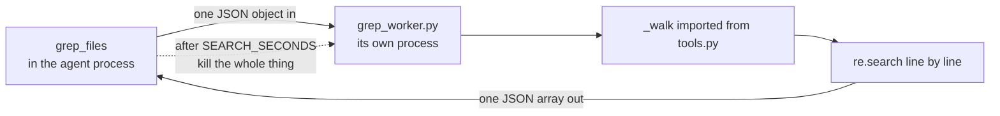

[อ่านภาษาไทย](README.th.md)

# Lesson 09. Search tools

This is the shortest lesson in part two and one of the most consequential. You
are going to add two tools, a shared walk over the workspace, and one small
second file that runs in its own process, and the agent will stop being a thing
you point at files and start being a thing that finds its own way around a code
base.

You are also going to spend a long section on something you will not build, and
that section matters as much as the code. Almost everybody who reaches this
point in a course expects the next word to be "embeddings". It is not, and the
reasons are worth understanding properly rather than taking on trust.

Files in this folder.

```text
lessons/09-search-tools/
  tools.py       lesson 08's tools, plus glob_files and grep_files at the bottom
  grep_worker.py the half of grep_files that runs in a separate process
  providers.py   unchanged from lesson 06
  agent.py       unchanged from lesson 06
  check.py       proves the two new tools work and that .venv is skipped
  README.md      this file
```

`tools.py` changed and `grep_worker.py` is new. `agent.py` and `providers.py`
are byte for byte what they were three lessons ago. That is worth noticing on
its own. The loop learns a new capability without a single edit, because a tool
is a schema plus a function in a dictionary and nothing else in the program
needs to know.

`grep_worker.py` is the surprising file in that list, and section 5 is where it
is explained properly. The short version is that a regular expression written by
a model can run for longer than the age of the universe, that nothing inside the
process running it can make it stop, and that the only thing you can reliably
kill is another process. So the matching happens in one.

## 1. The problem left over from lesson 08

Lesson 07 gave the agent four ways to touch files, and lesson 08 gave it a
shell. Here is the complete list of what it can do right now.

| Tool | What it needs from you |
| --- | --- |
| `read_file` | the exact path |
| `write_file` | the exact path |
| `edit_file` | the exact path, plus the exact text to replace |
| `list_files` | the exact directory |
| `run_shell` | a command, and your approval |

Read the right hand column. Four of the five tools require you to already know
where the thing is. The agent cannot answer "where is the function that parses
tool arguments" without you first answering it.

Watch what actually happens if you ask anyway. The agent has `list_files`, so
it can crawl. This repository has 42 directories and 251 Python files once you
ignore the virtual environment and the git store. So the agent calls
`list_files` on the root, sees `src/`, calls it again, sees
`src/agentpath/`, calls it again, and so on down. That is 42 round trips to the
model before it has read a single line of code. Every one of those round trips
is a full HTTP request carrying the entire conversation so far.

Then it starts guessing which files to open. `read_file` returns up to 4000
characters, which was the `MAX_OUTPUT` cap you wrote in lesson 07. Those 251
files hold 987,154 characters of source in total, which is roughly 247,000
tokens. If the agent reads them all looking for one function, it has poured
247,000 tokens into the conversation, and because the conversation is resent in
full on every subsequent request, it pays for those tokens again on every turn
for the rest of the session. Lesson 02 taught you that the model has no memory
and the history is the memory. This is the bill for that arriving.

And that is the good case, where the agent is patient. The realistic case is
that after four or five reads it runs out of budget or patience, guesses, and
edits the wrong file.

So in practice you do not let it crawl. You do this instead.

```text
You: the tool argument parsing is in src/agentpath/providers/base.py,
     around line 47, add a check for a null argument object
```

Look carefully at what just happened there. You opened your editor, you
searched, you found the file, you found the line, and then you typed it into a
chat box so that a language model could do the typing. You did the finding and
it did the typing. That is exactly backwards. Finding is the part a machine is
good at and you are slow at. Typing is the part you are fine at.

The whole point of the next two tools is to flip that back the right way round.

## 2. The two ways humans find things in a code base

Stop and think about what you actually do when you open an unfamiliar
repository and need to find something. Not what you think you should do. What
your hands do.

There are two moves, and only two.

The first is finding a file by its name. You know it is called something
like `settings`, or you know it is a test, or you know it ends in `.tsx`.
In an editor this is the fuzzy file finder, the box that opens when you
press control p. On the command line it is `find` or `ls`. You are
searching over file names, not file contents.

The second is finding text inside files. You know a string that appears in
the code. A function name, an error message a user reported, a configuration
key, a magic number. You do not know which file it lives in and you do not
care yet. In an editor this is search across files. On the command line it is
`grep`.

That is the whole toolkit. Watch a senior engineer land in a codebase they have
never seen and they will use those two moves, alternating, narrowing as they
go. Grep for the error message. That gives three files. Glob for the tests near
one of them. Read the test. Grep for the helper the test imports. Read that.
Done.

Now here is the claim of this lesson, and it is stronger than it looks.

Those same two tools are all a coding agent needs. Not a reduced set to get
started with, not a placeholder until you build something proper. The right
answer.

The reason is that the agent works in the same medium you do. Code is written
by people who name things deliberately so that other people can find them. A
function called `parse_arguments` is called that on purpose. An error message is
a unique string on purpose. A test file is named after the thing it tests on
purpose. A code base is not an undifferentiated pile of text that has to be
searched by meaning. It is a structure that has already been indexed by hand,
by every developer who chose a name, and the index is the names themselves.

There is a second reason, and it is about the loop rather than the tools. Your
agent does not get one shot. It searches, reads the result, and searches again
with what it learned. Lesson 04 built exactly that loop and lesson 08 proved it
survives a real shell. Two crude tools inside a loop that can refine are worth
far more than one clever tool that gets a single attempt, and the rest of this
chapter keeps coming back to that fact.

So when the design here looks too simple, that is not a compromise made for a
tutorial. Giving the agent the same two tools a developer uses is the right
answer, and section 3 is about why the more impressive looking alternative is
usually the wrong one.

## 3. This is where people expect a vector database, and why we are not building one

If you have read anything at all about building with language models in the
last few years, you have met the phrase retrieval augmented generation, usually
shortened to RAG. It is very likely the thing you expected this chapter to be
about. So let us take it seriously, describe it accurately, and then be honest
about where it fits.

### What retrieval augmented generation actually means

The idea starts from a real limitation. A model can only see what is in the
conversation, and the conversation has a size limit. If you have ten thousand
pages of documentation, you cannot paste them in. So you find the handful of
pages that are relevant to the question and paste only those. Retrieval, then
augmentation of the prompt, then generation. Hence the name.

The interesting part is how you decide what is relevant. The standard answer
has three steps.

The first step is chunking. You cut every document into pieces small enough
to fit in a prompt. Perhaps five hundred words each, often with a little
overlap between neighbours so that a sentence spanning a boundary is not
lost.

The second step is embedding. You send each chunk to a model whose job is not
to write text but to turn text into a list of numbers, typically several
hundred or a couple of thousand of them. That list is called a vector or an
embedding. The useful property is that pieces of text with similar meanings
get vectors that are close together in that space, even when they share no
words at all. "The cat sat on the mat" and "a feline was resting on the rug"
land near each other. You store all those vectors in a database built to
answer one question fast, which is "which stored vectors are nearest to this
one".

The third step is the query itself. When a question arrives, you embed the
question the same way, ask the database for the ten nearest chunks, and paste
those ten chunks into the prompt.

It is a genuinely good technique. It solved a real problem. The reason it is
famous is that it works.

### Why it is a poor fit for code

Now apply each of those three steps to a Python file and watch what breaks.

Chunking destroys the structure that makes code meaningful. A five hundred word
window through source code does not respect anything. It cuts a function in
half. It separates a decorator from the function it decorates, a `try` from its
`except`, a class from the methods that give it meaning. Worse, it strips the
context that tells you what you are looking at. A chunk containing a method
called `run` may not contain the class name, the imports, or the file path, and
without those the chunk is nearly meaningless. Prose degrades gently when you
cut it in the wrong place. Code does not. A function body without its signature
is not a slightly worse version of the function, it is a fragment that could
belong to anything.

Run the window over this project and see what falls out. `providers.py` from
lesson 06 is about two hundred lines, so a five hundred word window lands its
second cut somewhere inside `stream`. The chunk you get holds a `for` loop over
lines beginning `data: `, an `if` on a key called `delta`, and no class name, no
file path and no imports. There are two classes in that file with a method of
that name and a loop of that shape. Nothing in the chunk says which one it came
from.

Function names are already excellent search keys. This is the point that does
the most work. The whole reason embeddings are impressive is that they find
text that means the same thing while using different words. That is a
superpower when your corpus is prose written by many people who chose different
vocabulary for the same idea. It is close to worthless when the thing you are
looking for has exactly one spelling that appears everywhere it is used. If you
want the definition of `parse_arguments`, grepping for `parse_arguments` finds
it, finds every call site, and finds nothing else. There is no synonym problem
to solve, because programming languages do not have synonyms. A name either
matches or it is a different name, and the compiler enforces that far more
strictly than any embedding model could approximate.

The index goes stale the instant a file changes. This one is fatal in a way
people underestimate. Your agent's entire purpose is to edit code. The moment it
writes a file, every chunk from that file is wrong, and so is every vector built
from those chunks. You now need a rebuild. Rebuild the whole index and a medium
repository costs you minutes and a pile of embedding API calls on every edit.
Rebuild incrementally and you have to track which chunks came from which file
version, which is a cache invalidation problem, which is the thing everybody
quotes as one of the two hard problems in computer science. Compare that to
`grep`, which has no index, cannot go stale, and sees the file the agent wrote
one millisecond ago because it reads the file.

Put a session against it. An agent working a bug for twenty minutes touches six
files. A repository of three thousand chunks loses perhaps fifteen of them per
edit, so somebody has to decide, ninety times, which fifteen. Rebuild the whole
index instead and you are paying three thousand embedding calls and a couple of
minutes, and by the time it is current the agent has edited three more files.
The index is chasing a target that moves because the agent is the thing moving
it.

One similarity search cannot refine, and the agent can. A vector query is a
single shot. You embed the question, you get your ten nearest chunks, and that
is the answer you have to work with. There is no second attempt informed by the
first, because there is nothing in the result that tells you how to ask better.

The agent loop is the opposite of that. Watch a real sequence.

```text
grep_files("MCPError")                        -> 30 hits in 6 files
grep_files("class MCPError", "src/**/*.py")   -> 1 hit, src/agentpath/mcp.py:27
read_file("src/agentpath/mcp.py")
glob_files("test_mcp*.py")                    -> tests/test_mcp.py, the test that covers it
read_file the test
```

Each step is chosen because of what the previous step returned. That is a
search strategy, not a lookup, and it is only possible because the tools are
cheap enough to call four times and precise enough that the result of one tells
you what to ask next. Ten chunks of loosely related text cannot do that, no
matter how good the embedding model is.

Add those four together and the conclusion is not close. For code, plain
searching is faster, cheaper, always current, needs no infrastructure, and
composes with a loop.

### The tools people actually use work this way

This is not a contrarian position taken for a course. It is what the serious
coding agents do. Look at the tool list any of them expose and you will find a
file name matcher and a content search, usually with an option to restrict the
search to a glob, returning file names and line numbers. Some of them shell out
to `ripgrep` rather than walking the tree in their own language. That is a
performance decision, and section 8 covers it. The shape of the tool is the
same shape you are about to write.

If you have used one of those agents and watched its tool calls scroll past, you
have seen this already. It greps. It reads the file around the hit. It greps
again with a narrower pattern. There is no vector database in that trace,
because none is needed.

### Where vector search genuinely wins

Now the fair part, because the argument above is about code, and it does not
generalise the way people on either side of this debate tend to claim.

Vector search wins, clearly and by a lot, when three things are true at once.

The corpus is large and unstructured prose. Support tickets, research
papers, policy documents, internal wiki pages, transcripts, years of email.
Text with no naming discipline, written by many people over a long period.

The question is about meaning rather than words. "What is our policy on
refunding annual plans" needs to match a document that says "yearly
subscriptions may be reimbursed within thirty days" and never uses the word
refund or the word policy. Keyword search fails that outright. This is the
synonym problem, and embeddings genuinely solve it.

The corpus changes slowly. A knowledge base rebuilt nightly is fine. Staleness
costs you a day, not a millisecond, and nobody is editing the corpus in the
middle of the query.

Those are real and common situations. If your agent's job is answering
questions over ten thousand support tickets, build the vector index and do not
let this chapter talk you out of it. The mistake is not using embeddings. The
mistake is reaching for them by default because they sound sophisticated,
without checking whether your corpus has the three properties that make them
pay.

There is also a middle ground worth knowing exists. Real systems often combine
keyword search and vector search, take both result lists, and merge them. That
is called hybrid retrieval and it frequently beats either one alone.

Lesson 16, in part three, is entirely about making this decision properly. It
walks through the corpus properties, the cost model, the staleness question,
and builds a small vector index so you can measure the difference for yourself
instead of arguing about it. This chapter is not the argument against
retrieval. It is the argument for checking first, and for code the check comes
out on the side of the two tools you already know.

## 4. Writing glob_files

Open `tools.py` and scroll to the bottom. Everything above the lesson 09
marker is untouched.

```python
# Lesson 09 adds the search tools. Everything above is unchanged from lesson 08.

import json
import subprocess
import sys
import fnmatch  # noqa: E402
import re  # noqa: E402

MAX_RESULTS = 200
```

Five modules from the standard library and one new cap. Section 7 is about the
cap. `fnmatch` and `re` do the matching, and `json`, `subprocess` and `sys` are
there because half of `grep_files` runs somewhere else, which is section 5.

### The walk

Both tools need the same thing first, which is a way to visit every file worth
visiting. That gets its own function.

```python
def _walk():
    """Yield every file in the workspace that a search is allowed to look at.

    Two exclusions happen here. Directories such as .venv are skipped because
    searching them buries the real answer in thousands of irrelevant hits.
    Credential files are skipped because otherwise search would be a way
    around the refusal in read_file, and a rule that one tool honours and
    another ignores is not a rule at all.
    """
    for path in WORKSPACE.rglob("*"):
        if not path.is_file():
            continue
        relative = path.relative_to(WORKSPACE)
        if any(part in SKIP_DIRECTORIES for part in relative.parts):
            continue
        try:
            # The same gate every file tool uses, rather than a check on the
            # name. rglob follows symlinks and Windows junctions, so a link
            # planted inside the workspace would otherwise let search read
            # anything on the machine while read_file correctly refused.
            # Looking at the name of the link never sees the name of what it
            # points at.
            resolve_inside(str(relative))
        except WorkspaceError:
            continue
        yield path
```

`WORKSPACE`, `SKIP_DIRECTORIES` and `resolve_inside` all come from lesson 07 and
are reused unchanged. `rglob("*")` walks the whole tree recursively and yields
both files and directories, which is why the `is_file()` check is there. The
leading underscore on the name is the Python convention for "this is internal,
it is not one of the tools".

Two of those tests are refusals rather than plumbing, and each gets its own
section. The `SKIP_DIRECTORIES` test is section 6 and it is about cost. The
`resolve_inside` call is section 5 and it is about a key you can never take back
out of a conversation, and about a link that leads out of the workspace
entirely.

It is a generator, which matters more than it looks. `yield` means files come
out one at a time as the walk proceeds rather than being collected into a list
first. On a large tree that is the difference between holding one path in
memory and holding a hundred thousand, and it is also what lets the grep worker
stop walking early in section 7.


### fnmatch

Now the tool itself.

```python
def glob_files(pattern):
    matches = []
    for path in _walk():
        relative = path.relative_to(WORKSPACE).as_posix()
        if path_matches(relative, path.name, pattern):
            matches.append(relative)
    if not matches:
        return f"no files match {pattern}"
    return truncate("\n".join(sorted(matches)[:MAX_RESULTS]))
```

`fnmatch` is a standard library module that answers one question. Does this
name match this shell style pattern. It knows four things and nothing else.

| Pattern | Meaning |
| --- | --- |
| `*` | any run of characters, including none |
| `?` | exactly one character |
| `[abc]` | one character from the set |
| `[!abc]` | one character not in the set |

That is the entire language. It is the same wildcard syntax your shell uses
when you type `ls *.py`, which is exactly why it is the right choice here. The
model has read a great deal of shell and a great deal of documentation, so it
already knows how to write `*.py` and `test_*.py` without being taught. Picking
a syntax the model already speaks is a real design consideration and it will
come up again in lesson 10.

`as_posix()` is there for Windows. On Windows, `Path` renders separators as
backslashes, so a relative path would come out as `src\main.py`, and a model
that has read a million glob patterns will send `src/*.py` with forward
slashes and never match. `as_posix()` forces forward slashes, so the same
pattern behaves identically on every operating system. This is a small line
that prevents a bug which is genuinely maddening to diagnose, because the tool
works perfectly for the person who wrote it and silently returns nothing for
half your readers.

Picture the version without it. A reader on Windows asks the agent to look at
the source, the model sends `src/*.py`, and the walk compares that against
`src\main.py`. The backslash is not a slash, so nothing matches, and the tool
answers `no files match src/*.py`. The model has no reason to doubt a tool. It
concludes there is no `src` directory and offers to create one.

### Why we match three times

Here is the code that deserves the most attention, and it is not inside
`glob_files` at all. It is a helper with a name, because `grep_files` has to
make exactly the same decision and a rule written down twice is a rule that will
eventually disagree with itself.

```python
def path_matches(relative, name, pattern):
    """Decide whether one file matches a glob the way a person would expect.

    Three attempts are made because fnmatch is stricter than people are. The
    pattern is tried against the path inside the workspace, then against the
    bare file name so that main.py works from anywhere, and then with a
    leading star star slash removed so that a pattern like **/*.py also
    finds files sitting at the top level. Without that third attempt the
    most common pattern a model writes silently misses every file that is
    not inside a subdirectory.
    """
    if fnmatch.fnmatch(relative, pattern) or fnmatch.fnmatch(name, pattern):
        return True
    return pattern.startswith("**/") and fnmatch.fnmatch(relative, pattern[3:])
```

Every file is tested up to three times. Once against its full relative path such
as `src/agentpath/tools/search.py`, once against its bare name, which is just
`search.py`, and once against the path again with a leading `**/` cut off the
pattern. Any match counts.

The reason is that `fnmatch` has one property that surprises people. Its `*`
matches any character at all, including the path separator. It is not the
directory aware globbing that git or your shell does. Run it yourself and the
behaviour is clear.

```python
>>> import fnmatch
>>> fnmatch.fnmatch("src/main.py", "*.py")
True
>>> fnmatch.fnmatch("agent.py", "**/*.py")
False
>>> fnmatch.fnmatch("tests/test_x.py", "test_*.py")
False
>>> fnmatch.fnmatch("test_x.py", "test_*.py")
True
```

Read those four results in order, because each one explains part of the design.

The first says `*.py` already searches the whole tree when matched against the
relative path, since `*` happily eats the slashes. So path matching alone
handles the recursive case.

The second says `**/*.py` fails on a file sitting at the top of the workspace.
The pattern requires a literal `/` somewhere, and a file in the root has none.
Models write `**/*.py` constantly because that is what git and most modern
tools use for "everywhere", so this case has to work. That single false is the
entire reason the third attempt exists. Strip the leading `**/` and the pattern
becomes `*.py`, which matches `agent.py` in the root and, because `*` eats
slashes, still matches everything below it as well. The tool ends up doing what
the model meant rather than what it literally typed.

The third and fourth are the pair that make the point about the name. `test_*.py`
is an extremely natural thing to ask for, and it fails against the full path
`tests/test_x.py` because the path does not start with `test_`. Matched against
the bare name `test_x.py` it succeeds immediately.

So the match against the path handles patterns that describe location, the match
against the name handles patterns that describe the file itself, and the match
against the trimmed pattern handles the one spelling of "everywhere" that models
reach for most. Take any of the three away and a whole category of reasonable
request silently returns nothing. And silently returning nothing is the worst
possible failure here, because the model will conclude the file does not exist
and act on that.

You could instead translate the pattern into a proper recursive glob, or use
`pathlib`'s own `rglob`, which does understand `**`. The reason we do not is
that both approaches make one syntax work perfectly and every neighbouring
syntax fail. Three cheap attempts make the tool forgiving of every pattern a
model is likely to produce, and forgiving is worth more than principled in a
tool whose caller cannot read the source.

Notice also where the forgiveness is spent. You could teach the model the exact
syntax instead, by writing the rules into the tool description, but a tool
description is sent on every single request for the rest of the session and
costs tokens every time. Accepting the pattern people actually write costs three
lines once.

Here is the real output, run against this project's `src` directory.

```text
--- glob_files("**/*.py")
agentpath/__init__.py
agentpath/agent.py
agentpath/cli.py
agentpath/prompt.py
agentpath/providers/__init__.py
agentpath/providers/anthropic.py
agentpath/providers/base.py
agentpath/providers/openai_compat.py
agentpath/testing/__init__.py
agentpath/testing/mock_server.py
agentpath/tools/__init__.py
agentpath/tools/base.py
agentpath/tools/files.py
agentpath/tools/search.py
agentpath/tools/shell.py
agentpath/tools/workspace.py
agentpath/types.py

--- glob_files("mock_server.py")
agentpath/testing/mock_server.py
```

Both calls returned paths relative to the workspace, which is exactly the form
`read_file` wants. The agent can take any line of that output and hand it
straight to the next tool with no editing. That is not an accident, it is the
main reason the output format is what it is.

Two smaller decisions in the last two lines.

`sorted` makes the output deterministic. Filesystem walk order is not
guaranteed and differs between operating systems, and an agent that gets a
different ordering on every run is harder to debug and harder to cache.

`f"no files match {pattern}"` is a sentence, not an empty string. An empty
result sent back to the model is ambiguous, because the model cannot tell
whether the tool found nothing or the tool broke. A sentence that repeats the
pattern back tells it both that the search ran and what it searched for, which
is enough for it to try a different pattern. This is the lesson 07 principle
that errors are messages, applied to a non error.

## 5. Writing grep_files

The second tool searches inside files rather than over names. It is also the
only tool in this course that hands untrusted input to an engine which can run
for an unbounded length of time, so it is longer than you are expecting.

```python
def grep_files(pattern, glob="*"):
    try:
        re.compile(pattern)
    except re.error as error:
        return f"Error: {pattern} is not a valid regular expression ({error})"
    if NESTED_QUANTIFIER.search(pattern):
        return (
            f"Error: {pattern} has one repeat wrapped in another, which can take "
            "effectively forever to match. Write it without the nested repeat."
        )

    # The search runs in a separate process. Two earlier attempts at this did
    # not work and both are worth knowing about. Checking a deadline between
    # lines never gets a turn, because one line is enough to go exponential
    # and nothing interrupts a regular expression that is already running.
    # Moving it to a thread does not help either, because matching does not
    # release the global interpreter lock, so the thread waiting on the
    # deadline cannot run until the matching it waits on has finished.
    #
    # A separate process can simply be killed, which is the only thing that
    # actually works. The cost is about a tenth of a second of start up.
    request = json.dumps({"root": str(WORKSPACE), "pattern": pattern, "glob": glob})
    try:
        # -I matters more than it looks. Without it, the directory the child
        # starts in goes first on the import path, and that directory is the
        # workspace. A file the agent wrote there called json.py would be
        # imported and run before the search began, with no permission check,
        # because searching is a safe tool. -I removes it and ignores the
        # environment variables that could put it back.
        worker = Path(__file__).with_name("grep_worker.py")
        completed = subprocess.run(
            [sys.executable, "-I", str(worker)],
            input=request,
            capture_output=True,
            text=True,
            encoding="utf-8",
            timeout=SEARCH_SECONDS,
            cwd=str(worker.parent),
        )
    except OSError as error:
        return f"Error: the search could not be started. {error}"
    except subprocess.TimeoutExpired:
        return (
            f"Error: searching for {pattern} took longer than {SEARCH_SECONDS} "
            "seconds and was given up on. Try a simpler pattern, or narrow the "
            "search with the glob argument."
        )
    if completed.returncode != 0:
        return f"Error: the search failed. {completed.stderr.strip()[:200]}"
    hits = json.loads(completed.stdout or "[]")
    if not hits:
        return f"no matches for {pattern}"
    return truncate("\n".join(hits))
```

Notice what is not in that function. There is no loop over files and no call to
`search` on a line. `grep_files` never matches anything. It checks the pattern,
starts a second Python process, waits five seconds for an answer in JSON, and
formats whatever comes back. The matching itself lives in `grep_worker.py`.

That shape is the whole subject of this section, and it is easiest to read as
three layers stacked in front of the same danger, followed by the worker, and
then the ordinary result formatting `glob_files` already taught you.

### Layer one. The compile step, and why a bad pattern is a message

```python
    try:
        re.compile(pattern)
    except re.error as error:
        return f"Error: {pattern} is not a valid regular expression ({error})"
```

The compiled object is thrown away, which looks like a mistake and is not. This
call is a validity test, not a preparation step. The matching happens in another
process, and that process compiles the pattern again for itself, so nothing
compiled here could be handed to it anyway.

What it buys is the ability to reject a broken pattern in the parent, before a
process is started, before a file is opened, and before five seconds of anybody's
life are spent. A regular expression is a small program, and the model writes it.
Models write broken regular expressions regularly, usually by forgetting to
escape a bracket or a parenthesis that they meant literally. Searching for a
function call by typing `def (` is an extremely natural mistake, and it is not a
valid expression.

Now consider the two things that could happen next.

If the exception escapes, `tools.run` catches it with the broad handler you
wrote in lesson 07 and turns it into this.

```text
Error: error: missing ), unterminated subpattern at position 4
```

That is technically a message rather than a crash, which is already better than
nothing, but it does not name the tool, does not repeat the pattern, and uses
the word `error` twice for two different things. The model has to guess what it
did wrong.

If we catch it here, the model gets this.

```text
Error: def ( is not a valid regular expression (missing ), unterminated subpattern at position 4)
```

That sentence contains the pattern it sent, the fact that the problem is the
pattern rather than the file system, and the exact position of the mistake. The
model reads it, escapes the parenthesis, and calls again. The failure costs one
turn instead of ending the task.

This is the general principle from lesson 05, showing up in a third place. A
tool talks to a model, and the model can only act on what the message says. An
exception is a message to a developer reading a stack trace. A returned string
is a message to the caller, and here the caller is a model that is perfectly
capable of fixing its own mistake if you tell it what the mistake was.

### Layer two. The guard that reads the pattern before running it

A pattern can be perfectly valid and still be a disaster. `re.compile` accepts
`(a+)+$` without complaint, and matching that against thirty characters of the
letter a takes longer than you will wait. This is called catastrophic
backtracking, and the cause is a repeat wrapped inside another repeat, which
gives the engine an exponential number of ways to split the input between the
two. Three more constants sit above `_walk` for this.

```python
# Two quantifiers stacked on one group, as in (a+)+ or (a*)*, is the shape
# that makes a regular expression take exponential time. A model writing one
# by accident would otherwise wedge the whole process, and no cancellation
# token can help because the matching never returns to check one.
NESTED_QUANTIFIER = re.compile(r"\([^()]*[+*][^()]*\)\s*[+*{]")

# A line longer than this is truncated before matching. Catastrophic
# backtracking grows with the length of the input, so bounding the input is
# the one guard that works whatever the pattern turns out to be.
MAX_LINE = 2000

SEARCH_SECONDS = 5
```

The first one is a regular expression that reads regular expressions. It looks
for a group containing `+` or `*`, followed by another `+` or `*` or `{`. That
is the classic exploding shape, and when it is found the tool refuses before
anything runs.

```python
    if NESTED_QUANTIFIER.search(pattern):
        return (
            f"Error: {pattern} has one repeat wrapped in another, which can take "
            "effectively forever to match. Write it without the nested repeat."
        )
```

Why check the pattern at all when there is already a timeout further down. Two
reasons. A refusal is instant and a timeout costs five seconds of wall clock time
in a loop the user is watching, and the refusal is a sentence the model can act
on while a timeout only tells it that something was slow. `Write it without the
nested repeat` is a repair instruction. `it took too long` is a shrug.

Why not rely on the guard alone and skip the process work. Because this guard
cannot be complete and it is important to say so plainly. It recognises one
known shape. Slow regular expressions are a much larger family than anyone can
enumerate, and a pattern that is safe against one input can explode against
another. A list of bad shapes is a filter, not a proof.

That is what `MAX_LINE` is for, and it is the guard that does not depend on
recognising anything. Backtracking blows up as a function of the length of the
subject, so bounding the subject bounds the damage whatever the pattern turns
out to be. Two thousand characters is long enough that a real line of source is
never cut in a way that loses a match, and short enough that even a bad pattern
finishes. It is applied in the worker, on the line, at the moment of matching.

`SEARCH_SECONDS` is the last resort behind both of them, and it is the subject
of the next part.

### Layer three. Why the deadline has to be another process

This is the part worth slowing down for, because the two designs everybody
reaches for first are both wrong, and being able to say why is more valuable
than the code itself.

The first idea is to check the clock between lines. Read the deadline, match a
line, look at the clock, give up if the budget is spent. It does not work,
because a single line is enough to go exponential. The check sits after the call
that never returns. Code that never gets a turn is not a deadline, it is a
comment.

The second idea is to move the matching into a thread and have another thread
watch the clock. This one fails for a reason specific to Python. Matching does
not release the global interpreter lock, which is the lock that lets exactly one
thread run Python at a time. The watcher thread cannot be scheduled until the
matching it is waiting on has already finished, at which point there is nothing
left to interrupt. Threads let you wait on things. They do not let you take the
processor away from a piece of C code that has no intention of giving it back.

And there is no third clever variant. You cannot cancel a running regular
expression from inside the process running it, because cancellation in Python is
cooperative and this code never cooperates.

Get a feel for the size of the thing you are trying to interrupt. `(a+)+$`
against thirty characters of the letter `a` has roughly a billion ways to split
that run between the two repeats, and the engine tries them. A machine getting
through ten million of those a second is still working an hour later. Add one
more character to the line and the hour becomes two. This is not a slow search
that will finish if you are patient. It is a search that finishes after you have
retired.

What is left is the operating system. A separate process can be killed by
something outside it, unconditionally, without its agreement. That is the only
mechanism in the list that does not require the runaway code to volunteer.



```python
        completed = subprocess.run(
            [sys.executable, "-I", str(worker)],
            input=request,
            capture_output=True,
            text=True,
            encoding="utf-8",
            timeout=SEARCH_SECONDS,
            cwd=str(worker.parent),
        )
```

`sys.executable` is the same interpreter that is already running, so the child
is guaranteed to be the right Python and the right virtual environment. `input`
and `capture_output` mean the two processes speak over pipes, with the request as
one JSON object in and the list of hits as one JSON array out. `timeout` is the
part that matters, and when it expires `subprocess.run` kills the child and
raises.

```python
    except subprocess.TimeoutExpired:
        return (
            f"Error: searching for {pattern} took longer than {SEARCH_SECONDS} "
            "seconds and was given up on. Try a simpler pattern, or narrow the "
            "search with the glob argument."
        )
```

Notice that this is a returned sentence rather than an exception, and that it
tells the model two specific things it can do next. That is the same rule as the
compile step, applied to a failure the model did not know was possible.

The price is written in the code as a comment, which is where a price belongs.
Starting a Python process costs roughly a tenth of a second, and every single
search pays it, including the ones that would have finished in a millisecond.
That is a real cost and it is worth it, because the alternative is an agent that
can be stopped dead by one unlucky pattern.

### Why the child runs with `-I` and in a folder we choose

Two arguments in that call are not about performance and are easy to skip past.

```python
        worker = Path(__file__).with_name("grep_worker.py")
```

The worker is found next to `tools.py`, not relative to wherever the program was
started. That is what makes the tool work no matter which directory the agent
was launched from.

The interesting one is `-I`, isolated mode, together with `cwd`. To see why they
matter, remember what normally happens when Python starts a script. The directory
the script is in goes on the front of the import path, and so, under some
invocations, does the directory the process started in. First on the path wins.
So the first `import json` in the child imports the first `json.py` the
interpreter finds, and if a file with that name sits in the folder the process
started in, that file is imported and its top level code runs.

Now put that next to what this agent does for a living. It writes files into the
workspace. It writes them because a model asked it to, and the model can be
talked into things by text it read out of a file. If the child process started in
the workspace, then a file the agent had written called `json.py` would be
imported and executed the moment the search began. Not matched, not read as data.
Executed, as Python, inside your interpreter, with your permissions.

The worst part is the approval story. Lesson 08 put a person in front of
`run_shell` because running commands is obviously dangerous. Nobody puts a
confirmation prompt in front of a search, because searching is a safe tool that
reads and returns text. So this path executes code with no prompt at all, on the
strength of a tool the user has correctly decided is harmless.

`-I` removes the script directory and the current directory from the import path
and ignores the environment variables such as `PYTHONPATH` that could put them
back. `cwd=str(worker.parent)` starts the child in the lesson folder rather than
in the workspace, so even a mistake about the path lands somewhere the agent
cannot write. The two together mean the child imports only the standard library
and the one file we point it at.

### grep_worker.py, and why the rules are imported rather than copied

The other half of the tool is a file of its own.

```python
"""The part of grep_files that runs in its own process.

It lives in a separate file so it can be killed. A regular expression that
takes exponential time cannot be interrupted from inside the process running
it, so the only way to put a limit on a search is to run it somewhere that
can be shut down from outside.

The rules about which files may be searched are imported from tools.py
rather than copied here. An earlier version of this file had its own copy of
the secret names and the skip list, which is exactly what lesson 09 tells
you not to do. Two copies agree until the day somebody edits one.
"""
import json
import sys
from pathlib import Path

# Isolated mode removes every directory from the import path, including the
# one this file lives in, so the lesson folder has to be put back by hand.
# Only this folder, and never the folder the agent is working in, which is
# the whole point of starting isolated in the first place.
sys.path.insert(0, str(Path(__file__).resolve().parent))

import tools  # noqa: E402
```

Why a separate file rather than a function, a flag or a thread. Because the unit
the operating system can kill is a process, and the unit a process can be started
from is a file. Everything smaller than a file shares the interpreter with the
code that is trying to stop it, and layer three above has already been through
why that fails. The file boundary is not a style choice, it is the smallest thing with a
kill switch.

Why does it put the lesson folder back on `sys.path` by hand. Because `-I` took
every directory off, including the one the worker itself lives in, so importing
`tools` would fail. The insert adds back exactly one directory, the one computed
from the worker's own location. It never adds the workspace. Isolated mode is
kept and one known door is opened, rather than isolated mode being abandoned.

And the important one. Why import the rules from `tools.py` instead of writing
them here. The worker needs `_walk`, `path_matches`, `MAX_LINE` and
`MAX_RESULTS`. Every one of those is a rule about what a search may see and how
much of it may come back. Copying them into this file would produce a second
statement of the same rules, and a second statement is a thing that can drift.
The docstring is honest that this already happened once, with the secret names
and the skip list living in two places.

Think about what drift means here. Somebody adds `.pgpass` to `SECRET_NAMES` in
`tools.py`, the copy in the worker is not touched, and now `read_file` refuses
the file while `grep_files` prints it. Nothing crashes. No test fails unless
somebody thought to write that exact test. The rule is still in the code, in
writing, and it is no longer enforced.

This is the same argument the end of this section makes about the walk and the
same one lesson 07 makes about `resolve_inside`, arriving for the third time in three
lessons. A rule enforced in one place is a rule. A rule written down in two
places is a coincidence waiting to end.

### The glob filter

```python
        relative = path.relative_to(root).as_posix()
        if not tools.path_matches(relative, path.name, glob):
            continue
```

The optional second parameter narrows the search to matching files, and it calls
the same `path_matches` helper `glob_files` uses, which is why a `glob` argument
behaves exactly like a `pattern` argument. The default is `"*"`, which matches
everything, so the parameter is genuinely optional and the schema marks only
`pattern` as required.

This exists because the agent frequently knows something about where to look
even when it does not know the file. Searching for the word `test` across every
file in a repository is nearly useless. Searching for it in `*.py` is a
different question with a useful answer. Giving the model a way to say the
thing it already knows keeps the result list short, and short result lists are
the entire economics of this chapter.

### Skipping files that are not text

```python
        try:
            text = path.read_text(encoding="utf-8")
        except (UnicodeDecodeError, OSError):
            continue
```

A real repository contains PNGs, compiled binaries, database files and fonts.
`read_text` on any of those raises `UnicodeDecodeError`, and a file that has
been deleted between the walk and the read, or that the process has no
permission to open, raises `OSError`. Neither is worth reporting. The file is
simply skipped and the walk continues. This runs in the worker, so a file the
child cannot open costs one skipped iteration and never reaches the parent as an
error.

Note the deliberate contrast with lesson 07, where `read_file` passes
`errors="replace"` so that a partly broken text file still comes back with
substitution characters rather than failing. That is right when a human asked
for that specific file, because something is better than nothing. It is wrong
here, because a binary file will happily produce thousands of replacement
characters and a pattern like `.` will match every line of a JPEG. Same
library call, opposite decision, because the caller's intent is different.

### The file name and the line number

This is the part that makes the tool useful rather than merely correct, and it
is the innermost loop of the worker.

```python
        for number, line in enumerate(text.splitlines(), start=1):
            if expression.search(line[: tools.MAX_LINE]):
                hits.append(f"{relative}:{number}: {line.strip()[:200]}")
                if len(hits) >= tools.MAX_RESULTS:
                    return hits
```

`line[: tools.MAX_LINE]` is the guard from layer two arriving where it actually
does its work. The subject handed to the engine is never longer than two
thousand characters, whatever the file contains and whatever the pattern turned
out to be.

`enumerate(..., start=1)` counts from one because that is how editors and
compilers and every other tool number lines. Counting from zero here would be
technically consistent with Python and wrong for every consumer of the output.

The format is the path, the line number, and the matching line, which is
deliberately the same shape `grep -n` has produced for decades. Here is what it
looks like.

```text
agentpath/providers/base.py:21: def parse_arguments(raw: str) -> tuple[dict, str]:
agentpath/providers/openai_compat.py:16: def to_wire(message: Message) -> dict:
agentpath/testing/mock_server.py:47: def decide(messages):
agentpath/tools/search.py:18: def _walk(root: Path):
agentpath/tools/workspace.py:27: def resolve_inside(root, path) -> Path:
```

Now ask why the line number is in there at all, given that the model cannot
seek to a line with any tool it has. `read_file` takes a path and returns the
first 4000 characters. There is no `read_lines`.

The answer is that the line number is not for a tool. It is for the model's
reasoning about which hit to pursue and what it will find when it gets there.
A hit at line 21 of a file is near the top, so reading the file will reach it.
A hit at line 900 tells the model the file is large, that a plain `read_file`
will truncate long before the interesting part, and that it should narrow with
another grep or read the file through the shell instead. The number is
information about the shape of the code base, and the model uses it to plan.

The file name is doing something even more important, which is turning a search
result into the input of the next tool call. `agentpath/tools/search.py` is
exactly what `read_file` wants. The output of one tool is the argument of the
next, with no transformation in between. Design every tool that way and the
agent can chain them without inventing anything. Return a pretty summary with
no paths in it and the chain breaks at the first link.

`line.strip()` removes indentation, which on deeply nested code can be twenty
wasted characters on every single hit. `[:200]` caps what one hit contributes to
the output, because a minified JavaScript file is one line of ninety thousand
characters and without the cap a single hit would fill the entire tool result.
Note that this is a different cap from `MAX_LINE` on the line above, and they
are not redundant. `MAX_LINE` bounds what the engine is asked to match, which is
about time. `[:200]` bounds what comes back, which is about the context window.
Those are the second and third of four caps in this lesson, and section 7 puts
all four together.

### The one thing the search tools do not inherit for free

There is a check in `_walk` that has nothing to do with search, and it is the
most important lines in this chapter.

In lesson 07 you built `resolve_inside`, and part of its job was refusing to
read credential files, so that a key could never enter the conversation. The
search tools do not read files through `resolve_inside`. They walk the tree
themselves and call `read_text` directly. Written the obvious way, they would
inherit nothing from that refusal, and you would have this.

```text
read_file(".env")   -> Error: this tool refuses to touch .env because credential
                       files must not enter the conversation or be changed by
                       an agent
grep_files("KEY")   -> .env:1: OPENAI_API_KEY=sk-secret-value
```

The front door locked and the window open. That is not a subtle bug, it is a
missing check, and it is exactly the kind of gap that appears when a safety
rule lives in one function rather than in the walk that every tool shares.

The obvious repair is to test the name in the walk, with the
`looks_like_a_secret` helper lesson 07 already gave you. That repair is what this
lesson shipped first, and it was not enough. Filtering on a name closes the
`.env` case and leaves a larger one wide open, so `_walk` sends every candidate
through the gate itself instead.

```python
        try:
            # The same gate every file tool uses, rather than a check on the
            # name. rglob follows symlinks and Windows junctions, so a link
            # planted inside the workspace would otherwise let search read
            # anything on the machine while read_file correctly refused.
            # Looking at the name of the link never sees the name of what it
            # points at.
            resolve_inside(str(relative))
        except WorkspaceError:
            continue
```

Here is why the name is not enough, and it is worth being precise about the
mechanism. `rglob` follows symbolic links, and on Windows it follows junctions
too. A symbolic link is a file whose contents are a path to somewhere else, and
the operating system quietly substitutes the target when anything opens it. So a
link sitting inside the workspace is visited by the walk like any other file, and
`read_text` on it reads whatever it points at, which can be anywhere on the
machine that the user can read.

Now look at what a name check sees in that situation. It sees the name of the
link. The name of a link is chosen by whoever created the link, and it has no
relationship at all to the name of the target. A link called `notes.txt` can
point at `/home/you/.ssh/id_rsa`. A link called `docs` can point at the root of
the drive. `looks_like_a_secret("notes.txt")` is `False`, correctly, and the
secret is read anyway. The check was not wrong about the name. It was looking at
the wrong object.

`resolve_inside` is not fooled, because resolving a path is exactly the operation
that follows the link and produces the real location. Once it has the real
location, both of its existing refusals apply on their own. A link pointing
outside the workspace fails the containment test, and a link pointing at a
credential file inside the workspace fails the name test on the target's real
name. Neither rule had to be rewritten. The walk simply stopped inventing its own
version of the question and asked the function that already knew the answer.

That is the shape a fix of this kind should have. Four lines, no new rule, and
the new lines are a call to the old gate. If you ever find yourself writing the
same safety rule a second time in different words, you are treating a symptom.

Try it against the real file in `lessons/09-search-tools/tools.py`. Put an
`.env` in a scratch workspace and both doors are shut.

```text
read_file(".env")   -> Error: this tool refuses to touch .env because credential
                       files must not enter the conversation or be changed by
                       an agent
grep_files("KEY")   -> no matches for KEY
glob_files("**/*")  -> the other files, and no .env in the list
```

Notice that `glob_files` is covered too, and it never reads a byte of any file.
That is the point of putting the check in the walk rather than in each tool. A
file name alone can be the leak. `secrets.prod.env` sitting in a listing tells
an attacker reading the conversation exactly what to ask for next.

The general lesson is worth more than the four lines. **A rule enforced at one
entry point is not enforced.** It has to live where every path passes through,
and every new tool that touches the same resource has to be routed to it rather
than given a filter of its own. `resolve_inside` is that place, the file tools
call it directly, `_walk` calls it for both search tools, and `grep_worker.py`
imports `_walk` rather than repeating any of it. One rule, one function, three
callers. Part 3 rebuilds the tools around exactly that idea.

## 6. Why we skip directories such as .git and .venv

This line appeared without comment in section 4.

```python
        relative = path.relative_to(WORKSPACE)
        if any(part in SKIP_DIRECTORIES for part in relative.parts):
            continue
```

`SKIP_DIRECTORIES` is the set you defined in lesson 07 for `list_files`, reused
here without change.

```python
SKIP_DIRECTORIES = {".git", ".venv", "__pycache__", "node_modules", ".ruff_cache"}
```

`.parts` breaks a path into its components, so this skips a file if any
directory anywhere above it is in the set. Checking every component rather than
just the immediate parent is what makes it work at depth, since a file buried
at `.venv/Lib/site-packages/httpx/_client.py` has `.venv` six levels up.

The `relative_to` on the line before is doing quiet work. Ask for the parts of
the absolute path and you are also testing every directory above the workspace,
which are directories the user chose and the agent has no business having an
opinion about. Put your project inside a folder that happens to be called
`node_modules` and every file would be skipped, both tools would return nothing
forever, and there would be no error message to tell you why. Comparing against
the relative path is one call, and it confines the rule to the tree the agent
is actually allowed to see.

Now the numbers, because this argument is much more convincing with real
figures than with the phrase "performance reasons".

This repository is small. It has one HTTP library and a test runner as
dependencies. Here is what is actually on disk.

```text
project Python files, ignoring .venv and .git      251
files inside .venv                                 999
Python files inside .venv                          599
files inside .git                                  558
size of .venv                                       41M
```

So a walk that does not skip anything visits 1808 files instead of 251. Seven
times the work to find the same answers, on a project with two dependencies. A
web application with a real dependency tree, or anything Node based with a
`node_modules` directory, runs to tens of thousands of files and hundreds of
megabytes. Thirty thousand files is completely ordinary. That is the wasted
time.

The wasted context is far worse, and it is the reason this matters more for an
agent than it would for you at a terminal. Search for the word `def` in this
repository's Python files and count the hits.

```text
matches in the project                            1279
matches inside .venv                              5935
characters of output from the .venv matches     563745
```

Nearly five times more noise than signal, and roughly 140,000 tokens of it.
That is larger than the entire context window of many models. It would not
merely be unhelpful, it would fail outright.

But suppose you have a very large context window and it fits. Now put that
result into the conversation and remember what lesson 02 taught you. The
conversation is resent in full on every request. Those 140,000 tokens of
`httpx` internals are now attached to every single message for the rest of the
session. You pay for them on every turn. The model reads them on every turn.
And on every turn they compete for the model's attention with the four lines
that actually matter.

That last point is the one people miss. The cost is not only money and latency.
A model given twenty irrelevant results and one relevant one is measurably
worse at picking the relevant one than a model given three results. Filling the
context with noise makes the agent dumber, not just slower.

There is one honest caveat left, and it points the other way. The set is hard
coded, so a project that keeps its bulk somewhere this course never heard of,
`vendor` or `target` or `.next` or `dist`, gets none of this protection. The
rule does not learn and it does not read your `.gitignore`. It is the second
exercise at the end of the chapter.

## 7. Why we cap the number of results

`MAX_RESULTS = 200`, and it is applied in both tools. In `glob_files` it is a
slice taken after the sort.

```python
    return truncate("\n".join(sorted(matches)[:MAX_RESULTS]))
```

In the worker it is a test inside the innermost loop, and the constant is
reached through the import rather than restated.

```python
                if len(hits) >= tools.MAX_RESULTS:
                    return hits
```

The reasoning is the same as section 6, so it can be short. A search that
matches ten thousand lines has not answered a question, it has moved the
problem. Nobody, model or human, can use ten thousand results. And every one of
those results goes into the conversation and stays there, paid for on every
subsequent turn.

The number 200 is not sacred and there is no principled derivation for it. It
is chosen so that a wide search still returns enough to be genuinely useful,
while the worst case output stays in the low thousands of characters. Tune it
for your own repository and your own model. What matters is that a bound
exists.

### How this connects to lesson 07's truncation

You now have four separate limits stacked on top of each other, plus a deadline
behind all of them, and it is worth seeing them as one system rather than five
unrelated numbers.

| Limit | Where it came from | What it bounds |
| --- | --- | --- |
| `MAX_LINE = 2000` | lesson 09 | how much of a line is matched |
| `[:200]` on a line | lesson 09 | one result line |
| `MAX_RESULTS = 200` | lesson 09 | how many result lines |
| `MAX_OUTPUT = 4000` | lesson 07 | the whole returned string |
| `SEARCH_SECONDS = 5` | lesson 09 | how long the whole search may take |

They compose, and each one catches a case the others cannot. Two hundred
matches of two hundred characters each would be 40,000 characters, so the
`truncate` from lesson 07 still fires and still appends its
`[truncated, N more characters]` note. Meanwhile a single matched line from a
minified bundle would blow past `MAX_OUTPUT` on its own, which is what the per
line cap prevents. And a search returning fifty thousand short matches would
pass the per line cap and pass `truncate`, but waste the whole walk, which is
what `MAX_RESULTS` prevents.

The first and the last of the five are a different kind of limit from the middle
three, and the difference is worth naming. `[:200]`, `MAX_RESULTS` and
`MAX_OUTPUT` bound how much text comes back, so they protect the context window.
`MAX_LINE` and `SEARCH_SECONDS` bound how much work happens, so they protect the
process. A tool that hands model written input to an engine needs both, because
a search that returns nothing after burning the machine for an hour has stayed
inside every output cap and still ruined the session.

The rule underneath all of them is the one from lesson 07, and it is the single
most important habit in tool design. Every tool result is permanent. It goes
into the conversation, it is sent again on every later request, and there is no
way to take it back. So every tool must have a bound on what it can return and a
bound on what it can spend, and both bounds belong in the tool rather than in a
hope that the caller is sensible.

### Why the two tools cap differently

Look again and notice the two tools do not stop the same way.

`glob_files` walks the entire tree, collects every match, sorts, and then takes
the first 200. The worker behind `grep_files` stops walking the moment it has 200
hits.

That difference is deliberate and it is about cost. `glob_files` only reads
directory entries, which is cheap, and it wants sorted output, which means it
needs all the names before it can decide which 200 come first. Stopping early
would give you the first 200 in filesystem order, which is arbitrary.

The worker opens and reads the contents of every candidate file, which is
enormously more expensive. Once it has 200 hits, continuing to read files is
pure waste, so it stops. The consequence is that grep results are in walk order
rather than sorted, and a capped grep shows you hits from wherever the walk
happened to be. That is a real trade, made knowingly. Reading a hundred
megabytes to produce output you are about to discard is worse than an arbitrary
ordering.

The way it stops is worth a sentence, because the obvious spelling would be a
bug. There are two loops here, one over files and one over the lines of the
current file, and a `break` in the inner one only ends the current file. The walk
would then carry on opening every remaining file in the repository and adding
nothing, which is the expensive half of the work with none of the benefit.
`return hits` leaves both loops and the function at once, which is what the
situation actually calls for. Two nested breaks would work too, and the return
says the same thing in one line without leaving a reader to check that the second
one is there.

## 8. Why we did not just call ripgrep

An obvious objection to everything above. `ripgrep`, the command line tool
`rg`, already does all of this. It is written in Rust, it is extremely fast, it
respects `.gitignore` automatically, it detects binary files properly, its regular
expression engine has no catastrophic backtracking to guard against in the first
place, and it has years of edge case handling that these few dozen lines do not.
And you already have `run_shell` from lesson 08. So why not make `grep_files` a
two line wrapper.

```python
def grep_files(pattern, glob="*"):
    return run_shell(f"rg -n --glob '{glob}' '{pattern}'")
```

Because it would not run on your machine, and this is a course.

`ripgrep` is not part of any operating system. It is not in the Python standard
library. It is not installed by `pip install`. A reader on a fresh Windows
laptop, or a locked down corporate machine, or a minimal Linux container, does
not have it, and the message they would get is this.

```text
'rg' is not recognized as an internal or external command,
operable program or batch file.
```

Now that reader is not learning about search tools. They are learning about
package managers, and about a piece of software that has nothing to do with the
subject of the chapter. Some of them will install it and carry on. Some of them
will hit a permissions wall and stop. A course that fails at lesson 09 for the
readers who cannot install arbitrary binaries has failed those readers, and it
has failed them over a dependency it did not need.

There is a second reason and it is about what you learn. If `grep_files` is a
wrapper, the interesting decisions are all inside somebody else's binary. You
would not have thought about matching the path and the name, about a bad
pattern being a message, about which directories to skip, about where the caps
go, about line numbers being for planning rather than for seeking, or about why
a deadline needs a process rather than a thread. Those are the transferable
ideas in this chapter, and writing the walk yourself is what forces you to meet
them.

The standard library is genuinely enough here. `fnmatch`, `re`, `pathlib`,
`json` and `subprocess`, all present in every Python installation since well
before you started reading this, and the result is a tool that works identically
on Windows, macOS and Linux with no installation step at all.

Now the fair half.

Using `ripgrep` in your own project is a reasonable choice. Once you control
the environment, once there is a Dockerfile or a documented setup or just your
own laptop, the calculation changes completely. `rg` is between one and two
orders of magnitude faster on a large repository. Reading `.gitignore` is
exactly the right behaviour and it is a much better rule than a hardcoded set
of directory names. Its binary detection is correct where a
`UnicodeDecodeError` check is a rough approximation. On a monorepo, the
difference is not a nicety, it is the difference between a tool the agent can
call freely and one it has to think twice about.

The professional way to have both is to check once at startup and fall back.

```python
import shutil

HAVE_RIPGREP = shutil.which("rg") is not None
```

If `rg` is present, shell out to it. If not, use the walk you just wrote. The
tool schema does not change, the model never knows which one ran, and the
agent works everywhere while being fast where it can be. That is the third
exercise, and it is a genuinely useful thing to have built once.

The general principle is worth keeping. A dependency buys you speed and edge
case coverage, and it costs you a class of readers or users who cannot install
it. For a teaching repository the cost dominates. For a tool you deploy into an
environment you control, the benefit does. There is no universal answer, only
the habit of noticing that you are making the trade.

## 9. Running check.py

`check.py` builds a small fake workspace in a temporary directory and asserts
four things about it.

```python
workspace = Path(tempfile.mkdtemp(prefix="agentpath-lesson09-"))
os.environ["AGENTPATH_WORKSPACE"] = str(workspace)

import tools  # noqa: E402
```

The environment variable is set before `tools` is imported, and that ordering
is not stylistic. Look back at lesson 07 and you will see `WORKSPACE` is read at
module import time, once.

```python
WORKSPACE = Path(os.environ.get("AGENTPATH_WORKSPACE", ".")).resolve()
```

If the import came first, `WORKSPACE` would already be pinned to the current
directory and every assertion in the file would be searching the wrong tree.
The `# noqa: E402` comment tells the linter that this import is deliberately
not at the top of the file, which is the honest way to break a style rule.

Then the fixture.

```python
    (workspace / "src").mkdir()
    (workspace / "src" / "main.py").write_text("def start():\n    return 1\n", encoding="utf-8")
    (workspace / "notes.md").write_text("start here\n", encoding="utf-8")
    (workspace / ".venv").mkdir()
    (workspace / ".venv" / "junk.py").write_text("def start():\n", encoding="utf-8")
```

Four files chosen to make each assertion mean something. `src/main.py` is
nested, so a pattern with a directory component has something to find.
`notes.md` is a different extension, so the glob filter has something to
exclude. And `.venv/junk.py` deliberately contains the same text as
`src/main.py`, so a walk that fails to skip the virtual environment produces a
visibly wrong answer rather than an accidentally correct one.

The four assertions.

```python
    found = tools.run("glob_files", {"pattern": "**/*.py"})
    if "src/main.py" not in found:
        fail(f"glob_files did not find the source file. Got {found!r}")
    print("OK glob_files found the source file")

    if "junk.py" in found:
        fail("glob_files searched inside .venv, which it must skip")
    print("OK glob_files skipped the virtual environment")

    hits = tools.run("grep_files", {"pattern": "def start"})
    if "main.py" not in hits or ":1:" not in hits:
        fail(f"grep_files did not report the file and line number. Got {hits!r}")
    print("OK grep_files reported the file name and line number")

    limited = tools.run("grep_files", {"pattern": "start", "glob": "*.md"})
    if "notes.md" not in limited or "main.py" in limited:
        fail(f"the glob filter did not narrow the search. Got {limited!r}")
    print("OK the glob filter narrowed the search")
```

Notice that everything goes through `tools.run` rather than calling the
functions directly. That is the same dispatch path the agent loop uses, so the
check exercises the name lookup, the argument unpacking and the error handling
as well as the search itself.

The third assertion checks for `:1:` and not just for the file name, because a
tool that returned only `src/main.py` would look like it worked while having
thrown away the thing section 5 argued was essential.

Run it from inside the lesson folder, or run every lesson at once from the
repository root.

```bash
cd lessons/09-search-tools
python check.py
```

```bash
python ci/run_lessons.py
```

A passing run looks like this.

```text
OK glob_files found the source file
OK glob_files skipped the virtual environment
OK grep_files reported the file name and line number
OK the glob filter narrowed the search
```

Four lines, no network, no API key, and it takes under a second on a laptop.
Most of that is not the searching. The two `grep_files` calls start one Python
process each, and that is the tenth of a second per search from section 5,
showing up on a stopwatch rather than in a comment.

Note the difference from lesson 06's check, which needed the fake server
running because it exercised the provider. Nothing in this lesson talks to a
model, because search tools are ordinary Python functions and the fact that a
model will eventually call them is irrelevant to whether they work. Testing
tools separately from the loop is one of the quiet benefits of the shape this
course has been building.

If the second line fails, your `_walk` is not checking `relative.parts`. If the
third fails and prints a result containing `src/main.py` but no `:1:`, your
format string lost the line number. If the fourth fails and includes
`main.py`, the glob filter is not being applied. And if the third and fourth
both fail with `Error: the search failed`, the message after it is the worker's
own standard error, which almost always means `grep_worker.py` is not sitting
next to `tools.py` or could not import it.

## 10. What you cannot do yet

Take stock. The agent now has seven tools.

```text
read_file    write_file    edit_file    list_files
run_shell    glob_files    grep_files
```

That is genuinely the full set a coding agent needs to change code. It can
find a file by name, find text inside files, read what it found, change it
precisely, create new files, list a directory, and run a command with your
approval. Every capability in part two is now present.

And if you wired it up right now and asked it to fix a bug, it would probably
flounder.

Here is why. Start a conversation and the agent's entire knowledge of the world
is the sentence you typed. It does not know what directory it is in. It does
not know what language the project is written in, or whether there are tests,
or how to run them. It does not know that `grep_files` is cheap and it should
search before reading, or that `read_file` truncates at 4000 characters and a
big file needs a narrower approach. It does not know that when an edit fails
because the text was not unique, the fix is to include more surrounding lines
rather than to give up. It does not know that it should verify a change rather
than announcing success.

None of that is in the tool schemas, and it cannot be. A schema describes one
function. Nothing so far describes the situation, the workflow, or the
standards.

You have built hands. Nobody has told the agent where it is or how to behave.

That is lesson 10, on the anatomy of a prompt. It covers what belongs in a
system prompt, what belongs in a user message, and what belongs in a tool
description, which is a real distinction with real consequences and not three
names for the same box. It is the shortest amount of work in part two and the
largest single jump in how competent the agent appears, because it is the
difference between a model holding seven tools and a model that knows what it
is doing with them.

Then lesson 11 assembles everything into a small coding agent that can actually
change code in a folder, and part two ends.

### Exercises before you move on

First, make the cut off from section 7 visible. Right now both tools stop at
`MAX_RESULTS` and say nothing about it, so a search that found four thousand
matches and a search that found exactly two hundred produce output the model
cannot tell apart. It reads two hundred lines, concludes it has seen everything,
and narrows in the wrong direction. Change both tools to append a line such as
`[stopped at 200 results, narrow the pattern or the glob]`, which means the
worker has to count past the cap rather than return on it, and has to carry that
fact back to the parent in the JSON, then write a check that creates three
hundred matching lines and asserts the note is there. This is the most valuable
of the three because it is a real defect and the symptom is a confidently wrong
answer rather than an error.

Second, make `SKIP_DIRECTORIES` stop being a guess. Section 6 admitted that the
set is hard coded, so `vendor`, `target`, `.next` and `dist` are walked in full
on the projects that have them. Read the workspace's `.gitignore` at import time
and add every directory name it lists to the set, falling back to the current
constant when there is no such file. The hard part is deciding how much of the
`.gitignore` format you are willing to implement, because the full specification
has negation and anchoring and per directory files, and stopping early on purpose
is a real engineering decision rather than laziness.

Third, build the `ripgrep` fallback from section 8. Detect `rg` with
`shutil.which` at import time, shell out to it when it is present, and use the
existing walk when it is not. The interesting part is making both paths produce
identical output format, because the model must not be able to tell which one
ran. Then time both on a large repository and see for yourself how much the
Rust is worth.
