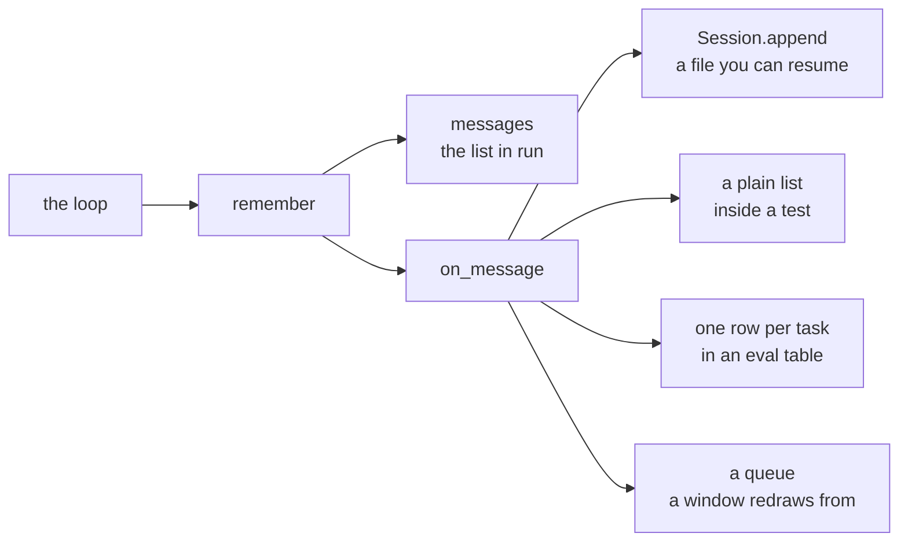

[อ่านภาษาไทย](README.th.md)

# Lesson 13. Sessions

Lesson 12 gave the agent a memory that lasts as long as the process does. This
chapter gives it one that outlives the process, and the whole thing is under
forty lines of Python with no dependencies.

That sounds like a small chapter and the code really is small. The reason it is
worth a full chapter is the second half. A session file is the cheapest debugging
tool you will ever build, and almost nobody who writes their first agent thinks
to write one until the day an agent does something completely inexplicable and
they have no way to find out what it saw.

Files in this folder.

```text
lessons/13-sessions/
  session.py     new. write a message, read them back, list what exists
  agent.py       lesson 12's loop plus two parameters, on_message and history
  permissions.py unchanged from lesson 12
  providers.py   unchanged from lesson 06
  prompt.py      unchanged from lesson 10
  tools.py       unchanged from lesson 12
  check.py       five claims, one of them a real run saved as it happened
  README.md      this file
```

Five of the eight Python files are byte for byte what they were in an earlier
lesson. `session.py` is new and `agent.py` gains two parameters. Nothing else
moves.

## 1. The problem left over from lesson 12

Lesson 12 ended in a good place. The agent no longer asks you about the same
harmless command forty times. Answer `a` once and `run_shell` with those exact
arguments stops asking. The gate is still there and the fatigue is gone.

Now close the program.

```python
class Permissions:
    def __init__(self, ask=None, auto_approve=False):
        self.ask = ask
        self.auto_approve = auto_approve
        self.remembered = set()
```

`self.remembered` is a Python set on an object held by a local variable in
`run`. When `run` returns, nothing refers to the `Permissions` instance any more,
and the set is garbage. Every decision you made is gone. Start the agent again
and it asks about `python -m pytest -q` as though you had never seen it.

The same sentence is true of the far more valuable thing in that function.

```python
    messages = list(history or [])
```

`messages` is the conversation. Everything the agent learned about your project
lives in it. Which files exist, which one had the bug, what the test output said,
which approach it tried and abandoned. All of it is a list on the stack, and when
`run` returns the list is collected and the knowledge with it.

That produces three distinct problems, and it is worth separating them because
they have different costs.

You pay for the same discovery twice. Ask the agent to fix a second bug in
the same project and it greps for the same things, reads the same files, and
sends all of it to the model again. Lesson 11 showed the arithmetic. Ten turns of
file reading is fifty five thousand tokens billed for ten thousand tokens of
unique material, and starting from scratch means paying that a second time for a
project the agent had already read.

You cannot leave and come back. Real work is interrupted. You start the agent
on something that takes twenty minutes, your laptop sleeps, a meeting happens, or
you press Ctrl+C because you want to change the task slightly. Every one of those
is currently fatal. There is no mechanism anywhere in the program for continuing
something that has already started.

You cannot find out what happened. This is the one that hurts most and it is
the one people notice last. When the agent edits the wrong file, or claims a test
passed when it did not, or reads a file and then behaves as though it had read
something else, the only useful question is what was actually in its context at
the moment it decided. Right now the answer to that question was thrown away
microseconds after the decision, and the only trace left is whatever scrolled
past on your terminal, which you have already lost to the scrollback buffer.

Section 6 is about that third problem. The first two are what the code in this
chapter is obviously for. The third is why the chapter matters.

## 2. What a session is

A session is a conversation on disk.

That is the whole idea and it is deliberately unexciting, but there is a real
insight buried in how unexciting it is, so do not skim past it.

Go back to lesson 02. The thing that made the conversation loop work was the
discovery that the model remembers nothing, and that what we call a conversation
is a Python list that you resend in full on every request. Since lesson 02, every
chapter has kept that list in the same shape. A list of dictionaries, each with a
`role` and a `content`, plus `tool_calls` on assistant messages that ask for
something and a `tool_call_id` on the results that come back.

```python
[
    {"role": "system", "content": "You are a coding agent..."},
    {"role": "user", "content": "the average is wrong"},
    {"role": "assistant", "content": "", "tool_calls": [...]},
    {"role": "tool", "tool_call_id": "call_1", "content": "stats.py:8: ..."},
]
```

Every one of those dictionaries is already JSON. It has to be, because it is
about to be serialised and posted to an HTTP endpoint. There are no Python
objects in it, no classes, no functions, no references to anything that only
exists in memory. It is strings, dictionaries and lists all the way down.

So saving a conversation is not a new idea. It is not a serialisation problem, it
is not a schema design problem, and it is emphatically not a database problem. It
is the same data you already had, written to a different place. The only decision
left is which place and in what arrangement, which is section 3.

This is worth stating plainly because the instinct when you first want
persistence is to reach for something. An ORM, a document store, a schema, a
migration. All of that is machinery for turning objects that live in memory into
rows that live on disk, and you have no objects. You have JSON. The distance
between what you have and what you need is one call to `json.dumps`.

A message is a plain dictionary and not a class. You could wrap each message in
a `Message` class with fields and validation, and then you would need a way to
turn a `Message` into JSON for the provider and back again from disk. That is
two conversions and a class definition bought in exchange for nothing, because
the wire format is already the storage format. The rule this course keeps
returning to is that the fewer representations of the same thing you have, the
fewer places they can disagree.

## 3. Why JSONL rather than one big JSON file

JSONL means one JSON object per line. No wrapping array, no commas between
entries, no opening or closing bracket. The file is not a JSON document. It is a
text file in which every line happens to be a JSON document.

```text
{"role": "user", "content": "the average is wrong"}
{"role": "assistant", "content": "I will look."}
{"role": "tool", "tool_call_id": "call_1", "content": "stats.py:8: ..."}
```

The obvious alternative is to hold the whole conversation in memory and dump it
as one JSON array when the run finishes.

```python
# The alternative we are not choosing.
path.write_text(json.dumps(messages, indent=2))
```

There are two independent reasons not to do that, and both of them matter enough
to be stated properly rather than asserted.

### Reason one. A crash loses only what was in flight

An append is one `write` of one line to the end of a file. It does not touch a
single byte that is already there. If the process dies during that write you lose
at most the message that was being written, and every message before it is
exactly where it was.

A single JSON document cannot work that way. A JSON array has a closing bracket,
which means the last byte of the file depends on the number of elements, which
means adding an element changes the end of the file, which means you have to
rewrite the document. And a rewrite has a window during which the file on disk is
neither the old document nor the new one. Die inside that window and you have a
file that will not parse at all. Not a file missing the last message. A file
where `json.load` raises and you have lost the entire conversation, including the
nineteen minutes of it that finished successfully.

That is the difference that decides this. One design degrades by losing the most
recent thing. The other degrades by losing everything.

And the window is not hypothetical. The things that end an agent process midway
are ordinary. You press Ctrl+C because it is heading in the wrong direction. The
provider returns a `500` and, as lesson 11 admitted, there is no `try` around
`provider.stream`, so the exception travels straight out of `main`. Your laptop
runs out of battery. A test the agent ran took the terminal down with it. An
agent run is a long lived process doing risky things, which makes it exactly the
kind of program that gets killed at an inconvenient moment.

You can make the rewrite safe. Write to a temporary file, then rename it over the
original, because rename is atomic on the filesystems that matter. That is a real
technique and real programs use it. It costs you a full rewrite of the entire
conversation after every single message, which on a long session means rewriting
a hundred kilobytes to add two hundred bytes, on every turn. Appending a line
costs the length of the line. The atomic rename buys you nothing here that the
append does not already have.

### Reason two. Ordinary tools can read it

This is the reason that turns out to matter more in daily use, and it is the one
that is easy to undervalue when you are choosing a format.

A line based file is compatible with every text tool that has existed since the
1970s. Nothing needs to understand your format. Nothing needs to load the file
into memory. Nothing needs to be written at all.

Count the messages.

```bash
wc -l ~/.agentpath/sessions/fix-average.jsonl
```

Count how many tool results came back.

```bash
grep -c '"role": "tool"' ~/.agentpath/sessions/fix-average.jsonl
```

```text
2
```

Watch a session as the agent works, in a second terminal, live.

```bash
tail -f ~/.agentpath/sessions/fix-average.jsonl
```

Pull one line out and read it properly.

```bash
sed -n 3p ~/.agentpath/sessions/fix-average.jsonl | python -m json.tool
```

```json
{
    "role": "tool",
    "tool_call_id": "call_mock_1",
    "content": "stats.py:8: def average(numbers):"
}
```

Every one of those is real output from the session file this lesson produces, and
not one of them required a line of code. `tail -f` in particular is the one you
will use without planning to. It works because a new line arriving at the end of
the file is the entire event, and it would not work at all against a document
that gets rewritten from the top every turn.

Now imagine the other design. To count messages you write a script that loads the
file. To watch progress you cannot, because the file does not exist until the run
ends. To look at message three you load a hundred kilobytes of JSON to look at two
hundred bytes of it. None of that is hard, and that is the trap. Each individual
thing is a five minute script, so you write the five minute script, and a month
later your session format has a small pile of tooling around it that exists only
because the format needed tooling.

There is a cost here and it is worth stating honestly. JSONL is not free. You cannot open it in a JSON
viewer, because it is not JSON. `json.load` on the whole file fails immediately.
Anything that consumes it has to know the one extra rule, which is to split on
newlines first. That rule is one line of Python, and it is in `load` below. It is
a genuine cost and it is a small one, paid once, in exchange for the two
properties above.

## 4. Why a callback rather than the loop knowing about files

Here is the entire change to `agent.py`.

```python
def run(
    provider,
    user_input,
    system=None,
    permissions=None,
    on_message=None,
    history=None,
    max_turns=10,
):
    permissions = permissions or Permissions(auto_approve=True)
    messages = list(history or [])

    def remember(message):
        """Add to the conversation and tell whoever is listening.

        The callback is how a session gets written without the loop knowing
        that files exist. It is the same trick as permissions, which the
        loop also does not implement, only consult.
        """
        messages.append(message)
        if on_message:
            on_message(message)
```

Then every `messages.append(...)` in the body becomes `remember(...)`. There are
five of them. The system message, the user message, the assistant message that
carries tool calls, the tool result, and the assistant's final answer on the way
out of the loop. That last one is the easiest to miss, because it sits inside the
`if not calls` branch two lines above a `return`, and missing it costs you the
answer at the end of every session you ever save. That is the whole edit.

Notice what is not in `agent.py`. There is no `import session`. There is no
`open`. There is no path, no filename, no directory, no `AGENTPATH_HOME`. The
loop cannot write a file and does not know that files exist.

That matters beyond tidiness. The loop reports what happened and something else
decides what to do with the report. You have seen this exact shape twice
before.

| Concern | What the loop does | What decides |
| --- | --- | --- |
| Streaming, lesson 05 | calls `on_text(piece)` | the caller, which prints |
| Permission, lesson 12 | calls `permissions.check(...)` | a `Permissions` object |
| Persistence, lesson 13 | calls `on_message(message)` | whatever the caller passed |

Three chapters, three concerns the loop refuses to own, one shape. And the reason
is the same every time. The moment the loop knows how a message should be stored,
there is exactly one way to store it, and everything that wants a different way
has to modify the loop.

Count the callers that want a different way, because there are more than you
expect.

A terminal session passes `on_message=session.append` and gets a file it can
resume from.

`check.py` passes it too, and then compares what landed on disk against what
`run` returned. That is not the same as writing a file, it is an assertion about
a file, and the loop should not have to know the difference.

A unit test passes `on_message=recorded.append` with a plain list, and now
the conversation is inspectable without touching a filesystem at all. No
temporary directory, no cleanup, no test that fails on a machine where the home
directory is not writable.

An eval run scoring a hundred tasks passes something that writes one row per
task to a results table, and does not want a hundred session files.

A user interface passes something that pushes each message onto a queue that
a rendering thread reads, so the transcript updates as the agent works.

Five callers, five completely different destinations, and the loop is identical
for all of them because it does not have a destination. It has a report.



Consider the alternative and watch it decay. Suppose the loop took a `session_path`
and wrote to it. Day one that is fine and shorter. Then the test wants to run
without touching the disk, so `session_path=None` gets a meaning. Then the eval
wants a different format, so a `session_format` argument appears. Then the user
interface wants a live callback anyway, and you end up adding `on_message`
regardless, except now the loop has both and they can disagree. You arrive at the
callback in the end and pay for the detour.

This is exactly the argument lesson 11 made about `tools.run` being the right
seam. When one side changes, how much of the other side has to change with it.
The answer here is none, for five different sides.

There is one honest cost. `on_message` is called synchronously, inside the loop,
before the next thing happens. If your callback is slow, the agent is slow. If it
raises, the run dies. `Session.append` opens the file, writes one line and closes
it, which is fast enough to be invisible next to an HTTP request to a model, so
this does not bite here. It would bite if you passed a callback that posted to a
web service on every message. Keep callbacks cheap.

A number makes the size of that clear. Forty messages, with a callback that
posts each one to an internal service at two hundred milliseconds a call, adds
eight seconds to the run, and the agent sits idle for every one of them.
`Session.append` on the same forty messages is under a millisecond each. The
cost is never the callback existing. It is what you hang behind it.

## 5. Writing session.py line by line

The whole file is fifty six lines including the docstring, and twenty of those
are the docstring. Here it is in pieces.

### Where sessions live

```python
def default_directory():
    return Path(os.environ.get("AGENTPATH_HOME", Path.home() / ".agentpath")) / "sessions"
```

Sessions go in `~/.agentpath/sessions` by default, and `AGENTPATH_HOME` moves
them somewhere else.

The default is the home directory rather than the project directory, and that is
a decision rather than an accident. A session is a record of what you asked and
what the agent did. It belongs to you, not to the repository. Writing sessions
into the project would mean every project the agent touches grows a directory
that has to be added to `.gitignore`, and the day somebody forgets is the day a
transcript containing the contents of their configuration files is pushed to a
public repository.

`AGENTPATH_HOME` exists so that `check.py` can point the whole mechanism at a
temporary directory and not scatter files through your actual home directory
while testing.

Now notice something about when this function runs, because it is the opposite of
the trap in lesson 11. `tools.py` reads `AGENTPATH_WORKSPACE` once at import
time, into a module level constant, which is why `main.py` has to set the
environment variable before importing anything. `default_directory` reads the
environment every time it is called, and it is called from `Session.__init__`. So
a `Session` created later in the process picks up a change made later in the
process. That is the more forgiving design of the two, and the reason `check.py`
can set `AGENTPATH_HOME` next to the imports without the ordering being load
bearing.

### Creating one

```python
class Session:
    def __init__(self, name, directory=None):
        self.name = name
        self.path = Path(directory or default_directory()) / f"{name}.jsonl"
        self.path.parent.mkdir(parents=True, exist_ok=True)
```

A session is a name and a path. The name becomes the filename, which is what
makes `Session("fix-average")` twice in two different processes refer to the same
conversation. That is the entire resume mechanism and there is no registry, no
index and no identifier to remember.

`mkdir(parents=True, exist_ok=True)` creates the directory in the constructor
rather than on first write. `parents=True` creates `~/.agentpath` as well as
`~/.agentpath/sessions`, and `exist_ok=True` means the second `Session` of the
day does not raise. Doing it here means that if the directory cannot be created,
you find out when you make the session rather than four minutes into a run.

The constructor does not open the file and does not create it. A `Session` you
never write to leaves nothing behind, which is what makes `Session("live").load()`
on line 71 of `check.py` a safe thing to do.

### Writing one message

```python
    def append(self, message):
        """Write one message immediately.

        ensure_ascii is off because the file is for a person to read, and a
        Thai sentence turned into escape codes is not readable.
        """
        with self.path.open("a", encoding="utf-8") as handle:
            handle.write(json.dumps(message, ensure_ascii=False) + "\n")
```

Five things in three lines.

`"a"` is append mode. The write goes to the end of the file and nothing that
is already there is touched. Everything in section 3 depends on this one
character.

The file is opened and closed on every message. The obvious optimisation is to keep the file
handle open for the life of the session. Do not, and the reason is buffering. An
open handle holds data in a buffer that is flushed when it is convenient for
Python, which means `tail -f` shows you nothing for a while and then eight lines
at once, and a process killed with the buffer full loses messages that you
believed were written. Closing flushes. The cost is one open and one close per
message, which on a conversation of forty messages is forty system calls against
forty HTTP requests to a language model. It does not register.

`encoding="utf-8"` is explicit. Python on Linux and macOS defaults to UTF-8
already. Python on Windows historically defaults to the system code page, which
for a Thai Windows install is cp874 and for a Japanese one is cp932, and neither
can represent most of what a conversation might contain. Without this argument
the same code writes a different file on different machines, and the failure is a
`UnicodeEncodeError` in the middle of a run on somebody else's laptop. Say what
you mean.

`+ "\n"` is the format. `json.dumps` never emits a newline of its own, and
`json.dumps` with default arguments never emits one internally either, so one
object is guaranteed to be exactly one line. That guarantee is what makes
`splitlines` a valid parser. Note that `indent=2` would break it, which is a
reasonable thing to want and completely incompatible with this format.

**`ensure_ascii=False` is the one worth a section of its own.**

### What ensure_ascii actually does

`json.dumps` defaults to `ensure_ascii=True`, which escapes every character
outside ASCII into a `\uXXXX` sequence. Here is the same message written both
ways.

```python
>>> import json
>>> m = {"role": "user", "content": "สวัสดี ช่วยแก้บั๊กหน่อย"}
>>> print(json.dumps(m))
{"role": "user", "content": "\u0e2a\u0e27\u0e31\u0e2a\u0e14\u0e35 \u0e0a\u0e48\u0e27\u0e22\u0e41\u0e01\u0e49\u0e1a\u0e31\u0e4a\u0e01\u0e2b\u0e19\u0e48\u0e2d\u0e22"}
>>> print(json.dumps(m, ensure_ascii=False))
{"role": "user", "content": "สวัสดี ช่วยแก้บั๊กหน่อย"}
```

The first line is twenty two Thai characters turned into a hundred and thirty
two characters of hex.

Both lines are valid JSON. Both parse back to the identical Python string. There
is no data loss in either direction, and if the only consumer of this file were
`json.loads` the setting would not matter at all.

The consumer is a person. That is the whole argument.

Section 6 is going to claim that the session file is your best debugging tool,
and that claim rests entirely on being able to open the file and read it. For an
English speaker, `ensure_ascii=True` costs nothing, because English is ASCII and
the escaping never triggers. Which is precisely why this default survives in so
many programs. The person who wrote the code never saw the problem.

For everyone else it is the difference between a debugging tool and a wall of
hex. A Thai user asking a Thai question about a codebase with Thai comments gets
a session file in which their question, the file contents the agent read, and the
agent's answer are all unreadable. `grep` for a Thai word finds nothing, because
the word is not in the file. Reading the file in an editor tells you nothing.
The single most valuable property of the format has been destroyed by a default,
for every language that is not English.

This is also why `check.py` asserts on it rather than trusting a comment.

```python
    session.append({"role": "user", "content": "สวัสดี"})
    if "สวัสดี" not in session.path.read_text(encoding="utf-8"):
        fail("non English text was escaped away, which makes the file unreadable")
```

A round trip test would pass with either setting, because both round trip
perfectly. The assertion has to be about the bytes in the file, because
readability is a property of the bytes and not of the parsed result.

### Reading it back

```python
    def load(self):
        if not self.path.exists():
            return []
        lines = self.path.read_text(encoding="utf-8").splitlines()
        return [json.loads(line) for line in lines if line.strip()]
```

A missing file is an empty conversation rather than an error, which is what makes
`Session("new-name").load()` a reasonable way to start something. You do not need
to know whether a session already exists before you ask for it.

`splitlines()` then `json.loads` on each line is the one extra rule that JSONL
costs you, and here it is, in full, in two lines.

`if line.strip()` skips blank lines. A file that ends with a newline, which every
file this program writes does, produces no trailing empty string from
`splitlines`, so this is not for that. It is for the file that got an accidental
blank line in it, from a text editor, from a partial write, from somebody
pasting. One empty string reaching `json.loads` raises
`JSONDecodeError: Expecting value: line 1 column 1 (char 0)`, and a session that
refuses to load because of a blank line is a bad trade for four characters of
code.

We read the whole file at once. `read_text` loads everything into memory, which
is fine because a conversation that will not fit in a context window will
certainly fit in RAM. A streaming read line by line would be more careful and
would buy nothing, since the caller wants the whole list anyway.

### Listing what exists

```python
    @staticmethod
    def list_all(directory=None):
        folder = Path(directory or default_directory())
        if not folder.is_dir():
            return []
        return sorted(path.stem for path in folder.glob("*.jsonl"))
```

The directory listing is the index. There is no separate file recording which
sessions exist, which means there is nothing that can disagree with reality.
Delete a session with `rm` and it is gone from the list, because the list was
never anything but the directory.

`path.stem` is the filename without the extension, so
`~/.agentpath/sessions/fix-average.jsonl` comes back as `fix-average`, which is
exactly the string you pass to `Session(...)` to open it again. The name you see
is the name you use.

```python
>>> Session.list_all()
['fix-average']
```

## 6. The session file is your best debugging tool

Resuming is the feature people build sessions for. Debugging is what they turn
out to be for, and it is not close.

Here is why. When an agent does something baffling, and it will, there is exactly
one useful question. What did it actually see. Not what you meant, not what the
prompt says, not what you assume the tool returned. What was in the list of
messages at the moment the model produced the decision you are staring at.

Every agent bug you will ever debug is one of five things, and all five are
answered by reading that list.

The tool returned something other than what you assumed. The tool result was
truncated and the important part was in the part that got cut. The system prompt
did not say what you thought it said. The model was never told about the thing
you are annoyed it did not use. Or the model saw everything correctly and
answered badly, which is a different problem with a different fix and you cannot
tell it apart from the other four without looking.

The session file is that list. It is written as the run happens, so it exists
even when the run crashed. There is no query language to learn, no viewer to
build, no instrumentation to add, and no need to reproduce the problem, which is
just as well because the problem may not reproduce.

### A real session file

This is genuine output, produced by the code in this folder against the course's
mock server, using the same `stats.py` bug from lesson 11.

```text
{"role": "user", "content": "The average is wrong. Find it and fix it. [[tool:grep_files:{\"pattern\": \"def average\", \"glob\": \"*.py\"}]][[tool:read_file:{\"path\": \"stats.py\"}]]"}
{"role": "assistant", "content": "", "tool_calls": [{"id": "call_mock_1", "type": "function", "function": {"name": "grep_files", "arguments": "{\"pattern\": \"def average\", \"glob\": \"*.py\"}"}}]}
{"role": "tool", "tool_call_id": "call_mock_1", "content": "stats.py:8: def average(numbers):"}
{"role": "assistant", "content": "", "tool_calls": [{"id": "call_mock_2", "type": "function", "function": {"name": "read_file", "arguments": "{\"path\": \"stats.py\"}"}}]}
{"role": "tool", "tool_call_id": "call_mock_2", "content": "\"\"\"Small helpers for summarising a list of numbers.\"\"\"\n\n\ndef total(numbers):\n    return sum(numbers)\n\n\ndef average(numbers):\n    if not numbers:\n        return 0\n    return total(numbers) / (len(numbers) + 1)\n"}
{"role": "assistant", "content": "The tool returned \"\"\"Small helpers for summarising a list of numbers.\"\"\"\n\n\ndef total(numbers):\n    return sum(numbers)\n\n\ndef average(numbers):\n    if not numbers:\n        return 0\n    return total(numbers) / (len(numbers) + 1)\n."}
```

Six lines. Read them in order.

Line 1 is the user message, and it contains the task exactly as sent. Note
the `[[tool:...]]` directives, which are how the mock server is steered, as
lesson 06 explained. Against a real model the line would be your sentence and
nothing else. This is already the first debugging fact the file gives you for
free, which is what the model was asked, verbatim, including anything a wrapper
added to it that you did not know about.

Line 2 is the assistant asking for a tool. `"content": ""` means the model
produced no prose in that turn, which is normal for small models and is not a
sign of anything wrong. The interesting part is `"id": "call_mock_1"` and the
arguments, which are a JSON string inside a JSON object. That double encoding is
not our choice. It is what the OpenAI wire format specifies, and lesson 05
already dealt with it when it accumulated argument fragments from a stream. The
file stores the wire format because the wire format is what the model saw.

Line 3 is the result of that call, and it sits directly under it. This is the
property worth pointing at. `"tool_call_id": "call_mock_1"` on line 3 matches
`"id": "call_mock_1"` on line 2. The request and the answer are adjacent, in
order, in a file you can read top to bottom. When you want to know whether
`grep_files` found what you think it found, you do not need to rerun anything.
It is right there. It found `stats.py:8` and nothing else.

Lines 4 and 5 are the same pattern again with `call_mock_2`, and line 5 is
where the format earns its keep. Look at the `content` field. It is the entire
`stats.py` file, with every newline stored as `\n` inside one JSON string. A
multi line tool result is still exactly one line of the session file, which is
what makes "one message per line" hold for tool results that are ten kilobytes of
source code. It is dense to read raw, which is what `python -m json.tool` from
section 3 is for.

And the bug is visible in that line. `return total(numbers) / (len(numbers) + 1)`
is in the model's context, so if it went on to say the file looked fine, you now
know the failure was in the model's reasoning rather than in the retrieval. That
is the single most valuable distinction when debugging an agent, and one line of
a text file settled it.

Line 6 is the final assistant message with no `tool_calls`, which is the loop
returning. Against a real model this is where prose would be. The mock server
echoes the last tool result instead, which is why this line repeats the file.

### How to actually use it

Three habits, in order of how often you will want them.

Read the last thing that happened.

```bash
tail -n 3 ~/.agentpath/sessions/fix-average.jsonl
```

Find every tool result in a long session and check whether one of them was
truncated.

```bash
grep '"role": "tool"' ~/.agentpath/sessions/fix-average.jsonl | grep truncated
```

Reconstruct what the model saw at the moment of a bad decision, which is a four
line script rather than a feature.

```python
from session import Session

for index, message in enumerate(Session("fix-average").load()):
    print(index, message["role"], str(message.get("content"))[:80])
```

That last one is the point. There is no API to learn because the session is a
list of dictionaries, which is what it was in memory. Everything you know about
inspecting a Python list applies unchanged.

### Why this beats logging

You could add logging instead, and it is the more obvious instinct. It is worse
here, for one specific reason.

A log records what your program decided to record. Somebody chose a level, chose
a message, chose which variables to interpolate. The moment you need something
that was not chosen, you have to add a log line, redeploy, and reproduce the
problem, and agent problems are frequently not reproducible because models are
not deterministic. The bug you are chasing happened once, yesterday, on a
conversation that no longer exists.

Picture the hour that costs you. The agent edits the wrong file, so you add two
log lines recording the path `edit_file` was handed, restart, and run the same
task eleven times over the next hour. It behaves perfectly every time. The run
that mattered is gone, the two log lines are permanent now, and you know nothing
you did not know when you started.

A session file records the input to the decision, in full, with no selection
applied. Everything is in there because the whole thing is in there. You do not
have to have anticipated the question.

Real harnesses work this way. Claude Code writes JSONL transcripts. So does
OpenHands. Not because JSONL is fashionable but because the first thing anybody
asks about an agent that misbehaved is what it saw, and the only format that
answers that question is the one that stored all of it.

## 7. Resuming

Resuming is loading the list and carrying on. That is not a simplification.

```python
from session import Session

session = Session("fix-average")
answer, messages = run(
    provider,
    "Now add a test for it.",
    history=session.load(),
    on_message=session.append,
)
```

Four lines, and three of them are argument passing. `session.load()` returns the
conversation as it was. `run` starts with it. `on_message=session.append` means
the new messages land at the end of the same file, so tomorrow's resume gets
today's and yesterday's.

Two details in the loop make this work correctly.

```python
    messages = list(history or [])
```

`list(...)` copies, so `run` appending to `messages` does not mutate whatever the
caller passed. And the history is assigned rather than passed through `remember`,
which means loaded messages are not written to the file a second time. Resume a
session ten times and the file contains each message once. Had this been a loop
calling `remember` on each history entry, every resume would duplicate the entire
conversation on disk, and the file would double in size on every resume while the
conversation stayed the same length.

```python
    if system and not messages:
        remember({"role": "system", "content": system})
```

`and not messages` is the resume case. A loaded history already contains its
system message on line 1, so adding another would give the model two system
prompts, which is not an error the provider will reject and is a very confusing
thing to debug. The condition says the system prompt is for starting a
conversation, not for continuing one.

### Why this works at all

Stop and notice what makes resuming possible, because it is not obvious and it is
the payoff of something you learned eleven chapters ago.

There is no server side state. When you resume, you are not reconnecting to
anything. There is no session identifier held by the provider, no conversation
that was paused on their end, nothing to reattach to. The model does not know that
a week passed between message four and message five, and it cannot know, because
the request that carries message five looks identical to one sent a week earlier
with the same list.

That is lesson 02. The very first surprising thing this course taught was that
the model remembers nothing, that every request carries the entire conversation,
and that the illusion of memory is manufactured by your client. It arrived as a
cost. You resend everything, every time, and you pay for it.

Here is the refund. Because the model is stateless, the conversation is entirely
yours. It is data you own, in a file you own, in a format you chose. You can save
it, close your laptop, come back next week, and continue. You can copy the file
to another machine and continue there. You can hand it to a different provider
and continue, because lesson 06 made the wire format a property of the provider
rather than of the conversation. You can open it, delete the four messages where
the agent went down a dead end, and continue from the pruned version, and the
model will have no idea that anything was removed because it never knew anything
was there.

None of that would be possible if the model held the conversation. You would be
asking a vendor for an export feature.

That last one has a price on it. A session where the agent spent four turns
reading the wrong package is carrying nine thousand tokens of dead end, and
those tokens are resent on every turn that follows and on every resume after
that. Open the file, delete the four lines, and tomorrow's first request is nine
thousand tokens lighter for as long as the session lives. No provider sells you
that button.

Statelessness looked like the expensive property in lesson 02. It is the one that
makes every chapter of part 3 possible. Sessions here, and in lesson 14 the fact
that you can rewrite history to fit a context window, which is only allowed
because there is no server that would notice.

## 8. The limit you should know about

One writer only.

`Session.append` opens the file in append mode, writes a line, and closes it. Two
processes doing that to the same file at the same time will interleave. Not their
messages, which would be survivable, but their bytes. A single write of a long
line is not guaranteed to be atomic, so what you get is one line beginning in the
middle of another, and both are unparseable.

```text
{"role": "user", "content": "fix the te{"role": "user", "content": "add a test"}
sts"}
```

`json.loads` fails on both. The `if line.strip()` guard does not help, because
these lines are not blank, they are garbage. And the failure is permanent. There
is no repair, because the information about where one message ended and the other
began is not in the file any more.

Be clear that this is a real limit rather than a theoretical one. It does not
require you to do anything strange. Open two terminals and resume the same
session in both, which is an ordinary thing to do by accident when you have
forgotten the first one is running. Run the agent in a watch loop while you are
also using it. Have an editor plugin and a command line pointed at the same
session name. Any of those corrupts the file, and you find out later, when you
try to load it.

Real harnesses do something else. They take a lock before writing. On Unix that is
`fcntl.flock` on the file descriptor. On Windows it is `msvcrt.locking`, and the
two have different semantics, which is the first reason this is not one line of
code. The second is deciding what happens when the lock is held. Blocking means
your agent stops until the other process finishes, which is wrong if the other
process is a dead session whose lock was never released. Failing means telling the
user their session is busy, which requires a way to tell them and a way to
recover. Some harnesses avoid the problem instead by giving every process its own
session file and merging on read, which is a good design and a larger one.

It is not implemented here on purpose. The locking is not the lesson. Cross platform
file locking is perhaps forty lines of code with two platform branches, plus stale
lock detection, plus a decision about blocking, and every one of those lines is
about locks rather than about sessions. Putting it in this file would triple the
size of `session.py` and the reader would come away having learned about
`fcntl` instead of about why a conversation on disk is worth having.

So the rule for the code in this folder is one process per session name. That
rule is not enforced anywhere, and breaking it corrupts the file. Lesson 18 has
one process owning the session, which sidesteps it, and if you take this code into
something real the lock is the first thing to add.

## 9. Running check.py

From inside the lesson folder, with an endpoint configured.

```bash
cd lessons/13-sessions
python check.py
```

Or run every lesson at once against the built in mock server.

```bash
python ci/run_lessons.py
```

A passing run looks like this.

```text
OK a conversation survives being written and read back
OK the file is one JSON object per line and you can read it
OK text in any language stays readable in the file
Hello from the mock server.
OK a real run was saved as it happened, 2 messages
OK the saved conversation can be loaded again to carry on from
```

The `Hello from the mock server.` line in the middle is not part of the check. It
is the loop streaming the model's answer to the terminal, exactly as lesson 05
built it, and it appears there because the fourth claim performs a real run.

Five claims, and each one is testing a different thing.

A conversation survives being written and read back. Three messages go in,
including an assistant message with `tool_calls` and its matching tool result, and
the loaded list must equal the written list. The tool call is in the fixture on
purpose. A round trip test with three simple text messages would pass even if
nested structures were being flattened, and the messages that actually matter are
the nested ones.

The file is one JSON object per line. This is asserted separately from the
round trip, and it has to be, because a `pickle` file would pass the round trip
test perfectly and be unreadable. The check counts three lines for three messages
and parses each one on its own.

```python
    lines = session.path.read_text(encoding="utf-8").splitlines()
    if len(lines) != 3 or any(not json.loads(line) for line in lines):
        fail("the file is not one readable JSON object per line")
```

Text in any language stays readable. The `ensure_ascii` assertion from
section 5, which checks the bytes rather than the parsed value.

A real run was saved as it happened. This is the one that ties the chapter
together. It builds a real provider, calls `run` with `on_message=live.append`,
and then asserts that `live.load()` equals the `messages` that `run` returned.

```python
    live = Session("live")
    _, messages = run(provider, "Say hello.", on_message=live.append)
    if live.load() != messages:
        fail("the session on disk does not match the conversation in memory")
```

That equality is the whole claim of the chapter in one line. What is on disk is
what was in memory, not a summary of it, not a rendering of it, and not a lossy
version of it. The count is printed because it is a useful thing to see. Two
messages for this run, being the user message and the assistant answer, with no
system prompt and no tool calls.

The saved conversation can be loaded again to carry on from. A fresh
`Session("live")`, constructed from nothing but the name, loads a conversation
whose roles are `user` then `assistant`. That shape is the requirement for
resuming. A conversation ending on a tool call with no result, or one whose
messages arrived out of order, would be rejected by the provider on the next
request.

The temporary directories at the top of the file are the same technique lesson 11
used, for the same reason.

```python
home = Path(tempfile.mkdtemp(prefix="agentpath-lesson13-"))
workspace = Path(tempfile.mkdtemp(prefix="agentpath-lesson13-ws-"))
os.environ["AGENTPATH_HOME"] = str(home)
os.environ["AGENTPATH_WORKSPACE"] = str(workspace)
```

Two directories rather than one, because they are two different things. The home
is where sessions are written. The workspace is where the agent is allowed to
touch files. Keeping them separate in the check keeps them separate in your head,
and running the check leaves nothing in your real `~/.agentpath`.

If the first claim fails, the round trip lost something, and the likely culprit is
a message containing a value that is not JSON. If the third fails, `ensure_ascii`
has been left at its default. If the fourth fails, `on_message` is not being
called for every message, and the place to look is whether all five
`messages.append` calls in `agent.py` became `remember`, including the one in the
`if not calls` branch.

## 10. What you cannot do yet

Your agent now remembers across runs. It does not manage what it remembers, and
that is the next problem rather than a distant one.

Nothing in this program counts the size of the conversation. `max_turns=10`
bounds turns and not bytes, and lesson 02 established that the entire list is
resent on every request. So a session that you resume tomorrow starts by sending
the whole of today, and a session you resume for the fifth time sends the four
before it. Sessions make that worse rather than better, because before this
chapter a long conversation ended when the process did.

The arithmetic from lesson 11 has not gone anywhere. One `read_file` is about
4000 characters, roughly a thousand tokens. Eight files read across a task is
eight thousand tokens of file content sitting in the list permanently, resent on
every turn for the rest of the session, and now resent again on every resume.

The failure when it comes is abrupt. Not a warning, not degraded quality. An HTTP
error from the provider saying the request exceeded the context length, arriving
mid task, with no way to continue. And the session file makes it worse in one
specific way, because a conversation that has grown too large to send is now
saved, so resuming it fails immediately and permanently. You have a file you
cannot use.

That point arrives sooner than it feels like it should. A day of real work on
one project leaves a session file of about two hundred and sixty kilobytes,
which is roughly sixty five thousand tokens. A model that accepts thirty two
thousand rejects the request without reading a word of it, and it rejects the
same file tomorrow and next week, because the file only ever grows. The session
that was your best debugging tool is the one you can no longer hand to an agent.

The obvious fix is to drop the oldest messages, and it is wrong in a way that is
worth knowing before you write it. Look at the excerpt in section 6 again. Line 2
is an assistant message with `tool_calls`, line 3 is its result. Every provider
requires those paired. Drop line 2 and keep line 3 and the request is rejected
with a `400`, because there is a result for a call that was never made. Drop line
3 and keep line 2 and it is rejected too. The unit you can drop is not a message.
And the oldest messages are frequently the most valuable ones, because they
contain the original task.

Lesson 14 is context management. Measuring the conversation rather than guessing
at it. Deciding what to drop, with the tool call pairing treated as the hard
constraint it is. Summarising the middle of a long session, and the question of
who writes the summary and what that costs.

There is one more thing this chapter does not do, and it is smaller but you will
notice it sooner. Nothing names sessions for you. `Session("fix-average")`
requires you to invent and remember a string, and the day you cannot remember what
you called yesterday's session, `Session.list_all()` gives you a sorted list of
names and nothing else. No dates, no first message, no indication of which one you
were in an hour ago. That is a command line problem rather than a session problem,
and lesson 18 takes the first step on it. Its `main.py` grows a `--resume` flag
that takes a session name and loads that session's history before the loop
starts, plus a `--session` flag and a timestamp for a name when you give neither.
That is enough to carry on from yesterday. It is still not enough to answer
"which one was yesterday", and this course never builds that part.

Before you go on, do one thing. Run the agent on something real, let it work, and
then open the session file it wrote and read it top to bottom. Find the tool call
that surprised you and look at the line underneath it. That habit is the thing to
take out of this chapter, and it will save you more time than the resuming will.

On to lesson 14.
