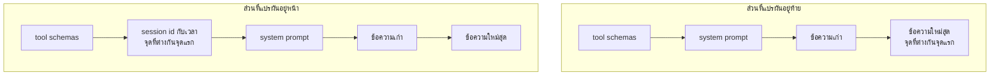

[Read in English](README.md)

# บทที่ 15 Token economy

ทุกบทที่ผ่านมาเพิ่มความสามารถ บทนี้เพิ่มตัวเลข

ฟังดูเหมือนเป็นเรื่องเล็กกว่า แต่ไม่ใช่ บทที่ 14 สร้างกลไกที่มีหน้าที่ทั้งหมด
คือจัดการทรัพยากรหนึ่งอย่าง และกลไกนั้นไม่เคยได้รับอนุญาตให้เห็นทรัพยากรนั้นเลย
`budget` คือตัวเลขที่คุณเลือกเอง `estimate_tokens` คือการหารด้วยสี่
ไม่มีตัวไหนเคยถูกเทียบกับอะไรที่เป็นของจริง เพราะไม่เคยมีของจริงเข้ามาในโปรแกรม

บทนี้ใส่ตัวเลขจริงเข้าไป จากนั้นก็ใช้ความยาวที่เหลือไปกับสิ่งที่คุณทำได้เมื่อมีมันแล้ว
ซึ่งส่วนใหญ่คือแนวคิดเรื่องลำดับหนึ่งข้อที่มีค่ามากกว่าการ optimise อื่น ๆ
ทั้งหมดในไฟล์นี้รวมกัน

ไฟล์ในโฟลเดอร์นี้

```text
lessons/15-token-economy/
  usage.py       new. Usage.add, Usage.cost, Usage.summary. forty eight lines
  providers.py   lesson 06's two providers, now returning what the request cost
  agent.py       lesson 14's loop, plus a usage parameter and a circuit breaker
  check.py       five checks, two of which are the facts the chapter rests on
  context.py     unchanged from lesson 14
  permissions.py unchanged from lesson 12
  session.py     unchanged from lesson 13
  prompt.py      unchanged from lesson 10
  tools.py       unchanged from lesson 12
  README.md      this file
```

ไฟล์ใหม่หนึ่งไฟล์ยาวสี่สิบแปดบรรทัด provider ฝั่ง OpenAI เพิ่มขึ้นหกบรรทัด
และฝั่ง Anthropic เพิ่มขึ้นสามบรรทัด loop เพิ่มสองบรรทัดสำหรับ usage (ตัวเลขที่ผู้ให้บริการบอกว่าคำขอนี้ใช้ token ไปเท่าไหร่)
และตัวตรวจจับการทำซ้ำที่หัวข้อ 6 อธิบายไว้

---

## 1. ปัญหาที่บทที่ 14 ทิ้งไว้ให้คุณ

คุณจบบทที่ 14 ด้วย `fit_to_budget` มันจัดกลุ่มบทสนทนาเป็น exchange เก็บตัวใหม่สุด
ที่ใส่ลงได้ และไม่เคยทิ้ง tool result ให้ห่างจาก tool call ของมัน มันถูกต้อง
มันเป็น deterministic และมันยาวแปดสิบบรรทัดที่คุณอ่านรวดเดียวจบ

และมันก็ตาบอดสนิทด้วย

ดูว่าอะไรเป็นตัวตัดสินว่ามันจะทำงานเมื่อไร `estimate_tokens` นับตัวอักษรแล้วหารด้วยสี่
จากนั้นบวกสี่ต่อข้อความสำหรับ overhead นั่นคือ model ทั้งหมด `budget` คือจำนวนเต็ม
อะไรก็ตามที่ผู้เรียกส่งเข้ามา และผู้เรียกได้จำนวนเต็มนั้นมาจากการดู model card
แล้วเดาตัวเลขที่เล็กกว่า ไม่มีที่ไหนในสิบสี่บทที่โปรแกรมเปรียบเทียบตัวเลขทั้งสอง
กับสิ่งที่ provider คิดเงินจริงสำหรับ request

จึงมี failure สองแบบที่รอคุณอยู่ และไม่มีทางแยกแยะได้ คุณอาจกำลังตัดที่หกสิบ
เปอร์เซ็นต์ของ window จริง โยน context ที่ agent ต้องการทิ้งไปโดยไม่มีเหตุผล
หรือคุณอาจกำลังตัดที่เก้าสิบห้าเปอร์เซ็นต์แล้วยังถูกปฏิเสธอยู่ดี เพราะค่าประมาณ
นับต่ำไปพอดีกับเนื้อหาที่งานของคุณผลิตออกมา ทั้งสองแบบให้ความรู้สึกเหมือนกันจากภายนอก
ทั้งสองแบบดูเหมือน agent โง่

และใต้เรื่องนั้นมีช่องว่างที่ใหญ่กว่า ไม่มีอะไรในโปรแกรมนี้เคยพิมพ์ต้นทุนออกมา
คุณบอกไม่ได้ว่างานที่คุณเพิ่งรันไปมีต้นทุนหนึ่งในสิบเซนต์หรือสี่สิบเซนต์
และแน่นอนว่าคุณบอกไม่ได้ว่าส่วนไหนของมันคือส่วนที่แพง ถ้าไม่มีตัวเลขนั้น
การ optimise ทุกอย่างที่คุณลองทำก็เป็นเรื่องงมงาย คุณจะไปย่อ system prompt
ซึ่งยาว 612 ตัวอักษร แล้วรู้สึกว่าได้ทำอะไรสำเร็จ ขณะที่ผลลัพธ์ของ `grep_files`
ยาวหนึ่งร้อยแปดสิบบรรทัดติดไปกับทุก request ตลอดที่เหลือของ session
และทำให้คุณเสียเงินมากกว่าสามสิบเท่า

### การเติบโต ที่วัดออกมาแล้ว

นี่คือสิ่งแรกที่ `check.py` พิมพ์ออกมา นี่ไม่ใช่แผนภาพ มันคือสิ่งที่ provider
รายงานบน request สี่ครั้งติดกัน

```text
OK the same conversation cost more every turn, [2, 12, 22, 32]
```

สี่ตัวเลข แต่ละตัวคือ `prompt_tokens` ที่ provider คิดเงินสำหรับหนึ่ง request
สอง แล้วสิบสอง แล้วยี่สิบสอง แล้วสามสิบสอง

บทสนทนาที่ request ทั้งสี่มาจากคือบทสนทนาใน `check.py` และมันจงใจให้น่าเบื่อ
เท่าที่บทสนทนาหนึ่งจะน่าเบื่อได้

```python
    conversation = [{"role": "user", "content": "Say hello."}]

    for turn in range(4):
        body = send(conversation)
        usage.add(body["usage"])
        prompts.append(body["usage"]["prompt_tokens"])
        conversation.append({"role": "assistant", "content": body["choices"][0]["message"]["content"] or ""})
        conversation.append({"role": "user", "content": f"And again, turn {turn}."})
```

ไม่มีใครอ่านไฟล์ ไม่มีใครเรียก tool ไม่มีใครพูดอะไรยาวกว่าหนึ่งประโยค
user พูดว่า "Say hello." แล้วพูดว่า "And again, turn 0." และต่อไปเรื่อย ๆ
แต่ละเทิร์นเพิ่มเนื้อหาใหม่ประมาณสิบแปดตัวอักษร

และต้นทุนของ request ไปจาก 2 เป็น 32 ซึ่งคือสิบหกเท่า

นั่นคือรูปร่างของปัญหา และมันคือหัวข้อของส่วนถัดไป

---

## 2. ทำไมบทสนทนาเดิมถึงแพงขึ้นทุกเทิร์น

language model เป็น stateless มันไม่มีความทรงจำเกี่ยวกับ request
ก่อนหน้าของคุณ บทที่ 02 วางเรื่องนี้ไว้แล้ว และมันก็เงียบ ๆ กำหนดเศรษฐศาสตร์
ของทุกอย่างมาตั้งแต่ตอนนั้น เหตุผลเดียวที่เทิร์นที่สี่รู้ว่าเกิดอะไรขึ้นในเทิร์นที่หนึ่ง
คือโปรแกรมของคุณส่งเทิร์นที่หนึ่งไปอีกครั้ง เต็มรูปแบบ ภายใน request ของเทิร์นที่สี่

มันสำคัญตรงนี้เพราะราคาของเทิร์นที่ N ไม่ใช่ราคาของเนื้อหาใหม่
ในเทิร์นที่ N แต่คือราคาของเทิร์นที่หนึ่งถึง N ลบหนึ่ง บวกเนื้อหาใหม่ ทุกครั้งไป
คุณไม่ได้จ่ายค่าบทสนทนา คุณกำลังจ่ายค่าผลรวมของทุก prefix (ช่วงต้นของ request นับจากตัวอักษรแรก) ของบทสนทนา

เดินตามสี่ตัวเลขจากหัวข้อ 1 แล้วดูมันเกิดขึ้น mock server นับประมาณสี่ตัวอักษร
ต่อหนึ่ง token เลขคณิตจึงตรวจด้วยมือได้

| เทิร์น | request มีอะไรอยู่ | Prompt tokens |
| --- | --- | --- |
| 1 | `Say hello.` | 2 |
| 2 | ทั้งหมดของเทิร์น 1 บวกคำตอบ บวก `And again, turn 0.` | 12 |
| 3 | ทั้งหมดของเทิร์น 2 บวกคำตอบ บวก `And again, turn 1.` | 22 |
| 4 | ทั้งหมดของเทิร์น 3 บวกคำตอบ บวก `And again, turn 2.` | 32 |

ทีนี้บวกคอลัมน์นั้น provider คิดเงิน 68 prompt token ตลอดการรัน request เดี่ยว
ที่ใหญ่ที่สุดคือ 32 token และเนื้อหาที่ไม่ซ้ำกันทั้งหมดในบทสนทนาตอนจบก็คือ
32 token เดียวกันนั้น คุณจึงจ่าย 68 เพื่อส่ง 32 สองเท่าตัว บนบทสนทนาสี่เทิร์น
ที่ไม่มีอะไรน่าสนใจเกิดขึ้นเลย

`check.py` พิมพ์ยอดรวมนั้นบนบรรทัดที่สอง

```text
OK usage adds up across calls, 4 calls, 68 prompt tokens, 24 completion tokens
```

มันโตแบบนี้เพราะแต่ละเทิร์นเพิ่มข้อความใหม่ในปริมาณที่ค่อนข้างคงที่
และแต่ละเทิร์นส่งทุกอย่างก่อนหน้าซ้ำ ต้นทุนของเทิร์นที่ N จึงแปรผันตาม N
และยอดรวมตลอดการรันแปรผันตาม N ยกกำลังสอง มันเป็นกำลังสองในจำนวนเทิร์น ไม่ใช่เชิงเส้น
ความแตกต่างนั้นคือเหตุผลทั้งหมดที่ทำให้เรื่องนี้เป็นบทหนึ่งแทนที่จะเป็นเชิงอรรถ
เพราะต้นทุนเชิงเส้นที่ทำให้คุณประหลาดใจคือสองเท่าของที่คาด ส่วนต้นทุนกำลังสองคือสามสิบเท่า

นี่คือหน้าตาของมันที่ขนาดสมจริง ลองงานเขียนโค้ดสิบเทิร์นที่มี system prompt
กับ tool schema (บอก model ว่า tool รับอะไรบ้าง) เจ็ดตัวเป็น prefix คงที่ประมาณ 1400 token และมีการอ่านไฟล์
หรือผลลัพธ์ grep ประมาณหนึ่งพัน token เข้ามาในแต่ละเทิร์น นี่คือเลขคณิต
ที่รันจริงแทนที่จะกล่าวอ้าง

```python
from usage import Usage

usage = Usage()
for turn in range(10):
    usage.add({"prompt_tokens": 1400 + 1000 * turn, "completion_tokens": 400})

print(usage.summary())
print("last request alone:", usage.per_call[-1]["prompt_tokens"])
```

```text
10 calls, 59000 prompt tokens, 4000 completion tokens
last request alone: 10400
```

ห้าหมื่นเก้าพัน prompt token ที่ถูกเรียกเก็บ request เดี่ยวที่ใหญ่ที่สุดคือ
หนึ่งหมื่นสี่ร้อย เนื้อหาที่ไม่ซ้ำกันคือหนึ่งหมื่นสี่ร้อย คุณจ่ายซ้ำไปประมาณ
ห้าเท่าครึ่ง และอัตราส่วนนี้ยิ่งแย่ลงทุกเทิร์นที่คุณเพิ่ม

การทำให้บทสนทนาสั้นลงอย่างเดียวไม่ใช่คำตอบ นั่นคือบทที่ 14 และมันจำเป็น
แต่มันโจมตีพจน์ที่ผิด การตัดลดขนาดของแต่ละ request ส่วนตัวคูณที่เปลี่ยนแต่ละ
request เป็นบิลคือจำนวนครั้งที่ข้อความก้อนหนึ่งถูกส่งซ้ำ และการตัดไม่ได้ทำอะไร
กับตัวคูณนั้นเลยจนกว่าก้อนนั้นจะหลุดออกจาก window ไปทั้งก้อน หัวข้อ 5 โจมตี
ตัวคูณโดยตรง ซึ่งเป็นเหตุผลที่มันเป็นหัวข้อที่ยาวที่สุดในไฟล์นี้

---

## 3. ตัวเลขจริงมาจากไหน

นี่คือตัวเลขของ provider เอง ทุก provider บอกคุณใน response ว่า request นั้นมีต้นทุนจริงเท่าไร
ไม่ใช่ค่าประมาณ แต่คือตัวเลขที่ระบบคิดเงินของเขาเองใช้ ผลิตโดย tokeniser (ตัวแบ่งข้อความออกเป็น token) ของเขาเอง
บนไบต์ที่คุณส่งไปเป๊ะ ๆ

เราใช้มันเพราะมันเป็นตัวเลขเดียวในระบบที่ไม่ใช่การเดา ทุกจำนวนอื่นในโปรแกรมนี้
รวมถึงตัวที่บทที่ 14 ใช้ตัดสินใจ ล้วนเป็นความเห็นของโปรแกรมคุณเกี่ยวกับ tokeniser
ของคนอื่น usage ที่ถูกรายงานคือคำตอบของ tokeniser เอง

การคำนวณเองคือทางเลือกอีกทาง หัวข้อ 4 ว่าด้วยคำถามนั้นทั้งหัวข้อ และคำตอบแย่กว่าที่คุณคาด

### การดึงมันออกจากสตรีมแบบ OpenAI

usage มาถึงในรูปของ chunk อีกก้อนหนึ่งในสตรีมเดียวกับที่พาข้อความมา
นี่คือส่วนของ `OpenAICompatProvider.stream` ที่จับมัน

```python
                    chunk = json.loads(data)
                    if chunk.get("usage"):
                        usage = chunk["usage"]
                    if not chunk.get("choices"):
                        continue
                    delta = chunk["choices"][0].get("delta", {})
```

เทียบกับสี่บรรทัดเดียวกันในบทที่ 14 ซึ่งเป็นบรรทัดเดียว

```python
                    delta = json.loads(data)["choices"][0].get("delta", {})
```

เปลี่ยนสามอย่าง และสองในนั้นรับน้ำหนัก

ตอนนี้ chunk ถูก parse ลงในตัวแปร บทที่ 14 parse แล้ว subscript ในนิพจน์เดียว
ซึ่งไม่มีปัญหาเมื่อทุก chunk มีรูปร่างเหมือนกัน

`if chunk.get("usage")` ทำงานก่อนที่อะไรจะไปแตะ `choices` usage มาถึงเป็นตัวสุดท้าย
หลังจากเนื้อหาจบแล้ว และค่านั้นเป็น `null` ในทุก chunk ก่อนหน้า การใช้ `.get`
กับการทดสอบความจริงจัดการทั้งคีย์ที่หายไปและ null ได้ในเงื่อนไขเดียว และเพราะตัวแปร
ถูกกำหนดค่าเริ่มต้นเป็น `{}` ที่ด้านบนของเมท็อด provider ที่ไม่เคยส่ง usage เลย
จึงเหลือ dictionary ว่างแทนที่จะโยน exception

`if not chunk.get("choices"): continue` คือบรรทัดที่ป้องกันการ crash
บน endpoint แบบ OpenAI compatible ของจริง chunk usage ตัวสุดท้ายพา `choices`
ที่เป็นลิสต์ว่างมาด้วย โค้ดบรรทัดเดียวของบทที่ 14 จะทำ `[][0]` กับมันแล้วตาย
ด้วย `IndexError` กลางสตรีมที่กำลังทำงานอยู่ guard นี้ไม่ใช่การเขียนโค้ดป้องกัน
เพื่อความป้องกัน มันคือรูปร่างเฉพาะของ chunk เฉพาะที่เราเพิ่งเริ่มอ่าน

มีรายละเอียดตรงนี้ที่จะกัดคุณเมื่อเจอ OpenAI API ของจริง แต่ไม่กัดเมื่อเจอ mock
OpenAI ไม่ส่ง chunk usage ในสตรีมเว้นแต่คุณจะขอ ด้วย
`"stream_options": {"include_usage": true}` ใน payload payload ใน `providers.py`
ไม่ส่งสิ่งนั้น เพราะ gateway แบบ OpenAI compatible หลายตัวส่ง usage มาโดยไม่ต้องขอ
และการเพิ่ม field ที่มันไม่รู้จักถือเป็นค่าเริ่มต้นที่แย่กว่าสำหรับคอร์ส
ถ้าจำนวนของคุณกลับมาเป็นศูนย์เมื่อเจอ endpoint จริง นั่นคือสิ่งแรกที่ควรเพิ่ม

### การดึงมันออกจากสตรีมแบบ Anthropic

สาขา Anthropic มีสองบรรทัดและเป็นแนวคิดเดียวกัน

```python
                    event = json.loads(data)
                    if event.get("usage"):
                        usage = event["usage"]
```

ตรงนี้ไม่มี array ชื่อ `choices` ให้สะดุด เพราะสตรีมของ Anthropic เป็นลำดับของ
event ที่มี type แทนที่จะเป็นลำดับของ delta และ loop ข้างล่างก็ส่งงานตาม
`event.get("type")` อยู่แล้ว

ทีนี้มาถึงส่วนที่ต้องพูดตรง ๆ เพราะนี่คือคอร์ส และโค้ดในโฟลเดอร์นี้มีช่องโหว่จริง
Anthropic API ตัวจริงไม่ได้ใช้ชื่อ field `prompt_tokens` และ `completion_tokens`
มันรายงาน `input_tokens` และ `output_tokens` พร้อมกับ
`cache_creation_input_tokens` และ `cache_read_input_tokens` เมื่อมีการใช้ caching (เก็บผลของส่วนหน้าไว้ใช้ซ้ำ)
และมันแยกค่าเหล่านั้นออกเป็นสอง event แทนที่จะส่งครั้งเดียวตอนจบ `Usage.add`
อ่าน `prompt_tokens` และ `completion_tokens` โดยมีค่าเริ่มต้นเป็นศูนย์
เมื่อเจอ endpoint Anthropic จริงมันจึงนับจำนวน call ถูกต้องแต่นับ token เป็นศูนย์
อย่างเงียบ ๆ

mock server ส่งชื่อ field แบบ OpenAI บนทั้งสอง endpoint `check.py` จึงผ่าน
นั่นเป็นข้อจำกัดจริงและคุณควรรู้ว่ามันมีอยู่

การแก้ควรอยู่ใน provider ไม่ใช่ใน `Usage` provider
เป็นที่เดียวในโปรแกรมนี้อยู่แล้วที่รู้ว่าสองภาษาถิ่นต่างกันอย่างไร มันแปลรูปแบบ
ข้อความใน `_to_wire` มันแปล tool schema จาก `parameters` เป็น `input_schema`
และการแปลชื่อ field ของ usage ก็เป็นงานเดียวกันเป๊ะ การใส่สาขา
`if "input_tokens" in reported` ไว้ใน `Usage` จะทำให้ชั้นบัญชีรู้ว่ามี vendor
อะไรอยู่บ้าง ซึ่งเป็นความรู้ที่บทที่ 06 ใช้เวลาทั้งบทผลักไปไว้หลัง interface
ชื่อ `stream` สามบรรทัดใน `AnthropicProvider.stream` ที่ทำให้ dictionary
เป็นรูปแบบมาตรฐานก่อนคืนค่า แล้วทุกอย่างข้างบนก็ยังเป็นกลางต่อ vendor

### Usage รวมยอดอย่างไร

```python
    def add(self, reported: dict) -> None:
        """Record what one request actually cost, as the provider reported it."""
        if not reported:
            return
        self.calls += 1
        self.prompt_tokens += reported.get("prompt_tokens", 0)
        self.completion_tokens += reported.get("completion_tokens", 0)
        self.per_call.append(reported)
```

หกบรรทัด และสามในนั้นเป็นการตัดสินใจ

`if not reported: return` หมายความว่า request ที่ไม่รายงานอะไรเลยไม่ถูกนับ
เป็นหนึ่ง call เรื่องนี้ถกเถียงได้และควรบอกว่ามันถกเถียงได้ในทางไหน
มันทำให้ `calls` ซื่อสัตย์ในฐานะจำนวน request ที่คุณมีตัวเลขจริง `summary()`
จึงไม่เคยบอกเป็นนัยว่าคุณวัดสิ่งที่คุณไม่ได้วัด ต้นทุนคือ provider ที่หยุด
รายงาน usage อย่างเงียบ ๆ จะดูเหมือน provider ที่หยุดถูกเรียก แล้วคุณก็จะไปหาผิดที่
ถ้าคุณอยากรู้ ให้เพิ่ม `calls` ก่อน guard แล้วเพิ่มตัวนับ `unreported`

`.get(name, 0)` แทน `reported[name]` provider เพิ่ม field และบางครั้งก็ตัดออก
และชั้นบัญชีที่โยน `KeyError` กลางการรัน agent ที่กำลังทำงานอยู่ก็เท่ากับแลก
ตัวเลขที่ผิดกับกระบวนการที่ตาย field ที่หายไปทำให้คุณเสียความแม่นยำหนึ่งคอลัมน์
การ crash ทำให้คุณเสียทั้งการรัน

`per_call.append(reported)` เก็บทั้ง dictionary ไม่ใช่แค่สองตัวเลขที่เราเข้าใจ
นี่คือบรรทัดที่มีประโยชน์ที่สุดในไฟล์และมันถูกข้ามได้ง่าย usage ที่ถูกรายงาน
มักมี field ที่ `cost` ไม่รู้จักเลย เช่น `cache_read_input_tokens`
`cache_creation_input_tokens` และบาง provider ก็มีจำนวนแยกสำหรับ reasoning token
การรวมเฉพาะสิ่งที่คุณเข้าใจตอนนี้เท่ากับโยนที่เหลือทิ้งในวินาทีที่มันมาถึงพอดี
การเก็บ dictionary ดิบไว้หมายความว่าเมื่อคุณอยากรู้อัตราการ hit cache ในหัวข้อ 5
ข้อมูลก็นั่งรออยู่ใน `usage.per_call` จากการรันเมื่อสัปดาห์ที่แล้วอยู่แล้ว

ที่เหลือของคลาสคือเลขคณิต

```python
    @property
    def total_tokens(self) -> int:
        return self.prompt_tokens + self.completion_tokens
```

และ loop เรียกใช้มันในสองบรรทัด ในสไตล์เดียวกับทุกอย่างที่ภาคสามเพิ่มเข้ามา

```python
        text, calls, reported = provider.stream(
            to_send(), schemas, on_text=lambda piece: print(piece, end="", flush=True)
        )
        if usage is not None:
            usage.add(reported)
```

`usage` เป็นพารามิเตอร์ที่มีค่าเริ่มต้นเป็น `None` ผู้เรียกที่ไม่สนใจต้นทุน
จึงไม่ต้องส่งอะไรและ loop ก็ไม่ทำอะไร loop ไม่นับ token เอง ไม่รู้จักราคา
และไม่มีความเห็นว่า call หนึ่งควรมีต้นทุนเท่าไร มันปรึกษา object หนึ่งตัว
เหมือนกับที่มันปรึกษา `permissions` และ `budget` เป๊ะ นี่เป็นครั้งที่ห้าที่
รูปแบบนี้ปรากฏ และเป็นเหตุผลที่ `run` ไม่ต้องเปลี่ยนรูปร่างเพื่อรับสิ่งใดในห้าอย่างนั้น

---

## 4. ทำไม tokeniser ในเครื่องจึงเป็นเครื่องมือที่ผิดสำหรับการตัดสินใจ

tokeniser แปลงข้อความเป็นหน่วยที่ model อ่านจริง model ไม่ได้อ่านตัวอักษร มันอ่าน token ซึ่งคือก้อนของไบต์
ที่ถูกเลือกโดยอัลกอริทึมบีบอัดที่ถูก fit กับคลังข้อมูลฝึก การจับคู่จากข้อความ
ไปเป็น token คือตาราง และตารางนั้นเป็นส่วนหนึ่งของ model ไม่ใช่ส่วนหนึ่งของภาษา

เรื่องนี้สำคัญกว่าที่ฟังดู แต่ละบริษัท fit ตารางคนละแบบ ประโยคเดียวกัน
ไม่ได้มีจำนวน token เท่ากันสำหรับสอง vendor และมันไม่ได้ต่างกันแค่เศษปัดเศษ
มันต่างกันมากพอที่จะเปลี่ยนการตัดสินใจของคุณ

นี่คือผลการวัด บนเนื้อหาจริงจากโฟลเดอร์นี้ โดยใช้ encoding ของ OpenAI สามตัว
ที่ `tiktoken` มีให้ และค่าประมาณตามตัวอักษรจากบทที่ 14

```python
import json
import os

os.environ["AGENTPATH_WORKSPACE"] = "."
import tiktoken
import prompt
import tools

encodings = {name: tiktoken.get_encoding(name) for name in ("p50k_base", "cl100k_base", "o200k_base")}
samples = {
    "system prompt": prompt.build_system_prompt(os.getcwd()),
    "tool schemas": json.dumps(tools.SCHEMAS),
    "read_file of tools.py": tools.run("read_file", {"path": "tools.py"}),
    "a grep result": tools.run("grep_files", {"pattern": "def ", "glob": "*.py"}),
}
for name, text in samples.items():
    counts = {k: len(e.encode(text)) for k, e in encodings.items()}
    print(name, len(text), len(text) // 4, counts)
```

| ตัวอย่าง | ตัวอักษร | ค่าประมาณ `// 4` | p50k | cl100k | o200k |
| --- | --- | --- | --- | --- | --- |
| system prompt | 612 | 153 | 149 | 133 | 134 |
| tool schemas | 2595 | 648 | 669 | 649 | 649 |
| `read_file` ของ `tools.py` | 4036 | 1008 | 1155 | 929 | 931 |
| ผลลัพธ์ `grep_files` | 1998 | 499 | 742 | 541 | 541 |

อ่านแถวสุดท้ายให้ดี 1998 ไบต์เดียวกันเป็น 742 token สำหรับตัวนับหนึ่ง
และ 541 สำหรับอีกตัว นั่นคือความต่าง 37 เปอร์เซ็นต์ และ tokeniser ทั้งสองตัวนั้น
มาจากบริษัทเดียวกัน ค่าประมาณของบทที่ 14 บอกว่า 499 ซึ่งต่ำกว่าคำตอบกลาง
8 เปอร์เซ็นต์ และต่ำกว่าคำตอบสูง 33 เปอร์เซ็นต์

ข้อสรุปสองข้อตามมา และมันต่างกัน

tokeniser ที่สร้างมาเพื่อบริษัทหนึ่งนับ token ของอีกบริษัทไม่ได้
ตรงนี้ไม่มีมาตรฐานร่วมและก็ไม่มีเหตุผลว่าทำไมถึงควรมี ถ้า encoding สามรุ่น
ของ vendor เดียวกันยังต่างกัน 37 เปอร์เซ็นต์บนผลลัพธ์ grep ความคิดที่ว่า
ตัวใดตัวหนึ่งจะบอกได้ว่า vendor อื่นจะคิดเงินเท่าไรก็ไม่ใช่แค่มองโลกในแง่ดีไปหน่อย
แต่มันไร้มูล และสำหรับ vendor หลายราย คุณติดตั้ง tokeniser มาผิดพลาดด้วยซ้ำยังไม่ได้
เพราะเขาไม่ได้เผยแพร่มัน

ความคลาดเคลื่อนใหญ่ที่สุดบนเนื้อหาที่ agent ผลิตออกมาพอดี สังเกตว่าแถวไหนแย่ที่สุด
system prompt ที่เป็นร้อยแก้วต่างกันไม่กี่เปอร์เซ็นต์ในทั้งสี่ตัวนับ
เพราะภาษาอังกฤษธรรมดาคือสิ่งที่ตารางเหล่านี้ถูก fit มา ส่วน output ของ grep
ที่ยุ่งเหยิง เต็มไปด้วยเครื่องหมายวรรคตอน path เครื่องหมายทวิภาค และเลขบรรทัด
คือที่ที่มันแยกทางกัน และ output ของ grep ก็คือส่วนใหญ่ของบทสนทนาของ agent
ค่าประมาณผิดมากที่สุดตรงที่คุณมีของแบบนั้นมากที่สุดพอดี

เรื่องนี้ถึงตายสำหรับ harness ไม่ใช่แค่น่ารำคาญ `providers.py`
ในโฟลเดอร์นี้คุยกับสองบริการที่ต่างกันหลัง interface เดียว นั่นคือประเด็นทั้งหมด
ของบทที่ 06 และมันยังถูกอยู่ แต่ `fit_to_budget` นั่งอยู่เหนือ interface นั้น
พร้อมตัวนับเพียงตัวเดียว และบทสนทนาเดียวกันก็ได้ค่าประมาณเดียวกันไม่ว่ามันกำลังจะ
ถูกส่งไปหาบริการไหน ตัวนับตัวเดียวที่รับใช้สอง vendor รับประกันได้ว่าจะผิดสำหรับ
อย่างน้อยหนึ่งราย และคุณไม่มีทางรู้ว่ารายไหน คุณกำลังตัดสินใจเรื่องการตัด
ซึ่งเป็นการโยนงานที่ agent ทำไว้ทิ้ง โดยอ้างอิงตัวเลขที่คำนวณมาเพื่อคนอื่น

แล้วค่าประมาณมีไว้เป็นตัวจุดชนวน ไม่ใช่การวัด และ docstring
ของบทที่ 14 ก็บอกไว้แบบนั้นตรง ๆ อยู่แล้ว

```python
def estimate_tokens(messages):
    """A rough count, deliberately not exact.

    Every provider counts differently and none of them count the way a
    character estimate does. Use this to decide when to start trimming, then
    use the number the provider reports afterwards to know what actually
    happened. Trusting a local estimate to be exact is how people end up
    trimming to ninety percent of a window and still getting rejected.
    """
```

นั่นคือเส้นแบ่งที่ต้องยึดไว้ และมันคือประเด็นของทั้งหัวข้อนี้

ค่าประมาณในเครื่องตอบคำถามว่า "ฉันควรไปดูเรื่องนี้ไหม" มันรันฟรี มันรันก่อน
request แทนที่จะรันหลัง มันไม่ต้องใช้เครือข่าย และการผิด 30 เปอร์เซ็นต์ในทิศทาง
ที่รู้อยู่แล้วก็เพียงพอสำหรับคำถามที่คำตอบเป็นใช่หรือไม่ใช่ ตั้ง budget (เพดาน token ที่ request หนึ่งใช้ได้) โดย
คำนึงถึงความคลาดเคลื่อนนั้น ซึ่งในทางปฏิบัติหมายถึงตัดเร็วกว่าที่ model card แนะนำ

ตัวเลขที่ถูกรายงานตอบคำถามว่า "เกิดอะไรขึ้น" มันเป๊ะ มันเป็นสิ่งเดียวที่จะ
กระทบยอดกับใบแจ้งหนี้ได้ และมันมาถึงสายเกินกว่าจะป้องกันอะไรได้ คุณใช้มันเพื่อ
ตรวจว่า budget ของคุณอยู่ถูกที่ไหม เพื่อดูอัตราการ hit cache และเพื่อค้นว่า
ส่วนไหนของการรันแพง

การเอาอันหนึ่งไปทำงานของอีกอันคือความผิดพลาด การตัดสินใจด้วยตัวเลขที่ถูกรายงาน
เป็นไปไม่ได้เพราะมันยังไม่มีอยู่ การรายงานด้วยค่าประมาณคือวิธีที่ทำให้คุณบอก
ตัวเลขกับใครสักคนอย่างมั่นใจทั้งที่ตัวเลขนั้นไม่เคยเป็นจริง

---

## 5. Prompt caching และกฎข้อเดียวที่ตามมาจากมัน

นี่คือหัวข้อที่คุ้มค่ากับทั้งบท ทุกอย่างในหัวข้อ 6 รวมกันก็ยังประหยัดให้คุณ
ไม่เท่าที่หัวข้อนี้ประหยัดให้ และต่างจากทุกอย่างในหัวข้อ 6 ตรงที่มันไม่ทำให้คุณ
เสียความสามารถใด ๆ เลย

### caching ในที่นี้หมายถึงอะไร

เมื่อ provider จัดการ request ของคุณ งานส่วนใหญ่คือการประมวลผล input
ก่อนที่จะมี output สักหนึ่ง token งานนั้นขึ้นอยู่กับ input เท่านั้น
และถ้าจุดเริ่มต้นของ input ของคุณเหมือนกันไบต์ต่อไบต์กับจุดเริ่มต้นของ input
ที่มันจัดการไปเมื่อไม่กี่นาทีก่อน มันก็นำสิ่งที่คำนวณไว้แล้วกลับมาใช้ใหม่ได้
แทนที่จะคำนวณอีกครั้ง

การนำกลับมาใช้ใหม่นั้นคือ prompt caching และ provider คิดเงินสำหรับมันต่างกันมาก
การอ่าน prefix ที่ถูก cache ไว้มักมีต้นทุนราวหนึ่งในสิบของการประมวลผล token
จำนวนเท่ากันแบบสด ส่วนการเขียน prefix ลง cache ครั้งแรกมักแพงกว่าการประมวลผลปกติ
เล็กน้อย ราวหนึ่งในสี่ อัตราส่วนที่แน่นอนขึ้นอยู่กับ vendor และ model
และมันเปลี่ยนได้ ดังนั้นให้ดูหน้าราคาของ model ที่คุณใช้จริง แทนที่จะเชื่อตัวเลข
ใดในบทเรียน รวมถึงบทนี้ด้วย

สังเกตว่าสิ่งที่ถูกนำกลับมาใช้คืออะไร มันคืองานภายในของ provider บน prefix
ไม่ใช่ข้อความของคุณ ไม่มีอะไรที่คุณ cache ไว้บนเครื่องตัวเองแล้วจะได้ผลแบบนี้
ซึ่งเป็นเหตุผลว่าทำไมนี่จึงเป็นหัวข้อว่าด้วยวิธีจัดเรียง request มากกว่าจะเป็น
หัวข้อว่าด้วยการเขียน cache

### ทำไม agent จึงเป็นกรณีที่เหมาะที่สุด

ย้อนกลับไปที่หัวข้อ 2 สิ่งที่ทำให้บิลของคุณเป็นกำลังสองคือทุก request ส่งบทสนทนา
ทั้งหมดที่ผ่านมาซ้ำ ทีนี้อ่านประโยคนั้นอีกครั้งโดยนึกถึง caching
ทุก request ส่ง prefix ที่ provider เคยเห็นแล้วซ้ำ เพราะ request ของเทิร์นที่ N
คือ request ของเทิร์นที่ N ลบหนึ่งบวกอะไรนิดหน่อยต่อท้าย

คุณสมบัติที่ทำให้ agent แพงคือคุณสมบัติเดียวกันเป๊ะที่เปิดทางให้มัน cache ได้
59,000 prompt token จากหัวข้อ 2 มี token ที่ไม่ซ้ำกันประมาณ 10,400
และประมาณ 48,600 token ที่เป็น prefix ซึ่งถูกส่งไปแล้วใน request ก่อนหน้า
ที่ราคาหนึ่งในสิบ 48,600 นั้นกลายเป็นเทียบเท่าประมาณ 4,900 ฝั่ง prompt
ของการรันนั้นลดจาก 59,000 เหลือราว 15,300 ที่คิดเงินได้ ซึ่งประมาณหนึ่งในสี่
และคุณไม่ได้เปลี่ยนอะไรเกี่ยวกับสิ่งที่ agent ทำเลย

นั่นคือรางวัล ทีนี้มาถึงเงื่อนไขที่ติดมากับมัน

### กฎ

**อะไรที่ไม่เคยเปลี่ยนให้อยู่ด้านหน้า อะไรที่เปลี่ยนทุก request ให้อยู่ท้ายสุด**

นั่นคือกฎทั้งหมด และควรพูดให้ชัดว่า "ด้านหน้า" หมายถึงอะไร เพราะมันไม่ใช่
ด้านหน้าของลิสต์ Python ของคุณ

provider ประกอบ prompt ตามลำดับตายตัวก่อนจะมองหา prefix ที่ถูก cache
tool definition มาก่อน แล้วตามด้วย system prompt แล้วตามด้วยข้อความเรียงจาก
เก่าสุดไปใหม่สุด หน้าที่ของคุณคือทำให้แน่ใจว่าทุกอย่างที่อยู่ต้น ๆ ในลำดับที่
ประกอบแล้วนั้นเหมือนกันไบต์ต่อไบต์จาก request หนึ่งไปอีก request หนึ่ง
และทุกอย่างที่แปรผันไปตกอยู่ข้างหลังมัน

การจับคู่คือการจับคู่ prefix บนไบต์ ไม่ใช่คะแนนความคล้าย ไม่ใช่การจับคู่แบบคลุมเครือ
ไบต์แรกที่ต่างกันคือจุดจบของบริเวณที่นำกลับมาใช้ได้ และทุกอย่างหลังไบต์นั้น
ถูกประมวลผลใหม่ตั้งแต่ต้น ไม่ว่าจะเหมือนกันมากแค่ไหน



### ความล้มเหลว ที่วัดออกมาแล้ว

นี่คือการทดลอง มันใช้ tool schema จริงและ system prompt จริงจากโฟลเดอร์นี้
สร้าง prefix ที่ประกอบแล้วตามลำดับข้างบน และวัดว่า request สองครั้งติดกัน
ใช้ร่วมกันได้แค่ไหน วางมันลงในไฟล์ในโฟลเดอร์นี้แล้วรัน

```python
import json
import os
import random

os.environ["AGENTPATH_WORKSPACE"] = "."
import prompt
import tools

SCHEMAS = [{"type": "function", "function": t["function"]} for t in tools.SCHEMAS]
SYSTEM = prompt.build_system_prompt(os.getcwd())
HISTORY = []
for i in range(6):
    HISTORY.append({"role": "user", "content": f"question {i} " * 20})
    HISTORY.append({"role": "assistant", "content": f"answer {i} " * 60})


def prefix(schemas, system, newest):
    parts = [json.dumps(s) for s in schemas]
    parts.append(system)
    parts += [json.dumps(m) for m in HISTORY]
    parts.append(json.dumps({"role": "user", "content": newest}))
    return "".join(parts)


def shared(a, b):
    n = 0
    for x, y in zip(a, b):
        if x != y:
            break
        n += 1
    return n


def report(label, first, second):
    n = shared(first, second)
    print(f"{label:24} {n:6} of {len(first)} chars reusable, {100 * n / len(first):5.1f}%")


good_1 = prefix(SCHEMAS, SYSTEM, "and now the seventh question")
good_2 = prefix(SCHEMAS, SYSTEM, "and now the eighth question")
report("stable content first", good_1, good_2)

stamped_1 = prefix(SCHEMAS, "Session 8f21a0c4. Time 2026-09-01T09:14:03Z.\n" + SYSTEM, "and now the seventh question")
stamped_2 = prefix(SCHEMAS, "Session 1d0b77e9. Time 2026-09-01T09:14:41Z.\n" + SYSTEM, "and now the eighth question")
report("stamp in the system", stamped_1, stamped_2)

shuffled = list(SCHEMAS)
random.Random(3).shuffle(shuffled)
report("schemas reordered", good_1, prefix(shuffled, SYSTEM, "and now the eighth question"))
```

```text
stable content first       8196 of 8214 chars reusable,  99.8%
stamp in the system        2589 of 8259 chars reusable,  31.3%
schemas reordered           307 of 8214 chars reusable,   3.7%
```

สามบรรทัด และแต่ละบรรทัดเป็นบทเรียนคนละเรื่อง

แถว 99.8 เปอร์เซ็นต์คือกรณีที่ดี เมื่อเนื้อหาที่คงที่คงที่จริง สิ่งเดียวที่ต่างกันระหว่าง
request สองครั้งติดกันคือข้อความ user ตัวใหม่สุด ทุกอย่างก่อนหน้ามันนำกลับมาใช้ได้
นี่คือสิ่งที่คุณพยายามจะให้มีเป็น

แถว 31.3 เปอร์เซ็นต์คือตัวระบุ session หนึ่งตัวและ timestamp หนึ่งตัว รวมสี่สิบสี่
ตัวอักษร ที่ด้านบนของ system prompt tool schema ที่อยู่ข้างหน้าพวกมันยังตรงกัน
ซึ่งเป็นเหตุผลเดียวที่ตัวเลขนี้เป็น 31 เปอร์เซ็นต์แทนที่จะเป็นศูนย์
และทุกไบต์หลังจากนั้นสูญไป system prompt สูญไป ประวัติทั้งสิบสองข้อความสูญไป
บทสนทนาหกเทิร์นที่เหมือนกันเป๊ะใน request ทั้งสองถูกประมวลผลใหม่ในราคาเต็ม
เพราะตัวอักษรสี่สิบสี่ตัวที่ไม่มีใครอ่านด้วยซ้ำ

แถว 3.7 เปอร์เซ็นต์คือ tool schema ในลำดับที่ต่างออกไป tool เจ็ดตัวเดิม คำอธิบายเดิม
JSON schema เดิม ไม่มีอะไรถูกลบและไม่มีอะไรถูกเพิ่ม ลิสต์อยู่ในลำดับที่ต่างไป
ไบต์แรกของ schema ตัวที่สองจึงต่างกัน และทุกอย่างจากตรงนั้นไปจนจบ request
เป็น cache miss นั่นคือ 96 เปอร์เซ็นต์ของ request ที่ถูกประมวลผลใหม่เพราะ
ลิสต์ถูกสับ

### สี่สิ่งที่ทำแบบนี้กับคุณ

อย่างแรกคือ timestamp มีคนเพิ่ม `The current time is {datetime.now()}` ลงใน
`build_system_prompt` ด้วยเหตุผลที่ดี เพราะ model แย่เรื่องการรู้วันที่
ตอนนี้มันคือบรรทัดที่แพงที่สุดในโปรแกรมของคุณ

อย่างที่สองคือตัวระบุ session รูปแบบเดียวกัน `Session {session_id}` ใกล้ ๆ ด้านบนของ
system prompt เพื่อให้ log เชื่อมโยงกันได้ ทุก session ได้ค่าต่างกัน
ทุก session จึงเริ่มจาก cache ที่เย็นไม่ว่างานจะคล้ายกันแค่ไหน และภายใน session
เดียว อะไรก็ตามที่สร้างตัวระบุใหม่ต่อ request จะทำลาย cache ในทุก call

อย่างที่สามคือชื่อผู้ใช้ หรืออะไรก็ตามที่ต่างกันไปตามผู้ใช้ `You are helping {user}`
ที่ด้านบนของ system prompt คือความล้มเหลวแบบเดียวกันแต่ชนวนช้ากว่า มันไม่เจ็บ
ตอนคุณทดสอบด้วยบัญชีเดียว มันเงียบ ๆ ให้ cache ที่เย็นแยกกันต่อผู้ใช้หนึ่งคน
ในโปรดักชัน ซึ่งเป็นจุดที่มันแพงที่สุด

อย่างที่สี่คือ tool definition ในลำดับที่ไม่แน่นอน ข้อนี้ร้ายที่สุด เพราะคุณไม่ได้เขียน
บั๊กนี้เอง และมันอาจทำซ้ำไม่ได้บนเครื่องของคุณ สร้างลิสต์ tool ของคุณจาก `set`
หรือจาก plugin loader ที่เดินไปตาม directory หรือจาก dictionary ที่คุณแก้ไข
ตอน import แล้วลำดับจะคงที่ภายในหนึ่ง process และต่างออกไปในการเริ่มครั้งถัดไป
หรือต่างกันระหว่างสอง worker ที่อยู่หลัง load balancer บรรทัด 3.7 เปอร์เซ็นต์
ข้างบนคือราคาของแต่ละกรณีนั้น

ช่องว่างและลำดับคีย์ใน JSON ของคุณก็อยู่ในลิสต์เดียวกัน schema สองตัวที่มี
ความหมายเหมือนกันแต่ถูก serialise ด้วยลำดับคีย์ต่างกันคือสอง byte string
ที่ต่างกัน และการเปรียบเทียบทำบนไบต์

### ทำไมเรื่องนี้แย่กว่าบั๊กธรรมดา

ไม่มีอะไร error

ไม่มี exception ไม่มีคำเตือน response ถูกต้อง agent ทำตัวเหมือนเมื่อวานเป๊ะ
test ผ่านทุกตัว และทุกบรรทัด log ก็ดูปกติ อาการเดียวคือบิลเป็นสองหรือสามเท่า
ของที่เคย และบิลมาถึงตอนสิ้นเดือนโดยไม่มีรายละเอียดต่อ request ที่จะชี้ไปยัง
บรรทัด Python ได้

รูปแบบของการค้นพบเหมือนเดิมทุกครั้ง session id ถูกใส่ไว้บนสุดของ system prompt
ในวันที่สามของเดือน ด้วยเหตุผลที่ดีมาก แล้วมันก็ขึ้นใช้งานจริง
บิลของวันที่หนึ่งคือสี่ร้อยสิบสองดอลลาร์ เทียบกับหนึ่งร้อยห้าสิบของเดือนก่อน
บนปริมาณงานเท่าเดิมและ model เดิม ไม่มี commit ไหนของเดือนนั้นพูดถึงต้นทุน
เพราะ commit ที่ทำเรื่องนี้เป็นเรื่องของ log

นี่คือเหตุผลที่หัวข้อนี้ยาวขนาดนี้ ความล้มเหลวที่ crash สอนให้คุณรู้ว่ามันอยู่ไหน
ความล้มเหลวที่เพียงแค่ทำให้เสียเงินต้องถูกตามหาอย่างจงใจ ซึ่งหมายความว่าคุณ
ต้องรู้ก่อนแล้วว่ามันมีอยู่ นั่นคือสิ่งที่คุณกำลังอ่านเรื่องนี้เพื่อ

### วิธีตรวจสอบจริง ๆ

usage ที่ถูกรายงานบอกคุณได้ และนี่คือผลตอบแทนของการที่ `per_call` เก็บทั้ง
dictionary ไว้ในหัวข้อ 3

provider รายงาน token ที่ถูก cache ในรูป field ของตัวเองข้าง ๆ จำนวน input
Anthropic รายงาน `cache_read_input_tokens` และ `cache_creation_input_tokens`
endpoint แบบ OpenAI compatible ที่รองรับมักรายงานค่า `cached_tokens`
ซ้อนอยู่ใน `prompt_tokens_details` ไม่ว่าทางไหน ตัวเลขที่คุณต้องการคืออัตราส่วน
ของ cached ต่อ input ทั้งหมด ต่อ call ตลอดการรัน

```python
for index, reported in enumerate(usage.per_call):
    cached = reported.get("cache_read_input_tokens", 0) or (
        reported.get("prompt_tokens_details", {}).get("cached_tokens", 0)
    )
    total = reported.get("prompt_tokens") or reported.get("input_tokens", 0)
    share = 100 * cached / total if total else 0
    print(f"call {index} {cached}/{total} cached, {share:.0f}%")
```

สิ่งที่คุณมองหานั้นง่าย ในการรันหลายเทิร์นที่เปิด caching call แรกคือการเขียน
cache และไม่ได้อ่านอะไรเลย ทุก call หลังจากนั้นควรอ่าน input ส่วนใหญ่จาก cache
และสัดส่วนควรไต่ขึ้นเมื่อบทสนทนาโตขึ้น ถ้ามันเป็นศูนย์ในทุก call แปลว่ามีอะไร
ใน prefix ของคุณกำลังเปลี่ยน และหนึ่งในสี่ข้อข้างบนคือสาเหตุ ถ้ามันเริ่มสูง
แล้วพังลงที่เทิร์นหก ให้ไปดูว่าเทิร์นหกทำอะไรต่างออกไป

เพิ่ม loop นั้นเข้าไปใน harness ของคุณครั้งเดียวแล้วคุณจะไม่ต้องสงสัยเรื่องนี้อีกเลย

### สองผลลัพธ์ที่ทำให้คนประหลาดใจ

caching กับการตัดขัดแย้งกัน และบทที่ 14 คือคนเริ่มเรื่อง `fit_to_budget`
ตัด exchange ที่เก่าสุดทิ้ง exchange ที่เก่าสุดอยู่ด้านหน้าของ messages
มันจึงอยู่ใน prefix ที่ถูก cache และ request หลังการตัด
แทบไม่มีอะไรร่วมกับ request ก่อนหน้าเลย การตัดทุกครั้งทำให้คุณเสีย cache miss
เต็ม ๆ ใน call ถัดไป

นั่นไม่ได้แปลว่าการตัดผิด แต่มันทำให้รูปแบบของการตัดมีความสำคัญ
ตัดให้ไม่บ่อยและตัดทีละก้อนใหญ่ แทนที่จะตัดตลอดเวลาและตัดทีละนิด เพราะการตัดเล็ก ๆ
สิบครั้งคือ cache miss สิบครั้ง ส่วนการตัดใหญ่หนึ่งครั้งคือหนึ่งครั้ง
ถ้า `fit_to_budget` ถูกเรียกด้วย budget ที่ต่ำกว่าขนาดปัจจุบันนิดเดียว
มันจะเฉือน block ออกไปหนึ่งก้อนทุกเทิร์นตลอดไป และนั่นใกล้เคียงกรณีแย่ที่สุด
ที่มีให้คุณ เมื่อจะตัดก็ตัดลงไปให้ต่ำกว่า budget พอสมควร เพื่อให้อีกหลายเทิร์น
ถัดไปรันแบบ cached ได้

ใส่ตัวเลขให้กรณีที่แย่ที่สุดหน่อย budget ของคุณคือแปดพัน และบทสนทนานั่งอยู่ที่แปดพันหนึ่งร้อย
ทุกเทิร์นจึงเฉือน block ออกจากด้านหน้าหนึ่งก้อน และทุกเทิร์นก็พลาด cache
สิบสองเทิร์นแบบนั้นประมวลผลใหม่ราวเก้าหมื่น token ในราคาเต็ม ตัดครั้งเดียวลงไปถึงห้าพันแทน
แล้วสิบเอ็ดเทิร์นในสิบสองเทิร์นนั้นอ่าน prefix ของตัวเองจาก cache ได้

มีขั้นต่ำอยู่ และ prompt สั้นไม่ถูก cache provider จะ cache เฉพาะ prefix
ที่ยาวเกินขั้นต่ำ ราวหนึ่งพัน token ต่ำกว่านั้นการทำบัญชีไม่คุ้ม และ request
ก็จะไม่ถูก cache อย่างเงียบ ๆ โดยไม่มีสัญญาณบอกว่ามันไม่ถูก cache ถ้าคุณกำลัง
ทดสอบ caching ด้วย system prompt จิ๋ว ๆ กับสองข้อความแล้วไม่เห็นการอ่าน cache เลย
นั่นคือเหตุผล และโค้ดก็น่าจะไม่มีปัญหา

---

## 6. การประหยัดอื่น ๆ ที่ควรมี เรียงตามผลลัพธ์

caching มาก่อนเพราะมันฟรี ทุกอย่างในหัวข้อนี้ทำให้คุณเสียอะไรบางอย่าง
มักเป็นความสามารถนิดหน่อยหรือความซับซ้อนนิดหน่อย มันจึงถูกเรียงตามว่าคืนอะไรให้
มากแค่ไหนเทียบกับสิ่งที่มันเอาไป

### หนึ่ง อย่าอ่านทั้งไฟล์ในเมื่อ grep แล้วอ่านแบบเจาะจงก็พอ

ผลการวัดจากโฟลเดอร์นี้

```python
import os

os.environ["AGENTPATH_WORKSPACE"] = "."
import tools

whole = tools.run("read_file", {"path": "tools.py"})
found = tools.run("grep_files", {"pattern": "def truncate", "glob": "*.py"})
print(len(whole), len(found))
```

```text
4035 50
```

สี่พันสามสิบห้าตัวอักษรเทียบกับห้าสิบ ประมาณหนึ่งพัน token เทียบกับสิบกว่า
และ `tools.py` มี 21,899 ตัวอักษร สี่พันนั้นจึงเป็นสิ่งที่เหลือหลังจาก `truncate`
ตัดมันแล้ว ซึ่งหมายความว่า agent ได้ไฟล์ไปไม่ถึงหนึ่งในห้าพร้อมหมายเหตุว่า
`[truncated, 17899 more characters]`

ทีนี้ย้อนนึกถึงหัวข้อ 2 หนึ่งพัน token นั้นไม่ได้ทำให้คุณเสียเงินครั้งเดียว
มันนั่งอยู่ในบทสนทนาและถูกส่งซ้ำในทุก request ถัดไปตลอดที่เหลือของ session
อ่านหกไฟล์ตั้งแต่ต้นงานแล้วคุณก็เพิ่มหกพัน token ให้กับพื้นของทุก request ที่ตามมา

นิสัยนี้คือสิ่งที่บทที่ 09 ให้เหตุผลไว้ด้วยมุมอื่น หาสิ่งนั้นให้เจอก่อน แล้วค่อยอ่านรอบ ๆ
`grep_files` คืน path และเลขบรรทัดมาก็เพื่อให้ call ถัดไปแคบลงได้พอดี
`read_file` ที่รับช่วงบรรทัดคือการเปลี่ยน `tools.py` ประมาณหกบรรทัด และมันคือ
การเปลี่ยน tool ที่มีค่าสูงสุดเพียงอย่างเดียวที่คุณทำได้หลังบทนี้

ต้นทุนของการประหยัดนี้มีจริงและคุณควรเรียกชื่อมัน agent ที่อ่านทีละชิ้นบางครั้ง
พลาด context ที่อยู่ห่างออกไปสี่สิบบรรทัด และบางครั้งมันก็จะแก้ไขได้แย่ลงเพราะเรื่องนั้น
นั่นเป็นการแลกเปลี่ยนจริง ไม่ใช่ชัยชนะฟรี ๆ

### สอง ตัด tool output ก่อนที่มันจะกลับเข้าไปในบทสนทนา

คุณมีสิ่งนี้อยู่แล้ว และมันคือฟังก์ชันเดียวจากบทที่ 07

```python
def truncate(text, limit=MAX_OUTPUT):
    """Keep tool output small enough that it does not eat the context window."""
    if len(text) <= limit:
        return text
    return text[:limit] + f"\n\n[truncated, {len(text) - limit} more characters]"
```

`MAX_OUTPUT` คือ 4000 และ `read_file` ใช้ `truncate` กับทุกอย่างที่มันคืนมา

มีสามเรื่องเกี่ยวกับสิ่งนี้ที่ควรพูดให้ชัด

ขอบเขตนี้เป็นต่อหนึ่ง result ไม่ใช่ต่อหนึ่งบทสนทนา `truncate` รับประกันว่า
ไม่มี tool result ตัวไหนตัวเดียวเกินสี่พันตัวอักษร มันไม่ได้พูดอะไรเลยเกี่ยวกับ
ผลรวมของพวกมัน ซึ่งเป็นสิ่งที่บทที่ 14 มีอยู่เพื่อจัดการ และเป็นสิ่งที่หัวข้อ 1
ของบทนี้บ่นถึง

การตัดก่อนที่ result จะเข้าสู่บทสนทนาคือประเด็นทั้งหมด การตัดทีหลังใน
`fit_to_budget` เกิดขึ้นหลังจากคุณจ่ายเงินส่ง result ที่ใหญ่เกินไปแล้วอย่างน้อย
หนึ่งครั้ง และอาจหลายครั้ง `truncate` ฟรีและมันอยู่เหนือน้ำของต้นทุน
ส่วนการตัดไม่ฟรี เพราะมันทำให้คุณเสีย cache miss และมันอยู่ท้ายน้ำ

การบอกว่ามันตัดไปแล้วสำคัญพอ ๆ กับการตัด ส่วนต่อท้ายบอก model ว่ายังมีอีก
และมีอีกเท่าไร มันจึงขอชิ้นอื่นได้ การตัดที่ model มองไม่เห็นคือการตัดที่มันจะ
คิดต่อข้ามไปอย่างมั่นใจ

### สาม ใช้ model ที่ถูกกว่าสำหรับงานกลไกเล็ก ๆ

ไม่ใช่ทุก call ใน harness ที่ต้องใช้ model ที่เขียนโค้ด การสรุป exchange ที่จบแล้ว
การจำแนกว่าคำสั่ง shell อันตรายหรือไม่ การตัดสินว่าไฟล์ไหนในแปดไฟล์ควรอ่าน
การตั้งชื่อ session การสกัด path ของไฟล์ออกจากประโยค งานเหล่านี้เป็นงานกลไก
ตรวจสอบได้ และ model เล็กก็ทำได้ดีพอ ๆ กัน

เลขคณิตตรงไปตรงมาเมื่อมี `Usage` แล้ว เพราะทราฟฟิกเดียวกันที่ตั้งราคาสองแบบ
ก็คือการเรียก `cost` สองครั้ง

```python
from usage import Usage

usage = Usage()
for turn in range(10):
    usage.add({"prompt_tokens": 1400 + 1000 * turn, "completion_tokens": 400})

print(round(usage.cost(3.0, 15.0), 4))
print(round(usage.cost(0.25, 1.25), 4))
```

```text
0.237
0.0198
```

59,000 prompt token และ 4,000 completion token ชุดเดียวกัน ห่างกันสิบสองเท่า

ประเด็นเชิงโครงสร้างสำคัญกว่าอัตราส่วน harness ของคุณมี provider ตัวเดียววันนี้
และวินาทีที่คุณอยากได้ model ราคาถูกสำหรับ call เชิงกลไก มันก็ต้องมีสองตัว
นั่นไม่ใช่ปัญหา เพราะบทที่ 06 สร้าง interface ที่รองรับเรื่องนี้ไว้พอดี
`OpenAICompatProvider` สองอินสแตนซ์ที่ใช้ model ต่างกัน ตัวหนึ่งส่งให้ `run`
อีกตัวถือไว้โดยอะไรก็ตามที่ทำหน้าที่สรุป และไม่มีอะไรอื่นเปลี่ยน

ต้นทุนของการประหยัดนี้คือ model เล็กที่ทำการจำแนกบางครั้งก็ทำผิด ดังนั้นให้ใช้มัน
กับงานที่คำตอบผิดแล้วยังรอดได้ ชื่อ session ที่แย่ก็แค่ยักไหล่ ส่วนคำตอบผิด
ของ "คำสั่งนี้อันตรายไหม" คือหายนะ และบทที่ 12 บอกคุณไปแล้วว่าประตูนั้นเป็นของ
มนุษย์ ไม่ใช่ของ model ใด ๆ ทั้งสิ้น

### สี่ ส่งเฉพาะ tool schema ที่งานนั้นอาจต้องใช้จริง

schema เป็นส่วนหนึ่งของทุก request และนี่คือข้อที่คนลืม เพราะ schema ไม่ได้อยู่ใน
`messages` มันจึงมองไม่เห็นโดย `estimate_tokens`

```python
import json
import os

os.environ["AGENTPATH_WORKSPACE"] = "."
import tools

for schema in tools.SCHEMAS:
    raw = json.dumps({"type": "function", "function": schema["function"]})
    print(f"{schema['function']['name']:12} {len(raw):5} chars")
print(f"{'total':12} {len(json.dumps(tools.SCHEMAS)):5} chars")
```

```text
read_file      264 chars
write_file     429 chars
edit_file      518 chars
list_files     271 chars
run_shell      348 chars
glob_files     329 chars
grep_files     422 chars
total         2595 chars
```

2595 ตัวอักษร ซึ่ง `cl100k` นับได้ 649 token ถูกส่งซ้ำในทุก request
ไม่ว่า model จะใช้ตัวใดตัวหนึ่งหรือไม่ใช้เลย ในการรันสิบเทิร์นจากหัวข้อ 2
นั่นคือ 6,490 token ของ schema ประมาณสิบเอ็ดเปอร์เซ็นต์ของบิล prompt ทั้งหมด
สำหรับข้อความที่ไม่เคยเปลี่ยน

มีสองเรื่องตามมา และมันชี้ไปคนละทาง

การตัด schema คุ้มที่จะทำเมื่องานนั้นใช้มันไม่ได้จริง ๆ คำถามแบบอ่านอย่างเดียว
ไม่ต้องใช้ `write_file` `edit_file` หรือ `run_shell` ซึ่งรวมกัน 1295 ตัวอักษร
ครึ่งหนึ่งของทั้งหมด การส่งลิสต์ที่กรองแล้วให้ `run` เป็นการเปลี่ยนบรรทัดเดียว
เพราะ `schemas` ถูกคำนวณจาก `tools.SCHEMAS` ในที่เดียวอยู่แล้ว

อย่าทำมันแบบไดนามิกต่อเทิร์น อ่านหัวข้อ 5 อีกครั้ง tool definition
เป็นสิ่งแรกสุดใน prefix ที่ประกอบแล้ว การเปลี่ยนชุด tool ระหว่าง request
จึงเป็นบรรทัด 3.7 เปอร์เซ็นต์ harness ที่ช่วยเหลือด้วยการตัด `write_file`
ทิ้งในเทิร์นสี่เพราะงานดูเหมือนอ่านอย่างเดียว เพิ่งโยน prefix ที่ถูก cache
ของทั้งบทสนทนาทิ้งไป และ token ของ schema ที่มันประหยัดได้ก็เป็นเศษปัดเศษ
เมื่อเทียบกับสิ่งที่มันทำให้เสียไป

ดังนั้นให้เลือกชุด tool ครั้งเดียวตอนเริ่มงาน จากอะไรที่คงที่ แล้วปล่อยมันไว้อย่างนั้น
ลิสต์เดิม ลำดับเดิม ทุก request ถ้าคุณอยากได้แคตตาล็อก tool ที่ใหญ่จริง ๆ
คำตอบไม่ใช่การกรองมันต่อเทิร์น แต่คือการให้ model มีวิธีค้นหาแคตตาล็อก
ซึ่งทำให้ชุดที่ส่งไปคงที่

### ห้า เลิกจ่ายเงินให้ loop ที่ไม่ไปไหน

ข้อนี้อยู่ใน `agent.py` ในโฟลเดอร์นี้ และมันเป็นของใหม่ตั้งแต่บทที่ 14

```python
            current = loose_signature(call["name"], call["arguments"])
            recent.append(current)
            going_in_circles = recent[-REPEAT_LIMIT:].count(current) >= REPEAT_LIMIT
```

`loose_signature` มาจาก `permissions.py` มันคือญาติแบบผ่อนปรนของ `signature` ที่บทที่ 12 ใช้กับสิทธิ์ โดยมองข้ามช่องว่างหัวท้าย model ที่ลองใหม่โดยเติมช่องว่างจึงยังถูกจับได้ ส่วนการเปลี่ยนตัวพิมพ์ยังนับเป็นคนละการค้น และ `permissions.py` ที่บทที่ 12 ต้องการ string ที่คงที่สำหรับ
call หนึ่งครั้งเป๊ะ ๆ อยู่แล้ว และ `REPEAT_LIMIT` คือ 3 ถ้าสาม call ล่าสุด
เป็น tool เดียวกันด้วย argument เดียวกัน model จะถูกบอกเรื่องนั้นเป็นคำพูด

```python
                result = (
                    f"Error: {call['name']} has been called with these exact arguments "
                    f"{REPEAT_LIMIT} times in a row and nothing has changed. You are going "
                    "in circles. Stop repeating it and try a different approach."
                )
```

และถ้ามันทำอีกครั้งหลังถูกเตือน loop ก็หยุด

```python
                        f"Stopping. {call['name']} was warned about repeating itself and "
                        "repeated anyway. Continuing would only cost money."
```

นี่เป็นการควบคุมต้นทุนมากกว่าจะเป็นฟีเจอร์ด้านความถูกต้อง `max_turns=10`
จำกัดการรันอยู่แล้ว สิ่งที่มันไม่ได้ทำคือสังเกตว่าไม่มีอะไรเปลี่ยนแปลง
agent ที่ติดอยู่กับ `run_shell` ที่ล้มเหลวตัวเดิมจะเผาผลาญทั้งสิบเทิร์น
และตามเลขคณิตของหัวข้อ 2 เทิร์นสุดท้ายในนั้นคือเทิร์นที่แพงที่สุดของการรัน
การตรวจจับ loop ได้ที่เทิร์นสามช่วยประหยัด request ที่แพงที่สุดเจ็ดตัว

ลองมองเงินในเรื่องนั้น agent รัน `pytest -q` ได้ความล้มเหลวสามตัวเดิม แล้วรันมันอีกครั้ง
request ที่เทิร์นสี่มีราวเก้าพัน token และที่เทิร์นสิบมีราวหมื่นห้าพัน
เจ็ดเทิร์นหลังจากที่วงวนชัดเจนอยู่แล้วจึงคิดเงินคุณราวแปดหมื่นสี่พัน token
เพื่ออ่าน output สามบรรทัดเดิมเจ็ดครั้ง

เราบอก model แทนที่จะข้าม call ไปเงียบ ๆ เหตุผลเดียวกับที่บทที่ 12
พูดถึงเรื่องการปฏิเสธ model ที่ไม่รู้ว่าเกิดอะไรขึ้นเลือกทางอื่นไม่ได้
มันจึงลองใหม่ การบอกมันตรง ๆ ให้โอกาสมันเปลี่ยนเส้นทาง และการตรวจนี้ถึงตาย
ก็ต่อเมื่อทำผิดครั้งที่สอง หลังจากมันได้โอกาสนั้นไปแล้ว

---

## 7. การเปลี่ยน token เป็นเงิน

token คือหน่วยที่ provider นับ เงินคือหน่วยที่คุณใช้ตัดสินใจ การแปลงคือเมท็อดเดียว

```python
    def cost(self, prompt_price_per_million=0.0, completion_price_per_million=0.0) -> float:
        """Turn tokens into money, given the prices you are actually paying.

        Prices are an argument rather than a table baked into the code
        because they change, and a stale price table is worse than no price
        table since it looks authoritative while being wrong.
        """
        return (
            self.prompt_tokens * prompt_price_per_million
            + self.completion_tokens * completion_price_per_million
        ) / 1_000_000
```

เลขคณิตเรียบง่ายโดยตั้งใจ คูณแต่ละจำนวนด้วยราคาของมัน บวกกัน หารด้วยหนึ่งล้าน
เพราะนั่นคือหน่วยที่ราคาถูกประกาศไว้

`check.py` รันมันบนบทสนทนาสี่ call จากหัวข้อ 1

```python
    price = usage.cost(prompt_price_per_million=3.0, completion_price_per_million=15.0)
```

```text
OK tokens can be turned into money, about 0.000564 at example prices
```

ลองตรวจด้วยมือ 68 prompt token ที่ 3.0 ต่อล้านคือ 204 24 completion token
ที่ 15.0 ต่อล้านคือ 360 รวมเป็น 564 หารด้วยหนึ่งล้าน ได้ 0.000564

prompt กับ completion ตั้งราคาแยกกัน เพราะมันเป็นอย่างนั้นทุกที่
output token มีราคาหลายเท่าของ input token มักราวห้าเท่า และอัตราส่วนนั้น
เปลี่ยนสิ่งที่คุณควร optimise มันเป็นเหตุผลว่าทำไม agent ที่อ่านเยอะและเขียนน้อย
ถึงมีบิลที่ถูกครอบงำโดยคอลัมน์ input ซึ่งเป็นเหตุผลว่าทำไมหัวข้อ 5 และ 6
จึงเป็นเรื่อง input แทบทั้งหมด

ราคาเป็น argument ไม่ใช่ตารางในโค้ด นี่คือการตัดสินใจที่ควรถกเถียง
เพราะตารางจะสะดวกกว่า และสัญชาตญาณแรกของผู้อ่านทุกคนคืออยากเพิ่มมันเข้าไป

ตารางราคาในไฟล์มีคุณสมบัติที่ทำให้มันอันตราย ไม่ใช่แค่ไม่สมบูรณ์ มันดูน่าเชื่อถือ
คนที่อ่าน `PRICES["some-model"] = 3.0` ในไฟล์ซอร์สไม่มีทางรู้ว่าบรรทัดนั้น
ถูกเขียนเมื่อวานหรือเมื่อสองปีก่อน และไม่มีเหตุผลจะสงสัยมัน เพราะมันอยู่ในโค้ด
และโค้ดก็ทำงานได้ ราคาเปลี่ยน vendor เพิ่ม tier model ได้รุ่นต่อที่ถูกกว่า
พร้อมชื่อที่คล้ายกัน ทุกอย่างเหล่านั้นทำให้ตารางผิดโดยที่มันไม่ดูผิดเลย
และตัวเลขที่มันผลิตออกมาก็ยังเป็น float ที่ดูสมเหตุสมผลซึ่งถูกใส่ลงในรายงาน

argument เก่าเก็บไม่ได้ เพราะมันไม่มีความทรงจำ ต้องมีคนป้อนมันที่จุดเรียกใช้
ซึ่งหมายความว่าต้องมีคนไปดูมา การส่ง `3.0` และ `15.0` คือการอ้างที่คุณทำ
โดยลืมตา และถ้าคุณได้มันมาจากหน้าราคาเมื่อหกเดือนก่อน อย่างน้อยมันก็เป็นการอ้าง
อายุหกเดือนของคุณเอง ไม่ใช่ของคนแปลกหน้า

ตารางที่เก่าเก็บแย่กว่าการไม่มีตาราง เพราะสิ่งที่เกิดขึ้นปลายน้ำ
มีคนเขียน `PRICES["big-model"] = 10.0` ไว้ในไฟล์ อีกแปดเดือนต่อมาเจ้าของ model
ลดราคาลงเหลือ 3.0 และตอนนี้รายงานบอกว่าการรัน eval ทุกคืนมีค่าใช้จ่าย
เดือนละหนึ่งร้อยยี่สิบดอลลาร์ ทั้งที่จริงคือสามสิบหก ตัวเลขผิดไปในทิศทาง
ที่ทำให้งานถูกยกเลิก และไม่มีใครสงสัยมันเพราะมันออกมาจากโค้ด

กฎนี้ใช้ได้ทั่วไป เมื่อค่าใดอยู่นอกการควบคุมของคุณ เปลี่ยนโดยไม่บอกคุณ
และให้คำตอบที่ดูสมเหตุสมผลตอนที่มันผิด ให้ผู้เรียกเป็นคนป้อนมัน
สงวนค่าเริ่มต้นไว้สำหรับสิ่งที่ถูกต้องตลอดกาลหรือเป็น placeholder อย่างชัดเจน
ค่าเริ่มต้น `0.0` ตรงนี้เป็นแบบที่สอง โดยตั้งใจ เพราะการรันที่คุณลืมใส่ราคา
จะออกมาเป็นศูนย์ แทนที่จะเป็นตัวเลขที่คุณอาจเชื่อ

มีข้อจำกัดที่ต้องพูดตรง ๆ `cost` รู้จักสองคอลัมน์ แต่มันมีมากกว่าสอง
การอ่านจาก cache ถูกกว่า input สด การเขียน cache แพงกว่า และบาง provider
ก็คิดเงิน reasoning token แยก ตามที่เขียนไว้ การรันที่ได้ cache hit 90 เปอร์เซ็นต์
จะถูกตั้งราคาราวกับว่าไม่ได้เลย `cost` จึงประเมินสูงเกินไป ข้อมูลที่จะใช้แก้
อยู่ใน `usage.per_call` จากหัวข้อ 3 อยู่แล้ว และวิธีแก้คือเพิ่ม argument
ซึ่งเป็นการตัดสินใจเชิงออกแบบเดิมที่ถูกใช้ซ้ำ ไม่ใช่การตัดสินใจใหม่

---

## 8. การรัน check.py

จากโฟลเดอร์ของบทนี้ โดยตั้งค่า endpoint ไว้ด้วย เพราะไม่เหมือนบทที่ 14
check นี้เรียก model จริง มันต้องการ `AGENTPATH_BASE_URL` และ `AGENTPATH_MODEL`

```bash
cd lessons/15-token-economy
python check.py
```

หรือรันกับ mock server ที่มีมาให้พร้อมกับทุกบทอื่น ซึ่งเป็นสิ่งที่
continuous integration รัน

```bash
python ci/run_lessons.py
```

การรันที่ผ่านจะพิมพ์ห้าบรรทัด

```text
OK the same conversation cost more every turn, [2, 12, 22, 32]
OK usage adds up across calls, 4 calls, 68 prompt tokens, 24 completion tokens
OK tokens can be turned into money, about 0.000564 at example prices
OK putting the unchanging part first leaves a prefix a provider can reuse
OK putting the changing part first destroys that prefix, which is the mistake to avoid
```

สองในห้านั้นคือข้อเท็จจริงที่ทั้งบทตั้งอยู่บนมัน และ docstring ที่ด้านบนของ
`check.py` บอกว่าอันไหน

การตรวจข้อแรกสาธิตการเติบโต ไม่ใช่แค่กล่าวอ้าง

```python
    if prompts != sorted(prompts) or prompts[0] == prompts[-1]:
        fail(f"the prompt cost did not grow every turn. Saw {prompts}")
```

สองเงื่อนไข และเงื่อนไขที่สองคือตัวที่น่าสนใจ `prompts != sorted(prompts)`
จับจำนวนที่ลดลงตอนไหนก็ตาม `prompts[0] == prompts[-1]` จับจำนวนที่ไม่เคยเพิ่มขึ้น
ซึ่ง provider ที่รายงานค่าคงที่หรือรายงานศูนย์จะทำได้ครบขณะที่ยังผ่านการทดสอบแรก
ลำดับของตัวเลขสี่ตัวที่เหมือนกันหมดถือว่าเรียงแล้ว การกล่าวอ้างว่ามันเรียงแล้ว
จึงไม่พิสูจน์อะไรเลยด้วยตัวมันเอง

สังเกตว่าอะไรที่ไม่ได้ถูกกล่าวอ้าง ไม่มีอะไรตรงนี้บอกว่าตัวเลขควรเป็น 2, 12, 22
และ 32 นั่นคือสิ่งที่ mock ตัวนี้ผลิตออกมา และ provider จริงจะผลิตตัวเลขอื่น
check จึงกล่าวอ้างรูปร่างแทนที่จะกล่าวอ้างค่า ส่วนค่านั้นถูกพิมพ์ออกมา
เพราะประเด็นของบรรทัดนี้คือให้คุณอ่านมัน

ข้อที่สองนับได้สี่ call

```python
    if usage.calls != 4:
        fail(f"expected four calls, counted {usage.calls}")
```

request สี่ครั้งถูกส่งออกไป `Usage` จึงต้องบันทึกไว้สี่ครั้ง นี่คือ assertion
ที่จับ guard `if not reported: return` จากหัวข้อ 3 ที่กินทุกอย่างไปเงียบ ๆ
ซึ่งเป็นสิ่งที่จะเกิดขึ้นเป๊ะ ๆ เมื่อเจอ provider ที่ชื่อ field ของ usage ไม่ตรงกัน

ข้อที่สามทำให้เงินเป็นตัวเลขจริง

```python
    price = usage.cost(prompt_price_per_million=3.0, completion_price_per_million=15.0)
    if price <= 0:
        fail("turning tokens into money produced nothing")
```

มากกว่าศูนย์แทนที่จะเท่ากับตัวเลขเฉพาะ ด้วยเหตุผลเดียวกับข้างบน ค่าที่แน่นอน
ขึ้นอยู่กับสิ่งที่ provider นับได้

ข้อที่สี่และห้าคือกฎเรื่องลำดับ ในฐานะสองด้านของข้อเท็จจริงเดียว

```python
    stable = [{"role": "system", "content": "long instructions " * 20}]
    first = stable + [{"role": "user", "content": "one"}]
    second = stable + [{"role": "user", "content": "two"}]
    shared = 0
    for left, right in zip(first, second):
        if left != right:
            break
        shared += 1
    if shared != 1:
        fail("the unchanging prefix was not shared between two requests")
```

request สองตัวที่ต่างกันแค่ข้อความใหม่สุดใช้ข้อความแรกร่วมกันเป๊ะ ๆ
แล้วก็ถึงภาพสะท้อน

```python
    moved_first = [{"role": "user", "content": "one"}] + stable
    moved_second = [{"role": "user", "content": "two"}] + stable
    if moved_first[0] == moved_second[0]:
        fail("this check is wrong, the first messages should differ")
```

ลิสต์สองตัวเดิม เนื้อหาเดิม ย้ายส่วนที่เปลี่ยนไปไว้ด้านหน้า ตอนนี้สมาชิกตัวแรกสุด
ต่างกันและไม่มี prefix ร่วมกันเลย ถึงแม้ block ที่คงที่ยาว ๆ จะยังนั่งอยู่ในทั้งสองตัว

สิ่งเหล่านี้อยู่ที่ระดับตัวตนของข้อความมากกว่าระดับไบต์โดยตั้งใจ เพราะ check
ที่รันในทุกการ push ไม่ควรขึ้นอยู่กับ tokeniser ของ provider หรือกับ cache
ที่อาจอุ่นหรือไม่อุ่นก็ได้ มันพิสูจน์ข้ออ้างเชิงโครงสร้าง ซึ่งก็คือลำดับเป็นตัวกำหนด
ว่า request สองตัวมีอะไรร่วมกัน เวอร์ชันระดับไบต์ของข้ออ้างเดียวกัน พร้อมตัวเลข
99.8, 31.3 และ 3.7 เปอร์เซ็นต์ คือสคริปต์ในหัวข้อ 5 และอันนั้นคุณรันด้วยมือ
เมื่ออยากเห็นขนาดของมัน

ถ้าบรรทัดแรกล้มเหลวโดยบอกว่าต้นทุนไม่ได้โต ให้อ่านลิสต์ที่มันพิมพ์ออกมาก่อน
จะสรุปว่า check พัง ลิสต์ของศูนย์แปลว่า provider ของคุณไม่ได้รายงาน usage
ในสตรีม และหัวข้อ 3 มีเหตุผลสองข้อที่ทำให้เกิดแบบนั้น ลิสต์ที่โตแล้วตกลง
แปลว่ามีอะไรกำลังตัดบทสนทนาระหว่างเทิร์น

---

## 9. สิ่งที่คุณยังทำไม่ได้

ตอนนี้คุณเห็นแล้วว่าการรันหนึ่งครั้งมีต้นทุนเท่าไร คุณรู้ว่าตัวเลขไหนน่าเชื่อถือ
และตัวเลขไหนเป็นแค่ตัวจุดชนวน และคุณรู้ความผิดพลาดเรื่องลำดับข้อเดียวที่คูณบิล
ของคุณอย่างเงียบ ๆ นั่นคือเงินส่วนใหญ่จริง ๆ

สิ่งที่คุณยังทำไม่ได้คือการนำข้อมูลที่ไม่เคยอยู่ในบทสนทนาเข้าไปในบทสนทนา

ทุกอย่างในสิบห้าบทสมมติว่าคำตอบอยู่ที่ไหนสักแห่งที่ agent เอื้อมถึงได้ด้วยการลงมือทำ
มัน grep มันอ่าน มันรันคำสั่งแล้วอ่าน output และทุกอย่างเหล่านั้นใส่ข้อความ
ลงในบทสนทนาที่ model มองเห็น เศรษฐศาสตร์ทั้งหมดของบทนี้ว่าด้วยข้อความนั้น
ว่ามันมีมากแค่ไหน และคุณจ่ายเงินส่งมันซ้ำกี่ครั้ง

แต่บางครั้งคำตอบไม่ได้อยู่ในไฟล์ที่ agent หาเจอด้วยรูปแบบ มันอยู่ในเอกสาร
สี่ร้อยหน้า หรือในบันทึกการออกแบบสองปี หรือในคลังงานสนับสนุน ที่ไม่มีรูปแบบ grep
เดียวจะหาย่อหน้าที่ถูกต้องเจอ และการอ่านทั้งหมดก็แพงกว่าค่าของคำตอบ
`grep_files` เป็น tool ที่ยอดเยี่ยมเมื่อคุณรู้คร่าว ๆ ว่ากำลังหา string อะไร
มันไร้ประโยชน์เมื่อสิ่งที่คุณต้องการพูดแนวคิดเดียวกันด้วยคำที่ต่างออกไป

นั่นเป็นปัญหาคนละแบบและมันต้องการกลไกคนละแบบ และมันยังเป็นที่ที่เงินจำนวนมหาศาล
ถูกเผาทิ้งโดยคนที่เอื้อมไปหากลไกนั้นเป็นอย่างแรก บทที่ 09 สัญญาไว้ว่าข้อโต้แย้งนี้
จะถูกสะสางให้จบอย่างถูกต้องแทนที่จะแค่โบกมือผ่าน และบทที่ 16 คือที่ที่มันเกิดขึ้น
คำถามสี่ข้อตามลำดับ เหตุผลที่ซื่อสัตย์สำหรับการไม่สร้างระบบ retrieval เลย
แล้วก็ vector index เล็ก ๆ ที่สร้างขึ้นจริง เพื่อให้คุณวัดความต่างบนเนื้อหา
ของคุณเองแทนที่จะเถียงกันเรื่องนั้น

ก่อนไปต่อ ทำอย่างหนึ่ง รัน agent ของคุณกับงานจริงโดยแนบ `Usage` ไปด้วย
พิมพ์ `usage.summary()` ตอนจบ แล้วรันงานเดิมอีกครั้งหลังจากย้ายทุกอย่างที่แปรผัน
ไปไว้ท้าย prompt ของคุณ จดตัวเลขทั้งสองไว้ การเปรียบเทียบนั้นคือนิสัยที่บทนี้
มีอยู่เพื่อมอบให้คุณ และมันมีค่ามากกว่าข้อเท็จจริงชิ้นใดชิ้นหนึ่งในบทนี้

ไปต่อที่บทที่ 16
