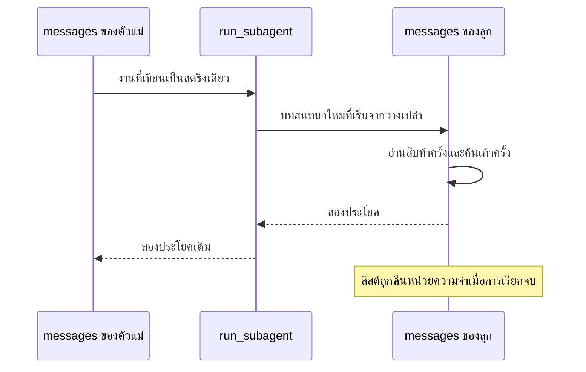

[Read in English](README.md)

# บทที่ 20 Subagents

บทที่ 19 ให้ tool ที่ agent ไม่ได้เขียนเองกับมัน บทนี้กลับเอาบางอย่างออกไปจากมันแทน
และสิ่งที่เอาออกไปคืองาน

นี่คือสิ่งที่อยู่ในโฟลเดอร์และที่มาของแต่ละไฟล์

```text
lessons/20-subagents/
  subagent.py         new. sixty one lines, and sixteen of them are the docstring
  check.py            new. six claims, and the last one is a warning
  agent.py            identical to lesson 19
    tools.py            identical to lesson 19
  grep_worker.py      identical to lesson 19

  prompt.py           identical to lesson 19
  permissions.py      identical to lesson 19
  session.py          identical to lesson 19
  context.py          identical to lesson 19
  providers.py        identical to lesson 19
  usage.py            identical to lesson 19
  retrieval.py        identical to lesson 19
  retry.py            identical to lesson 19
  cancel.py           identical to lesson 19
  main.py             identical to lesson 19
  mcp.py              identical to lesson 19
  mock_mcp_server.py  identical to lesson 19
  README.md           this file
```

ทุกโฟลเดอร์ตั้งแต่บทที่ 19 เป็นต้นไปจะพกโค้ดทั้งคอร์สไว้ครบ เพื่อให้เปิดบทไหนขึ้นมาก็รันได้ด้วยตัวเอง
โดยไม่ต้องคัดลอกไฟล์จากโฟลเดอร์ข้างเคียงเข้ามาก่อน นั่นคือเหตุผลที่ `mcp.py`,
`mock_mcp_server.py` และ `main.py` นอนอยู่ตรงนี้ทั้งที่บทนี้ไม่เคยพูดถึงมันเลย

สิบห้าจากสิบเจ็ดไฟล์ Python เหมือนเดิมทุก byte กับบทที่แล้ว นั่นเป็นสิ่งที่ตรวจสอบได้
ไม่ใช่แค่กล่าวอ้าง

```bash
cd lessons
for f in agent.py tools.py permissions.py context.py providers.py; do
  diff -qs 19-mcp-client/$f 20-subagents/$f
done
```

```text
Files 19-mcp-client/agent.py and 20-subagents/agent.py are identical
Files 19-mcp-client/tools.py and 20-subagents/tools.py are identical
Files 19-mcp-client/permissions.py and 20-subagents/permissions.py are identical
Files 19-mcp-client/context.py and 20-subagents/context.py are identical
Files 19-mcp-client/providers.py and 20-subagents/providers.py are identical
```

จำผลลัพธ์นี้ไว้ หัวข้อ 3 ว่าด้วยความหมายของมันล้วน ๆ และมันมีความหมายมากกว่า
ที่ดูเหมือนจะมี

## 1. ปัญหาที่ค้างมาจากบทที่ 19

บอกก่อนว่าปัญหาคืออะไรในหนึ่งประโยค แล้วค่อยทำให้เป็นรูปธรรม เพราะคำบ่นแบบ
นามธรรมเรื่องนี้พบเจอบ่อยเสียจนแทบไม่มีความหมายอะไรแล้ว

**agent ตัวเดียวที่ทำทุกอย่างในบทสนทนาเดียวจะถม context ของตัวเองจนเต็ม
และสิ่งที่ถมได้เร็วที่สุดคืองานที่มันไม่จำเป็นต้องจำ**

ทีนี้มาดูรูปธรรม ให้คำถามจริงกับ agent จากบทที่ 18 อะไรทำนองนี้ ซึ่งเป็นคำถาม
บ่ายวันอังคารธรรมดา ไม่ใช่การทดสอบความทนทาน

```text
Where does the retry delay come from, and is it configurable?
```

ดูสิว่ามันทำอะไร มัน grep หา `retry` ได้เก้าจุดในหกไฟล์ อ่าน `retry.py` อ่านจุดเรียก
สองจุด grep หา `sleep` เจอ fixture ในไฟล์ check ที่บังตัวจริงไว้ อ่าน check นั้น
เพื่อตัดออก อ่าน `providers.py` เพราะนั่นคือที่ที่การห่อควรจะไปอยู่ grep หา
`attempts` และอ่านอีกสามไฟล์เพื่อดูว่ามีอะไรส่งค่านั้นเข้าไปหรือไม่ ตีเสียว่าอ่านไฟล์
สิบห้าครั้งกับค้นหาอีกไม่กี่ครั้ง แล้วมันก็ตอบด้วยสองประโยค

สองประโยคนั้นคือสิ่งที่คุณต้องการ ทุกอย่างที่อยู่เหนือมันคือนั่งร้านที่มีอยู่เพื่อผลิต
สองประโยคนั้นเท่านั้น

แต่ดูสิว่านั่งร้านตอนนี้ไปอยู่ที่ไหน บทที่ 04 วางรูปทรงของ turn ไว้ และไม่มีอะไร
หลังจากนั้นเปลี่ยนมันเลย ผลลัพธ์ของ tool ทุกอันถูกต่อท้าย `messages` ในฐานะข้อความ
และ `messages` ถูกส่งใหม่ทั้งหมดในทุก request ที่ตามมา ดังนั้นเนื้อหาของไฟล์สิบห้าไฟล์
จึงไม่ใช่สิ่งที่เกิดขึ้นแล้วจบไป มันกลายเป็นผู้อาศัยถาวรในบทสนทนา ถูกอัปโหลดใหม่
ทุก turn ไปตลอดการรัน แย่งความสนใจกับทุกอย่างที่ตามมาหลังจากนั้น

ไม่มีอะไรใน ภาค 3 แก้เรื่องนี้ได้ และควรพูดให้ชัดว่าทำไม เพราะแต่ละชิ้นดูเหมือน
น่าจะแก้ได้

`fit_to_budget` จากบทที่ 14 ไม่ได้แก้ มันถูกกระตุ้นโดยปัญหานี้มากกว่าจะเป็นทางแก้
และเมื่อมันทำงาน มันทิ้งบล็อกที่เก่าที่สุดก่อน บล็อกที่เก่าที่สุดคือคำถามดั้งเดิมของคุณ
ไฟล์แรกที่มันอ่าน และเหตุผลที่มันเลือกวิธีนี้ ดังนั้นเนื้อหาไฟล์สิบห้าไฟล์ที่จำเป็นอยู่
เก้าสิบวินาทีจึงไล่คำสั่งที่ต้องอยู่รอดตลอดการรันออกไป นั่นไม่ใช่บั๊กของตัวตัด
ตัวตัดถูกสั่งให้เคลียร์ที่ว่างและมันก็เคลียร์ที่ว่าง และสิ่งเดียวที่มันรู้เกี่ยวกับความเกี่ยวข้อง
คือตำแหน่ง

`Usage` จากบทที่ 15 ก็ไม่ได้แก้เช่นกัน มันบอกคุณทีหลังว่าจำนวน prompt token
ไต่ขึ้นทุก turn ซึ่งจริงและไร้ประโยชน์ เพราะการรู้ว่าอะไรมีต้นทุนเท่าไรไม่เหมือนกับ
การมีที่อื่นให้เอาไปวาง

และบทที่ 19 ทำให้แย่ลงอย่างวัดได้แทนที่จะดีขึ้น เชื่อม MCP server สี่ตัวแล้ว schema
ของ tool สี่สิบตัวจะถูก serialise ลงในทุก request ก่อนบทสนทนาจะเริ่มด้วยซ้ำ
หน้าต่างเป็นทรัพยากรหายากอยู่แล้ว และบทที่มาก่อนบทนี้ใช้มันไปอีก

จึงมีแรงกดดันสองแบบบนงบประมาณคงที่ก้อนเดียวกัน schema ของ tool ซึ่งถูกคิด
ต่อ request และเป็นปัญหาของบทที่ 19 กับผลลัพธ์ของ tool ซึ่งสะสมและเป็นปัญหา
ของบทนี้ อย่างที่สองแย่กว่า เพราะอย่างน้อย schema ก็มีขนาดคงที่

นี่คือรูปทรงของความล้มเหลวที่เกิดขึ้น และมันร้ายกว่าการ crash agent ไม่ได้ล้ม
มันค่อย ๆ โง่ลงตลอดการรันที่ยาว ลืมส่วนที่เก่าที่สุดและสำคัญที่สุดของการให้เหตุผล
ของตัวเอง ในขณะที่ทุกบรรทัด log ดูปกติดีและไม่มี exception ถูกโยนเลย คุณรู้ตัว
ตอนที่คำตอบใน turn ที่สามสิบขัดกับแผนจาก turn ที่สี่

ปัญหาที่แท้จริงใต้ทั้งหมดนี้คือบทสนทนาเดียวกำลังถูกขอให้แบกงานที่ไม่พอดีกับ
บทสนทนาเดียว คุณตัดทิ้งจนหลุดจากปัญหานั้นไม่ได้ และหน้าต่างที่ใหญ่ขึ้นก็แค่ย้ายกำแพง

## 2. subagent คืออะไร และไม่ใช่อะไร

เริ่มจากสิ่งที่มันไม่ใช่ เพราะเกือบทุกอย่างที่เขียนถึงคำนี้เข้าใจผิดไปในทิศทางเดียวกัน

subagent **ไม่ใช่** กลไกใหม่ ไม่ใช่ฟีเจอร์ของ framework ไม่ใช่ model คนละแบบ
หรือเล็กกว่า หรือเฉพาะทางกว่า ไม่มีชั้น orchestration ตรงนี้ ไม่มี supervisor class
ไม่มี agent registry และไม่มีอะไรใน `agent.py` รู้ว่าสิ่งเหล่านี้มีอยู่

นี่คือสิ่งที่มันเป็นจริง ๆ และ docstring ระดับ module พูดไว้ในสองประโยคแรก

```python
"""Turning a whole agent into a single tool the parent can call.

There is no new machinery here. A subagent is a tool whose implementation
happens to run another agent. The parent sees a tool with a name and a
description, exactly like read_file, and the loop does not change at all.
That is the point worth noticing rather than the code.
"""
```

**subagent คือ tool ที่บังเอิญมีการ implement เป็นการรัน agent อีกตัว**

นั่นคือนิยามทั้งหมด และผลที่ตามมาทุกอย่างในบทนี้สืบมาจากมัน ตั้งแต่บทที่ 03
tool คือของสองอย่าง JSON schema ที่มีชื่อ คำอธิบาย และรายการพารามิเตอร์
ซึ่งคือสิ่งที่ model เห็น กับฟังก์ชัน Python ซึ่งคือสิ่งที่รันจริง ไม่มีอะไรที่ไหนบังคับว่า
ฟังก์ชันนั้นต้องเล็ก หรือเร็ว หรือไม่มีการเรียกเครือข่าย `run_shell` สตาร์ต process
ของระบบปฏิบัติการทั้ง process `search_notes` จากบทที่ 16 สร้าง embedding
และให้คะแนน vector index tool ของ MCP จากบทที่ 19 คุยกับโปรแกรมอื่นผ่าน pipe

ดังนั้นฟังก์ชันจึงได้รับอนุญาตให้รัน agent ดูสิว่า `run_subagent` คืออะไร

```python
    def run_subagent(task):
        try:
            answer, _ = build_child()(task)
        except Exception as error:
            return f"Error: the subagent failed, {type(error).__name__}: {error}"
        return answer or "The subagent finished without saying anything."
```

สามบรรทัดที่มีความหมาย สร้างลูก เรียกมันด้วยสตริง คืนสตริงที่มันผลิตออกมา
และนี่คือ schema ของมัน ซึ่งเป็นครึ่งที่ model เห็น

```python
    schema = {
        "type": "function",
        "function": {
            "name": "run_subagent",
            "description": DEFAULT_DESCRIPTION,
            "parameters": {
                "type": "object",
                "properties": {
                    "task": {
                        "type": "string",
                        "description": "The complete job, written so it makes sense on its own",
                    }
                },
                "required": ["task"],
            },
        },
    }
```

เทียบกับ schema ของ `read_file` ใน `tools.py` แล้วไม่มีความต่างเชิงโครงสร้างเลย
ชื่อหนึ่งชื่อ คำอธิบายหนึ่งอัน พารามิเตอร์สตริงที่จำเป็นหนึ่งตัว model ที่เลือกระหว่าง
สองอย่างนี้กำลังทำการเลือกแบบเดียว ไม่ใช่สองแบบ และมันไม่มีทางรู้เลยว่าอันหนึ่ง
เปิดไฟล์และอีกอันเริ่มบทสนทนากับ language model

การลงทะเบียนใช้สองบรรทัด และเป็นสองบรรทัดที่ tool ทุกตัวใช้มาตั้งแต่บทที่ 03

```python
    run_subagent, schema = run_subagent_factory(build_child)
    tools.SCHEMAS.append(schema)
    tools.FUNCTIONS["run_subagent"] = run_subagent
```

`tools.SCHEMAS` คือลิสต์ที่ถูก serialise ลงใน request `tools.FUNCTIONS` คือ
dictionary ที่ `tools.run` ใช้ค้นหาชื่อ นั่นคือ registry เดียวกับที่ `register_mcp`
ต่อเติมในบทที่ 19 และเป็นตัวเดียวกับที่ `read_file` อาศัยอยู่ตั้งแต่บทที่ 07

ทำไมต้องมองแบบนี้แทนที่จะสร้างชั้น orchestration จริง ๆ ก็เพราะสิ่งที่มุมมองนี้ซื้อมาให้
ซึ่งก็คือทุกอย่างที่ทำงานได้อยู่แล้ว การเรียก subagent ผ่าน `Permissions` เหมือนการเรียก
อย่างอื่น ดังนั้นมันถูกกั้น ปฏิเสธ หรือจดจำได้ มันถูกเขียนลงไฟล์ session ในฐานะ
assistant message ธรรมดาและผลลัพธ์ tool ธรรมดา ดังนั้นการรันที่ใช้มัน debug ได้
ด้วยการเปิดไฟล์ข้อความ มันถูกนับรวมใน `max_turns` มันอยู่ภายใต้การตรวจจับ
การทำซ้ำจากบทที่ 15 มันปรากฏใน `usage` ไม่มีอะไรในนั้นถูกออกแบบมาเพื่อ subagent
แต่ทั้งหมดใช้กับ subagent ได้เพราะ subagent มีรูปทรงเหมือน tool และกลไกพิเศษ
จะต้องไปไล่หาคุณสมบัติเหล่านั้นมาทีละอย่างเอง

มรดกชุดนั้นมีค่ามากกว่าที่ฟัง ในวันที่มีอะไรพลาด การมอบงานครั้งหนึ่งกลับมาด้วยคำตอบที่ไม่เข้าท่า
และมันถูกไล่ย้อนด้วยการเปิดไฟล์ session แล้วอ่านสองบรรทัดที่ตัวแม่เขียนไว้ คือการเรียก
`run_subagent` ที่มีสตริงงานอยู่ในนั้น กับผลลัพธ์ที่กลับมา แค่นั้นก็พอเห็นแล้วว่าสตริงงาน
ระบุไดเรกทอรีผิด ไม่มีใครเขียน logger ให้ subagent เลย ลูกมองไม่เห็นในไฟล์นั้น
แต่สตริงงานมองเห็น และสตริงงานคือบั๊ก

## 3. ทำไมเรื่องนั้นถึงสำคัญกว่าตัวโค้ด

กลับไปดูผลลัพธ์ `diff -qs` ที่หัวไฟล์แล้วอ่านบรรทัดแรกอีกครั้ง

```text
Files 19-mcp-client/agent.py and 20-subagents/agent.py are identical
```

ตอนนี้ agent สตาร์ต agent ตัวอื่นได้แล้ว และ agent loop ไม่ได้เปลี่ยน ไม่มีพารามิเตอร์
ไม่มีสาขาเงื่อนไข ไม่มีบรรทัดไหนเลย

นี่คือครั้งที่สี่ในคอร์สนี้ที่มีของสำคัญมาถึงโดยที่ loop ไม่รู้ตัว และรายการนี้ควรอยู่
รวมกันในที่เดียว เพราะรูปแบบนี้เองคือข้อโต้แย้ง

| สิ่งที่มาถึง | บทที่ | สิ่งที่เกิดกับ `agent.py` |
| --- | --- | --- |
| tool จริงเจ็ดตัว ไฟล์ shell glob grep | 07, 08, 09 | เหมือนบทที่ 06 |
| retrieval พร้อม embedder และ vector index | 16 | เหมือนบทที่ 15 |
| tool จาก process อื่นผ่าน MCP | 19 | เหมือนบทที่ 18 |
| agent ที่สตาร์ต agent ตัวอื่นได้ | 20 | เหมือนบทที่ 19 |

สี่ครั้ง แต่ละครั้งในตอนนั้นคือความสามารถใหม่ที่ใหญ่ที่สุดใน part ของมัน retrieval
คือสิ่งที่คนสร้างเป็นระบบพิเศษที่มี hook แทรกอยู่ทั่วทุกที่ MCP คือ network protocol
ที่มี handshake และวงจรชีวิต subagent คือสิ่งที่ทุก framework ให้ subsystem
ทั้งชุด ทั้งสี่อย่างเข้ามาในฐานะชื่อใน dictionary

ทีนี้อีกครึ่งของรูปแบบ จากตารางของบทที่ 18 permission เปลี่ยน loop session
เปลี่ยน loop การตัดทิ้งเปลี่ยน loop การนับ token และตัวกัน doom loop เปลี่ยน loop
การยกเลิกเปลี่ยน loop ห้า subsystem ห้าการเปลี่ยนแปลง

กฎนี้แม่นยำและยืนหยัดมาสิบสี่บท **tool ไม่เคยแตะ loop subsystem แตะเสมอ**
ซึ่งแปลว่าคำถามที่มีประโยชน์เกี่ยวกับความสามารถใหม่ไม่ใช่ว่ามันใหญ่แค่ไหน
แต่คือมันตกอยู่ฝั่งไหนของเส้นนั้น เพราะความสามารถที่แสดงเป็น tool ได้มีราคาเป็นไฟล์หนึ่งไฟล์
ส่วนความสามารถที่ทำไม่ได้มีราคาเป็นพารามิเตอร์บนฟังก์ชันที่อันตราย
ที่สุดในโปรแกรม

ทำไมเรื่องนี้ถึงคุ้มกับการมีหัวข้อของตัวเองแทนที่จะเป็นประโยคเดียว ลองนึกภาพ
บทนี้เวอร์ชันที่ `agent.py` งอกพารามิเตอร์ `subagents` งอกสาขาเงื่อนไขที่เช็กว่าการ
เรียกที่ขอมาเป็นการมอบงานหรือไม่ งอกเส้นทาง dispatch แยกสำหรับลูก
และงอกตัวนับความลึกเพื่อกันการเรียกซ้ำไม่รู้จบ ทุกอย่างนั้นเป็นสิ่งที่สมเหตุสมผล
ที่จะเขียน รวมกันแล้วมันแปลว่า loop รู้จักว่า subagent คืออะไร ซึ่งแปลว่า loop
ต้องถูกแก้อีกครั้งเมื่อ subagent เปลี่ยน ซึ่งแปลว่าไฟล์ที่ permission session
การตัดทิ้ง การนับ และการยกเลิกวิ่งผ่านทั้งหมด มีเหตุผลที่หกให้ต้องถูกเปิด

ตัวนับความลึกเป็นตัวที่น่าสนใจ เพราะมันคือสิ่งที่คุณอยากได้จริง ๆ และมุมมองนี้ก็ให้มัน
กับคุณฟรีอยู่แล้ว ลูกที่สร้างโดย `build_child` ได้ tool เท่าที่ตัว builder ลงทะเบียนให้
อย่าลงทะเบียน `run_subagent` ให้ลูก แล้วลูกก็ไม่มีทางสร้างหลานได้เลย
โดยไม่ต้องมีตัวนับและไม่ต้องมีการตรวจสอบ ขีดจำกัดถูกแสดงออกด้วยสิ่งที่อยู่ใน
dictionary แทนที่จะเป็นกฎใน loop

นั่นคือสิ่งที่ขอบเขตที่ตัดถูกที่ซื้อมาให้ ไม่ใช่ความเป็นระเบียบ แต่คือความสามารถที่จะ
เพิ่มความสามารถใหญ่อันที่สี่ด้วยวิธีเดียวกับที่คุณเพิ่มอันแรก

## 4. context isolation (ลูกมีบทสนทนาของตัวเอง ตัวแม่เห็นแค่คำตอบสุดท้าย) ซึ่งคือประเด็นทั้งหมด

ทุกอย่างที่ผ่านมาว่าด้วยรูปทรง หัวข้อนี้ว่าด้วยตัวเลข และตัวเลขคือเหตุผลที่จะทำ
ทั้งหมดนี้

`check.py` พิมพ์มันออกมาตรง ๆ

```text
OK the child had a 4 message conversation of its own
Hello from the mock server.
OK none of it landed in the parent, which kept 2 messages
```

แยกส่วนดู เพราะทั้งสองตัวเลขแม่นยำและถูกตรวจสอบทั้งคู่

ลูกรันงานนี้

```python
WRITE = 'Write it. [[tool:write_file:{"path": "made-by-child.txt", "content": "hello"}]]'
```

บทสนทนาของมันมีสี่ข้อความ user message ที่บรรจุงาน assistant message ที่บรรจุ
การเรียก tool ผลลัพธ์ tool ที่บอกว่าไฟล์ถูกเขียนแล้ว และ assistant message สุดท้าย
ที่มีคำตอบ นั่นคือการรัน agent ครบสมบูรณ์ที่มีการเรียก tool จริงอยู่ตรงกลาง
และนี่คือการยืนยันว่ามันเกิดขึ้นจริง

```python
    if not children or len(children[0]) < 4:
        fail(f"the child conversation looks wrong. Got {children!r}")
```

จากนั้นตัวแม่ก็ไปทำอย่างอื่นโดยสิ้นเชิง

```python
    parent_answer, parent_messages = run(
        provider(), "Say hello.", permissions=Permissions(auto_approve=True)
    )
    if any("made-by-child" in (m.get("content") or "") for m in parent_messages):
        fail("the child conversation leaked into the parent")
```

สองข้อความ user หนึ่ง assistant หนึ่ง check ไม่ได้แค่นับ มันค้นทุกข้อความหาสตริง
`made-by-child` ซึ่งเป็นชื่อไฟล์ที่ลูกเขียน และล้มเหลวถ้ามันปรากฏที่ไหนก็ตาม
การนับอย่างเดียวจะผ่านถ้าลิสต์ทั้งสองบังเอิญยาวเท่ากันขณะที่ใช้ลิสต์ที่เปลี่ยนแปลงได้
ร่วมกันอยู่ข้างใต้ ซึ่งเป็นวิธีทำพลาดที่เกิดขึ้นได้จริง การค้นหาสตริงพิสูจน์ว่างานของ
ลูกไม่อยู่จริง ๆ แทนที่จะแค่บังเอิญไม่ถูกนับ

สี่กับสอง สองตัวเลขนั้นคือบทนี้



ทีนี้ขยายกลับขึ้นไปหาคำถามเรื่อง retry จากหัวข้อ 1 การอ่านไฟล์สิบห้าครั้งกับ
การค้นหาอีกไม่กี่ครั้งเกิดขึ้นข้างในลูก ซึ่งแปลว่ามันไปตกอยู่ในลิสต์ `messages`
ของลูก ซึ่งเป็นตัวแปรท้องถิ่นในการเรียกฟังก์ชันที่คืนค่าแล้วจบ เมื่อ `run_subagent`
คืนค่า ลิสต์นั้นก็ไม่มีอะไรอ้างถึงและ Python ก็คืนหน่วยความจำ สิ่งที่ไปถึงตัวแม่
คือสตริงหนึ่งอัน

พูดผลที่ตามมาให้ชัด **ตัวแม่ได้ข้อสรุป ไม่ได้การสืบสวน** บทสนทนาของตัวแม่
โตขึ้นด้วย assistant message หนึ่งอันที่บรรจุการเรียก tool กับผลลัพธ์ tool หนึ่งอัน
ที่บรรจุสองประโยค ถ้าไม่มีลูก มันจะโตขึ้นด้วยเนื้อหาไฟล์สิบห้าไฟล์และผลลัพธ์ grep
เก้าอัน ซึ่งทั้งหมดจะถูกส่งใหม่ในทุก turn ที่เหลือของการรัน และทั้งหมดจะเป็นตัวเลือก
ให้ตัวตัดขับไล่อย่างอื่นออกไปเพื่อเปิดที่ให้มัน

มีสองอย่างตามมาที่พลาดได้ง่าย

การประหยัดไม่ได้อยู่ที่ token ที่ส่งครั้งเดียว แต่อยู่ที่ token ที่ส่งซ้ำ ๆ การอ่านไฟล์
มีต้นทุนเท่าขนาดของมันหนึ่งครั้งไม่ว่าใครจะอ่าน ความต่างคือไฟล์ที่ตัวแม่อ่าน
จะถูกจ่ายซ้ำในทุก request ที่ตามมาไปตลอดการรัน ส่วนไฟล์ที่ลูกอ่านจะถูกจ่าย
เฉพาะในช่วงชีวิตสั้น ๆ ของลูกเอง ในการรันสี่สิบ turn นั่นคือความต่างระหว่าง
การจ่ายครั้งเดียวกับการจ่ายสามสิบห้าครั้ง

และลูกคมกว่าที่ตัวแม่จะเป็นในงานเดียวกัน ด้วยเหตุผลเดียวกัน context ของมัน
บรรจุงานหนึ่งงานกับหลักฐานสำหรับงานนั้น โดยไม่มีบทสนทนาก่อนหน้า ไม่มีทางตัน
จากส่วนอื่นที่ไม่เกี่ยวข้องของงาน และไม่มีคำสั่งที่ขัดกัน คำถามแคบ ๆ ที่ถามใน context
ที่สะอาดเป็นคนละคำถามกับคำถามแคบ ๆ ที่ถามใน turn ที่สามสิบของการรันที่ยาว

## 5. ทำไม build_child ถึงเป็นฟังก์ชันแทนที่จะเป็น agent

ดูชื่อพารามิเตอร์ใน factory แล้วสังเกตว่ามันไม่ใช่อะไร

```python
def run_subagent_factory(build_child):
    """Build the function the parent will call, plus its schema.

    build_child is a function returning a fresh agent rather than an agent
    itself. That is deliberate. A subagent that kept its history between
    calls would slowly accumulate the same clutter it exists to prevent, and
    the second call would start wherever the first one happened to stop.
    """
```

`build_child` คือ factory มันถูกเรียกข้างใน `run_subagent` หนึ่งครั้งต่อหนึ่งการมอบงาน
และ agent ที่มันคืนมาจะถูกทิ้งเมื่อการเรียกจบลง

```python
            answer, _ = build_child()(task)
```

อ่านบรรทัดนั้นให้ดีเพราะมันทำสองอย่าง `build_child()` สร้างลูกตัวใหม่
แล้ว `(task)` ก็รันมัน ตัวใหม่ทุกครั้งไม่มียกเว้น

ทางเลือกอีกแบบสั้นกว่าหนึ่งบรรทัดและเป็นสิ่งที่นึกออกทันที ส่งลูกเข้าไป เก็บมันไว้
เรียกมันเมื่อตัวแม่มอบงาน

```python
def run_subagent_factory(child):          # the version that is wrong
    def run_subagent(task):
        answer, _ = child(task)           # same child, same conversation
        return answer
```

นั่นเป็นการนำปัญหาที่บทนี้มีอยู่เพื่อแก้กลับมาใหม่ เพียงแค่ลึกลงไปหนึ่งชั้น มอบการ
สืบสวนสามเรื่องให้ลูกที่คงอยู่ตลอด แล้วบทสนทนาของมันก็บรรจุทั้งสามเรื่อง
การมอบงานครั้งที่สามถูกตอบโดย agent ที่แบกบทสนทนาของสองครั้งแรกไว้
และ context ของลูกก็เต็มขึ้นในแบบเดียวกับที่ของตัวแม่เคยเป็น คุณย้ายความรก
ไปที่อื่นแทนที่จะกำจัดมัน และคุณเพิ่มที่ที่สองให้มันสะสมโดยไม่มีอะไรเฝ้าดู

มีความล้มเหลวที่สองและมันแย่กว่า เพราะมันไม่ใช่เรื่องขนาด **การเรียกครั้งที่สอง
จะเริ่มจากตรงที่ครั้งแรกบังเอิญหยุดไว้** ลูกที่เพิ่งใช้สี่ turn สรุปว่า retry delay
ถูกเขียนตายตัว ตอนนี้ได้รับงานที่ไม่เกี่ยวข้องกันเลยเรื่องรูปแบบของ session
โดยมีข้อสรุปนั้นนั่งอยู่ข้างบนในฐานะข้อเท็จจริงที่ยืนยันแล้ว model ปรับตัวตามสิ่งที่
อยู่ในหน้าต่าง นั่นคือกลไกทั้งหมด ดังนั้นคำตอบของคำถามที่สองจึงถูกกำหนดรูปร่าง
โดยคำถามแรก และไม่มี error ไม่มีคำเตือน และไม่มีทางบอกได้จากภายนอก
คุณได้คำตอบที่ดูสมเหตุสมผลซึ่งถูกปนเปื้อนโดยคำถามที่ไม่มีใครถาม

มันโผล่มาในรูปคำตอบที่ดีต่อคำถามที่ผิด ตัวแม่ตัวหนึ่งเก็บลูกไว้ตัวเดียวแล้วส่งงานให้สามชิ้นติดกัน
ชิ้นที่สามถามว่าไฟล์ไหนบ้างที่เขียนลง session ลูกเพิ่งใช้สี่เทิร์นก่อนหน้าพิสูจน์ว่า retry delay
ถูกเขียนตายตัวไว้ใน `retry.py` และมันก็กลับมาด้วยการเอ่ยชื่อ `retry.py` เป็นอันดับแรก
พร้อมประโยคหนึ่งเรื่องการเขียน delay ในแต่ละรอบ ไม่มีอะไรในคำตอบนั้นที่โกหก
มันคือคำตอบของคำถามสองข้อที่ผสมกัน และมีแค่ข้อเดียวที่ถูกถาม

ข้อโต้แย้งเดียวกันนี้ผลิตคุณสมบัติที่ควรเอ่ยชื่อ การมอบงานทุกครั้งเป็นอิสระจากครั้งอื่น
เรียก tool สามครั้งด้วยงานเดียวกันแล้วคุณจะได้การรันสามครั้งที่ส่งอิทธิพลต่อกัน
ไม่ได้ ซึ่งเป็นสิ่งที่ทำให้ผลลัพธ์เทียบกันได้ และเป็นเหตุผลที่การมอบงานที่ล้มเหลวปลอดภัย
พอจะลองใหม่ได้เฉย ๆ บทที่ 21 ต้องใช้คุณสมบัตินี้และเขียนไม่ได้เลยถ้าไม่มีมัน
เพราะการรันลูกสี่ตัวพร้อมกันบน thread ต้องการว่าไม่มีสองตัวไหนใช้ state ร่วมกัน

สังเกตด้วยว่า factory ไม่ได้ตัดสินอะไรบ้าง มันไม่มีความเห็นว่าลูกใช้ provider ไหน
ได้ system prompt อะไร เข้าถึง tool ตัวไหนได้ หรือ object permission ของมัน
อนุญาตอะไร ทั้งหมดนั้นอยู่ใน `build_child` ที่ผู้เรียกจัดหามาให้ ซึ่งใน `check.py` คือแบบนี้

```python
    def build_child():
        def child(task):
            answer, messages = run(
                provider(), task, permissions=Permissions(auto_approve=True)
            )
            children.append(messages)
            return answer, messages

        return child
```

closure ที่ครอบ `children` ไว้ เพื่อให้ check ตรวจสอบได้ว่าลูกทำอะไรไปบ้าง
ซึ่งเป็นไปได้ก็เพราะ builder ถูกจัดหามาจากภายนอก โปรแกรมจริงจะใส่ model
ที่ถูกกว่าตรงนี้ หรือ `Permissions` แบบอ่านอย่างเดียว หรือ tool registry ที่แคบกว่า
และ `subagent.py` ก็ไม่ต้องเปลี่ยนเลยสำหรับอย่างใดอย่างหนึ่ง สัญญาทั้งหมดของ
factory คือคุณยื่นของที่เรียกได้ซึ่งคืน agent สดให้มัน ในแบบเดียวกับที่ `with_retries`
จากบทที่ 17 รับ callable และไม่มีความเห็นว่าข้างในมีอะไร

## 6. การเขียนคำอธิบายให้ตัวแม่

นี่คือส่วนที่ข้ามง่ายที่สุดและมีแนวโน้มมากที่สุดที่จะเป็นเหตุผลที่ subagent ใช้ไม่ได้ผล
นี่คือมันทั้งหมด ตรงตามที่มันถูกส่งมาจริง

```python
DEFAULT_DESCRIPTION = (
    "Hand a self contained job to a separate agent and get back only its final "
    "answer. Use this for work that needs many steps of searching or reading, "
    "when you want the conclusion and not the whole investigation. Describe the "
    "job completely, because the other agent cannot see this conversation."
)
```

สี่ประโยค แต่ละประโยคทำหน้าที่ต่างกัน

ประโยคแรกบอกว่า tool ทำอะไร ยื่นงานให้ ได้กลับมาเฉพาะคำตอบสุดท้าย คำว่า
`only` ทำงานหนัก มันบอก model ไม่ให้คาดหวังบทสนทนาทั้งชุด ดังนั้นมันจึงไม่เขียนงาน
ที่ขอให้ลูกแสดงขั้นตอนทีละขั้น ซึ่งจะทำลายจุดประสงค์ด้วยการดึงการสืบสวน
กลับเข้ามาใน context ของตัวแม่ผ่านค่าที่คืนกลับมา

ประโยคที่สองบอกว่าเมื่อไรควรคว้ามันมาใช้ งานที่ต้องค้นหาหรืออ่านหลายขั้น
นี่คือประโยคที่ต้องแข่งกับทางเลือกอื่น เพราะ model กำลังเลือกระหว่าง tool ตัวนี้
กับการเรียก `grep_files` เอง และการเรียก `grep_files` เองคือสิ่งที่มันทำมาในทุกบท
ก่อนหน้านี้ คำอธิบายที่บอกแค่ว่า tool ทำอะไรปล่อยให้ model เดาเอาเองว่าเมื่อไร
และ tool ที่ model ไม่เคยเลือกก็คือ tool ที่ไม่มีอยู่ บทที่ 09 ให้ข้อโต้แย้งเดียวกัน
เรื่อง search และบทที่ 16 ให้เรื่อง `search_notes` คำอธิบายไม่ใช่เอกสาร มันคือคำสั่ง
เดียวที่ model มีเกี่ยวกับการเลือก

ประโยคที่สามระบุการแลกเปลี่ยน ข้อสรุปไม่ใช่การสืบสวนทั้งหมด นั่นคือต้นทุน
ที่บอกอย่างซื่อสัตย์ และการบอกมันทำให้ model เลือกได้จริงแทนที่จะถูกผลักดัน
ถ้ามันต้องการขั้นตอนกลางสำหรับสิ่งที่จะทำต่อไป มันก็ไม่ควรมอบงาน และประโยคนี้
คือสิ่งที่บอกมันแบบนั้น

ประโยคที่สี่คือประโยคที่ตัดออกไม่ได้ agent อีกตัวมองไม่เห็นบทสนทนานี้

ลองนั่งคิดว่าทำไมประโยคนั้นต้องอยู่ตรงนั้น จากมุมของ model tool ทุกตัวที่มันเคยเรียก
ใช้ context ร่วมกันโดยปริยาย `read_file` อ่านจาก workspace ที่มันถูกบอกไว้ใน
system prompt `grep_files` ค้นในต้นไม้เดียวกัน เมื่อมันเรียก `edit_file` ด้วยข้อความ
`old` ข้อความนั้นมาจากสิ่งที่มันอ่านไปก่อนหน้านี้ในบทสนทนาเดียวกัน ความต่อเนื่อง
เป็นสมมติฐานพื้นหลังของ tool ทุกตัวในโปรแกรม

`run_subagent` ทำลายสมมติฐานนั้น และไม่มีอะไรใน schema ส่งสัญญาณเรื่องนี้เลย
พารามิเตอร์คือสตริงชื่อ `task` ไม่มีอะไรในพารามิเตอร์ที่เป็นสตริงที่บอกว่าผู้อ่านสตริงนี้
เริ่มจากศูนย์

ดังนั้นตัวแม่ที่ไม่ถูกบอกจะเขียนงานแบบที่มันจะเขียนให้ตัวเอง

```text
task = "Find out where that delay comes from and check the other one too"
```

ทุกคำในนั้นอ้างถึงสิ่งที่ลูกมองไม่เห็น delay อันไหน อีกอันคืออันไหน ลูกได้รับ
ข้อความนั้นเป็นจักรวาลทั้งหมดของมัน ไม่มีทางเลือกที่จะถามคำถามเพื่อความชัดเจน
เพราะไม่มีใครให้ถาม และผลิตคำตอบที่ดูสมเหตุสมผลต่อคำถามที่มันต้องเดาเอา
**ตัวแม่ที่เขียนงานคลุมเครือจะได้คำตอบคลุมเครือกลับมา** และมันได้มาด้วยน้ำเสียง
มั่นใจของการสืบสวนที่เสร็จสมบูรณ์ ซึ่งแย่กว่า error เพราะมันดูเหมือนผลลัพธ์

ครั้งหนึ่งเรื่องแบบนี้กินเวลาไปครึ่งวัน ตัวแม่มอบงานด้วยคำว่า `check the other one too`
ตอนที่มันกำลังถือ provider สองตัวไว้ในหัว ลูกไม่เคยได้ยินชื่อทั้งสองตัว เดาเอาตัวที่ถูกเอ่ยชื่อ
ใน system prompt ของตัวเอง แล้วคืนสี่ประโยคที่ดูมั่นใจเกี่ยวกับตัวนั้นกลับมา จากนั้นตัวแม่
ก็เขียนสรุปว่า provider ทั้งสองตัวสอดคล้องกัน ทั้งสองตัวยังไม่เคยถูกดูเลย
บทบันทึกของตัวแม่เองแสดงการเรียก tool หนึ่งครั้งกับผลลัพธ์ที่สะอาดหนึ่งอัน

เมื่อถูกบอกเรื่อง isolation แล้วตัวแม่จะเขียนแบบนี้แทน

```text
task = "In retry.py, find where the delay between attempts is calculated,
        report whether the number is hardcoded or configurable, and name every
        file that passes an attempts or sleep argument to with_retries."
```

ครบในตัวเอง ระบุไฟล์ ระบุคำถาม ระบุว่าคำตอบควรมีอะไร

ข้อกำหนดเดียวกันนี้ถูกพูดซ้ำบนตัวพารามิเตอร์เอง ไม่ใช่แค่ในคำอธิบายของ tool

```python
"description": "The complete job, written so it makes sense on its own",
```

ทั้งสองที่ อย่างจงใจ คำอธิบายของ tool ถูกอ่านตอนที่ model กำลังตัดสินใจว่าจะเรียก
tool หรือไม่ คำอธิบายของพารามิเตอร์ถูกอ่านตอนที่มันกำลังตัดสินใจว่าจะใส่อะไรลงในช่อง
นั่นคือสองจังหวะที่ต่างกัน จังหวะที่สองคือที่ที่ความผิดพลาดเกิดขึ้นจริง และข้อกำหนด
ที่บอกไว้แค่ในจังหวะแรกคือข้อกำหนดที่บอกเร็วเกินไป

## 7. ลูกที่ล้มเหลวต้องไม่ลากตัวแม่ล้มไปด้วย

เนื้อทั้งหมดของ `run_subagent` นั่งอยู่ใน try

```python
    def run_subagent(task):
        try:
            answer, _ = build_child()(task)
        except Exception as error:
            # A child that fails must not take the parent with it. The parent
            # can read this, decide the approach did not work, and try
            # something else, which is what a person would do.
            return f"Error: the subagent failed, {type(error).__name__}: {error}"
        return answer or "The subagent finished without saying anything."
```

มีการตัดสินใจสองอย่างตรงนี้ และทั้งสองสวนทางกับคำแนะนำปกติ ดังนั้นทั้งสอง
ต้องมีคำอธิบาย

exception handler กว้างโดยตั้งใจ `except Exception` เปล่า ๆ ปกติเป็น
กลิ่นโค้ดที่ไม่ดี และปกติมันเป็นกลิ่นที่ไม่ดีด้วยเหตุผลที่ดี คือมันซ่อนบั๊กที่คุณอยากเห็น
มันถูกต้องตรงนี้เพราะสิ่งที่อยู่ข้างใน try การรัน agent ทั้งชุดอยู่ข้างใน try
นั่นแปลว่า HTTP timeout จาก provider เพย์โหลด JSON ที่ผิดรูป `KeyError` จาก
รูปทรง response ที่เปลี่ยนไป `RuntimeError` ที่ `agent.py` โยนเมื่อการรันเกิน
`max_turns` tool ที่โยนอะไรบางอย่างที่ไม่มีใครคาดคิด และ MCP server จากบทที่ 19
ที่ตายกลาง session การไล่รายการนั้นให้ครบเป็นไปไม่ได้ และรายการที่ผิดจะล้มเหลว
ในแบบที่แย่ที่สุด คือ exception ประเภทหนึ่งที่ไม่ได้อยู่ในรายการหลุดขึ้นไปฆ่าการรัน
ของตัวแม่ที่ลึกมาสี่สิบ turn แล้วและมีทางเลือกที่ดีอยู่ในมือ

ซึ่งเป็นครึ่งที่สองของข้อโต้แย้ง รัศมีความเสียหายของการจับมากเกินไปตรงนี้คือผลลัพธ์
tool ที่ไม่ดีหนึ่งอัน และตัวแม่อ่านผลลัพธ์ tool เป็นอาชีพอยู่แล้ว รัศมีความเสียหาย
ของการจับน้อยเกินไปคือการรันของตัวแม่ทั้งหมด

error กลับมาเป็นข้อความแทนที่จะถูกโยน นี่คือการตัดสินใจที่น่าสนใจกว่า
และเป็นการตัดสินใจเดียวกับที่บทที่ 08 ทำกับ `run_shell` ซึ่งจับ stderr และ exit code
แล้วยื่นทั้งคู่ให้ model แทนที่จะโยน คอมเมนต์ระบุเหตุผลไว้

```text
The parent can read this, decide the approach did not work, and try
something else, which is what a person would do.
```

โยน แล้วตัวแม่ก็ตาย มันไม่มีโอกาสตอบสนอง session ของมันจบ และอะไรก็ตาม
ที่มันคิดออกใน สี่สิบ turn ก่อนหน้าก็หายไป คืนสตริง แล้วความล้มเหลวก็เข้าสู่บทสนทนา
ในฐานะผลลัพธ์ tool ธรรมดา ซึ่งเป็น input ชนิดเดียวที่ agent loop ถูกสร้างขึ้นมา
เพื่อตอบสนองโดยเฉพาะ ตัวแม่อ่านว่าการมอบงานล้มเหลว และมันทำสิ่งที่มนุษย์
จะทำได้ ทำการสืบสวนเองด้วย `grep_files` ลองมอบงานอีกครั้งด้วยงานที่แคบลง
รายงานผู้ใช้ว่าส่วนนี้ทำไม่สำเร็จแล้วเดินหน้าทำส่วนที่เหลือต่อ

สังเกตว่ามีอะไรอยู่ในสตริง เพราะเนื้อหาก็ทำงานเหมือนกัน

```python
    return f"Error: the subagent failed, {type(error).__name__}: {error}"
```

ชื่อคลาสของ exception กับข้อความ `TimeoutError` ชวนให้ลองใหม่ `RuntimeError`
เรื่อง `max_turns` บอกว่างานใหญ่เกินไปและควรถูกแบ่งแทนที่จะทำซ้ำ
`FileNotFoundError` บอกว่าลูกถูกชี้ไปยังที่ที่ไม่มีอยู่ และการทำซ้ำจะล้มเหลว
เหมือนเดิม model แยกแยะสิ่งเหล่านั้นได้ก็ต่อเมื่อคุณบอกมันว่าเกิดอันไหนขึ้น
และ `Error, the subagent failed` เพียงลำพังไม่ได้บอกอะไรที่มันทำอะไรต่อได้เลย

บรรทัดสุดท้ายคือหลักการเดียวกันที่ใช้กับความล้มเหลวที่เงียบกว่า

```python
        return answer or "The subagent finished without saying anything."
```

ลูกที่จบด้วยข้อความสุดท้ายว่างเปล่าไม่ใช่ exception ไม่มีอะไรถูกโยน
แต่การคืนสตริงว่างให้ตัวแม่ทำให้เกิดผลลัพธ์ tool ที่ไม่มีเนื้อหา และ model
ที่ได้รับผลลัพธ์ tool ว่างเปล่าต้องเดาว่า tool สำเร็จอย่างเงียบ ๆ คืนอะไรที่ไม่มีความหมาย
หรือพังไปแล้ว ประโยคที่บอกชัดเจนว่าลูกจบโดยไม่ได้พูดอะไรเป็นข้อเท็จจริง
ที่ตัวแม่ทำอะไรต่อได้ และมันมีต้นทุนแค่หกคำ

## 8. กับดักที่มาพร้อมกับ isolation

นี่คือหัวข้อที่สำคัญที่สุดในบทนี้และเป็นหัวข้อที่ควรอ่านสองรอบ ทุกอย่างข้างบนขายเทคนิค
ให้คุณ ส่วนนี่คือใบเรียกเก็บเงิน

docstring ระดับ module พูดไว้ในสามประโยค

```text
The same isolation is also the trap. The child and the parent hold separate
views of the world, so a file the child changed is still the old file as far
as the parent is concerned. Nothing tells the parent it is now wrong.
```

`check.py` ไม่ได้อธิบายเรื่องนี้ มันสาธิต และการสาธิตนั้นรันในทุกครั้งที่ push

```python
    shared = workspace / "shared.txt"
    shared.write_text("original", encoding="utf-8")
    parent_saw = tools.run("read_file", {"path": "shared.txt"})
    tools.run(
        "run_subagent",
        {"task": 'Rewrite. [[tool:write_file:{"path": "shared.txt", "content": "changed"}]]'},
    )
    now = shared.read_text(encoding="utf-8")
    if parent_saw == now:
        fail("this demonstration is broken, the file should have changed")
```

สี่ขั้นตอน เขียนไฟล์ที่มีเนื้อหาที่รู้อยู่แล้ว ตัวแม่อ่านมันและเนื้อหาไปอยู่ใน `parent_saw`
ซึ่งแทน context ของตัวแม่ มอบงานที่เขียนทับไฟล์เดียวกัน อ่านดิสก์อีกครั้ง

นี่คือสิ่งที่มันพิมพ์ออกมา จากการรันจริงกับ mock server

```text
[calling write_file with {'path': 'shared.txt', 'content': 'changed'}]
[write_file returned Wrote 7 characters to shared.txt]
The tool returned Wrote 7 characters to shared.txt.
OK the trap is real, the parent still believes 'original' while the file now says 'changed'
```

อ่านบรรทัดสุดท้ายช้า ๆ **ตัวแม่ยังเชื่อว่า `original` ขณะที่ไฟล์ตอนนี้เขียนว่า `changed`**

ไม่มี error ไม่มีคำเตือน ผลลัพธ์ tool ของตัวแม่ที่มาจากลูก บอกว่าการมอบงาน
สำเร็จ ซึ่งเป็นเรื่องจริง ไม่มีที่ไหนเลยในบทสนทนาของตัวแม่ที่บ่งชี้ว่าไฟล์ที่มันอ่าน
ไปก่อนหน้านี้ไม่ใช่สิ่งที่มันอ่านอีกต่อไปแล้ว

และทีนี้ลองคิดว่าตัวแม่จะทำอะไรต่อ เพราะนั่นคือจุดที่ความเสียหายอยู่ มันถือ
`original` ไว้ใน context ในฐานะข้อเท็จจริงเกี่ยวกับโลก สมมติว่าตอนนี้มันเรียก `edit_file`

```python
tools.run("edit_file", {"path": "shared.txt", "old": "original", "new": "improved"})
```

`edit_file` จากบทที่ 07 ค้นหา `old` และปฏิเสธเมื่อหาไม่เจอ ดังนั้นการเรียกครั้งนี้
โดยเฉพาะจะล้มเหลวอย่างดังชัด และนั่นคือบทที่ 07 ที่คุ้มค่ากับที่ทางของมัน
ทีนี้สมมติว่าตัวแม่เรียก `write_file` แทน โดยประกอบไฟล์ขึ้นใหม่จากสิ่งที่มันจำได้
พร้อมการปรับปรุงหนึ่งอย่าง อันนั้นจะสำเร็จ และมันทำลายทุกอย่างที่ลูกทำไป
อย่างเงียบ ๆ ตัวแม่ไม่ได้สับสนเรื่องการแก้ที่มันกำลังทำ มันสับสนเรื่องไฟล์ที่มันกำลังแก้

ทีนี้ส่วนที่ทำให้เรื่องนี้เป็นหัวข้อแทนที่จะเป็นเชิงอรรถ

**isolation ที่ทำให้ subagent มีประโยชน์คือต้นเหตุเดียวกันของเรื่องนี้**

มันไม่ใช่ข้อเท็จจริงสองข้อ มันคือข้อเท็จจริงข้อเดียวที่มองจากสองด้าน หัวข้อ 4
ฉลองที่การอ่านไฟล์สิบห้าครั้งของลูกไม่ไปถึงตัวแม่ หัวข้อนี้บ่นว่าการเขียนไฟล์
หนึ่งครั้งของลูกก็ไม่ไปถึงตัวแม่เหมือนกัน ไม่มีเวอร์ชันไหนของการออกแบบที่
ข้อแรกจริงและข้อสองเท็จ เพราะกลไกคือกลไกเดียวกัน ลูกมีลิสต์ `messages`
ของตัวเอง ไม่มีอะไรในลิสต์ `messages` ของตัวแม่ที่ลูกเขียน นั่นคือฟีเจอร์
และนั่นคือบั๊ก และมันคือโค้ดบรรทัดเดียวกัน

ดังนั้นนี่ไม่ใช่สิ่งที่ต้องแก้ มันคือคุณสมบัติที่ต้องออกแบบเผื่อ และความต่างนั้นสำคัญ
เพราะคนเสียเวลาไปมากกับการพยายามแก้มัน ทางแก้ทุกทางฟังดูสมเหตุสมผลและ
ล้มเหลวหมด แชร์ลิสต์ข้อความร่วมกันแล้วคุณก็ลบประโยชน์ทั้งหมดทิ้งและสร้าง
บทสนทนาเดียวจากหัวข้อ 1 ขึ้นมาใหม่ ให้ตัวแม่อ่านทุกไฟล์ใหม่หลังทุกการมอบงาน
แล้วคุณก็ดึงเนื้อหาไฟล์กลับเข้ามาใน context ของตัวแม่ ซึ่งคือต้นทุนเดียวกับที่คุณ
กำลังหลบอยู่ จ่ายในจังหวะที่แย่กว่าเดิม diff workspace ก่อนและหลังแล้วฉีดการ
เปลี่ยนแปลงเข้าไป แล้วคุณก็เขียนกลไกที่จัดการได้แค่ไฟล์ ที่พลาดแถวในฐานข้อมูล
พลาดการเรียกเครือข่าย และพลาดอะไรก็ตามที่มี side effect และที่ใส่ subsystem
ใหม่ทั้งชุดลงในบทที่มีใจความว่าไม่ต้องมีอะไรใหม่เลย

มีสองนิสัยที่ใช้ได้จริง และมันเป็นนิสัยไม่ใช่กลไก

ให้ลูกรายงานว่ามันเปลี่ยนอะไร นี่คือประโยคเดียวในงานที่ตัวแม่เขียน
และมันไม่มีต้นทุนอะไรเลย

```text
task = "Update the retry delay in retry.py to start at two seconds.
        End your answer with a list of every file you modified and
        exactly what you changed in each."
```

ตอนนี้คำตอบสุดท้ายของลูกเอง ซึ่งเป็นสิ่งเดียวที่ข้ามเส้นแบ่งไปได้ ก็พก
ข้อมูลที่ตัวแม่ต้องการไปด้วย ช่องทางนี้มีอยู่แล้ว ค่าที่คืนกลับจะไปจบใน context
ของตัวแม่อยู่แล้ว ดังนั้นการใส่รายการการเปลี่ยนแปลงลงไปจึงมีต้นทุนหนึ่งบรรทัด
แทนที่จะเป็นทั้ง subsystem นี่ยังเป็นประโยคที่คุณใส่ไว้ถาวรใน system prompt
ของลูกผ่าน `build_child` ได้ด้วย เพื่อให้ลูกทุกตัวทำแบบนี้โดยที่ตัวแม่
ไม่ต้องจำ

อ่านสิ่งที่ตัวแม่กำลังจะลงมือกับมันใหม่ ไม่ใช่ทุกอย่าง และไม่ใช่ตามตาราง
แต่คือสิ่งที่มันกำลังจะเปลี่ยนโดยเฉพาะ ทันทีก่อนที่จะเปลี่ยน หลังการมอบงานใด ๆ
ที่อาจไปแตะมัน `read_file` แบบเจาะจงหนึ่งครั้งก่อน `edit_file` หนึ่งครั้งเป็นต้นทุน
ที่คุณวัดได้และมันน้อย การอ่านทั้งโลกใหม่หลังทุกการมอบงานไม่ใช่แบบนั้น

รูปแบบทั่วไปของเรื่องนี้ควรพกติดตัวไปเกินบทนี้ เพราะมันคือสิ่งที่บทที่ 21 จะเล่นงาน
หนักกว่ามาก **อะไรก็ตามที่มี agent มากกว่าหนึ่งตัวก็มีมุมมองต่อโลกมากกว่าหนึ่งมุม
และมุมมองเหล่านั้นเก่าล้าสมัยไปอย่างเงียบ ๆ** ดิสก์ถูกแชร์ context ไม่ถูกแชร์
ทุกข้อเท็จจริงที่ agent ถือไว้เกี่ยวกับทรัพยากรที่เปลี่ยนแปลงได้มี timestamp ติดอยู่
ซึ่งไม่มีใครจดไว้ และเมื่อไรที่มีผู้แสดงคนที่สอง timestamp นั้นก็เริ่มมีความสำคัญ

บทที่ 18 ให้คำเตือนเดียวกันในโทนอื่นตอนที่มันบอกว่า `session.py` เขียนเอกสาร
ตัวเองว่ารองรับผู้เขียนคนเดียว agent สองตัวที่ต่อท้ายไฟล์เดียวกันจะเขียนสลับกัน
และทำให้ไฟล์เสีย agent สองตัวที่ถือมุมมองต่อไฟล์เดียวกันทำให้อะไรบางอย่าง
ที่มองเห็นได้ยากกว่าเสียหาย

## 9. เมื่อไรที่ไม่ควรใช้

พูดให้เป็นธรรมกับทางเลือกอีกทาง เพราะทางเลือกอีกทางมักถูกต้อง

subagent ไม่ฟรีและไม่ถูก นับดูว่าการเรียกหนึ่งครั้งมีต้นทุนอะไรจริง ๆ

บทสนทนาที่สองทั้งชุด พร้อม system prompt ของตัวเองที่ถูกส่งในทุก turn ของลูก
สำเนา schema ของ tool ทุกตัวของตัวเอง ซึ่งหลังบทที่ 19 อาจมีสี่สิบตัว loop
หลาย turn ของตัวเอง โดยแต่ละ turn คือการวิ่งไปกลับหา model แยกกันหนึ่งรอบ
และทั้งหมดนั้นถูกจ่ายก่อนที่ลูกจะทำอะไรที่มีประโยชน์เลยสักอย่าง เพราะ
system prompt และ schema ออกไปตั้งแต่ request แรกสุดของลูก

ดังนั้นเทียบกันอย่างซื่อสัตย์

การทำเองสำหรับงานเล็กคือการเรียก tool สามครั้งในบทสนทนาที่มีอยู่แล้ว ซึ่ง
system prompt และ schema ของมันจะถูกส่งอยู่แล้ว การมอบงานเดียวกันคือ
system prompt ใหม่ รายการ schema ใหม่ การเรียก tool สามครั้ง บวก turn เพิ่ม
ฝั่งตัวแม่เพื่อออกคำสั่งมอบงาน และ turn เพิ่มอีกหนึ่งเพื่ออ่านคำตอบ

สำหรับงานสองหรือสามขั้น subagent แพงกว่าและช้ากว่าการทำเอง ไม่ใช่แค่
เล็กน้อย ต้นทุนคงที่ของการเริ่มบทสนทนาครอบงำโดยสิ้นเชิงที่ขนาดนั้น และคุณ
ยังเพิ่ม latency เข้าไปอีก เพราะตัวแม่นั่งถูกบล็อกอยู่ระหว่างที่ลูกวิ่งไปกลับ
ทีละรอบ

ลองใส่ตัวเลขให้เรื่องนี้ งานสามขั้นที่ทำในตัวแม่คือการเรียก tool สามครั้งบนบทสนทนา
ที่แบก system prompt และ schema ของมันอยู่แล้ว และมันจบในราวสิบเอ็ดวินาที
งานเดียวกันที่มอบให้ลูกส่ง system prompt กับ schema อีกสี่สิบตัวออกไปใหม่ให้ลูก
วิ่งไปกลับห้ารอบแทนที่จะเป็นสามรอบ และจบที่สามสิบสี่วินาที มันประหยัดผลลัพธ์ tool
ให้ตัวแม่ไปราวเก้าร้อย token เก้าร้อย token บน budget หนึ่งแสนไม่ใช่การประหยัด
มันคือเศษที่ปัดทิ้งได้ ซึ่งซื้อมาด้วยเวลารอสามเท่า

มีต้นทุนที่สองที่ไม่โผล่มาในรูปของ token ทุกอย่างที่ตัวแม่รู้ต้องถูกเขียนลงไปใน
สตริงงานด้วยมือ ในงานเล็ก คำอธิบายนั้นคืองานเกือบทั้งหมด และความเสี่ยงที่จะ
เขียนมันไม่ดี จากหัวข้อ 6 คือคำตอบผิดที่ดูมั่นใจ แทนที่จะเป็น error ที่มองเห็นได้
คุณจ่ายต้นทุนการแปลของจริง และคุณรับความเสี่ยงเรื่องความถูกต้องของจริง
เพื่อประหยัด context ที่คุณไม่ได้ขาด

และข้อที่สาม บทสนทนาของลูกหายไปแล้ว ถ้าคำตอบของตัวแม่ผิด การให้เหตุผล
ที่ผลิตส่วนที่ผิดอยู่ในลิสต์ `messages` ที่ถูกคืนหน่วยความจำไปตอนฟังก์ชันคืนค่า
`check.py` เห็นบทสนทนาของลูกได้ก็เพราะ `build_child` ถูกเขียนด้วย closure
ที่จับมันไว้ ในงานเล็กคุณแลกความสามารถในการ debug ทิ้งไป เพื่อการประหยัด
ที่คุณไม่ได้ต้องการ

ดังนั้นเกณฑ์ตัดสินคืออัตราส่วนมากกว่าขนาด มอบงานเมื่อการสืบสวนใหญ่กว่าข้อสรุปมาก
การอ่านไฟล์สิบห้าครั้งที่ผลิตสองประโยคนั้นคุ้มอย่างท่วมท้น การอ่านไฟล์สามครั้ง
ที่ผลิตสามประโยคไม่คุ้ม และอะไรก็ตามที่ตัวแม่ต้องใช้ผลลัพธ์ระหว่างทางเพื่อทำ
สิ่งถัดไปก็ไม่คุ้มเช่นกัน

มีอีกกรณีหนึ่งที่คำตอบคือไม่ ไม่ว่าขนาดเท่าไร อย่ามอบงานที่ตัวแม่ต้องใช้เหตุผล
กับขั้นตอนระหว่างทางของมัน ถ้าตัวแม่ต้องเปรียบเทียบไฟล์สองไฟล์ที่มันขอให้ลูก
ไปดู มันต้องการทั้งสองไฟล์ และลูกที่คืนบทสรุปของทั้งสองก็โยนสิ่งที่การเปรียบเทียบ
ต้องใช้ทิ้งไปแล้ว จงมอบคำถาม อย่ามอบขั้นตอน

## 10. การรัน check.py

จากในโฟลเดอร์ของบทเรียนโดยตั้งค่า endpoint ไว้แล้ว

```bash
cd lessons/20-subagents
python check.py
```

หรือรันทุกบทเรียนพร้อมกันกับ mock server ที่มีมาให้ ซึ่งเป็นสิ่งที่ CI รัน

```bash
python ci/run_lessons.py
```

นี่คือผลลัพธ์จริงของบทเรียนนี้

```text
OK a subagent is an ordinary tool as far as the parent is concerned

[calling write_file with {'path': 'made-by-child.txt', 'content': 'hello'}]
[write_file returned Wrote 5 characters to made-by-child.txt]
The tool returned Wrote 5 characters to made-by-child.txt.
OK the child did real work that reached the disk
OK the child had a 4 message conversation of its own
Hello from the mock server.
OK none of it landed in the parent, which kept 2 messages
OK a child that blew up left the parent standing

[calling write_file with {'path': 'shared.txt', 'content': 'changed'}]
[write_file returned Wrote 7 characters to shared.txt]
The tool returned Wrote 7 characters to shared.txt.
OK the trap is real, the parent still believes 'original' while the file now says 'changed'
```

บรรทัด `OK` หกบรรทัด และ docstring ของไฟล์เองบอกชัดว่าบรรทัดสุดท้ายเป็นของ
คนละชนิดกับอีกห้าบรรทัด

```text
Five things must be true. A subagent is an ordinary tool as far as the
parent is concerned. It does real work that reaches the disk. It holds a
conversation of its own. None of that conversation lands in the parent,
which is the reason to use one at all. And a child that blows up leaves the
parent standing.

The sixth thing this file demonstrates is not a feature. It is the trap that
comes with the isolation, which is that the parent keeps believing whatever
it read before the child changed it.
```

ไล่ดูทีละข้อ

หนึ่ง subagent เป็น tool ธรรมดาในสายตาของตัวแม่ check อ่านชื่อออกจาก
schema แล้วต่อท้าย schema และฟังก์ชันลงใน `tools.SCHEMAS` และ `tools.FUNCTIONS`
ถ้า subagent ต้องการอะไรที่ registry ไม่มีให้ ตรงนี้คือที่ที่มันจะโผล่ และมันไม่โผล่

สอง ลูกทำงานจริงที่ไปถึงดิสก์ นี่คือนิสัยที่บทที่ 18 โต้แย้งไว้ยืดยาว
การยืนยันอยู่ที่ระบบไฟล์ ไม่ใช่ที่ข้อความใด ๆ

```python
    answer = tools.run("run_subagent", {"task": WRITE})
    if not (workspace / "made-by-child.txt").exists():
        fail(f"the child did no real work. It said {answer!r}")
```

`tools.run` ด้วยชื่อ ซึ่งเป็นเส้นทางการเรียกเดียวกับที่ loop ใช้เป๊ะ ดังนั้นการมอบงาน
จึงผ่าน dispatch เดียวกับที่การรันจริงจะใช้ จากนั้นจึงตรวจดิสก์ ลูกที่บอกว่าเขียน
ไฟล์แล้วแต่ไม่ได้เขียนจะล้มเหลวตรงนี้ ซึ่งเป็นเหตุผลทั้งหมดที่ต้องยืนยันที่ side effect
แทนที่จะยืนยันที่ตัวหนังสือ

สามกับสี่คือคู่จากหัวข้อ 4 สี่ข้อความในลูก สองข้อความในตัวแม่ พร้อมการค้น
สตริงที่พิสูจน์ว่าไม่มีการรั่วไหล

**ห้า ลูกที่ระเบิดทิ้งตัวแม่ให้ยังยืนอยู่ได้**

```python
    def build_broken():
        def child(task):
            raise RuntimeError("the child could not start")

        return child

    broken_tool, _ = run_subagent_factory(build_broken)
    result = broken_tool("anything")
```

builder ที่คืนลูกที่โยน exception ทันที ซึ่งเป็นไปได้ก็เพราะ builder ถูกฉีดเข้ามา
จากนั้น tool ถูกเรียกตรง ๆ และ check รอดมาดูค่าที่คืนกลับได้ ซึ่งตัวมันเองคือหลักฐาน
เพราะถ้า exception หลุดขึ้นไป check ก็จะตายที่บรรทัดนั้นแทนที่จะพิมพ์อะไรออกมา

ทั้งสองครึ่งของการยืนยันนั้นทำงานจริง

```python
    if not result.startswith("Error") or "could not start" not in result:
```

ผลลัพธ์ต้องขึ้นต้นด้วย `Error` และต้องยังพกข้อความของลูกเองมาด้วย ครึ่งไหน
ล้มเหลวก็ทำให้ check ล้มเหลว ดังนั้นทั้งรูปทรงของค่าที่คืนกลับและเนื้อหาของมัน
ถูกตรึงไว้ทั้งคู่ ซึ่งสำคัญเพราะความล้มเหลวสองแบบนั้นต่างกัน handler ที่เลิกใส่ prefix
`Error` จะทำให้ตัวแม่แยกความล้มเหลวออกจากคำตอบไม่ได้ handler ที่จับ exception
แล้วโยนสิ่งที่มันพูดทิ้งจะทำให้ตัวแม่แยก timeout ที่ควรลองใหม่ ออกจาก error
เรื่อง `max_turns` ที่ควรแบ่งงานไม่ได้ ซึ่งคือข้อโต้แย้งที่หัวข้อ 7 ทำไว้ว่าทำไมชื่อคลาส
ของ exception และข้อความถึงอยู่ในสตริงตั้งแต่แรก

หก กับดักมีอยู่จริง มันพิมพ์บรรทัด `OK` ของตัวเองเหมือนอีกห้าข้อ และการสาธิต
ที่อยู่เบื้องหลังมันมี guard ของตัวเอง

```python
    if parent_saw == now:
        fail("this demonstration is broken, the file should have changed")
```

มันล้มเหลวเมื่อไฟล์ไม่ได้เปลี่ยน ซึ่งจะแปลว่าการสาธิตไม่ได้พิสูจน์อะไรเลย คำเตือน
ที่เลิกเตือนแย่กว่าไม่มีคำเตือน ดังนั้นคำเตือนจึงทดสอบตัวเอง

ถ้าคำกล่าวอ้างข้อสามหรือข้อสี่ล้มเหลว แปลว่ามีอะไรกำลังแชร์ state ระหว่างตัวแม่
กับลูก และที่ที่ควรไปดูคือ `build_child` สร้าง agent ใหม่ต่อการเรียกหนึ่งครั้งจริงหรือไม่
หรือมันแค่ closure ครอบตัวเดียวไว้ ถ้าข้อห้าล้มเหลวด้วย traceback แทนที่จะเป็น
บรรทัด `FAIL` แปลว่า exception handler ใน `run_subagent` ถูกทำให้แคบลง
และมีอะไรบางอย่างหลุดผ่านมันไปได้แล้ว

## 11. สิ่งที่คุณยังทำไม่ได้

ขีดจำกัดหนึ่งข้อ และมันคือทั้งบทถัดไป

**ลูกทำงานทีละตัวต่อ ๆ กัน**

ดูว่าการมอบงานเกิดขึ้นที่ไหนใน loop แล้วเหตุผลก็ปรากฏทันที `tools.run` คือการเรียก
ฟังก์ชันแบบ synchronous ธรรมดา loop เรียกมัน และ loop ไม่เดินหน้าจนกว่ามันจะ
คืนค่า ข้างในนั้น `build_child()(task)` รัน agent ทั้งชุด ซึ่งตัวมันเองก็คือลำดับของ
HTTP request ที่บล็อก ดังนั้นตัวแม่ที่อยากได้การสืบสวนสามเรื่องจะออกการเรียก
tool สามครั้ง แล้วรอผ่านการรัน agent เต็มรูปแบบสามรอบจากต้นจนจบ

ใส่ตัวเลขลงไป การมอบงานสามครั้ง ครั้งละสี่ turn ที่ turn ละสามวินาที คือสามสิบหกวินาที
ตามเวลาจริง และเกือบทั้งหมดนั้น process นั่งอยู่ในการอ่าน socket โดยไม่ทำอะไรเลย
งานนี้ไม่ได้ถูกจำกัดด้วย CPU และไม่ได้ถูกจำกัดด้วยอะไรที่คุณเป็นเจ้าของ มันถูกจำกัด
ด้วยการรอ ซึ่งเป็นความช้าชนิดเดียวที่การทำงานขนานแก้ได้จริง

และการสืบสวนสามเรื่องในตัวอย่างของหัวข้อ 1 ก็เป็นอิสระต่อกันจริง ๆ ว่า delay
ถูกคำนวณที่ไหน ไฟล์ไหนบ้างที่ส่ง argument `attempts` และมีอะไรใน check
ที่เขียนทับมันหรือไม่ เป็นสามคำถามที่ไม่ต้องการคำตอบของกันและกัน มันถูกทำ
เรียงกันล้วน ๆ เพราะการเรียกฟังก์ชัน Python บล็อก

แต่สังเกตสิ่งที่เป็นจริงอยู่แล้วด้วย เพราะมันคือเหตุผลที่บทถัดไปเป็นไปได้ หัวข้อ 5
วางไว้แล้วว่าการมอบงานทุกครั้งสร้าง agent สดขึ้นมา และไม่มีลูกสองตัวไหน
แชร์อะไรกัน นั่นคือเงื่อนไขเบื้องต้นของการรันพวกมันพร้อมกันเป๊ะ และมันถูกซื้อมา
ในบทนี้ด้วยเหตุผลที่ต่างกันโดยสิ้นเชิง

บทที่ 21 ว่าด้วยรูปแบบ multi agent คือ orchestrator กับ worker ขนานบน thread และ queue
มันยังเป็นที่ที่คุณจะได้รู้ว่าส่วนไหนของ harness แอบสมมติว่าจะมี agent แค่ตัวเดียว
และ `session.py` อยู่หัวแถว เพราะ docstring ของมันเองบอกว่ามันรองรับผู้เขียนคนเดียว
และ worker สองตัวที่ต่อท้ายไฟล์เดียวกันจะเขียนบรรทัดสลับกันและทำให้ไฟล์เสีย
กับดักจากหัวข้อ 8 ก็แย่ลงที่นั่นด้วย เพราะเมื่อมี agent สี่ตัวรันพร้อมกัน มุมมองที่
ล้าสมัยไม่ได้มีแค่ของตัวแม่ และสิ่งที่เปลี่ยนอยู่ใต้เท้าคุณอาจยังเปลี่ยนอยู่

ไปต่อที่บทที่ 21
