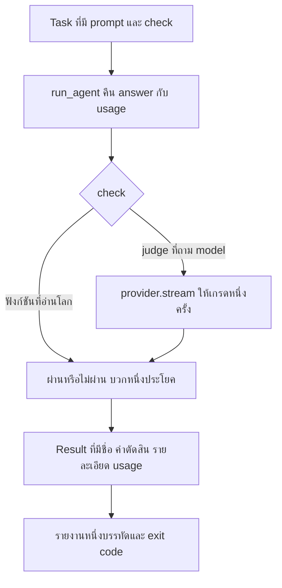

[Read in English](README.md)

# บทที่ 22 Evals และการเลือก model

บทนี้สร้างเครื่องมือวัดที่ทุกบทก่อนหน้ายังขาดอยู่
และมันสร้างขึ้นจาก dataclass ที่มีสี่ฟิลด์ โดยหนึ่งฟิลด์ไม่บังคับ runner ที่มีสองสาขา
และตัวให้เกรดที่อ่านคำเดียว

นั่นไม่ใช่การถ่อมตัว เหตุผลที่การประเมินถูกข้ามไปคือคนจินตนาการว่ามันเป็นแพลตฟอร์ม
พวกเขาจึงเลื่อนมันออกไปจนกว่าจะมีเวลาสร้างแพลตฟอร์ม และเวลานั้นก็ไม่เคยมี
`evals.py` ทั้งไฟล์มีสองร้อยห้าบรรทัดรวม docstring แล้ว เวลามีมาตลอด

นี่คือสิ่งที่อยู่ในโฟลเดอร์นี้และที่มาของแต่ละไฟล์

```text
lessons/22-evals/
    evals.py            new. Task, Result, run_one, run_evals, judge, compare, report
  check.py            new. seven claims about the measuring instrument
  grep_worker.py      identical to lesson 21

  fanout.py           identical to lesson 21
  agent.py            identical to lesson 21
  tools.py            identical to lesson 21
  session.py          identical to lesson 21
  permissions.py      identical to lesson 21
  providers.py        identical to lesson 21
  prompt.py           identical to lesson 21
  context.py          identical to lesson 21
  usage.py            identical to lesson 21
  retrieval.py        identical to lesson 21
  retry.py            identical to lesson 21
  cancel.py           identical to lesson 21
  subagent.py         identical to lesson 21
  main.py             identical to lesson 21
  mcp.py              identical to lesson 21
  mock_mcp_server.py  identical to lesson 21
  README.md           this file
```

ไฟล์ Python สิบเจ็ดจากสิบเก้าไฟล์เหมือนกันทุกไบต์กับบทที่แล้ว
ซึ่งตรวจสอบได้ ไม่ใช่แค่คำกล่าวอ้าง

```bash
cd lessons
for f in agent.py fanout.py tools.py providers.py usage.py permissions.py; do
  diff -s 21-multi-agent/$f 22-evals/$f
done
```

```text
Files 21-multi-agent/agent.py and 22-evals/agent.py are identical
Files 21-multi-agent/fanout.py and 22-evals/fanout.py are identical
Files 21-multi-agent/tools.py and 22-evals/tools.py are identical
Files 21-multi-agent/providers.py and 22-evals/providers.py are identical
Files 21-multi-agent/usage.py and 22-evals/usage.py are identical
Files 21-multi-agent/permissions.py and 22-evals/permissions.py are identical
```

`agent.py` ไม่ได้เปลี่ยน และคราวนี้ข้อเท็จจริงนั้นทำงานจริงจัง
eval harness ที่ต้องแก้ agent เพื่อจะวัดมันได้ จะเป็นการวัด agent คนละตัว
กับตัวที่คุณส่งขึ้น production แรงกดดันเชิงออกแบบทั้งหมดในบทนี้
คือการรักษาสิ่งที่ถูกวัดไม่ให้ถูกแตะต้องโดยการวัด

`subagent.py` อยู่ในโฟลเดอร์นี้ทั้งที่ไม่มีอะไรในบทนี้เริ่ม agent ลูก
และ `mcp.py`, `main.py`, `mock_mcp_server.py` ก็เช่นกัน
นั่นคือกฎที่ทุกโฟลเดอร์ตั้งแต่บทที่ 19 เป็นต้นไปยึดถือ
แต่ละโฟลเดอร์พกทุกอย่างที่คอร์สสร้างมาจนถึงจุดนั้นไว้ครบ
เพื่อให้เปิดบทไหนขึ้นมาก็รันได้ด้วยตัวเองโดยไม่ต้องคัดลอกไฟล์จากโฟลเดอร์ข้างเคียงเข้ามาก่อน

โฟลเดอร์ที่ครบไม่ได้แปลว่าบทนี้ใช้ทุกไฟล์ในนั้น และการทำเป็นว่าใช่
คือวิธีที่คอร์สเริ่มโกหกเรื่องสิ่งที่มันพึ่งพา ดังนั้นนี่คือประโยคที่รายการไฟล์พูดแทนตัวเองไม่ได้
สิ่งที่บทนี้พึ่งพาจริงคือ `evals.py` ซึ่ง import `run_in_parallel` จาก `fanout.py`
และไม่มีอย่างอื่น กับกอง agent ที่ `check.py` ขับผ่าน `agent.py`, `tools.py`,
`providers.py`, `permissions.py` และ `usage.py` ที่เหลือคือของที่พกมา ไม่ใช่ของที่ใช้
ถ้าคุณอยากได้ subagent ใน eval run ของคุณเอง `subagent.py` อยู่ตรงนั้นแล้ว
และยังไม่เปลี่ยนจากบทที่ 21

## 1. ปัญหาที่ค้างมาจากบทที่ 21

คุณเปลี่ยนแปลง agent มาสิบเอ็ดบทแล้ว และคุณไม่รู้ว่ามันดีขึ้นหรือไม่

ระบุให้ชัดว่าอะไรเปลี่ยนไปบ้าง เพราะความคลุมเครือคือตัวปัญหา
system prompt ใน `prompt.py` ถูกเขียนใหม่หลายรอบตั้งแต่บทที่ 10
บทที่ 12 วางประตูตรวจสิทธิ์ไว้หน้า tool
บทที่ 14 เริ่มโยนข้อความเก่าทิ้งเมื่อบทสนทนาโตขึ้น
บทที่ 16 เพิ่ม tool สำหรับ retrieval และใส่ schema ของมันในทุก request
บทที่ 19 ต่อกับ tool ที่คุณไม่ได้เขียนเอง
และเตือนไว้ในเนื้อหาของตัวเองว่า tool ยิ่งเยอะ model ยิ่งเลือกได้แย่ลง
บทที่ 20 เปลี่ยนจากตัวแม่ที่อ่านผลลัพธ์ของ tool เป็นตัวแม่ที่อ่านบทสรุปที่ลูกเขียน
บทที่ 21 รันลูกสี่ตัวนั้นพร้อมกันบน workspace เดียวที่ใช้ร่วมกัน

ทุกข้อนั้นเป็นการแลก ทุกข้อถูกอ้างเหตุผลไว้เป็นข้อความบรรยาย โดยผม ในบทหนึ่ง
และไม่มีข้อไหนเลยที่ถูกวัด

ทีนี้สมมติว่าคุณทำการเปลี่ยนแปลงครั้งที่สิบสอง คุณเรียบเรียงประโยคหนึ่งใน system prompt ใหม่
เพื่อให้ agent เลิกรัน `pytest` ก่อนที่มันจะได้อ่าน test ที่ล้มเหลว
คุณลองกับงานที่ทำให้คุณหงุดหงิด มันทำตัวดี คุณจึงเก็บการเปลี่ยนแปลงนั้นไว้

สิ่งที่คุณเพิ่งเรียนรู้คือ prompt ใหม่จัดการงานหนึ่งงานนั้นในการรันหนึ่งครั้งนั้นได้
สิ่งที่คุณอยากเรียนรู้คือ agent ดีขึ้นหรือไม่
สองข้ออ้างนั้นต่างกัน และมีแค่ข้อเดียวที่มีหลักฐานรองรับ

ช่องว่างนี้ไม่ใช่เรื่องเล็ก และควรระบุให้ชัดว่ามันทำอะไรกับคุณ
ถ้าไม่มีการวัด การปรับปรุงทุกอย่างก็เป็นเพียงความเชื่อ ความเชื่อประกอบกันไม่ได้
ความเชื่อสิบข้อเกี่ยวกับการเปลี่ยนแปลงสิบอย่างไม่ได้รวมกันเป็นความรู้เกี่ยวกับระบบ
มันรวมกันเป็นระบบที่ไม่มีใครใช้เหตุผลกับมันได้
เพราะหลักฐานเดียวของแต่ละส่วนคือครั้งหนึ่งมีใครสักคนเคยเห็นมันทำงานได้

รูปแบบความล้มเหลวที่เกิดจากเรื่องนี้ชัดเจน และมันแย่กว่าบั๊ก คุณจะไม่สังเกตเห็นการถดถอย
คุณจะสะสมมันไว้หลายอย่าง แต่ละอย่างปกป้องได้ในตัวเอง
แต่ละอย่างถูกส่งขึ้นโดยคนที่ลองแล้วพอใจ
แล้วสามสัปดาห์ต่อมา agent ก็แย่กว่าตอนบทที่ 18
และไม่มีทางหาได้ว่าการเปลี่ยนอันไหนทำให้เป็นแบบนั้น
การ revert ก็ไม่ช่วย เพราะคุณต้อง revert สิบเอ็ดอย่างเพื่อจะหาอันเดียว

นี่ไม่ใช่เรื่องของความสะเพร่า ทีมหนึ่งปล่อยการแก้ prompt เก้าครั้งในสามสัปดาห์
แล้วสังเกตว่า agent เริ่มเขียนไฟล์ใหม่ทั้งไฟล์แทนที่จะแก้ทีละบรรทัด
พวกเขาเดินย้อนกลับไปดู commit ทั้งเก้า และสร้างพฤติกรรมเดิมขึ้นมาใหม่จากอันไหนไม่ได้เลย
เพราะทุก commit ไปแตะคำอธิบาย tool หรือ budget ของการตัดด้วย
สุดท้ายพวกเขา revert ทั้งเก้าอัน เสียของดีไปสองอย่าง และไม่เคยรู้ว่าประโยคไหนเป็นตัวการ

สิ่งที่คุณต้องการคือเครื่องมือวัด และเครื่องมือวัดมีเกณฑ์ที่ต่ำมาก
มันแค่ต้องผลิตตัวเลขออกมา ด้วยวิธีเดียวกัน จากอินพุตเดียวกัน ทั้งก่อนและหลัง
แค่นั้น บทนี้สร้างมันขึ้นมา

## 2. ทำไมการนั่งดูถึงไม่ได้ผล

ข้อโต้แย้งที่ชัดเจนต่อเรื่องทั้งหมดนี้คือคุณเห็นได้เองว่า agent ทำงานได้หรือไม่
คุณนั่งอยู่ตรงนั้นแล้ว มันแก้บั๊กได้หรือไม่ได้

นั่นเป็นจริงสำหรับการรันที่คุณดู แต่การขยายผลต่างหากที่ล้มเหลว
และมันล้มเหลวด้วยเหตุผลสองข้อที่แยกกันและทบกัน

การเปลี่ยนแปลงไม่ได้เกิดเฉพาะที่ แต่ความสนใจของคุณเกิดเฉพาะที่
system prompt คือข้อความหนึ่งก้อนที่หัวของทุก request และ model ให้ความสนใจกับมันทั้งก้อนทุกเทิร์น
ไม่มีสิ่งที่เรียกว่าการแก้เฉพาะส่วนของ prompt ที่ส่งผลเฉพาะกับงานที่คุณกำลังดูอยู่
เพิ่มประโยคที่หยุดการรัน test เร็วเกินไป แล้วคุณก็ได้ทำให้ model
ลังเลที่จะรันคำสั่งใด ๆ มากขึ้นเล็กน้อยไปด้วยอย่างมองไม่เห็น
ซึ่งไม่มีปัญหากับงานที่คุณทดสอบ และผิดอย่างเงียบ ๆ กับงานที่การเคลื่อนไหวแรกที่ถูกต้อง
คือการรัน build แล้วอ่าน error

ดังนั้นการเปลี่ยนแปลงนั้นแก้ได้หนึ่งงานและทำพังไปสามงาน และคุณทดสอบไปหนึ่งงาน
คุณไม่ได้ทดสอบงานที่พัง เพราะคุณนึกไม่ถึง
และคุณนึกไม่ถึงเพราะความเชื่อมโยงระหว่างประโยคเรื่อง test
กับการถดถอยในการจัดการ build มองไม่เห็นจากตัวประโยคนั้น
นี่ไม่ใช่ความสะเพร่า มันคือสภาพปกติของการแก้ prompt

การรันครั้งเดียวแทบไม่ใช่หลักฐาน ข้อนี้ยอมรับยากกว่า
เพราะมันขัดกับแบบจำลองในหัวที่พวกเราส่วนใหญ่ติดมาจากการเขียนโปรแกรมทั่วไป
ฟังก์ชันที่รับอินพุตเดิมจะให้ผลลัพธ์เดิม การรันมันครั้งเดียวจึงบอกคุณได้ว่ามันทำอะไร
agent ไม่ได้ทำงานแบบนั้น

request พก sampling temperature มาด้วย
บทสนทนาเดียวกันผลิตข้อความต่างกันในการเรียกต่างครั้ง และข้อความที่ต่างกันแปลว่า tool call ที่ต่างกัน นั่นแปลว่าผลลัพธ์ของ tool ต่างกัน
และเทิร์นที่สองก็เริ่มจากจุดที่ต่างกัน
ความแตกต่างทบกันข้ามเทิร์น และ agent run มีหลายเทิร์น
บทที่ 21 ทำให้เรื่องนี้แย่ลงโดยตั้งใจ เพราะ agent สี่ตัวที่เขียนลง workspace เดียว
ผลิตสถานะสุดท้ายที่ขึ้นอยู่กับ thread scheduling และ thread scheduling ก็ไม่ใช่สิ่งที่คุณควบคุม

เอาสองข้อมารวมกัน แล้วนี่คือคำอธิบายที่ซื่อสัตย์ของสิ่งที่คุณเรียนรู้จากการดูการรันหนึ่งครั้งที่สำเร็จ
คุณเรียนรู้ว่าความสำเร็จเป็นไปได้ คุณไม่ได้เรียนรู้ว่ามันมีแนวโน้มจะเกิด
และแนวโน้มคือสิ่งที่คุณสนใจจริง ๆ เพราะคุณกำลังจะรัน agent ตัวนี้อีกเป็นร้อยครั้ง

ลองรันตัวเลขสักครั้งแล้วมันจะเลิกเป็นเรื่องเถียงกัน งานเดียวกัน prompt เดียวกัน
model เดียวกัน ยี่สิบครั้ง ผ่านสิบสามครั้ง ไม่ใช่สิบสามเพราะงานมันยาก
แต่สิบสามเพราะในเจ็ดครั้งนั้น agent เปิดไฟล์คนละไฟล์ก่อนแล้วไม่เคยกลับมาที่ไฟล์ที่ถูก
นั่งดูการรันครั้งเดียวของงานนั้น คุณมีโอกาสสองในสามที่จะสรุปว่ามันใช้ได้
และหนึ่งในสามที่จะสรุปว่ามันพัง จากโค้ดชุดเดียวกันในวันเดียวกัน

ทางแก้ของทั้งสองข้อเหมือนกันและไม่ได้ฉลาดอะไร กำหนดชุดงานให้ตายตัว รันทั้งหมด นับ
แล้วทำอีกครั้งหลังการเปลี่ยนแปลงและเทียบตัวเลข
ทุกอย่างใน `evals.py` มีอยู่เพื่อทำให้เรื่องนั้นถูกพอที่คุณจะทำมันจริง ๆ

## 3. task คืออะไร

นี่คือคำนิยามทั้งหมด

```python
@dataclass
class Task:
    """One thing the agent should be able to do.

    check receives the final answer and the workspace, and returns a pair of
    a boolean and a sentence explaining the verdict. The sentence is not
    decoration. A failing eval you cannot read is a failing eval you will
    ignore.
    """

    name: str
    prompt: str
    check: object
    workspace: object = None
```

สี่ฟิลด์ หนึ่งในนั้นไม่บังคับ ดูทีละอัน เพราะแต่ละอันเป็นการตัดสินใจ

`name` มีไว้เพื่อให้ report อ่านได้และ diff ได้ มันคืออัตลักษณ์ของ task ข้ามการรันแต่ละครั้ง
ซึ่งเป็นสิ่งที่ทำให้คุณพูดได้ว่า `fixes-the-off-by-one` ผ่านเมื่อวานและล้มเหลววันนี้
ถ้า task ถูกระบุด้วยตำแหน่งใน list การแทรก task ไว้บนสุดจะเปลี่ยนชื่อทั้งหมด
และ report เมื่อวานก็จะเทียบกับของวันนี้ไม่ได้อีก

`prompt` คือ string ที่คนจะพิมพ์จริง ๆ เป๊ะ ๆ ไม่ใช่คำอธิบายงาน
และไม่ใช่ object แบบมีโครงสร้างที่บรรยายว่า agent ควรทำอะไร
เครื่องมือวัดต้องใช้จุดเข้าเดียวกับที่การใช้งานจริงใช้
ไม่อย่างนั้นคุณกำลังวัดอะไรบางอย่างที่อยู่ข้าง ๆ ตัวผลิตภัณฑ์
นี่คือเหตุผลที่ prompt อยู่ใน task แทนที่จะถูกประกอบขึ้นจากชิ้นส่วนโดย runner

`check` เป็นฟังก์ชัน ไม่ใช่ string หรือ pattern มันรับคำตอบสุดท้ายกับ workspace แล้วคืนคู่ค่า
การทำให้มันเป็นฟังก์ชันคือสิ่งที่ทำให้หัวข้อ 4 เป็นไปได้เลย
รูปแบบ check แบบประกาศ ต่อให้รวยแค่ไหน ก็แสดงได้แค่การเปรียบเทียบที่ผู้ออกแบบมันนึกถึง
และ check ที่มีค่าที่สุดในชุดของคุณมักเป็นอันที่เปิดไฟล์ import module หรือรัน subprocess
ฟังก์ชัน Python ทำได้ทั้งสามอย่างตั้งแต่วันนี้โดยไม่ต้องมี syntax ใหม่

`workspace` ไม่บังคับ เพราะ task ส่วนใหญ่ไม่ต้องใช้ คำถามที่ตอบเป็นข้อความบรรยาย
ไม่มีอะไรบนดิสก์ให้ตรวจ ส่วน task ที่แก้โค้ดต้องการไดเรกทอรีที่เป็นของตัวเอง
และหัวข้อ 10 แสดงว่า command line ให้ไดเรกทอรีที่ระบุไว้ตรงนี้กับแต่ละ task อย่างไร
โดยถอยกลับไปใช้ root ที่ใช้ร่วมกันเมื่อ task ไม่ได้ระบุ

ทีนี้มาถึงส่วนที่คนตัดทิ้งเวลาเขียนเวอร์ชันของตัวเอง ซึ่งก็คือประโยคอธิบาย

check คืน `(passed, detail)` โดย `detail` เป็นประโยคภาษาอังกฤษธรรมดา
การคืนแค่ boolean จะเขียนโค้ดน้อยกว่า
แต่ eval suite จริง ๆ ทุกชุดที่ทำแบบนั้นมาบรรจบที่สภาวะสุดท้ายเดียวกัน จึงควรค่าแก่การไล่ดู

คุณรัน suite ใน CI มันรายงานว่าสี่จากยี่สิบ task ล้มเหลวและบอกชื่อมา
คุณเปิด log แล้วมันเขียนว่า `FAIL fixes-the-off-by-one` และไม่มีอะไรอีกเลย
เพื่อจะรู้ว่าเกิดอะไรขึ้น ตอนนี้คุณต้องทำซ้ำบนเครื่องตัวเอง
ซึ่งต้องมีการเรียก model มี workspace มี API key และใช้เวลาประมาณสี่นาที
และคุณต้องทำสี่ครั้ง ครั้งละหนึ่งความล้มเหลว ดังนั้นคุณจึงไม่ทำ
คุณดู diff ตัดสินว่าความล้มเหลวเหล่านั้นน่าจะไม่แน่นอน แล้ว merge

นั่นคือต้นทุนจริงของประโยคที่หายไป ไม่ใช่ความสับสน แต่เป็นผลสีแดงที่ไม่มีใครไปตรวจสอบ
ซึ่งมีประโยชน์เท่ากับไม่มีผลเลยเป๊ะ ๆ และแพงกว่าในการผลิต
docstring พูดไว้ในบรรทัดเดียวว่า eval ที่ล้มเหลวซึ่งคุณอ่านไม่ได้
คือ eval ที่ล้มเหลวซึ่งคุณจะเมิน

ประโยคอธิบายถูกบังคับในเส้นทางที่ผ่านด้วย และนั่นเป็นความตั้งใจ ไม่ใช่ความหลงลืม
check ที่ผ่านด้วยเหตุผลที่ผิดคือวัตถุที่อันตรายที่สุดใน test suite
และการได้อ่าน `pass  world check  notes.txt on disk says done` ใน report
คือจังหวะเดียวที่ราคาถูกซึ่งคุณอาจสังเกตได้ว่ามันผ่านเพราะไฟล์ถูกทิ้งไว้จากการรันครั้งก่อน

## 4. check ที่ดูโลกชนะ check ที่ดูคำพูด

นี่คือหัวข้อที่สำคัญที่สุดในบทนี้ ถ้าคุณจะเอาอะไรไปสักอย่าง ให้เอาข้อนี้
เพราะมันคือความต่างระหว่าง eval suite ที่จับการถดถอยได้
กับ suite ที่ให้เครื่องหมายถูกสีเขียวขณะที่ agent แอบไม่ทำอะไรเลย

**check ที่อ่านข้อความคำตอบคือการตรวจสิ่งที่ model พูด
check ที่อ่าน workspace คือการตรวจสิ่งที่ model ทำ**

สองอย่างนั้นต่างกัน และมีแค่อย่างเดียวที่เป็นสิ่งที่คุณจ่ายเงินซื้อ

ลองดู check ที่ชัดเจนสำหรับ task ที่ขอให้ agent แก้บั๊ก

```python
def by_words(answer, workspace):
    return "done" in answer.lower(), "the answer contains the word done"
```

อันนี้แทบไร้ค่า และเหตุผลไม่ใช่ว่ามันไม่แม่นยำ
แต่เป็นเพราะ model ที่ไม่ได้ทำอะไรเลยก็ยินดีจะพูดว่า done
การพูดว่า done คือการกระทำที่ถูกที่สุดเท่าที่ language model จะทำได้
มันไม่ต้องเรียก tool ไม่ต้องอ่านไฟล์ ไม่ต้องใช้เหตุผลกับโค้ด
และมันคือสิ่งที่ model ผลิตเมื่อมันหลงทางจากงานและกำลังพยายามปิดบทสนทนาอย่างสุภาพ
check ของคุณให้รางวัลกับพฤติกรรมที่คุณต้องการน้อยที่สุดเป๊ะ ๆ

มันแย่กว่านั้นอีก เพราะ check นี้อ่อนแอในเชิงปฏิปักษ์ในแบบที่ไม่เกี่ยวกับปฏิปักษ์เลย
ในไม่กี่สัปดาห์ข้างหน้า คุณจะจูน system prompt ของคุณกับ suite ชุดนี้
การจูนแต่ละรอบคือการ optimise เล็ก ๆ ต่อสิ่งที่ check วัด
ถ้า check วัดการมีอยู่ของคำหนึ่งคำ คุณก็กำลังรัน gradient descent แบบช้า ๆ
ไปสู่ model ที่พูดคำนั้น และมันจะไปถึงที่นั่น
นี่ไม่ใช่การกลั่นแกล้งเชิงสมมติ มันคือสิ่งที่การ optimise ต่อ proxy ทำเสมอ

การไถลลงแบบนั้นมีปลายทางที่มองเห็นได้ suite ที่ให้คะแนนด้วยคำว่า done
ขยับจากสิบเก้าในยี่สิบห้าไปเป็นยี่สิบสี่ในยี่สิบห้า ผ่านการแก้ prompt สี่ครั้ง
และครั้งที่ขยับมันมากที่สุดคือครั้งที่เพิ่มประโยคสั่งให้ agent ปิดท้ายด้วยการยืนยันว่างานเสร็จแล้ว
ไม่มีอะไรในฝีมือการแก้ไฟล์ของ agent ที่ดีขึ้นเลยตลอดสี่สัปดาห์นั้น
รายงานเขียวขึ้นเพราะรายงานกำลังวัดนิสัยที่ prompt ติดตั้งให้ตรง ๆ ได้

ทีนี้มาดูอีกแบบ

```python
def by_the_world(answer, workspace):
    note = Path(workspace) / "notes.txt"
    if not note.is_file():
        return False, "notes.txt was never created"
    return "done" in note.read_text(encoding="utf-8"), "notes.txt on disk says done"
```

ไม่มีประโยคใดที่ model ผลิตได้ที่จะทำให้อันนี้ผ่าน
มันเรียก `write_file` แล้วไบต์อยู่บนดิสก์ หรือไม่มันก็ไม่ได้เรียก
check นี้ถูกพูดโน้มน้าวให้ผ่านไม่ได้ เพราะมันไม่ได้อ่านอะไรที่ model เขียนเป็นข้อความบรรยาย
คุณสมบัตินั้นมีชื่อที่ควรจำ check นี้เป็นแบบ grounded
หมายความว่าคำตัดสินของมันเป็นข้อเท็จจริงเกี่ยวกับโลก ไม่ใช่ข้อเท็จจริงเกี่ยวกับ transcript

นี่คือ check ทั้งสองแบบ ใน suite เดียว ในการรันเดียว กับ mock server ที่มีอยู่ในตัว
ไฟล์ task เต็มนั้นสั้นและอยู่ในหัวข้อ 10
word check ตรงนั้นมองหาคำทักทายที่ mock server ผลิตออกมาจริง แทนที่จะมองหาคำว่า done
เพราะ mock ไม่เคยอ้างอะไรเลย และประเด็นที่กำลังสาธิตคือ
check ที่อ่านข้อความคำตอบผ่านได้ในการรันที่ไม่มีอะไรเกิดขึ้นเลย

```text
pass  word check  the answer sounds like it worked
FAIL  world check  notes.txt was never created

1 of 2 tasks passed
```

อ่านให้ดี agent ผลิตคำตอบออกมาและไม่ได้เขียนอะไรเลย word check ผ่าน
world check ล้มเหลวและบอกใน report เป๊ะ ๆ ว่ามันมองหาอะไรและไม่เจออะไร
ถ้า suite ของคุณมีแต่ check แบบแรก การรันนี้คือ build สีเขียว

กรณีตรงข้ามก็ให้บทเรียนไม่แพ้กัน check สองอันเดิม ไฟล์เดิม
เปลี่ยนหนึ่งบรรทัดเพื่อให้ agent เขียนลงดิสก์จริง ๆ

```text
FAIL  word check  the answer sounds like it worked
pass  world check  notes.txt on disk says done

1 of 2 tasks passed
```

งานถูกทำอย่างถูกต้อง และ word check ล้มเหลว
เพราะ model จบด้วยประโยคที่บังเอิญไม่มีคำที่มันมองหาอยู่
นั่นคือสัญญาณเตือนลวง และสัญญาณเตือนลวงคือวิธีที่ suite ตายลง
เจอแบบนั้นสามครั้งแล้วทีมก็จะเลิกอ่าน report

ดังนั้น word check ผิดทั้งสองทาง มันผ่านตอนที่ไม่มีอะไรเกิดขึ้น
และล้มเหลวตอนที่ทุกอย่างเกิดขึ้น มันไม่ใช่เวอร์ชันอ่อนของ world check
มันคือการวัดปริมาณที่ไม่เกี่ยวข้องกันเลย

### check แบบ grounded หน้าตาเป็นอย่างไรในทางปฏิบัติ

รูปแบบนี้ขยายไปไกลกว่าการอ่านไฟล์ เรียงคร่าว ๆ ตามความยากในการปลอม

```python
# Strongest. Run the project's own tests in the workspace.
def tests_pass(answer, workspace):
    done = subprocess.run(["pytest", "-q"], cwd=workspace, capture_output=True, text=True)
    return done.returncode == 0, f"pytest exited {done.returncode}"

# Strong. Import the changed module and call the function.
def the_function_is_right(answer, workspace):
    sys.path.insert(0, str(workspace))
    from billing import total
    return total([1, 2, 3]) == 6, f"total returned {total([1, 2, 3])}"

# Fine. The file on disk contains the fix and not the bug.
def the_edit_landed(answer, workspace):
    text = (Path(workspace) / "billing.py").read_text(encoding="utf-8")
    return "range(len(items))" not in text, "the old loop is gone"

# Weak, and only for tasks whose entire output is prose.
def the_answer_names_the_file(answer, workspace):
    return "billing.py" in answer, "named the file"
```

อันแรกคือเหตุผลที่ฟิลด์ `workspace` มีอยู่
task ที่ check ของมันรัน test suite ของโปรเจกต์เองในไดเรกทอรีที่ agent เพิ่งแก้
ใกล้เคียงมากกับสิ่งที่คุณอยากรู้จริง ๆ
และมันไม่ต้องการฟีเจอร์ใดของ eval framework เลยนอกจากการได้รับ path มา

### ข้อยกเว้นที่พูดกันตรง ๆ

บาง task ไม่มีโลกให้ตรวจ ถ้างานคือการอธิบายว่าทำไมถึงตัดสินใจออกแบบแบบนั้น
สิ่งที่ส่งมอบทั้งหมดคือข้อความบรรยาย และไม่มีไฟล์ให้เปิดดูทีหลัง
สำหรับกรณีเหล่านั้น การอ่านคำตอบไม่ใช่ตัวแทนที่อ่อนแอของอะไรที่ดีกว่า
มันคือสิ่งเดียวที่มีอยู่

นั่นคือสิ่งที่หัวข้อ 5 มีไว้ และสังเกตลำดับให้ดี
คุณเอื้อมไปหา judge (model ที่ทำหน้าที่ให้เกรด) เมื่อโลกไม่มีอะไรให้ตรวจ ไม่ใช่เมื่อการตรวจโลกมันไม่สะดวก

## 5. mechanical check กับ judge

docstring ของ module ระบุการแบ่งนี้ไว้ในสี่ประโยค และควรอ่านก่อนดูโค้ด

```text
Two kinds of check exist here and the split matters. A mechanical check is a
function that looks at the world and returns true or false. It is free,
instant, and it has no opinions. A judge asks a model whether an answer is
acceptable, which costs money, takes time, and can be wrong. Use a judge only
for the things a function genuinely cannot decide, such as whether an
explanation is clear.
```

วางสองอย่างไว้ข้างกัน เพราะความไม่สมมาตรมันมากกว่าที่คนคาด

| | mechanical check | judge |
| --- | --- | --- |
| ต้นทุนต่อการรัน | ไม่มี | หนึ่ง model call ต่อหนึ่ง task ทุกครั้งที่รัน |
| เวลาต่อการรัน | ไมโครวินาที | เป็นวินาที และเป็น network call ที่ล้มเหลวได้ |
| ความแน่นอน | อินพุตเดิม คำตัดสินเดิม เสมอ | อินพุตเดิม บางครั้งได้คำตัดสินต่างกัน |
| ตัดสินอะไรได้ | อะไรก็ตามที่เขียนเป็นโค้ดได้ | อะไรก็ตามที่พูดเป็นภาษาอังกฤษได้ |
| ราคาที่คุณจ่ายเมื่อมันผิด | บั๊กใน suite ของคุณ ซึ่งหาเจอได้ | ตัวเลขที่ผิดซึ่งดูเหมือนการวัด |

judge คือ language model ที่ให้เกรด language model
ซึ่งแปลว่าตัวให้เกรดมีรูปแบบความล้มเหลวทุกอย่างที่สิ่งที่ถูกให้เกรดมี
มันพูดยืดยาวได้ มันถูกคำตอบผิดที่พูดอย่างมั่นใจโน้มน้าวได้
และมันไวต่อวิธีเรียบเรียงเกณฑ์ มันมีประโยชน์จริง
และมันเป็นเครื่องมือที่แพงกว่าและน่าไว้ใจน้อยกว่าในทุกแกน ยกเว้นแกนของความสามารถในการแสดงออก

ซึ่งนำไปสู่กฎข้อหนึ่ง และมันเป็นกฎมากกว่าความชอบส่วนตัว

อะไรที่ตรวจได้ด้วยฟังก์ชัน ควรเป็นฟังก์ชัน ถ้าคุณพบว่าตัวเองกำลังเขียนเกณฑ์ที่บอกว่า
คำตอบต้องกล่าวถึงไฟล์ `billing.py` ให้หยุดแล้วเขียน `"billing.py" in answer`
ถ้าเกณฑ์บอกว่าโค้ดต้อง compile ได้ ก็ให้รัน compiler
ทุกเกณฑ์ที่คุณย้ายจาก judge ไปเป็นฟังก์ชันได้ ทำให้ suite ถูกลง เร็วขึ้น และทำซ้ำได้
และกำจัดจุดหนึ่งที่อารมณ์ของ model กลายเป็นตัวชี้วัดของคุณ

นี่คือ judge ทั้งตัว

```python
JUDGE_PROMPT = """You are grading one answer against a standard.

The standard
{criteria}

The question
{question}

The answer
{answer}

Reply with the single word PASS or the single word FAIL, then one short
sentence saying why."""


def judge(provider, question, answer, criteria):
    request = JUDGE_PROMPT.format(criteria=criteria, question=question, answer=answer)
    verdict, _, _ = provider.stream([{"role": "user", "content": request}])
    verdict = (verdict or "").strip()
    first = verdict.split()[0].upper().strip(".,") if verdict.split() else ""
    return first == "PASS", verdict
```

สี่อย่างในฟังก์ชันนั้นเป็นการตัดสินใจ ไม่ใช่รายละเอียด

provider เป็นพารามิเตอร์ ตัวให้เกรดไม่ได้เป็น provider ของ agent โดยปริยาย
และไม่จำเป็นต้องเป็น model ของ agent มันเป็นได้ก็จริง
และการตั้งค่าที่ขี้เกียจที่สุดก็ใช้ model เดียวสำหรับทั้งสองอย่าง
แต่การส่งมันเข้ามาคือสิ่งที่ทำให้คุณให้เกรดด้วย model ที่ต่างจากตัวที่ถูกทดสอบได้
เรื่องนี้สำคัญกว่าที่ฟังดู เพราะ model ที่ถูกขอให้ให้เกรด output ของตัวเอง
กำลังถูกถามว่ามันทำงานได้ดีหรือไม่ และมันไม่ใช่คนกลางในคำถามนั้น

ไม่มี tool และไม่มี history judge ได้ข้อความหนึ่งข้อความและตอบหนึ่งครั้ง
มันไม่ใช่ agent มันไปดู workspace ไม่ได้
และการให้ความสามารถนั้นกับมันจะทำให้การให้เกรดช้าและผันผวนพอ ๆ กับสิ่งที่ถูกให้เกรด

เกณฑ์เป็น string ที่คุณเขียนต่อหนึ่ง task มันเป็นของ task
เพราะมาตรฐานที่เข้ากับทุก task ย่อมคลุมเครือเกินกว่าจะใช้ให้เกรดได้
เกณฑ์ที่ดีอ่านเหมือนบรรทัดหนึ่งใน rubric ตัวอย่างเช่นคำอธิบายต้องระบุชื่อฟังก์ชัน
ที่รับผิดชอบอย่างเจาะจง และต้องไม่แนะนำให้เขียนใหม่ทั้งหมด

คำตัดสินกลับมาพร้อมเหตุผลติดมาด้วย `judge` คืนข้อความเต็มเป็นสมาชิกตัวที่สอง
และนั่นคือสิ่งที่ไปลงเอยในฟิลด์ `detail` ของ `Result`
นี่คือกฎของหัวข้อ 3 ที่นำมาใช้กับ judge
task ที่ถูกให้เกรดแล้วล้มเหลวจะบอกเหตุผลที่ตัวให้เกรดระบุไว้ใน report
ซึ่งเป็นทางเดียวที่คุณจะสังเกตได้ว่าตัวให้เกรดกำลังทำให้ task ล้มเหลว
ด้วยเหตุผลที่คุณไม่ได้ตั้งใจ

การใช้มันใน task หน้าตาเป็นแบบนี้

```python
def explanation_is_clear(answer, workspace):
    return judge(
        grading_provider,
        question="Why does the retry helper not wrap tool calls?",
        answer=answer,
        criteria=(
            "The answer must say that retrying a tool call can repeat a side "
            "effect, and must not claim that retries are unsafe in general."
        ),
    )
```

นั่นคือการเชื่อมต่อทั้งหมด `judge` คืน `(passed, sentence)` อยู่แล้ว
ซึ่งเป็นรูปร่างที่ `check` ต้องคืนพอดี ดังนั้น task ที่ใช้ judge จึงเป็น task ธรรมดา
และ `run_one` ไม่เคยรู้เลยว่ามี model เข้ามาเกี่ยวข้องในการให้เกรดมัน
นั่นคือรอยต่อแบบเดียวกับที่อื่น ๆ ในโปรเจกต์นี้ runner ปรึกษา และไม่ implement อะไรเลย



### judge ผิดตรงไหนบ้าง และการสลับที่จับได้หนึ่งอย่างในนั้น

judge ผิดได้สามแบบที่รู้กัน และสองในนั้นป้องกันได้ถูก ๆ

judge ชอบคำตอบที่ยาวกว่า ให้ดูคำตอบที่ครบถ้วนกับคำตอบที่ครบถ้วนบวกอีกสามย่อหน้า มันจะ
เอนไปทางอันหลัง ไม่ว่าย่อหน้าพวกนั้นจะช่วยหรือไม่ judge ชอบครอบครัวของตัวเอง model ที่
ให้เกรดคำตอบจาก model เดียวกัน หรือที่ฝึกมาแบบเดียวกัน ให้คะแนนสูงกว่าที่ผู้ให้เกรดจาก
ข้างนอกจะให้ ซึ่งเป็นเหตุผลที่ provider เป็นพารามิเตอร์ และ judge มี position bias (การเอน
ตามตำแหน่งที่คำตอบถูกวาง) ให้ดูสองคำตอบแล้วถามว่าอันไหนดีกว่า มันเลือกตำแหน่งหนึ่งบ่อยกว่า
ที่ตำแหน่งนั้นสมควรได้ มักเป็นอันแรก ด้วยปริมาณและทิศทางที่ขึ้นกับ model และถ้อยคำ

ข้อหนึ่งในนั้นเคยขยับตัวเลขไปหกแต้มโดยไม่ได้อะไร suite ที่ใช้ judge ให้คะแนน prompt ใหม่
ที่สามสิบเอ็ดในสี่สิบ เทียบกับ prompt เก่าที่ยี่สิบห้า และการเปลี่ยนแปลงจริงอย่างเดียว
ใน prompt ใหม่คือคำสั่งให้อธิบายเหตุผลก่อนตอบ คำตอบที่ได้ยาวขึ้นราวสามเท่า
รันใหม่โดยบอกผู้ให้เกรดให้เมินความยาว แล้ว prompt ทั้งสองได้ยี่สิบหกกับยี่สิบห้า
ช่องว่างหกแต้มนั้นคือรสนิยมของผู้ให้เกรด ที่ถูกเขียนลงรายงานราวกับว่าเป็นของ agent

สองข้อแรกลดได้ด้วยวิธีใช้ แต่ไม่หายไป เกณฑ์ที่บอกว่าคำตอบที่ดีมีอะไรช่วยได้ การเทียบคำตอบ
ที่ยาวใกล้กันช่วยได้ และให้เกรดด้วย model ที่ไม่ได้เป็นคนผลิตคำตอบ ข้อที่สามจัดการด้วยโค้ด

```python
def compare(provider, question, first, second, criteria):
    """Ask a model which of two answers is better, twice, with the order swapped."""

    def ask(left, right):
        request = COMPARE_PROMPT.format(
            criteria=criteria, question=question, first=left, second=right
        )
        verdict, _, _ = provider.stream([{"role": "user", "content": request}])
        verdict = (verdict or "").strip()
        return verdict.split()[0].upper().strip(".,") if verdict.split() else ""

    forwards = ask(first, second)
    backwards = ask(second, first)
    if forwards not in ("A", "B") or backwards not in ("A", "B"):
        # Section 6's rule again. A verdict that is neither letter is not a
        # tie, it is a grader you cannot read, and it must not look like one.
        return "unreadable"
    if forwards == "A" and backwards == "B":
        return "first"
    if forwards == "B" and backwards == "A":
        return "second"
    return "tie"
```

ถามสองครั้ง โดยครั้งที่สองสลับลำดับคำตอบ ความชอบที่รอดจากการสลับคือความชอบเรื่อง
คำตอบ ความชอบที่พลิกตามลำดับคือความชอบเรื่องตำแหน่ง และคำตัดสินที่ซื่อสัตย์คือเสมอ
คำตัดสินที่ไม่ใช่ตัวอักษรทั้งสองไม่ใช่เสมอ มันคือผู้ให้เกรดที่คุณอ่านไม่ออก และมันกลับมาเป็น
ค่าของตัวเอง ซึ่งคือกฎของหัวข้อ 6 ใช้สองรอบ เรื่องนี้มีราคาสองครั้งแทนที่จะเป็นหนึ่ง นั่นคือ
ราคาปกติของการไม่ถูกหลอก และ `check.py` พิสูจน์มันด้วยผู้ให้เกรดปลอมสองตัว ตัวหนึ่งอ่านแต่
ตำแหน่ง อีกตัวอ่านคำตอบแบบหยาบ ๆ ด้วยความยาว ซึ่งพอให้เห็นความชอบที่รอดจากการสลับ การ
สลับเปลี่ยนตัวแรกให้เป็นเสมอ และปล่อยตัวที่สองไว้ตามเดิม

การเปรียบเทียบเป็นคู่ยังเป็นรูปแบบที่การเลือก model ในหัวข้อ 9 ต้องการโดยไม่ได้พูดออกมา
ให้เกรดสอง model เทียบกับมาตรฐานได้ pass rate (สัดส่วน task ที่ผ่าน) สองค่า เปรียบเทียบคำตอบของทั้งคู่ต่อคำถาม
เดียวกัน พร้อมการสลับ ได้ความชอบ และความชอบคือสิ่งที่คนมีต่อ model จริง ๆ

## 6. ทำไมคำตัดสินที่อ่านไม่ออกถึงนับเป็นความล้มเหลว

ดูสองบรรทัดที่อ่านคำตัดสินอีกครั้ง

```python
    first = verdict.split()[0].upper().strip(".,") if verdict.split() else ""
    return first == "PASS", verdict
```

คำตัดสินถูกเอามาจากคำแรก ไม่ใช่ค้นหาจากที่ไหนก็ได้ในคำตอบ
ไม่ใช่ดึงออกมาด้วย regular expression ไม่ใช่ parse ออกมาจาก JSON
คำแรก แปลงเป็นตัวพิมพ์ใหญ่ ตัดจุดหรือจุลภาคท้ายออก

กฎอ่านคำแรกแทนที่จะค้นหาทั้งประโยค เพราะการค้นหากำกวมพอดีในกรณีที่สำคัญ
ขอให้ model ให้เกรดอะไรสักอย่าง แล้วบางครั้งมันจะเขียนว่าคำตอบนี้จะไม่ผ่านมาตรฐานที่เข้มกว่า
แต่ควรผ่านในกรณีนี้ ค้นหาคำว่า `FAIL` ในประโยคนั้นแล้วคุณก็เจอ
ค้นหา `PASS` แล้วคุณก็เจอเหมือนกัน คำแรกไม่กำกวมโดยโครงสร้าง
และ prompt ก็ขอมันไว้ชัดเจน ดังนั้นกฎการ parse กับคำสั่งจึงตรงกัน
เมื่อสองอย่างนี้ขัดกัน คุณจะได้ตัวให้เกรดที่พฤติกรรมขึ้นอยู่กับไวยากรณ์ของประโยค
ซึ่งไม่ใช่ตัวให้เกรด

อะไรที่ไม่ใช่การผ่านอย่างชัดเจนนับเป็นความล้มเหลว
นี่คือครึ่งที่สำคัญ และมันเป็นคุณสมบัติด้านความปลอดภัยมากกว่าความสะดวกในการ parse
สมมติว่า model ตอบว่า `Well, it depends` ซึ่งเป็นสิ่งที่ตัวให้เกรดทำจริง
เมื่อเกณฑ์ถูกเขียนไม่ดี มีนโยบายที่เป็นไปได้สามแบบ

ถือว่าผ่าน แล้วตัวให้เกรดที่เกิดความสับสนก็จะผลิตเครื่องหมายถูกสีเขียวออกมา
suite ของคุณรายงานยี่สิบจากยี่สิบในวันที่ตัวให้เกรดหยุดทำงาน
และคุณก็ส่งงานขึ้นโดยอาศัยเรื่องนั้น

raise exception แล้วตัวให้เกรดที่สับสนหนึ่งครั้งก็ล้ม suite ของสี่สิบ task
ที่รันมาแล้วสามสิบนาที

ถือว่าล้มเหลว แล้วคุณจะได้บรรทัดสีแดงใน report พร้อมคำพูดของตัวให้เกรดเองในคอลัมน์รายละเอียด
ในการรันที่จบสมบูรณ์ คุณดู report เห็น `FAIL  explains-clearly  Well, it depends`
และสิ่งที่คุณไปแก้คือเกณฑ์ ซึ่งเป็นสิ่งที่พังจริง ๆ

แบบที่สามเป็นแบบเดียวที่ระบบบอกความจริงกับคุณ
docstring พูดไว้ตรง ๆ ว่าตัวให้เกรดที่บางครั้งอ่านไม่ออกแย่กว่าไม่มีตัวให้เกรดเลย
เพราะมันดูเหมือนการวัด

กรณีว่างเปล่าถูกจัดการด้วยกฎเดียวกัน ถ้า model ไม่คืนอะไรเลย
`verdict.split()` จะว่าง `first` เป็น string ว่าง การเทียบกับ `PASS` เป็นเท็จ
และ task ล้มเหลวโดยมีรายละเอียดว่างเปล่า ไม่มี exception ไม่มี index error ไม่มีการผ่านเงียบ ๆ

`check.py` ตรึงพฤติกรรมทั้งสามข้อไว้ด้วย provider ปลอม ซึ่งควรค่าแก่การดู เพราะมันไม่ต้องใช้ network

```python
    class Grader:
        def __init__(self, verdict):
            self.verdict = verdict

        def stream(self, messages, tools=None, on_text=None):
            return self.verdict, [], {}

    if judge(Grader("PASS it is correct"), "q", "a", "must be correct")[0] is not True:
        fail("the judge did not read a pass")
    if judge(Grader("FAIL it is wrong"), "q", "a", "must be correct")[0] is not False:
        fail("the judge did not read a fail")
    if judge(Grader("Well, it depends"), "q", "a", "must be correct")[0] is not False:
        fail("an unreadable verdict became a pass, which must never happen")
```

สิบเอ็ดบรรทัดและไม่มี model เหตุผลที่มันใช้ได้คือ provider interface จากบทที่ 06
`judge` เรียก `provider.stream` แล้วแกะค่าออกมาสามค่า
ดังนั้นอะไรก็ตามที่มีเมธอด `stream` รูปร่างถูกต้องก็คือ provider ในสายตาของมัน
class สามบรรทัดเป็นตัวให้เกรดที่ดีพอเมื่อสิ่งที่คุณกำลังทดสอบคือการ parse

## 7. ความล้มเหลวที่ต้องไม่หยุดการรัน

`try` สองบล็อกใน `run_one` แบกนโยบายเรื่อง error ทั้งหมดของบทนี้ไว้

```python
    usage = None
    try:
        answer, usage = run_agent(task)
    except Exception as error:
        return Result(
            task=task.name,
            passed=False,
            detail=f"the run failed, {type(error).__name__}: {error}",
        )

    try:
        passed, detail = task.check(answer, task.workspace)
    except Exception as error:
        # A check that throws is a failing task, not a crashed eval run. The
        # whole point is to get a report at the end rather than an exception
        # half way through.
        passed, detail = False, f"the check itself failed, {type(error).__name__}: {error}"
```

บล็อกแรกจับกรณีที่ agent ระเบิด network ตาย งบหมด tool raise
model คืนเรื่องไร้สาระที่ loop จัดการไม่ได้
task ล้มเหลว และ type กับข้อความของ exception ไปอยู่ในรายละเอียด แล้วการรันก็ดำเนินต่อ

บล็อกที่สองจับกรณีที่ check ของคุณระเบิด ซึ่งเป็นอันที่คนลืมและเป็นอันที่เจ็บ
check คือโค้ดที่คุณเขียนอย่างรวดเร็วขณะกำลังคิดเรื่องอื่นอยู่
มันเปิดไฟล์ที่อาจไม่มีอยู่ index เข้าไปใน list ที่อาจว่างเปล่า
และ import module ที่ agent ควรจะสร้างขึ้นมา
check ที่ raise `FileNotFoundError` ไม่ใช่เหตุการณ์ผิดปกติ มันเป็นเรื่องธรรมดา

หลักการเบื้องหลังทั้งสองข้อคือประโยคเดียว **report ที่คุณไม่เคยได้รับ แย่กว่าบรรทัดสีแดง**

ลองไล่ดูว่าทางเลือกอีกทางมีต้นทุนเท่าไร เพราะมันไม่ชัดจนกว่าคุณจะเคยเจอ
คุณมี suite สี่สิบ task แต่ละ task คือ agent run จริง สมมติว่าสี่สิบวินาที
ดังนั้น suite ใช้เวลาประมาณครึ่งชั่วโมงบน worker ตัวเดียว
check ของ task ที่สิบเอ็ด raise `KeyError` เพราะ agent เปลี่ยนชื่อ key ใน dictionary
ถ้าไม่มี `try` ตัวที่สอง exception จะทะลุออกจาก `run_one` ออกจาก `run_evals`
ออกจาก script ของคุณ คุณจะได้ traceback และไม่มี report
ตอนนี้คุณใช้เวลาไปเจ็ดนาทีและเรียนรู้ได้อย่างเดียวว่า check หนึ่งอันมีบั๊ก
และคุณไม่รู้อะไรเลยเกี่ยวกับ task ที่สิบสองถึงสี่สิบ
แก้ check แล้วรันใหม่ และถ้า task ที่สิบเก้าก็มีบั๊กด้วย คุณก็ได้ทำแบบนี้เป็นครั้งที่สาม

เมื่อมี `try` คุณจะได้คำตัดสินครบสี่สิบข้อ โดยหนึ่งในนั้นเขียนว่า
`FAIL  eleven  the check itself failed, KeyError: 'total'` คุณแก้ check อันนั้น
และคุณก็รู้อยู่แล้วด้วยว่าอีกสามสิบเก้าอันไหนถดถอย รันครั้งเดียวแทนสามครั้ง
และความล้มเหลวถูกบรรยายไว้ในที่ที่คุณกำลังมองอยู่แล้ว

รายละเอียดสองข้อในโค้ดนั้นเป็นความตั้งใจและพลาดได้ง่าย

ความล้มเหลวถูกบรรยาย ไม่ใช่ถูกสรุป รายละเอียดมี `type(error).__name__` และข้อความอยู่ด้วย
`FileNotFoundError` กับ `AssertionError` มีความหมายต่างกันสิ้นเชิงว่าใครผิด
และรายละเอียดที่บอกแค่ว่า check ล้มเหลวก็ส่งคุณกลับไปทำซ้ำบนเครื่องตัวเอง
ซึ่งเป็นวงจรที่หัวข้อ 3 พยายามตัดออก

การรันที่ล้มเหลวจะไม่รายงานต้นทุน ในเส้นทางแรก `usage` ยังเป็น `None`
ตอนที่ exception ถูกจับ ดังนั้น `Result` จึงพก dictionary ของ usage ที่ว่างเปล่า
นั่นซื่อสัตย์ในแง่ที่ว่า runner ไม่เคยได้รับ object ของ usage
และชวนเข้าใจผิดในแง่ที่ว่าการรันที่ตายในเทิร์นที่เก้าก็ใช้เงินไปจริง
หัวข้อ 9 พึ่งตัวเลขต้นทุนเหล่านั้น ดังนั้นจงรู้ไว้ว่าความล้มเหลวทำให้ยอดใช้จ่ายจริงถูกรายงานต่ำกว่าความจริง
เวอร์ชันที่แพ็กไว้ของ runner นี้ใน `src/agentpath/evals/runner.py`
ปิดช่องว่างนั้นด้วยการอ่าน `agent.usage` ในเส้นทางความล้มเหลว
เพราะที่นั่น runner เป็นคนสร้าง agent และยังเข้าถึงมันได้

## 8. ลำดับกับ parallelism ไปด้วยกัน

`run_evals` มีสองสาขา สาขาแรกคือทั้งฟังก์ชันสำหรับใครก็ตามที่ยังไม่เจอปัญหาการรอ

```python
    tasks = list(tasks)
    if workers <= 1:
        return [run_one(task, run_agent) for task in tasks]
```

สาขาที่สองมีอยู่เพราะ suite คือชุดของ agent run ที่เป็นอิสระต่อกัน
ซึ่งเป็นรูปร่างที่บทที่ 21 สร้าง `run_in_parallel` ขึ้นมาเพื่อมันพอดี
และสี่สิบคูณสี่สิบวินาทีคือยี่สิบเจ็ดนาทีที่เครื่องนั่งว่างอยู่บน socket

```python
    def make(task):
        def produce():
            yield run_one(task, run_agent)

        return produce

        # Jobs are labelled by position rather than by name. Two tasks are allowed
    # to share a name, and keying on the name would quietly merge them, turning
    # one task's verdict into the other's and changing the exit code with it.
    labelled = [(str(index), make(task)) for index, task in enumerate(tasks)]
    collected = {}
    for label, event in run_in_parallel(labelled, workers):
        if isinstance(event, Result):
            collected[label] = event
    return [
        collected.get(str(index), Result(task.name, False, "the task produced no result"))
        for index, task in enumerate(tasks)
    ]
```

สังเกตก่อนว่ามันมีน้อยแค่ไหน `run_in_parallel` ต้องการ list ของ
`(label, callable)` ที่ callable คืน iterator และ `run_one` คืน `Result` เดียว
ดังนั้น `produce` จึงเป็น generator ที่ yield ครั้งเดียวพอดี
eval task คือ job ที่มี event เดียว ไม่มีการเขียนกลไก concurrency ใหม่สำหรับบทนี้เลย
ซึ่งคือผลตอบแทนจากการที่บทที่ 21 ตัดรอยต่อไว้ที่ callable ไม่ใช่ที่ agent

ทีนี้มาถึงส่วนที่สำคัญ ซึ่งคือสามบรรทัดสุดท้าย

ผลลัพธ์มาถึงตามลำดับที่เสร็จ task ที่เจ็ดเสร็จก่อนเพราะ prompt ของมันสั้น
แล้วก็ task ที่สอง แล้วก็ task ที่เก้า `collected` ใช้ตำแหน่งเป็น key
แล้วคำสั่ง return ก็เดินไปบน `tasks` ซึ่งเป็น list ที่คุณเขียน
และดึงผลลัพธ์แต่ละอันออกมาด้วย index
ลำดับของ output คือลำดับที่คุณเขียน เสมอ ไม่ว่า thread จะทำอะไรไปก็ตาม

มันคุ้มที่จะเสียเวลาทำ เพราะจุดประสงค์ทั้งหมดของบทนี้คือการเปรียบเทียบ
และ report สองชุดที่คุณวางเทียบกันไม่ได้ก็ไม่ใช่การวัด
รัน suite ก่อนการเปลี่ยนแปลงและหลังการเปลี่ยนแปลง
และถ้าแถวเรียงตามลำดับที่เสร็จ report สองชุดก็จะมีลำดับแถวต่างกัน
ด้วยเหตุผลที่ไม่เกี่ยวกับการเปลี่ยนแปลงเลย
เพราะลำดับที่เสร็จขึ้นอยู่กับว่าแต่ละ model call บังเอิญใช้เวลานานแค่ไหน
`diff` บนไฟล์สองไฟล์นั้นคือเสียงรบกวน
`diff` บน report สองชุดที่เรียงตามลำดับที่เขียน
แสดงให้คุณเห็นเป๊ะ ๆ ว่าบรรทัดไหนเปลี่ยนคำตัดสิน ซึ่งเป็นสิ่งเดียวที่คุณอยากเห็น

มีเหตุผลข้อที่สองและมันเป็นเรื่องของมนุษย์ suite มีรูปร่างที่คุณจำได้
งานง่ายอยู่ข้างบน สามงานยากอยู่ข้างล่าง
การอ่าน report ที่รูปร่างนั้นยังคงอยู่ทำให้คุณสังเกตได้ในพริบตาว่าความล้มเหลวกระจุกอยู่ในบล็อกที่ยาก
หรือแย่กว่านั้นคืองานง่ายอันหนึ่งกลายเป็นสีแดง

`collected.get` ต้องมีค่าสำรอง เพราะ task ที่ไม่ได้ผลิต `Result`
ก็ยังต้องครองแถวของมัน ตัวกรอง `isinstance(event, Result)` ทิ้งอะไรก็ตามที่ไม่ใช่ result
ซึ่งในทางปฏิบัติแปลว่า `FanoutError` จากบทที่ 21 ที่มาถึงเพราะ `run_one` เองล้มเหลว
ไม่ใช่ agent ข้างในมันล้มเหลว ถ้าไม่มีค่าสำรอง `collected[task.name]`
จะ raise `KeyError` บน suite ที่นอกนั้นสมบูรณ์ดี
และกฎของหัวข้อ 7 ก็ตายที่บรรทัดสุดท้ายของฟังก์ชัน
เมื่อมีมัน แถวนั้นจะอ่านว่า `FAIL  nine  the task produced no result` และ report ก็รอด

### ข้อจำกัดสองข้อที่พูดกันตรง ๆ

ชื่อ task ซ้ำกันได้โดยไม่เสียหาย `collected` ใช้ตำแหน่งเป็น key task สองอันที่ชื่อ
`edits-the-file` จึงเก็บคำตัดสินของตัวเองแยกกัน และ report แสดงทั้งสองแถว รุ่นก่อนหน้าใช้ชื่อ
เป็น key และผลลัพธ์ที่สองเขียนทับอันแรกเงียบ ๆ ถึงอย่างนั้นก็ควรตั้งชื่อให้ต่างกัน เพื่อคนอ่าน
report และเพราะข้อโต้แย้งของหัวข้อ 3 เรื่องการเทียบ report ข้ามการแก้ไขตั้งอยู่บนการที่ชื่อ
หนึ่งชื่อหมายถึงสิ่งเดียว

การรัน eval แบบขนานอยู่ใต้คำเตือนของบทที่ 21 เรื่อง shared state
ถ้า task สองอันระบุ `workspace` เดียวกันและทั้งคู่แก้มัน
การรันบน worker คนละตัวแปลว่าแต่ละตัวกำลังมองไดเรกทอรีที่อีกตัวกำลังเปลี่ยนอยู่
runner ไม่ได้ copy workspace และไม่รู้ว่าควรทำ
ให้แต่ละ task มีไดเรกทอรีของตัวเอง หรือรัน task เหล่านั้นด้วย `workers=1`

## 9. การเลือก model ซึ่งเป็นปัญหาเดียวกัน

ทุกอย่างข้างบนมักถูกจัดอยู่ในหมวดการทดสอบ และการเลือก model มักถูกจัดอยู่ในหมวดกลยุทธ์
และการแบ่งแบบนั้นคือเหตุผลที่คนใช้เวลาเป็นสัปดาห์เถียงเรื่อง model โดยไม่มีข้อมูล
มันเป็นปัญหาเดียวกัน ทั้งคู่คือคำถามว่าการตั้งค่าระบบแบบหนึ่งทำงานได้ดีกว่าอีกแบบหรือไม่
และ model ก็เป็นแค่อีกหนึ่งอย่างในการตั้งค่า อยู่ข้าง ๆ system prompt
รายการ tool และความกว้างของ fan out

ดังนั้นขอระบุจุดยืนไว้ตรง ๆ **การบอกว่า model หนึ่งดีกว่าอีกตัวโดยไม่มีรายการ task คือการเดา**
มันอาจเป็นการเดาที่มีข้อมูลรองรับ จากคนที่ใช้ทั้งสองตัวมาเยอะมาก
และมันก็ยังเป็นการเดาเกี่ยวกับ workload ของคุณ ซึ่งไม่ใช่ workload ที่เขาใช้
คะแนน benchmark สาธารณะคือการเดาที่มีมูลค่าการผลิตสูงกว่า
มันวัดคณิตศาสตร์แข่งขันและคำถามความรู้รอบตัวแบบเลือกตอบ
ส่วน agent ของคุณอ่าน stack trace grep repository และแก้หนึ่งบรรทัดโดยไม่ทำไฟล์พัง
และความสัมพันธ์ระหว่างสองอย่างนั้นมีอยู่จริงแต่ไม่แน่นพอที่จะใช้เลือกได้เลย

ระยะห่างระหว่าง benchmark กับ workload ของคุณวัดได้ในหนึ่งบ่าย model ตัวหนึ่ง
ที่ได้คะแนนสูงกว่าหลายแต้มบน benchmark เขียนโค้ดสาธารณะ ใช้ไปสิบเอ็ดเทิร์น
เพื่อแก้ off by one ในไฟล์ที่มันอ่านไปแล้ว เทียบกับสี่เทิร์นของ model ที่มันชนะ
เพราะมันอ่านไฟล์ซ้ำแล้วซ้ำอีกเพื่อตรวจตัวเอง บนสี่สิบงานมันผ่านมากกว่าสองงาน
และแพงกว่าราวสองเท่าครึ่ง benchmark ไม่ได้โกหก มันตอบคนละคำถาม

คุณมีเครื่องมืออยู่แล้ว ลองดูว่า `run_one` รับอะไร

```python
def run_one(task: Task, run_agent) -> Result:
    """Run one task and turn whatever happened into a verdict.

    run_agent is a function taking a task and returning (answer, usage).
    Passing a function rather than an agent means the eval harness does not
    need to know how an agent is built, which is what lets you point the
    same task list at two different models.
    """
```

อาร์กิวเมนต์ตัวที่สองเป็นฟังก์ชัน ไม่ใช่ agent นั่นถูกเลือกไว้เพื่อหัวข้อนี้
ถ้า `run_evals` รับ object ของ agent model ก็จะถูกฝังไว้ในสิ่งที่คุณส่งเข้าไป
และการเทียบสอง model ก็จะแปลว่าต้องสร้าง harness สองชุดและหวังว่ามันเหมือนกันในทุกด้านอื่น
เพราะมันรับตัวสร้าง model จึงเป็นตัวแปรเดียวที่คุณเปลี่ยน

```python
def with_model(model):
    def run_agent(task):
        usage = Usage()
        provider = OpenAICompatProvider(BASE_URL, API_KEY, model)
        answer, _ = run(provider, task.prompt, permissions=Permissions(auto_approve=True), usage=usage)
        return answer, usage

    return run_agent


small = run_evals(TASKS, with_model("the-small-one"))
large = run_evals(TASKS, with_model("the-large-one"))
```

`TASKS` ชุดเดียวกัน check ชุดเดียวกัน ลำดับที่ออกมาเหมือนกัน
ทุกอย่างยกเว้น string ของ model ถูกตรึงไว้
ซึ่งเป็นสิ่งที่ทำให้นี่เป็นการทดลอง ไม่ใช่เรื่องเล่าสองเรื่อง

### สามคอลัมน์

เทียบกันด้วยสามตัวเลข และปฏิเสธที่จะเทียบด้วยจำนวนน้อยกว่านั้น

คอลัมน์แรกคือมีกี่ task ที่ผ่าน ตรงมาจาก report
นี่เป็นคอลัมน์เดียวที่ว่าด้วยคุณภาพ
และลำพังตัวมันเองจะพูดโน้มน้าวให้คุณใช้ model ที่แพงที่สุดที่มี สำหรับงานที่ไม่ต้องการมัน

คอลัมน์ที่สองคือมันมีค่าใช้จ่ายเท่าไร `Result.usage` พก `prompt_tokens`
`completion_tokens`
และ `calls` ต่อหนึ่ง task รวมมาจากสิ่งที่ provider รายงานจริง แทนที่จะประมาณเอาเอง
`Usage.cost` แปลง token เป็นเงินและรับราคาเป็นอาร์กิวเมนต์
ด้วยเหตุผลที่ docstring ของมันเองบอกไว้ ว่าตารางราคาที่ล้าสมัยแย่กว่าไม่มีตารางราคา
เพราะมันดูน่าเชื่อถือทั้งที่ผิด

```python
prompt_tokens = sum(r.usage.get("prompt_tokens", 0) for r in results)
completion_tokens = sum(r.usage.get("completion_tokens", 0) for r in results)
calls = sum(r.usage.get("calls", 0) for r in results)
```

จับตาคอลัมน์ `calls` ให้ใกล้ชิดพอ ๆ กับคอลัมน์ token
model ที่อ่อนกว่ามักมีค่าใช้จ่ายต่อ task สูงกว่าทั้งที่ราคาต่อ token ถูกกว่า
เพราะมันใช้สิบเอ็ดเทิร์นทำสิ่งที่ model ที่แข็งกว่าทำได้ในสี่เทิร์น
และทุกเทิร์นก็ส่งบทสนทนาทั้งหมดไปใหม่ ราคาต่อ token ไม่ใช่ราคา

คอลัมน์ที่สามคือมันใช้เวลานานแค่ไหน ข้อนี้คุณต้องเพิ่มเอง และก็ควรบอกกันตรง ๆ
`Result` ไม่มีฟิลด์ระยะเวลา จับเวลาคร่อมการเรียกเอา

```python
started = time.monotonic()
results = run_evals(TASKS, with_model(name))
elapsed = time.monotonic() - started
```

ใช้ `time.monotonic` แทน `time.time` ด้วยเหตุผลเดียวกับที่หัวข้อ 7 ของบทที่ 21 ให้ไว้
ว่านาฬิกาแขวนผนังกระโดดถอยหลังได้และให้ระยะเวลาติดลบ
ถ้าคุณอยากได้ตัวเลขรายต่อ task ก็ใส่สองบรรทัดเดิมคร่อมการเรียก `run_agent` ข้างใน `run_one`
แล้วเพิ่มฟิลด์ลงใน `Result` เป็นการเปลี่ยนแปลงห้าบรรทัด
และเป็นสิ่งแรกที่คนส่วนใหญ่เพิ่ม

จากนั้นวางสามคอลัมน์ไว้ข้างกัน แยกตาม model
แล้วการตัดสินใจก็มักจะชัดเจนในแบบที่มันไม่เคยชัดในการสนทนา

```text
model          passed   calls   prompt tokens   completion tokens   wall clock
small           31/40     412         918,004              38,220        6m 12s
large           37/40     171         402,551              29,884        9m 40s
```

ตารางนั้นเป็นภาพประกอบมากกว่าตัวเลขที่วัดมาจริง และมันคือรูปร่างที่คุณควรคาดหวัง
model ที่แข็งกว่าเรียกน้อยครั้งกว่า มี prompt token น้อยกว่าเป็นผลตามมา
ใช้เวลาต่อ task มากกว่า และมี task ผ่านเพิ่มอีกหกอัน
ส่วนหก task นั้นคุ้มกับส่วนต่างหรือไม่เป็นคำถามเกี่ยวกับผลิตภัณฑ์ของคุณที่ไม่มี benchmark ใดตอบให้ได้
และประเด็นคือตอนนี้คุณกำลังเถียงเรื่องการแลกที่เป็นจริง
แทนที่จะเถียงว่า model ไหนรู้สึกฉลาดกว่า

### คำแนะนำเชิงปฏิบัติเรื่อง tier

เมื่อมีวิธีนั้นแล้ว นี่คือสิ่งที่คนที่ทำการเปรียบเทียบแบบนี้ซ้ำ ๆ มักพบ
ให้ถือว่ามันเป็นสมมติฐานตั้งต้นที่ต้องทดสอบ ไม่ใช่ผลลัพธ์ที่ต้องเชื่อ

model เล็กราคาถูกมักเหมาะมากกับงาน classify งานสรุป และงาน routing
การตัดสินว่าข้อความหนึ่งอยู่ในหกหมวดไหน การเปลี่ยนผลลัพธ์ tool ที่ยาวให้เหลือสามบรรทัด
การเลือกว่า subagent ตัวไหนได้งาน งานเหล่านี้มีอินพุตสั้น เอาต์พุตสั้น
มีคำตอบที่เกือบจะไม่กำกวม และบ่อยครั้งมี check ที่คุณเขียนเชิงกลไกได้
มันยังเป็นการเรียกที่คุณทำบ่อยที่สุดด้วย ซึ่งเป็นจุดที่ราคาต่อ token เลิกเป็นเศษเงิน

การใช้เหตุผลที่ยากที่สุดและการแก้โค้ดคือจุดที่ frontier model คุ้มค่าราคาของมัน
การอ่าน test ที่ล้มเหลวแล้วอนุมานว่าสี่ module ไหนเป็นตัวรับผิดชอบ
การแก้ที่เคารพ invariant ที่ไม่มีใครเขียนไว้ การกู้สถานการณ์เมื่อสามครั้งแรกล้มเหลว
งานเหล่านี้คือการเรียกที่ model อ่อนกว่าไม่ได้ล้มเหลวเสียงดัง
มันผลิตการแก้ที่ดูน่าเชื่อซึ่งทำอย่างอื่นพัง
และคุณจ่ายค่านั้นด้วยเวลาของคุณ ซึ่งแพงกว่า model ตัวไหนก็ตาม

ระบบจริงหลายระบบใช้ทั้งสองแบบในการรันเดียว และนี่คือการออกแบบที่ควรเอื้อมไปหา
คุณสร้างกลไกสำหรับมันไว้แล้ว `build_child` ของบทที่ 20
เป็นฟังก์ชันที่สร้าง agent ลูก ดังนั้นไม่มีอะไรห้ามไม่ให้ลูกมี provider ต่างจากตัวแม่
frontier model วางแผนและแก้โค้ด ส่วนลูกราคาถูกสรุปไฟล์ คัดกรองผลการค้นหา และ classify error
eval suite คือวิธีที่คุณหาว่าเส้นแบ่งอยู่ตรงไหนสำหรับ workload ของคุณ
เพราะเส้นแบ่งที่สมเหตุสมผลไม่ได้ชัดเจน และมันขยับทุกครั้งที่มี model ใหม่ออกมา

และนั่นคือเหตุผลสุดท้ายของการสร้าง suite นี้ตั้งแต่แรก
model เปลี่ยนไปใต้ตีนคุณ ปีละหลายครั้ง
ทีมที่มีสี่สิบ task กับ runner ตอบคำถามว่าจะเปลี่ยนหรือไม่ได้ในบ่ายเดียว ด้วยราคาสองการรัน
ทีมที่ไม่มีก็จะเถียงเรื่องเดิมแบบเดิมกับที่เถียงคราวก่อน ยาวเท่าเดิม ด้วยหลักฐานชุดเดิม ซึ่งไม่มีเลย

## 10. คำสั่ง eval และ exit code ของมัน

`agentpath eval` คือประตูหน้าฝั่ง command line ของทุกอย่างข้างบน
ตัวมันทั้งหมดสั้นพอที่จะอ่านได้

```python
def command_eval(arguments) -> int:
    """Run a set of tasks and report which ones passed.

    The exit code is what makes this useful rather than merely interesting.
    A non zero exit lets continuous integration refuse a change that made
    the agent worse, which is the only way a measurement changes anything.
    """
    check_environment()
    import runpy

    from agentpath.evals import run_evals
    from agentpath.evals.runner import report

    module = runpy.run_path(arguments.file)
    tasks = module.get("TASKS")
    if not tasks:
        print(f"{arguments.file} does not define TASKS", file=sys.stderr)
        return 2

    root = Path(arguments.workspace).resolve()

    def build(task):
        return Agent(
            provider=build_provider(arguments.provider),
            tools=build_tools(task.workspace or root),
            system=build_system_prompt(task.workspace or root),
            permissions=Permissions(auto_approve=True),
            budget=arguments.budget,
        )

    results = run_evals(tasks, build, workers=arguments.workers)
    print(report(results))
    return 0 if all(result.passed for result in results) else 1
```

มีห้าอย่างในนั้นที่ควรดึงออกมาพูด

ไฟล์ task คือไฟล์ Python ที่นิยาม `TASKS` มันถูกโหลดด้วย `runpy.run_path`
ซึ่งรันมัน ดังนั้นไฟล์ task คือโค้ดที่คุณเลือกจะรัน
และควรได้รับความไว้วางใจแบบเดียวกับที่คุณให้ไฟล์อื่นใน repository ของคุณ
ทางเลือกอีกทางคือรูปแบบไฟล์ configuration
และหัวข้อ 3 ได้จ่ายค่าการตัดสินใจที่จะให้ check เป็น Python ตามอำเภอใจไปแล้ว
ไฟล์ที่ไม่มี `TASKS` จะคืน exit code 2 และบอกไว้บน standard error
ซึ่งแยกการเรียกใช้ที่พังออกจาก suite ที่ล้มเหลว

แต่ละ task ได้ agent ตัวใหม่ `build` ถูกเรียกต่อหนึ่ง task และคืน `Agent` ตัวใหม่
โดยไม่มีบทสนทนาถูกยกมา task ต้องเป็นอิสระต่อกันด้วยเหตุผลเดียวกับที่ unit test ต้องเป็น
เพราะ suite ที่ task ที่เก้าผ่านก็ต่อเมื่อ task ที่แปดรันก่อน คือการวัดลำดับของ list ของคุณ

แต่ละ task ได้ workspace ของตัวเองเมื่อมันระบุไว้ `task.workspace or root`
ปรากฏสองครั้ง ครั้งหนึ่งสำหรับ tool อีกครั้งสำหรับ system prompt
ดังนั้นทั้งประตูตรวจ path ของไฟล์และคำอธิบายว่า agent อยู่ที่ไหนจึงตรงกันเรื่องไดเรกทอรี
task ที่ไม่สนใจจะถอยกลับไปใช้ `--workspace` ซึ่งมีค่าปริยายเป็นไดเรกทอรีปัจจุบัน

Permissions ถูกบังคับให้อนุมัติอัตโนมัติ `Permissions(auto_approve=True)`
ไม่ได้อ่านมาจาก flag การรัน eval ที่หยุดถามมนุษย์ว่ารันคำสั่ง shell ได้หรือไม่
ไม่ใช่ eval มันคือการสาธิต และใน CI มันคืองานที่ค้างจนกว่า timeout จะฆ่ามัน
นี่คือผลตอบแทนของการตัดสินใจสองข้อก่อนหน้า
บทที่ 12 ทำให้สิทธิ์เป็นตัวตัดสินใจที่คุณส่งเข้ามา แทนที่จะเป็น prompt ที่ฝังอยู่ใน loop
และคอมเมนต์ที่มันทิ้งไว้ใน `tools.py` บอกว่า tool ที่ถามคำถามเอง
ไม่สามารถถูกนำไปใช้ซ้ำโดยอะไรที่ไม่ใช่ terminal ได้
ทั้งสองข้อนั้นคือสิ่งที่ทำให้บรรทัดเดียวนี้เป็นไปได้
สังเกตด้วยว่ามันหมายความว่าอย่างไรกับคุณ นั่นคือ eval task รันโดยประตูความปลอดภัยเปิดอยู่
ดังนั้นให้รันมันกับ workspace ที่คุณยอมเสียได้

ค่าที่คืนออกมาคือประเด็นทั้งหมด ศูนย์เมื่อทุกอย่างผ่าน หนึ่งเมื่อมีอะไรล้มเหลว
สองเมื่อไฟล์ผิด

บรรทัดสุดท้ายนั้นสมควรมีย่อหน้าของตัวเอง
เพราะมันคือความต่างระหว่างเครื่องมือวัดกับนิสัยที่ไม่มีใครทำต่อ

การวัดที่ไม่มีอะไรลงมือทำต่อ ไม่เปลี่ยนอะไรเลย
suite ที่คุณรันเองตอนที่นึกได้ บน branch ที่คุณบังเอิญกำลังคิดถึง
จะถูกรันอย่างกระตือรือร้นสองสัปดาห์แล้วก็ไม่ถูกรันอีกเลย
และการกระทำที่มีประโยชน์ครั้งสุดท้ายของมันจะเกิดขึ้นหกเดือนก่อนที่ใครจะกลับมามองมันครั้งต่อไป
exit code คือสิ่งที่ทำให้เครื่องจักรลงมือทำตามการวัดได้โดยไม่ต้องมีคุณ
ขั้นตอนใน workflow ที่รัน `agentpath eval evals/tasks.py`
จะทำให้ build ล้มเหลวเมื่อตัวเลขตก และ pull request ที่ทำ agent พังก็จะไม่ถูก merge

```yaml
      - name: agent evals
        run: agentpath eval evals/tasks.py --workspace /tmp/evalwork --workers 4
```

มีข้อสังเกตเชิงปฏิบัติสองข้อก่อนคุณจะเอาสิ่งนั้นใส่ลง repository
model call ไม่ฟรี ดังนั้น suite เต็มในทุก push ของทุก branch
จะซื้อใบเรียกเก็บเงินให้คุณแทนที่จะซื้อสัญญาณ
และการจัดวางที่พบทั่วไปคือ suite เล็กและเร็วในทุก push
กับ suite เต็มตอนกลางคืนหรือก่อนปล่อยเวอร์ชัน
และ suite ของ agent ก็ไม่ได้แน่นอนสมบูรณ์แม้จะไม่เปลี่ยนอะไรเลย
ซึ่งหัวข้อ 2 ใช้เนื้อที่ทั้งหัวข้อยืนยัน
ดังนั้น task ที่ล้มเหลวหนึ่งอันเป็นเหตุผลให้ไปดู ไม่ใช่เหตุผลให้ตกใจ
สิ่งที่คุณเฝ้าดูคือตัวนับที่ขยับ และขยับไปในทิศทางเดียว

นี่คือไฟล์ task ฉบับเต็มที่ผลิตการรันทั้งสองครั้งในหัวข้อ 4

```python
from pathlib import Path

from agentpath.evals import Task

WORKSPACE = Path(__file__).resolve().parent / "work"

PROMPT = "Record that the job is done in notes.txt."


def by_words(answer, workspace):
    return "hello" in answer.lower(), "the answer sounds like it worked"


def by_the_world(answer, workspace):
    note = Path(workspace) / "notes.txt"
    if not note.is_file():
        return False, "notes.txt was never created"
    return "done" in note.read_text(encoding="utf-8"), "notes.txt on disk says done"


TASKS = [
    Task("word check", PROMPT, by_words, workspace=WORKSPACE),
    Task("world check", PROMPT, by_the_world, workspace=WORKSPACE),
]
```

```bash
agentpath eval tasks.py --workspace work
```

```text
pass  word check  the answer sounds like it worked
FAIL  world check  notes.txt was never created

1 of 2 tasks passed
```

```bash
echo $?
```

```text
1
```

การรันทั้งสองครั้งมาจากไฟล์นั้นกับ mock server ที่มีอยู่ในตัวใน
`agentpath.testing.mock_server` โดยชี้ `AGENTPATH_BASE_URL` ไปที่มัน
mock server ตอบด้วยคำทักทายตายตัวและไม่เรียก tool ใดเลย
เว้นแต่ prompt จะพกคำสั่งชี้นำมาด้วย
ซึ่งเป็นเหตุผลที่ word check ผ่านและ world check ล้มเหลวในการรันข้างบน
การเปลี่ยนหนึ่งบรรทัดทำให้ agent เขียนไฟล์จริง และนั่นคือการรันครั้งที่สองในหัวข้อ 4

```python
PROMPT = 'Record that the job is done in notes.txt. [[tool:write_file:{"path": "notes.txt", "content": "done"}]]'
```

กลไกนั้นเป็นกลไกเดียวกับที่ check ของทุกบทเรียนใช้ และควรรู้ไว้สำหรับ suite ของคุณเอง
คุณพัฒนาไฟล์ task ตัว check และการต่อสาย CI ได้ครบวงจรกับ mock server
โดยไม่ต้องมี API key และไม่ต้องเสียเงิน แล้วค่อยชี้ไฟล์เดียวกันนั้นไปที่ model จริง

## 11. การรัน check.py

จากในโฟลเดอร์ของบทเรียน

```bash
cd lessons/22-evals
python check.py
```

```text
Hello from the mock server.
Hello from the mock server.
OK a passing task passes and a failing task fails
Hello from the mock server.
OK a check that throws is a failing task, not a crashed run
OK cost is recorded per task, {'prompt_tokens': 2, 'completion_tokens': 6, 'calls': 1}
Hello from the mock server.
Hello from the mock server.
Hello from the mock server.
Hello from the mock server.
Hello from the mock server.
OK five tasks ran on three workers and the report kept the written order
OK the judge reads pass and fail, and anything unreadable counts as a failure
OK swapping the order catches a judge that reads position rather than the answers
OK the report says plainly what happened

pass  greets  said hello
FAIL  impossible  cannot pass

1 of 2 tasks passed
```

หรือรันทุกบทเรียนพร้อมกันกับ mock server ซึ่งเป็นสิ่งที่ CI รัน

```bash
python ci/run_lessons.py
```

คำทักทายที่ซ้ำ ๆ คือ agent กำลัง stream คำตอบของมันลง terminal
ครั้งละหนึ่งต่อหนึ่ง agent run ซึ่งเป็นเครื่องเตือนใจที่ดีว่า
ต่างจาก check ของบทที่ 21 อันนี้เริ่ม agent จริง ๆ ทั้งหมดแปดการรัน
สองครั้งสำหรับคู่ผ่านและล้มเหลว หนึ่งครั้งสำหรับ check ที่พัง
ห้าครั้งสำหรับข้ออ้างเรื่องลำดับ และไม่มีเลยสำหรับ judge กับการเปรียบเทียบ ซึ่งใช้ตัวให้
เกรดปลอม

อ่านเจ็ดบรรทัด OK นั้นเทียบกับหัวข้อข้างบน เพราะแต่ละบรรทัดตรึงข้ออ้างที่บทนี้ทำไว้

อันแรกคือเส้นฐาน และถ้าไม่มีมัน อย่างอื่นก็ไม่มีความหมาย
task ที่ check คืนค่าจริงถูกรายงานว่าผ่าน task ที่ check คืนค่าเท็จถูกรายงานว่าล้มเหลว
และคำตัดสินตกลงตรงกับชื่อที่ถูกต้อง

```python
    passing = Task("greets", "Say hello.", lambda answer, ws: ("Hello" in answer, "said hello"))
    failing = Task("impossible", "Say hello.", lambda answer, ws: (False, "cannot pass"))
    results = run_evals([passing, failing], run_agent)
    if [r.passed for r in results] != [True, False]:
        fail(f"verdicts were wrong. Got {[(r.task, r.passed) for r in results]}")
```

check สองอันนั้นเป็น word check ซึ่งหัวข้อ 4 ใช้เป็นพันคำเตือนคุณ
และมันเป็นตัวเลือกที่ถูกต้องที่นี่ด้วยเหตุผลที่ควรพูดให้ชัด
ไฟล์นี้ไม่ได้ทดสอบ agent มันทดสอบเครื่องมือวัด
และสิ่งที่มันต้องการจาก check คือคำตัดสินที่รู้ล่วงหน้า ไม่ใช่คำตัดสินที่มีความหมาย
check ที่คืน `False` เสมอคือวิธีที่ชัดที่สุดในการ assert ว่า task ที่ล้มเหลวถูกรายงานว่าล้มเหลว
เมื่อคุณเขียน suite ของตัวเอง คุณกำลังทดสอบ agent และหัวข้อ 4 ก็ใช้เต็มที่

อันที่สองคือหัวข้อ 7 check ที่ raise กลายเป็น task ที่ล้มเหลว
โดยรายละเอียดระบุปัญหา และการรันก็ดำเนินต่อไป

```python
    def broken(answer, ws):
        raise ValueError("the check itself is wrong")

    broken_result = run_evals([Task("broken", "Say hello.", broken)], run_agent)[0]
    if broken_result.passed or "check itself failed" not in broken_result.detail:
        fail(f"a broken check did not turn into a failure. Got {broken_result}")
```

อันที่สามคือคอลัมน์ที่สองของหัวข้อ 9
และเป็นอันที่ทำให้การเปรียบเทียบ model เป็นไปได้ ไม่ใช่แค่ดูดี
usage ถูกบันทึกต่อหนึ่ง task จากสิ่งที่ provider รายงาน

```python
    if results[0].usage["calls"] < 1 or results[0].usage["prompt_tokens"] <= 0:
        fail(f"usage was not recorded. Got {results[0].usage}")
```

mock server รายงาน prompt token สองตัวและ completion token หกตัว
ซึ่งเป็นตัวเลขเล็ก ๆ ที่ได้มาอย่างซื่อสัตย์แทนที่จะถูกแต่งขึ้น
และ assertion คือว่ามันมีอยู่และเป็นบวก ไม่ใช่ว่ามันมีค่าเฉพาะเจาะจงค่าใด
check ที่ assert จำนวน token เป๊ะ ๆ จะล้มเหลวทันทีที่มีใครเรียบเรียง system prompt ใหม่

อันที่สี่คือหัวข้อ 8 ห้า task สาม worker และ report กลับมาตามลำดับที่เขียน

```python
    ordered = run_evals(many, run_agent, workers=3)
    if [r.task for r in ordered] != [f"task-{index}" for index in range(5)]:
        fail(f"parallel results came back out of order. Got {[r.task for r in ordered]}")
```

ห้ากับสาม ไม่ใช่สองกับสอง เพราะเมื่อมีสอง job บนสอง worker
implementation ที่พังก็มีโอกาสพอสมควรที่จะได้ลำดับถูกโดยบังเอิญ
ห้า job ที่จบในลำดับที่ขึ้นกับ scheduling บนสาม worker ไม่เป็นแบบนั้น

อันที่ห้าคือหัวข้อ 6 คำตัดสินสามแบบของ judge กับตัวให้เกรดปลอม
และอันที่สามในนั้นคืออันที่สำคัญ คำตัดสินที่อ่านไม่ออกต้องไม่มีวันกลายเป็นการผ่าน

อันที่หกคือการสลับจากท้ายหัวข้อ 5 ด้วยตัวให้เกรดปลอมสองตัว ตัวหนึ่งตอบ A เสมอ มันจึง
อ่านตำแหน่ง และ `compare` คืนเสมอให้มัน อีกตัวอ่านทั้งสองคำตอบและชอบอันที่ยาวกว่าไม่ว่า
จะอยู่ตรงไหน และ `compare` คืนคำตอบที่สองให้มัน เพราะความชอบรอดจากการสลับ

อันที่เจ็ดคือหัวข้อ 3 ว่า report บอกอย่างตรงไปตรงมาว่าเกิดอะไรขึ้น
โดย assert ด้วยการมองหาบรรทัดสรุป

ถ้าบรรทัดแรกล้มเหลว ให้ดูว่า `run_one` สร้าง `Result` อย่างไร
เพราะ `passed=bool(passed)` และการแกะคู่ค่าที่ check คืนมาคือจุดที่เรื่องนี้พลาด
ถ้าอันที่สองล้มเหลวและการรัน crash แทนที่จะพิมพ์ `FAIL`
แปลว่า `try` ตัวที่สองหายไปหรือกำลังจับ type ที่แคบเกินไป
ถ้าอันที่สามล้มเหลวโดยได้ศูนย์ แปลว่า object ของ usage ไปไม่ถึง `run_one`
และจุดที่ต้องไปดูคือ `run_agent` คืนมันเป็นสมาชิกตัวที่สองของคู่ค่าหรือไม่
ถ้าอันที่สี่ล้มเหลว สามบรรทัดสุดท้ายของ `run_evals` คือผู้ต้องสงสัย
โดยเฉพาะถ้า list ที่คืนมาอยู่ในลำดับที่ดูสมเหตุสมผลแต่ผิด
ซึ่งแปลว่าผลลัพธ์ถูกดึงออกมาจาก `collected` ตามลำดับการใส่ แทนที่จะเดินไปบน `tasks`
ถ้าอันที่ห้าล้มเหลวเฉพาะที่ assertion ตัวที่สาม
แปลว่าการ parse กำลังค้นหา `PASS` ที่ไหนสักแห่งในข้อความ แทนที่จะอ่านคำแรก

## 12. สิ่งที่คุณยังทำไม่ได้

ไม่มีอะไรแล้วจริง ๆ

ประโยคนั้นรอมาตั้งแต่บทที่ 00 และมันสมควรได้รับสักครู่หนึ่ง
ย้อนกลับไปดูสิ่งที่คุณมี agent loop ที่ stream ได้และเรียก tool ได้
tool เจ็ดตัวที่มีประตูหนึ่งบานอยู่หน้าทุกเส้นทาง
system prompt ที่บอกว่าให้ทำตัวอย่างไรและมันอยู่ที่ไหน
สิทธิ์ที่จำได้ว่าคุณตัดสินใจอะไรไว้ session บนดิสก์ในรูป JSONL ธรรมดา
ตัวตัด context ที่ย่อสิ่งที่ถูกส่งไปโดยไม่แตะสิ่งที่ถูกจดจำ
ตัวนับ token ที่รายงานสิ่งที่ provider คิดเงินจริง retrieval ในรูปของ tool ธรรมดา
retry ที่รู้ว่าอะไรทำซ้ำได้อย่างปลอดภัย และการขัดจังหวะที่หยุดงานแทนที่จะหยุดหน้าจอ
MCP client สำหรับ tool ที่คุณไม่ได้เขียนเอง subagent ที่มี context ของตัวเอง ทีละสี่ตัว
และตอนนี้ก็มีเครื่องมือวัดที่เปลี่ยนการเปลี่ยนแปลงหนึ่งอย่างจากความเชื่อให้เป็นตัวเลข
และเปลี่ยนการเลือก model ให้เป็นการทดลองที่คุณรันได้ในบ่ายนี้

นั่นคือ agent ที่ทำงานได้และ harness ที่ทำงานได้รอบตัวมัน
และทุกส่วนของทั้งสองอย่างถูกสร้างขึ้นที่นี่ ไม่ใช่ถูก import เข้ามา

เหลืออีกอย่างเดียวเป๊ะ ๆ และมันไม่ใช่ความสามารถ
มันคือการที่ทั้งหมดนี้ตอนนี้อยู่ในโฟลเดอร์บนเครื่องของคุณ คนอื่นติดตั้งมันไม่ได้
ไม่มีหมายเลขเวอร์ชัน จึงไม่มีใครบอกได้ว่าเขากำลังรันตัวไหน
ไม่มีจุดเข้านอกจาก path ของไฟล์ที่คุณบังเอิญพิมพ์
ไม่มีรายการ dependency นอกจาก package ที่คุณบังเอิญมี
และไม่มี README ที่เขียนให้คนที่ไม่ได้อ่านมายี่สิบสองบท
ความต่างระหว่างโปรแกรมที่ทำงานได้กับโปรแกรมที่คนอื่นใช้ได้ไม่ใช่เรื่องเล็ก
และมันไม่น่าสนใจเลยจนถึงวันที่มันเป็นสิ่งเดียวที่ขวางระหว่างงานของคุณ
กับคนที่จะได้ประโยชน์จากมัน

นั่นคือบทที่ 23 ซึ่งว่าด้วยการให้มันออกไป

ไปต่อที่บทที่ 23
